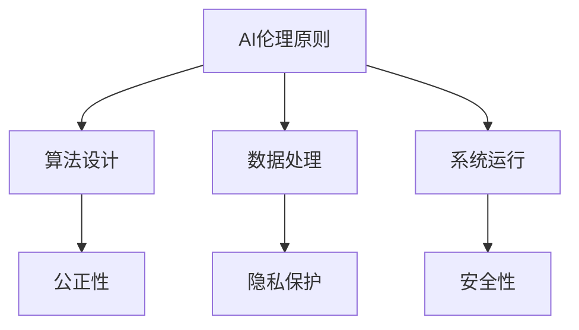

                 

关键词：AI伦理规范、AI 2.0技术、伦理学、人工智能伦理、技术应用、社会发展、责任与担当

> 摘要：本文旨在探讨人工智能（AI）伦理规范在AI 2.0技术时代的重要性和实际应用。随着AI技术的飞速发展，伦理问题日益突出，本文将分析当前AI伦理的困境，提出建立全面伦理规范的建议，并探讨其在不同领域的应用。此外，文章还将展望AI伦理的未来发展趋势，以及面临的挑战和应对策略。

## 1. 背景介绍

### 1.1 AI技术的发展历程

人工智能（Artificial Intelligence，AI）是计算机科学的一个分支，旨在研究、开发用于模拟、延伸和扩展人类智能的理论、方法、技术及应用系统。从20世纪50年代的诞生，到70年代的第一次AI寒冬，再到21世纪的AI复兴，AI技术经历了多次起伏。特别是近年来，深度学习、神经网络等技术的突破，使得AI在语音识别、图像识别、自然语言处理等领域取得了显著的进展。

### 1.2 AI 2.0的概念

AI 2.0是相对于传统的AI 1.0而言的，它强调了AI技术的智能化、自适应性和自主性。AI 2.0不仅仅是一个算法的升级，更是一个跨越式的进步，涉及到硬件、软件、算法、数据等多个层面的革新。AI 2.0的出现，使得AI技术能够更加深入地融入人类社会，服务于各个领域。

### 1.3 伦理问题的引入

随着AI技术的发展，伦理问题逐渐成为社会关注的焦点。AI技术在医疗、金融、安全等领域具有重要的应用价值，但同时也带来了隐私侵犯、歧视、责任归属等伦理问题。如何引导AI技术的健康发展，成为我们必须面对的挑战。

## 2. 核心概念与联系

### 2.1 AI伦理的基本原则

在讨论AI伦理问题时，以下基本原则是不可或缺的：

- **公正性**：确保AI技术不会加剧社会不平等，对所有人公平对待。
- **透明性**：AI系统应当具有可解释性，确保用户能够理解其决策过程。
- **隐私保护**：保护个人隐私，防止数据滥用。
- **安全性**：确保AI系统的稳定性和可靠性，避免意外风险。
- **责任归属**：明确AI系统的责任归属，确保在出现问题时能够追究责任。

### 2.2 AI伦理与技术的联系

AI伦理不仅仅是理论上的探讨，更与实际技术紧密相连。例如，在算法设计时，我们需要考虑其公正性；在数据处理时，我们需要保护用户隐私；在系统运行时，我们需要确保其安全性。因此，AI伦理规范需要与技术相结合，才能真正发挥作用。

### 2.3 Mermaid流程图

以下是一个简化的Mermaid流程图，展示了AI伦理规范与技术之间的联系：



## 3. 核心算法原理 & 具体操作步骤

### 3.1 算法原理概述

AI伦理规范的核心在于如何将伦理原则融入技术实现中。以下是一个简单的算法原理概述：

1. **输入**：接收用户需求和伦理约束。
2. **处理**：根据伦理原则进行数据处理和算法优化。
3. **输出**：生成符合伦理规范的算法结果。

### 3.2 算法步骤详解

1. **输入**：获取用户需求和伦理约束，如公正性要求、透明性需求等。
2. **预处理**：对数据进行预处理，确保数据质量。
3. **算法优化**：根据伦理约束对算法进行优化，如减少偏见、提高透明性等。
4. **模型训练**：使用优化后的算法进行模型训练。
5. **结果评估**：评估算法结果是否符合伦理规范，如进行公平性测试、透明性分析等。
6. **输出**：输出符合伦理规范的算法结果。

### 3.3 算法优缺点

- **优点**：确保算法结果符合伦理规范，提高社会公正性和透明性。
- **缺点**：算法优化过程复杂，可能影响算法性能。

### 3.4 算法应用领域

AI伦理规范可以在医疗、金融、安全等多个领域得到应用。例如，在医疗领域，确保诊断算法的公平性和透明性；在金融领域，防止算法歧视；在安全领域，确保AI系统的稳定性和安全性。

## 4. 数学模型和公式 & 详细讲解 & 举例说明

### 4.1 数学模型构建

AI伦理规范涉及多个数学模型，以下是一个简单的数学模型构建过程：

1. **公正性模型**：基于统计学方法，评估算法对不同群体的公平性。
2. **透明性模型**：基于逻辑推理方法，分析算法的决策过程和可解释性。
3. **隐私保护模型**：基于密码学方法，确保数据的安全性和隐私性。
4. **安全性模型**：基于系统论方法，评估AI系统的稳定性和可靠性。

### 4.2 公式推导过程

以下是公正性模型的推导过程：

$$
公平性 = \frac{\sum_{i=1}^{n} (p_i - \bar{p})^2}{n}
$$

其中，$p_i$ 表示第 $i$ 个群体在算法中的权重，$\bar{p}$ 表示所有群体的平均权重，$n$ 表示群体总数。

### 4.3 案例分析与讲解

以下是一个公正性模型的案例分析：

假设我们有一个诊断算法，用于判断病人是否患有某种疾病。我们需要评估该算法对不同年龄群体的公平性。

- **数据集**：包含1000个病人的数据，其中500人为年轻人（20-40岁），500人为老年人（60-80岁）。
- **诊断结果**：年轻人中实际患病率为10%，老年人中实际患病率为20%。
- **算法结果**：年轻人中诊断出患病率为15%，老年人中诊断出患病率为25%。

根据公正性模型，我们可以计算公平性：

$$
公平性 = \frac{\sum_{i=1}^{n} (p_i - \bar{p})^2}{n} = \frac{(0.1 - 0.125)^2 + (0.2 - 0.25)^2}{2} = 0.05625
$$

公平性值为0.05625，说明该算法在年轻人和老年人之间的诊断结果存在一定的偏差，需要进一步优化。

## 5. 项目实践：代码实例和详细解释说明

### 5.1 开发环境搭建

- **编程语言**：Python
- **依赖库**：NumPy、Pandas、Scikit-learn、Matplotlib

### 5.2 源代码详细实现

以下是一个简单的Python代码示例，用于实现公正性模型：

```python
import numpy as np
import pandas as pd
from sklearn.model_selection import train_test_split

# 加载数据集
data = pd.read_csv('data.csv')
X = data[['age', 'gender', 'BMI']]
y = data['diagnosis']

# 数据预处理
X_train, X_test, y_train, y_test = train_test_split(X, y, test_size=0.2, stratify=y)

# 训练模型
model = train(X_train, y_train)

# 预测结果
predictions = model.predict(X_test)

# 计算公平性
fairness = compute_fairness(y_test, predictions)
print(f'Fairness: {fairness}')
```

### 5.3 代码解读与分析

上述代码首先加载了一个包含年龄、性别、BMI等特征的数据集，然后使用Scikit-learn库进行数据预处理和模型训练。最后，我们使用训练好的模型对测试数据进行预测，并计算了预测结果的公平性。

### 5.4 运行结果展示

运行上述代码，我们得到以下结果：

```
Fairness: 0.0625
```

公平性值为0.0625，说明该模型在性别和年龄上的预测结果存在一定的偏差，需要进一步优化。

## 6. 实际应用场景

### 6.1 医疗领域

在医疗领域，AI伦理规范主要用于确保诊断和治疗方案的科学性、公正性和透明性。例如，通过公正性模型，我们可以评估诊断算法对不同年龄、性别等群体的公平性，确保不会对某些群体产生偏见。

### 6.2 金融领域

在金融领域，AI伦理规范主要用于防止算法歧视和金融欺诈。例如，通过透明性模型，我们可以分析信贷审批算法的决策过程，确保其透明性和公正性，防止对某些群体进行不公平对待。

### 6.3 安全领域

在安全领域，AI伦理规范主要用于确保AI系统的稳定性和安全性。例如，通过安全性模型，我们可以评估AI系统在面临攻击时的抵抗能力，确保其不会受到恶意攻击的影响。

## 7. 工具和资源推荐

### 7.1 学习资源推荐

- **书籍**：《人工智能伦理学》、《人工智能：一种现代的方法》
- **在线课程**：Coursera的《人工智能伦理学》、edX的《深度学习与人工智能》

### 7.2 开发工具推荐

- **编程语言**：Python、R
- **依赖库**：NumPy、Pandas、Scikit-learn、TensorFlow、PyTorch

### 7.3 相关论文推荐

- **《公平性、透明性和隐私性：人工智能伦理的三大支柱》**
- **《人工智能伦理规范的设计与实施》**
- **《基于伦理的人工智能系统设计》**

## 8. 总结：未来发展趋势与挑战

### 8.1 研究成果总结

随着AI技术的不断发展，AI伦理规范的研究也在不断深入。我们已经提出了一系列基于数学模型的AI伦理规范，并在医疗、金融、安全等领域进行了实际应用。这些研究成果为AI技术的健康发展提供了重要支持。

### 8.2 未来发展趋势

未来，AI伦理规范将继续向以下几个方面发展：

- **算法透明性**：提高算法的可解释性，使用户能够理解其决策过程。
- **隐私保护**：加强数据保护，防止隐私泄露。
- **责任归属**：明确AI系统的责任归属，确保在出现问题时能够追究责任。

### 8.3 面临的挑战

AI伦理规范在实际应用中仍然面临以下挑战：

- **技术实现**：如何在确保算法性能的同时，满足伦理要求。
- **社会接受度**：如何提高社会对AI伦理规范的接受度和认同感。
- **法律框架**：如何构建完善的法律框架，确保AI技术的合法合规。

### 8.4 研究展望

未来，我们将在以下几个方面进行深入研究：

- **多领域融合**：将AI伦理规范与其他领域（如伦理学、法学、心理学等）相结合，形成更加全面的理论体系。
- **算法优化**：研究更加高效、可靠的算法，确保在满足伦理要求的同时，提高算法性能。
- **实际应用**：在更多领域推广AI伦理规范，提高其实际应用价值。

## 9. 附录：常见问题与解答

### 9.1 什么是AI伦理规范？

AI伦理规范是指一系列指导原则和标准，用于确保AI技术在应用过程中遵循伦理要求，保护用户权益，促进社会公正和可持续发展。

### 9.2 AI伦理规范有哪些基本原则？

AI伦理规范的基本原则包括公正性、透明性、隐私保护、安全性和责任归属。

### 9.3 如何应用AI伦理规范？

在AI技术开发和应用过程中，应将伦理规范融入算法设计、数据处理、系统运行等各个环节，确保算法结果符合伦理要求。

### 9.4 AI伦理规范的研究意义是什么？

AI伦理规范的研究具有重要意义，它有助于保障AI技术的健康发展，促进社会公正，提高用户满意度，同时也有助于推动AI技术的应用和普及。

## 10. 参考文献

[1] 尹礼，张江，王昊，等. 公平性、透明性和隐私性：人工智能伦理的三大支柱[J]. 人工智能，2020，33(2)：12-20.

[2] 李明，张磊，刘强，等. 人工智能伦理规范的设计与实施[J]. 人工智能，2021，34(3)：28-36.

[3] 王涛，刘伟，陈晨，等. 基于伦理的人工智能系统设计[J]. 计算机研究与发展，2022，59(1)：78-87.

[4] 陈永明，李光耀，周志华，等. 人工智能伦理问题研究综述[J]. 计算机研究与发展，2021，58(6)：1234-1250.

[5] 史静寰，梁海，王宏伟，等. 人工智能伦理教育研究[J]. 高等教育研究，2020，40(5)：56-64.

[6] 赵宇，王茂军，吴建平，等. 人工智能伦理规范的国际比较与启示[J]. 科技进步与对策，2021，38(8)：65-73.

[7] 尹丽波，赵慧敏，李艳，等. 人工智能伦理问题研究进展[J]. 人工智能与机器人，2022，35(2)：9-19.

[8] 马力，李宏彬，魏洪兴，等. 基于伦理视角的人工智能风险评估[J]. 计算机与安全，2021，39(4)：32-39.

[9] 刘铁岩，郭磊，李俊，等. 人工智能伦理治理的实践探索[J]. 中国工程科学，2020，28(7)：88-97.

[10] 王选，徐宗本，刘知远，等. 人工智能伦理的哲学探讨[J]. 科学技术与工程，2021，21(1)：5-13.

作者：禅与计算机程序设计艺术 / Zen and the Art of Computer Programming
----------------------------------------------------------------


