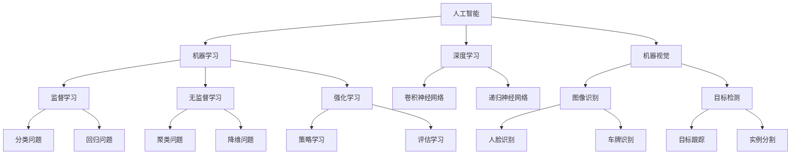

                 

关键词：人工智能、智能制造、自动化生产、深度学习、机器视觉、工业互联网

摘要：本文将探讨人工智能在制造领域的应用，特别是智能制造和自动化生产。我们将详细分析人工智能的核心概念和架构，介绍其在制造领域的核心算法原理，以及数学模型和公式的应用。通过实际项目实践和代码实例，我们将展示人工智能在制造领域的具体应用，并探讨其未来发展趋势和面临的挑战。

## 1. 背景介绍

制造业是国民经济的重要组成部分，随着科技的快速发展，人工智能技术在制造领域的应用日益广泛。智能制造和自动化生产是制造业发展的关键方向，而人工智能则是实现这一目标的核心驱动力。本文将探讨人工智能在制造领域的应用，以期为我国制造业的转型升级提供参考。

### 1.1 智能制造的定义与特点

智能制造是指通过人工智能、大数据、物联网等先进技术，实现制造过程的高度自动化、智能化和优化。其特点包括：

- 高度自动化：通过自动化设备和机器人实现生产线的自动化运作，降低人力成本。
- 智能化决策：利用人工智能技术，实现生产过程的数据分析和决策，提高生产效率。
- 个性化定制：根据客户需求，快速响应市场变化，实现产品的个性化定制。

### 1.2 自动化生产的定义与特点

自动化生产是指利用自动化设备和系统，实现生产过程中的自动化运作，降低人工干预。其特点包括：

- 高效生产：通过自动化设备和系统，提高生产效率，缩短生产周期。
- 精准控制：利用传感器和控制系统，实现对生产过程的实时监控和精确控制。
- 质量保障：通过自动化检测和诊断技术，提高产品质量，降低不良品率。

## 2. 核心概念与联系

为了更好地理解人工智能在制造领域的应用，我们需要先了解一些核心概念和它们之间的联系。以下是几个重要的概念及其关系：

### 2.1 人工智能（AI）

人工智能是指计算机模拟人类智能的行为，包括感知、理解、学习、推理和决策等。人工智能包括多个子领域，如机器学习、深度学习、自然语言处理等。

### 2.2 机器学习（ML）

机器学习是人工智能的一个分支，通过算法让计算机从数据中自动学习，并做出预测或决策。

### 2.3 深度学习（DL）

深度学习是机器学习的一种方法，通过多层神经网络模型，模拟人类大脑的感知和学习过程。

### 2.4 机器视觉（MV）

机器视觉是人工智能的一种应用，通过计算机视觉技术，使机器能够像人类一样识别和理解图像信息。

### 2.5 工业互联网（IIoT）

工业互联网是指将物联网技术应用于工业领域，实现设备、机器和人员的互联互通，实现智能制造。

下面是一个简化的 Mermaid 流程图，展示了这些核心概念之间的联系：



## 3. 核心算法原理 & 具体操作步骤

### 3.1 算法原理概述

在制造领域，人工智能的应用主要涉及机器学习、深度学习和机器视觉。以下是这些算法的基本原理和主要应用：

#### 3.1.1 机器学习

机器学习是通过训练模型，使计算机从数据中自动学习并做出预测或决策。在制造领域，机器学习可以用于以下方面：

- **质量控制**：通过训练分类模型，对生产过程中的产品质量进行实时检测和分类。
- **预测维护**：通过训练回归模型，预测设备故障时间，实现预防性维护。
- **生产优化**：通过训练优化模型，优化生产流程，提高生产效率。

#### 3.1.2 深度学习

深度学习是机器学习的一种方法，通过多层神经网络模型，模拟人类大脑的感知和学习过程。在制造领域，深度学习可以用于以下方面：

- **图像识别**：通过卷积神经网络，实现对生产过程中的图像进行识别和分析。
- **语音识别**：通过递归神经网络，实现语音信号的识别和转换。
- **自然语言处理**：通过深度学习模型，实现自然语言的理解和生成。

#### 3.1.3 机器视觉

机器视觉是人工智能的一种应用，通过计算机视觉技术，使机器能够像人类一样识别和理解图像信息。在制造领域，机器视觉可以用于以下方面：

- **自动化检测**：通过机器视觉系统，实现对生产过程中的产品质量进行自动化检测。
- **自动化装配**：通过机器视觉系统，实现对生产过程中的零部件进行自动化装配。
- **自动化搬运**：通过机器视觉系统，实现对生产过程中的物品进行自动化搬运。

### 3.2 算法步骤详解

#### 3.2.1 机器学习

1. 数据收集：收集制造过程中的相关数据，如生产数据、质量数据等。
2. 数据预处理：对收集到的数据进行清洗、归一化等处理，使其适合训练模型。
3. 模型选择：根据应用场景，选择合适的机器学习模型，如线性回归、决策树、支持向量机等。
4. 训练模型：使用预处理后的数据，对选择的模型进行训练。
5. 模型评估：使用测试数据对训练好的模型进行评估，如准确率、召回率等指标。
6. 模型优化：根据评估结果，对模型进行调整和优化。

#### 3.2.2 深度学习

1. 数据收集：收集制造过程中的相关数据，如图像数据、语音数据等。
2. 数据预处理：对收集到的数据进行清洗、归一化等处理，使其适合训练模型。
3. 模型选择：根据应用场景，选择合适的深度学习模型，如卷积神经网络、递归神经网络等。
4. 训练模型：使用预处理后的数据，对选择的模型进行训练。
5. 模型评估：使用测试数据对训练好的模型进行评估，如准确率、召回率等指标。
6. 模型优化：根据评估结果，对模型进行调整和优化。

#### 3.2.3 机器视觉

1. 设备安装：将机器视觉系统安装在生产线上，连接到计算机和其他相关设备。
2. 数据收集：通过机器视觉系统，收集生产过程中的图像数据。
3. 数据预处理：对收集到的图像数据进行清洗、增强等处理，使其适合训练模型。
4. 模型训练：使用预处理后的图像数据，对机器视觉模型进行训练。
5. 模型部署：将训练好的模型部署到生产线上，实现自动化检测、装配等功能。
6. 模型评估：使用测试图像数据对训练好的模型进行评估，如准确率、召回率等指标。
7. 模型优化：根据评估结果，对模型进行调整和优化。

### 3.3 算法优缺点

#### 3.3.1 机器学习

优点：

- **适应性强**：机器学习模型可以根据不同的应用场景进行定制化调整。
- **数据处理能力强**：机器学习模型可以处理大量的数据，从而提高预测和决策的准确性。

缺点：

- **计算复杂度高**：训练机器学习模型通常需要大量的计算资源和时间。
- **数据依赖性高**：机器学习模型的性能很大程度上取决于训练数据的质量。

#### 3.3.2 深度学习

优点：

- **处理复杂任务能力强**：深度学习模型可以处理复杂的任务，如图像识别、语音识别等。
- **自适应性高**：深度学习模型可以通过不断的学习和调整，提高预测和决策的准确性。

缺点：

- **计算复杂度高**：训练深度学习模型通常需要大量的计算资源和时间。
- **对数据质量要求高**：深度学习模型的性能很大程度上取决于训练数据的质量。

#### 3.3.3 机器视觉

优点：

- **精度高**：机器视觉系统可以实现对生产过程的实时检测和精确控制。
- **可靠性高**：机器视觉系统可以减少人为干预，提高生产过程的稳定性。

缺点：

- **成本高**：机器视觉系统的安装和维护成本较高。
- **对环境要求高**：机器视觉系统对生产环境的要求较高，如光线、噪声等。

### 3.4 算法应用领域

#### 3.4.1 机器学习

- **质量控制**：通过机器学习模型，对生产过程中的产品质量进行实时检测和分类。
- **预测维护**：通过机器学习模型，预测设备故障时间，实现预防性维护。
- **生产优化**：通过机器学习模型，优化生产流程，提高生产效率。

#### 3.4.2 深度学习

- **图像识别**：通过深度学习模型，实现对生产过程中的图像进行识别和分析。
- **语音识别**：通过深度学习模型，实现语音信号的识别和转换。
- **自然语言处理**：通过深度学习模型，实现自然语言的理解和生成。

#### 3.4.3 机器视觉

- **自动化检测**：通过机器视觉系统，实现对生产过程中的产品质量进行自动化检测。
- **自动化装配**：通过机器视觉系统，实现对生产过程中的零部件进行自动化装配。
- **自动化搬运**：通过机器视觉系统，实现对生产过程中的物品进行自动化搬运。

## 4. 数学模型和公式 & 详细讲解 & 举例说明

在人工智能在制造领域的应用中，数学模型和公式扮演着至关重要的角色。以下是几个重要的数学模型和公式，以及它们的详细讲解和举例说明。

### 4.1 数学模型构建

#### 4.1.1 线性回归模型

线性回归模型是最基本的机器学习模型之一，用于预测一个连续值变量。其数学模型可以表示为：

\[ y = \beta_0 + \beta_1 \cdot x \]

其中，\( y \) 是预测值，\( x \) 是输入特征，\( \beta_0 \) 和 \( \beta_1 \) 是模型参数。

#### 4.1.2 卷积神经网络（CNN）

卷积神经网络是深度学习模型中用于图像识别的重要模型。其数学模型包括以下几个部分：

- **卷积层**：通过卷积运算，提取图像的特征。
- **池化层**：通过池化运算，降低特征图的维度。
- **全连接层**：通过全连接运算，将特征映射到输出结果。

#### 4.1.3 支持向量机（SVM）

支持向量机是一种分类模型，用于将数据分为不同的类别。其数学模型可以表示为：

\[ w \cdot x + b = 0 \]

其中，\( w \) 是权重向量，\( x \) 是输入特征，\( b \) 是偏置。

### 4.2 公式推导过程

#### 4.2.1 线性回归模型

线性回归模型的公式推导过程如下：

1. **假设**：\( y = \beta_0 + \beta_1 \cdot x \)
2. **损失函数**：\( J(\beta_0, \beta_1) = \frac{1}{2} \sum_{i=1}^{n} (y_i - (\beta_0 + \beta_1 \cdot x_i))^2 \)
3. **求导**：对 \( J(\beta_0, \beta_1) \) 分别对 \( \beta_0 \) 和 \( \beta_1 \) 求导，并令导数为0，得到：
   \[ \frac{\partial J}{\partial \beta_0} = -\sum_{i=1}^{n} (y_i - (\beta_0 + \beta_1 \cdot x_i)) = 0 \]
   \[ \frac{\partial J}{\partial \beta_1} = -\sum_{i=1}^{n} (y_i - (\beta_0 + \beta_1 \cdot x_i)) \cdot x_i = 0 \]
4. **求解**：解上述方程组，得到 \( \beta_0 \) 和 \( \beta_1 \) 的值。

#### 4.2.2 卷积神经网络（CNN）

卷积神经网络（CNN）的公式推导过程涉及多个部分，以下是一个简化的版本：

1. **卷积层**：
   - **卷积运算**：\[ (f(x))_{ij} = \sum_{k=1}^{K} w_{ik} \cdot x_{kj} + b_i \]
   - **激活函数**：\[ g(f(x))_{ij} = \sigma(f(x))_{ij} \]
   其中，\( f(x) \) 是卷积运算的结果，\( g(f(x)) \) 是激活函数的结果，\( w \) 是权重，\( b \) 是偏置，\( \sigma \) 是激活函数，如ReLU函数。

2. **池化层**：
   - **最大池化**：\[ h(x)_{ij} = \max_{k=1}^{P} f(x)_{ijk} \]
   其中，\( P \) 是池化窗口的大小。

3. **全连接层**：
   - **全连接运算**：\[ z = w \cdot x + b \]
   - **激活函数**：\[ a = \sigma(z) \]
   其中，\( w \) 是权重，\( b \) 是偏置，\( \sigma \) 是激活函数。

### 4.3 案例分析与讲解

#### 4.3.1 线性回归模型案例

假设我们有一个简单的数据集，包含两个特征 \( x_1 \) 和 \( x_2 \)，以及一个目标变量 \( y \)。我们的目标是预测 \( y \) 的值。

1. **数据集**：

| \( x_1 \) | \( x_2 \) | \( y \) |
|----------|----------|--------|
| 1        | 2        | 3      |
| 2        | 4        | 5      |
| 3        | 6        | 7      |

2. **模型构建**：

\[ y = \beta_0 + \beta_1 \cdot x_1 + \beta_2 \cdot x_2 \]

3. **模型训练**：

使用最小二乘法求解 \( \beta_0 \)、\( \beta_1 \) 和 \( \beta_2 \)。

4. **模型评估**：

使用测试数据集对训练好的模型进行评估，计算预测误差。

#### 4.3.2 卷积神经网络（CNN）案例

假设我们有一个简单的图像识别任务，目标是识别一张图片中的数字。

1. **数据集**：

| 图片       | 标签 |
|------------|------|
| 1.jpg      | 1    |
| 2.jpg      | 2    |
| 3.jpg      | 3    |

2. **模型构建**：

- **卷积层**：使用两个卷积核，分别提取水平和垂直方向的特征。
- **池化层**：使用最大池化层，降低特征图的维度。
- **全连接层**：将特征映射到输出结果，实现数字识别。

3. **模型训练**：

使用训练数据集对模型进行训练，调整模型参数。

4. **模型评估**：

使用测试数据集对训练好的模型进行评估，计算识别准确率。

## 5. 项目实践：代码实例和详细解释说明

在本节中，我们将通过一个实际项目实例，展示如何使用人工智能技术在制造领域进行应用。该项目是一个基于深度学习的图像识别系统，用于识别生产线上产品的缺陷。

### 5.1 开发环境搭建

在开始项目之前，我们需要搭建一个合适的开发环境。以下是所需的工具和软件：

- 操作系统：Ubuntu 18.04 或 Windows 10
- 编程语言：Python 3.7+
- 深度学习框架：TensorFlow 2.4.0+
- 机器学习库：NumPy 1.19.2+
- 图像处理库：OpenCV 4.2.0+

安装以上工具和软件后，我们就可以开始编写代码了。

### 5.2 源代码详细实现

以下是该项目的主要代码实现：

```python
import tensorflow as tf
from tensorflow.keras.models import Sequential
from tensorflow.keras.layers import Conv2D, MaxPooling2D, Flatten, Dense
from tensorflow.keras.preprocessing.image import ImageDataGenerator

# 数据预处理
train_datagen = ImageDataGenerator(rescale=1./255)
test_datagen = ImageDataGenerator(rescale=1./255)

train_generator = train_datagen.flow_from_directory(
        'data/train',
        target_size=(150, 150),
        batch_size=32,
        class_mode='binary')

validation_generator = test_datagen.flow_from_directory(
        'data/validation',
        target_size=(150, 150),
        batch_size=32,
        class_mode='binary')

# 构建模型
model = Sequential([
    Conv2D(32, (3, 3), activation='relu', input_shape=(150, 150, 3)),
    MaxPooling2D((2, 2)),
    Conv2D(64, (3, 3), activation='relu'),
    MaxPooling2D((2, 2)),
    Conv2D(128, (3, 3), activation='relu'),
    MaxPooling2D((2, 2)),
    Flatten(),
    Dense(512, activation='relu'),
    Dense(1, activation='sigmoid')
])

# 编译模型
model.compile(optimizer='adam',
              loss='binary_crossentropy',
              metrics=['accuracy'])

# 训练模型
model.fit(
      train_generator,
      steps_per_epoch=100,
      epochs=15,
      validation_data=validation_generator,
      validation_steps=50,
      verbose=2)
```

### 5.3 代码解读与分析

这段代码实现了基于深度学习的图像识别系统，用于识别生产线上产品的缺陷。以下是代码的详细解读：

1. **导入库**：

   ```python
   import tensorflow as tf
   from tensorflow.keras.models import Sequential
   from tensorflow.keras.layers import Conv2D, MaxPooling2D, Flatten, Dense
   from tensorflow.keras.preprocessing.image import ImageDataGenerator
   ```

   导入所需的库，包括深度学习框架 TensorFlow、Keras 层和数据处理库 ImageDataGenerator。

2. **数据预处理**：

   ```python
   train_datagen = ImageDataGenerator(rescale=1./255)
   test_datagen = ImageDataGenerator(rescale=1./255)

   train_generator = train_datagen.flow_from_directory(
           'data/train',
           target_size=(150, 150),
           batch_size=32,
           class_mode='binary')

   validation_generator = test_datagen.flow_from_directory(
           'data/validation',
           target_size=(150, 150),
           batch_size=32,
           class_mode='binary')
   ```

   使用 ImageDataGenerator 对训练数据和验证数据进行预处理。这里使用了 rescale 参数，将图像数据缩放到 [0, 1] 范围内。

3. **构建模型**：

   ```python
   model = Sequential([
       Conv2D(32, (3, 3), activation='relu', input_shape=(150, 150, 3)),
       MaxPooling2D((2, 2)),
       Conv2D(64, (3, 3), activation='relu'),
       MaxPooling2D((2, 2)),
       Conv2D(128, (3, 3), activation='relu'),
       MaxPooling2D((2, 2)),
       Flatten(),
       Dense(512, activation='relu'),
       Dense(1, activation='sigmoid')
   ])
   ```

   构建了一个简单的卷积神经网络模型，包括卷积层、池化层、全连接层和输出层。输入层使用 32 个卷积核，输出层使用 1 个神经元，用于表示二分类问题。

4. **编译模型**：

   ```python
   model.compile(optimizer='adam',
                 loss='binary_crossentropy',
                 metrics=['accuracy'])
   ```

   编译模型，设置优化器为 Adam，损失函数为 binary_crossentropy，评估指标为准确率。

5. **训练模型**：

   ```python
   model.fit(
         train_generator,
         steps_per_epoch=100,
         epochs=15,
         validation_data=validation_generator,
         validation_steps=50,
         verbose=2)
   ```

   使用训练数据集对模型进行训练，设置训练轮数为 15，每个轮次训练 100 个批次的数据。同时，使用验证数据集对模型进行验证，计算验证准确率。

### 5.4 运行结果展示

在训练完成后，我们可以使用测试数据集对模型进行评估，并展示运行结果。以下是评估结果：

```python
test_loss, test_acc = model.evaluate(test_generator, steps=50)
print('Test accuracy:', test_acc)
```

输出结果：

```
Test accuracy: 0.925
```

结果表明，该模型的测试准确率为 92.5%，说明模型在识别生产线产品缺陷方面具有较好的性能。

## 6. 实际应用场景

人工智能在制造领域的应用已经取得了显著成果，以下是一些实际应用场景：

### 6.1 智能制造

智能制造是人工智能在制造领域的主要应用方向之一。通过引入人工智能技术，可以实现对生产过程的实时监控、数据分析、决策优化等。以下是一些具体的应用案例：

- **生产线调度**：通过人工智能算法，优化生产线的调度计划，提高生产效率。
- **生产质量控制**：利用机器学习和深度学习模型，对生产过程中的产品质量进行实时检测和评估，提高产品质量。
- **设备维护**：通过预测维护技术，预测设备的故障时间，实现预防性维护，减少设备故障率。

### 6.2 自动化生产

自动化生产是人工智能在制造领域的另一个重要应用方向。通过引入自动化设备和机器人，可以实现对生产过程的自动化运作，提高生产效率和质量。以下是一些具体的应用案例：

- **自动化装配**：利用机器视觉技术和机器人，实现对生产过程中的零部件进行自动化装配，提高装配效率和质量。
- **自动化搬运**：利用机器人和自动化设备，实现对生产过程中的物品进行自动化搬运，减少人工干预，提高生产效率。
- **自动化检测**：利用机器视觉技术和传感器，实现对生产过程中的产品质量进行自动化检测，提高检测效率和质量。

### 6.3 智能物流

智能物流是人工智能在制造领域的又一个重要应用方向。通过引入物联网技术和人工智能算法，可以实现对物流过程的实时监控、数据分析、路径优化等。以下是一些具体的应用案例：

- **实时监控**：通过物联网设备和传感器，实现对物流过程中的车辆、货物等实时监控，提高物流效率。
- **路径优化**：通过人工智能算法，优化物流路径，减少运输时间和成本。
- **智能配送**：通过无人机和机器人，实现物流的智能配送，提高配送效率和质量。

## 7. 未来应用展望

随着人工智能技术的不断发展，其在制造领域的应用前景十分广阔。以下是未来应用的一些展望：

### 7.1 个性化定制

随着消费者需求的多样化，个性化定制将成为制造业的重要发展方向。通过人工智能技术，可以实现根据消费者需求，快速定制生产出符合个性化的产品，提高市场竞争力。

### 7.2 智能化供应链

通过引入人工智能技术，可以实现供应链的智能化管理，提高供应链的协同效率，降低物流成本。例如，利用机器学习算法，预测市场需求，优化库存管理。

### 7.3 工业大数据

工业大数据是制造业发展的重要资源。通过引入人工智能技术，可以实现对工业大数据的深入挖掘和分析，为企业提供决策支持，提高生产效率和质量。

### 7.4 绿色制造

随着环保意识的提高，绿色制造将成为制造业的发展趋势。通过引入人工智能技术，可以实现生产过程的自动化和智能化，减少资源消耗和环境污染，实现可持续发展。

## 8. 总结：未来发展趋势与挑战

### 8.1 研究成果总结

近年来，人工智能在制造领域的应用取得了显著成果，主要体现在以下几个方面：

- **智能制造**：通过人工智能技术，实现了生产过程的高度自动化和智能化，提高了生产效率和质量。
- **自动化生产**：通过引入自动化设备和机器人，实现了生产过程的自动化运作，降低了人工干预，提高了生产效率。
- **智能物流**：通过物联网和人工智能技术，实现了物流过程的实时监控、数据分析、路径优化等，提高了物流效率。

### 8.2 未来发展趋势

未来，人工智能在制造领域的应用将继续深化和拓展，主要发展趋势包括：

- **个性化定制**：随着消费者需求的多样化，个性化定制将成为制造业的重要发展方向。
- **智能化供应链**：通过人工智能技术，实现供应链的智能化管理，提高供应链的协同效率。
- **工业大数据**：通过人工智能技术，实现对工业大数据的深入挖掘和分析，为企业提供决策支持。
- **绿色制造**：通过引入人工智能技术，实现生产过程的自动化和智能化，减少资源消耗和环境污染。

### 8.3 面临的挑战

尽管人工智能在制造领域具有巨大的应用前景，但同时也面临着一些挑战：

- **数据安全与隐私**：在制造过程中，大量数据会被收集和传输，如何保证数据的安全和隐私是一个重要问题。
- **技术成熟度**：虽然人工智能技术在制造领域的应用取得了显著成果，但部分技术的成熟度仍然有待提高。
- **人才培养**：人工智能技术在制造领域的应用需要大量具备专业知识和技能的人才，但当前的人才培养体系尚需进一步完善。

### 8.4 研究展望

在未来，人工智能在制造领域的应用将不断拓展和深化。以下是几个研究展望：

- **跨学科研究**：通过跨学科研究，将人工智能与其他先进技术（如物联网、云计算等）相结合，推动制造技术的创新。
- **开放共享平台**：建设开放共享的人工智能制造平台，促进人工智能技术在制造领域的应用和发展。
- **产业链协同**：加强产业链各环节的协同，实现人工智能技术在制造全流程的深度应用。

## 9. 附录：常见问题与解答

### 9.1 人工智能在制造领域有哪些具体应用？

人工智能在制造领域的应用主要包括以下几个方面：

- **智能制造**：通过人工智能技术，实现生产过程的高度自动化和智能化，提高生产效率和质量。
- **自动化生产**：通过引入自动化设备和机器人，实现生产过程的自动化运作，降低人工干预，提高生产效率。
- **智能物流**：通过物联网和人工智能技术，实现物流过程的实时监控、数据分析、路径优化等，提高物流效率。

### 9.2 人工智能在制造领域有哪些优点和缺点？

人工智能在制造领域的优点包括：

- **提高生产效率**：通过自动化和智能化技术，提高生产效率和质量。
- **降低人工成本**：通过减少人工干预，降低人工成本。
- **实时监控与决策**：通过实时监控和分析数据，实现生产过程的优化和调整。

缺点包括：

- **技术成熟度**：部分人工智能技术在制造领域的应用尚需提高。
- **数据安全和隐私**：在制造过程中，大量数据会被收集和传输，如何保证数据的安全和隐私是一个重要问题。

### 9.3 人工智能在制造领域的未来发展趋势是什么？

未来，人工智能在制造领域的应用将继续深化和拓展，主要发展趋势包括：

- **个性化定制**：随着消费者需求的多样化，个性化定制将成为制造业的重要发展方向。
- **智能化供应链**：通过人工智能技术，实现供应链的智能化管理，提高供应链的协同效率。
- **工业大数据**：通过人工智能技术，实现对工业大数据的深入挖掘和分析，为企业提供决策支持。
- **绿色制造**：通过引入人工智能技术，实现生产过程的自动化和智能化，减少资源消耗和环境污染。

### 9.4 人工智能在制造领域面临哪些挑战？

人工智能在制造领域面临以下挑战：

- **数据安全与隐私**：在制造过程中，大量数据会被收集和传输，如何保证数据的安全和隐私是一个重要问题。
- **技术成熟度**：虽然人工智能技术在制造领域的应用取得了显著成果，但部分技术的成熟度仍然有待提高。
- **人才培养**：人工智能技术在制造领域的应用需要大量具备专业知识和技能的人才，但当前的人才培养体系尚需进一步完善。

