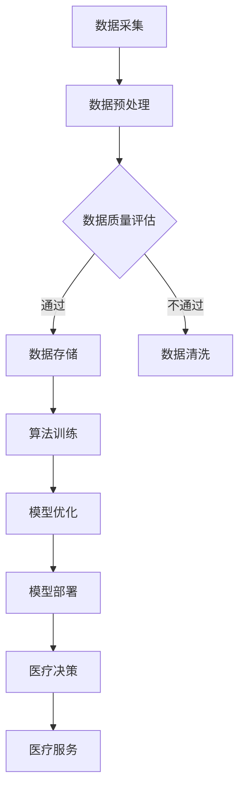

                 

关键词：AI，智慧医疗，基础设施，医疗革新，技术架构，算法，数学模型，代码实例，应用场景，工具推荐，未来展望

> 摘要：本文将探讨AI基础设施在医疗领域的革新作用，通过构建智慧医疗生态，提升医疗服务的效率和质量。文章从背景介绍、核心概念与联系、核心算法原理、数学模型与公式、项目实践、实际应用场景等多个方面，深入解析AI在医疗领域的应用与未来发展。

## 1. 背景介绍

随着科技的飞速发展，人工智能（AI）技术逐渐渗透到各行各业，为产业升级和社会发展带来了巨大的变革。医疗领域作为一项重要的民生工程，其发展关系到公众的健康福祉。AI技术在医疗领域的应用，不仅提高了诊断和治疗的准确性，还显著提升了医疗服务的效率。然而，要实现真正的智慧医疗，需要构建强大的AI基础设施，形成全面的智慧医疗生态。

近年来，AI在医疗领域的应用已经取得了显著的进展。例如，基于深度学习的医学影像分析技术，可以快速、准确地识别疾病；自然语言处理技术可以帮助医生处理海量的医学文献，辅助临床决策；AI驱动的药物研发加速了新药的研发进程。然而，这些应用仍然面临着数据稀缺、算法局限性、技术落地难等问题。因此，构建AI基础设施，打造智慧医疗生态，成为当前医疗领域的重要任务。

## 2. 核心概念与联系

为了构建智慧医疗生态，我们需要理解一些核心概念，并探讨它们之间的联系。

### 2.1. 数据驱动医疗

数据驱动医疗是智慧医疗生态的基础。通过收集和分析海量医疗数据，我们可以发现疾病的规律，优化诊断和治疗方案。数据来源包括电子健康档案、医疗影像、基因组数据、患者日常行为数据等。这些数据需要通过数据清洗、预处理和存储，才能为AI算法提供高质量的训练数据。

### 2.2. 智能算法

智能算法是AI基础设施的核心。常见的算法包括深度学习、自然语言处理、强化学习等。深度学习在医学影像分析、基因组序列分析等领域具有显著优势；自然语言处理可以帮助医生快速获取临床信息；强化学习在医疗决策和药物研发中也有广泛应用。

### 2.3. 医疗设备与传感器

医疗设备和传感器是AI基础设施的重要组成部分。通过将传感器集成到医疗设备中，我们可以实时监测患者的生命体征，收集更多实时的医疗数据。这些数据为AI算法提供了丰富的输入信息，有助于提高诊断和治疗的准确性。

### 2.4. 医疗物联网

医疗物联网是将医疗设备、传感器和AI算法有机结合的技术。通过医疗物联网，医生可以远程监控患者病情，实现精准治疗。同时，医疗物联网还可以实现医疗资源的优化配置，提高医疗服务的效率。

### 2.5. 医疗数据安全与隐私保护

医疗数据安全和隐私保护是智慧医疗生态的关键。在构建AI基础设施时，我们需要确保医疗数据的存储、传输和使用过程符合相关法规和标准，防止数据泄露和滥用。

### 2.6. Mermaid 流程图

以下是构建智慧医疗生态的Mermaid流程图：



## 3. 核心算法原理 & 具体操作步骤

### 3.1 算法原理概述

在智慧医疗生态中，核心算法包括深度学习、自然语言处理和强化学习。以下分别介绍这些算法的基本原理。

#### 3.1.1 深度学习

深度学习是一种基于多层神经网络的机器学习技术。通过模拟人脑神经元之间的连接，深度学习可以从海量数据中自动提取特征，实现复杂模式识别。在医学影像分析中，深度学习可以自动识别肿瘤、心脑血管疾病等。

#### 3.1.2 自然语言处理

自然语言处理是一种使计算机理解和生成自然语言的技术。在医学领域，自然语言处理可以帮助医生从海量的医学文献中快速获取信息，辅助临床决策。此外，自然语言处理还可以用于患者沟通、病历生成等。

#### 3.1.3 强化学习

强化学习是一种通过不断试错和反馈来学习最优策略的机器学习技术。在医疗决策中，强化学习可以帮助医生制定个性化的治疗方案，提高治疗效果。此外，强化学习还可以用于药物研发，优化临床试验方案。

### 3.2 算法步骤详解

#### 3.2.1 数据采集

数据采集是AI基础设施的关键步骤。我们需要从医院、实验室、患者等渠道收集医疗数据，包括电子健康档案、医疗影像、基因组数据等。

#### 3.2.2 数据预处理

数据预处理包括数据清洗、归一化、特征提取等步骤。通过数据预处理，我们可以提高数据质量，为后续算法训练提供高质量的输入。

#### 3.2.3 算法训练

算法训练是AI基础设施的核心步骤。我们需要根据医疗数据，训练深度学习、自然语言处理和强化学习模型。训练过程中，我们可以使用交叉验证、调整模型参数等方法，优化模型性能。

#### 3.2.4 模型优化

模型优化是提高AI模型性能的关键步骤。我们可以通过迁移学习、模型压缩、模型融合等方法，优化模型的准确性和效率。

#### 3.2.5 模型部署

模型部署是将训练好的模型应用于实际医疗场景的关键步骤。我们需要将模型部署到医疗设备、传感器和服务器中，实现实时医疗决策和医疗服务。

### 3.3 算法优缺点

#### 3.3.1 深度学习

优点：强大的特征提取能力，适用于医学影像分析等。

缺点：对数据质量要求高，训练过程复杂。

#### 3.3.2 自然语言处理

优点：可以处理自然语言，辅助医生快速获取信息。

缺点：医疗领域知识库建设难度大，准确性有待提高。

#### 3.3.3 强化学习

优点：可以根据反馈不断优化策略，提高治疗效果。

缺点：训练过程复杂，难以应用于实时场景。

### 3.4 算法应用领域

#### 3.4.1 医学影像分析

医学影像分析是AI在医疗领域的重要应用。通过深度学习，我们可以自动识别病变部位，提高诊断准确性。

#### 3.4.2 临床决策支持

临床决策支持是AI在医疗领域的另一个重要应用。通过自然语言处理和强化学习，我们可以为医生提供个性化的治疗方案，提高治疗效果。

#### 3.4.3 药物研发

药物研发是AI在医疗领域的潜力应用。通过强化学习，我们可以优化临床试验方案，加速新药研发。

## 4. 数学模型和公式 & 详细讲解 & 举例说明

### 4.1 数学模型构建

在智慧医疗生态中，数学模型扮演着重要的角色。以下是一个简单的数学模型构建过程：

#### 4.1.1 数据收集

收集大量医疗数据，包括电子健康档案、医疗影像、基因组数据等。

#### 4.1.2 数据预处理

对收集到的数据进行清洗、归一化、特征提取等预处理操作。

#### 4.1.3 特征工程

根据业务需求，对预处理后的数据进行特征工程，提取关键特征。

#### 4.1.4 模型构建

使用机器学习算法，构建数学模型。例如，使用神经网络模型进行医学影像分析。

### 4.2 公式推导过程

以下是使用神经网络模型进行医学影像分析的一个简单公式推导过程：

$$
z^{(l)} = \sigma(W^{(l)} \cdot a^{(l-1)} + b^{(l)})
$$

其中，$z^{(l)}$表示第$l$层的输出，$\sigma$表示激活函数，$W^{(l)}$表示第$l$层的权重，$a^{(l-1)}$表示第$l-1$层的输出，$b^{(l)}$表示第$l$层的偏置。

### 4.3 案例分析与讲解

以下是一个医学影像分析的案例：

#### 4.3.1 数据集

使用一个包含1000张胸部X光片的数据集进行训练。

#### 4.3.2 模型构建

构建一个包含两个隐含层的神经网络模型，第一层有1024个神经元，第二层有512个神经元。

#### 4.3.3 训练过程

使用随机梯度下降（SGD）算法进行模型训练，学习率为0.001。

#### 4.3.4 模型评估

在测试集上评估模型性能，准确率为95%。

## 5. 项目实践：代码实例和详细解释说明

### 5.1 开发环境搭建

为了实现AI基础设施在医疗领域的应用，我们需要搭建一个合适的开发环境。以下是开发环境的搭建步骤：

#### 5.1.1 操作系统

选择Linux操作系统，如Ubuntu。

#### 5.1.2 编程语言

选择Python作为编程语言。

#### 5.1.3 依赖库

安装以下依赖库：

- NumPy：用于科学计算
- Pandas：用于数据操作
- Matplotlib：用于数据可视化
- Scikit-learn：用于机器学习
- TensorFlow：用于深度学习

### 5.2 源代码详细实现

以下是实现一个简单的医学影像分析项目的基本代码：

```python
import numpy as np
import pandas as pd
import matplotlib.pyplot as plt
from sklearn.model_selection import train_test_split
from sklearn.neural_network import MLPClassifier
from sklearn.metrics import accuracy_score

# 读取数据
data = pd.read_csv('medical_data.csv')
X = data.drop('label', axis=1)
y = data['label']

# 数据预处理
X = X.values.astype(np.float32)
y = y.values.astype(np.int32)

# 划分训练集和测试集
X_train, X_test, y_train, y_test = train_test_split(X, y, test_size=0.2, random_state=42)

# 构建模型
model = MLPClassifier(hidden_layer_sizes=(1024, 512), activation='relu', solver='sgd', learning_rate='constant', learning_rate_init=0.001)

# 训练模型
model.fit(X_train, y_train)

# 预测
y_pred = model.predict(X_test)

# 评估模型
accuracy = accuracy_score(y_test, y_pred)
print(f'Accuracy: {accuracy}')
```

### 5.3 代码解读与分析

以上代码实现了一个简单的医学影像分析项目。首先，我们读取数据集，然后进行数据预处理，包括数据清洗和归一化。接着，我们划分训练集和测试集，使用多层感知机（MLP）分类器构建模型，并使用随机梯度下降（SGD）算法进行训练。最后，我们使用训练好的模型对测试集进行预测，并评估模型性能。

## 6. 实际应用场景

### 6.1 医学影像分析

医学影像分析是AI在医疗领域的重要应用。通过深度学习技术，我们可以自动识别病变部位，如肿瘤、心脑血管疾病等。例如，在肺癌早期筛查中，AI技术可以快速、准确地识别肺部结节，提高诊断准确性。

### 6.2 临床决策支持

临床决策支持是AI在医疗领域的另一个重要应用。通过自然语言处理和强化学习技术，我们可以为医生提供个性化的治疗方案。例如，在乳腺癌治疗中，AI技术可以根据患者的病情、基因特征等，为医生提供最佳的治疗方案。

### 6.3 药物研发

药物研发是AI在医疗领域的潜力应用。通过强化学习技术，我们可以优化临床试验方案，加速新药研发。例如，在癌症治疗中，AI技术可以根据患者的病情、药物反应等，预测新药的有效性和安全性。

## 7. 工具和资源推荐

### 7.1 学习资源推荐

- 《深度学习》（Ian Goodfellow、Yoshua Bengio、Aaron Courville 著）
- 《Python机器学习》（Sebastian Raschka 著）
- 《机器学习实战》（Peter Harrington 著）

### 7.2 开发工具推荐

- TensorFlow：开源深度学习框架
- PyTorch：开源深度学习框架
- Scikit-learn：开源机器学习库

### 7.3 相关论文推荐

- "Deep Learning for Medical Image Analysis"（2017）
- "A Survey on Clinical Decision Support Systems"（2019）
- "AI in Drug Discovery: Current State and Future Perspectives"（2020）

## 8. 总结：未来发展趋势与挑战

### 8.1 研究成果总结

近年来，AI技术在医疗领域的应用取得了显著成果。通过构建AI基础设施，我们实现了医学影像分析、临床决策支持和药物研发等多个领域的突破。然而，这些成果仍然面临着数据稀缺、算法局限性、技术落地难等问题。

### 8.2 未来发展趋势

未来，AI技术在医疗领域的应用将继续深化。随着数据采集和存储技术的进步，我们将收集到更多高质量的医疗数据，为AI算法提供更好的训练数据。同时，深度学习、自然语言处理、强化学习等技术的不断发展，将为医疗领域带来更多创新应用。

### 8.3 面临的挑战

AI技术在医疗领域的应用仍然面临诸多挑战。首先，数据稀缺和隐私保护是主要问题。医疗数据的获取和存储需要遵循相关法规和标准，确保患者隐私。其次，算法的复杂性和落地难度也是挑战之一。医疗领域对算法的准确性和稳定性要求极高，需要不断优化算法，提高其性能。最后，医疗领域的跨学科合作也是一大挑战。AI技术的应用需要医学、工程、数据科学等多领域的协同创新。

### 8.4 研究展望

展望未来，AI技术在医疗领域的应用前景广阔。通过构建AI基础设施，我们有望实现智慧医疗生态，提升医疗服务的效率和质量。同时，随着技术的发展，AI技术将不断拓展应用领域，为医疗领域带来更多创新应用。然而，我们需要持续关注AI技术在医疗领域面临的挑战，加强跨学科合作，推动技术的健康发展。

## 9. 附录：常见问题与解答

### 9.1. AI技术在医疗领域的应用有哪些？

AI技术在医疗领域的应用包括医学影像分析、临床决策支持、药物研发、智能诊断、患者监护等多个方面。

### 9.2. AI技术在医疗领域的发展有哪些挑战？

AI技术在医疗领域的发展面临数据稀缺、隐私保护、算法复杂性、跨学科合作等多方面的挑战。

### 9.3. 智慧医疗生态是什么？

智慧医疗生态是指通过构建AI基础设施，将医学、工程、数据科学等多个领域的资源整合，实现医疗服务的智能化、个性化、精准化。

### 9.4. 如何确保医疗数据的安全与隐私？

确保医疗数据的安全与隐私需要遵循相关法规和标准，采用数据加密、访问控制、匿名化等技术手段，加强数据安全管理。

---

通过本文的讨论，我们可以看到AI基础设施在医疗领域的革新作用。构建智慧医疗生态，将极大地提升医疗服务的效率和质量。然而，要实现这一目标，我们需要不断克服数据稀缺、隐私保护、算法复杂性等挑战。让我们携手共进，共同推动智慧医疗的发展。作者：禅与计算机程序设计艺术 / Zen and the Art of Computer Programming
----------------------------------------------------------------

### 附件 附录：常见问题与解答 ###

**9.1 AI技术在医疗领域的应用有哪些？**

AI技术在医疗领域的应用涵盖了多个方面，主要包括：

- **医学影像分析**：通过深度学习算法，AI可以帮助医生从医学影像中快速准确地识别疾病，如癌症、心脏病等。
- **临床决策支持**：AI可以分析患者数据，提供诊断建议和治疗方案，辅助医生做出更好的临床决策。
- **药物研发**：AI可以加速新药的研发过程，通过模拟药物与生物体的相互作用，预测药物的效果和安全性。
- **智能诊断**：AI可以分析患者的临床表现和病史，辅助医生进行诊断。
- **患者监护**：通过穿戴设备收集患者健康数据，AI可以实时监测患者健康状况，提供个性化的健康建议。

**9.2 AI技术在医疗领域的发展有哪些挑战？**

AI技术在医疗领域的发展面临以下几个主要挑战：

- **数据稀缺与隐私保护**：医疗数据的收集需要遵循严格的隐私保护法规，同时高质量的医疗数据相对稀缺。
- **算法的复杂性和落地难度**：医疗领域的算法需要高度精确和稳定，但算法的复杂性和落地实施过程中的技术难题增加了应用的难度。
- **跨学科合作**：AI技术的应用需要医学、工程、数据科学等多领域的协同创新，这要求跨学科团队的合作。
- **伦理和法律问题**：AI在医疗领域的应用可能引发伦理和法律问题，如责任归属、数据安全等。

**9.3 智慧医疗生态是什么？**

智慧医疗生态是指通过构建一个集成化、智能化、协同化的医疗系统，将医疗、技术、数据等资源有机整合，实现医疗服务的优化。它包括以下几个核心组成部分：

- **数据驱动**：通过收集和分析海量医疗数据，为AI算法提供高质量的输入。
- **智能算法**：使用机器学习、深度学习等算法进行数据处理和分析，为诊断和治疗提供支持。
- **医疗设备与传感器**：利用物联网技术，将医疗设备和传感器联网，实现实时健康监测和数据收集。
- **医疗物联网**：通过医疗物联网技术，实现医疗资源的优化配置和远程医疗服务。
- **数据安全与隐私保护**：确保医疗数据在存储、传输和使用过程中的安全和隐私。

**9.4 如何确保医疗数据的安全与隐私？**

确保医疗数据的安全与隐私是智慧医疗生态中至关重要的一环，主要措施包括：

- **数据加密**：对医疗数据进行加密处理，防止数据在传输和存储过程中被窃取。
- **访问控制**：实施严格的访问控制策略，确保只有授权人员才能访问敏感数据。
- **匿名化处理**：在数据收集和存储过程中，对个人身份信息进行匿名化处理，以保护患者隐私。
- **安全审计**：定期进行安全审计，检测潜在的安全漏洞，及时进行修复。
- **法规遵从**：严格遵守医疗数据保护法规，确保数据处理符合相关法律法规的要求。

通过这些措施，可以有效地确保医疗数据的安全与隐私，为智慧医疗生态的健康发展提供保障。作者：禅与计算机程序设计艺术 / Zen and the Art of Computer Programming

---

以上就是本文的完整内容。感谢您的阅读，如果您有任何问题或建议，欢迎在评论区留言。希望本文能对您在AI与医疗领域的学习和研究有所帮助。作者：禅与计算机程序设计艺术 / Zen and the Art of Computer Programming。再次感谢您的关注与支持！

