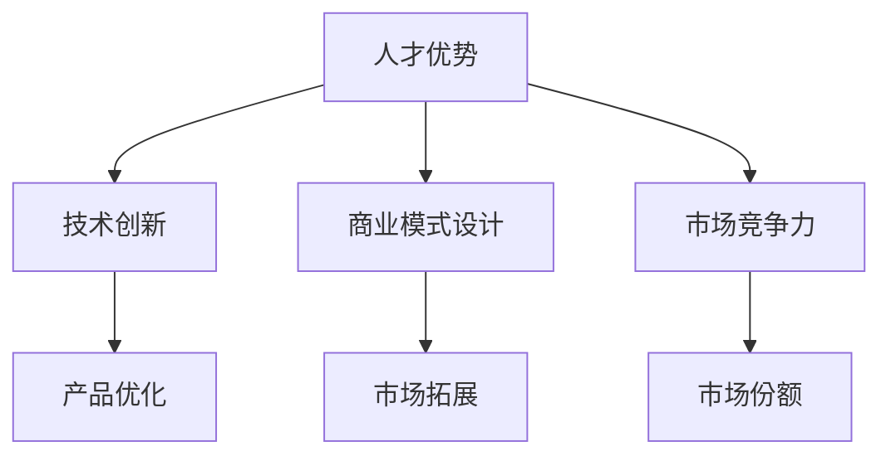

                 

关键词：AI 大模型，创业，人才优势，技术人才，创新策略，商业模式，市场分析，数据驱动，人才培养。

## 摘要

在当前人工智能领域，大模型的快速发展为企业创新和商业竞争带来了前所未有的机遇。本文将探讨如何利用人才优势推动 AI 大模型创业，分析核心人才角色、人才培养策略、创新技术应用以及商业模式设计等方面。通过深入了解行业动态、市场趋势和实际案例，本文旨在为创业者和企业家提供有价值的参考，助力 AI 大模型创业的成功。

## 1. 背景介绍

随着深度学习、神经网络和大数据技术的发展，人工智能大模型（如 GPT-3、BERT 等）已经成为推动科技创新和产业升级的重要引擎。大模型具备处理海量数据、自动学习和优化算法的能力，能够为各行各业提供智能化的解决方案。然而，AI 大模型的开发和部署不仅需要庞大的计算资源，更需要专业的技术人才支持。在当前市场竞争激烈的背景下，如何有效地利用人才优势，推动 AI 大模型创业成为企业家和创业者亟待解决的问题。

### 1.1 AI 大模型的发展现状

近年来，AI 大模型在语言处理、图像识别、自然语言生成、语音识别等领域取得了显著进展。以 GPT-3 为例，该模型拥有超过 1750 亿个参数，能够生成高质量的文章、代码、对话等。此外，BERT 模型在文本分类、情感分析等领域也展现出了卓越的性能。这些大模型的应用不仅提升了传统行业的智能化水平，还催生了一批新兴的 AI 企业。

### 1.2 创业背景

在全球范围内，人工智能创业已经成为一种趋势。根据相关报告，2021 年全球人工智能企业数量已经超过 3.5万家，总融资额超过 2000 亿美元。然而，尽管市场前景广阔，AI 大模型创业依然面临诸多挑战。如何发现市场需求、构建核心技术、搭建人才团队、设计商业模式等，都是创业者需要认真考虑的问题。

## 2. 核心概念与联系

### 2.1 人才优势的定义

人才优势是指企业在特定领域拥有高于竞争对手的人才储备和人才利用率。在 AI 大模型创业中，人才优势尤为重要，因为它直接关系到企业的技术创新、商业模式设计和市场竞争力。

### 2.2 人才角色的分类

在 AI 大模型创业中，常见的人才角色包括：

1. **AI 研发工程师**：负责大模型的开发、优化和部署。
2. **数据科学家**：负责数据清洗、数据分析和数据可视化。
3. **软件工程师**：负责应用程序的开发和维护。
4. **产品经理**：负责产品规划、市场调研和用户反馈。
5. **市场营销人员**：负责品牌推广、市场拓展和客户关系管理。

### 2.3 人才优势与创业成功的关系

人才优势是 AI 大模型创业成功的关键因素之一。具体表现在：

1. **技术创新**：专业的人才团队能够快速掌握新技术，推动大模型的应用创新。
2. **商业模式设计**：熟悉市场和用户需求的人才能够设计出更具竞争力的商业模式。
3. **市场竞争力**：具备人才优势的企业能够在市场竞争中占据有利地位。

### 2.4 Mermaid 流程图



## 3. 核心算法原理 & 具体操作步骤

### 3.1 算法原理概述

AI 大模型的开发主要依赖于深度学习和神经网络技术。具体来说，大模型通过多层神经网络对海量数据进行训练，从而自动学习数据的特征和规律。在训练过程中，模型会不断优化参数，提高预测和分类的准确性。

### 3.2 算法步骤详解

1. **数据收集与预处理**：收集相关领域的海量数据，并进行清洗、去重、归一化等预处理操作。
2. **模型架构设计**：根据应用场景选择合适的模型架构，如 Transformer、BERT 等。
3. **模型训练**：使用 GPU 等高性能计算设备对模型进行训练，通过反向传播算法不断优化模型参数。
4. **模型评估与调优**：使用验证集和测试集对模型进行评估，并根据评估结果进行调优。
5. **模型部署与维护**：将训练好的模型部署到生产环境，并进行实时监控和维护。

### 3.3 算法优缺点

**优点**：

1. **高精度**：大模型具有强大的学习能力，能够处理复杂的任务，提高预测和分类的准确性。
2. **自适应**：大模型能够根据不同场景和数据集进行自适应调整，提高泛化能力。

**缺点**：

1. **计算资源消耗大**：大模型需要庞大的计算资源和存储空间，训练过程耗时长。
2. **数据需求高**：大模型对数据质量要求较高，需要大量高质量的训练数据。

### 3.4 算法应用领域

AI 大模型在众多领域都展现出强大的应用潜力，如自然语言处理、计算机视觉、智能推荐、金融风控等。

## 4. 数学模型和公式 & 详细讲解 & 举例说明

### 4.1 数学模型构建

AI 大模型的核心在于多层神经网络，其数学模型可以表示为：

$$
y = \sigma(W_n \cdot \sigma(...\sigma(W_2 \cdot \sigma(W_1 \cdot x + b_1) + b_2)... + b_n))
$$

其中，$W_n$ 表示第 $n$ 层的权重矩阵，$\sigma$ 表示激活函数，$x$ 表示输入特征，$y$ 表示输出结果，$b_n$ 表示第 $n$ 层的偏置。

### 4.2 公式推导过程

多层神经网络的推导过程涉及矩阵运算、链式法则等数学知识。具体推导过程较为复杂，但基本原则是：

1. **输入层到隐藏层的推导**：使用矩阵乘法和链式法则。
2. **隐藏层到输出层的推导**：同样使用矩阵乘法和链式法则。
3. **梯度下降法**：用于优化模型参数。

### 4.3 案例分析与讲解

以 BERT 模型为例，其数学模型可以表示为：

$$
\text{output} = \text{Softmax}(\text{Bias} + \text{Matrix}(\text{input} \times \text{weight}))
$$

其中，$\text{input}$ 表示输入特征，$\text{weight}$ 表示权重矩阵，$\text{Bias}$ 表示偏置，$\text{Softmax}$ 表示归一化函数。

BERT 模型通过预训练和微调两个阶段进行训练。在预训练阶段，模型使用海量无标注文本数据进行训练，学习文本的语义表示。在微调阶段，模型根据特定任务进行调优，提高任务表现。

## 5. 项目实践：代码实例和详细解释说明

### 5.1 开发环境搭建

搭建 AI 大模型开发环境需要配置以下软件和硬件：

1. **深度学习框架**：如 TensorFlow、PyTorch 等。
2. **编程语言**：如 Python、Java 等。
3. **硬件设备**：如 GPU、TPU 等。

### 5.2 源代码详细实现

以下是一个简单的神经网络实现示例：

```python
import torch
import torch.nn as nn

class NeuralNetwork(nn.Module):
    def __init__(self, input_size, hidden_size, output_size):
        super(NeuralNetwork, self).__init__()
        self.fc1 = nn.Linear(input_size, hidden_size)
        self.relu = nn.ReLU()
        self.fc2 = nn.Linear(hidden_size, output_size)

    def forward(self, x):
        out = self.fc1(x)
        out = self.relu(out)
        out = self.fc2(out)
        return out

# 实例化模型
model = NeuralNetwork(input_size=10, hidden_size=50, output_size=1)
```

### 5.3 代码解读与分析

上述代码定义了一个简单的神经网络模型，包括一个输入层、一个隐藏层和一个输出层。输入层和隐藏层之间使用线性变换和ReLU激活函数，隐藏层和输出层之间也使用线性变换。模型的前向传播过程通过多层神经网络实现，最终输出预测结果。

### 5.4 运行结果展示

通过训练和测试，模型可以在特定任务上达到较高的准确率。以下是一个简单的训练示例：

```python
# 加载训练数据
train_data = ...

# 定义优化器
optimizer = torch.optim.Adam(model.parameters(), lr=0.001)

# 训练模型
for epoch in range(100):
    model.train()
    optimizer.zero_grad()
    outputs = model(train_data)
    loss = nn.CrossEntropyLoss()(outputs, train_labels)
    loss.backward()
    optimizer.step()

    if (epoch + 1) % 10 == 0:
        print(f'Epoch [{epoch + 1}/{100}], Loss: {loss.item()}')
```

## 6. 实际应用场景

### 6.1 金融风控

在金融行业，AI 大模型可以用于信贷审批、反欺诈检测、市场预测等。例如，通过训练大模型，可以识别出潜在的欺诈行为，提高金融系统的安全性。

### 6.2 医疗健康

在医疗健康领域，AI 大模型可以用于疾病诊断、药物研发、健康管理等。例如，通过分析大量的医疗数据，大模型可以预测疾病的发病概率，为医生提供诊断建议。

### 6.3 智能制造

在智能制造领域，AI 大模型可以用于设备故障预测、生产过程优化、质量检测等。例如，通过分析生产数据，大模型可以预测设备的故障时间，提高生产效率。

## 7. 未来应用展望

随着 AI 大模型技术的不断发展，其应用领域将不断拓展。未来，AI 大模型有望在智能交通、环境保护、社会治理等方面发挥重要作用。同时，随着技术的进步，AI 大模型的计算成本和能耗也将逐渐降低，为更广泛的行业提供智能化的解决方案。

## 8. 工具和资源推荐

### 8.1 学习资源推荐

1. **深度学习专项课程**：提供系统性的深度学习知识。
2. **AI 大模型论文**：分享最新的研究成果和应用案例。
3. **技术社区**：如 Stack Overflow、GitHub 等，提供丰富的技术交流资源。

### 8.2 开发工具推荐

1. **TensorFlow**：提供丰富的深度学习工具和资源。
2. **PyTorch**：具有灵活性和易用性，适用于各种深度学习应用。
3. **Kaggle**：提供数据集和比赛，助力模型训练和优化。

### 8.3 相关论文推荐

1. **"Attention is All You Need"**：介绍 Transformer 模型。
2. **"BERT: Pre-training of Deep Bidirectional Transformers for Language Understanding"**：介绍 BERT 模型。
3. **"GPT-3: Language Models are Few-Shot Learners"**：介绍 GPT-3 模型。

## 9. 总结：未来发展趋势与挑战

### 9.1 研究成果总结

AI 大模型在语言处理、图像识别、自然语言生成等领域取得了显著进展，推动了各行业的智能化升级。同时，深度学习框架和开发工具的成熟为 AI 大模型的研究和开发提供了便利。

### 9.2 未来发展趋势

1. **计算能力提升**：随着 GPU、TPU 等高性能计算设备的普及，AI 大模型的计算能力将得到进一步提升。
2. **数据质量提升**：高质量的训练数据将推动 AI 大模型的性能和泛化能力。
3. **跨领域应用**：AI 大模型将在更多领域得到应用，如智能交通、环境保护、社会治理等。

### 9.3 面临的挑战

1. **计算资源消耗**：AI 大模型的训练和部署需要庞大的计算资源，如何降低计算成本成为一大挑战。
2. **数据隐私保护**：大规模数据处理过程中，数据隐私保护问题日益凸显。
3. **算法透明性和可解释性**：随着 AI 大模型的深度和复杂度增加，其决策过程的可解释性成为亟待解决的问题。

### 9.4 研究展望

未来，AI 大模型研究将朝着更高效、更智能、更可解释的方向发展。通过不断创新和优化，AI 大模型将为各行各业提供更加智能化、个性化的解决方案。

## 附录：常见问题与解答

1. **Q：什么是 AI 大模型？**
   **A：AI 大模型是指具有数十亿甚至数千亿个参数的深度学习模型，如 GPT-3、BERT 等。这些模型通过自动学习海量数据中的特征和规律，实现高精度的预测和分类。**

2. **Q：AI 大模型如何训练？**
   **A：AI 大模型训练过程主要包括数据收集与预处理、模型架构设计、模型训练、模型评估与调优等步骤。具体训练方法包括随机梯度下降（SGD）、Adam 优化器等。**

3. **Q：AI 大模型有哪些应用领域？**
   **A：AI 大模型在自然语言处理、计算机视觉、智能推荐、金融风控、医疗健康、智能制造等领域有广泛的应用。**

4. **Q：如何搭建 AI 大模型开发环境？**
   **A：搭建 AI 大模型开发环境需要配置深度学习框架（如 TensorFlow、PyTorch）、编程语言（如 Python、Java）和硬件设备（如 GPU、TPU）。**

作者：禅与计算机程序设计艺术 / Zen and the Art of Computer Programming
----------------------------------------------------------------
### 总结

本文从多个角度探讨了 AI 大模型创业中如何利用人才优势。通过分析 AI 大模型的发展现状、核心算法原理、数学模型和实际应用场景，本文为创业者和企业家提供了有价值的参考。在未来的发展中，随着计算能力的提升和数据质量的提高，AI 大模型将在更多领域发挥重要作用。然而，AI 大模型创业仍面临诸多挑战，如计算资源消耗、数据隐私保护和算法透明性等。只有不断创新和优化，才能推动 AI 大模型创业的持续发展。

在结束本文之前，我，禅与计算机程序设计艺术，衷心希望本文能够为您的 AI 大模型创业之路提供启发和帮助。无论您是创业者、企业家还是技术专家，只要您心怀创新和热情，就一定能够在 AI 大模型领域取得辉煌的成就。祝您在 AI 大模型创业的道路上越走越远，开创属于您自己的辉煌篇章！

