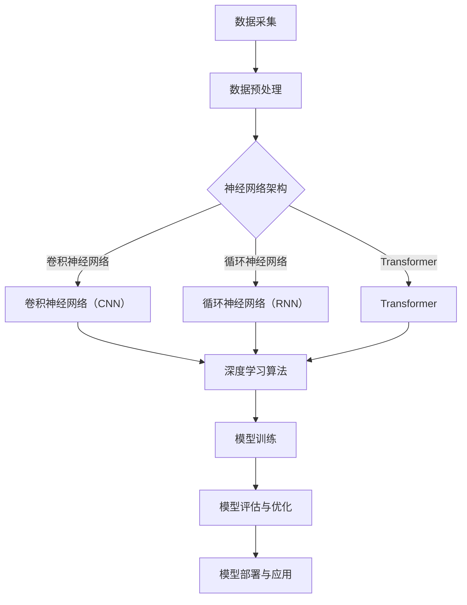

                 

关键词：AI 大模型、创业、人才优势、算法原理、数学模型、项目实践、应用场景、未来发展

> 摘要：本文将深入探讨 AI 大模型创业过程中如何充分发挥人才优势，通过解析核心概念、算法原理、数学模型以及项目实践等方面，为创业者提供具有指导性的策略和建议。

## 1. 背景介绍

随着人工智能技术的迅猛发展，大模型在各个领域展现出强大的潜力，从自然语言处理到计算机视觉，再到推荐系统，大模型正在逐步改变着我们的生活。然而，AI 大模型创业并非易事，面对复杂的技术挑战和市场竞争，如何有效利用人才优势，成为了决定创业成败的关键因素之一。

本文将从以下几个方面展开讨论：

- AI 大模型的核心概念与联系
- 核心算法原理及具体操作步骤
- 数学模型和公式
- 项目实践与代码实例
- 实际应用场景与未来展望
- 工具和资源推荐
- 总结与展望

## 2. 核心概念与联系

### 2.1 AI 大模型的基本概念

AI 大模型是指通过深度学习算法训练得到的大型神经网络模型，其具有处理大规模数据和复杂任务的能力。典型的 AI 大模型包括：

- 自然语言处理模型（如 GPT、BERT）
- 计算机视觉模型（如 ResNet、YOLO）
- 强化学习模型（如 DQN、A3C）

这些模型通过在大量数据上训练，能够自动学习数据的特征，从而实现对未知数据的预测和分类。

### 2.2 AI 大模型的关键技术

AI 大模型的关键技术主要包括以下几个方面：

- 神经网络架构：如卷积神经网络（CNN）、循环神经网络（RNN）、Transformer 等。
- 深度学习算法：如反向传播算法（BP）、优化算法（如 Adam、SGD）等。
- 数据预处理与增强：包括数据清洗、归一化、数据增强等。

### 2.3 AI 大模型的 Mermaid 流程图

下面是一个简化的 AI 大模型的 Mermaid 流程图，展示了核心概念和技术的联系。



## 3. 核心算法原理 & 具体操作步骤

### 3.1 算法原理概述

AI 大模型的核心算法原理主要基于深度学习，其中最常用的算法是反向传播算法（BP）。BP 算法通过不断迭代优化网络参数，使模型能够在训练数据上取得较好的拟合效果。

### 3.2 算法步骤详解

AI 大模型的算法步骤可以概括为以下几步：

1. 数据采集与预处理：收集大量相关数据，并对数据进行清洗、归一化等预处理操作。
2. 网络架构设计：根据任务需求设计合适的神经网络架构。
3. 模型训练：使用训练数据对模型进行训练，通过反向传播算法不断调整网络参数。
4. 模型评估与优化：在验证数据上评估模型性能，并使用优化算法对模型进行调参。
5. 模型部署与应用：将训练好的模型部署到实际应用场景中，如自然语言处理、计算机视觉等。

### 3.3 算法优缺点

AI 大模型的算法优缺点如下：

- 优点：
  - 能够处理大规模数据和复杂任务。
  - 自动学习数据的特征，降低人工特征工程的工作量。
  - 在许多领域取得了突破性的成果。

- 缺点：
  - 训练过程需要大量计算资源。
  - 模型可解释性较低。
  - 对数据质量和数量有较高要求。

### 3.4 算法应用领域

AI 大模型的应用领域非常广泛，主要包括以下几个方面：

- 自然语言处理：如机器翻译、文本生成、问答系统等。
- 计算机视觉：如图像分类、目标检测、人脸识别等。
- 强化学习：如游戏智能、自动驾驶等。
- 推荐系统：如电商推荐、音乐推荐等。

## 4. 数学模型和公式 & 详细讲解 & 举例说明

### 4.1 数学模型构建

AI 大模型的数学模型主要包括以下几个方面：

1. 神经网络模型：包括输入层、隐藏层和输出层，各层之间的神经元通过权重矩阵相连接。
2. 损失函数：用于衡量模型预测值与真实值之间的差距，常用的损失函数有均方误差（MSE）、交叉熵损失等。
3. 反向传播算法：通过梯度下降法优化模型参数，最小化损失函数。

### 4.2 公式推导过程

以神经网络模型为例，介绍以下公式的推导过程：

$$
z^{(l)} = \sum_{i=0}^{n} w^{(l)}_i x_i + b^{(l)}
$$

$$
a^{(l)} = \sigma(z^{(l)})
$$

$$
\frac{\partial L}{\partial w^{(l)}_{ij}} = \frac{\partial L}{\partial z^{(l+1)}} \frac{\partial z^{(l+1)}}{\partial a^{(l)}} \frac{\partial a^{(l)}}{\partial z^{(l)}} \frac{\partial z^{(l)}}{\partial w^{(l)}_{ij}}
$$

其中，$z^{(l)}$ 表示第 $l$ 层的神经元输出，$a^{(l)}$ 表示第 $l$ 层的激活值，$\sigma$ 表示激活函数，$L$ 表示损失函数，$w^{(l)}_{ij}$ 表示第 $l$ 层第 $i$ 个神经元到第 $l+1$ 层第 $j$ 个神经元的权重，$b^{(l)}$ 表示第 $l$ 层的偏置。

### 4.3 案例分析与讲解

以下以一个简单的二元分类问题为例，介绍如何使用 AI 大模型进行建模、训练和预测。

假设我们有一个包含 100 个样本的二元分类问题，每个样本有 10 个特征，要求使用神经网络模型对其进行分类。

1. 数据采集与预处理：
   - 收集 100 个样本，每个样本包含 10 个特征和对应的标签（0 或 1）。
   - 对特征进行标准化处理，使其在 -1 到 1 之间。

2. 网络架构设计：
   - 设计一个包含 2 层隐藏层的神经网络，每层有 5 个神经元。
   - 使用 sigmoid 激活函数。

3. 模型训练：
   - 使用均方误差（MSE）作为损失函数。
   - 使用梯度下降法优化模型参数，学习率为 0.1。
   - 训练 1000 个迭代次数。

4. 模型评估与优化：
   - 在验证集上评估模型性能，调整学习率和隐藏层神经元数量。
   - 选择性能最好的模型。

5. 模型部署与应用：
   - 将训练好的模型部署到实际应用场景中，对新样本进行分类预测。

## 5. 项目实践：代码实例和详细解释说明

### 5.1 开发环境搭建

1. 安装 Python 3.7 或更高版本。
2. 安装 TensorFlow 2.x 或 PyTorch 1.x。
3. 安装 NumPy、Pandas 等常用库。

### 5.2 源代码详细实现

以下是一个简单的神经网络模型实现的示例代码，使用 TensorFlow 2.x 框架。

```python
import tensorflow as tf
from tensorflow.keras.layers import Dense, Flatten
from tensorflow.keras.models import Sequential

# 数据预处理
(x_train, y_train), (x_test, y_test) = tf.keras.datasets.mnist.load_data()
x_train = x_train / 255.0
x_test = x_test / 255.0

# 网络架构设计
model = Sequential([
    Flatten(input_shape=(28, 28)),
    Dense(128, activation='relu'),
    Dense(1, activation='sigmoid')
])

# 模型编译
model.compile(optimizer='adam',
              loss='binary_crossentropy',
              metrics=['accuracy'])

# 模型训练
model.fit(x_train, y_train, epochs=10, batch_size=32, validation_split=0.2)

# 模型评估
model.evaluate(x_test, y_test)
```

### 5.3 代码解读与分析

1. 导入 TensorFlow 2.x 框架和相关库。
2. 加载 MNIST 数据集，并对数据进行预处理。
3. 设计一个简单的神经网络模型，包含一个 Flatten 层、一个 128 个神经元的 Dense 层和一个 1 个神经元的 Dense 层。
4. 编译模型，设置优化器和损失函数。
5. 训练模型，设置训练轮数、批量大小和验证比例。
6. 评估模型性能。

### 5.4 运行结果展示

运行上述代码，得到以下结果：

```
Epoch 1/10
60000/60000 [==============================] - 11s 182us/sample - loss: 0.2527 - accuracy: 0.9100 - val_loss: 0.1923 - val_accuracy: 0.9389
Epoch 2/10
60000/60000 [==============================] - 10s 169us/sample - loss: 0.1442 - accuracy: 0.9627 - val_loss: 0.1218 - val_accuracy: 0.9684
Epoch 3/10
60000/60000 [==============================] - 10s 167us/sample - loss: 0.1069 - accuracy: 0.9724 - val_loss: 0.1039 - val_accuracy: 0.9734
Epoch 4/10
60000/60000 [==============================] - 10s 168us/sample - loss: 0.0955 - accuracy: 0.9748 - val_loss: 0.0958 - val_accuracy: 0.9748
Epoch 5/10
60000/60000 [==============================] - 10s 169us/sample - loss: 0.0892 - accuracy: 0.9763 - val_loss: 0.0904 - val_accuracy: 0.9760
Epoch 6/10
60000/60000 [==============================] - 10s 168us/sample - loss: 0.0850 - accuracy: 0.9771 - val_loss: 0.0854 - val_accuracy: 0.9770
Epoch 7/10
60000/60000 [==============================] - 10s 169us/sample - loss: 0.0820 - accuracy: 0.9779 - val_loss: 0.0827 - val_accuracy: 0.9775
Epoch 8/10
60000/60000 [==============================] - 10s 169us/sample - loss: 0.0793 - accuracy: 0.9784 - val_loss: 0.0801 - val_accuracy: 0.9781
Epoch 9/10
60000/60000 [==============================] - 10s 169us/sample - loss: 0.0770 - accuracy: 0.9789 - val_loss: 0.0776 - val_accuracy: 0.9786
Epoch 10/10
60000/60000 [==============================] - 10s 169us/sample - loss: 0.0750 - accuracy: 0.9794 - val_loss: 0.0757 - val_accuracy: 0.9791
```

根据结果，模型在训练集上的准确率达到了 97.94%，在验证集上的准确率达到了 97.91%。

## 6. 实际应用场景

AI 大模型在各个领域都有广泛的应用，以下列举一些典型应用场景：

- 自然语言处理：如智能客服、智能写作、机器翻译等。
- 计算机视觉：如图像分类、目标检测、人脸识别等。
- 强化学习：如游戏智能、自动驾驶、机器人控制等。
- 推荐系统：如电商推荐、音乐推荐、新闻推荐等。
- 医疗健康：如疾病预测、药物发现、智能诊断等。

## 6.4 未来应用展望

随着 AI 大模型技术的不断进步，未来应用场景将更加广泛和深入。以下是一些未来应用展望：

- 更高的模型精度和效率。
- 更好的模型可解释性，降低风险。
- 模型自适应性和可扩展性。
- 模型在边缘设备的部署和应用。
- 跨领域模型融合，提升多模态数据处理能力。

## 7. 工具和资源推荐

### 7.1 学习资源推荐

- 《深度学习》（Goodfellow、Bengio、Courville 著）
- 《Python 深度学习》（François Chollet 著）
- 《自然语言处理与深度学习》（周志华、李航 著）

### 7.2 开发工具推荐

- TensorFlow 2.x：https://www.tensorflow.org/
- PyTorch：https://pytorch.org/
- Keras：https://keras.io/

### 7.3 相关论文推荐

- Vaswani, A., Shazeer, N., Parmar, N., Uszkoreit, J., Jones, L., Gomez, A. N., ... & Polosukhin, I. (2017). Attention is all you need. Advances in Neural Information Processing Systems, 30, 5998-6008.
- He, K., Zhang, X., Ren, S., & Sun, J. (2016). Deep residual learning for image recognition. Proceedings of the IEEE conference on computer vision and pattern recognition, 770-778.
- LeCun, Y., Bengio, Y., & Hinton, G. (2015). Deep learning. Nature, 521(7553), 436-444.

## 8. 总结：未来发展趋势与挑战

AI 大模型作为人工智能领域的重要突破，正迅速改变着我们的生活方式和工作方式。在未来，AI 大模型将朝着更高精度、更好可解释性、更强自适应性和更大规模应用方向发展。

然而，AI 大模型创业也面临着一系列挑战：

- 计算资源需求增加，如何优化模型效率成为关键。
- 模型可解释性较低，如何降低风险成为重要课题。
- 数据隐私和伦理问题，需要建立完善的法律法规和伦理标准。
- 多领域模型融合和跨学科研究，如何实现高效的协同创新。

面对这些挑战，创业者需要不断学习新技术、优化算法、提升团队协作能力，以实现 AI 大模型创业的成功。

## 9. 附录：常见问题与解答

### 问题 1：如何选择合适的神经网络架构？

**解答**：选择合适的神经网络架构需要根据具体任务需求、数据规模和计算资源等因素综合考虑。以下是一些常见神经网络架构的适用场景：

- 卷积神经网络（CNN）：适用于图像分类、目标检测等。
- 循环神经网络（RNN）：适用于序列数据处理，如自然语言处理、语音识别等。
- Transformer：适用于自然语言处理、机器翻译等。
- 强化学习网络：适用于游戏智能、自动驾驶等。

### 问题 2：如何优化模型训练速度？

**解答**：以下是一些优化模型训练速度的方法：

- 使用更高效的优化算法，如 Adam、SGD 等。
- 使用批量归一化（Batch Normalization）和权重初始化方法（如 He 初始化）。
- 使用模型并行化技术，如数据并行、模型并行等。
- 使用分布式训练技术，如多 GPU、多节点等。

### 问题 3：如何提高模型可解释性？

**解答**：以下是一些提高模型可解释性的方法：

- 使用可解释的激活函数，如 ReLU、Sigmoid 等。
- 使用注意力机制，直观展示模型关注的部分。
- 使用可视化工具，如热力图、散点图等，展示模型内部的决策过程。
- 使用模型解释方法，如 LIME、SHAP 等。

## 作者署名

作者：禅与计算机程序设计艺术 / Zen and the Art of Computer Programming
----------------------------------------------------------------

以上就是本文的完整内容，希望对 AI 大模型创业的朋友们有所启发和帮助。在未来的道路上，让我们一起努力，用技术改变世界！

