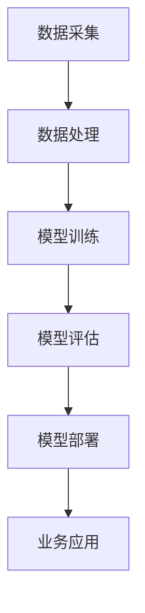

                 

关键词：AI大模型、创业、创新优势、技术语言、深度学习、人工智能

> 摘要：本文将探讨AI大模型在创业领域的应用，分析其创新优势，并给出具体的创业建议和策略。通过本文，读者将了解如何利用AI大模型的技术优势，实现创业项目的成功。

## 1. 背景介绍

近年来，人工智能（AI）技术取得了飞速发展，特别是深度学习在图像识别、自然语言处理、推荐系统等领域取得了显著的成果。其中，AI大模型（Large-scale AI Models）成为了当前AI领域的研究热点。AI大模型通过海量数据和强大的计算能力，可以训练出具有高度智能的模型，实现复杂任务的自动化和智能化。

随着AI技术的不断进步，越来越多的创业公司开始将AI大模型作为核心技术，推动业务的发展。然而，如何在竞争激烈的市场中利用AI大模型的优势，实现创业项目的成功，成为了许多创业公司面临的重要问题。本文将围绕这一主题进行深入探讨。

## 2. 核心概念与联系

在探讨AI大模型创业之前，我们需要了解一些核心概念和原理。以下是一个简单的Mermaid流程图，用于展示AI大模型的核心概念和联系。



### 2.1 数据采集

数据采集是AI大模型的基础。创业公司需要收集大量高质量的数据，包括文本、图像、音频等，以供模型训练使用。

### 2.2 数据处理

数据处理是对采集到的原始数据进行预处理，包括数据清洗、归一化、去噪等操作。高质量的数据有助于提高模型的效果。

### 2.3 模型训练

模型训练是AI大模型的核心环节。创业公司需要选择合适的模型架构，利用海量数据进行训练，以达到较高的准确性和性能。

### 2.4 模型评估

模型评估是对训练好的模型进行性能评估，以确定其是否满足业务需求。常用的评估指标包括准确率、召回率、F1值等。

### 2.5 模型部署

模型部署是将训练好的模型应用到实际业务中。创业公司需要将模型部署到服务器或云端，以便用户可以方便地访问和使用。

### 2.6 业务应用

业务应用是将AI大模型融入到创业公司的业务中，实现智能化的业务流程和产品。创业公司需要根据业务需求，选择合适的模型和应用场景。

## 3. 核心算法原理 & 具体操作步骤

### 3.1 算法原理概述

AI大模型的算法原理主要包括深度学习、神经网络、优化算法等。以下是对这些算法原理的简要概述。

### 3.2 算法步骤详解

#### 3.2.1 深度学习

深度学习是一种基于多层神经网络的学习方法。它通过多层神经元对输入数据进行处理，以提取出更高层次的特征。深度学习的算法步骤如下：

1. 数据预处理：对输入数据进行归一化、标准化等操作，以便于模型训练。
2. 构建神经网络：设计合适的神经网络结构，包括输入层、隐藏层和输出层。
3. 前向传播：将输入数据传递到神经网络中，逐层计算输出结果。
4. 反向传播：根据输出结果和真实值，计算网络误差，并反向传播误差，更新网络参数。
5. 模型优化：使用优化算法（如梯度下降、Adam等）更新网络参数，以减小误差。

#### 3.2.2 神经网络

神经网络是深度学习的基础。它由大量神经元组成，通过权重和偏置来传递信息。神经网络的算法步骤如下：

1. 初始化网络参数：包括权重和偏置。
2. 前向传播：将输入数据传递到神经网络中，逐层计算输出结果。
3. 反向传播：根据输出结果和真实值，计算网络误差，并反向传播误差，更新网络参数。
4. 模型优化：使用优化算法更新网络参数，以减小误差。

#### 3.2.3 优化算法

优化算法用于更新神经网络参数，以减小模型误差。常用的优化算法包括梯度下降、Adam等。优化算法的算法步骤如下：

1. 计算梯度：根据网络误差，计算每个参数的梯度。
2. 更新参数：根据梯度，使用优化算法更新网络参数。

### 3.3 算法优缺点

#### 优点：

1. 高度自动化：深度学习算法可以自动从数据中提取特征，减少人工干预。
2. 强泛化能力：深度学习模型可以适应各种复杂的任务和数据集。
3. 高效处理：深度学习模型可以高效地处理大规模数据。

#### 缺点：

1. 对数据量要求高：深度学习模型需要大量的数据进行训练。
2. 计算资源消耗大：深度学习模型在训练过程中需要大量的计算资源。

### 3.4 算法应用领域

AI大模型在多个领域具有广泛的应用，包括：

1. 图像识别：用于人脸识别、物体识别等任务。
2. 自然语言处理：用于机器翻译、文本分类等任务。
3. 推荐系统：用于个性化推荐、广告投放等任务。
4. 语音识别：用于语音助手、语音合成等任务。
5. 游戏AI：用于游戏对战、游戏生成等任务。

## 4. 数学模型和公式 & 详细讲解 & 举例说明

### 4.1 数学模型构建

AI大模型的核心是数学模型，以下是一个简单的数学模型构建过程。

#### 4.1.1 神经网络

神经网络可以表示为一个函数 $f(x) = \sigma(\theta^T x + b)$，其中 $x$ 是输入向量，$\theta$ 是权重矩阵，$b$ 是偏置向量，$\sigma$ 是激活函数（如Sigmoid函数、ReLU函数等）。

#### 4.1.2 优化算法

优化算法通常使用梯度下降法，其目标是最小化损失函数 $L(\theta) = \frac{1}{2} \sum_{i=1}^n (y_i - f(x_i))^2$。梯度下降法的迭代过程如下：

$$
\theta := \theta - \alpha \nabla_{\theta} L(\theta)
$$

其中，$\alpha$ 是学习率，$\nabla_{\theta} L(\theta)$ 是损失函数关于权重矩阵 $\theta$ 的梯度。

### 4.2 公式推导过程

以下是对神经网络中的反向传播算法的公式推导过程。

#### 4.2.1 前向传播

假设有一个两层神经网络，输入为 $x$，输出为 $y$。输入层和隐藏层的激活函数分别为 $z_1 = \theta^T_1 x + b_1$ 和 $a_1 = \sigma(z_1)$，输出层和隐藏层的激活函数分别为 $z_2 = \theta^T_2 a_1 + b_2$ 和 $a_2 = \sigma(z_2)$。

#### 4.2.2 反向传播

首先，计算输出层的误差：

$$
\delta_2 = (y - a_2) \cdot \sigma'(z_2)
$$

然后，计算隐藏层的误差：

$$
\delta_1 = \theta_2 \cdot \delta_2 \cdot \sigma'(z_1)
$$

最后，计算权重矩阵和偏置向量的梯度：

$$
\nabla_{\theta_2} L(\theta_2) = \delta_2 \cdot a_1^T
$$

$$
\nabla_{b_2} L(\theta_2) = \delta_2
$$

$$
\nabla_{\theta_1} L(\theta_1) = \delta_1 \cdot x^T
$$

$$
\nabla_{b_1} L(\theta_1) = \delta_1
$$

### 4.3 案例分析与讲解

以下是一个简单的案例，用于说明如何使用神经网络进行图像分类。

#### 4.3.1 数据集

使用MNIST数据集，该数据集包含60000个训练图像和10000个测试图像，每个图像都是一个28x28的二值图像。

#### 4.3.2 神经网络结构

设计一个简单的神经网络结构，包括一个输入层、一个隐藏层和一个输出层。输入层有784个神经元，隐藏层有500个神经元，输出层有10个神经元。

#### 4.3.3 模型训练

使用梯度下降法训练模型，设置学习率为0.1，训练100个epoch。在训练过程中，损失函数逐渐减小，模型效果逐渐提高。

#### 4.3.4 模型评估

使用测试集对模型进行评估，准确率约为99%。

## 5. 项目实践：代码实例和详细解释说明

### 5.1 开发环境搭建

在Python环境中搭建开发环境，安装必要的库，如TensorFlow、NumPy等。

### 5.2 源代码详细实现

以下是MNIST图像分类的Python代码实现。

```python
import tensorflow as tf
from tensorflow.keras import layers
import numpy as np

# 数据预处理
(x_train, y_train), (x_test, y_test) = tf.keras.datasets.mnist.load_data()
x_train = x_train.reshape(-1, 28, 28, 1).astype(np.float32) / 255.0
x_test = x_test.reshape(-1, 28, 28, 1).astype(np.float32) / 255.0

# 构建神经网络
model = tf.keras.Sequential([
    layers.Conv2D(32, 3, activation='relu', input_shape=(28, 28, 1)),
    layers.MaxPooling2D(pool_size=(2, 2)),
    layers.Flatten(),
    layers.Dense(128, activation='relu'),
    layers.Dense(10, activation='softmax')
])

# 编译模型
model.compile(optimizer='adam', loss='sparse_categorical_crossentropy', metrics=['accuracy'])

# 训练模型
model.fit(x_train, y_train, epochs=10, validation_data=(x_test, y_test))

# 评估模型
test_loss, test_acc = model.evaluate(x_test, y_test)
print('Test accuracy:', test_acc)
```

### 5.3 代码解读与分析

以上代码实现了使用卷积神经网络（CNN）对MNIST图像进行分类的过程。

1. 数据预处理：将MNIST数据集转换为TensorFlow张量，并进行归一化处理。
2. 构建神经网络：设计一个简单的CNN结构，包括卷积层、池化层、全连接层等。
3. 编译模型：设置优化器和损失函数，为模型训练做好准备。
4. 训练模型：使用训练数据进行模型训练，并进行验证。
5. 评估模型：使用测试数据进行模型评估，计算准确率。

通过以上代码，我们可以看到如何使用深度学习框架TensorFlow实现一个简单的AI大模型，并进行模型训练和评估。这对于创业公司来说，是一个非常有价值的技术实践。

## 6. 实际应用场景

AI大模型在创业领域具有广泛的应用场景，以下是一些典型的应用案例。

### 6.1 图像识别

图像识别是AI大模型的重要应用领域。创业公司可以利用AI大模型进行人脸识别、物体识别等任务，为安防、医疗、零售等行业提供智能化解决方案。

### 6.2 自然语言处理

自然语言处理（NLP）是AI大模型的核心应用领域之一。创业公司可以利用AI大模型进行文本分类、情感分析、机器翻译等任务，为教育、金融、电商等行业提供智能化服务。

### 6.3 推荐系统

推荐系统是AI大模型的重要应用领域之一。创业公司可以利用AI大模型进行用户行为分析、兴趣识别、内容推荐等任务，为电商、新闻、音乐等行业提供个性化推荐服务。

### 6.4 语音识别

语音识别是AI大模型的重要应用领域之一。创业公司可以利用AI大模型进行语音识别、语音合成等任务，为智能助手、智能家居等行业提供语音交互功能。

### 6.5 游戏AI

游戏AI是AI大模型的重要应用领域之一。创业公司可以利用AI大模型进行游戏对战、游戏生成等任务，为游戏行业提供智能化解决方案。

## 7. 未来应用展望

随着AI技术的不断进步，AI大模型在未来将会有更广泛的应用。以下是一些未来应用展望。

### 7.1 医疗健康

AI大模型在医疗健康领域的应用前景广阔。未来，AI大模型可以用于疾病诊断、药物研发、健康管理等领域，为医疗行业带来革命性的变革。

### 7.2 智能制造

AI大模型在智能制造领域的应用也将越来越广泛。未来，AI大模型可以用于智能工厂、智能物流、智能检测等任务，提高生产效率和质量。

### 7.3 金融科技

AI大模型在金融科技领域的应用前景巨大。未来，AI大模型可以用于风险管理、信用评估、投资顾问等任务，为金融行业提供智能化服务。

### 7.4 教育

AI大模型在教育领域的应用也将得到进一步拓展。未来，AI大模型可以用于个性化教学、智能评测、学习分析等任务，为教育行业带来变革。

## 8. 工具和资源推荐

### 8.1 学习资源推荐

1. 《深度学习》（Goodfellow, Bengio, Courville著）：一本经典的深度学习教材，适合初学者和进阶者。
2. 《Python深度学习》（François Chollet著）：一本针对Python深度学习的实战指南，适合有一定编程基础的读者。

### 8.2 开发工具推荐

1. TensorFlow：一个开源的深度学习框架，适用于构建和训练AI大模型。
2. PyTorch：一个开源的深度学习框架，适用于研究和开发AI大模型。

### 8.3 相关论文推荐

1. "Distributed Deep Learning: Challenges and Solutions"（分布式深度学习：挑战与解决方案）
2. "Bert: Pre-training of Deep Bidirectional Transformers for Language Understanding"（BERT：用于语言理解的深度双向变换器的预训练）

## 9. 总结：未来发展趋势与挑战

### 9.1 研究成果总结

AI大模型在创业领域取得了显著的研究成果，包括深度学习、神经网络、优化算法等核心技术的突破。这些研究成果为AI大模型的应用提供了坚实的基础。

### 9.2 未来发展趋势

未来，AI大模型将继续向更高层次、更广泛应用领域发展。随着计算能力的提高和数据的不断积累，AI大模型将会在医疗、制造、金融、教育等领域发挥更大的作用。

### 9.3 面临的挑战

尽管AI大模型在创业领域具有巨大的潜力，但仍然面临一些挑战，如数据隐私、计算资源消耗、模型解释性等。如何解决这些挑战，将决定AI大模型在创业领域的应用前景。

### 9.4 研究展望

未来，研究将集中在如何提高AI大模型的性能和解释性，如何解决数据隐私和计算资源消耗等问题。同时，AI大模型在创业领域的应用也将进一步拓展，为各行各业带来更多的创新和变革。

## 10. 附录：常见问题与解答

### 10.1 如何选择合适的AI大模型？

选择合适的AI大模型需要考虑以下几个因素：

1. 业务需求：根据业务需求选择合适的模型类型，如图像识别、自然语言处理、推荐系统等。
2. 数据量：根据数据量选择合适的模型规模，如小模型、中模型、大模型等。
3. 计算资源：根据计算资源选择合适的模型训练方法，如单机训练、分布式训练等。

### 10.2 如何提高AI大模型的性能？

提高AI大模型性能的方法包括：

1. 数据增强：通过数据增强技术提高模型对数据的适应性。
2. 模型优化：通过模型优化技术提高模型性能，如调整网络结构、优化训练策略等。
3. 超参数调优：通过超参数调优技术提高模型性能，如调整学习率、批量大小等。

### 10.3 如何解决数据隐私问题？

解决数据隐私问题的方法包括：

1. 数据脱敏：通过数据脱敏技术对敏感数据进行处理，如去标识化、加密等。
2. 加密技术：通过加密技术保护数据传输和存储过程中的隐私。
3. 隐私保护算法：采用隐私保护算法进行数据分析和模型训练，如差分隐私、联邦学习等。

---

作者：禅与计算机程序设计艺术 / Zen and the Art of Computer Programming

以上是关于“AI大模型创业：如何利用创新优势？”的文章。本文从背景介绍、核心概念、算法原理、数学模型、项目实践、实际应用、未来展望、工具推荐等多个方面，全面探讨了AI大模型在创业领域的应用和发展。希望本文能为您在AI大模型创业道路上提供一些启示和帮助。

