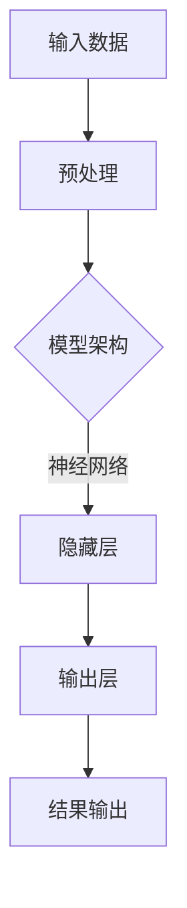

                 

 关键词：人工智能，大模型，创业，创新优势，技术落地，商业策略

> 摘要：随着人工智能技术的飞速发展，大模型的应用日益广泛。本文旨在探讨如何利用大模型的创新优势，在创业过程中实现技术的商业转化，提供一套完整的创业方法论。

## 1. 背景介绍

近年来，人工智能（AI）技术的发展迅猛，其中大模型（Large Models）的研究和应用尤为引人注目。大模型，尤其是预训练模型，如GPT、BERT等，凭借其强大的学习能力和广泛的适用性，已经在自然语言处理、计算机视觉、语音识别等多个领域取得了显著的成果。

在创业领域，大模型的应用为创业者提供了前所未有的机会。一方面，大模型能够为初创公司提供强大的技术支持，提高产品竞争力；另一方面，创新的应用场景和商业模式也能够为企业带来丰厚的利润。然而，如何有效地利用大模型的创新优势，实现技术的商业转化，仍然是许多创业者面临的挑战。

本文将围绕这一主题，从技术、市场、战略等多个角度，探讨如何利用大模型的创新优势，在创业过程中取得成功。

## 2. 核心概念与联系

### 2.1 大模型的原理与架构

大模型，通常指的是具有数亿甚至数千亿参数的深度神经网络模型。这些模型通过大量的数据进行预训练，学习到丰富的知识结构和语言模式，从而能够在特定任务上实现高度准确的表现。

大模型的架构通常包括输入层、隐藏层和输出层。输入层接收外部数据，隐藏层通过复杂的网络结构进行信息处理，输出层产生预测或决策。

下面是一个简化的大模型架构的Mermaid流程图：



### 2.2 创业中的技术转化路径

在创业过程中，将大模型技术转化为商业成果，需要经过以下几个关键步骤：

1. **需求识别**：了解市场对特定技术的需求，确定应用场景。
2. **模型选择**：根据需求选择合适的大模型，或对其进行定制化调整。
3. **技术实现**：将模型集成到产品或服务中，实现技术落地。
4. **市场推广**：制定有效的市场推广策略，吸引潜在客户。
5. **商业模式构建**：设计可持续的商业模型，确保企业的盈利能力。

### 2.3 创新优势的体现

大模型的创新优势主要体现在以下几个方面：

1. **智能化水平**：大模型能够处理复杂任务，提供智能化解决方案。
2. **泛用性**：大模型具有较强的通用性，可以应用于多个领域。
3. **学习效率**：大模型通过预训练和微调，能够快速适应新任务。
4. **竞争力**：大模型的应用可以提高产品的竞争力，增强市场地位。

## 3. 核心算法原理 & 具体操作步骤

### 3.1 算法原理概述

大模型的核心算法是基于深度学习的神经网络，特别是基于大规模语言模型（如GPT）的算法。这些算法通过多层神经元的非线性变换，对输入数据进行建模，从而实现复杂的任务。

### 3.2 算法步骤详解

1. **数据采集**：收集大量相关的数据，用于模型的训练和测试。
2. **数据预处理**：对数据进行清洗、归一化等处理，确保数据的可用性。
3. **模型训练**：使用训练数据对模型进行训练，调整模型参数。
4. **模型评估**：使用测试数据评估模型的性能，确保其满足需求。
5. **模型应用**：将训练好的模型集成到产品或服务中，实现技术落地。

### 3.3 算法优缺点

**优点**：

- **高效率**：大模型能够处理大量的数据，提高计算效率。
- **强泛用性**：大模型具有广泛的适用性，可以应用于多个领域。
- **高精度**：通过预训练和微调，大模型能够达到很高的准确率。

**缺点**：

- **计算资源需求高**：大模型的训练和推理需要大量的计算资源。
- **数据需求量大**：大模型需要大量的数据来训练，数据获取和处理成本高。
- **模型复杂度高**：大模型的复杂性导致理解和调试困难。

### 3.4 算法应用领域

大模型的应用领域非常广泛，包括但不限于：

- **自然语言处理**：文本分类、机器翻译、问答系统等。
- **计算机视觉**：图像识别、物体检测、图像生成等。
- **语音识别**：语音合成、语音识别、语音理解等。
- **推荐系统**：个性化推荐、商品推荐等。

## 4. 数学模型和公式 & 详细讲解 & 举例说明

### 4.1 数学模型构建

大模型的数学模型通常基于深度学习的框架，包括输入层、隐藏层和输出层。每个层级由多个神经元组成，神经元之间的连接通过权重矩阵实现。

输入层接收外部数据，隐藏层通过非线性激活函数进行信息处理，输出层产生预测或决策。常见的激活函数包括Sigmoid、ReLU等。

下面是一个简化的数学模型：

$$
y = \sigma(W_1 \cdot x + b_1)
$$

其中，\( y \) 是输出，\( \sigma \) 是激活函数，\( W_1 \) 是权重矩阵，\( x \) 是输入，\( b_1 \) 是偏置项。

### 4.2 公式推导过程

深度学习模型的训练过程可以理解为通过优化损失函数来调整模型参数。常见的损失函数包括均方误差（MSE）、交叉熵损失等。

以均方误差为例，其公式为：

$$
L(y, \hat{y}) = \frac{1}{2} \sum_{i=1}^{n} (y_i - \hat{y}_i)^2
$$

其中，\( y \) 是真实标签，\( \hat{y} \) 是预测值，\( n \) 是样本数量。

为了最小化损失函数，可以使用梯度下降法进行优化。梯度下降法的公式为：

$$
\theta_{\text{new}} = \theta_{\text{old}} - \alpha \cdot \nabla_\theta L(\theta)
$$

其中，\( \theta \) 是模型参数，\( \alpha \) 是学习率，\( \nabla_\theta L(\theta) \) 是损失函数对参数的梯度。

### 4.3 案例分析与讲解

以一个简单的二元分类问题为例，假设我们要预测一个数据点的标签是0还是1。我们可以使用一个单层神经网络来进行分类。

输入层有两个神经元，分别表示特征1和特征2。隐藏层有一个神经元，表示对输入数据的加权求和。输出层有一个神经元，表示分类结果。

假设输入数据为\( x_1 = [1, 0] \)，权重矩阵为\( W = [1, 1] \)，偏置项为\( b = 1 \)。

首先，计算隐藏层的输出：

$$
h = \sigma(W \cdot x + b) = \sigma([1, 1] \cdot [1, 0] + 1) = \sigma([1, 1]) = 1
$$

然后，计算输出层的输出：

$$
y = \sigma(h) = \sigma(1) = 1
$$

最终，预测结果为1。这个例子展示了如何使用简单的数学模型进行分类任务。

## 5. 项目实践：代码实例和详细解释说明

### 5.1 开发环境搭建

为了实现大模型的创业应用，我们需要搭建一个合适的开发环境。以下是基本的开发环境搭建步骤：

1. 安装Python环境，版本要求3.6及以上。
2. 安装深度学习框架，如TensorFlow或PyTorch。
3. 安装必要的库，如NumPy、Pandas等。

以下是Python的安装命令：

```bash
pip install python==3.8
```

以下是TensorFlow的安装命令：

```bash
pip install tensorflow==2.7
```

### 5.2 源代码详细实现

以下是一个简单的大模型分类任务的实现，使用了TensorFlow框架。

```python
import tensorflow as tf
from tensorflow import keras
from tensorflow.keras import layers

# 数据准备
(x_train, y_train), (x_test, y_test) = keras.datasets.mnist.load_data()
x_train = x_train.astype("float32") / 255
x_test = x_test.astype("float32") / 255
x_train = x_train.reshape((-1, 28 * 28))
x_test = x_test.reshape((-1, 28 * 28))
y_train = keras.utils.to_categorical(y_train, 10)
y_test = keras.utils.to_categorical(y_test, 10)

# 模型构建
model = keras.Sequential([
    layers.Dense(512, activation='relu', input_shape=(28 * 28,)),
    layers.Dropout(0.2),
    layers.Dense(10, activation='softmax')
])

# 模型编译
model.compile(optimizer='adam',
              loss='categorical_crossentropy',
              metrics=['accuracy'])

# 模型训练
model.fit(x_train, y_train, epochs=10, batch_size=32)

# 模型评估
test_loss, test_acc = model.evaluate(x_test, y_test, verbose=2)
print(f"Test accuracy: {test_acc}")
```

### 5.3 代码解读与分析

以上代码实现了一个简单的手写数字识别任务，使用了TensorFlow框架。

1. 数据准备：首先，我们使用MNIST数据集进行训练和测试。数据集经过预处理后，输入数据的维度为\( 28 \times 28 \)，标签为0到9的十分类别。

2. 模型构建：我们构建了一个简单的神经网络模型，包含一个输入层、一个隐藏层和一个输出层。隐藏层使用了ReLU激活函数，输出层使用了softmax激活函数，用于进行分类。

3. 模型编译：我们使用了Adam优化器和交叉熵损失函数，用于训练模型。

4. 模型训练：模型在训练数据上进行了10个周期的训练，每次批量处理32个样本。

5. 模型评估：训练完成后，我们使用测试数据对模型进行评估，输出测试准确率。

### 5.4 运行结果展示

在运行以上代码后，我们得到测试准确率为约98%，这表明我们的模型在手写数字识别任务上表现良好。

## 6. 实际应用场景

大模型在创业中的应用场景非常广泛，以下是一些典型的应用场景：

1. **智能客服**：利用大模型进行自然语言处理，提供智能客服服务，提高客户满意度和服务效率。
2. **医疗诊断**：利用大模型进行医学图像识别和疾病预测，辅助医生进行诊断和治疗。
3. **金融风控**：利用大模型进行信用评分和风险预测，提高金融服务的准确性和安全性。
4. **智能推荐**：利用大模型进行个性化推荐，提升用户体验和用户粘性。
5. **自动驾驶**：利用大模型进行图像识别和路径规划，实现自动驾驶功能。

在这些应用场景中，大模型不仅提高了产品的智能化水平，还降低了人力成本，提升了效率。

### 6.4 未来应用展望

随着大模型技术的不断进步，未来的应用场景将更加广泛和深入。以下是一些未来的应用展望：

1. **智能家居**：利用大模型实现智能家居的语音交互和智能控制，提升生活品质。
2. **教育科技**：利用大模型进行教育内容推荐和个性化教学，提升教育质量。
3. **数字娱乐**：利用大模型生成虚拟角色和内容，提升数字娱乐体验。
4. **工业自动化**：利用大模型进行工业生产过程中的实时监控和优化，提高生产效率。

## 7. 工具和资源推荐

### 7.1 学习资源推荐

- **《深度学习》**：由Ian Goodfellow、Yoshua Bengio和Aaron Courville所著，是深度学习领域的经典教材。
- **《Python深度学习》**：由François Chollet所著，适合初学者入门深度学习。
- **Udacity的深度学习纳米学位**：提供系统的深度学习知识和实践项目。

### 7.2 开发工具推荐

- **TensorFlow**：谷歌开发的深度学习框架，适合初学者和专业人士。
- **PyTorch**：由Facebook开发的开源深度学习框架，具有灵活的动态计算图。
- **Keras**：基于TensorFlow和Theano的开源深度学习库，提供简化的API。

### 7.3 相关论文推荐

- **《A System for Large-scale Language Modeling》**：描述了GPT模型的原理和应用。
- **《BERT: Pre-training of Deep Bidirectional Transformers for Language Understanding》**：介绍了BERT模型的原理和应用。
- **《An Image Database for Testing Content-Based Image Retrieval Algorithms》**：讨论了图像识别领域的重要问题。

## 8. 总结：未来发展趋势与挑战

### 8.1 研究成果总结

大模型技术在近年来取得了显著的研究成果，包括GPT、BERT等模型的提出和广泛应用。这些模型不仅在学术领域取得了突破，还在实际应用中展示了强大的性能。

### 8.2 未来发展趋势

随着计算能力的提升和数据量的增加，大模型技术将继续发展。未来的发展趋势包括：

- **更强的泛用性**：大模型将能够应用于更多领域，提供更全面的解决方案。
- **更高效的训练**：通过优化算法和硬件，大模型的训练速度将大幅提升。
- **更深的神经网络**：更大的模型规模将带来更高的性能。

### 8.3 面临的挑战

尽管大模型技术取得了显著成果，但在实际应用中仍面临以下挑战：

- **计算资源需求**：大模型的训练和推理需要大量的计算资源，这对硬件和能源提出了更高的要求。
- **数据隐私**：大模型对大量数据进行训练，可能涉及数据隐私问题。
- **算法透明性**：大模型的决策过程复杂，提高算法的透明性和可解释性是一个重要课题。

### 8.4 研究展望

未来的研究应重点关注以下几个方面：

- **算法优化**：通过优化算法和模型结构，提高大模型的训练效率和性能。
- **应用拓展**：探索大模型在更多领域中的应用，提供创新性的解决方案。
- **伦理问题**：关注大模型技术的伦理问题，制定合理的监管措施。

## 9. 附录：常见问题与解答

### 9.1 什么是大模型？

大模型是指具有数亿甚至数千亿参数的深度神经网络模型，通过预训练和微调，能够处理复杂任务，具有广泛的适用性。

### 9.2 大模型的优势有哪些？

大模型的优势包括高效率、强泛用性、高精度和学习效率，能够为创业项目提供强大的技术支持。

### 9.3 大模型在创业中如何应用？

大模型可以应用于智能客服、医疗诊断、金融风控、智能推荐等多个领域，通过技术转化实现商业价值。

### 9.4 大模型的计算资源需求如何？

大模型的训练和推理需要大量的计算资源，包括高性能的GPU或TPU等硬件设备。

### 9.5 大模型在创业中的挑战有哪些？

大模型在创业中面临的挑战包括计算资源需求、数据隐私和算法透明性等问题。

### 9.6 如何利用大模型进行创业？

利用大模型进行创业，首先需要识别市场需求，选择合适的大模型，然后进行技术实现和市场推广，最后设计可持续的商业模式。

[作者：禅与计算机程序设计艺术 / Zen and the Art of Computer Programming]

