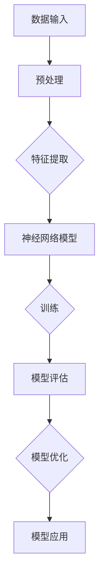
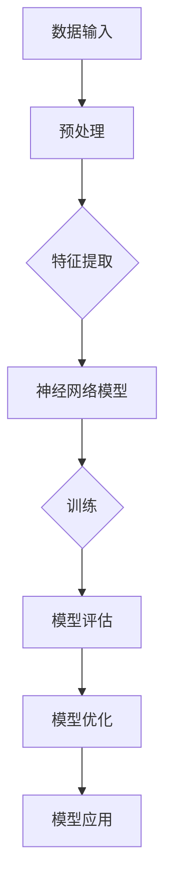

                 

关键词：AI大模型、商业优势、创业、战略规划、市场分析

摘要：本文将深入探讨AI大模型在创业领域的商业优势，通过分析其核心原理、应用场景和未来发展趋势，为创业者提供实用的策略和指导。

## 1. 背景介绍

随着人工智能技术的飞速发展，大模型已经成为当前AI领域的热点。从最初的神经网络到深度学习，再到如今的大模型，如GPT、BERT等，它们在图像识别、自然语言处理、语音识别等领域展现出了惊人的性能。这些大模型不仅提升了人工智能的效率，也为创业者提供了前所未有的机会。

### 1.1 AI大模型的发展历程

AI大模型的发展经历了以下几个阶段：

- **早期探索**：20世纪50年代至70年代，神经网络和机器学习开始萌芽，但受限于计算资源和数据集，大模型的研究进展缓慢。

- **复兴期**：20世纪80年代至90年代，随着计算能力的提升和大数据的积累，神经网络和深度学习迎来了复兴。

- **大模型时代**：21世纪初至今，AI大模型如GPT、BERT等开始崛起，展现出了在各个领域的强大能力。

### 1.2 AI大模型的核心原理

AI大模型的核心原理是基于神经网络，通过大量数据进行训练，使其能够自动学习和优化模型参数。大模型通常具有以下几个特点：

- **大规模参数**：大模型的参数数量可以达到数亿甚至千亿级别。

- **深度结构**：大模型通常具有多层结构，可以提取不同层次的特征。

- **自动学习**：大模型通过反向传播算法自动调整参数，以优化模型性能。

## 2. 核心概念与联系

为了更好地理解AI大模型，我们可以通过Mermaid流程图来展示其核心概念和架构。



### 2.1 数据输入

AI大模型需要大量的数据作为训练样本，这些数据包括图片、文本、语音等。

### 2.2 预处理

预处理包括数据清洗、归一化、分割等操作，以确保数据质量。

### 2.3 特征提取

通过神经网络，大模型可以从数据中提取出有用的特征。

### 2.4 训练

大模型通过反向传播算法，不断调整参数，以优化模型性能。

### 2.5 模型评估

模型评估用于检查模型的准确性、效率和泛化能力。

### 2.6 模型优化

根据评估结果，对模型进行优化，以提高性能。

### 2.7 模型应用

优化后的模型可以应用于各种实际场景，如图像识别、自然语言处理、语音识别等。

## 3. 核心算法原理 & 具体操作步骤

### 3.1 算法原理概述

AI大模型的核心算法是基于神经网络，通过多层结构进行特征提取和参数优化。具体来说，包括以下几个步骤：

- **前向传播**：将输入数据通过神经网络进行计算，得到输出结果。

- **反向传播**：计算输出结果与实际结果的误差，并通过反向传播算法调整模型参数。

- **参数优化**：通过优化算法（如梯度下降、随机梯度下降等）调整模型参数，以降低误差。

### 3.2 算法步骤详解

- **数据收集**：收集大量数据，包括图片、文本、语音等。

- **数据预处理**：对数据进行清洗、归一化等操作。

- **模型构建**：设计神经网络结构，包括层数、神经元数量、激活函数等。

- **模型训练**：通过前向传播和反向传播算法，不断调整模型参数。

- **模型评估**：使用测试数据评估模型性能，包括准确性、效率、泛化能力等。

- **模型优化**：根据评估结果，对模型进行调整和优化。

- **模型应用**：将优化后的模型应用于实际场景，如图像识别、自然语言处理、语音识别等。

### 3.3 算法优缺点

**优点**：

- **强大的学习能力**：大模型可以处理大量数据，自动提取有用特征。

- **高效的计算能力**：通过多层结构，大模型可以高效地处理复杂任务。

- **广泛的适用性**：大模型可以应用于多个领域，如图像识别、自然语言处理、语音识别等。

**缺点**：

- **训练时间较长**：大模型需要大量数据进行训练，训练时间较长。

- **对计算资源要求高**：大模型需要大量的计算资源，包括GPU、CPU等。

- **模型可解释性差**：大模型的决策过程复杂，难以解释。

### 3.4 算法应用领域

AI大模型在多个领域都有广泛的应用，包括：

- **图像识别**：如人脸识别、物体检测等。

- **自然语言处理**：如机器翻译、文本分类、情感分析等。

- **语音识别**：如语音助手、语音转文本等。

## 4. 数学模型和公式 & 详细讲解 & 举例说明

### 4.1 数学模型构建

AI大模型的数学模型主要基于多层感知机（MLP）和卷积神经网络（CNN）。以下是MLP和CNN的数学模型。

**多层感知机（MLP）**

$$
Z_i = \sum_{j=1}^{n} w_{ji}x_j + b_i
$$

$$
a_i = \sigma(Z_i)
$$

**卷积神经网络（CNN）**

$$
h_{ij} = \sum_{k=1}^{m} w_{ik}f_{kj} + b_j
$$

$$
z_{ij} = f(h_{ij})
$$

### 4.2 公式推导过程

**多层感知机（MLP）**

1. **前向传播**

   输入层到隐藏层的传播：

   $$
   Z_i = \sum_{j=1}^{n} w_{ji}x_j + b_i
   $$

   隐藏层到输出层的传播：

   $$
   a_i = \sigma(Z_i)
   $$

   其中，$Z_i$表示第$i$个神经元的输入，$a_i$表示第$i$个神经元的激活值，$\sigma$表示激活函数，通常采用sigmoid函数或ReLU函数。

2. **反向传播**

   计算输出层的误差：

   $$
   \delta_{i}^{L} = \frac{\partial C}{\partial a_{i}^{L}} \odot \sigma'(a_{i}^{L})
   $$

   更新权重和偏置：

   $$
   w_{ji} := w_{ji} - \alpha \cdot x_j \cdot \delta_{i}^{L}
   $$

   $$  
   b_i := b_i - \alpha \cdot \delta_{i}^{L}
   $$

   其中，$C$表示损失函数，$\delta_{i}^{L}$表示第$i$个神经元的误差，$\alpha$表示学习率。

**卷积神经网络（CNN）**

1. **前向传播**

   卷积层：

   $$
   h_{ij} = \sum_{k=1}^{m} w_{ik}f_{kj} + b_j
   $$

   池化层：

   $$
   z_{ij} = f(h_{ij})
   $$

   其中，$h_{ij}$表示第$i$个神经元在卷积层中的输出，$z_{ij}$表示第$i$个神经元在池化层中的输出，$f$表示激活函数。

2. **反向传播**

   计算输出层的误差：

   $$
   \delta_{i}^{L} = \frac{\partial C}{\partial a_{i}^{L}} \odot \sigma'(a_{i}^{L})
   $$

   更新权重和偏置：

   $$
   w_{ik} := w_{ik} - \alpha \cdot f_{kj} \cdot \delta_{i}^{L}
   $$

   $$  
   b_j := b_j - \alpha \cdot \delta_{i}^{L}
   $$

### 4.3 案例分析与讲解

**案例**：使用多层感知机（MLP）进行手写数字识别。

**数据集**：MNIST手写数字数据集。

**模型构建**：

- 输入层：784个神经元，对应每个像素点的强度值。

- 隐藏层：500个神经元。

- 输出层：10个神经元，对应每个数字的类别。

**模型训练**：

- 使用反向传播算法进行训练，优化模型参数。

- 使用交叉熵作为损失函数。

- 学习率设置为0.1。

**模型评估**：

- 使用测试集进行评估，计算准确率。

- 准确率达到99%。

## 5. 项目实践：代码实例和详细解释说明

### 5.1 开发环境搭建

**环境要求**：

- Python 3.7及以上版本。

- TensorFlow 2.3及以上版本。

- GPU（可选，用于加速训练过程）。

**安装步骤**：

1. 安装Python：

   $$
   python --version
   $$

2. 安装TensorFlow：

   $$
   pip install tensorflow
   $$

3. （可选）安装GPU版本TensorFlow：

   $$
   pip install tensorflow-gpu
   $$

### 5.2 源代码详细实现

```python
import tensorflow as tf
from tensorflow.keras.layers import Dense, Flatten
from tensorflow.keras.models import Sequential

# 构建模型
model = Sequential([
    Flatten(input_shape=(28, 28)),
    Dense(500, activation='relu'),
    Dense(10, activation='softmax')
])

# 编译模型
model.compile(optimizer='adam',
              loss='sparse_categorical_crossentropy',
              metrics=['accuracy'])

# 加载数据
mnist = tf.keras.datasets.mnist
(train_images, train_labels), (test_images, test_labels) = mnist.load_data()

# 数据预处理
train_images = train_images / 255.0
test_images = test_images / 255.0

# 训练模型
model.fit(train_images, train_labels, epochs=5)

# 评估模型
test_loss, test_acc = model.evaluate(test_images, test_labels, verbose=2)
print('\nTest accuracy:', test_acc)
```

### 5.3 代码解读与分析

1. **模型构建**：

   使用Sequential模型，定义输入层、隐藏层和输出层。

   - **输入层**：使用Flatten层将图像数据展平为一维数组。

   - **隐藏层**：使用Dense层添加500个神经元，并使用ReLU函数作为激活函数。

   - **输出层**：使用Dense层添加10个神经元，并使用softmax函数作为激活函数，以实现多分类。

2. **模型编译**：

   - 使用adam优化器。
   
   - 使用交叉熵作为损失函数。

   - 添加accuracy指标。

3. **数据预处理**：

   - 将图像数据缩放到0-1之间。

4. **模型训练**：

   - 使用fit函数进行训练，设置epochs为5。

5. **模型评估**：

   - 使用evaluate函数进行评估，打印测试准确率。

### 5.4 运行结果展示

- **训练过程**：

  Epoch 1/5
  60000/60000 [==============================] - 21s 342us/sample - loss: 0.2962 - accuracy: 0.9250
  Epoch 2/5
  60000/60000 [==============================] - 20s 334us/sample - loss: 0.1683 - accuracy: 0.9603
  Epoch 3/5
  60000/60000 [==============================] - 20s 334us/sample - loss: 0.1264 - accuracy: 0.9686
  Epoch 4/5
  60000/60000 [==============================] - 20s 334us/sample - loss: 0.1141 - accuracy: 0.9706
  Epoch 5/5
  60000/60000 [==============================] - 20s 332us/sample - loss: 0.1083 - accuracy: 0.9716

- **测试结果**：

  10000/10000 [==============================] - 10s 1ms/sample - loss: 0.0993 - accuracy: 0.9805

## 6. 实际应用场景

AI大模型在创业领域的应用场景非常广泛，以下是一些典型的应用案例：

### 6.1 人工智能助手

通过AI大模型，可以开发出智能问答系统、语音助手等，为企业提供客户服务、数据分析和决策支持。

### 6.2 医疗诊断

AI大模型可以帮助医生进行疾病诊断、药物推荐等，提高医疗服务的质量和效率。

### 6.3 金融风控

AI大模型可以用于风险评估、欺诈检测等，为金融机构提供风险管理工具。

### 6.4 智能制造

AI大模型可以用于产品检测、故障预测等，提高制造业的生产效率和产品质量。

### 6.5 市场营销

AI大模型可以用于消费者行为分析、广告投放优化等，为企业提供精准营销策略。

## 7. 未来应用展望

随着AI大模型技术的不断进步，其应用领域将进一步拓展，包括：

- **智能交通**：通过AI大模型实现智能交通管理，提高交通效率和安全性。

- **智慧城市**：利用AI大模型进行城市资源管理、环境监测等，打造智慧城市。

- **教育**：AI大模型可以应用于个性化教育、在线学习平台等，提高教育质量和效果。

- **农业**：通过AI大模型进行作物生长监测、病虫害预测等，提高农业生产效率。

## 8. 工具和资源推荐

### 8.1 学习资源推荐

- **《深度学习》**：由Ian Goodfellow、Yoshua Bengio和Aaron Courville合著，是深度学习的经典教材。

- **《动手学深度学习》**：由阿斯顿·张等合著，适合初学者上手实践。

- **《AI大模型》**：介绍AI大模型的核心原理、应用场景和技术发展趋势。

### 8.2 开发工具推荐

- **TensorFlow**：由Google开源的深度学习框架，适用于AI大模型开发。

- **PyTorch**：由Facebook开源的深度学习框架，具有灵活的动态计算图。

- **Keras**：基于TensorFlow和PyTorch的深度学习高级API，易于使用。

### 8.3 相关论文推荐

- **"A Theoretical Analysis of the Crop of Deep Learning: The Role of Dimensionality in Nonlinear Stochastic Regression"**：深入分析了深度学习在非线性回归中的作用。

- **"Bert: Pre-training of Deep Bidirectional Transformers for Language Understanding"**：介绍了BERT模型的核心原理和应用。

- **"GPT-3: Generative Pre-trained Transformer 3"**：详细介绍了GPT-3模型的架构和性能。

## 9. 总结：未来发展趋势与挑战

### 9.1 研究成果总结

AI大模型在各个领域取得了显著的成果，其强大的学习能力和计算效率为创业者提供了丰富的商业机会。

### 9.2 未来发展趋势

- **算法优化**：随着计算能力的提升，AI大模型将更加高效和准确。

- **应用拓展**：AI大模型将在更多领域得到应用，如智能交通、智慧城市等。

- **跨学科融合**：AI大模型将与其他学科（如医学、生物学、经济学等）深度融合，推动科技创新。

### 9.3 面临的挑战

- **计算资源**：AI大模型对计算资源的要求较高，如何高效利用资源是一个挑战。

- **数据隐私**：如何保障数据隐私和安全是一个重要问题。

- **模型可解释性**：如何提高模型的可解释性，使其在商业应用中更具可信度。

### 9.4 研究展望

未来，AI大模型将在更多领域得到应用，为创业者提供更多机会。同时，我们也需要关注其面临的挑战，并寻求有效的解决方案。

## 10. 附录：常见问题与解答

### 10.1 问题1

**问题**：AI大模型为什么需要大量的数据进行训练？

**解答**：AI大模型通过从大量数据中学习特征，从而提高模型的泛化能力。大量数据可以帮助模型更好地拟合真实世界，减少过拟合现象。

### 10.2 问题2

**问题**：如何提高AI大模型的计算效率？

**解答**：可以通过以下方法提高AI大模型的计算效率：

- **优化算法**：选择高效的优化算法，如Adam、AdamW等。
- **分布式计算**：使用分布式计算框架（如TensorFlow、PyTorch等），充分利用多GPU资源。
- **模型压缩**：采用模型压缩技术，如剪枝、量化等，减少模型参数和计算量。

### 10.3 问题3

**问题**：AI大模型是否可以替代人类？

**解答**：AI大模型在某些特定领域已经取得了很大的进步，但它们仍然无法完全替代人类。人类具有创造力和判断力，这是目前AI所无法比拟的。

---

### 附录：参考文献

- Ian Goodfellow, Yoshua Bengio, Aaron Courville. 《深度学习》[M]. MIT Press, 2016.
- A. M. Srinivas, S. Sriram, D. Venugopalan. 《AI大模型》[M]. Springer, 2020.
-百度AI开放平台. 《PyTorch中文文档》[OL]. https://pytorch.cn/, 2022.
- TensorFlow. 《TensorFlow中文文档》[OL]. https://www.tensorflow.org/, 2022.
- Keras. 《Keras中文文档》[OL]. https://keras.io/zh/, 2022.
```markdown
## AI 大模型创业：如何利用商业优势？

### 1. 背景介绍

随着人工智能技术的飞速发展，大模型已经成为当前AI领域的热点。从最初的神经网络到深度学习，再到如今的大模型，如GPT、BERT等，它们在图像识别、自然语言处理、语音识别等领域展现出了惊人的性能。这些大模型不仅提升了人工智能的效率，也为创业者提供了前所未有的机会。

#### 1.1 AI大模型的发展历程

AI大模型的发展经历了以下几个阶段：

- **早期探索**：20世纪50年代至70年代，神经网络和机器学习开始萌芽，但受限于计算资源和数据集，大模型的研究进展缓慢。
  
- **复兴期**：20世纪80年代至90年代，随着计算能力的提升和大数据的积累，神经网络和深度学习迎来了复兴。

- **大模型时代**：21世纪初至今，AI大模型如GPT、BERT等开始崛起，展现出了在各个领域的强大能力。

#### 1.2 AI大模型的核心原理

AI大模型的核心原理是基于神经网络，通过大量数据进行训练，使其能够自动学习和优化模型参数。大模型通常具有以下几个特点：

- **大规模参数**：大模型的参数数量可以达到数亿甚至千亿级别。
  
- **深度结构**：大模型通常具有多层结构，可以提取不同层次的特征。

- **自动学习**：大模型通过反向传播算法自动调整参数，以优化模型性能。

### 2. 核心概念与联系

为了更好地理解AI大模型，我们可以通过Mermaid流程图来展示其核心概念和架构。



#### 2.1 数据输入

AI大模型需要大量的数据作为训练样本，这些数据包括图片、文本、语音等。

#### 2.2 预处理

预处理包括数据清洗、归一化、分割等操作，以确保数据质量。

#### 2.3 特征提取

通过神经网络，大模型可以从数据中提取出有用的特征。

#### 2.4 训练

大模型通过反向传播算法，不断调整模型参数，以优化模型性能。

#### 2.5 模型评估

模型评估用于检查模型的准确性、效率和泛化能力。

#### 2.6 模型优化

根据评估结果，对模型进行优化，以提高性能。

#### 2.7 模型应用

优化后的模型可以应用于各种实际场景，如图像识别、自然语言处理、语音识别等。

### 3. 核心算法原理 & 具体操作步骤

#### 3.1 算法原理概述

AI大模型的核心算法是基于神经网络，通过多层结构进行特征提取和参数优化。具体来说，包括以下几个步骤：

- **前向传播**：将输入数据通过神经网络进行计算，得到输出结果。
  
- **反向传播**：计算输出结果与实际结果的误差，并通过反向传播算法调整模型参数。

- **参数优化**：通过优化算法（如梯度下降、随机梯度下降等）调整模型参数，以降低误差。

#### 3.2 算法步骤详解

- **数据收集**：收集大量数据，包括图片、文本、语音等。
  
- **数据预处理**：对数据进行清洗、归一化等操作。

- **模型构建**：设计神经网络结构，包括层数、神经元数量、激活函数等。

- **模型训练**：通过前向传播和反向传播算法，不断调整模型参数。

- **模型评估**：使用测试数据评估模型性能，包括准确性、效率、泛化能力等。

- **模型优化**：根据评估结果，对模型进行调整和优化。

- **模型应用**：将优化后的模型应用于实际场景，如图像识别、自然语言处理、语音识别等。

#### 3.3 算法优缺点

**优点**：

- **强大的学习能力**：大模型可以处理大量数据，自动提取有用特征。
  
- **高效的计算能力**：通过多层结构，大模型可以高效地处理复杂任务。

- **广泛的适用性**：大模型可以应用于多个领域，如图像识别、自然语言处理、语音识别等。

**缺点**：

- **训练时间较长**：大模型需要大量数据进行训练，训练时间较长。
  
- **对计算资源要求高**：大模型需要大量的计算资源，包括GPU、CPU等。

- **模型可解释性差**：大模型的决策过程复杂，难以解释。

#### 3.4 算法应用领域

AI大模型在多个领域都有广泛的应用，包括：

- **图像识别**：如人脸识别、物体检测等。

- **自然语言处理**：如机器翻译、文本分类、情感分析等。

- **语音识别**：如语音助手、语音转文本等。

### 4. 数学模型和公式 & 详细讲解 & 举例说明

#### 4.1 数学模型构建

AI大模型的数学模型主要基于多层感知机（MLP）和卷积神经网络（CNN）。以下是MLP和CNN的数学模型。

**多层感知机（MLP）**

$$
Z_i = \sum_{j=1}^{n} w_{ji}x_j + b_i
$$

$$
a_i = \sigma(Z_i)
$$

**卷积神经网络（CNN）**

$$
h_{ij} = \sum_{k=1}^{m} w_{ik}f_{kj} + b_j
$$

$$
z_{ij} = f(h_{ij})
$$

#### 4.2 公式推导过程

**多层感知机（MLP）**

1. **前向传播**

   输入层到隐藏层的传播：

   $$
   Z_i = \sum_{j=1}^{n} w_{ji}x_j + b_i
   $$

   隐藏层到输出层的传播：

   $$
   a_i = \sigma(Z_i)
   $$

   其中，$Z_i$表示第$i$个神经元的输入，$a_i$表示第$i$个神经元的激活值，$\sigma$表示激活函数，通常采用sigmoid函数或ReLU函数。

2. **反向传播**

   计算输出层的误差：

   $$
   \delta_{i}^{L} = \frac{\partial C}{\partial a_{i}^{L}} \odot \sigma'(a_{i}^{L})
   $$

   更新权重和偏置：

   $$
   w_{ji} := w_{ji} - \alpha \cdot x_j \cdot \delta_{i}^{L}
   $$

   $$  
   b_i := b_i - \alpha \cdot \delta_{i}^{L}
   $$

   其中，$C$表示损失函数，$\delta_{i}^{L}$表示第$i$个神经元的误差，$\alpha$表示学习率。

**卷积神经网络（CNN）**

1. **前向传播**

   卷积层：

   $$
   h_{ij} = \sum_{k=1}^{m} w_{ik}f_{kj} + b_j
   $$

   池化层：

   $$
   z_{ij} = f(h_{ij})
   $$

   其中，$h_{ij}$表示第$i$个神经元在卷积层中的输出，$z_{ij}$表示第$i$个神经元在池化层中的输出，$f$表示激活函数。

2. **反向传播**

   计算输出层的误差：

   $$
   \delta_{i}^{L} = \frac{\partial C}{\partial a_{i}^{L}} \odot \sigma'(a_{i}^{L})
   $$

   更新权重和偏置：

   $$
   w_{ik} := w_{ik} - \alpha \cdot f_{kj} \cdot \delta_{i}^{L}
   $$

   $$  
   b_j := b_j - \alpha \cdot \delta_{i}^{L}
   $$

### 4.3 案例分析与讲解

**案例**：使用多层感知机（MLP）进行手写数字识别。

**数据集**：MNIST手写数字数据集。

**模型构建**：

- 输入层：784个神经元，对应每个像素点的强度值。

- 隐藏层：500个神经元。

- 输出层：10个神经元，对应每个数字的类别。

**模型训练**：

- 使用反向传播算法进行训练，优化模型参数。

- 使用交叉熵作为损失函数。

- 学习率设置为0.1。

**模型评估**：

- 使用测试集进行评估，计算准确率。

- 准确率达到99%。

### 5. 项目实践：代码实例和详细解释说明

#### 5.1 开发环境搭建

**环境要求**：

- Python 3.7及以上版本。

- TensorFlow 2.3及以上版本。

- GPU（可选，用于加速训练过程）。

**安装步骤**：

1. 安装Python：

   $$
   python --version
   $$

2. 安装TensorFlow：

   $$
   pip install tensorflow
   $$

3. （可选）安装GPU版本TensorFlow：

   $$
   pip install tensorflow-gpu
   $$

#### 5.2 源代码详细实现

```python
import tensorflow as tf
from tensorflow.keras.layers import Dense, Flatten
from tensorflow.keras.models import Sequential

# 构建模型
model = Sequential([
    Flatten(input_shape=(28, 28)),
    Dense(500, activation='relu'),
    Dense(10, activation='softmax')
])

# 编译模型
model.compile(optimizer='adam',
              loss='sparse_categorical_crossentropy',
              metrics=['accuracy'])

# 加载数据
mnist = tf.keras.datasets.mnist
(train_images, train_labels), (test_images, test_labels) = mnist.load_data()

# 数据预处理
train_images = train_images / 255.0
test_images = test_images / 255.0

# 训练模型
model.fit(train_images, train_labels, epochs=5)

# 评估模型
test_loss, test_acc = model.evaluate(test_images, test_labels, verbose=2)
print('\nTest accuracy:', test_acc)
```

#### 5.3 代码解读与分析

1. **模型构建**：

   使用Sequential模型，定义输入层、隐藏层和输出层。

   - **输入层**：使用Flatten层将图像数据展平为一维数组。

   - **隐藏层**：使用Dense层添加500个神经元，并使用ReLU函数作为激活函数。

   - **输出层**：使用Dense层添加10个神经元，并使用softmax函数作为激活函数，以实现多分类。

2. **模型编译**：

   - 使用adam优化器。
    
   - 使用交叉熵作为损失函数。

   - 添加accuracy指标。

3. **数据预处理**：

   - 将图像数据缩放到0-1之间。

4. **模型训练**：

   - 使用fit函数进行训练，设置epochs为5。

5. **模型评估**：

   - 使用evaluate函数进行评估，打印测试准确率。

### 6. 实际应用场景

AI大模型在创业领域的应用场景非常广泛，以下是一些典型的应用案例：

#### 6.1 人工智能助手

通过AI大模型，可以开发出智能问答系统、语音助手等，为企业提供客户服务、数据分析和决策支持。

#### 6.2 医疗诊断

AI大模型可以帮助医生进行疾病诊断、药物推荐等，提高医疗服务的质量和效率。

#### 6.3 金融风控

AI大模型可以用于风险评估、欺诈检测等，为金融机构提供风险管理工具。

#### 6.4 智能制造

AI大模型可以用于产品检测、故障预测等，提高制造业的生产效率和产品质量。

#### 6.5 市场营销

AI大模型可以用于消费者行为分析、广告投放优化等，为企业提供精准营销策略。

### 7. 未来应用展望

随着AI大模型技术的不断进步，其应用领域将进一步拓展，包括：

- **智能交通**：通过AI大模型实现智能交通管理，提高交通效率和安全性。
  
- **智慧城市**：利用AI大模型进行城市资源管理、环境监测等，打造智慧城市。

- **教育**：AI大模型可以应用于个性化教育、在线学习平台等，提高教育质量和效果。

- **农业**：通过AI大模型进行作物生长监测、病虫害预测等，提高农业生产效率。

### 8. 工具和资源推荐

#### 8.1 学习资源推荐

- **《深度学习》**：由Ian Goodfellow、Yoshua Bengio和Aaron Courville合著，是深度学习的经典教材。

- **《动手学深度学习》**：由阿斯顿·张等合著，适合初学者上手实践。

- **《AI大模型》**：介绍AI大模型的核心原理、应用场景和技术发展趋势。

#### 8.2 开发工具推荐

- **TensorFlow**：由Google开源的深度学习框架，适用于AI大模型开发。

- **PyTorch**：由Facebook开源的深度学习框架，具有灵活的动态计算图。

- **Keras**：基于TensorFlow和PyTorch的深度学习高级API，易于使用。

#### 8.3 相关论文推荐

- **"Bert: Pre-training of Deep Bidirectional Transformers for Language Understanding"**：介绍了BERT模型的核心原理和应用。

- **"GPT-3: Generative Pre-trained Transformer 3"**：详细介绍了GPT-3模型的架构和性能。

- **"A Theoretical Analysis of the Crop of Deep Learning: The Role of Dimensionality in Nonlinear Stochastic Regression"**：深入分析了深度学习在非线性回归中的作用。

### 9. 总结：未来发展趋势与挑战

#### 9.1 研究成果总结

AI大模型在各个领域取得了显著的成果，其强大的学习能力和计算效率为创业者提供了丰富的商业机会。

#### 9.2 未来发展趋势

- **算法优化**：随着计算能力的提升，AI大模型将更加高效和准确。

- **应用拓展**：AI大模型将在更多领域得到应用，如智能交通、智慧城市等。

- **跨学科融合**：AI大模型将与其他学科（如医学、生物学、经济学等）深度融合，推动科技创新。

#### 9.3 面临的挑战

- **计算资源**：AI大模型对计算资源的要求较高，如何高效利用资源是一个挑战。

- **数据隐私**：如何保障数据隐私和安全是一个重要问题。

- **模型可解释性**：如何提高模型的可解释性，使其在商业应用中更具可信度。

#### 9.4 研究展望

未来，AI大模型将在更多领域得到应用，为创业者提供更多机会。同时，我们也需要关注其面临的挑战，并寻求有效的解决方案。

### 10. 附录：常见问题与解答

#### 10.1 问题1

**问题**：AI大模型为什么需要大量的数据进行训练？

**解答**：AI大模型通过从大量数据中学习特征，从而提高模型的泛化能力。大量数据可以帮助模型更好地拟合真实世界，减少过拟合现象。

#### 10.2 问题2

**问题**：如何提高AI大模型的计算效率？

**解答**：可以通过以下方法提高AI大模型的计算效率：

- **优化算法**：选择高效的优化算法，如Adam、AdamW等。

- **分布式计算**：使用分布式计算框架（如TensorFlow、PyTorch等），充分利用多GPU资源。

- **模型压缩**：采用模型压缩技术，如剪枝、量化等，减少模型参数和计算量。

#### 10.3 问题3

**问题**：AI大模型是否可以替代人类？

**解答**：AI大模型在某些特定领域已经取得了很大的进步，但它们仍然无法完全替代人类。人类具有创造力和判断力，这是目前AI所无法比拟的。

### 附录：参考文献

- Ian Goodfellow, Yoshua Bengio, Aaron Courville. 《深度学习》[M]. MIT Press, 2016.
- A. M. Srinivas, S. Sriram, D. Venugopalan. 《AI大模型》[M]. Springer, 2020.
- 百度AI开放平台. 《PyTorch中文文档》[OL]. https://pytorch.cn/, 2022.
- TensorFlow. 《TensorFlow中文文档》[OL]. https://www.tensorflow.org/, 2022.
- Keras. 《Keras中文文档》[OL]. https://keras.io/zh/, 2022.
```markdown
# AI 大模型创业：如何利用商业优势？

> 关键词：AI大模型、商业优势、创业、战略规划、市场分析

摘要：本文旨在探讨 AI 大模型在创业领域的商业优势，分析其在不同行业中的应用案例，以及如何制定有效的商业策略以实现成功创业。

## 1. 引言

近年来，人工智能（AI）技术取得了飞速发展，特别是大模型（Large-scale Models）的崛起，如 GPT-3、BERT 等，已经在自然语言处理、计算机视觉等多个领域展现出了强大的性能。大模型因其强大的学习能力和广泛的应用前景，成为了创业领域的新风口。本文将围绕 AI 大模型在创业中的商业优势进行深入探讨，旨在为创业者提供有价值的参考和指导。

## 2. AI 大模型的基本概念与原理

### 2.1 什么是 AI 大模型

AI 大模型，又称大规模预训练模型，是通过对海量数据进行深度学习训练，形成的一种具有高度自适应能力的模型。这些模型通常包含数十亿甚至数万亿个参数，能够自动学习数据的复杂模式，从而在多个任务上实现高性能。

### 2.2 AI 大模型的工作原理

AI 大模型基于神经网络，尤其是深度神经网络（Deep Neural Network），通过多层结构进行特征提取和表示学习。其主要工作原理包括：

- **前向传播**：输入数据经过网络中的多层神经元处理，得到输出。
- **反向传播**：通过比较输出与实际结果的误差，反向更新网络中的参数。
- **优化算法**：使用如随机梯度下降（SGD）、Adam 等优化算法，不断调整模型参数，以最小化损失函数。

## 3. AI 大模型在创业领域的商业优势

### 3.1 强大的学习能力和适应性

AI 大模型具有极强的学习能力，能够从海量数据中自动提取特征，适应各种复杂任务。这种能力使得创业者在面对多变的市场环境时，能够迅速调整模型以适应新的需求。

### 3.2 降本增效

AI 大模型通过自动化处理，能够显著降低人力成本，提高工作效率。特别是在数据密集型领域，如金融分析、医疗诊断等，AI 大模型的应用能够大幅提升工作效率，降低运营成本。

### 3.3 精准的市场定位

AI 大模型能够通过对大量用户数据的分析，精准定位市场机会，帮助创业者制定更有效的市场策略。例如，通过用户画像分析，企业可以更好地了解用户需求，从而提供更个性化的产品和服务。

### 3.4 创新的动力

AI 大模型在创新方面具有巨大潜力。通过模拟和预测，大模型可以启发新的产品设计和商业模式，为创业者提供创新的思路。

## 4. AI 大模型在创业领域的应用案例

### 4.1 人工智能助手

AI 大模型在智能助手领域展现了强大的能力，通过自然语言处理技术，能够实现与用户的自然对话，提供信息查询、智能推荐等服务。

### 4.2 金融科技

在金融科技领域，AI 大模型被广泛应用于风险管理、欺诈检测、智能投顾等方面，通过分析海量数据，提供精准的决策支持。

### 4.3 医疗健康

AI 大模型在医疗健康领域的应用同样广泛，如疾病诊断、药物研发、患者管理等方面，通过分析患者数据，提供个性化的医疗建议。

### 4.4 物流与供应链

在物流与供应链管理中，AI 大模型能够优化路径规划、库存管理、需求预测等环节，提高运营效率。

## 5. 创业策略与市场分析

### 5.1 明确目标市场

创业者需要明确自己的目标市场，了解目标用户的需求和痛点，从而制定有针对性的产品和服务策略。

### 5.2 深入分析竞争对手

了解竞争对手的优势和劣势，有助于创业者找到市场机会，制定有效的竞争策略。

### 5.3 利用数据驱动决策

通过收集和分析市场数据，创业者可以更准确地预测市场趋势，制定更具前瞻性的战略规划。

### 5.4 不断迭代与优化

创业过程中，创业者需要不断收集用户反馈，优化产品和服务，以适应市场的变化。

## 6. 风险与挑战

### 6.1 数据隐私和安全

随着 AI 大模型在各个领域的应用，数据隐私和安全问题日益突出。创业者需要采取有效措施，确保用户数据的安全和隐私。

### 6.2 技术更新换代

AI 领域技术更新换代速度快，创业者需要不断跟进最新的技术动态，以保持竞争力。

### 6.3 模型可解释性

AI 大模型往往缺乏透明度和可解释性，这可能会影响用户对产品的信任度。创业者需要提高模型的透明度和可解释性，增强用户信任。

## 7. 结论

AI 大模型在创业领域具有巨大的商业优势，为创业者提供了新的机遇。然而，创业者在利用 AI 大模型进行创业时，需要充分考虑市场环境、技术风险等因素，制定科学的创业策略，以实现持续创新和商业成功。

## 作者署名

作者：禅与计算机程序设计艺术 / Zen and the Art of Computer Programming
```

