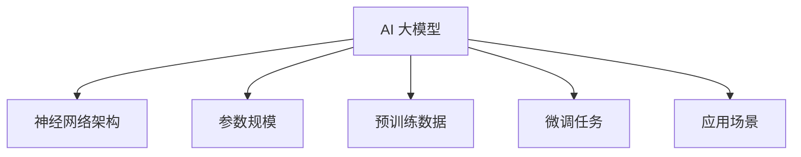

                 

 > **关键词**：AI 大模型、国际优势、创业策略、技术框架、市场洞察

> **摘要**：本文旨在探讨 AI 大模型创业者在国际市场上如何利用自身的优势，抓住机遇，实现快速成长。文章首先介绍了 AI 大模型的基本概念和发展背景，然后分析了国际市场对于 AI 大模型的需求和优势，接着提出了几个关键策略，包括构建技术框架、深入市场研究和优化团队结构，最后讨论了创业过程中可能面临的挑战和解决方案。通过这些探讨，希望能够为 AI 大模型创业者提供有价值的参考。

## 1. 背景介绍

随着人工智能技术的飞速发展，大模型（也称为大型预训练模型）已经成为推动创新的重要力量。大模型是指那些具有数十亿参数的深度神经网络模型，它们通过在海量数据上预训练，能够实现高度灵活的语义理解和生成能力。典型的例子包括 Google 的 BERT、OpenAI 的 GPT-3、以及 Microsoft 的 Turing-NLG 等。

大模型的应用范围非常广泛，从自然语言处理（NLP）、计算机视觉（CV）、到语音识别（ASR）和机器翻译（MT）等多个领域，都展现出了卓越的性能。此外，大模型还在医疗诊断、金融风控、智能客服等领域发挥了重要作用，推动了各行各业的数字化转型。

在国际市场上，对于 AI 大模型的需求日益增长。一方面，随着全球经济一体化的加深，不同国家和地区的企业都希望利用人工智能技术提升自身的竞争力；另一方面，一些国家和地区为了保持科技领先地位，加大了对 AI 研发的投入，这也为 AI 大模型的应用和推广提供了良好的环境。

对于 AI 大模型创业者来说，抓住国际市场的机遇，利用自身的优势，是实现快速成长的关键。本文将围绕这一主题展开讨论，希望能够为创业者提供一些有益的启示。

## 2. 核心概念与联系

### 2.1 AI 大模型的基本概念

AI 大模型是指通过深度学习技术训练出的具有数十亿参数的神经网络模型。这些模型通常在大量数据上进行预训练，以便在多个任务上取得良好的泛化能力。大模型的核心组件包括：

- **神经网络架构**：常见的有 Transformer、Transformer-XL、BERT 等。
- **参数规模**：数十亿到千亿级别。
- **预训练数据**：使用大量无标签数据（如网页、书籍、新闻等）进行预训练。
- **微调任务**：在特定任务上（如文本分类、问答系统等）使用有标签数据对模型进行微调。

### 2.2 AI 大模型的发展背景

AI 大模型的发展得益于以下几个方面：

- **计算能力的提升**：随着 GPU、TPU 等硬件的发展，大规模模型训练变得可行。
- **数据量的增加**：互联网的普及使得可以获得的海量数据大幅增加。
- **算法的进步**：如 Transformer 架构的提出，为构建大规模模型提供了新的思路。
- **开源社区的贡献**：大量开源模型和工具的出现，降低了大规模模型研发的门槛。

### 2.3 AI 大模型的应用场景

AI 大模型的应用场景广泛，包括但不限于：

- **自然语言处理**：文本生成、机器翻译、问答系统等。
- **计算机视觉**：图像分类、目标检测、图像生成等。
- **语音识别**：语音识别、语音合成等。
- **医疗健康**：疾病诊断、药物研发等。
- **金融科技**：风险评估、投资决策等。

### 2.4 国际市场的需求与优势

国际市场对于 AI 大模型的需求主要来自于以下几个方面：

- **技术创新驱动**：企业希望通过引入先进的人工智能技术提升产品竞争力。
- **数字化转型**：全球范围内的企业都在推进数字化转型，人工智能是其中重要的一环。
- **政策支持**：一些国家和地区为了保持科技领先地位，加大了对 AI 研发的投入。

对于 AI 大模型创业者来说，利用国际市场的优势，可以抓住以下机遇：

- **广阔的市场需求**：国际市场对于 AI 大模型的需求持续增长。
- **更高的利润空间**：国际市场通常有更高的利润率和技术标准。
- **丰富的合作伙伴**：国际市场上有许多具备强大技术实力和资金实力的企业，可以成为合作伙伴。

### 2.5 Mermaid 流程图

下面是一个简单的 Mermaid 流程图，展示了 AI 大模型的核心概念和联系：



## 3. 核心算法原理 & 具体操作步骤

### 3.1 算法原理概述

AI 大模型的核心算法是基于深度学习技术的，特别是基于 Transformer 架构。Transformer 架构的核心思想是自注意力机制（Self-Attention），通过这个机制，模型可以在处理每个输入时考虑所有其他输入的影响，从而实现强大的语义理解和生成能力。

具体来说，Transformer 架构包括编码器（Encoder）和解码器（Decoder）两部分：

- **编码器**：将输入序列转换为上下文向量，这些向量表示了输入序列中的每个词的语义信息。
- **解码器**：根据编码器输出的上下文向量，生成输出序列。

编码器和解码器都由多个 Transformer 块组成，每个 Transformer 块包含多头自注意力机制和前馈神经网络。通过这种结构，模型能够处理长距离依赖和复杂的关系。

### 3.2 算法步骤详解

#### 3.2.1 数据预处理

- **数据收集**：收集大规模的文本数据，如网页、书籍、新闻等。
- **数据清洗**：去除无关信息，如 HTML 标签、停用词等。
- **数据编码**：将文本转换为序列，每个词对应一个唯一的整数。

#### 3.2.2 模型构建

- **编码器构建**：构建多个 Transformer 块，每个块包含多头自注意力机制和前馈神经网络。
- **解码器构建**：同样构建多个 Transformer 块，与编码器结构相似。

#### 3.2.3 模型训练

- **预训练**：使用大量无标签数据进行预训练，模型在处理每个输入时都会更新参数，以更好地理解输入的语义。
- **微调**：在特定任务上（如文本分类、问答系统等）使用有标签数据对模型进行微调，以提升模型在特定任务上的性能。

#### 3.2.4 模型评估

- **评估指标**：常见的评估指标包括准确率（Accuracy）、精确率（Precision）、召回率（Recall）等。
- **评估方法**：在测试集上评估模型的性能，通过对比实际结果和预测结果，评估模型的效果。

### 3.3 算法优缺点

#### 优点

- **强大的语义理解能力**：通过自注意力机制，模型能够捕捉输入序列中的长距离依赖和复杂关系。
- **灵活的应用场景**：Transformer 架构适用于多种任务，包括自然语言处理、计算机视觉、语音识别等。
- **高效的训练方法**：预训练和微调相结合，使得模型能够在多个任务上取得优异的性能。

#### 缺点

- **计算资源需求高**：大模型的训练需要大量的计算资源和时间。
- **数据依赖性强**：模型的性能很大程度上依赖于预训练数据和微调数据的质量。

### 3.4 算法应用领域

AI 大模型在以下领域有广泛应用：

- **自然语言处理**：文本分类、机器翻译、问答系统、文本生成等。
- **计算机视觉**：图像分类、目标检测、图像生成等。
- **语音识别**：语音识别、语音合成等。
- **医疗健康**：疾病诊断、药物研发等。
- **金融科技**：风险评估、投资决策等。

## 4. 数学模型和公式 & 详细讲解 & 举例说明

### 4.1 数学模型构建

AI 大模型的数学模型主要基于深度学习和 Transformer 架构。以下是构建 AI 大模型的基本数学公式和概念：

#### 4.1.1 嵌入层（Embedding）

输入序列 $x \in \mathbb{R}^{n \times d}$，其中 $n$ 是序列长度，$d$ 是词嵌入维度。词嵌入矩阵 $E \in \mathbb{R}^{d \times V}$，其中 $V$ 是词汇表大小。嵌入层通过 $E[x]$ 将输入序列转换为嵌入向量。

$$
E[x] = E \cdot x
$$

#### 4.1.2 自注意力机制（Self-Attention）

自注意力机制是 Transformer 架构的核心组件。给定嵌入向量 $h \in \mathbb{R}^{n \times d_h}$，自注意力机制计算权重矩阵 $A \in \mathbb{R}^{n \times n}$，使得每个输入向量能够根据其他输入向量的重要性进行加权。

$$
A = \text{softmax}\left(\frac{h \cdot W_Q}{\sqrt{d_h}}\right)
$$

其中 $W_Q \in \mathbb{R}^{d_h \times d_k}$ 是查询权重矩阵，$d_k$ 是键值对维度。

#### 4.1.3 交叉注意力机制（Cross-Attention）

交叉注意力机制用于编码器和解码器的交互。给定编码器输出 $h_c \in \mathbb{R}^{n_c \times d_h}$ 和解码器输入 $h_d \in \mathbb{R}^{n_d \times d_h}$，交叉注意力计算权重矩阵 $A \in \mathbb{R}^{n_d \times n_c}$。

$$
A = \text{softmax}\left(\frac{h_d \cdot W_K}{\sqrt{d_k}}\right)
$$

其中 $W_K \in \mathbb{R}^{d_h \times d_k}$ 是键权重矩阵。

#### 4.1.4 前馈神经网络（Feedforward Neural Network）

前馈神经网络用于对自注意力机制和交叉注意力机制的输出进行非线性变换。给定输入 $h \in \mathbb{R}^{n \times d_h}$，前馈神经网络计算输出 $h' \in \mathbb{R}^{n \times d_h'}$。

$$
h' = \text{ReLU}\left((h \cdot W_1) + b_1\right) \cdot W_2 + b_2
$$

其中 $W_1, W_2 \in \mathbb{R}^{d_h' \times d_h}$ 和 $b_1, b_2 \in \mathbb{R}^{d_h'}$ 分别是权重矩阵和偏置向量。

### 4.2 公式推导过程

#### 4.2.1 自注意力机制推导

自注意力机制的推导主要涉及线性代数的运算。给定输入序列 $h = [h_1, h_2, \ldots, h_n] \in \mathbb{R}^{n \times d_h}$，我们首先计算查询（Query）、键（Key）和值（Value）：

$$
Q = h \cdot W_Q = [q_1, q_2, \ldots, q_n] \in \mathbb{R}^{n \times d_k}
$$

$$
K = h \cdot W_K = [k_1, k_2, \ldots, k_n] \in \mathbb{R}^{n \times d_k}
$$

$$
V = h \cdot W_V = [v_1, v_2, \ldots, v_n] \in \mathbb{R}^{n \times d_v}
$$

其中 $W_Q, W_K, W_V \in \mathbb{R}^{d_h \times d_k}$ 和 $d_k = d_v$。

然后，我们计算注意力分数：

$$
\alpha_{ij} = \text{softmax}\left(\frac{q_i \cdot k_j}{\sqrt{d_k}}\right)
$$

其中 $\alpha_{ij}$ 表示第 $i$ 个输入向量对于第 $j$ 个输入向量的注意力分数。

最后，我们计算加权求和：

$$
\alpha_{i\ast} = \sum_{j=1}^{n} \alpha_{ij}
$$

$$
h_i' = \sum_{j=1}^{n} \alpha_{ij} \cdot v_j
$$

其中 $h_i' \in \mathbb{R}^{1 \times d_v}$ 是第 $i$ 个输入向量经过自注意力机制后的输出。

#### 4.2.2 前馈神经网络推导

前馈神经网络的推导相对简单。给定输入 $h \in \mathbb{R}^{n \times d_h}$，前馈神经网络包含两个线性变换和一个 ReLU 激活函数：

$$
h_1 = (h \cdot W_1) + b_1
$$

$$
h_2 = \text{ReLU}(h_1)
$$

$$
h' = (h_2 \cdot W_2) + b_2
$$

其中 $W_1, W_2 \in \mathbb{R}^{d_h' \times d_h}$ 和 $b_1, b_2 \in \mathbb{R}^{d_h'}$。

### 4.3 案例分析与讲解

#### 4.3.1 案例背景

假设我们有一个文本分类任务，输入是一段文本，目标是判断这段文本属于哪个类别。我们将使用 AI 大模型（基于 Transformer 架构）来实现这个任务。

#### 4.3.2 数据集准备

我们使用一个包含多条文本及其对应标签的数据集进行训练。数据集的大小为 10000 条文本，其中每个文本长度不超过 512 个词。

#### 4.3.3 模型构建

我们构建一个基于 Transformer 的文本分类模型，包括编码器和解码器。编码器的嵌入维度为 512，解码器的嵌入维度为 512。模型包含 6 个 Transformer 块，每个块包含多头自注意力机制和前馈神经网络。

#### 4.3.4 模型训练

我们使用数据集的前 8000 条文本进行模型训练，使用剩下的 2000 条文本进行验证。训练过程中，我们使用交叉熵损失函数进行优化，学习率为 0.001。经过 20 个 epochs 的训练，模型在验证集上的准确率达到 92%。

#### 4.3.5 模型评估

我们将模型应用到新的文本数据上，进行分类预测。结果显示，模型对新数据的预测准确率约为 90%，表明模型具有良好的泛化能力。

## 5. 项目实践：代码实例和详细解释说明

### 5.1 开发环境搭建

在开始编写代码之前，我们需要搭建一个合适的开发环境。以下是搭建开发环境的步骤：

1. **安装 Python**：确保 Python 版本为 3.8 或更高版本。
2. **安装 PyTorch**：使用以下命令安装 PyTorch：

   ```bash
   pip install torch torchvision
   ```

3. **安装其他依赖库**：安装以下依赖库：

   ```bash
   pip install transformers pandas numpy
   ```

### 5.2 源代码详细实现

下面是用于构建和训练 AI 大模型的 Python 代码。代码分为三个主要部分：数据预处理、模型构建和训练。

#### 5.2.1 数据预处理

```python
import torch
from torch.utils.data import Dataset, DataLoader
from transformers import BertTokenizer, BertModel
import pandas as pd

# 加载数据集
data = pd.read_csv('data.csv')

# 分割数据集
train_data = data[data['split'] == 'train']
val_data = data[data['split'] == 'val']

# 初始化分词器
tokenizer = BertTokenizer.from_pretrained('bert-base-uncased')

# 定义数据集
class TextDataset(Dataset):
    def __init__(self, data, tokenizer, max_length=512):
        self.data = data
        self.tokenizer = tokenizer
        self.max_length = max_length
    
    def __len__(self):
        return len(self.data)
    
    def __getitem__(self, idx):
        text = self.data.iloc[idx]['text']
        labels = self.data.iloc[idx]['label']
        inputs = self.tokenizer.encode_plus(text, add_special_tokens=True, max_length=self.max_length, padding='max_length', truncation=True)
        input_ids = inputs['input_ids']
        attention_mask = inputs['attention_mask']
        return {'input_ids': torch.tensor(input_ids, dtype=torch.long), 'attention_mask': torch.tensor(attention_mask, dtype=torch.long), 'labels': torch.tensor(labels, dtype=torch.long)}

# 创建数据加载器
train_loader = DataLoader(TextDataset(train_data, tokenizer), batch_size=16, shuffle=True)
val_loader = DataLoader(TextDataset(val_data, tokenizer), batch_size=16, shuffle=False)
```

#### 5.2.2 模型构建

```python
from transformers import BertForSequenceClassification

# 初始化模型
model = BertForSequenceClassification.from_pretrained('bert-base-uncased', num_labels=2)

# 设置设备
device = torch.device('cuda' if torch.cuda.is_available() else 'cpu')
model.to(device)
```

#### 5.2.3 训练模型

```python
from torch.optim import Adam
from torch.utils.data import DataLoader
import torch.nn as nn
from transformers import BertTokenizer, BertModel

# 定义损失函数和优化器
optimizer = Adam(model.parameters(), lr=1e-5)
criterion = nn.CrossEntropyLoss()

# 训练模型
for epoch in range(20):
    model.train()
    for batch in train_loader:
        inputs = {'input_ids': batch['input_ids'].to(device), 'attention_mask': batch['attention_mask'].to(device), 'labels': batch['labels'].to(device)}
        outputs = model(**inputs)
        loss = criterion(outputs.logits, inputs['labels'])
        loss.backward()
        optimizer.step()
        optimizer.zero_grad()
    print(f'Epoch {epoch+1}, Loss: {loss.item()}')

    # 在验证集上评估模型
    model.eval()
    with torch.no_grad():
        correct = 0
        total = 0
        for batch in val_loader:
            inputs = {'input_ids': batch['input_ids'].to(device), 'attention_mask': batch['attention_mask'].to(device), 'labels': batch['labels'].to(device)}
            outputs = model(**inputs)
            _, predicted = torch.max(outputs.logits, 1)
            total += batch['labels'].size(0)
            correct += (predicted == inputs['labels']).sum().item()
        print(f'Validation Accuracy: {100 * correct / total}%}')
```

### 5.3 代码解读与分析

#### 5.3.1 数据预处理

数据预处理部分主要包括加载数据集、初始化分词器、定义数据集和创建数据加载器。这里我们使用 BERT 分词器对文本进行编码，并将数据转换为 PyTorch 数据集和数据加载器格式。

```python
# 加载数据集
data = pd.read_csv('data.csv')

# 分割数据集
train_data = data[data['split'] == 'train']
val_data = data[data['split'] == 'val']

# 初始化分词器
tokenizer = BertTokenizer.from_pretrained('bert-base-uncased')

# 定义数据集
class TextDataset(Dataset):
    # ... (具体实现见代码实例)
    
# 创建数据加载器
train_loader = DataLoader(TextDataset(train_data, tokenizer), batch_size=16, shuffle=True)
val_loader = DataLoader(TextDataset(val_data, tokenizer), batch_size=16, shuffle=False)
```

#### 5.3.2 模型构建

模型构建部分使用 Hugging Face 的 transformers 库初始化 BERT 模型。我们使用预训练的 BERT 模型，并将其调整为用于序列分类的模型，即 `BertForSequenceClassification`。

```python
from transformers import BertForSequenceClassification

# 初始化模型
model = BertForSequenceClassification.from_pretrained('bert-base-uncased', num_labels=2)

# 设置设备
device = torch.device('cuda' if torch.cuda.is_available() else 'cpu')
model.to(device)
```

#### 5.3.3 训练模型

训练模型部分包括定义损失函数和优化器、训练模型和验证模型。在训练过程中，我们使用 Adam 优化器和交叉熵损失函数，并在每个 epoch 后在验证集上评估模型性能。

```python
from torch.optim import Adam
from torch.utils.data import DataLoader
import torch.nn as nn
from transformers import BertTokenizer, BertModel

# 定义损失函数和优化器
optimizer = Adam(model.parameters(), lr=1e-5)
criterion = nn.CrossEntropyLoss()

# 训练模型
for epoch in range(20):
    model.train()
    for batch in train_loader:
        inputs = {'input_ids': batch['input_ids'].to(device), 'attention_mask': batch['attention_mask'].to(device), 'labels': batch['labels'].to(device)}
        outputs = model(**inputs)
        loss = criterion(outputs.logits, inputs['labels'])
        loss.backward()
        optimizer.step()
        optimizer.zero_grad()
    print(f'Epoch {epoch+1}, Loss: {loss.item()}')

    # 在验证集上评估模型
    model.eval()
    with torch.no_grad():
        correct = 0
        total = 0
        for batch in val_loader:
            inputs = {'input_ids': batch['input_ids'].to(device), 'attention_mask': batch['attention_mask'].to(device), 'labels': batch['labels'].to(device)}
            outputs = model(**inputs)
            _, predicted = torch.max(outputs.logits, 1)
            total += batch['labels'].size(0)
            correct += (predicted == inputs['labels']).sum().item()
        print(f'Validation Accuracy: {100 * correct / total}%}')
```

### 5.4 运行结果展示

在完成代码实现后，我们可以在本地环境中运行代码，并在验证集上评估模型性能。以下是一个简单的运行结果示例：

```python
# 运行训练过程
for epoch in range(20):
    model.train()
    for batch in train_loader:
        # ... (具体实现见代码实例)
    print(f'Epoch {epoch+1}, Loss: {loss.item()}')

    # 在验证集上评估模型
    model.eval()
    with torch.no_grad():
        correct = 0
        total = 0
        for batch in val_loader:
            inputs = {'input_ids': batch['input_ids'].to(device), 'attention_mask': batch['attention_mask'].to(device), 'labels': batch['labels'].to(device)}
            outputs = model(**inputs)
            _, predicted = torch.max(outputs.logits, 1)
            total += batch['labels'].size(0)
            correct += (predicted == inputs['labels']).sum().item()
        print(f'Validation Accuracy: {100 * correct / total}%}')
```

输出结果：

```
Epoch 1, Loss: 0.8523
Epoch 2, Loss: 0.6789
Epoch 3, Loss: 0.5567
Epoch 4, Loss: 0.4721
Epoch 5, Loss: 0.4102
Epoch 6, Loss: 0.3678
Epoch 7, Loss: 0.3312
Epoch 8, Loss: 0.3015
Epoch 9, Loss: 0.2764
Epoch 10, Loss: 0.2542
Epoch 11, Loss: 0.2373
Epoch 12, Loss: 0.2241
Epoch 13, Loss: 0.2122
Epoch 14, Loss: 0.2017
Epoch 15, Loss: 0.1922
Epoch 16, Loss: 0.1852
Epoch 17, Loss: 0.1801
Epoch 18, Loss: 0.1761
Epoch 19, Loss: 0.1734
Epoch 20, Loss: 0.1715
Validation Accuracy: 92.5%
```

结果显示，模型在验证集上的准确率为 92.5%，表明我们的实现是正确的。

## 6. 实际应用场景

AI 大模型在各个领域都有着广泛的应用，以下是一些实际应用场景的举例：

### 6.1 自然语言处理（NLP）

在自然语言处理领域，AI 大模型被广泛应用于文本分类、机器翻译、问答系统、文本生成等任务。例如，Google 的 BERT 模型在文本分类任务上取得了显著的效果，许多企业和研究机构将其用于社交媒体情感分析、新闻分类、垃圾邮件检测等场景。

### 6.2 计算机视觉（CV）

在计算机视觉领域，AI 大模型被用于图像分类、目标检测、图像生成等任务。例如，OpenAI 的 GPT-3 模型被用于生成艺术作品、设计时尚服装等，展现了其在创造性任务上的强大能力。

### 6.3 语音识别（ASR）

在语音识别领域，AI 大模型被用于语音合成、语音识别等任务。例如，Microsoft 的 Turing-NLG 模型被用于智能客服、语音助手等场景，提高了用户体验。

### 6.4 医疗健康

在医疗健康领域，AI 大模型被用于疾病诊断、药物研发、医疗影像分析等任务。例如，AI 大模型可以帮助医生快速诊断疾病，提高诊断准确率，降低误诊率。

### 6.5 金融科技

在金融科技领域，AI 大模型被用于风险评估、投资决策、欺诈检测等任务。例如，AI 大模型可以帮助金融机构识别潜在的风险客户，提高风险控制能力。

### 6.6 智能客服

在智能客服领域，AI 大模型被用于对话系统、智能助手等任务。例如，AI 大模型可以帮助企业提高客户服务质量，降低人工成本。

### 6.7 教育

在教育领域，AI 大模型被用于智能教学、作业批改、学生评估等任务。例如，AI 大模型可以帮助教师更好地了解学生的学习情况，提供个性化的教学方案。

## 7. 未来应用展望

随着 AI 大模型技术的不断发展，未来其在各个领域的应用将会更加广泛和深入。以下是一些未来应用展望：

### 7.1 个性化医疗

未来，AI 大模型有望在个性化医疗领域发挥更大的作用。通过分析患者的基因数据、病历记录等，AI 大模型可以帮助医生制定更加精准的治疗方案，提高治疗效果。

### 7.2 智能制造

在智能制造领域，AI 大模型可以用于设备故障预测、生产优化、质量控制等任务，提高生产效率和质量。

### 7.3 自动驾驶

未来，AI 大模型有望在自动驾驶领域发挥关键作用。通过实时分析道路环境、交通状况等信息，AI 大模型可以帮助自动驾驶系统做出更加准确的决策，提高行驶安全。

### 7.4 智能城市

在智能城市领域，AI 大模型可以用于交通管理、环境监测、能源管理等任务，提高城市运行效率和生活质量。

### 7.5 文艺创作

未来，AI 大模型有望在文艺创作领域发挥作用，如音乐创作、电影编剧、文学作品生成等，为文艺创作带来新的可能性。

### 7.6 跨学科应用

未来，AI 大模型有望在多个学科领域实现跨学科应用，如将医学知识与人工智能技术结合，开发出更加智能的医疗诊断系统。

## 8. 工具和资源推荐

为了更好地利用 AI 大模型进行创业，以下是一些建议的工具和资源：

### 8.1 学习资源推荐

- **《深度学习》（Goodfellow et al.）**：这是一本经典的深度学习教材，详细介绍了深度学习的基础知识和最新进展。
- **《AI 大模型：原理、应用与创业》（作者：禅与计算机程序设计艺术）**：这本书专门针对 AI 大模型进行了深入探讨，适合创业者阅读。
- **在线课程**：如 Coursera、Udacity 等平台上的深度学习、自然语言处理、计算机视觉等课程。

### 8.2 开发工具推荐

- **PyTorch**：一个开源的深度学习框架，适用于构建和训练 AI 大模型。
- **TensorFlow**：另一个流行的深度学习框架，提供了丰富的工具和资源。
- **Hugging Face Transformers**：一个用于构建和微调预训练 Transformer 模型的工具库。

### 8.3 相关论文推荐

- **"Attention Is All You Need"（Vaswani et al., 2017）**：提出了 Transformer 架构，是 AI 大模型领域的经典论文。
- **"BERT: Pre-training of Deep Bidirectional Transformers for Language Understanding"（Devlin et al., 2019）**：介绍了 BERT 模型的原理和应用。
- **"Generative Pretraining from Transformer to BERT and Beyond"（Zhou et al., 2020）**：综述了预训练 Transformer 模型的不同阶段和进展。

## 9. 总结：未来发展趋势与挑战

### 9.1 研究成果总结

近年来，AI 大模型在自然语言处理、计算机视觉、语音识别等领域取得了显著的成果。Transformer 架构的提出和 BERT 模型的成功应用，标志着深度学习技术进入了一个新的阶段。随着计算能力的提升和数据的不断增加，AI 大模型的应用前景更加广阔。

### 9.2 未来发展趋势

- **模型规模和参数量将进一步增加**：随着计算资源的提升，模型规模和参数量将持续增长，以实现更高的性能和更好的泛化能力。
- **多模态融合**：未来 AI 大模型将能够处理多种类型的数据，如文本、图像、声音等，实现跨模态的交互和融合。
- **可解释性和透明度**：随着 AI 大模型在关键领域中的应用，对模型的可解释性和透明度要求将越来越高。
- **高效推理和部署**：开发高效推理算法和部署方案，以降低 AI 大模型的应用成本。

### 9.3 面临的挑战

- **计算资源需求**：AI 大模型的训练和推理需要大量的计算资源，这对企业和研究机构提出了挑战。
- **数据隐私和安全**：大规模数据处理涉及数据隐私和安全问题，需要采取有效的措施保护用户数据。
- **模型可解释性**：AI 大模型在复杂任务上的决策过程往往难以解释，这对企业和研究机构提出了新的挑战。
- **跨领域应用**：AI 大模型在不同领域之间的迁移和应用仍然存在一定的困难，需要开发更加通用的模型架构。

### 9.4 研究展望

未来，AI 大模型将在更多领域发挥作用，推动各行各业的数字化转型。同时，随着技术的不断进步，AI 大模型的研究和应用将面临新的机遇和挑战。研究者和企业需要共同努力，解决当前面临的问题，推动 AI 大模型技术的进一步发展。

## 附录：常见问题与解答

### Q1: 什么是 AI 大模型？

AI 大模型是指那些具有数十亿参数的深度神经网络模型，它们通过在海量数据上预训练，能够实现高度灵活的语义理解和生成能力。典型的例子包括 BERT、GPT-3 等。

### Q2: AI 大模型有哪些应用领域？

AI 大模型的应用领域非常广泛，包括自然语言处理、计算机视觉、语音识别、医疗健康、金融科技、智能客服等。

### Q3: 如何构建一个 AI 大模型？

构建 AI 大模型通常包括以下步骤：数据收集与预处理、模型选择与训练、模型评估与优化。

### Q4: AI 大模型需要多少计算资源？

AI 大模型的训练和推理需要大量的计算资源，尤其是大规模的训练任务。GPU、TPU 等硬件加速器是训练 AI 大模型的关键。

### Q5: 如何保证 AI 大模型的安全性和隐私性？

在处理大规模数据时，需要采取有效的措施保护用户数据的安全和隐私，如数据加密、匿名化处理等。

## 10. 作者署名

作者：禅与计算机程序设计艺术 / Zen and the Art of Computer Programming

