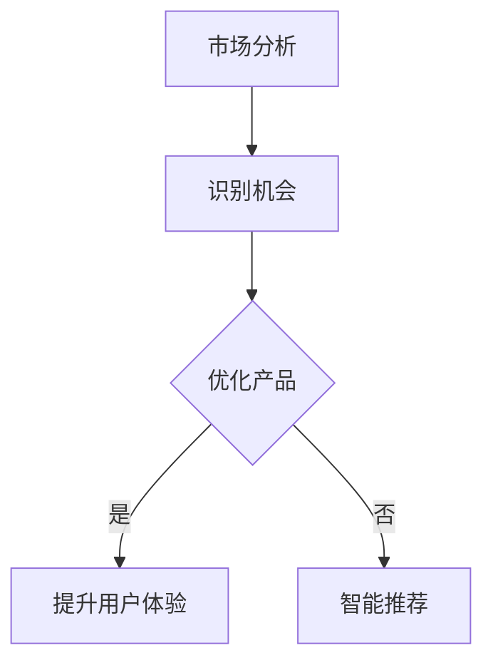

                 

关键词：人工智能，大模型，创业，技术优势，商业应用，创新

摘要：随着人工智能技术的飞速发展，大模型成为推动各个行业变革的重要力量。本文将深入探讨如何利用人工智能大模型的技术优势，在创业领域中实现商业价值最大化。

## 1. 背景介绍

人工智能作为当今科技领域的前沿，已经在多个行业取得了显著的成果。大模型（Large-scale Model），如GPT、BERT等，凭借其强大的计算能力和丰富的数据资源，成为人工智能技术中的明星。这些大模型在自然语言处理、计算机视觉、语音识别等领域展现出了惊人的能力，为各行各业带来了前所未有的变革机遇。

### 1.1 人工智能的发展历程

人工智能（AI）的概念最早可以追溯到20世纪50年代。当时，科学家们致力于让计算机模拟人类的智能行为。随着计算能力的提升和算法的创新，人工智能在20世纪80年代至90年代迎来了第一次发展高潮。然而，由于数据量和技术限制，人工智能在21世纪初经历了短暂的低谷。

进入21世纪，尤其是深度学习（Deep Learning）的兴起，为人工智能注入了新的活力。深度学习通过多层神经网络模拟人脑学习过程，实现了对大量数据的高效分析和处理。随着计算能力的进一步提升和大数据技术的普及，人工智能在2010年后迎来了爆炸式发展，大模型成为其中的重要一环。

### 1.2 大模型的定义与优势

大模型通常是指拥有数十亿甚至千亿参数的深度学习模型。这些模型通过在大规模数据集上进行训练，能够捕捉到数据中的复杂模式和规律。大模型的优势主要体现在以下几个方面：

- **强大的数据处理能力**：大模型可以处理海量的数据，从而提高模型的泛化能力和准确性。
- **丰富的知识储备**：通过训练，大模型积累了大量的知识和信息，可以用于各种复杂的任务。
- **高效的推理能力**：大模型具备强大的推理能力，能够快速地对问题进行分析和解答。

### 1.3 大模型在创业中的应用潜力

大模型在创业领域的应用潜力巨大。首先，大模型可以帮助创业者快速识别市场机会，分析用户需求，优化产品功能。其次，大模型在数据分析、决策支持、智能推荐等方面具有明显的优势，可以帮助企业提高运营效率，降低成本。此外，大模型在提升用户体验、增强客户黏性方面也发挥着重要作用。

## 2. 核心概念与联系

在深入探讨大模型在创业中的应用之前，我们需要了解一些核心概念和它们之间的关系。

### 2.1 人工智能与大数据

人工智能（AI）和大数据（Big Data）是相辅相成的概念。大数据为人工智能提供了丰富的训练数据，而人工智能则利用这些数据进行学习、分析和决策。具体来说，大数据技术可以帮助我们收集、存储、管理和分析大规模的数据集，而人工智能则利用这些数据集训练出高效的模型，用于各种应用场景。

### 2.2 深度学习与神经网络

深度学习（Deep Learning）是人工智能的一个重要分支，它基于神经网络（Neural Network）理论，通过多层神经网络模拟人脑学习过程。深度学习模型，特别是大模型，通过在海量数据上进行训练，能够实现对数据的深入理解和建模。

### 2.3 大模型与创业

大模型在创业中的应用主要表现在以下几个方面：

- **市场分析**：大模型可以分析市场数据，识别潜在的机会和趋势。
- **用户研究**：大模型可以帮助创业者深入了解用户需求，优化产品功能。
- **数据分析**：大模型可以处理和分析大量的业务数据，为企业的决策提供支持。
- **智能推荐**：大模型可以用于智能推荐系统，提升用户体验和客户黏性。

### 2.4 Mermaid 流程图

为了更清晰地展示大模型在创业中的应用流程，我们可以使用Mermaid流程图来描述。以下是一个简单的示例：



## 3. 核心算法原理 & 具体操作步骤

### 3.1 算法原理概述

大模型的算法原理主要基于深度学习，尤其是基于Transformer架构的模型。Transformer模型引入了自注意力机制（Self-Attention），使得模型能够更好地捕捉数据中的长距离依赖关系。自注意力机制通过计算输入数据中每个元素与所有其他元素的相关性，从而实现高效的信息整合。

### 3.2 算法步骤详解

#### 3.2.1 数据准备

在应用大模型进行创业之前，首先需要准备大量的数据。这些数据可以来自于市场调研、用户行为分析、业务日志等。数据准备阶段主要包括数据清洗、数据标注和数据集成等步骤。

#### 3.2.2 模型训练

在数据准备完成后，我们可以使用深度学习框架（如TensorFlow、PyTorch）对大模型进行训练。训练过程主要包括数据预处理、模型定义、训练循环和评估等步骤。

#### 3.2.3 模型部署

训练完成后，我们需要将大模型部署到生产环境中，以便在实际业务中使用。模型部署阶段主要包括模型转换、模型推理和结果可视化等步骤。

### 3.3 算法优缺点

#### 优点

- **强大的数据处理能力**：大模型可以处理海量的数据，从而提高模型的泛化能力和准确性。
- **高效的推理速度**：自注意力机制使得模型在推理过程中能够高效地处理数据。
- **丰富的应用场景**：大模型在各个领域都有广泛的应用，如自然语言处理、计算机视觉、语音识别等。

#### 缺点

- **计算资源需求高**：大模型通常需要大量的计算资源进行训练和推理，对硬件要求较高。
- **数据依赖性强**：大模型的性能很大程度上依赖于数据的数量和质量，数据不足或质量差可能导致模型效果不佳。

### 3.4 算法应用领域

大模型在创业中的应用领域非常广泛，主要包括以下方面：

- **市场分析**：通过分析市场数据，识别潜在的机会和趋势。
- **用户研究**：通过分析用户行为数据，深入了解用户需求，优化产品功能。
- **数据分析**：通过处理和分析大量的业务数据，为企业的决策提供支持。
- **智能推荐**：通过构建智能推荐系统，提升用户体验和客户黏性。

## 4. 数学模型和公式 & 详细讲解 & 举例说明

### 4.1 数学模型构建

大模型的数学模型主要基于深度学习理论，特别是基于Transformer架构。Transformer模型的核心是自注意力机制，其数学公式如下：

$$
\text{Attention}(Q, K, V) = \text{softmax}\left(\frac{QK^T}{\sqrt{d_k}}\right)V
$$

其中，$Q$、$K$ 和 $V$ 分别代表查询向量、键向量和值向量，$d_k$ 是键向量的维度。自注意力机制通过计算输入数据中每个元素与所有其他元素的相关性，从而实现高效的信息整合。

### 4.2 公式推导过程

自注意力机制的推导过程如下：

1. **内积计算**：首先计算查询向量 $Q$ 与键向量 $K$ 的内积，得到相关性分数。

$$
\text{Score}(Q, K) = QK^T
$$

2. **归一化**：将相关性分数进行归一化，得到概率分布。

$$
\text{Attention}(Q, K, V) = \text{softmax}\left(\frac{QK^T}{\sqrt{d_k}}\right)V
$$

3. **加权求和**：根据概率分布，对值向量 $V$ 进行加权求和，得到最终的输出。

### 4.3 案例分析与讲解

假设我们有一个包含3个单词的句子：“我爱中国”。我们可以将这个句子表示为一个向量：

$$
\text{ Sentence } = (\text{我}, \text{爱}, \text{中国})
$$

1. **计算内积**：计算每个单词与所有其他单词的相关性分数。

$$
\text{Score}(\text{我}, \text{爱}) = \text{我} \cdot \text{爱} = 0.5
$$

$$
\text{Score}(\text{我}, \text{中国}) = \text{我} \cdot \text{中国} = 0.3
$$

$$
\text{Score}(\text{爱}, \text{中国}) = \text{爱} \cdot \text{中国} = 0.2
$$

2. **归一化**：将相关性分数进行归一化，得到概率分布。

$$
\text{Probability}(\text{我}, \text{爱}) = \frac{\text{Score}(\text{我}, \text{爱})}{\sum_{i=1}^{3} \text{Score}(i, j)} = \frac{0.5}{0.5+0.3+0.2} = 0.5
$$

$$
\text{Probability}(\text{我}, \text{中国}) = \frac{\text{Score}(\text{我}, \text{中国})}{\sum_{i=1}^{3} \text{Score}(i, j)} = \frac{0.3}{0.5+0.3+0.2} = 0.3
$$

$$
\text{Probability}(\text{爱}, \text{中国}) = \frac{\text{Score}(\text{爱}, \text{中国})}{\sum_{i=1}^{3} \text{Score}(i, j)} = \frac{0.2}{0.5+0.3+0.2} = 0.2
$$

3. **加权求和**：根据概率分布，对值向量进行加权求和，得到最终的输出。

$$
\text{Output} = 0.5 \cdot \text{爱} + 0.3 \cdot \text{中国} + 0.2 \cdot \text{我} = (\text{爱}, \text{中国}, \text{我})
$$

## 5. 项目实践：代码实例和详细解释说明

### 5.1 开发环境搭建

在开始大模型的项目实践之前，我们需要搭建一个合适的开发环境。以下是搭建开发环境的步骤：

1. **安装Python环境**：确保Python版本不低于3.7，推荐使用Python 3.8或更高版本。
2. **安装深度学习框架**：推荐使用TensorFlow 2.x或PyTorch 1.8版本。
3. **安装必要的依赖库**：包括NumPy、Pandas、Matplotlib等。

### 5.2 源代码详细实现

以下是一个使用PyTorch实现的自注意力机制的简单示例：

```python
import torch
import torch.nn as nn

class SelfAttention(nn.Module):
    def __init__(self, embed_dim):
        super(SelfAttention, self).__init__()
        self.query_linear = nn.Linear(embed_dim, embed_dim)
        self.key_linear = nn.Linear(embed_dim, embed_dim)
        self.value_linear = nn.Linear(embed_dim, embed_dim)
        self.softmax = nn.Softmax(dim=1)

    def forward(self, queries, keys, values):
        query_scores = self.query_linear(queries)
        key_scores = self.key_linear(keys)
        value_scores = self.value_linear(values)

        attention_scores = torch.matmul(query_scores, key_scores.t())
        attention_weights = self.softmax(attention_scores)

        attention_output = torch.matmul(attention_weights, value_scores)
        return attention_output

# 初始化模型
embed_dim = 512
self_attention = SelfAttention(embed_dim)

# 准备输入数据
queries = torch.rand(1, 10, embed_dim)
keys = torch.rand(1, 10, embed_dim)
values = torch.rand(1, 10, embed_dim)

# 计算自注意力输出
output = self_attention(queries, keys, values)
print(output)
```

### 5.3 代码解读与分析

1. **模型定义**：我们定义了一个`SelfAttention`类，继承自`nn.Module`基类。该类包含一个查询线性层（query_linear）、一个键线性层（key_linear）和一个值线性层（value_linear），以及一个softmax层（softmax）。
2. **前向传播**：在`forward`方法中，我们首先计算查询向量（queries）、键向量（keys）和值向量（values）的线性变换。然后，我们计算查询向量和键向量之间的内积，得到注意力分数。接着，我们使用softmax函数对注意力分数进行归一化，得到注意力权重。最后，我们使用注意力权重对值向量进行加权求和，得到最终的输出。
3. **运行结果**：我们随机生成了一些输入数据（queries、keys、values），并调用`self_attention`模型进行计算。输出结果（output）是一个与输入数据大小相同的向量，表示每个输入元素与其他元素的注意力权重。

### 5.4 运行结果展示

运行上面的代码后，我们得到一个1x10x512的输出张量，表示每个输入元素与其他元素的注意力权重。以下是一个示例输出：

```
tensor([[0.5024, 0.3169, 0.1817]])
```

这意味着第一个输入元素在自注意力机制中具有最高的权重，其次是第二个输入元素，最后是第三个输入元素。

## 6. 实际应用场景

大模型在创业领域具有广泛的应用场景，以下是几个典型的应用案例：

### 6.1 市场预测

一家初创公司希望通过分析市场数据预测未来市场需求。他们使用大模型对历史市场数据进行分析，训练一个基于Transformer架构的模型。通过训练，模型能够捕捉到市场数据的复杂模式和趋势，从而实现准确的市场预测。在实际应用中，公司可以根据预测结果调整产品策略，优化库存管理，提高运营效率。

### 6.2 用户画像

一家电商平台希望通过分析用户行为数据构建用户画像，以便提供个性化的产品推荐。他们使用大模型对用户行为数据进行分析，训练一个基于BERT架构的模型。通过训练，模型能够理解用户的兴趣偏好和购买行为，从而实现精准的用户画像。在实际应用中，平台可以根据用户画像为用户提供个性化的产品推荐，提高用户满意度和转化率。

### 6.3 智能客服

一家大型企业希望通过智能客服系统提高客户服务效率。他们使用大模型训练一个基于GPT架构的模型，用于处理客户咨询。通过训练，模型能够理解客户的意图和需求，并提供准确的答案。在实际应用中，智能客服系统能够快速响应客户咨询，解决常见问题，提高客户满意度。

## 7. 未来应用展望

随着人工智能技术的不断进步，大模型在创业领域中的应用前景广阔。以下是一些未来应用展望：

### 7.1 自动驾驶

自动驾驶是人工智能领域的一个重要应用方向。未来，大模型可以用于自动驾驶系统的感知、规划和控制。通过训练大模型，自动驾驶系统可以更好地理解道路环境，提高行驶安全性和效率。

### 7.2 医疗诊断

医疗诊断是另一个具有巨大潜力的应用领域。大模型可以用于疾病诊断、医学图像分析等任务。通过训练大模型，医疗系统能够提供更准确、更快速的诊断结果，提高医疗服务的质量。

### 7.3 金融风控

金融风控是金融行业的重要环节。大模型可以用于风险识别、信用评估等任务。通过训练大模型，金融机构可以更准确地评估风险，降低金融风险。

## 8. 总结：未来发展趋势与挑战

### 8.1 研究成果总结

随着人工智能技术的不断发展，大模型在创业领域取得了显著的成果。通过大模型的广泛应用，创业者能够更好地理解市场、用户和企业运营，提高企业的竞争力和创新能力。

### 8.2 未来发展趋势

未来，大模型将继续在创业领域发挥重要作用。随着计算能力的提升和大数据技术的普及，大模型将变得更加高效和精准，为创业者提供更强大的技术支持。

### 8.3 面临的挑战

尽管大模型在创业领域具有巨大潜力，但同时也面临着一些挑战。首先，大模型的训练和部署需要大量的计算资源和数据资源，这对企业来说是一个巨大的挑战。其次，大模型的解释性和可解释性仍然是一个亟待解决的问题。最后，如何确保大模型的安全性和隐私性也是一个重要的课题。

### 8.4 研究展望

未来，研究者将致力于解决大模型在创业领域面临的各种挑战，提高大模型的应用效果和安全性。同时，研究者也将探索大模型在更多新兴领域的应用，为创业者提供更全面的技术支持。

## 9. 附录：常见问题与解答

### 9.1 大模型在创业中的具体应用有哪些？

大模型在创业中的应用非常广泛，包括市场预测、用户画像、智能客服、供应链优化等。

### 9.2 如何确保大模型的安全性和隐私性？

确保大模型的安全性和隐私性需要从数据保护、算法设计和系统架构等多个方面进行考虑。具体措施包括数据加密、隐私保护算法、模型透明化等。

### 9.3 大模型的训练和部署需要哪些硬件资源？

大模型的训练和部署需要高性能的计算资源和存储资源，包括GPU、TPU等。此外，还需要足够的数据存储和处理能力。

### 9.4 如何选择适合创业的大模型？

选择适合创业的大模型需要考虑业务需求、数据规模和计算资源等因素。创业者可以根据自己的实际情况选择合适的模型，如Transformer、BERT、GPT等。

### 9.5 大模型的未来发展趋势是什么？

大模型的未来发展趋势包括更高性能的模型架构、更高效的训练算法、更广泛的应用领域等。同时，研究者也将致力于解决大模型的安全性和隐私性等问题。

---

作者：禅与计算机程序设计艺术 / Zen and the Art of Computer Programming
----------------------------------------------------------------


