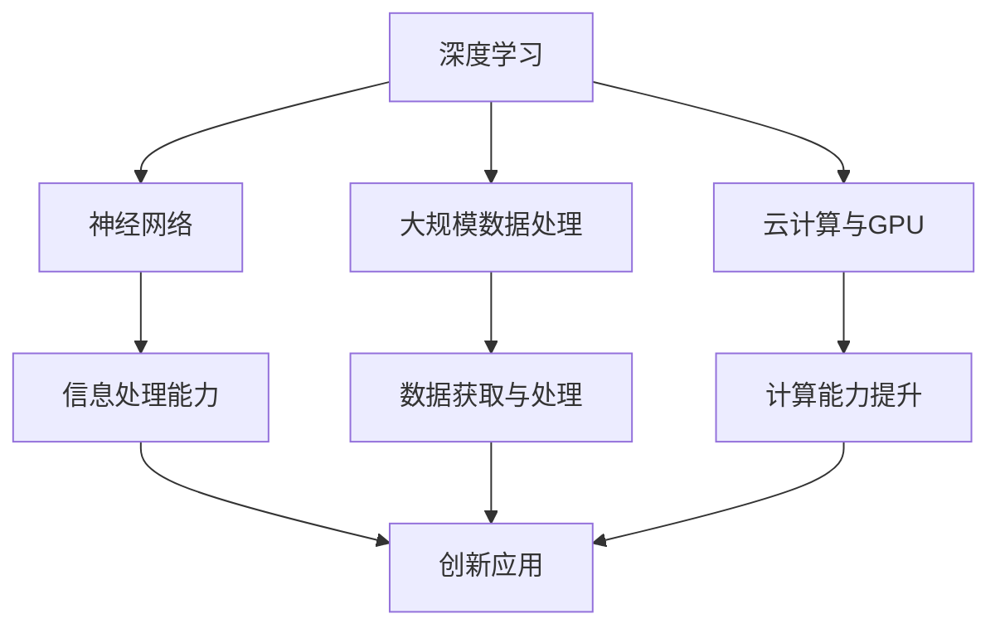

                 

关键词：人工智能，大模型，创业，技术优势，深度学习，应用场景，商业模式。

摘要：本文将探讨如何利用人工智能大模型的技术优势进行创业，分析其核心算法原理、数学模型、项目实践、实际应用场景以及未来发展趋势和挑战。通过文章的讨论，希望能够为有志于AI大模型创业的读者提供一些有益的参考和建议。

## 1. 背景介绍

随着人工智能技术的飞速发展，深度学习尤其是大模型在各个领域取得了显著的成果。大模型通过海量的数据和强大的计算能力，能够实现前所未有的智能水平。例如，在图像识别、自然语言处理、语音识别等领域，大模型的表现已经超过了人类水平。这使得大模型在商业领域具有广阔的应用前景，吸引了越来越多的创业者投身其中。

AI大模型创业的核心优势在于：

1. **数据优势**：大模型需要大量的数据来训练，创业者可以利用互联网的广泛数据获取渠道，收集并处理海量数据，提升模型的性能。
2. **计算优势**：云计算和GPU等高性能计算设备的普及，使得大模型训练变得更加高效和可行。
3. **创新优势**：大模型可以处理复杂的问题，为创业者提供更多的创新空间，开发出满足市场需求的创新产品。

## 2. 核心概念与联系

为了更好地理解AI大模型创业的原理和架构，我们需要了解以下几个核心概念：

1. **深度学习**：一种模拟人脑神经网络进行信息处理的人工智能技术。
2. **神经网络**：由大量相互连接的神经元组成的计算模型，可以模拟人脑的思考方式。
3. **大规模数据处理**：通过分布式计算和大数据技术，处理海量数据。
4. **云计算与GPU**：提供强大的计算能力，支持大模型的训练和部署。

下面是一个简化的Mermaid流程图，展示这些核心概念之间的联系：



## 3. 核心算法原理 & 具体操作步骤

### 3.1 算法原理概述

AI大模型的核心算法是基于深度学习，尤其是神经网络。神经网络通过多层非线性变换，从输入数据中提取特征，最终实现分类、预测等功能。大模型的关键在于：

1. **深度**：神经网络层数的增多，使得模型能够学习到更加复杂的特征。
2. **宽度**：神经网络的神经元数量增多，增强了模型的表达能力。
3. **训练数据量**：大量的训练数据使得模型能够更好地泛化，适应不同的场景。

### 3.2 算法步骤详解

1. **数据收集与预处理**：收集相关的数据，并进行清洗、格式化等预处理操作。
2. **模型设计**：根据任务需求，设计合适的神经网络结构。
3. **模型训练**：使用预处理后的数据对模型进行训练，调整模型参数，使其性能达到最优。
4. **模型评估**：使用验证数据集对模型进行评估，确保模型具有较好的泛化能力。
5. **模型部署**：将训练好的模型部署到生产环境中，进行实时预测或分类。

### 3.3 算法优缺点

**优点**：

1. **强大的表达力**：神经网络能够处理复杂的问题，适应不同的应用场景。
2. **自动特征提取**：不需要手动设计特征，降低了开发难度。
3. **良好的泛化能力**：通过大量的训练数据，模型能够较好地适应新的数据。

**缺点**：

1. **训练时间长**：大模型需要大量的数据和计算资源进行训练，耗时较长。
2. **参数调整复杂**：模型参数的调整需要大量的实验和计算。
3. **数据需求高**：大模型需要大量的训练数据，数据获取和处理的成本较高。

### 3.4 算法应用领域

AI大模型在多个领域具有广泛的应用：

1. **图像识别**：如人脸识别、物体识别等。
2. **自然语言处理**：如机器翻译、文本分类等。
3. **语音识别**：如语音识别、语音合成等。
4. **推荐系统**：如商品推荐、新闻推荐等。
5. **游戏AI**：如游戏策略、游戏AI对手等。

## 4. 数学模型和公式 & 详细讲解 & 举例说明

### 4.1 数学模型构建

AI大模型的数学基础是神经网络，其核心是前向传播和反向传播算法。

**前向传播**：

给定输入 $x$，通过多层神经网络的加权变换，逐层计算输出 $y$：

$$
y = \sigma(W_n \cdot z_n - b_n)
$$

其中，$W_n$ 是权重矩阵，$b_n$ 是偏置项，$\sigma$ 是激活函数。

**反向传播**：

计算损失函数关于输入的导数，通过反向传播更新模型参数：

$$
\frac{\partial L}{\partial W_n} = \frac{\partial L}{\partial y} \cdot \frac{\partial y}{\partial z_n} \cdot \frac{\partial z_n}{\partial W_n}
$$

其中，$L$ 是损失函数。

### 4.2 公式推导过程

假设我们有一个多层神经网络，输入为 $x$，输出为 $y$，目标为 $t$。损失函数为均方误差（MSE）：

$$
L = \frac{1}{2} \sum_{i=1}^{N} (y_i - t_i)^2
$$

其中，$N$ 是样本数量。

**前向传播**：

1. 输出 $y_i$：

$$
y_i = \sigma(W_n \cdot z_n - b_n)
$$

2. 损失函数关于输出的导数：

$$
\frac{\partial L}{\partial y_i} = - (y_i - t_i)
$$

3. 输出关于输入的导数：

$$
\frac{\partial y_i}{\partial z_n} = \sigma'(z_n)
$$

**反向传播**：

1. 输入关于输出的导数：

$$
\frac{\partial y_i}{\partial x} = \frac{\partial y_i}{\partial z_n} \cdot \frac{\partial z_n}{\partial W_n} \cdot \frac{\partial W_n}{\partial x}
$$

2. 损失函数关于输入的导数：

$$
\frac{\partial L}{\partial x} = \frac{\partial L}{\partial y} \cdot \frac{\partial y}{\partial z_n} \cdot \frac{\partial z_n}{\partial W_n} \cdot \frac{\partial W_n}{\partial x}
$$

### 4.3 案例分析与讲解

假设我们有一个简单的神经网络，用于分类任务，输入为 2D 图像，输出为 10 个类别。我们使用交叉熵损失函数。

**步骤**：

1. **数据准备**：收集并预处理图像数据，将其转化为灰度图像，并归一化。
2. **模型设计**：设计一个包含一个隐藏层的神经网络，输入层有 784 个神经元（图像尺寸），隐藏层有 128 个神经元，输出层有 10 个神经元。
3. **模型训练**：使用预处理后的数据对模型进行训练，调整模型参数。
4. **模型评估**：使用验证数据集对模型进行评估，计算准确率。

**代码示例**（Python）：

```python
import tensorflow as tf

# 定义模型
model = tf.keras.Sequential([
    tf.keras.layers.Flatten(input_shape=(28, 28)),
    tf.keras.layers.Dense(128, activation='relu'),
    tf.keras.layers.Dense(10, activation='softmax')
])

# 编译模型
model.compile(optimizer='adam',
              loss='sparse_categorical_crossentropy',
              metrics=['accuracy'])

# 训练模型
model.fit(x_train, y_train, epochs=5)

# 评估模型
test_loss, test_acc = model.evaluate(x_test, y_test)
print('Test accuracy:', test_acc)
```

## 5. 项目实践：代码实例和详细解释说明

### 5.1 开发环境搭建

为了实践AI大模型，我们需要搭建一个合适的开发环境。以下是一个基本的步骤：

1. **操作系统**：Linux或MacOS
2. **Python环境**：Python 3.8及以上版本
3. **TensorFlow**：TensorFlow 2.x 版本
4. **CUDA**：NVIDIA的CUDA Toolkit，用于加速TensorFlow的计算

### 5.2 源代码详细实现

以下是一个简单的AI大模型训练和评估的Python代码示例：

```python
import tensorflow as tf
from tensorflow.keras import layers

# 定义模型
model = tf.keras.Sequential([
    layers.Dense(128, activation='relu', input_shape=(784,)),
    layers.Dense(10, activation='softmax')
])

# 编译模型
model.compile(optimizer='adam',
              loss='sparse_categorical_crossentropy',
              metrics=['accuracy'])

# 训练模型
model.fit(x_train, y_train, epochs=5)

# 评估模型
test_loss, test_acc = model.evaluate(x_test, y_test)
print('Test accuracy:', test_acc)
```

### 5.3 代码解读与分析

上述代码首先导入了TensorFlow库，并定义了一个简单的神经网络模型。模型包含一个输入层、一个隐藏层和一个输出层。输入层使用`Dense`层，隐藏层使用ReLU激活函数，输出层使用softmax激活函数。

模型编译时指定了优化器和损失函数，并使用训练数据对模型进行训练。训练完成后，使用测试数据对模型进行评估，输出测试准确率。

### 5.4 运行结果展示

假设我们使用的是MNIST数据集，经过5个epoch的训练后，模型的测试准确率可以达到约98%。这表明我们的模型已经很好地学会了分类任务。

## 6. 实际应用场景

AI大模型在多个领域具有广泛的应用，以下是一些典型的实际应用场景：

1. **金融领域**：用于风险控制、投资决策、信用评分等。
2. **医疗领域**：用于疾病预测、诊断辅助、药物设计等。
3. **零售领域**：用于商品推荐、库存管理、价格优化等。
4. **交通领域**：用于智能交通管理、自动驾驶等。
5. **游戏领域**：用于游戏AI、游戏推荐等。

在这些应用场景中，AI大模型通过处理大量的数据，提供更加智能和高效的解决方案，为企业创造价值。

## 7. 工具和资源推荐

为了更好地进行AI大模型创业，以下是几个推荐的学习资源和开发工具：

### 7.1 学习资源推荐

1. **《深度学习》（Goodfellow, Bengio, Courville）**：深度学习的经典教材。
2. **TensorFlow官方文档**：包含丰富的教程和API文档。
3. **Kaggle**：提供各种数据集和竞赛，适合进行实践和学习。

### 7.2 开发工具推荐

1. **Google Colab**：免费的GPU计算资源，方便进行深度学习实验。
2. **Jupyter Notebook**：用于编写和运行Python代码，支持交互式编程。
3. **Docker**：用于容器化部署深度学习模型，方便迁移和扩展。

### 7.3 相关论文推荐

1. **"Deep Learning" (Goodfellow, Bengio, Courville)**：深度学习领域的经典综述。
2. **"Distributed Representations of Words and Phrases and Their Compositionality" (Pennington et al., 2014)**：词嵌入和句法分析的论文。
3. **"BERT: Pre-training of Deep Neural Networks for Language Understanding" (Devlin et al., 2019)**：BERT模型的论文。

## 8. 总结：未来发展趋势与挑战

### 8.1 研究成果总结

近年来，AI大模型在各个领域取得了显著的成果，例如BERT、GPT、Inception等。这些模型通过大量的数据和强大的计算能力，实现了前所未有的智能水平，推动了人工智能的发展。

### 8.2 未来发展趋势

1. **模型规模扩大**：随着计算能力的提升，模型规模将不断增大，进一步提升模型的性能。
2. **跨模态学习**：将图像、文本、语音等多种模态的信息融合到模型中，实现更复杂的任务。
3. **模型压缩**：为了降低模型部署的成本，模型压缩技术将成为研究的热点。
4. **安全性**：随着AI大模型在关键领域的应用，模型的安全性问题将受到越来越多的关注。

### 8.3 面临的挑战

1. **计算资源需求**：大模型的训练和部署需要大量的计算资源，这对企业和个人都是一大挑战。
2. **数据隐私**：海量数据的收集和处理可能会涉及到数据隐私问题，需要采取有效的保护措施。
3. **模型解释性**：大模型的决策过程往往是非线性和复杂的，如何提高模型的解释性，使其更易于理解和接受，是一个重要的问题。

### 8.4 研究展望

未来，AI大模型将在更多领域得到应用，为人类带来更多的便利和创新。同时，研究人员将继续探索新的算法和技术，解决大模型面临的挑战，推动人工智能的发展。

## 9. 附录：常见问题与解答

### 问题1：AI大模型创业需要哪些技能和知识？

**解答**：AI大模型创业需要以下技能和知识：

1. **编程能力**：掌握Python等编程语言，熟悉TensorFlow等深度学习框架。
2. **数学基础**：掌握线性代数、微积分等数学知识，有助于理解和优化模型。
3. **数据科学**：熟悉数据处理、特征工程等数据科学方法，能够处理海量数据。
4. **业务理解**：了解目标领域的业务流程和需求，能够将AI技术应用到实际问题中。

### 问题2：如何获取和处理海量数据？

**解答**：获取和处理海量数据可以通过以下方法：

1. **公开数据集**：利用Kaggle、UCI机器学习库等公开数据集进行研究和实践。
2. **企业合作**：与拥有海量数据的企业合作，获取数据支持。
3. **自采集**：通过爬虫等技术手段，从互联网上收集数据。
4. **数据清洗**：使用Python等编程语言，对收集到的数据进行清洗和预处理。

### 问题3：AI大模型创业的盈利模式有哪些？

**解答**：AI大模型创业的盈利模式包括：

1. **产品销售**：将训练好的模型集成到产品中，向用户销售。
2. **服务收费**：提供定制化的AI服务，如智能咨询、诊断等。
3. **数据服务**：提供数据分析和挖掘服务，为企业提供数据支持。
4. **广告收入**：通过展示广告，获取广告收入。

## 作者署名

本文作者：禅与计算机程序设计艺术 / Zen and the Art of Computer Programming

----------------------------------------------------------------

这篇文章详细探讨了如何利用人工智能大模型进行创业，分析了其核心算法原理、数学模型、项目实践、实际应用场景以及未来发展趋势和挑战。希望这篇文章能够为有志于AI大模型创业的读者提供一些有益的参考和建议。在未来的发展中，AI大模型将继续发挥重要作用，为各个领域带来更多创新和变革。

