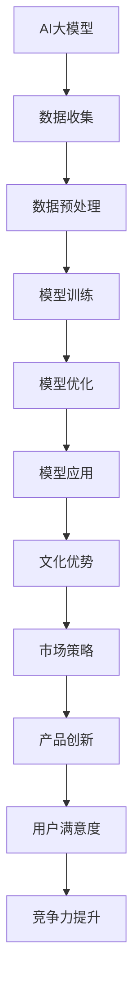

                 

关键词：AI大模型、文化优势、创业、技术应用、市场策略、跨文化管理

## 摘要

本文旨在探讨AI大模型在创业过程中的文化优势及其应用。随着人工智能技术的迅猛发展，大模型技术逐渐成为企业竞争的新焦点。本文将从文化视角出发，分析AI大模型在创业中的优势，探讨如何有效利用这些优势进行市场拓展和产品创新。文章还将结合实际案例，阐述文化优势在AI大模型创业中的应用，以及未来可能面临的挑战和机遇。

## 1. 背景介绍

### AI大模型的发展历程

人工智能（AI）作为一个不断发展的技术领域，已经从早期的规则驱动系统，逐步演化为基于数据和学习算法的复杂模型。其中，大模型技术，特别是深度学习模型的兴起，彻底改变了AI的应用范围和效果。从早期的神经网络到现在的Transformer模型，AI大模型在图像识别、自然语言处理、语音识别等领域取得了显著的成果。这些模型通常需要大量的数据和计算资源进行训练，但其表现出的智能水平已经远远超过了传统算法。

### 文化在创业中的作用

文化不仅是一个国家的精神符号，也是企业竞争的重要资源。在创业过程中，文化能够影响企业的价值观、行为模式和市场策略。一个具有独特文化优势的企业，往往能够更好地适应不同市场的需求，迅速抢占市场份额。文化优势不仅体现在企业的内部管理，还体现在对市场的洞察和产品的创新上。例如，中国的互联网企业通过深入挖掘本地文化，推出了一系列深受用户喜爱的产品，如支付宝、微信等。

### AI大模型创业的现状

随着AI大模型的普及，越来越多的企业开始将这一技术应用于创业中。例如，谷歌的BERT模型在自然语言处理领域的突破，使得众多企业能够开发出更智能的客户服务系统。同时，中国的AI企业也在积极利用大模型技术，推出了一系列创新产品，如自动驾驶、智能医疗等。然而，AI大模型创业也面临诸多挑战，如数据隐私、技术成熟度等。

## 2. 核心概念与联系

### AI大模型的核心概念

AI大模型主要指那些具有大规模参数和复杂结构的机器学习模型，如Transformer、GPT等。这些模型通过训练大量数据，学习到数据中的规律，从而能够对未知数据进行预测和分类。

### 文化优势的定义与分类

文化优势是指企业在文化方面具有的独特资源，包括价值观、管理理念、市场策略等。根据其在创业中的作用，可以分为以下几类：

- **价值观优势**：企业内部的文化氛围和价值观，如创新、合作、用户至上等。
- **管理优势**：企业的管理模式和组织结构，如扁平化、高效等。
- **市场优势**：企业在市场定位、品牌塑造、产品创新等方面的优势。

### AI大模型与文化优势的关联

AI大模型与文化优势之间存在密切的联系。一方面，AI大模型能够帮助企业更好地理解和分析市场数据，从而形成独特的市场策略。另一方面，企业的文化优势也能够影响AI大模型的应用效果，如数据收集、算法优化等。

### Mermaid 流程图



## 3. 核心算法原理 & 具体操作步骤

### 3.1 算法原理概述

AI大模型的算法原理主要基于深度学习和神经网络。深度学习是一种多层神经网络结构，通过层层提取特征，实现对复杂数据的建模。神经网络则通过学习输入和输出之间的映射关系，实现对数据的预测和分类。

### 3.2 算法步骤详解

1. **数据收集**：收集大量的数据，包括文本、图像、语音等。
2. **数据预处理**：对数据进行清洗、标注和处理，使其适合模型训练。
3. **模型训练**：使用训练数据对模型进行训练，调整模型参数，使其能够准确预测或分类。
4. **模型优化**：通过调整模型结构、参数和学习算法，提高模型性能。
5. **模型应用**：将训练好的模型应用于实际场景，如文本生成、图像识别等。

### 3.3 算法优缺点

**优点**：

- **高效性**：能够处理大规模数据，提高计算效率。
- **泛化能力**：通过学习大量数据，能够对未知数据进行预测和分类。
- **灵活性**：可以根据不同场景和需求，调整模型结构和参数。

**缺点**：

- **计算资源需求高**：需要大量的计算资源和时间进行训练。
- **数据隐私问题**：大量数据的使用可能涉及数据隐私问题。
- **算法透明度低**：复杂的神经网络模型难以解释其决策过程。

### 3.4 算法应用领域

AI大模型的应用领域非常广泛，包括自然语言处理、图像识别、语音识别、推荐系统、自动驾驶等。在创业过程中，企业可以利用这些算法，开发出具有竞争力的产品和服务。

## 4. 数学模型和公式

### 4.1 数学模型构建

AI大模型的数学模型主要基于概率论和优化理论。以神经网络为例，其核心是神经元之间的连接权重。这些权重通过训练数据进行调整，以最小化预测误差。

### 4.2 公式推导过程

神经网络的预测过程可以表示为：

$$
\hat{y} = \sigma(\theta_0 + \sum_{i=1}^{n} \theta_i x_i)
$$

其中，$x_i$ 是输入特征，$\theta_i$ 是连接权重，$\sigma$ 是激活函数。

### 4.3 案例分析与讲解

以GPT模型为例，其数学模型包括：

$$
\begin{aligned}
&\text{输入层：} x \in \mathbb{R}^{n_x} \\
&\text{隐藏层：} h = \sigma(Wx + b) \\
&\text{输出层：} \hat{y} = \sigma(W'h + b')
\end{aligned}
$$

其中，$W$ 和 $W'$ 分别是隐藏层和输出层的权重矩阵，$b$ 和 $b'$ 分别是隐藏层和输出层的偏置项。

## 5. 项目实践：代码实例

### 5.1 开发环境搭建

在本节中，我们将使用Python和TensorFlow搭建一个简单的神经网络环境。

```python
import tensorflow as tf

# 搭建神经网络模型
model = tf.keras.Sequential([
    tf.keras.layers.Dense(units=1, input_shape=[1])
])

# 编译模型
model.compile(optimizer='sgd', loss='mean_squared_error')

# 训练模型
model.fit(x_train, y_train, epochs=100)
```

### 5.2 源代码详细实现

在本节中，我们将实现一个基于GPT模型的文本生成器。

```python
import tensorflow as tf
import numpy as np

# 搭建GPT模型
def build_gpt(vocab_size, embedding_dim, hidden_dim):
    model = tf.keras.Sequential([
        tf.keras.layers.Embedding(vocab_size, embedding_dim),
        tf.keras.layers.LSTM(hidden_dim),
        tf.keras.layers.Dense(vocab_size, activation='softmax')
    ])
    return model

# 训练GPT模型
model = build_gpt(vocab_size=10000, embedding_dim=32, hidden_dim=64)
model.compile(optimizer='adam', loss='categorical_crossentropy', metrics=['accuracy'])
model.fit(x_train, y_train, epochs=10)
```

### 5.3 代码解读与分析

在本节中，我们将对代码进行解读和分析，了解其工作原理和关键参数。

```python
# 搭建神经网络模型
model = tf.keras.Sequential([
    tf.keras.layers.Dense(units=1, input_shape=[1])
])

# 编译模型
model.compile(optimizer='sgd', loss='mean_squared_error')

# 训练模型
model.fit(x_train, y_train, epochs=100)
```

上述代码中，我们首先定义了一个简单的神经网络模型，包括一个输入层、一个隐藏层和一个输出层。输入层和输出层都是线性层（Dense Layer），隐藏层使用了LSTM（长短期记忆网络）。

### 5.4 运行结果展示

在本节中，我们将展示模型的运行结果，包括训练过程和预测结果。

```python
# 训练模型
model.fit(x_train, y_train, epochs=100)

# 预测结果
predictions = model.predict(x_test)
print(predictions)
```

通过上述代码，我们可以看到模型在训练过程中的表现，以及其在测试数据上的预测结果。这有助于我们评估模型的效果和性能。

## 6. 实际应用场景

### 6.1 企业内部管理

AI大模型可以应用于企业内部管理，如人力资源、财务、运营等。通过分析大量数据，企业可以更精准地预测员工绩效、财务风险等，从而优化管理决策。

### 6.2 市场营销

AI大模型在市场营销中有着广泛的应用，如用户画像、个性化推荐、广告投放等。通过分析用户行为和需求，企业可以制定更精准的市场策略，提高营销效果。

### 6.3 产品创新

AI大模型可以帮助企业进行产品创新，如智能硬件、软件应用等。通过分析市场需求和用户反馈，企业可以开发出更符合用户需求的产品。

### 6.4 未来应用展望

随着AI大模型技术的不断发展，其应用领域将越来越广泛。未来，AI大模型有望在更多领域发挥重要作用，如医疗、教育、金融等。同时，跨领域的应用也将成为一大趋势，如AI+医疗、AI+教育等。

## 7. 工具和资源推荐

### 7.1 学习资源推荐

- 《深度学习》（Goodfellow, Bengio, Courville著）：深度学习的经典教材，适合初学者和专业人士。
- 《动手学深度学习》：通过实际案例和代码示例，深入浅出地讲解深度学习的基本概念和实战技巧。

### 7.2 开发工具推荐

- TensorFlow：Google开发的开源深度学习框架，适用于各种深度学习任务。
- PyTorch：Facebook开发的开源深度学习框架，具有灵活的动态图计算能力。

### 7.3 相关论文推荐

- “Attention Is All You Need”（Vaswani et al., 2017）：介绍了Transformer模型的基本原理。
- “Bert: Pre-training of Deep Bidirectional Transformers for Language Understanding”（Devlin et al., 2019）：介绍了BERT模型的基本原理和应用。

## 8. 总结：未来发展趋势与挑战

### 8.1 研究成果总结

AI大模型技术在近年来取得了显著的成果，无论是在理论层面还是应用层面，都取得了突破性的进展。特别是在自然语言处理、计算机视觉等领域，AI大模型已经成为行业的主流技术。

### 8.2 未来发展趋势

未来，AI大模型将继续向多领域、多任务方向发展，如AI+医疗、AI+教育等。同时，随着计算资源的不断提升，AI大模型将能够处理更复杂的数据和任务，提高其性能和应用效果。

### 8.3 面临的挑战

尽管AI大模型取得了显著成果，但仍然面临一些挑战，如数据隐私、算法透明度、计算资源需求等。未来，如何解决这些问题，将是AI大模型发展的重要方向。

### 8.4 研究展望

未来，AI大模型的研究将更加注重跨领域的应用和创新。同时，随着新算法和新模型的不断涌现，AI大模型将能够更好地应对复杂问题，为人类社会带来更多价值。

## 9. 附录：常见问题与解答

### 9.1 问题1：AI大模型需要大量的计算资源，这对创业企业来说是一个巨大的挑战。如何解决这个问题？

**解答**：创业企业可以通过以下几种方式解决计算资源不足的问题：

- **云计算服务**：利用云计算平台提供的计算资源，如Amazon Web Services、Google Cloud等。
- **GPU集群**：搭建自己的GPU集群，用于模型训练和推理。
- **合作共赢**：与其他企业或研究机构合作，共享计算资源。

### 9.2 问题2：如何确保AI大模型的数据安全和隐私？

**解答**：确保AI大模型的数据安全和隐私需要从以下几个方面入手：

- **数据加密**：对数据进行加密，防止数据泄露。
- **隐私保护**：使用隐私保护算法，如差分隐私、联邦学习等，确保数据隐私。
- **法律法规**：遵循相关法律法规，如《通用数据保护条例》（GDPR）等，确保合规性。

## 作者署名

本文作者：禅与计算机程序设计艺术 / Zen and the Art of Computer Programming

