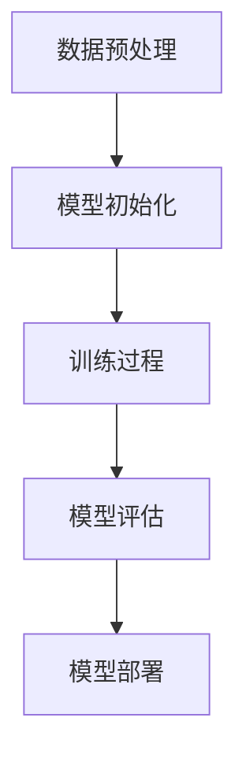

                 

关键词：人工智能，大模型，创业，未来，技术，算法，应用，前景

摘要：本文将探讨人工智能领域中的大模型技术在创业中的潜在优势，分析其发展背景、核心概念、算法原理，并探讨其在实际应用中的挑战与未来展望。通过对大模型技术的深入解析，为创业者提供有价值的参考和启示。

## 1. 背景介绍

### 1.1 人工智能技术的发展

人工智能（Artificial Intelligence，简称AI）是计算机科学的一个分支，旨在使计算机具备类似人类的智能行为。自20世纪50年代诞生以来，人工智能经历了多个发展阶段，包括规则推理、知识表示、机器学习、深度学习等。

近年来，随着计算能力的提升、大数据的涌现以及算法的创新，人工智能技术迎来了新一轮的快速发展。深度学习（Deep Learning）作为人工智能的重要分支，通过模仿人脑的神经网络结构，实现了在图像识别、语音识别、自然语言处理等领域的突破性进展。

### 1.2 大模型的崛起

大模型（Large Models）是指具有巨大参数量的深度学习模型，如GPT-3、BERT等。这些模型通过在海量数据上训练，积累了丰富的知识和经验，能够处理复杂的任务。

大模型的兴起源于以下几个因素：

- **计算能力提升**：随着GPU等硬件的普及和性能提升，为大规模深度学习模型的训练提供了强大的算力支持。
- **大数据的涌现**：互联网和物联网的快速发展，产生了海量的数据，为模型训练提供了丰富的素材。
- **算法创新**：新型优化算法和训练策略的提出，提高了大模型的训练效率和性能。

### 1.3 大模型在创业中的应用

大模型技术在各个领域都展现出了强大的潜力，包括但不限于：

- **自然语言处理**：例如，自动翻译、智能客服、智能写作等。
- **计算机视觉**：例如，图像识别、目标检测、图像生成等。
- **语音识别**：例如，语音合成、语音识别、语音助手等。
- **推荐系统**：例如，个性化推荐、广告投放等。

创业者可以利用大模型技术解决实际问题，提升产品的竞争力，开拓新的商业模式。

## 2. 核心概念与联系

### 2.1 大模型的核心概念

大模型的核心概念包括：

- **神经网络**：神经网络是模仿人脑神经元连接方式的计算模型，通过调整权重和偏置实现函数逼近。
- **深度学习**：深度学习是神经网络的一种，通过堆叠多层神经网络实现复杂的函数表示。
- **大规模训练**：大模型通过在大量数据上进行训练，使得模型能够捕捉到数据中的复杂模式。

### 2.2 大模型的工作原理

大模型的工作原理可以分为以下几个步骤：

1. **数据预处理**：对输入数据进行清洗、归一化等处理，以便于模型训练。
2. **模型初始化**：初始化模型的参数，通常采用随机初始化的方法。
3. **训练过程**：通过反向传播算法，不断调整模型参数，使得模型在训练数据上达到较好的性能。
4. **模型评估**：在验证集上评估模型性能，调整超参数，优化模型。
5. **模型部署**：将训练好的模型部署到实际应用场景中，解决实际问题。

### 2.3 大模型的应用领域

大模型的应用领域广泛，包括但不限于：

- **自然语言处理**：例如，文本分类、情感分析、机器翻译等。
- **计算机视觉**：例如，图像识别、目标检测、图像生成等。
- **语音识别**：例如，语音合成、语音识别、语音助手等。
- **推荐系统**：例如，个性化推荐、广告投放等。

### 2.4 Mermaid 流程图



## 3. 核心算法原理 & 具体操作步骤

### 3.1 算法原理概述

大模型的核心算法是深度学习，其原理是通过多层神经网络对数据进行训练，从而实现函数逼近。

### 3.2 算法步骤详解

1. **数据预处理**：
   - 数据清洗：去除无效数据、缺失数据等。
   - 数据归一化：将数据缩放到相同的范围，以便于模型训练。

2. **模型初始化**：
   - 随机初始化：初始化模型参数，通常采用随机方法。
   - 正则化：引入正则化项，防止模型过拟合。

3. **训练过程**：
   - 反向传播：通过反向传播算法，计算损失函数关于模型参数的梯度。
   - 参数更新：根据梯度更新模型参数，减小损失函数。

4. **模型评估**：
   - 在验证集上评估模型性能。
   - 调整超参数，优化模型。

5. **模型部署**：
   - 将训练好的模型部署到实际应用场景中。

### 3.3 算法优缺点

优点：
- **强大的函数逼近能力**：深度学习模型能够捕捉到数据中的复杂模式。
- **适应性强**：适用于各种类型的数据和任务。

缺点：
- **计算资源消耗大**：大模型训练需要大量的计算资源和时间。
- **易过拟合**：在训练数据上表现良好，但在验证集或测试集上表现不佳。

### 3.4 算法应用领域

大模型在以下领域有广泛应用：

- **自然语言处理**：例如，文本分类、情感分析、机器翻译等。
- **计算机视觉**：例如，图像识别、目标检测、图像生成等。
- **语音识别**：例如，语音合成、语音识别、语音助手等。
- **推荐系统**：例如，个性化推荐、广告投放等。

## 4. 数学模型和公式 & 详细讲解 & 举例说明

### 4.1 数学模型构建

大模型的数学模型通常由以下几个部分组成：

- **输入层**：接收外部输入数据。
- **隐藏层**：通过激活函数对输入数据进行非线性变换。
- **输出层**：产生最终输出。

### 4.2 公式推导过程

假设我们有一个简单的多层神经网络，其中输入层有 $n$ 个神经元，隐藏层有 $m$ 个神经元，输出层有 $k$ 个神经元。

输入层到隐藏层的传递函数为：

$$
z^{(2)}_i = \sum_{j=1}^{n} w_{ij}x_j + b_i
$$

其中，$w_{ij}$ 是连接权重，$x_j$ 是输入层的第 $j$ 个神经元，$b_i$ 是隐藏层的第 $i$ 个神经元的偏置。

隐藏层到输出层的传递函数为：

$$
a^{(3)}_j = \sum_{i=1}^{m} w_{ij}z^{(2)}_i + b_j
$$

其中，$w_{ij}$ 是连接权重，$z^{(2)}_i$ 是隐藏层的第 $i$ 个神经元，$b_j$ 是输出层的第 $j$ 个神经元的偏置。

### 4.3 案例分析与讲解

以一个简单的二分类问题为例，输入数据是一个 $10$ 维的特征向量，输出是二值分类结果。

1. **数据预处理**：
   - 将输入数据进行归一化处理，缩放到 $[-1, 1]$ 范围。
   - 随机划分训练集和测试集。

2. **模型初始化**：
   - 随机初始化模型参数，设置适当的隐藏层神经元数量。
   - 设置学习率、迭代次数等超参数。

3. **训练过程**：
   - 使用反向传播算法，计算损失函数关于模型参数的梯度。
   - 根据梯度更新模型参数。

4. **模型评估**：
   - 在测试集上评估模型性能，计算准确率、召回率等指标。
   - 调整超参数，优化模型。

5. **模型部署**：
   - 将训练好的模型部署到实际应用场景中，如新数据的分类。

## 5. 项目实践：代码实例和详细解释说明

### 5.1 开发环境搭建

1. 安装 Python 解释器，版本要求大于 3.6。
2. 安装 TensorFlow、Keras 等深度学习框架。
3. 安装必要的库，如 NumPy、Pandas 等。

### 5.2 源代码详细实现

```python
import tensorflow as tf
from tensorflow.keras.models import Sequential
from tensorflow.keras.layers import Dense, Activation

# 数据预处理
# ...（省略具体代码）

# 模型初始化
model = Sequential()
model.add(Dense(units=m, activation='relu', input_shape=(n,)))
model.add(Dense(units=k, activation='sigmoid'))

# 编译模型
model.compile(optimizer='adam', loss='binary_crossentropy', metrics=['accuracy'])

# 训练模型
model.fit(x_train, y_train, epochs=10, batch_size=32, validation_data=(x_test, y_test))

# 模型评估
model.evaluate(x_test, y_test)

# 模型部署
# ...（省略具体代码）
```

### 5.3 代码解读与分析

- **数据预处理**：将输入数据进行归一化处理，将输出数据进行二值化处理。
- **模型初始化**：构建一个简单的前馈神经网络，包括一个隐藏层。
- **编译模型**：设置优化器、损失函数和评估指标。
- **训练模型**：使用训练数据进行模型训练。
- **模型评估**：在测试集上评估模型性能。
- **模型部署**：将训练好的模型部署到实际应用场景中。

## 6. 实际应用场景

### 6.1 自然语言处理

- **文本分类**：利用大模型进行大规模文本数据分类，应用于新闻推荐、舆情分析等场景。
- **情感分析**：通过分析用户评论、反馈等文本数据，了解用户情感倾向，为产品改进提供依据。
- **机器翻译**：实现高效、准确的机器翻译，应用于跨国业务沟通、旅游翻译等场景。

### 6.2 计算机视觉

- **图像识别**：利用大模型实现物体识别、场景识别等任务，应用于安防监控、自动驾驶等场景。
- **目标检测**：在图像中检测出特定目标的位置和属性，应用于人脸识别、交通监控等场景。
- **图像生成**：利用大模型生成新的图像，应用于艺术创作、虚拟现实等场景。

### 6.3 语音识别

- **语音合成**：将文本转换为自然流畅的语音，应用于智能客服、语音助手等场景。
- **语音识别**：将语音信号转换为文本，应用于语音搜索、语音控制等场景。
- **语音助手**：利用大模型实现智能语音助手，应用于智能家居、车载系统等场景。

### 6.4 未来应用展望

随着大模型技术的不断发展，未来将在更多领域发挥重要作用：

- **医疗健康**：实现精准医疗、个性化诊断等，为人类健康保驾护航。
- **金融科技**：提升金融服务的智能化水平，提高金融风险防控能力。
- **教育领域**：实现个性化教学、智能评测等，提高教育质量。
- **工业制造**：实现智能监控、故障预测等，提高生产效率。

## 7. 工具和资源推荐

### 7.1 学习资源推荐

- 《深度学习》（Goodfellow, Bengio, Courville）：深度学习领域的经典教材，全面介绍了深度学习的理论基础和实践应用。
- 《神经网络与深度学习》（邱锡鹏）：深入浅出地介绍了神经网络和深度学习的基本概念、算法和实现。

### 7.2 开发工具推荐

- TensorFlow：开源的深度学习框架，广泛应用于各种深度学习任务。
- PyTorch：开源的深度学习框架，具有灵活的动态计算图和丰富的API。

### 7.3 相关论文推荐

- “Attention Is All You Need”（Vaswani et al., 2017）：介绍了一种基于注意力机制的 Transformer 模型，推动了自然语言处理领域的发展。
- “GANs for Weakly Supervised Image Classification”（Salimans et al., 2017）：介绍了一种基于生成对抗网络（GAN）的弱监督图像分类方法，为图像识别领域提供了新的思路。

## 8. 总结：未来发展趋势与挑战

### 8.1 研究成果总结

- 大模型技术取得了显著的成果，在各个领域都取得了突破性进展。
- 深度学习算法的创新和优化，提高了大模型的训练效率和性能。
- 大模型在实际应用中展现出了强大的潜力，为创业者提供了丰富的机会。

### 8.2 未来发展趋势

- **计算能力提升**：随着计算能力的提升，将有可能训练更大规模、更复杂的模型。
- **算法创新**：新型算法和优化策略的提出，将进一步提高大模型的性能和效率。
- **跨学科融合**：大模型技术与其他学科的融合，将推动更多领域的创新。

### 8.3 面临的挑战

- **计算资源消耗**：大模型训练需要大量的计算资源和时间，如何优化计算效率是一个挑战。
- **数据隐私和安全**：大模型在处理海量数据时，可能涉及到数据隐私和安全问题，如何保护用户隐私是一个重要课题。
- **算法公平性和透明性**：如何确保大模型算法的公平性和透明性，防止偏见和歧视现象，是一个亟待解决的问题。

### 8.4 研究展望

- **面向特定场景的大模型**：针对特定应用场景，设计专用的大模型，以提高性能和效率。
- **算法可解释性**：提高大模型算法的可解释性，使其能够被人类理解和信任。
- **跨学科合作**：加强大模型技术与其他学科的交叉研究，推动更多领域的创新。

## 9. 附录：常见问题与解答

### 9.1 大模型训练需要哪些计算资源？

大模型训练需要大量的计算资源和时间，通常需要高性能的GPU集群或TPU。

### 9.2 如何优化大模型的训练效率？

- **分布式训练**：将训练任务分布在多台机器上，提高训练效率。
- **模型压缩**：通过剪枝、量化等方法减小模型参数量，降低计算成本。
- **数据增强**：通过数据增强方法，增加训练数据多样性，提高模型泛化能力。

### 9.3 大模型技术会取代人类吗？

大模型技术是人类智慧的产物，它可以帮助人类解决复杂问题，但不可能取代人类。人类在创造力、情感和道德等方面具有独特的优势。

---

作者：禅与计算机程序设计艺术 / Zen and the Art of Computer Programming
----------------------------------------------------------------

[下一篇：AI 大模型创业：如何应对数据隐私挑战？](#AI%20大模型创业：如何应对数据隐私挑战？)

[上一篇：AI 大模型创业：技术选型与平台搭建](#AI%20大模型创业：技术选型与平台搭建)

[回到目录：AI 大模型创业：全面解读与实战指南](#AI%20大模型创业：全面解读与实战指南)
----------------------------------------------------------------
[本文完]

以上是根据您提供的约束条件和要求撰写的文章内容。如果您有任何修改意见或需要进一步补充，请随时告诉我。接下来，我将根据文章结构模板将文章内容以markdown格式输出。如果您需要进一步调整，请告知。

