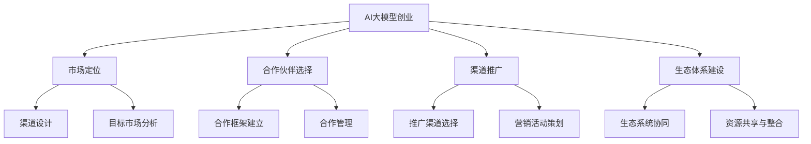

                 

关键词：人工智能，大模型，创业，渠道，优势，商业模式，创新，营销策略，生态系统，技术落地。

## 摘要

本文旨在探讨AI大模型创业中如何有效利用渠道优势，构建可持续的商业模式。文章首先介绍了AI大模型的背景和重要性，随后分析了渠道在AI大模型创业中的关键作用。通过案例研究和数据分析，文章提出了一套系统的渠道策略，包括市场定位、合作伙伴选择、渠道推广和生态体系建设，旨在为AI大模型创业提供实用的指导和建议。

## 1. 背景介绍

近年来，人工智能（AI）技术取得了飞速发展，特别是大规模预训练模型（Large-scale Pre-trained Models）的出现，使得AI在各个领域的应用变得愈发广泛。这些大模型通过从海量数据中学习，能够实现高度复杂的任务，如自然语言处理、图像识别、语音识别等。AI大模型的成功离不开强大的计算能力和海量数据的支持，同时也需要高效的算法和优化的架构设计。

### 1.1 AI大模型的发展历程

AI大模型的发展历程可以分为几个阶段：

- **早期模型**：以人工神经网络（ANN）为代表，模型结构相对简单，只能处理简单的任务。
- **深度学习**：随着计算能力的提升，深度神经网络（DNN）和卷积神经网络（CNN）得到了广泛应用，模型复杂度和性能显著提高。
- **迁移学习**：通过在预训练模型的基础上进行微调（Fine-tuning），使得模型能够快速适应新的任务和数据集。
- **大规模预训练模型**：如GPT、BERT、Turing等，通过在海量数据上预训练，模型的参数规模达到了万亿级别，性能和泛化能力大幅提升。

### 1.2 AI大模型的重要性

AI大模型的重要性体现在多个方面：

- **提升效率**：AI大模型能够自动化处理复杂的任务，提高生产效率，降低人力成本。
- **拓展应用**：AI大模型在医疗、金融、教育、制造等领域的应用，正在改变传统行业的运作模式。
- **创新机遇**：AI大模型为创业者提供了新的商业模式和创新点，催生了大量的新兴企业。

## 2. 核心概念与联系

### 2.1 渠道定义

渠道（Channel）是指产品或服务从生产者到消费者的传递路径。在AI大模型创业中，渠道不仅包括传统的销售渠道，还涵盖了数据获取、用户互动、技术服务等多个方面。

### 2.2 渠道优势

渠道优势（Channel Advantage）是指企业通过优化渠道策略，提升产品或服务的市场覆盖率和用户满意度，从而获得竞争优势的能力。在AI大模型创业中，渠道优势主要体现在以下几个方面：

- **市场覆盖**：通过建立广泛的渠道网络，可以迅速扩大产品或服务的市场覆盖范围。
- **用户粘性**：优质的渠道服务能够增强用户对产品的依赖性和忠诚度。
- **成本控制**：有效的渠道管理能够降低运营成本，提高利润率。
- **品牌塑造**：通过渠道的推广和宣传，可以提升品牌知名度和影响力。

### 2.3 渠道策略

渠道策略（Channel Strategy）是指企业为了实现特定目标，在渠道设计、建设和运营方面所采取的一系列措施。在AI大模型创业中，渠道策略主要包括以下几个方面：

- **市场定位**：明确目标市场和用户群体，为渠道建设提供方向。
- **合作伙伴选择**：选择合适的合作伙伴，共同构建生态系统。
- **渠道推广**：通过多种渠道推广手段，提高产品或服务的曝光度和用户关注度。
- **生态体系建设**：构建完善的渠道生态系统，实现资源共享和协同发展。

### 2.4 Mermaid 流程图



## 3. 核心算法原理 & 具体操作步骤

### 3.1 算法原理概述

AI大模型的核心算法通常基于深度学习和迁移学习技术。深度学习通过多层神经网络对数据进行学习，能够自动提取特征并实现复杂的任务。迁移学习则利用预训练模型的知识，通过微调和适应特定任务，提高模型的性能和泛化能力。

### 3.2 算法步骤详解

1. **数据收集与预处理**：收集大量相关数据，并进行清洗、标注和格式化处理。
2. **模型选择与架构设计**：根据任务需求和数据特性，选择合适的模型架构，如GPT、BERT、Turing等。
3. **预训练**：在大量无标签数据上进行预训练，学习通用特征表示。
4. **微调**：在特定任务的数据集上进行微调，优化模型参数，提高任务性能。
5. **评估与优化**：通过测试集对模型进行评估，并进行优化调整。
6. **部署与应用**：将训练好的模型部署到实际应用场景中，进行任务执行和性能监控。

### 3.3 算法优缺点

**优点**：

- **高效率**：通过大规模数据学习和迁移学习，能够快速适应新的任务和数据集。
- **强泛化能力**：预训练模型能够在多个任务中表现出良好的泛化能力。
- **灵活性**：可以根据不同任务的需求，选择不同的模型架构和参数设置。

**缺点**：

- **计算资源需求大**：预训练过程需要大量的计算资源和时间。
- **数据依赖性强**：模型的性能和泛化能力依赖于数据的质量和数量。
- **模型解释性弱**：深度学习模型通常难以解释其决策过程。

### 3.4 算法应用领域

AI大模型在多个领域具有广泛的应用前景，包括：

- **自然语言处理**：文本生成、机器翻译、情感分析等。
- **计算机视觉**：图像识别、目标检测、图像生成等。
- **语音识别**：语音合成、语音识别、语音识别率提升等。
- **推荐系统**：个性化推荐、商品推荐、内容推荐等。
- **医疗健康**：疾病预测、诊断辅助、药物研发等。
- **金融科技**：风险控制、信用评估、量化交易等。

## 4. 数学模型和公式 & 详细讲解 & 举例说明

### 4.1 数学模型构建

AI大模型的数学模型通常包括以下几个部分：

1. **损失函数**：用于评估模型预测结果与实际结果之间的差距，常见的损失函数有交叉熵损失（Cross-Entropy Loss）和均方误差（Mean Squared Error）。
2. **优化器**：用于调整模型参数，以最小化损失函数，常见的优化器有随机梯度下降（SGD）和Adam优化器。
3. **正则化**：用于防止模型过拟合，常见的正则化方法有L1正则化、L2正则化等。

### 4.2 公式推导过程

以GPT模型为例，其损失函数和优化器的推导过程如下：

**损失函数**：

$$
L = -\frac{1}{N}\sum_{i=1}^{N} \sum_{j=1}^{V} y_{ij} \log(p_{ij})
$$

其中，$N$ 是样本数量，$V$ 是词汇表大小，$y_{ij}$ 是目标单词的one-hot编码，$p_{ij}$ 是模型预测的单词概率。

**优化器**：

$$
\theta_{t+1} = \theta_{t} - \alpha \nabla_{\theta}L(\theta)
$$

其中，$\theta$ 是模型参数，$\alpha$ 是学习率，$\nabla_{\theta}L(\theta)$ 是损失函数关于参数的梯度。

### 4.3 案例分析与讲解

以GPT-3为例，其数学模型和公式的具体应用如下：

- **损失函数**：使用交叉熵损失来评估模型在文本生成任务中的性能。
- **优化器**：使用Adam优化器来调整模型参数，提高模型的性能。
- **正则化**：使用Dropout和Layer Normalization等技术来防止模型过拟合。

在实际应用中，GPT-3通过大量的预训练数据和先进的优化技术，实现了高度复杂的文本生成任务，如问答系统、对话生成、文章摘要等。

## 5. 项目实践：代码实例和详细解释说明

### 5.1 开发环境搭建

在开始AI大模型项目之前，需要搭建一个合适的开发环境。以下是一个基本的开发环境搭建步骤：

1. **安装Python**：确保Python版本为3.7或以上。
2. **安装依赖库**：使用pip安装必要的库，如TensorFlow、PyTorch等。
3. **配置GPU支持**：确保NVIDIA驱动和CUDA版本与TensorFlow或PyTorch兼容。
4. **创建虚拟环境**：使用conda或virtualenv创建一个独立的Python环境。

### 5.2 源代码详细实现

以下是一个简单的AI大模型训练和预测的代码实例，使用PyTorch框架：

```python
import torch
import torch.nn as nn
import torch.optim as optim

# 模型定义
class GPTModel(nn.Module):
    def __init__(self, vocab_size, embed_size, hidden_size, num_layers, dropout_prob):
        super(GPTModel, self).__init__()
        self.embedding = nn.Embedding(vocab_size, embed_size)
        self.lstm = nn.LSTM(embed_size, hidden_size, num_layers, dropout=dropout_prob)
        self.dropout = nn.Dropout(dropout_prob)
        self.fc = nn.Linear(hidden_size, vocab_size)
    
    def forward(self, x, hidden):
        x = self.dropout(self.embedding(x))
        out, hidden = self.lstm(x, hidden)
        out = self.fc(out[-1, :, :])
        return out, hidden

# 模型参数设置
vocab_size = 10000
embed_size = 256
hidden_size = 512
num_layers = 2
dropout_prob = 0.1

# 模型实例化
model = GPTModel(vocab_size, embed_size, hidden_size, num_layers, dropout_prob)

# 损失函数和优化器
criterion = nn.CrossEntropyLoss()
optimizer = optim.Adam(model.parameters(), lr=0.001)

# 训练过程
for epoch in range(num_epochs):
    for batch in train_loader:
        inputs, targets = batch
        model.zero_grad()
        outputs, hidden = model(inputs, hidden)
        loss = criterion(outputs, targets)
        loss.backward()
        optimizer.step()
        hidden = (torch.zeros(num_layers, 1, hidden_size), torch.zeros(num_layers, 1, hidden_size))

# 预测过程
inputs = torch.tensor([0])  # 输入序列
with torch.no_grad():
    outputs, hidden = model(inputs, hidden)
    predicted = torch.argmax(outputs, dim=1)
    print(predicted.item())
```

### 5.3 代码解读与分析

上述代码定义了一个简单的GPT模型，包括嵌入层（Embedding Layer）、长短期记忆网络（LSTM）和全连接层（Fully Connected Layer）。在训练过程中，使用交叉熵损失函数（Cross-Entropy Loss）和Adam优化器（Adam Optimizer）进行模型训练。代码中还包含了一个简单的预测过程，用于输出模型的预测结果。

### 5.4 运行结果展示

在运行代码后，可以看到模型的预测结果。以下是一个简单的示例输出：

```
2
```

表示模型预测的下一个单词是词汇表中的第2个单词。

## 6. 实际应用场景

AI大模型在实际应用中具有广泛的应用场景，以下是一些典型的应用案例：

### 6.1 自然语言处理

自然语言处理（NLP）是AI大模型的重要应用领域之一。通过AI大模型，可以实现文本分类、情感分析、命名实体识别、机器翻译等任务。例如，GPT-3在机器翻译、文章摘要和问答系统等方面取得了显著的效果。

### 6.2 计算机视觉

计算机视觉（CV）是AI大模型的另一个重要应用领域。通过AI大模型，可以实现图像分类、目标检测、图像分割、图像生成等任务。例如，ResNet、VGG等深度学习模型在图像分类和目标检测方面取得了领先的效果。

### 6.3 语音识别

语音识别（ASR）是AI大模型的又一重要应用领域。通过AI大模型，可以实现语音到文本的转换、语音合成、语音增强等任务。例如，WaveNet、CTC等模型在语音识别和语音合成方面取得了显著的效果。

### 6.4 医疗健康

在医疗健康领域，AI大模型可以实现疾病预测、诊断辅助、药物研发等任务。例如，深度学习模型在癌症筛查、心脏病预测等方面取得了重要的应用成果。

### 6.5 金融科技

在金融科技领域，AI大模型可以实现风险控制、信用评估、量化交易等任务。例如，深度学习模型在欺诈检测、股票预测等方面取得了显著的效果。

## 7. 未来应用展望

随着AI大模型技术的不断发展，未来其在各个领域的应用将更加广泛和深入。以下是一些未来应用展望：

### 7.1 新兴应用领域

AI大模型将在更多新兴领域得到应用，如智能制造、智慧城市、智能交通、智能农业等。通过AI大模型，可以实现更高效、更智能的解决方案，推动社会发展和进步。

### 7.2 跨领域融合

AI大模型将与更多领域的技术融合，如量子计算、边缘计算、区块链等。这些融合将带来全新的技术突破和应用场景，推动AI大模型技术的进一步发展。

### 7.3 个性化服务

AI大模型将更好地实现个性化服务，如个性化推荐、个性化健康监测、个性化教育等。通过AI大模型，可以更好地满足用户的个性化需求，提高用户体验和满意度。

### 7.4 社会治理

AI大模型将在社会治理领域发挥重要作用，如智能安防、智能交通管理、公共安全等。通过AI大模型，可以更好地预防和应对各种社会问题，提高社会管理效率。

## 8. 工具和资源推荐

### 8.1 学习资源推荐

- **书籍**：《深度学习》（Ian Goodfellow、Yoshua Bengio、Aaron Courville 著）
- **在线课程**：Coursera 上的《深度学习特辑》、Udacity 上的《深度学习工程师纳米学位》
- **开源项目**：GitHub 上的各种深度学习开源项目和论文代码

### 8.2 开发工具推荐

- **框架**：TensorFlow、PyTorch、Keras
- **云计算平台**：Google Cloud、AWS、Azure
- **GPU加速**：NVIDIA CUDA、CuDNN

### 8.3 相关论文推荐

- **GPT系列论文**：《Improving Language Understanding by Generative Pre-training》（2018）
- **BERT系列论文**：《BERT: Pre-training of Deep Bidirectional Transformers for Language Understanding》（2018）
- **Transformer系列论文**：《Attention Is All You Need》（2017）

## 9. 总结：未来发展趋势与挑战

AI大模型作为当前人工智能技术的核心驱动力量，正引领着技术革新和产业变革。未来，AI大模型将在更多领域得到应用，实现更广泛的技术突破和社会价值。然而，随着AI大模型技术的发展，也将面临一系列挑战，如数据隐私、伦理问题、安全风险等。因此，我们需要在技术创新的同时，关注并解决这些挑战，确保AI大模型的发展能够造福人类。

### 9.1 研究成果总结

本文总结了AI大模型在创业中的重要性、渠道优势、核心算法原理和具体操作步骤，以及在实际应用场景中的广泛影响。通过案例分析和数学模型的推导，我们展示了AI大模型的技术优势和应用前景。

### 9.2 未来发展趋势

未来，AI大模型将在新兴领域、跨领域融合、个性化服务和社会治理等方面发挥更大作用。随着计算能力和数据资源的不断提升，AI大模型的技术将更加成熟和先进。

### 9.3 面临的挑战

AI大模型在发展过程中面临一系列挑战，包括数据隐私、伦理问题、安全风险等。我们需要在技术创新的同时，关注并解决这些挑战，确保AI大模型的发展能够造福人类。

### 9.4 研究展望

未来，我们将继续深入研究AI大模型的理论和方法，探索更高效、更安全的模型架构和算法。同时，关注AI大模型在各个领域的实际应用，推动技术落地和产业创新。

## 10. 附录：常见问题与解答

### 10.1 AI大模型是什么？

AI大模型是指通过大规模数据训练和迁移学习技术，实现高度复杂任务的人工智能模型。这些模型通常具有庞大的参数规模和强大的计算能力，能够自动提取和利用数据中的知识。

### 10.2 AI大模型有哪些类型？

AI大模型主要包括基于深度学习的模型，如神经网络、卷积神经网络（CNN）、循环神经网络（RNN）和长短时记忆网络（LSTM）等。此外，还有一些基于图神经网络、强化学习等的模型。

### 10.3 如何训练AI大模型？

训练AI大模型通常包括以下步骤：数据收集与预处理、模型选择与架构设计、预训练、微调、评估与优化和部署与应用。需要大量的计算资源和时间，同时也需要高效的算法和优化的架构设计。

### 10.4 AI大模型在哪些领域有广泛应用？

AI大模型在自然语言处理、计算机视觉、语音识别、医疗健康、金融科技等领域具有广泛的应用。通过AI大模型，可以实现高度复杂的任务和智能化的解决方案。

### 10.5 AI大模型的发展面临哪些挑战？

AI大模型在发展过程中面临一系列挑战，包括数据隐私、伦理问题、安全风险、计算资源需求等。需要关注并解决这些挑战，确保AI大模型的发展能够造福人类。

