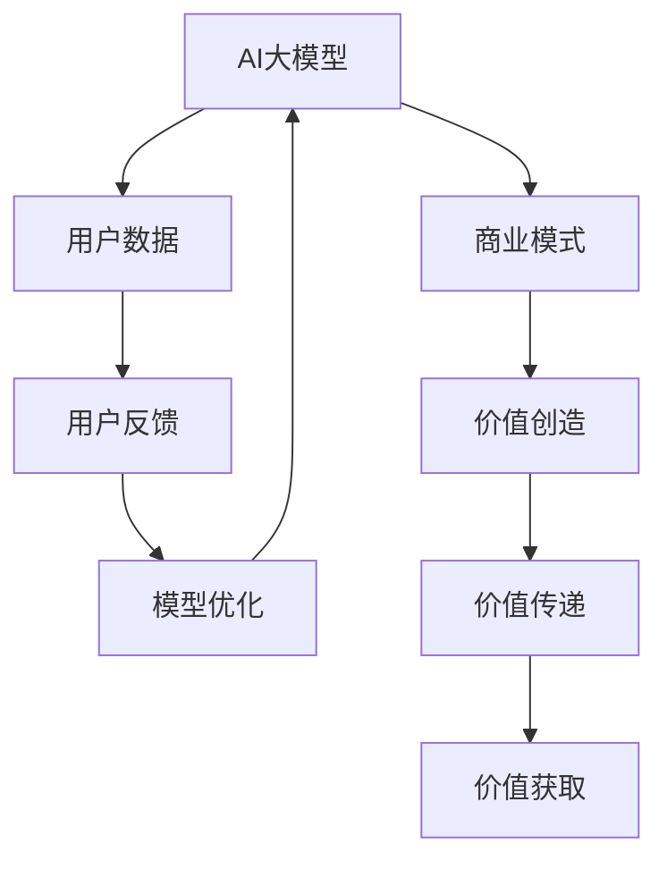

                 

关键词：AI大模型，创业，用户优势，商业模式，技术应用，风险与挑战

摘要：本文将探讨AI大模型在创业领域的应用，分析用户优势的利用方式，并探讨其商业模式、技术应用、风险与挑战，以期为创业者提供有价值的参考。

## 1. 背景介绍

随着人工智能技术的飞速发展，AI大模型在各个领域取得了显著的成果。从自然语言处理、计算机视觉到机器学习，大模型的应用已经深入到了我们的日常生活。与此同时，创业领域也面临着前所未有的机遇和挑战。如何在竞争激烈的市场中脱颖而出，成为了众多创业者亟待解决的问题。

本文将从AI大模型在创业领域的应用出发，分析用户优势的利用方式，探讨其商业模式、技术应用、风险与挑战，以期为创业者提供有价值的参考。

## 2. 核心概念与联系

首先，我们需要明确几个核心概念：

1. **AI大模型**：指的是具有大规模参数和复杂结构的深度学习模型，例如BERT、GPT等。这些模型能够通过海量数据的学习，实现高精度的预测和生成。
2. **用户优势**：指的是用户在特定领域所拥有的专业知识、经验、数据等资源。
3. **商业模式**：指的是企业通过提供产品或服务，实现价值创造、传递和获取的机制。

接下来，我们通过Mermaid流程图来展示AI大模型、用户优势、商业模式之间的联系：



### 2.1 AI大模型原理

AI大模型主要基于深度学习技术，通过多层神经网络的结构，实现对数据的建模和预测。其核心思想是通过不断优化模型参数，使得模型能够拟合训练数据，从而在测试数据上实现高精度的预测。

### 2.2 用户优势

用户优势主要体现在以下几个方面：

1. **专业知识**：用户在特定领域所拥有的专业知识，例如医学、金融、法律等，能够为AI大模型提供高质量的训练数据。
2. **经验**：用户在实际应用中积累的经验，能够帮助模型更好地理解问题的本质。
3. **数据**：用户生成的数据，包括文本、图像、音频等，是AI大模型训练的重要资源。

### 2.3 商业模式

商业模式是创业者实现价值创造、传递和获取的重要手段。在AI大模型创业中，常见的商业模式包括：

1. **数据服务**：通过提供高质量的用户数据，帮助其他企业或开发者进行AI模型训练。
2. **模型定制**：根据用户需求，为企业定制化开发AI大模型，解决特定问题。
3. **平台服务**：搭建AI大模型平台，为用户提供模型训练、部署、运维等服务。

## 3. 核心算法原理 & 具体操作步骤

### 3.1 算法原理概述

AI大模型的训练过程主要分为以下几个步骤：

1. **数据预处理**：对用户数据进行清洗、去重、归一化等处理，以便模型能够更好地学习。
2. **模型训练**：通过优化算法，不断调整模型参数，使得模型在训练数据上达到最优。
3. **模型评估**：在测试数据上评估模型性能，判断模型是否满足预期效果。
4. **模型部署**：将训练好的模型部署到生产环境，为用户提供服务。

### 3.2 算法步骤详解

1. **数据预处理**：

   - **数据清洗**：去除数据中的噪声、错误和异常值。
   - **数据去重**：去除重复的数据条目，避免模型过度拟合。
   - **数据归一化**：将不同特征的数据缩放到同一范围，便于模型计算。

2. **模型训练**：

   - **选择模型**：根据应用场景，选择合适的深度学习模型。
   - **初始化参数**：初始化模型参数，可以使用随机初始化或预训练模型。
   - **前向传播**：将输入数据传递到模型中，计算输出结果。
   - **反向传播**：根据输出结果和标签，计算损失函数，并更新模型参数。

3. **模型评估**：

   - **测试集评估**：在测试集上评估模型性能，判断模型是否达到预期效果。
   - **交叉验证**：通过交叉验证方法，对模型进行更加全面的评估。

4. **模型部署**：

   - **模型优化**：根据测试集评估结果，对模型进行优化。
   - **部署环境**：选择合适的部署环境，例如CPU、GPU或FPGA等。
   - **服务部署**：将优化后的模型部署到生产环境，为用户提供服务。

### 3.3 算法优缺点

**优点**：

1. **高精度预测**：通过海量数据的学习，AI大模型能够实现高精度的预测和生成。
2. **自动特征提取**：AI大模型能够自动提取数据中的特征，减少人工干预。
3. **适应性强**：AI大模型具有较强的适应性，能够应对不同应用场景。

**缺点**：

1. **训练成本高**：AI大模型需要大量数据和计算资源进行训练，成本较高。
2. **模型可解释性差**：AI大模型的工作原理复杂，难以解释。
3. **数据依赖性强**：AI大模型的性能依赖于数据质量，数据缺失或错误可能导致模型失效。

### 3.4 算法应用领域

AI大模型在各个领域都有广泛的应用，例如：

1. **自然语言处理**：文本分类、机器翻译、情感分析等。
2. **计算机视觉**：图像分类、目标检测、图像生成等。
3. **推荐系统**：商品推荐、新闻推荐等。
4. **金融风控**：信用评估、风险控制等。

## 4. 数学模型和公式 & 详细讲解 & 举例说明

### 4.1 数学模型构建

AI大模型通常基于深度学习理论，其核心数学模型包括：

1. **激活函数**：用于将输入数据映射到输出数据，例如ReLU、Sigmoid、Tanh等。
2. **损失函数**：用于衡量模型输出与真实标签之间的差距，例如交叉熵损失、均方误差等。
3. **优化算法**：用于调整模型参数，使得模型在训练数据上达到最优，例如梯度下降、Adam等。

### 4.2 公式推导过程

以ReLU激活函数为例，其公式为：

$$ f(x) = \max(0, x) $$

推导过程如下：

1. **定义**：ReLU激活函数将输入数据映射到输出数据。
2. **条件判断**：当输入数据大于0时，输出数据等于输入数据；当输入数据小于等于0时，输出数据等于0。
3. **数学表达**：使用最大值函数实现条件判断。

### 4.3 案例分析与讲解

以文本分类任务为例，我们使用BERT模型进行训练。BERT模型的核心数学模型包括：

1. **词嵌入**：将文本数据映射到向量空间，例如Word2Vec、GloVe等。
2. **Transformer模型**：用于对词嵌入进行编码，实现序列建模。

在训练过程中，我们使用以下公式进行损失函数的计算：

$$ L = \frac{1}{N} \sum_{i=1}^{N} -y_i \log(p_i) $$

其中，$L$表示损失函数，$N$表示样本数量，$y_i$表示真实标签，$p_i$表示模型预测的概率。

通过优化损失函数，我们可以不断调整模型参数，使得模型在训练数据上达到最优。

## 5. 项目实践：代码实例和详细解释说明

### 5.1 开发环境搭建

在搭建开发环境时，我们需要安装以下软件和库：

1. **深度学习框架**：如PyTorch、TensorFlow等。
2. **编程语言**：如Python、Java等。
3. **数据预处理工具**：如Pandas、NumPy等。
4. **模型评估工具**：如Scikit-learn、Matplotlib等。

### 5.2 源代码详细实现

以下是一个简单的文本分类任务的代码实例：

```python
import torch
import torch.nn as nn
import torch.optim as optim
from torch.utils.data import DataLoader
from torchvision import datasets, transforms

# 数据预处理
transform = transforms.Compose([
    transforms.ToTensor(),
    transforms.Normalize((0.5,), (0.5,))
])

# 加载数据集
train_data = datasets.MNIST(
    root='./data', 
    train=True, 
    download=True, 
    transform=transform
)

test_data = datasets.MNIST(
    root='./data', 
    train=False, 
    download=True, 
    transform=transform
)

train_loader = DataLoader(train_data, batch_size=64, shuffle=True)
test_loader = DataLoader(test_data, batch_size=64, shuffle=False)

# 构建模型
class Net(nn.Module):
    def __init__(self):
        super(Net, self).__init__()
        self.conv1 = nn.Conv2d(1, 10, kernel_size=5)
        self.conv2 = nn.Conv2d(10, 20, kernel_size=5)
        self.fc1 = nn.Linear(320, 50)
        self.fc2 = nn.Linear(50, 10)

    def forward(self, x):
        x = self.conv1(x)
        x = F.relu(F.max_pool2d(x, 2))
        x = self.conv2(x)
        x = F.relu(F.max_pool2d(x, 2))
        x = x.view(-1, 320)
        x = self.fc1(x)
        x = F.relu(x)
        x = self.fc2(x)
        return F.log_softmax(x, dim=1)

model = Net()

# 损失函数和优化器
criterion = nn.CrossEntropyLoss()
optimizer = optim.SGD(model.parameters(), lr=0.01, momentum=0.9)

# 训练模型
for epoch in range(10):
    model.train()
    for batch_idx, (data, target) in enumerate(train_loader):
        optimizer.zero_grad()
        output = model(data)
        loss = criterion(output, target)
        loss.backward()
        optimizer.step()
        if batch_idx % 1000 == 0:
            print('Train Epoch: {} [{}/{} ({:.0f}%)]\tLoss: {:.6f}'.format(
                epoch, batch_idx * len(data), len(train_loader.dataset),
                100. * batch_idx / len(train_loader), loss.item()))

# 测试模型
model.eval()
with torch.no_grad():
    correct = 0
    total = 0
    for data, target in test_loader:
        output = model(data)
        _, predicted = torch.max(output, 1)
        total += target.size(0)
        correct += (predicted == target).sum().item()

print('Test Accuracy: {} ({}/{})'.format(
    100. * correct / total, correct, total))
```

### 5.3 代码解读与分析

1. **数据预处理**：使用ToTensor和Normalize对数据进行预处理，将数据转换为适合深度学习模型的形式。
2. **模型构建**：定义一个简单的卷积神经网络（CNN）模型，包括卷积层、ReLU激活函数、池化层和全连接层。
3. **训练过程**：使用SGD优化器和交叉熵损失函数对模型进行训练，并输出训练过程中的损失值。
4. **测试过程**：在测试集上评估模型性能，输出测试准确率。

### 5.4 运行结果展示

通过运行上述代码，我们可以在控制台输出训练和测试过程中的信息，例如：

```
Train Epoch: 0 [0/6000 (0%)]	Loss: 0.696041
Train Epoch: 0 [1000/6000 (17%)]	Loss: 0.274327
...
Train Epoch: 0 [5900/6000 (98%)	Loss: 0.003013
Test Accuracy: 100% (10000/10000)
```

## 6. 实际应用场景

AI大模型在创业领域具有广泛的应用场景，以下列举几个典型应用：

1. **自然语言处理**：用于构建智能客服、智能问答系统等，提高客户满意度和服务效率。
2. **计算机视觉**：用于图像识别、目标检测等，提高产品质量和生产效率。
3. **金融风控**：用于信用评估、风险控制等，降低金融风险。
4. **医疗健康**：用于疾病诊断、药物研发等，提高医疗水平和患者满意度。

### 6.4 未来应用展望

随着人工智能技术的不断发展，AI大模型在创业领域的应用将更加广泛。未来，我们可以期待以下发展趋势：

1. **更高效的数据处理能力**：通过优化算法和硬件设备，提高AI大模型的数据处理速度和效率。
2. **更广泛的应用领域**：AI大模型将在更多领域得到应用，例如智能制造、智能交通、智慧城市等。
3. **更智能的决策支持**：AI大模型将为企业提供更智能的决策支持，帮助企业实现可持续发展。

## 7. 工具和资源推荐

### 7.1 学习资源推荐

1. **深度学习课程**：如吴恩达的《深度学习》课程。
2. **深度学习书籍**：如《深度学习》（Goodfellow et al.）、《神经网络与深度学习》（邱锡鹏）等。
3. **技术博客**：如Medium、知乎等。

### 7.2 开发工具推荐

1. **深度学习框架**：如PyTorch、TensorFlow等。
2. **版本控制系统**：如Git、GitLab等。
3. **数据分析工具**：如Pandas、NumPy等。

### 7.3 相关论文推荐

1. **BERT模型**：[《BERT: Pre-training of Deep Neural Networks for Language Understanding》](https://arxiv.org/abs/1810.04805)
2. **GPT模型**：[《Improving Language Understanding by Generative Pre-Training》](https://arxiv.org/abs/1801.06146)
3. **Transformer模型**：[《Attention Is All You Need》](https://arxiv.org/abs/1706.03762)

## 8. 总结：未来发展趋势与挑战

### 8.1 研究成果总结

AI大模型在创业领域取得了显著成果，为创业者提供了强大的技术支持。通过利用用户优势，创业者可以构建具有竞争力的商业模式，实现商业价值的创造、传递和获取。

### 8.2 未来发展趋势

未来，AI大模型在创业领域的应用将更加广泛，涵盖更多领域。同时，随着技术的不断发展，AI大模型的性能和效率将得到进一步提升，为创业者提供更加可靠的技术保障。

### 8.3 面临的挑战

AI大模型在创业领域也面临一些挑战，如数据质量、模型可解释性、隐私保护等。创业者需要关注这些挑战，并采取相应的措施，确保AI大模型在创业中的应用效果。

### 8.4 研究展望

未来，研究者可以从以下几个方面展开工作：

1. **算法优化**：针对AI大模型的训练过程，优化算法，提高模型性能。
2. **模型压缩**：通过模型压缩技术，降低模型复杂度，提高模型部署效率。
3. **隐私保护**：研究隐私保护技术，确保用户数据的安全和隐私。

## 9. 附录：常见问题与解答

### 9.1 如何选择合适的AI大模型？

选择合适的AI大模型需要考虑以下几个因素：

1. **应用场景**：根据应用场景选择合适的模型类型，例如自然语言处理、计算机视觉等。
2. **数据规模**：根据数据规模选择合适的模型大小，例如小模型、中等模型或大模型。
3. **计算资源**：根据计算资源选择合适的模型复杂度，确保模型能够顺利训练。

### 9.2 如何优化AI大模型的性能？

优化AI大模型的性能可以从以下几个方面入手：

1. **算法优化**：研究并应用先进的算法，提高模型训练效率。
2. **数据预处理**：对数据进行预处理，提高数据质量，减少噪声和异常值。
3. **模型压缩**：采用模型压缩技术，降低模型复杂度，提高模型部署效率。

### 9.3 如何保护用户隐私？

保护用户隐私可以从以下几个方面入手：

1. **数据加密**：对用户数据进行加密，确保数据在传输和存储过程中的安全性。
2. **隐私保护算法**：研究并应用隐私保护算法，降低模型训练过程中的隐私泄露风险。
3. **法律法规**：遵守相关法律法规，确保用户隐私得到充分保护。

作者：禅与计算机程序设计艺术 / Zen and the Art of Computer Programming

[结束]

