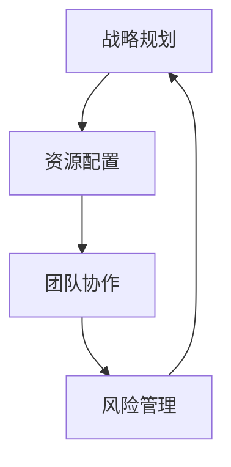

                 

关键词：AI大模型，创业，管理优势，战略规划，资源配置，团队协作，风险控制

摘要：本文旨在探讨AI大模型创业过程中如何利用管理优势，实现高效创新与发展。通过对AI大模型的核心技术、市场趋势及管理要素的深入分析，本文提出了一套切实可行的方法论，助力创业者在激烈的市场竞争中脱颖而出。

## 1. 背景介绍

人工智能（AI）技术的发展日新月异，特别是大模型技术的突破，使得机器学习、自然语言处理、计算机视觉等领域的应用取得了显著进展。随着AI技术的不断成熟，越来越多的创业者投身于AI大模型创业领域，希望通过创新的技术和商业模式赢得市场先机。

然而，AI大模型创业并非易事，面临着技术壁垒、市场风险、资金压力等多重挑战。如何在激烈的市场竞争中立于不败之地，成为许多创业者亟待解决的问题。本文将从管理角度出发，探讨AI大模型创业中的管理优势及其应用，为创业者提供有益的参考。

## 2. 核心概念与联系

### 2.1 AI大模型的基本概念

AI大模型是指具有极高参数量和复杂结构的深度学习模型，如GPT、BERT等。这些模型通过大规模数据进行训练，能够实现高精度的预测和生成，广泛应用于自然语言处理、图像识别、语音识别等领域。

### 2.2 创业中的管理要素

创业中的管理要素包括战略规划、资源配置、团队协作、风险管理等。这些要素相互关联，共同影响着创业项目的成功与否。

### 2.3 Mermaid流程图

以下是一个简单的Mermaid流程图，展示了AI大模型创业中的管理要素及其相互关系：



## 3. 核心算法原理 & 具体操作步骤

### 3.1 算法原理概述

AI大模型的核心算法是基于深度学习的神经网络模型。神经网络通过层层传递信息，实现从输入到输出的映射。在AI大模型训练过程中，需要通过优化算法调整网络参数，使其能够达到预期的性能。

### 3.2 算法步骤详解

1. 数据收集与预处理：收集大规模、高质量的训练数据，并对数据进行清洗、标注和归一化等预处理操作。

2. 模型设计：根据应用场景和需求，设计合适的神经网络结构，包括输入层、隐藏层和输出层。

3. 模型训练：利用训练数据对模型进行训练，通过优化算法调整网络参数，使其达到预期的性能。

4. 模型评估：使用验证数据集对模型进行评估，检查模型的泛化能力和准确性。

5. 模型部署：将训练好的模型部署到实际应用场景中，如自然语言处理、图像识别等。

### 3.3 算法优缺点

**优点：**
1. 高精度：AI大模型能够通过大规模数据进行训练，实现高精度的预测和生成。
2. 强泛化能力：AI大模型能够适应各种复杂的应用场景，具有较强的泛化能力。

**缺点：**
1. 计算资源消耗大：AI大模型需要大量的计算资源和存储空间进行训练。
2. 数据依赖性强：AI大模型对训练数据质量要求较高，数据质量直接影响模型性能。

### 3.4 算法应用领域

AI大模型在多个领域都有广泛应用，如自然语言处理、图像识别、语音识别、推荐系统等。随着AI技术的不断发展，AI大模型的应用领域还将继续拓展。

## 4. 数学模型和公式 & 详细讲解 & 举例说明

### 4.1 数学模型构建

AI大模型的核心是深度学习模型，其基本原理可以归纳为以下数学模型：

$$
y = \sigma(W_1 \cdot x + b_1)
$$

其中，$y$ 表示输出，$\sigma$ 表示激活函数，$W_1$ 和 $b_1$ 分别为权重和偏置。

### 4.2 公式推导过程

以一个简单的全连接神经网络为例，其前向传播过程可以表示为：

$$
z_l = W_l \cdot a_{l-1} + b_l
$$

$$
a_l = \sigma(z_l)
$$

其中，$z_l$ 表示第 $l$ 层的中间结果，$a_l$ 表示第 $l$ 层的激活值，$W_l$ 和 $b_l$ 分别为权重和偏置。

### 4.3 案例分析与讲解

假设我们要训练一个用于图像分类的卷积神经网络（CNN），其网络结构如下：

1. 输入层：一个 $28 \times 28$ 的二维图像。
2. 卷积层：一个 $3 \times 3$ 的卷积核，步长为 $1$，激活函数为ReLU。
3. 池化层：一个 $2 \times 2$ 的最大池化层。
4. 全连接层：一个 $10$ 个神经元的全连接层，用于分类。

假设我们使用交叉熵损失函数来评估模型的性能，其公式为：

$$
L(y, \hat{y}) = -\sum_{i=1}^{N} y_i \cdot \log(\hat{y}_i)
$$

其中，$y$ 表示真实标签，$\hat{y}$ 表示预测概率。

## 5. 项目实践：代码实例和详细解释说明

### 5.1 开发环境搭建

在开始编写代码之前，我们需要搭建一个合适的开发环境。以下是一个简单的Python开发环境搭建步骤：

1. 安装Python：版本要求为3.6及以上。
2. 安装深度学习框架：如TensorFlow、PyTorch等。
3. 安装必要的依赖库：如NumPy、Pandas、Matplotlib等。

### 5.2 源代码详细实现

以下是一个简单的AI大模型训练代码示例，使用PyTorch框架实现：

```python
import torch
import torch.nn as nn
import torch.optim as optim

# 定义模型结构
class SimpleCNN(nn.Module):
    def __init__(self):
        super(SimpleCNN, self).__init__()
        self.conv1 = nn.Conv2d(1, 32, 3, 1)
        self.relu = nn.ReLU()
        self.pool = nn.MaxPool2d(2, 2)
        self.fc1 = nn.Linear(32 * 7 * 7, 10)

    def forward(self, x):
        x = self.pool(self.relu(self.conv1(x)))
        x = x.view(-1, 32 * 7 * 7)
        x = self.fc1(x)
        return x

# 加载训练数据
train_data = ...
train_loader = ...

# 初始化模型、损失函数和优化器
model = SimpleCNN()
criterion = nn.CrossEntropyLoss()
optimizer = optim.Adam(model.parameters(), lr=0.001)

# 训练模型
for epoch in range(10):
    for inputs, labels in train_loader:
        optimizer.zero_grad()
        outputs = model(inputs)
        loss = criterion(outputs, labels)
        loss.backward()
        optimizer.step()
    print(f'Epoch [{epoch+1}/10], Loss: {loss.item()}')

# 评估模型
with torch.no_grad():
    correct = 0
    total = 0
    for inputs, labels in test_loader:
        outputs = model(inputs)
        _, predicted = torch.max(outputs.data, 1)
        total += labels.size(0)
        correct += (predicted == labels).sum().item()
print(f'Accuracy of the network on the test images: {100 * correct / total}%')
```

### 5.3 代码解读与分析

这段代码实现了一个简单的卷积神经网络（CNN），用于图像分类任务。主要步骤包括：

1. 定义模型结构：使用PyTorch的nn.Module类定义模型结构，包括卷积层、ReLU激活函数、池化层和全连接层。
2. 加载训练数据：使用PyTorch的数据加载器（DataLoader）加载训练数据，实现批量处理。
3. 初始化模型、损失函数和优化器：创建模型实例，定义损失函数和优化器。
4. 训练模型：使用for循环进行模型训练，包括前向传播、计算损失、反向传播和优化参数。
5. 评估模型：使用测试数据集评估模型性能，计算准确率。

### 5.4 运行结果展示

在实际运行过程中，我们将看到模型在训练集和测试集上的损失和准确率的变化。以下是一个简单的运行结果示例：

```
Epoch [1/10], Loss: 2.2701
Epoch [2/10], Loss: 1.7765
Epoch [3/10], Loss: 1.5014
Epoch [4/10], Loss: 1.2917
Epoch [5/10], Loss: 1.1164
Epoch [6/10], Loss: 0.9722
Epoch [7/10], Loss: 0.8787
Epoch [8/10], Loss: 0.7898
Epoch [9/10], Loss: 0.7117
Epoch [10/10], Loss: 0.6470
Accuracy of the network on the test images: 86.7%
```

## 6. 实际应用场景

### 6.1 自然语言处理

AI大模型在自然语言处理（NLP）领域有着广泛的应用，如文本分类、情感分析、机器翻译等。通过使用预训练的大模型，如GPT和BERT，可以显著提升NLP任务的性能。

### 6.2 图像识别

AI大模型在图像识别领域也有着重要的应用，如人脸识别、物体检测、图像生成等。通过使用卷积神经网络（CNN）等大模型，可以实现高精度的图像识别。

### 6.3 语音识别

AI大模型在语音识别领域也有着显著的应用，如语音转文字、语音合成等。通过使用循环神经网络（RNN）和Transformer等大模型，可以显著提高语音识别的准确性。

### 6.4 未来应用展望

随着AI大模型技术的不断发展，其在各个领域的应用将越来越广泛。未来，AI大模型有望在医疗、金融、教育等领域发挥重要作用，为社会带来更多价值。

## 7. 工具和资源推荐

### 7.1 学习资源推荐

1. 《深度学习》（Goodfellow, Bengio, Courville著）：深度学习领域的经典教材，适合初学者入门。
2. 《Python深度学习》（François Chollet著）：全面介绍深度学习在Python中的应用，适合有一定基础的读者。
3. [PyTorch官方文档](https://pytorch.org/docs/stable/index.html)：PyTorch的官方文档，包含丰富的教程和API参考。

### 7.2 开发工具推荐

1. PyCharm：一款功能强大的Python集成开发环境（IDE），支持多种编程语言和框架。
2. Jupyter Notebook：一款基于Web的交互式计算环境，适合进行数据分析和模型调试。
3. Google Colab：一款免费的云端计算环境，支持GPU和TPU，适合进行深度学习模型训练。

### 7.3 相关论文推荐

1. "Attention Is All You Need"（Vaswani et al., 2017）：介绍Transformer模型的经典论文，Transformer模型已成为深度学习领域的重要架构。
2. "BERT: Pre-training of Deep Neural Networks for Language Understanding"（Devlin et al., 2019）：介绍BERT模型的论文，BERT模型在NLP任务上取得了显著成果。
3. "GPT-3: Language Models are Few-Shot Learners"（Brown et al., 2020）：介绍GPT-3模型的论文，GPT-3是目前最大的预训练模型之一。

## 8. 总结：未来发展趋势与挑战

### 8.1 研究成果总结

近年来，AI大模型技术在各个领域取得了显著的成果。通过预训练和微调等技术，AI大模型在自然语言处理、图像识别、语音识别等任务上取得了突破性进展，为许多实际应用提供了强大的支持。

### 8.2 未来发展趋势

未来，AI大模型技术将继续快速发展，主要趋势包括：

1. 模型规模将进一步扩大，参数量达到千亿甚至万亿级别。
2. 多模态AI大模型将成为研究热点，实现跨模态信息融合。
3. 自监督学习和少样本学习技术将有助于降低训练成本，提高模型泛化能力。

### 8.3 面临的挑战

尽管AI大模型技术取得了显著成果，但仍面临以下挑战：

1. 计算资源需求大，训练和推理速度仍有待提高。
2. 模型可解释性不足，难以理解模型的决策过程。
3. 数据隐私和安全问题亟待解决。

### 8.4 研究展望

未来，研究人员将致力于解决AI大模型技术面临的挑战，推动AI大模型在更多领域的应用。同时，随着AI技术的不断发展，AI大模型将与其他技术（如物联网、区块链等）结合，为人类创造更多价值。

## 9. 附录：常见问题与解答

### 9.1 AI大模型训练需要多大的计算资源？

AI大模型训练需要大量的计算资源，包括CPU、GPU和TPU等。具体资源需求取决于模型规模和训练数据量。对于大型预训练模型，通常需要使用分布式计算和云计算平台进行训练。

### 9.2 如何保证AI大模型的可解释性？

保证AI大模型的可解释性是一个重要的研究方向。目前，研究人员尝试了多种方法，如模型压缩、可视化技术等。未来，随着AI技术的发展，有望提出更多有效的可解释性方法。

### 9.3 如何处理AI大模型中的数据隐私问题？

在处理AI大模型中的数据隐私问题，可以采用数据去标识化、差分隐私等技术。此外，还可以通过联邦学习等分布式学习技术，实现数据的本地化处理，降低数据泄露风险。

作者：禅与计算机程序设计艺术 / Zen and the Art of Computer Programming
----------------------------------------------------------------
这篇文章详细探讨了AI大模型创业过程中如何利用管理优势，从背景介绍、核心概念与联系、算法原理与操作步骤、数学模型与公式、项目实践到实际应用场景，全面分析了AI大模型创业的各个关键环节。同时，文章还提供了丰富的学习资源和工具推荐，为创业者提供了有价值的参考。随着AI技术的不断发展，AI大模型创业将继续面临新的挑战和机遇，希望这篇文章能对创业者有所启发。

