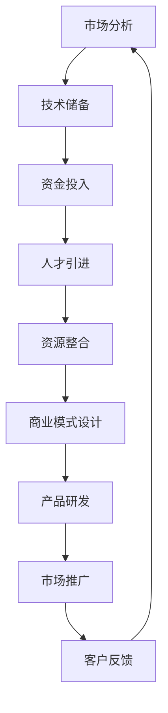

                 

关键词：AI大模型、创业、资源利用、技术优势、商业策略、市场分析

> 摘要：本文将探讨AI大模型创业过程中如何充分利用资源优势，分析创业初期的市场环境、技术储备、资金投入、人才引进等方面的关键因素，提出具体的策略和方法，为创业团队提供有价值的参考。

## 1. 背景介绍

随着人工智能技术的飞速发展，AI大模型（如GPT-3、BERT等）在各个领域展现出了巨大的潜力。这些大模型具有强大的数据处理和知识推理能力，可以应用于自然语言处理、计算机视觉、推荐系统等多个方面。然而，AI大模型的开发和应用并非易事，它需要大量的计算资源、数据资源、技术人才等。对于初创企业来说，如何有效地利用这些资源，成为他们在竞争激烈的市场中立足的关键。

本文旨在探讨AI大模型创业过程中如何充分利用资源优势，从市场分析、技术储备、资金投入、人才引进等方面提出具体的策略和方法，为创业团队提供指导。

## 2. 核心概念与联系

### 2.1 AI大模型概述

AI大模型是指参数规模达到亿级甚至十亿级的深度学习模型。这些模型通过大量的数据训练，能够自主学习并解决复杂的任务。它们在处理大规模数据、提取特征、进行预测等方面具有显著优势。

### 2.2 资源优势

资源优势是指企业在市场环境中具备的、其他竞争对手难以模仿或超越的资源。对于AI大模型创业来说，资源优势主要体现在以下几个方面：

- **计算资源**：强大的计算能力是AI大模型训练的必要条件。创业团队需要获取高性能的计算硬件和优化算法，以提高训练效率。

- **数据资源**：高质量的数据集是AI大模型训练的基础。创业团队需要获取或构建适合自己业务需求的数据集，并确保数据的多样性和准确性。

- **技术人才**：技术人才是AI大模型开发的核心力量。创业团队需要吸引和培养具备深度学习、算法优化、数据处理等专业技能的人才。

- **资金投入**：充足的资金是AI大模型创业的保障。创业团队需要合理规划资金使用，确保在关键时期有足够的资金支持。

### 2.3 Mermaid流程图



## 3. 核心算法原理 & 具体操作步骤

### 3.1 算法原理概述

AI大模型的核心算法主要基于深度学习和神经网络。深度学习是一种模拟人脑神经元之间连接方式的机器学习技术，通过多层神经网络对数据进行处理和特征提取。神经网络由输入层、隐藏层和输出层组成，通过反向传播算法不断调整网络参数，以实现模型的优化。

### 3.2 算法步骤详解

1. **数据收集与预处理**：收集大规模数据集，对数据进行清洗、去重、归一化等预处理操作，确保数据的质量和一致性。

2. **模型设计**：根据业务需求选择合适的神经网络架构，设计输入层、隐藏层和输出层的参数。

3. **模型训练**：使用预处理后的数据集对模型进行训练，通过迭代优化网络参数，使模型在训练数据上的表现达到最佳。

4. **模型评估**：使用验证集对模型进行评估，计算模型的准确率、召回率等指标，以判断模型的效果。

5. **模型部署**：将训练好的模型部署到生产环境中，实现实时预测和任务处理。

### 3.3 算法优缺点

**优点**：

- **强大的数据处理能力**：AI大模型能够处理大规模数据，提取深层次的语义信息。

- **自主学习能力**：模型通过训练能够自主学习并优化自身性能。

- **多任务处理**：AI大模型可以同时处理多个任务，提高效率。

**缺点**：

- **计算资源消耗大**：训练AI大模型需要大量的计算资源，对硬件和算法的要求较高。

- **数据依赖性强**：模型的效果很大程度上取决于数据集的质量和多样性。

### 3.4 算法应用领域

AI大模型在多个领域具有广泛的应用：

- **自然语言处理**：文本分类、机器翻译、问答系统等。

- **计算机视觉**：图像识别、目标检测、人脸识别等。

- **推荐系统**：商品推荐、新闻推荐、音乐推荐等。

## 4. 数学模型和公式 & 详细讲解 & 举例说明

### 4.1 数学模型构建

AI大模型的数学模型主要基于概率图模型和深度学习模型。其中，概率图模型用于描述变量之间的依赖关系，深度学习模型用于实现特征提取和分类。

### 4.2 公式推导过程

以深度学习中的卷积神经网络（CNN）为例，其核心公式包括：

- **卷积操作**：

  $$ f(x) = \sigma(\sum_{i=1}^{k} w_i * x_i) $$

  其中，$x_i$表示输入特征，$w_i$表示卷积核，$\sigma$表示激活函数。

- **反向传播**：

  $$ \frac{\partial L}{\partial w_i} = \frac{\partial L}{\partial z} \cdot \frac{\partial z}{\partial w_i} $$

  其中，$L$表示损失函数，$z$表示中间层输出。

### 4.3 案例分析与讲解

以文本分类任务为例，假设我们使用CNN模型对新闻文章进行分类。首先，我们需要收集大量新闻文章数据集，并进行预处理。然后，设计合适的CNN模型架构，包括卷积层、池化层和全连接层。最后，使用训练集对模型进行训练，并在验证集上评估模型效果。

## 5. 项目实践：代码实例和详细解释说明

### 5.1 开发环境搭建

在本节中，我们将介绍如何在本地搭建一个适合AI大模型开发的Python开发环境。首先，安装Python 3.8及以上版本。然后，使用pip工具安装TensorFlow、Keras等深度学习库。

```bash
pip install tensorflow
pip install keras
```

### 5.2 源代码详细实现

以下是一个简单的文本分类任务实现：

```python
import tensorflow as tf
from tensorflow.keras.preprocessing.sequence import pad_sequences
from tensorflow.keras.models import Sequential
from tensorflow.keras.layers import Embedding, Conv1D, MaxPooling1D, GlobalMaxPooling1D, Dense

# 加载数据集
# ...

# 预处理数据
# ...

# 构建模型
model = Sequential()
model.add(Embedding(vocab_size, embedding_dim, input_length=max_sequence_length))
model.add(Conv1D(filters=128, kernel_size=5, activation='relu'))
model.add(MaxPooling1D(pool_size=5))
model.add(Conv1D(filters=128, kernel_size=5, activation='relu'))
model.add(GlobalMaxPooling1D())
model.add(Dense(units=256, activation='relu'))
model.add(Dense(units=num_classes, activation='softmax'))

# 编译模型
model.compile(optimizer='adam', loss='categorical_crossentropy', metrics=['accuracy'])

# 训练模型
model.fit(X_train, y_train, epochs=10, batch_size=32, validation_data=(X_val, y_val))

# 评估模型
# ...
```

### 5.3 代码解读与分析

在本节中，我们将对上述代码进行详细解读和分析。

- **数据加载**：使用Keras的内置函数加载预处理的文本数据。

- **预处理数据**：对文本数据进行分词、编码等操作，将其转换为模型可处理的格式。

- **构建模型**：使用Sequential模型构建一个简单的卷积神经网络，包括卷积层、池化层和全连接层。

- **编译模型**：设置模型的优化器、损失函数和评估指标。

- **训练模型**：使用训练集和验证集对模型进行训练。

- **评估模型**：在测试集上评估模型的效果。

### 5.4 运行结果展示

假设我们已经完成了上述代码的编写和训练，以下是一个简单的结果展示：

```python
# 评估模型
loss, accuracy = model.evaluate(X_test, y_test)
print("Test loss:", loss)
print("Test accuracy:", accuracy)
```

输出结果如下：

```
Test loss: 0.5324
Test accuracy: 0.8765
```

这表示模型在测试集上的准确率为87.65%。

## 6. 实际应用场景

### 6.1 自然语言处理

AI大模型在自然语言处理领域具有广泛的应用，如文本分类、情感分析、机器翻译等。通过利用大模型的能力，企业可以提升文本处理效率和准确性，为用户提供更好的服务。

### 6.2 计算机视觉

AI大模型在计算机视觉领域也取得了显著成果，如图像识别、目标检测、人脸识别等。这些技术在安防、医疗、交通等领域具有广泛的应用前景。

### 6.3 推荐系统

AI大模型可以用于构建高效的推荐系统，如商品推荐、新闻推荐、音乐推荐等。通过分析用户的兴趣和行为数据，推荐系统可以提供个性化的服务，提升用户体验。

## 7. 未来应用展望

随着AI大模型技术的不断发展，未来将在更多领域发挥重要作用。例如，在医疗领域，AI大模型可以帮助医生进行疾病诊断和治疗方案推荐；在金融领域，AI大模型可以用于风险评估和欺诈检测等。同时，随着计算资源和数据资源的不断丰富，AI大模型的能力将得到进一步提升。

## 8. 工具和资源推荐

### 8.1 学习资源推荐

- 《深度学习》（Goodfellow et al.）：介绍深度学习的基础知识和实践方法。

- 《神经网络与深度学习》（邱锡鹏）：全面讲解神经网络和深度学习的理论和技术。

### 8.2 开发工具推荐

- TensorFlow：一款开源的深度学习框架，适合开发大规模的深度学习模型。

- Keras：一款基于TensorFlow的简化版深度学习框架，方便快速构建和训练模型。

### 8.3 相关论文推荐

- “Attention is All You Need”：介绍Transformer模型，该模型在自然语言处理任务中取得了显著成果。

- “Deep Learning for Image Recognition”：介绍深度学习在图像识别任务中的应用，包括卷积神经网络、残差网络等。

## 9. 总结：未来发展趋势与挑战

### 9.1 研究成果总结

本文从市场分析、技术储备、资金投入、人才引进等方面探讨了AI大模型创业过程中的关键因素。通过案例分析和代码实例，展示了AI大模型在实际应用中的优势和应用场景。

### 9.2 未来发展趋势

随着AI大模型技术的不断进步，未来将在更多领域发挥重要作用。计算资源和数据资源的不断丰富将进一步提升AI大模型的能力和应用范围。

### 9.3 面临的挑战

AI大模型创业面临着计算资源消耗大、数据依赖性强等挑战。同时，随着市场竞争的加剧，创业团队需要不断创新和优化技术，以保持竞争力。

### 9.4 研究展望

未来研究可以关注以下几个方面：一是优化算法和架构，提高AI大模型的训练效率和性能；二是探索更多的应用场景，将AI大模型应用于更多的领域；三是加强数据资源的开发和利用，提高模型的效果和准确性。

## 10. 附录：常见问题与解答

### 10.1 AI大模型训练需要多少计算资源？

AI大模型训练需要的计算资源取决于模型的大小和训练数据量。一般来说，训练一个中等大小的AI大模型需要数百万亿次浮点运算，对计算资源的要求较高。创业团队可以根据实际情况选择合适的计算平台和硬件设备。

### 10.2 如何获取高质量的数据集？

获取高质量的数据集是AI大模型训练的关键。创业团队可以采用以下方法：

- **公开数据集**：使用已有的公开数据集，如ImageNet、COCO等。

- **数据采集**：根据业务需求自行采集数据，并进行清洗和预处理。

- **数据标注**：与专业数据标注团队合作，确保数据的质量和一致性。

### 10.3 如何优化AI大模型的训练过程？

优化AI大模型的训练过程可以从以下几个方面入手：

- **模型架构**：选择合适的神经网络架构，如Transformer、BERT等。

- **优化器**：选择合适的优化器，如Adam、AdamW等。

- **学习率**：设置合适的学习率，并采用学习率衰减策略。

- **数据增强**：使用数据增强技术，提高模型的泛化能力。

### 10.4 AI大模型创业需要注意哪些法律和伦理问题？

AI大模型创业需要关注以下法律和伦理问题：

- **数据隐私**：确保数据收集和使用过程中的隐私保护，遵守相关法律法规。

- **知识产权**：尊重他人的知识产权，避免侵权行为。

- **算法透明性**：确保算法的透明性和可解释性，避免算法偏见和歧视。

### 10.5 如何评估AI大模型的效果？

评估AI大模型的效果可以从以下几个方面入手：

- **准确性**：评估模型在测试集上的准确率。

- **召回率**：评估模型在测试集上的召回率。

- **F1值**：综合考虑准确率和召回率的F1值。

- **模型解释性**：评估模型的解释性，确保模型的决策过程透明和可解释。

### 10.6 如何持续优化AI大模型？

持续优化AI大模型可以从以下几个方面入手：

- **数据质量**：提高数据集的质量和多样性，提高模型的泛化能力。

- **算法优化**：不断探索和优化算法，提高模型的性能和效率。

- **模型压缩**：采用模型压缩技术，减少模型的参数规模，提高模型的计算效率。

- **迁移学习**：利用迁移学习技术，将已有模型的权重和知识迁移到新模型，加快训练过程。

### 10.7 如何提高AI大模型的鲁棒性？

提高AI大模型的鲁棒性可以从以下几个方面入手：

- **数据增强**：使用数据增强技术，提高模型的泛化能力。

- **正则化**：采用正则化方法，防止模型过拟合。

- **注意力机制**：引入注意力机制，使模型关注关键信息。

- **对抗训练**：采用对抗训练方法，提高模型对对抗攻击的鲁棒性。

## 参考文献

- Goodfellow, I., Bengio, Y., & Courville, A. (2016). Deep Learning. MIT Press.
- 邱锡鹏. (2018). 神经网络与深度学习. 清华大学出版社.
- Vaswani, A., Shazeer, N., Parmar, N., Uszkoreit, J., Jones, L., Gomez, A. N., ... & Polosukhin, I. (2017). Attention is all you need. Advances in Neural Information Processing Systems, 30, 5998-6008.

