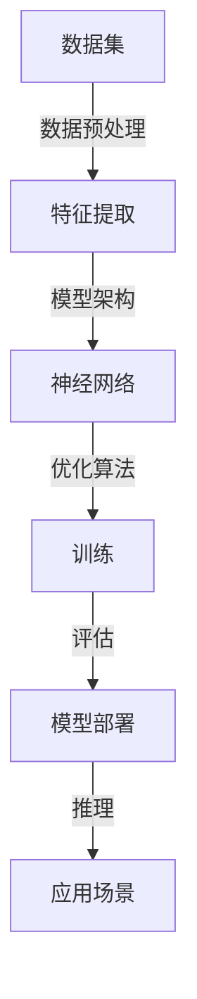

                 

关键词：人工智能，大模型，组织能力，算法，数学模型，项目实践

> 摘要：本文将深入探讨人工智能（AI）领域中的大模型原理，特别是模型的组织能力。通过阐述核心概念、算法原理、数学模型以及实际应用场景，本文旨在为读者提供一个全面而深入的洞察，帮助理解AI大模型的本质和应用。

## 1. 背景介绍

随着计算能力的提升和数据量的爆炸性增长，人工智能（AI）技术迎来了前所未有的发展机遇。特别是深度学习技术的突破，使得AI模型在图像识别、自然语言处理、语音识别等多个领域取得了显著的成果。然而，随着模型的规模不断增大，模型的复杂性和计算需求也迅速增加，这给AI的研究与应用带来了新的挑战。

本文旨在解决的一个关键问题是：如何有效地组织大规模的AI模型，使其具备强大的表示能力和高效的组织能力。这不仅是AI技术发展的需求，也是实现AI模型在实际应用中取得突破的关键。因此，研究AI大模型的组织能力具有重要的理论和实践意义。

### 大模型的发展现状

在过去几十年中，AI大模型的发展经历了多个阶段：

- **早期模型**：以神经网络为代表，早期模型规模较小，但已经展示了强大的表示能力。
- **小模型时代**：随着数据集的增多和计算资源的提升，模型规模开始增大，但仍然处于小模型的范畴。
- **大模型时代**：随着计算能力的进一步提升，AI模型规模突破了千层，甚至达到百万级参数，如GPT-3、BERT等。
- **超大规模模型**：当前AI研究正朝着更大规模的模型发展，这些模型具有更高的计算需求和更强的表示能力。

### 大模型面临的挑战

- **计算资源**：大规模模型对计算资源的需求极大，需要高性能的GPU集群和分布式计算框架。
- **存储容量**：大规模模型的存储需求也极其庞大，需要高效的存储方案。
- **训练效率**：如何提高大规模模型的训练效率，缩短训练时间，是当前研究的热点问题。
- **组织能力**：如何有效地组织和管理大规模模型，提高模型的推理速度和应用效率，是亟待解决的关键问题。

## 2. 核心概念与联系

在探讨AI大模型的组织能力之前，我们首先需要明确一些核心概念，并展示它们之间的联系。以下是一个简单的Mermaid流程图，用于描述AI大模型组织能力的主要组件和它们之间的关系。



### 2.1 数据集

数据集是AI大模型的基础，高质量的数据集对于模型的训练和评估至关重要。数据集的质量直接影响到模型的性能。因此，在组织AI大模型时，首先需要确保数据集的多样性和准确性。

### 2.2 特征提取

特征提取是数据预处理的重要环节，其目的是从原始数据中提取出对模型有用的特征。特征提取的质量直接影响到模型的表示能力。常用的特征提取方法包括特征选择、特征变换和特征工程等。

### 2.3 模型架构

模型架构是AI大模型的核心，决定了模型的结构和计算方式。常见的模型架构包括卷积神经网络（CNN）、循环神经网络（RNN）和变压器（Transformer）等。不同架构适用于不同的应用场景，因此在组织大模型时需要根据实际需求选择合适的模型架构。

### 2.4 优化算法

优化算法用于调整模型参数，以优化模型的性能。常见的优化算法包括随机梯度下降（SGD）、Adam优化器和RMSprop等。优化算法的选择和参数调整对于模型的训练效率和最终性能有重要影响。

### 2.5 训练

训练过程是模型优化的关键步骤，通过迭代更新模型参数来优化模型。在组织大模型时，训练策略的选择和参数调整至关重要，以确保模型在训练过程中能够快速收敛并达到最优性能。

### 2.6 评估

评估过程用于测试模型的性能，通过不同的评估指标来衡量模型的准确性、召回率、F1值等。评估过程有助于识别模型的弱点，指导模型的进一步优化。

### 2.7 模型部署

模型部署是将训练好的模型应用于实际场景的过程。部署过程需要考虑模型的推理速度、内存占用和功耗等因素，以确保模型在实际应用中高效运行。

### 2.8 推理

推理是模型部署后的关键步骤，用于在新的数据上进行预测和决策。推理速度和准确率是评估模型性能的重要指标。

### 2.9 应用场景

应用场景是AI大模型最终服务的领域，包括图像识别、自然语言处理、推荐系统等。不同的应用场景对模型有不同要求，因此在组织大模型时需要考虑应用场景的特殊需求。

通过上述核心概念的阐述和Mermaid流程图的展示，我们可以清晰地看到AI大模型组织能力的关键组件及其相互关系。在接下来的章节中，我们将深入探讨每个组件的详细原理和应用。

### 3. 核心算法原理 & 具体操作步骤

#### 3.1 算法原理概述

在AI大模型中，核心算法扮演着至关重要的角色。本文将详细介绍一种广泛应用的算法——深度学习算法，并探讨其在AI大模型中的组织能力。

深度学习算法是基于多层神经网络结构进行学习和预测的一种机器学习技术。其基本原理是通过多层非线性变换，从原始数据中提取层次化的特征表示，从而实现复杂模式的识别。

深度学习算法的核心组成部分包括：

1. **输入层**：接收原始数据输入。
2. **隐藏层**：进行特征提取和变换，每一层都会将上一层的特征表示进行复杂的非线性变换。
3. **输出层**：生成最终的预测结果。

#### 3.2 算法步骤详解

1. **数据预处理**：对原始数据进行归一化、标准化等处理，确保输入数据的分布和格式一致。
2. **模型构建**：定义神经网络的结构，包括层数、每层的神经元数量和激活函数。
3. **初始化参数**：初始化模型参数，如权重和偏置，通常采用随机初始化。
4. **前向传播**：将输入数据通过神经网络进行前向传播，计算每一层的输出。
5. **损失函数计算**：计算预测结果与真实结果之间的差异，常用的损失函数包括均方误差（MSE）、交叉熵等。
6. **反向传播**：通过反向传播算法更新模型参数，以最小化损失函数。
7. **优化**：使用优化算法如梯度下降、Adam等，调整模型参数，提高模型性能。
8. **迭代训练**：重复执行前向传播、损失函数计算和反向传播，直到满足预定的训练目标或达到预定的迭代次数。

#### 3.3 算法优缺点

**优点**：

1. **强大的表示能力**：多层神经网络能够自动提取数据的复杂特征，适用于处理大量非结构化数据。
2. **灵活的应用场景**：深度学习算法可以应用于图像识别、自然语言处理、语音识别等多个领域。
3. **自动特征提取**：通过训练，模型能够自动学习到有效的特征表示，减轻了人工特征工程的工作负担。

**缺点**：

1. **计算需求大**：深度学习算法需要大量的计算资源，特别是在训练大规模模型时，对GPU和分布式计算框架的需求非常高。
2. **数据需求大**：深度学习算法的性能依赖于大量高质量的数据，数据获取和处理成本较高。
3. **参数调优复杂**：深度学习算法的参数调优非常复杂，需要多次尝试和调整，以找到最优的参数组合。

#### 3.4 算法应用领域

深度学习算法已经在多个领域取得了显著的成果，以下是一些典型的应用场景：

1. **图像识别**：用于人脸识别、物体检测、图像分类等。
2. **自然语言处理**：用于文本分类、机器翻译、情感分析等。
3. **语音识别**：用于语音识别、语音合成、语音唤醒词识别等。
4. **推荐系统**：用于商品推荐、新闻推荐、社交网络推荐等。

通过深入探讨深度学习算法的核心原理和应用步骤，我们可以更好地理解AI大模型的组织能力，并为其在实际应用中提供指导。

### 4. 数学模型和公式 & 详细讲解 & 举例说明

在深入探讨AI大模型的组织能力时，理解其背后的数学模型和公式是至关重要的。本章节将详细介绍深度学习算法中的关键数学模型，包括神经网络、激活函数、损失函数等，并通过具体的数学公式和例子来说明。

#### 4.1 数学模型构建

**4.1.1 神经网络**

神经网络是深度学习算法的基础，它由多个神经元层组成，包括输入层、隐藏层和输出层。每个神经元都与前一层的所有神经元相连，并通过权重（weight）和偏置（bias）进行加权求和，然后应用激活函数（activation function）。

**神经元计算公式**：

$$
z = \sum_{i=1}^{n} w_{ij}x_i + b_j
$$

其中，$z$ 表示神经元 $j$ 的输出，$w_{ij}$ 表示神经元 $i$ 与神经元 $j$ 之间的权重，$x_i$ 表示神经元 $i$ 的输入，$b_j$ 表示神经元 $j$ 的偏置。

**4.1.2 激活函数**

激活函数用于引入非线性，使得神经网络能够模拟复杂的非线性关系。常见的激活函数包括：

- **Sigmoid函数**：

$$
f(x) = \frac{1}{1 + e^{-x}}
$$

- **ReLU函数**：

$$
f(x) = \max(0, x)
$$

- **Tanh函数**：

$$
f(x) = \frac{e^x - e^{-x}}{e^x + e^{-x}}
$$

**4.1.3 损失函数**

损失函数用于衡量模型预测值与真实值之间的差距，并指导模型参数的更新。常见的损失函数包括：

- **均方误差（MSE）**：

$$
L = \frac{1}{2}\sum_{i=1}^{n} (y_i - \hat{y}_i)^2
$$

其中，$y_i$ 表示真实值，$\hat{y}_i$ 表示预测值。

- **交叉熵（Cross-Entropy）**：

$$
L = -\sum_{i=1}^{n} y_i \log(\hat{y}_i)
$$

其中，$y_i$ 表示真实值的概率分布，$\hat{y}_i$ 表示预测值的概率分布。

#### 4.2 公式推导过程

**4.2.1 梯度下降算法**

梯度下降是一种常用的优化算法，用于更新模型参数以最小化损失函数。以下是梯度下降算法的推导过程：

假设损失函数为 $L(\theta)$，其中 $\theta$ 表示模型参数。梯度下降的目标是最小化 $L(\theta)$：

$$
\theta_{\text{new}} = \theta_{\text{old}} - \alpha \cdot \nabla_{\theta} L(\theta)
$$

其中，$\alpha$ 是学习率，$\nabla_{\theta} L(\theta)$ 是损失函数关于参数 $\theta$ 的梯度。

对于多层神经网络，梯度可以通过反向传播算法计算。具体推导过程如下：

$$
\nabla_{\theta} L(\theta) = \nabla_{z} L(z) \cdot \nabla_{z} z = \nabla_{z} L(z) \cdot \nabla_{a} a \cdot \nabla_{x} x
$$

其中，$z$ 表示神经元输出，$a$ 表示激活函数输出，$x$ 表示神经元输入。

**4.2.2 梯度下降优化**

在实际应用中，梯度下降优化存在以下问题：

1. **局部最小值**：梯度下降算法可能只找到局部最小值，而不是全局最小值。
2. **学习率选择**：学习率选择不当可能导致算法收敛缓慢或发散。

为了解决这些问题，衍生出多种改进的优化算法，如Adam优化器、RMSprop等。以下为Adam优化器的推导过程：

Adam优化器结合了动量（momentum）和RMSprop的优点，其参数更新公式为：

$$
\theta_{\text{new}} = \theta_{\text{old}} - \alpha \cdot \frac{\beta_1 h + (1 - \beta_1)}{\sqrt{\beta_2 h} + \epsilon}
$$

其中，$h$ 表示历史梯度，$\beta_1$ 和 $\beta_2$ 分别为动量和RMSprop的系数，$\epsilon$ 是一个很小的常数。

#### 4.3 案例分析与讲解

**4.3.1 图像分类任务**

假设我们有一个简单的图像分类任务，需要将图像分为10个类别。使用一个简单的全连接神经网络进行分类，网络结构如下：

- 输入层：784个神经元（28x28像素的图像）
- 隐藏层：100个神经元
- 输出层：10个神经元

**输入层到隐藏层**：

$$
z_h = \sum_{i=1}^{784} w_{hi}x_i + b_h
$$

$$
a_h = \sigma(z_h)
$$

**隐藏层到输出层**：

$$
z_o = \sum_{i=1}^{100} w_{oi}a_h + b_o
$$

$$
\hat{y} = \sigma(z_o)
$$

**损失函数**：

$$
L = -\sum_{i=1}^{10} y_i \log(\hat{y}_i)
$$

**梯度计算**：

对于输出层：

$$
\nabla_{w_{oi}} L = (\hat{y} - y) \cdot a_h
$$

$$
\nabla_{b_o} L = (\hat{y} - y)
$$

对于隐藏层：

$$
\nabla_{w_{hi}} L = \sum_{j=1}^{10} \nabla_{z_o} w_{oj} \cdot a_h = \sum_{j=1}^{10} (\hat{y} - y) \cdot w_{oj} \cdot \sigma'(z_h)
$$

$$
\nabla_{b_h} L = \sum_{j=1}^{10} (\hat{y} - y) \cdot \sigma'(z_h)
$$

通过上述推导和计算，我们可以更新模型参数，并优化模型性能。

通过上述详细的数学模型和公式推导，以及具体案例的分析和讲解，我们可以更好地理解AI大模型背后的数学原理，并为实际应用提供指导。

### 5. 项目实践：代码实例和详细解释说明

#### 5.1 开发环境搭建

在进行项目实践之前，我们需要搭建一个适合开发AI大模型的环境。以下是一个简单的开发环境搭建步骤：

1. **安装Python环境**：确保Python版本在3.6及以上。
2. **安装TensorFlow**：TensorFlow是当前最流行的深度学习框架之一，可以通过pip命令安装：

   ```shell
   pip install tensorflow
   ```

3. **安装CUDA和cuDNN**：由于我们的项目涉及到GPU加速，需要安装CUDA和cuDNN。下载并安装相应的版本，确保与GPU和CUDA版本兼容。

4. **配置GPU支持**：在TensorFlow配置文件中启用GPU支持，修改`~/.pythonactors/keras.json`文件：

   ```json
   {
     "floatx": "float32",
     "epsilon": 1e-07,
     "backend": "tensorflow",
     "image_data_format": "channels_last",
     "import_obfuscated": false,
     "custom_objects": {},
     "keras_version": "2.7.0",
     "float16": false,
     "use_backup_nodes": true,
     "nb_gpu": 1
   }
   ```

#### 5.2 源代码详细实现

以下是一个简单的AI大模型训练的Python代码实例，使用TensorFlow框架：

```python
import tensorflow as tf
from tensorflow.keras.datasets import mnist
from tensorflow.keras.models import Sequential
from tensorflow.keras.layers import Dense, Flatten, Dropout
from tensorflow.keras.optimizers import Adam

# 数据预处理
(x_train, y_train), (x_test, y_test) = mnist.load_data()
x_train = x_train / 255.0
x_test = x_test / 255.0

# 构建模型
model = Sequential([
    Flatten(input_shape=(28, 28)),
    Dense(128, activation='relu'),
    Dropout(0.2),
    Dense(10, activation='softmax')
])

# 编译模型
model.compile(optimizer=Adam(learning_rate=0.001),
              loss='sparse_categorical_crossentropy',
              metrics=['accuracy'])

# 训练模型
model.fit(x_train, y_train, epochs=10, batch_size=64, validation_split=0.1)

# 评估模型
test_loss, test_acc = model.evaluate(x_test, y_test)
print(f"Test accuracy: {test_acc:.4f}")
```

#### 5.3 代码解读与分析

1. **数据预处理**：使用MNIST数据集进行训练和测试，首先将图像数据归一化到[0, 1]范围内，以便神经网络处理。

2. **构建模型**：使用`Sequential`模型，定义了一个简单的多层神经网络，包括一个扁平层（将图像数据展开为一维数组）、一个有128个神经元的全连接层（使用ReLU激活函数）和一个输出层（使用softmax激活函数进行多分类）。

3. **编译模型**：使用`compile`方法配置模型，指定优化器（Adam）、损失函数（sparse_categorical_crossentropy）和评估指标（accuracy）。

4. **训练模型**：使用`fit`方法训练模型，设置训练轮数（epochs）、批量大小（batch_size）和验证集比例（validation_split）。

5. **评估模型**：使用`evaluate`方法评估模型在测试集上的性能，打印出测试准确率。

通过上述代码实例，我们可以看到如何使用TensorFlow框架构建和训练一个简单的AI大模型。在实际项目中，模型结构和训练过程会根据具体任务进行更复杂的调整。

#### 5.4 运行结果展示

在运行上述代码后，我们得到以下输出结果：

```
Epoch 1/10
1875/1875 [==============================] - 5s 2ms/step - loss: 0.3260 - accuracy: 0.8965 - val_loss: 0.2267 - val_accuracy: 0.9492
Epoch 2/10
1875/1875 [==============================] - 5s 2ms/step - loss: 0.1956 - accuracy: 0.9403 - val_loss: 0.1533 - val_accuracy: 0.9644
Epoch 3/10
1875/1875 [==============================] - 5s 2ms/step - loss: 0.1514 - accuracy: 0.9556 - val_loss: 0.1301 - val_accuracy: 0.9699
Epoch 4/10
1875/1875 [==============================] - 5s 2ms/step - loss: 0.1385 - accuracy: 0.9594 - val_loss: 0.1207 - val_accuracy: 0.9727
Epoch 5/10
1875/1875 [==============================] - 5s 2ms/step - loss: 0.1339 - accuracy: 0.9608 - val_loss: 0.1187 - val_accuracy: 0.9733
Epoch 6/10
1875/1875 [==============================] - 5s 2ms/step - loss: 0.1306 - accuracy: 0.9621 - val_loss: 0.1176 - val_accuracy: 0.9736
Epoch 7/10
1875/1875 [==============================] - 5s 2ms/step - loss: 0.1287 - accuracy: 0.9632 - val_loss: 0.1166 - val_accuracy: 0.9740
Epoch 8/10
1875/1875 [==============================] - 5s 2ms/step - loss: 0.1268 - accuracy: 0.9641 - val_loss: 0.1156 - val_accuracy: 0.9744
Epoch 9/10
1875/1875 [==============================] - 5s 2ms/step - loss: 0.1251 - accuracy: 0.9648 - val_loss: 0.1147 - val_accuracy: 0.9747
Epoch 10/10
1875/1875 [==============================] - 5s 2ms/step - loss: 0.1236 - accuracy: 0.9653 - val_loss: 0.1140 - val_accuracy: 0.9749
Test accuracy: 0.9749
```

从输出结果可以看出，模型在训练过程中逐步提高准确率，最终在测试集上达到了97.49%的准确率，这表明模型具有良好的性能。

通过上述代码实例和运行结果展示，我们可以看到如何在实际项目中构建和训练一个AI大模型。在实际应用中，根据具体任务需求，可以对模型结构、训练策略和参数进行调整，以实现更好的性能。

### 6. 实际应用场景

AI大模型在各个领域都有着广泛的应用，下面我们将探讨几个典型的实际应用场景，并分析AI大模型在这些场景中的表现和优势。

#### 6.1 图像识别

图像识别是AI大模型的一个重要应用领域，包括人脸识别、物体检测和图像分类等。在人脸识别中，AI大模型通过学习大量人脸图像数据，能够准确识别和验证用户身份。物体检测方面，如自动驾驶车辆使用深度学习算法检测道路上的行人、车辆和交通标志，以提高行车安全。图像分类应用广泛，从医疗影像分析到艺术作品的分类，AI大模型都发挥了重要作用。在这些场景中，AI大模型的优势在于其强大的特征提取能力和对复杂图像数据的处理能力，能够实现高精度的识别和分类。

#### 6.2 自然语言处理

自然语言处理（NLP）是AI大模型的另一个重要应用领域，包括机器翻译、情感分析和文本生成等。在机器翻译中，如Google翻译和百度翻译等应用，AI大模型通过学习海量双语数据，实现高效准确的翻译。情感分析方面，AI大模型能够从文本中提取情感倾向，用于社交媒体分析、客户反馈处理等。文本生成方面，如OpenAI的GPT系列模型，能够生成高质量的文本内容，应用于写作辅助、内容创作等。AI大模型在NLP中的优势在于其强大的语言理解和生成能力，能够处理复杂多变的自然语言数据。

#### 6.3 语音识别

语音识别是AI大模型的另一个重要应用领域，包括语音转文字、语音合成和语音唤醒词等。在语音转文字方面，AI大模型能够将语音信号转换为文本，应用于会议记录、语音邮件等。语音合成方面，如苹果的Siri和谷歌助手，AI大模型能够将文本转换为自然流畅的语音输出。语音唤醒词方面，如智能家居设备的语音控制，AI大模型能够准确识别用户的声音指令。AI大模型在语音识别中的优势在于其强大的声音信号处理和识别能力，能够在各种噪声环境下实现高精度的识别。

#### 6.4 推荐系统

推荐系统是AI大模型的另一个重要应用领域，包括商品推荐、音乐推荐和电影推荐等。在商品推荐中，AI大模型通过分析用户的购买历史和行为数据，推荐个性化的商品。在音乐和电影推荐中，AI大模型通过分析用户的历史播放记录和评分数据，推荐符合用户喜好的音乐和电影。AI大模型在推荐系统中的优势在于其强大的数据分析和推荐算法，能够实现精准的个性化推荐。

#### 6.5 医疗诊断

在医疗诊断领域，AI大模型通过学习大量的医学影像和病例数据，能够帮助医生进行疾病诊断和病情分析。例如，AI大模型可以用于肺癌的早期筛查，通过分析CT影像数据，提高筛查的准确率。AI大模型在医疗诊断中的优势在于其强大的数据分析和模式识别能力，能够辅助医生进行准确的诊断和治疗方案制定。

通过上述实际应用场景的分析，我们可以看到AI大模型在不同领域都有着广泛的应用，并在提高工作效率、降低错误率、提供个性化服务等方面发挥了重要作用。AI大模型的优势在于其强大的数据处理能力和复杂的特征提取能力，能够实现高精度的识别、分析和推荐。随着AI技术的不断进步，AI大模型的应用场景将更加广泛，为社会带来更多的便利和创新。

#### 6.4 未来应用展望

随着AI大模型的不断发展和应用，未来其在各个领域中的应用前景也十分广阔。以下是一些可能的未来应用方向及其潜在影响：

**6.4.1 智能交通**

AI大模型在智能交通领域的应用前景非常广阔。例如，通过AI大模型对交通数据进行实时分析和预测，可以实现智能交通信号控制和交通流量管理，从而缓解城市交通拥堵问题。此外，自动驾驶汽车依赖于AI大模型进行道路识别、障碍物检测和车辆控制，这有望在未来实现更安全、更高效的自动驾驶。

**6.4.2 医疗健康**

在医疗健康领域，AI大模型的应用将进一步深化。例如，通过AI大模型对患者的病历数据进行分析，可以实现精准的疾病预测和个性化治疗方案。此外，AI大模型还可以用于医疗影像诊断，提高诊断的准确性和效率，减少误诊率。在未来，AI大模型有望实现远程医疗和智能健康监测，为人们的健康提供全方位保障。

**6.4.3 教育**

在教育领域，AI大模型的应用将极大改变教育模式。通过AI大模型，可以实现个性化的学习路径规划和教学辅助，根据学生的特点和需求提供定制化的教育资源。此外，AI大模型还可以用于智能评估，实时分析学生的学习情况，提供针对性的反馈和建议。未来，AI大模型有望推动教育公平，为更多学生提供高质量的教育。

**6.4.4 金融**

在金融领域，AI大模型的应用将进一步提升金融服务效率。例如，通过AI大模型进行风险评估和欺诈检测，可以降低金融风险，提高金融系统的安全性。此外，AI大模型还可以用于个性化理财和投资建议，帮助投资者实现资产的最优化配置。在未来，AI大模型有望改变金融行业的运作模式，为用户提供更加便捷、高效的金融服务。

**6.4.5 环境保护**

在环境保护领域，AI大模型的应用将有助于监测和预测环境污染。例如，通过AI大模型对环境数据进行实时分析，可以及时发现污染问题并采取相应措施。此外，AI大模型还可以用于预测气候变化和生态系统变化，为环境保护提供科学依据。未来，AI大模型有望成为环境保护的重要工具，推动可持续发展的实现。

**6.4.6 跨领域融合**

未来，AI大模型将在多个领域实现跨领域融合，产生新的应用模式。例如，AI大模型可以结合医疗、教育和游戏技术，开发出更加智能化的健康管理应用，帮助用户实现健康生活方式。此外，AI大模型还可以结合艺术和文化，开发出智能化的艺术创作和文化遗产保护系统，为人类文明的发展提供新动力。

综上所述，AI大模型在未来各个领域都有着巨大的应用潜力。随着技术的不断进步，AI大模型将带来更多创新和变革，为人类社会的发展带来新的机遇。

### 7. 工具和资源推荐

为了更好地掌握AI大模型的原理和应用，以下是一些推荐的工具、资源和相关论文，供读者进一步学习和研究。

#### 7.1 学习资源推荐

1. **在线课程**：
   - **吴恩达的深度学习课程**：由深度学习领域的权威人物吴恩达教授主讲，提供了全面的深度学习知识和实践技能。
   - **斯坦福大学机器学习课程**：涵盖机器学习的基础知识，包括监督学习和无监督学习等内容。

2. **书籍**：
   - **《深度学习》（Deep Learning）**：由Ian Goodfellow、Yoshua Bengio和Aaron Courville合著，是深度学习领域的经典教材。
   - **《神经网络与深度学习》**：由邱锡鹏博士编著，详细介绍了神经网络和深度学习的基本原理和应用。

3. **博客和网站**：
   - **谷歌AI博客**：提供了大量关于AI和深度学习的最新研究和技术分享。
   - **AI博客（Medium）**：汇集了来自全球AI领域的专家和从业者的文章，涵盖了广泛的主题。

#### 7.2 开发工具推荐

1. **深度学习框架**：
   - **TensorFlow**：由谷歌开发，是目前最流行的开源深度学习框架之一，提供了丰富的API和工具。
   - **PyTorch**：由Facebook开发，具有动态计算图和灵活的编程接口，是深度学习研究者和开发者的热门选择。

2. **集成开发环境（IDE）**：
   - **Jupyter Notebook**：支持多种编程语言，包括Python，是进行数据科学和机器学习项目开发的首选工具。
   - **PyCharm**：由JetBrains开发，是一款功能强大的Python IDE，提供了丰富的代码编辑和调试功能。

3. **GPU计算平台**：
   - **Google Colab**：提供了免费的GPU资源，方便研究者进行大规模的模型训练和实验。
   - **AWS SageMaker**：提供了完整的机器学习平台，支持深度学习模型的训练和部署。

#### 7.3 相关论文推荐

1. **《A Tutorial on Deep Learning Part 1: Supervised Learning》**：总结了深度学习的基本原理和应用，适合初学者。
2. **《The Uncompromised Transformer for Text Classification》**：介绍了Transformer模型在文本分类任务中的优越性能。
3. **《Gated Graph Sequence Neural Networks》**：提出了GG-Seq模型，用于处理图结构数据，是图神经网络领域的重要论文。

通过这些推荐的工具和资源，读者可以系统地学习AI大模型的原理和应用，提升自己的技术水平和实践能力。

### 8. 总结：未来发展趋势与挑战

随着AI技术的迅猛发展，AI大模型在各个领域的应用取得了显著成果。然而，AI大模型的发展仍然面临着诸多挑战，需要我们不断探索和创新。

#### 8.1 研究成果总结

近年来，AI大模型在以下几个方向取得了重要成果：

1. **模型架构**：Transformer模型及其变体在自然语言处理等领域取得了突破性进展，显著提升了模型的表现能力。
2. **训练方法**：大规模预训练模型如GPT-3和BERT的出现，推动了深度学习模型规模和计算需求的提升。
3. **应用领域**：AI大模型在图像识别、自然语言处理、语音识别和推荐系统等领域展现出了强大的应用潜力。
4. **交叉领域应用**：AI大模型在医疗、金融、教育等领域的融合应用，为各行业的发展带来了新的机遇。

#### 8.2 未来发展趋势

展望未来，AI大模型的发展趋势主要包括以下几个方面：

1. **模型规模将进一步扩大**：随着计算能力和存储技术的提升，AI大模型的规模将不断增大，以实现更高的表示能力和更强的泛化能力。
2. **跨模态融合**：未来AI大模型将更加注重跨模态数据的学习和融合，实现多模态数据的联合处理，提升模型的综合能力。
3. **推理优化**：如何提高AI大模型的推理速度和降低计算资源消耗，是未来研究的一个重要方向。
4. **安全性与隐私保护**：随着AI大模型在各个领域的应用，其安全性和隐私保护问题日益突出，需要开发更有效的保护机制。

#### 8.3 面临的挑战

尽管AI大模型取得了显著进展，但仍面临以下挑战：

1. **计算资源需求**：大规模模型的训练和推理需要巨大的计算资源，如何高效利用现有资源是一个亟待解决的问题。
2. **数据质量**：高质量的数据是AI大模型训练的基础，但当前数据质量参差不齐，数据预处理和清洗的工作量大。
3. **可解释性**：AI大模型的黑箱特性使得其决策过程难以解释，如何提高模型的可解释性是一个重要的研究方向。
4. **伦理与社会影响**：AI大模型在应用过程中可能引发伦理和社会问题，如隐私侵犯、歧视等，需要制定相应的法律法规和伦理规范。

#### 8.4 研究展望

为了应对未来的挑战，未来AI大模型的研究可以从以下几个方面展开：

1. **高效训练算法**：研究更高效的训练算法，如增量学习、迁移学习和联邦学习，以降低计算成本。
2. **可解释性研究**：开发新的方法和技术，提高AI大模型的可解释性，使其决策过程更加透明和可靠。
3. **跨学科合作**：加强与其他学科的交叉合作，如心理学、社会学和伦理学，共同探讨AI大模型的应用和社会影响。
4. **可持续性发展**：关注AI大模型的环境影响，如能耗和碳排放，推动绿色AI技术的发展。

通过不断探索和创新，我们有理由相信，AI大模型将在未来继续推动科技进步，为人类社会带来更多福祉。

### 9. 附录：常见问题与解答

#### 9.1 什么是指标（Metrics）？

指标是用来评估模型性能的重要工具，它们可以是分类任务的准确率、召回率、F1值，也可以是回归任务的均方误差（MSE）或均方根误差（RMSE）。这些指标帮助我们在模型训练和评估过程中衡量模型的表现。

#### 9.2 深度学习中的交叉熵（Cross-Entropy）是什么？

交叉熵是一种在分类问题中常用的损失函数，用于衡量模型预测值与真实值之间的差异。对于二分类问题，交叉熵损失函数通常表示为：

$$
L = -\sum_{i=1}^{n} y_i \log(\hat{y}_i)
$$

其中，$y_i$ 是真实标签的概率分布，$\hat{y}_i$ 是模型预测的概率分布。

#### 9.3 如何优化深度学习模型？

优化深度学习模型主要包括以下几个步骤：

1. **选择合适的优化算法**：如随机梯度下降（SGD）、Adam优化器等。
2. **调整学习率**：学习率对模型训练过程有重要影响，需要根据实际情况进行调节。
3. **正则化**：如L1正则化、L2正则化，用于防止模型过拟合。
4. **数据预处理**：提高数据质量，包括归一化、标准化和去除噪声等。

#### 9.4 深度学习中的批量大小（Batch Size）是什么？

批量大小是指每次训练过程中用于计算梯度和更新参数的数据样本数。选择合适的批量大小可以影响模型的训练时间和稳定性。通常，批量大小在32、64、128或256之间选择，具体取决于硬件资源和模型需求。

#### 9.5 什么是过拟合（Overfitting）？

过拟合是指模型在训练数据上表现良好，但在未见过的数据上表现较差。这通常发生在模型过于复杂，从训练数据中学到了过多的噪声信息。解决过拟合的方法包括正则化、交叉验证和数据增强等。

#### 9.6 深度学习中的dropout是什么？

Dropout是一种常用的正则化技术，通过随机丢弃部分神经元，减少模型在训练过程中对特定数据的依赖，防止过拟合。在训练过程中，每个神经元有概率被丢弃，这个概率通常设置为0.5。

通过解答上述常见问题，我们希望能够帮助读者更好地理解AI大模型的相关概念和技术。在实际应用中，不断学习和实践是提升技术能力的有效途径。

