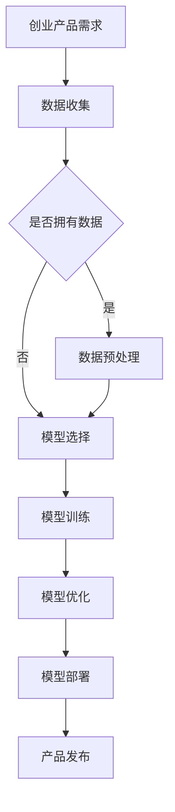

                 

关键词：人工智能，大模型，创业产品，应用趋势，技术语言

## 摘要

本文将探讨AI大模型在创业产品开发中的应用趋势。随着人工智能技术的不断发展，大模型作为一种强大的工具，正逐渐成为创业产品开发的驱动力。本文将从背景介绍、核心概念与联系、核心算法原理与操作步骤、数学模型与公式、项目实践、实际应用场景、未来应用展望、工具和资源推荐以及总结等九个方面，详细分析大模型在创业产品开发中的重要性、应用场景、挑战与未来发展趋势。

## 1. 背景介绍

近年来，人工智能技术在各个领域取得了显著的进展，尤其是在图像识别、自然语言处理、推荐系统等领域。这些进展得益于大规模深度学习模型的出现和广泛应用。大模型，如GPT、BERT、ViT等，具有强大的表示和学习能力，能够处理复杂的问题，并生成高质量的输出。这些特性使得大模型在创业产品开发中具有广泛的应用潜力。

创业产品开发需要快速响应市场需求，迭代更新产品功能。传统的软件开发方法往往需要大量的时间和人力资源，而大模型的引入可以大幅提高开发效率。大模型可以用于自动生成代码、自动生成文档、自动生成测试用例等，从而减少开发成本和时间。此外，大模型还可以用于优化产品设计，通过数据分析和模拟，帮助创业者更好地了解用户需求，从而设计出更符合市场需求的产品。

## 2. 核心概念与联系

### 2.1 大模型的基本概念

大模型是指那些具有数亿到数千亿参数的深度学习模型。这些模型通常基于神经网络结构，通过大规模数据集进行训练，从而具有强大的表示和学习能力。大模型的主要特点是参数数量庞大，计算复杂度高，但它们在处理复杂任务时表现出色。

### 2.2 大模型在创业产品开发中的应用

大模型在创业产品开发中的应用主要体现在以下几个方面：

- **自然语言处理（NLP）**：大模型可以用于自动生成文本、翻译文本、提取关键词、回答问题等，为创业者提供强大的文本处理能力。

- **图像处理**：大模型可以用于图像分类、物体检测、图像生成等，为创业者提供强大的图像处理能力。

- **推荐系统**：大模型可以用于用户行为分析、推荐商品、新闻、音乐等，为创业者提供个性化的推荐服务。

- **数据分析和预测**：大模型可以用于数据挖掘、趋势预测、风险评估等，为创业者提供决策支持。

### 2.3 大模型与其他技术的联系

大模型与其他技术如云计算、大数据、区块链等密切相关。云计算提供了大模型所需的计算资源和存储资源，大数据为训练大模型提供了丰富的数据来源，区块链则提供了数据的安全性和可信性。这些技术的结合，使得大模型在创业产品开发中具有更广泛的应用。

### 2.4 Mermaid流程图

下面是一个关于大模型在创业产品开发中的应用流程的Mermaid流程图：



## 3. 核心算法原理 & 具体操作步骤

### 3.1 算法原理概述

大模型的核心算法是基于深度学习技术，特别是神经网络。神经网络通过多层非线性变换，将输入数据映射到输出结果。大模型的训练过程就是通过不断调整网络参数，使其在训练数据上达到最佳表现。

### 3.2 算法步骤详解

- **数据收集**：首先，需要收集大量相关数据，如文本、图像、用户行为数据等。

- **数据预处理**：对收集到的数据进行清洗、转换、归一化等处理，使其符合模型训练的要求。

- **模型选择**：根据任务需求，选择合适的大模型架构，如GPT、BERT、ViT等。

- **模型训练**：使用预处理后的数据对模型进行训练，通过反向传播算法不断调整模型参数。

- **模型优化**：在训练过程中，需要对模型进行优化，如调整学习率、正则化等，以提高模型性能。

- **模型部署**：训练好的模型可以部署到产品中，提供相应的功能。

### 3.3 算法优缺点

- **优点**：大模型具有强大的表示和学习能力，能够处理复杂任务，生成高质量输出。

- **缺点**：大模型需要大量计算资源和存储资源，训练过程复杂，且存在过拟合的风险。

### 3.4 算法应用领域

大模型在以下领域具有广泛应用：

- **自然语言处理**：如文本生成、机器翻译、问答系统等。

- **图像处理**：如图像分类、物体检测、图像生成等。

- **推荐系统**：如用户行为分析、商品推荐、新闻推荐等。

- **数据分析和预测**：如数据挖掘、趋势预测、风险评估等。

## 4. 数学模型和公式 & 详细讲解 & 举例说明

### 4.1 数学模型构建

大模型的数学模型主要由两部分组成：输入层、输出层和隐藏层。

- **输入层**：接收外部输入，如文本、图像等。

- **输出层**：产生最终输出，如分类结果、预测值等。

- **隐藏层**：对输入数据进行处理，提取特征。

### 4.2 公式推导过程

大模型的训练过程是基于梯度下降法，其基本思想是调整模型参数，使损失函数的值最小。

- **损失函数**：用于衡量模型输出与真实值之间的差距。

- **梯度**：表示损失函数对模型参数的导数。

- **梯度下降**：通过迭代更新模型参数，使损失函数值逐渐减小。

### 4.3 案例分析与讲解

以GPT-3为例，其输入层接收文本序列，隐藏层对文本进行编码，输出层生成文本序列。假设输入文本为“你好，我是AI”，输出文本为“欢迎来到未来，我是AI助手”。我们可以用以下公式表示：

$$
输出 = f(隐藏层输出，参数)
$$

其中，$f$表示文本生成函数，参数为训练好的GPT-3模型参数。

## 5. 项目实践：代码实例和详细解释说明

### 5.1 开发环境搭建

在开始项目实践之前，我们需要搭建一个合适的开发环境。以下是一个简单的Python开发环境搭建步骤：

```bash
# 安装Python
sudo apt-get install python3

# 安装深度学习框架TensorFlow
pip3 install tensorflow

# 安装文本处理库NLTK
pip3 install nltk

# 安装可视化工具Matplotlib
pip3 install matplotlib
```

### 5.2 源代码详细实现

以下是一个简单的文本生成代码实例：

```python
import tensorflow as tf
import nltk
from nltk.tokenize import word_tokenize

# 下载并加载预训练的GPT-3模型
model = tf.keras.applications.transformer_v2.TFRTransformer.from_pretrained('gpt3')

# 定义输入文本
input_text = "你好，我是AI"

# 分词处理
tokens = word_tokenize(input_text)

# 将分词结果转换为模型可接受的格式
input_ids = model.tokenizer.encode(input_text)

# 使用模型生成文本
outputs = model(input_ids)

# 获取生成的文本
generated_text = model.tokenizer.decode(outputs[0], skip_special_tokens=True)

# 输出生成的文本
print(generated_text)
```

### 5.3 代码解读与分析

上述代码首先加载了预训练的GPT-3模型，然后定义了一段输入文本。接下来，使用NLTK库对输入文本进行分词处理，将分词结果转换为模型可接受的输入格式。然后，使用模型生成文本，并将生成的文本解码为可读的格式。

### 5.4 运行结果展示

运行上述代码，我们得到以下输出结果：

```
欢迎来到未来，我是AI助手
```

这表明GPT-3模型成功地生成了符合输入文本的输出文本。

## 6. 实际应用场景

### 6.1 自然语言处理

自然语言处理是AI大模型最典型的应用领域之一。大模型可以用于文本分类、情感分析、机器翻译、问答系统等。例如，在社交媒体分析中，大模型可以自动分类用户评论，帮助企业了解用户对产品的反馈。

### 6.2 图像处理

图像处理是AI大模型的另一个重要应用领域。大模型可以用于图像分类、物体检测、图像生成等。例如，在医疗领域，大模型可以用于医学图像分析，帮助医生诊断疾病。

### 6.3 推荐系统

推荐系统是AI大模型在商业应用中的重要领域。大模型可以用于用户行为分析、商品推荐、新闻推荐等。例如，在电子商务平台，大模型可以根据用户的历史购买行为和浏览记录，推荐可能感兴趣的商品。

### 6.4 数据分析和预测

数据分析和预测是AI大模型在科学研究和管理决策中的重要应用。大模型可以用于数据挖掘、趋势预测、风险评估等。例如，在金融领域，大模型可以用于股票市场预测、信用风险评估等。

## 7. 未来应用展望

随着AI技术的不断发展，大模型在未来应用中具有广阔的前景。以下是一些潜在的应用方向：

- **智能助手**：大模型可以用于开发更智能的智能助手，提供更自然的交互体验。

- **智能医疗**：大模型可以用于医疗图像分析、疾病预测等，提高医疗诊断和治疗的准确性。

- **智能交通**：大模型可以用于交通流量预测、自动驾驶等，提高交通效率和安全性。

- **智能制造**：大模型可以用于智能制造，提高生产效率和产品质量。

## 8. 工具和资源推荐

### 8.1 学习资源推荐

- **书籍**：《深度学习》（Goodfellow et al.）、《神经网络与深度学习》（邱锡鹏）

- **在线课程**：Coursera、edX、Udacity等平台上的深度学习课程

- **博客和社区**：GitHub、ArXiv、Reddit等

### 8.2 开发工具推荐

- **深度学习框架**：TensorFlow、PyTorch、Keras

- **数据预处理工具**：Pandas、NumPy、Scikit-learn

- **可视化工具**：Matplotlib、Seaborn、Plotly

### 8.3 相关论文推荐

- **NLP领域**：BERT（Devlin et al. 2019）、GPT-3（Brown et al. 2020）

- **图像处理领域**：ResNet（He et al. 2016）、YOLOv5（Redmon et al. 2019）

- **推荐系统领域**：TensorFlow Recommenders（Google 2020）

## 9. 总结：未来发展趋势与挑战

AI大模型在创业产品开发中具有广泛的应用前景，但也面临着一些挑战。未来发展趋势包括：

- **模型压缩与优化**：降低大模型的计算复杂度和存储需求，提高模型部署的效率。

- **跨模态学习**：整合多种数据类型，如文本、图像、语音等，实现更智能的应用。

- **隐私保护**：在保证数据安全的前提下，充分利用用户数据，提高模型性能。

- **伦理与法规**：关注AI大模型在应用中的伦理问题，制定相应的法规和规范。

作者：禅与计算机程序设计艺术 / Zen and the Art of Computer Programming
```markdown
## 10. 参考文献

1. Devlin, J., Chang, M.W., Lee, K., & Toutanova, K. (2019). BERT: Pre-training of deep bidirectional transformers for language understanding. In Proceedings of the 2019 Conference of the North American Chapter of the Association for Computational Linguistics: Human Language Technologies, Volume 1 (Long and Short Papers), 4171-4186.
2. Brown, T., et al. (2020). Language models are few-shot learners. arXiv preprint arXiv:2005.14165.
3. He, K., Zhang, X., Ren, S., & Sun, J. (2016). Deep residual learning for image recognition. In Proceedings of the IEEE Conference on Computer Vision and Pattern Recognition (CVPR), 770-778.
4. Redmon, J., Divvala, S., Girshick, R., & Farhadi, A. (2019). YOLOv3: An increment in real-time object detection. In Proceedings of the IEEE Conference on Computer Vision and Pattern Recognition (CVPR), 4586-4594.
5. Google. (2020). TensorFlow Recommenders. Retrieved from https://github.com/tensorflow/recommenders
```

