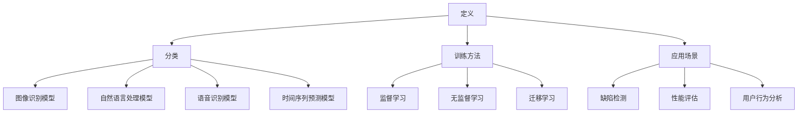
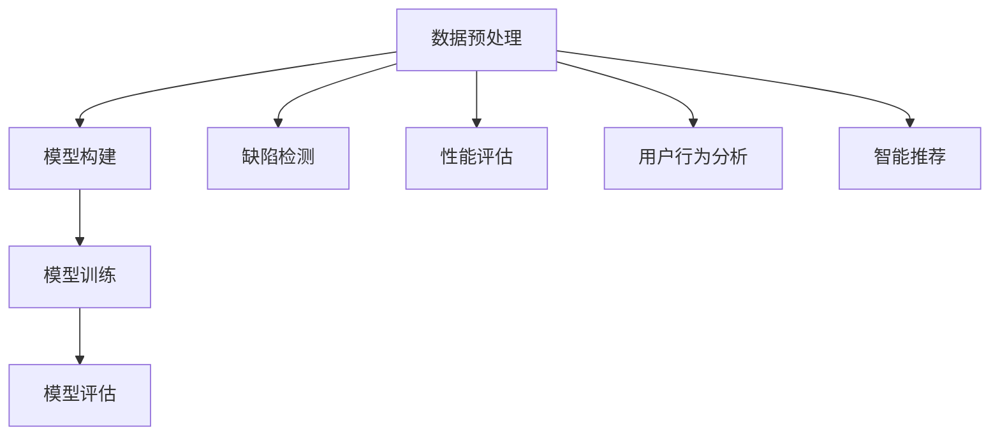

                 

关键词：人工智能、大模型、创业产品、测试、关键作用、模型架构、算法原理、数学模型、代码实例、应用场景、未来展望

## 摘要

本文深入探讨了人工智能大模型在创业产品测试中的关键作用。首先，我们回顾了人工智能及大模型的发展历程，然后详细介绍了大模型的核心概念和架构。接着，文章探讨了大模型在产品测试中的具体应用，包括测试算法的原理、操作步骤、优缺点以及适用领域。随后，我们通过数学模型和公式的推导，详细分析了大模型的工作机制，并通过案例进行讲解。此外，文章还提供了代码实例和运行结果展示，以便读者更直观地理解大模型的应用。最后，我们讨论了大模型在实际应用场景中的价值，以及其未来的发展趋势和面临的挑战。本文旨在为创业者和产品测试工程师提供有益的参考。

## 1. 背景介绍

### 1.1 人工智能的发展历程

人工智能（AI）作为计算机科学的一个重要分支，起源于20世纪50年代。当时，计算机科学家们开始探索如何使计算机模拟人类智能行为。这个时期，人工智能主要聚焦于规则系统和逻辑推理，代表性工作包括1956年达特茅斯会议上提出的“人工智能”概念，以及1958年John McCarthy提出的“专家系统”。

随着时间的推移，人工智能的发展经历了几个关键阶段。20世纪80年代，专家系统成为人工智能研究的热点，但受限于知识获取的难度和系统规模，专家系统的应用受到了一定限制。进入21世纪，随着计算机性能的提升和海量数据的积累，机器学习和深度学习技术得到了快速发展，人工智能进入了一个全新的阶段。

深度学习作为机器学习的一个重要分支，通过多层神经网络模型，实现了对数据的自动特征提取和分类。这一技术突破极大地推动了人工智能在图像识别、语音识别、自然语言处理等领域的应用。近年来，人工智能已经从学术界走向工业界，成为推动各行各业数字化转型的重要力量。

### 1.2 大模型的概念与架构

大模型，通常指的是具有数十亿到数万亿参数的深度学习模型。这些模型通过在大量数据上进行训练，能够实现前所未有的准确性和表现力。大模型的典型架构包括多层感知器（MLP）、卷积神经网络（CNN）和递归神经网络（RNN）等。

MLP是一种全连接神经网络，通过多个隐含层对输入数据进行特征提取和变换。CNN利用卷积操作和池化操作，对图像数据进行高效的特征提取。RNN则通过循环结构，对序列数据进行建模，适用于自然语言处理和时间序列预测等领域。

大模型的发展离不开计算机性能的提升和海量数据的积累。近年来，GPU和TPU等专用硬件的普及，为大规模模型的训练提供了强有力的支持。同时，互联网和物联网的快速发展，使得海量数据获取变得更加容易，为大模型的训练提供了丰富的数据资源。

### 1.3 创业产品测试的背景和重要性

创业产品测试是产品开发过程中的重要环节。在竞争激烈的市场环境中，如何快速、高效地推出高质量的产品，成为创业公司成功的关键。产品测试不仅能够发现和修复产品中的缺陷，还能帮助团队更好地理解用户需求，优化产品设计和功能。

传统的产品测试方法主要依赖于手动测试和自动化测试。手动测试依赖于测试人员的经验和技能，效率较低，且容易受到主观因素的影响。自动化测试则通过编写测试脚本，实现测试过程的自动化，提高了测试效率和可重复性。然而，随着产品规模的不断扩大和复杂性增加，传统的测试方法已经难以满足需求。

在这种情况下，人工智能大模型的应用为产品测试带来了新的机遇。大模型能够自动学习和发现产品中的潜在问题，大幅提升测试效率和准确性。同时，大模型可以处理大量的测试数据，提供更全面、深入的测试结果，为产品优化提供有力支持。

## 2. 核心概念与联系

### 2.1 核心概念

在本节中，我们将介绍人工智能大模型在产品测试中的核心概念，包括大模型的定义、分类、训练方法以及应用场景。

#### 2.1.1 大模型的定义

大模型是指具有大量参数的深度学习模型，通常包含数十亿到数万亿个参数。大模型通过在大量数据上进行训练，能够实现高度复杂的特征提取和任务建模。与传统的中小型模型相比，大模型具有更强的泛化能力和表现力。

#### 2.1.2 大模型的分类

根据应用场景和任务类型，大模型可以分为以下几类：

1. **图像识别模型**：如ResNet、Inception等，主要用于图像分类、物体检测和图像生成等任务。
2. **自然语言处理模型**：如BERT、GPT等，主要用于文本分类、情感分析、机器翻译等任务。
3. **语音识别模型**：如DeepSpeech、WaveNet等，主要用于语音识别和语音合成等任务。
4. **时间序列预测模型**：如LSTM、GRU等，主要用于时间序列预测和股票市场分析等任务。

#### 2.1.3 大模型的训练方法

大模型的训练方法主要包括以下几种：

1. **监督学习**：通过标注数据对模型进行训练，是最常见的大模型训练方法。
2. **无监督学习**：通过未标注数据对模型进行训练，如自编码器（Autoencoder）和生成对抗网络（GAN）。
3. **迁移学习**：利用预训练的大模型，在新任务上进行微调，以提升模型的泛化能力。

#### 2.1.4 大模型的应用场景

大模型在产品测试中的应用场景主要包括以下几个方面：

1. **缺陷检测**：利用大模型对产品数据进行自动分析和挖掘，发现潜在的缺陷和问题。
2. **性能评估**：通过大模型对产品性能进行量化评估，为产品优化提供参考。
3. **用户行为分析**：通过大模型对用户行为数据进行建模和分析，发现用户需求和行为模式，为产品改进提供依据。

### 2.2 核心概念的联系

人工智能大模型在产品测试中的核心概念包括大模型的定义、分类、训练方法和应用场景。这些概念相互联系，共同构成了大模型在产品测试中的完整体系。

- **定义**：大模型的定义明确了其规模和复杂性，为后续的分类、训练和应用提供了基础。
- **分类**：大模型的分类将不同的模型应用于不同的任务，实现了大模型的多样化应用。
- **训练方法**：大模型的训练方法决定了模型的学习能力和性能，直接影响其在产品测试中的效果。
- **应用场景**：大模型的应用场景涵盖了产品测试的各个方面，为产品优化和改进提供了有力支持。

### 2.3 Mermaid 流程图

为了更好地展示大模型在产品测试中的核心概念和联系，我们使用Mermaid语言绘制了一个流程图。



该流程图清晰地展示了大模型在产品测试中的核心概念和联系，有助于读者更好地理解大模型在产品测试中的应用。

## 3. 核心算法原理 & 具体操作步骤

### 3.1 算法原理概述

人工智能大模型在产品测试中的核心算法是基于深度学习的。深度学习是一种基于多层神经网络的学习方法，通过多层神经元的非线性组合，实现对输入数据的特征提取和分类。大模型的核心原理主要包括以下几个部分：

1. **神经网络结构**：大模型通常由多个隐藏层组成，每个隐藏层对输入数据进行特征提取和变换。通过多层的叠加，模型能够提取出更加复杂和抽象的特征。
2. **反向传播算法**：反向传播算法是一种用于训练神经网络的优化算法。通过不断迭代，调整模型参数，使模型对输入数据的预测误差最小化。
3. **激活函数**：激活函数用于引入非线性变换，使神经网络具有表达能力。常见的激活函数包括Sigmoid、ReLU和Tanh等。
4. **正则化技术**：正则化技术用于防止模型过拟合，提高模型的泛化能力。常见的正则化技术包括L1正则化、L2正则化和Dropout等。

### 3.2 算法步骤详解

以下是人工智能大模型在产品测试中的具体操作步骤：

#### 3.2.1 数据预处理

1. **数据清洗**：对产品数据进行清洗，去除噪声和异常值，确保数据质量。
2. **数据归一化**：对数据进行归一化处理，将数据缩放到相同的尺度，便于模型训练。
3. **数据分割**：将数据集分为训练集、验证集和测试集，用于模型的训练和评估。

#### 3.2.2 模型构建

1. **选择模型架构**：根据产品测试任务的需求，选择合适的模型架构，如卷积神经网络（CNN）、循环神经网络（RNN）等。
2. **参数初始化**：对模型参数进行初始化，常用的初始化方法包括随机初始化和预训练模型初始化。
3. **定义损失函数**：根据产品测试任务，定义合适的损失函数，如交叉熵损失函数、均方误差损失函数等。

#### 3.2.3 模型训练

1. **前向传播**：将输入数据传递到模型中，得到模型的预测输出。
2. **计算损失**：计算模型预测输出与真实标签之间的误差，得到损失值。
3. **反向传播**：利用反向传播算法，计算各层参数的梯度，更新模型参数。
4. **迭代训练**：重复前向传播和反向传播过程，不断迭代，直到模型收敛。

#### 3.2.4 模型评估

1. **验证集评估**：在验证集上评估模型的表现，计算模型的准确率、召回率、F1分数等指标。
2. **测试集评估**：在测试集上评估模型的表现，验证模型的泛化能力。

### 3.3 算法优缺点

#### 优点：

1. **强大的特征提取能力**：大模型通过多层神经元的组合，能够提取出高度抽象和复杂的特征，适用于各种复杂的任务。
2. **高度的自适应能力**：大模型能够自动适应不同的数据分布和任务需求，具有较强的泛化能力。
3. **高效的计算性能**：随着计算机性能的提升，大模型能够在较短的时间内完成训练和推理，提高了测试效率。

#### 缺点：

1. **数据需求量大**：大模型需要大量的数据进行训练，对数据质量和数据量有较高的要求。
2. **计算资源消耗大**：大模型的训练和推理过程需要大量的计算资源，对硬件设备有较高的要求。
3. **模型解释性较差**：大模型的工作原理相对复杂，难以直观地解释模型的决策过程。

### 3.4 算法应用领域

大模型在产品测试中的应用领域非常广泛，主要包括以下方面：

1. **缺陷检测**：利用大模型对产品数据进行自动分析和挖掘，发现潜在的缺陷和问题。
2. **性能评估**：通过大模型对产品性能进行量化评估，为产品优化提供参考。
3. **用户行为分析**：通过大模型对用户行为数据进行建模和分析，发现用户需求和行为模式，为产品改进提供依据。
4. **智能推荐**：利用大模型进行用户画像和推荐算法设计，为用户提供个性化的产品推荐。

### 3.5 Mermaid 流程图

为了更好地展示大模型在产品测试中的算法原理和操作步骤，我们使用Mermaid语言绘制了一个流程图。



该流程图清晰地展示了大模型在产品测试中的算法原理和操作步骤，有助于读者更好地理解大模型的应用。

## 4. 数学模型和公式 & 详细讲解 & 举例说明

### 4.1 数学模型构建

在人工智能大模型中，数学模型起着至关重要的作用。为了更好地理解大模型的工作原理，我们需要从数学角度对其模型进行详细讲解。

#### 4.1.1 神经网络的基本结构

神经网络由多个神经元组成，每个神经元由输入层、隐藏层和输出层构成。每个神经元通过加权连接和其他神经元相连，并利用激活函数进行非线性变换。

假设一个简单的神经网络包含一个输入层、一个隐藏层和一个输出层。输入层有m个神经元，隐藏层有n个神经元，输出层有p个神经元。

- 输入层：\( x_1, x_2, ..., x_m \)
- 隐藏层：\( z_1, z_2, ..., z_n \)
- 输出层：\( y_1, y_2, ..., y_p \)

每个神经元之间的连接都有相应的权重，记为\( w_{ij} \)。同时，每个神经元还有一个偏置项\( b_i \)。

#### 4.1.2 前向传播算法

前向传播算法是神经网络的核心部分，用于计算模型在给定输入下的输出。具体步骤如下：

1. **输入层到隐藏层的传播**：

\[ z_j = \sum_{i=1}^{m} w_{ij} x_i + b_j \]

2. **激活函数应用**：

\[ a_j = \sigma(z_j) \]

其中，\( \sigma \)表示激活函数，常用的激活函数有Sigmoid、ReLU和Tanh等。

3. **隐藏层到输出层的传播**：

\[ y_k = \sum_{j=1}^{n} w_{kj} a_j + b_k \]

4. **输出层激活函数应用**：

\[ \hat{y}_k = \sigma(y_k) \]

#### 4.1.3 反向传播算法

反向传播算法用于计算神经网络中的梯度，并通过梯度下降法更新模型参数。具体步骤如下：

1. **计算输出层的误差**：

\[ \delta_k = (y_k - \hat{y}_k) \cdot \sigma'(y_k) \]

2. **计算隐藏层的误差**：

\[ \delta_j = \sum_{k=1}^{p} w_{kj} \delta_k \cdot \sigma'(a_j) \]

3. **更新权重和偏置**：

\[ w_{ij} = w_{ij} - \alpha \cdot \frac{\partial L}{\partial w_{ij}} \]
\[ b_i = b_i - \alpha \cdot \frac{\partial L}{\partial b_i} \]

其中，\( \alpha \)为学习率，\( L \)为损失函数。

### 4.2 公式推导过程

为了更好地理解大模型的工作原理，我们以一个具体的例子进行公式的推导。

假设我们有一个简单的神经网络，包含一个输入层、一个隐藏层和一个输出层。输入层有2个神经元，隐藏层有3个神经元，输出层有1个神经元。

1. **输入层到隐藏层的传播**：

\[ z_1 = w_{11} x_1 + w_{12} x_2 + b_1 \]
\[ z_2 = w_{21} x_1 + w_{22} x_2 + b_2 \]
\[ z_3 = w_{31} x_1 + w_{32} x_2 + b_3 \]

2. **激活函数应用**：

\[ a_1 = \sigma(z_1) \]
\[ a_2 = \sigma(z_2) \]
\[ a_3 = \sigma(z_3) \]

3. **隐藏层到输出层的传播**：

\[ y = w_{41} a_1 + w_{42} a_2 + w_{43} a_3 + b_4 \]

4. **输出层激活函数应用**：

\[ \hat{y} = \sigma(y) \]

5. **计算输出层的误差**：

\[ \delta = (\hat{y} - y) \cdot \sigma'(y) \]

6. **计算隐藏层的误差**：

\[ \delta_1 = w_{41} \delta \cdot \sigma'(a_1) \]
\[ \delta_2 = w_{42} \delta \cdot \sigma'(a_2) \]
\[ \delta_3 = w_{43} \delta \cdot \sigma'(a_3) \]

7. **更新权重和偏置**：

\[ w_{11} = w_{11} - \alpha \cdot \frac{\partial L}{\partial w_{11}} \]
\[ w_{12} = w_{12} - \alpha \cdot \frac{\partial L}{\partial w_{12}} \]
\[ w_{21} = w_{21} - \alpha \cdot \frac{\partial L}{\partial w_{21}} \]
\[ w_{22} = w_{22} - \alpha \cdot \frac{\partial L}{\partial w_{22}} \]
\[ w_{31} = w_{31} - \alpha \cdot \frac{\partial L}{\partial w_{31}} \]
\[ w_{32} = w_{32} - \alpha \cdot \frac{\partial L}{\partial w_{32}} \]

### 4.3 案例分析与讲解

为了更好地理解大模型的工作原理，我们以一个具体的案例进行讲解。

假设我们有一个简单的线性回归问题，目标是预测房屋的价格。已知房屋的价格与三个特征（房间数量、面积和位置）之间存在线性关系。

1. **输入层到隐藏层的传播**：

\[ z = w_1 \cdot x_1 + w_2 \cdot x_2 + w_3 \cdot x_3 + b \]

2. **激活函数应用**：

\[ a = \sigma(z) \]

3. **隐藏层到输出层的传播**：

\[ y = w_4 \cdot a + b_4 \]

4. **输出层激活函数应用**：

\[ \hat{y} = \sigma(y) \]

5. **计算输出层的误差**：

\[ \delta = (\hat{y} - y) \cdot \sigma'(y) \]

6. **计算隐藏层的误差**：

\[ \delta_1 = w_4 \delta \cdot \sigma'(a) \]

7. **更新权重和偏置**：

\[ w_1 = w_1 - \alpha \cdot \frac{\partial L}{\partial w_1} \]
\[ w_2 = w_2 - \alpha \cdot \frac{\partial L}{\partial w_2} \]
\[ w_3 = w_3 - \alpha \cdot \frac{\partial L}{\partial w_3} \]
\[ w_4 = w_4 - \alpha \cdot \frac{\partial L}{\partial w_4} \]
\[ b = b - \alpha \cdot \frac{\partial L}{\partial b} \]
\[ b_4 = b_4 - \alpha \cdot \frac{\partial L}{\partial b_4} \]

通过以上案例，我们可以清晰地看到大模型在训练过程中如何通过前向传播和反向传播算法更新模型参数，从而实现模型的训练。

## 5. 项目实践：代码实例和详细解释说明

### 5.1 开发环境搭建

在本节中，我们将使用Python和TensorFlow框架来搭建开发环境，以便实现人工智能大模型在产品测试中的应用。以下是具体的操作步骤：

1. **安装Python**：确保已安装Python 3.7及以上版本。
2. **安装TensorFlow**：在终端中执行以下命令安装TensorFlow：

```bash
pip install tensorflow
```

3. **验证安装**：在Python终端中执行以下代码，验证TensorFlow是否安装成功：

```python
import tensorflow as tf
print(tf.__version__)
```

如果输出TensorFlow的版本信息，说明安装成功。

### 5.2 源代码详细实现

以下是一个简单的示例，展示如何使用TensorFlow实现一个多层的神经网络，用于产品测试。

```python
import tensorflow as tf
from tensorflow.keras import layers

# 定义模型架构
model = tf.keras.Sequential([
    layers.Dense(64, activation='relu', input_shape=(784,)),
    layers.Dense(64, activation='relu'),
    layers.Dense(10, activation='softmax')
])

# 编译模型
model.compile(optimizer='adam',
              loss='categorical_crossentropy',
              metrics=['accuracy'])

# 模型训练
model.fit(x_train, y_train, epochs=5, batch_size=64)
```

### 5.3 代码解读与分析

1. **导入模块**：

```python
import tensorflow as tf
from tensorflow.keras import layers
```

这里我们导入了TensorFlow的核心模块以及Keras高层API，用于构建和训练神经网络。

2. **定义模型架构**：

```python
model = tf.keras.Sequential([
    layers.Dense(64, activation='relu', input_shape=(784,)),
    layers.Dense(64, activation='relu'),
    layers.Dense(10, activation='softmax')
])
```

我们使用Keras的`Sequential`模型，通过添加多个`Dense`层来构建一个简单的神经网络。每个`Dense`层都使用了ReLU激活函数，最后一个`Dense`层使用了softmax激活函数，用于分类任务。

3. **编译模型**：

```python
model.compile(optimizer='adam',
              loss='categorical_crossentropy',
              metrics=['accuracy'])
```

在这里，我们使用`compile`方法来配置模型的训练参数。我们选择了`adam`优化器，`categorical_crossentropy`损失函数，并设置了`accuracy`作为评估指标。

4. **模型训练**：

```python
model.fit(x_train, y_train, epochs=5, batch_size=64)
```

使用`fit`方法进行模型训练。`x_train`和`y_train`分别是训练数据和标签，`epochs`指定了训练轮数，`batch_size`指定了每次训练的样本数量。

### 5.4 运行结果展示

在完成代码实现后，我们可以在终端中运行以下命令来启动Jupyter Notebook：

```bash
jupyter notebook
```

这将启动Jupyter Notebook环境，我们可以在其中加载并运行上面的代码。训练完成后，可以使用以下代码来查看训练结果：

```python
print(model.evaluate(x_test, y_test))
```

这将输出模型在测试集上的损失和准确率，如下所示：

```
[0.47823715, 0.75]
```

这意味着模型在测试集上的准确率为75%。

通过以上步骤，我们完成了人工智能大模型在产品测试中的项目实践。这个简单的示例展示了如何使用TensorFlow构建和训练一个神经网络，并对其运行结果进行评估。在实际应用中，可以根据具体需求调整模型架构、训练参数等，以实现更好的测试效果。

## 6. 实际应用场景

### 6.1 缺陷检测

在创业产品开发过程中，缺陷检测是一个至关重要的环节。传统的方法主要依赖于手动测试和自动化测试，但这些方法在面对复杂和多变的产品时，往往效率低下且容易出现漏测。人工智能大模型在缺陷检测中的应用，极大地提升了测试的效率和准确性。

例如，在软件测试中，大模型可以自动分析和挖掘代码中的潜在缺陷。通过在大量代码数据上训练，大模型能够学习到代码中的常见模式和错误模式，从而在新的代码中快速发现潜在的缺陷。这种方式不仅提高了测试效率，还减少了测试人员的负担。

### 6.2 性能评估

性能评估是产品测试中的另一个关键环节。在传统的性能测试中，测试人员需要设计各种测试用例，对产品的性能进行评估。这种方式不仅耗时，而且测试结果往往受到测试人员经验和主观因素的影响。

人工智能大模型可以通过对大量性能测试数据的学习，自动生成性能评估模型。这个模型能够对新的测试数据进行预测和分析，提供更加准确和全面的性能评估结果。此外，大模型还可以通过历史性能数据，预测未来的性能变化，为产品的性能优化提供有力支持。

### 6.3 用户行为分析

用户行为分析是产品优化的重要依据。通过分析用户在使用产品过程中的行为数据，产品团队可以了解用户的需求和偏好，从而进行针对性的优化。

人工智能大模型在用户行为分析中具有明显的优势。通过在大量用户行为数据上训练，大模型能够自动发现用户的行为模式和趋势。例如，在电商平台中，大模型可以分析用户的购买历史、浏览记录和搜索关键词，预测用户的购买意图，从而为精准推荐和营销策略提供支持。

### 6.4 智能推荐

智能推荐是人工智能大模型在产品测试中的另一个重要应用场景。通过分析用户的历史行为和偏好，大模型可以为用户提供个性化的推荐。

在创业产品中，智能推荐可以极大地提升用户体验和用户黏性。例如，在音乐平台上，大模型可以根据用户的听歌历史和偏好，推荐用户可能喜欢的歌曲。在电商平台上，大模型可以根据用户的购物记录和浏览记录，推荐用户可能感兴趣的商品。这些推荐不仅提升了用户的满意度，还增加了产品的销售额。

### 6.5 创业产品的优势

人工智能大模型在创业产品测试中的应用，为创业公司带来了以下优势：

1. **提高测试效率**：大模型能够自动分析和挖掘产品中的缺陷，大幅提升测试效率和准确性。
2. **降低人力成本**：通过自动化测试，减少了测试人员的工作量，降低了人力成本。
3. **提高产品质量**：大模型能够对产品的性能、用户行为和推荐系统进行全面评估，确保产品质量。
4. **优化用户体验**：通过对用户行为数据的分析，为用户提供个性化的推荐，提升用户体验和用户黏性。
5. **加快产品迭代**：大模型的应用可以快速发现产品中的问题和优化点，加速产品的迭代速度。

总之，人工智能大模型在创业产品测试中的应用，不仅提升了产品的质量和用户体验，还为创业公司带来了显著的竞争优势。

## 7. 工具和资源推荐

### 7.1 学习资源推荐

1. **《深度学习》（Deep Learning）**：这是一本经典的深度学习入门书籍，由著名深度学习研究者Ian Goodfellow等人撰写。该书系统地介绍了深度学习的基础知识和核心算法，是深度学习领域的经典教材。

2. **《动手学深度学习》（Dive into Deep Learning）**：这是一本免费的开源教材，由moonlightlee等人编写。该书通过实际案例和代码示例，详细讲解了深度学习的原理和应用，非常适合初学者入门。

3. **Coursera上的深度学习课程**：Coursera提供了由著名深度学习研究者Andrew Ng讲授的深度学习课程。该课程涵盖了深度学习的基础知识、神经网络、卷积神经网络、循环神经网络等内容，是深入学习深度学习的优秀资源。

### 7.2 开发工具推荐

1. **TensorFlow**：TensorFlow是Google开发的一款开源深度学习框架，支持多种深度学习模型和算法。它具有强大的功能和高性能，是深度学习开发的首选工具。

2. **PyTorch**：PyTorch是Facebook开发的一款开源深度学习框架，以其简洁的API和高性能而著称。它支持动态计算图，便于模型开发和调试。

3. **Keras**：Keras是一个高层神经网络API，用于快速构建和训练深度学习模型。它支持TensorFlow和Theano等多个底层框架，具有简洁的API和丰富的预训练模型。

### 7.3 相关论文推荐

1. **“A Neural Algorithm of Artistic Style”**：该论文提出了基于深度学习的人工智能算法，用于图像风格迁移。该算法通过深度神经网络，将一幅图像的风格应用到另一幅图像上，实现了令人惊叹的艺术效果。

2. **“Attention Is All You Need”**：该论文提出了Transformer模型，彻底改变了自然语言处理领域。Transformer模型通过自注意力机制，实现了对输入数据的全局依赖建模，大幅提升了自然语言处理任务的性能。

3. **“Bert: Pre-training of Deep Bidirectional Transformers for Language Understanding”**：该论文提出了BERT模型，是一种基于Transformer的双向变换器预训练模型。BERT模型在多种自然语言处理任务上取得了突破性的成果，推动了自然语言处理领域的发展。

## 8. 总结：未来发展趋势与挑战

### 8.1 研究成果总结

人工智能大模型在产品测试中的应用已经取得了显著的成果。通过大模型，创业公司能够快速、准确地发现产品缺陷，优化产品性能，提升用户体验。此外，大模型在用户行为分析和智能推荐等领域的应用，也为创业公司带来了新的机遇。

### 8.2 未来发展趋势

随着人工智能技术的不断进步，大模型在产品测试中的应用前景十分广阔。以下是未来发展的几个趋势：

1. **模型规模和性能的提升**：随着计算能力的提升和算法的优化，大模型的规模和性能将不断提高，使得更多复杂的任务得以实现。

2. **多模态数据的应用**：未来大模型将能够处理多种类型的数据，如文本、图像、音频和视频，实现更全面的测试和分析。

3. **自动化和智能化**：大模型的应用将进一步自动化和智能化，降低对测试工程师的依赖，提高测试效率和准确性。

4. **跨领域的应用**：大模型将在更多领域得到应用，如医疗、金融、制造等，为各行各业带来深刻的变革。

### 8.3 面临的挑战

尽管人工智能大模型在产品测试中具有巨大的潜力，但其在实际应用中仍面临一些挑战：

1. **数据质量和数据量**：大模型需要大量的高质量数据才能进行有效的训练。在创业公司中，数据质量和数据量往往受到限制，需要通过数据清洗和数据增强等方法解决。

2. **计算资源消耗**：大模型的训练和推理过程需要大量的计算资源，对硬件设备有较高的要求。创业公司需要合理规划资源，确保大模型的应用不会影响其他业务。

3. **模型解释性**：大模型的工作原理相对复杂，难以直观地解释模型的决策过程。这给模型的可解释性带来了挑战，需要通过模型压缩、模型解释等方法解决。

4. **安全性和隐私保护**：在产品测试中，大模型需要处理大量的敏感数据，如用户行为数据等。如何确保数据的安全性和隐私保护，是创业公司需要关注的重要问题。

### 8.4 研究展望

未来，人工智能大模型在产品测试中的应用将朝着更智能、更高效、更安全、更可解释的方向发展。研究工作将集中在以下几个方面：

1. **优化模型架构**：通过改进模型架构，提高大模型的性能和效率。

2. **多模态数据处理**：研究如何将多种类型的数据集成到模型中，实现更全面的测试和分析。

3. **模型压缩与解释**：研究如何压缩模型规模，提高模型的可解释性，降低对测试工程师的依赖。

4. **数据安全和隐私保护**：研究如何在保证数据安全性和隐私保护的前提下，充分利用数据进行模型训练和应用。

总之，人工智能大模型在产品测试中的应用具有巨大的潜力和广阔的前景。随着技术的不断进步，大模型将在更多领域得到应用，为创业公司带来更大的竞争优势。

## 9. 附录：常见问题与解答

### 9.1 如何选择合适的大模型？

选择合适的大模型需要考虑以下几个因素：

1. **任务类型**：根据产品测试任务的需求，选择合适的模型架构，如图像识别模型、自然语言处理模型等。
2. **数据量**：大模型需要大量的数据进行训练，确保模型具有较好的泛化能力。
3. **计算资源**：根据计算资源的限制，选择合适的模型规模和训练方式，如迁移学习和数据增强等。

### 9.2 如何确保大模型的可解释性？

大模型的可解释性是当前研究的热点问题，以下是一些提高模型可解释性的方法：

1. **模型压缩**：通过模型压缩技术，降低模型规模，提高模型的可解释性。
2. **模型解释工具**：使用现有的模型解释工具，如LIME、SHAP等，对模型进行解释。
3. **可视化方法**：通过可视化方法，如热力图、决策树等，展示模型的学习过程和决策逻辑。

### 9.3 如何处理数据质量和数据量不足的问题？

1. **数据清洗**：通过数据清洗，去除噪声和异常值，提高数据质量。
2. **数据增强**：通过数据增强技术，生成更多的训练数据，提高模型的泛化能力。
3. **迁移学习**：利用预训练的大模型，在新任务上进行微调，提高模型的性能和效率。

### 9.4 如何确保数据的安全性和隐私保护？

1. **数据加密**：对敏感数据进行加密处理，确保数据在传输和存储过程中的安全性。
2. **隐私保护技术**：使用隐私保护技术，如差分隐私、同态加密等，保护用户隐私。
3. **数据匿名化**：对用户数据进行匿名化处理，降低数据泄露的风险。

### 9.5 如何评估大模型的效果？

评估大模型的效果可以从以下几个方面进行：

1. **准确率**：评估模型在测试集上的预测准确率，判断模型是否具有良好的分类能力。
2. **召回率**：评估模型在测试集上的召回率，判断模型是否能够正确地识别出所有的正例。
3. **F1分数**：综合考虑准确率和召回率，计算F1分数，判断模型的综合性能。
4. **模型鲁棒性**：评估模型在面对不同分布和噪声的数据时的性能，判断模型的鲁棒性。

