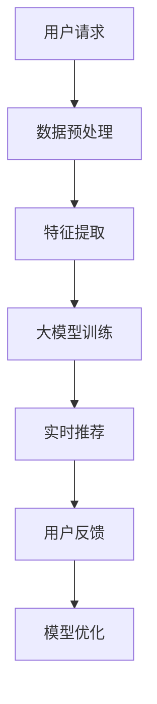

                 

关键词：AI 大模型、电商搜索推荐、实时推荐策略、用户需求、行为偏好

摘要：本文将探讨 AI 大模型在电商搜索推荐中的实时推荐策略。通过分析用户瞬时需求与行为偏好，本文提出了基于 AI 大模型的实时推荐算法，详细描述了其核心算法原理、具体操作步骤、数学模型与公式、项目实践以及实际应用场景，旨在为电商搜索推荐领域提供新的思路和解决方案。

## 1. 背景介绍

随着互联网的迅猛发展和电子商务的普及，用户对个性化推荐的需求越来越高。在电商领域，搜索推荐系统的性能直接影响用户体验和商家收益。传统的推荐算法，如基于协同过滤和内容匹配的方法，虽然在某些方面取得了不错的成绩，但往往难以满足用户日益增长的个性化需求。特别是当用户行为瞬息万变时，传统算法往往难以实时捕捉到用户的需求和偏好。

近年来，AI 大模型在各个领域取得了显著成果，其在处理大规模数据、捕捉复杂模式等方面的优势为实时推荐算法的研究提供了新的契机。本文将结合 AI 大模型的特点，探讨其在电商搜索推荐中的实时推荐策略，以应对用户瞬时需求与行为偏好的变化。

### 1.1 电商搜索推荐背景

电商搜索推荐系统是电子商务平台的重要组成部分，其目标是为用户提供个性化的商品推荐，提升用户体验和购物满意度。随着电商业务的不断发展，用户数量和交易规模急剧增加，传统推荐算法已难以满足实时推荐的需求。实时推荐不仅要求算法能够快速响应用户的搜索请求，还需要根据用户的行为和偏好进行动态调整，以提高推荐效果。

### 1.2 AI 大模型的发展与应用

AI 大模型是指通过深度学习等技术，从海量数据中学习到复杂模式的强大模型。近年来，随着计算能力的提升和数据规模的扩大，AI 大模型在图像识别、自然语言处理、语音识别等领域取得了突破性进展。在电商搜索推荐领域，AI 大模型的应用为实时推荐策略的研究提供了有力支持。

### 1.3 本文结构

本文将分为以下几个部分：

1. 背景介绍：概述电商搜索推荐背景和 AI 大模型的发展与应用。
2. 核心概念与联系：介绍 AI 大模型在电商搜索推荐中的核心概念与联系。
3. 核心算法原理与具体操作步骤：详细描述实时推荐算法的核心原理和操作步骤。
4. 数学模型与公式：构建数学模型并推导相关公式。
5. 项目实践：通过具体代码实例展示算法应用。
6. 实际应用场景：分析实时推荐算法在不同场景下的应用。
7. 工具和资源推荐：推荐相关学习资源、开发工具和论文。
8. 总结：总结研究成果和未来发展趋势。

## 2. 核心概念与联系

在探讨 AI 大模型在电商搜索推荐中的实时推荐策略之前，首先需要了解相关核心概念和其相互联系。

### 2.1 AI 大模型

AI 大模型是指通过深度学习等技术，从海量数据中学习到复杂模式的强大模型。大模型的特点是参数多、计算量大，能够捕捉到数据中的深层次特征。在电商搜索推荐中，AI 大模型可以用于用户行为分析、商品特征提取、推荐策略优化等任务。

### 2.2 实时推荐

实时推荐是指在用户产生请求时，系统可以迅速响应并给出推荐结果。实时推荐的关键在于算法的快速响应和动态调整能力。在电商搜索推荐中，实时推荐能够根据用户的行为和偏好，为用户提供个性化的商品推荐，提升用户体验。

### 2.3 用户需求与行为偏好

用户需求是指用户在特定情境下对商品的期望和需求。用户行为偏好是指用户在历史行为中表现出的偏好特征。在电商搜索推荐中，捕捉用户需求与行为偏好是实现个性化推荐的关键。

### 2.4 Mermaid 流程图

下面是 AI 大模型在电商搜索推荐中的实时推荐策略的 Mermaid 流程图，展示了核心概念之间的联系。



- A[用户请求]：用户在电商平台上产生搜索请求。
- B[数据预处理]：对用户请求进行预处理，如数据清洗、缺失值填充等。
- C[特征提取]：从用户请求中提取关键特征，如关键词、搜索历史等。
- D[大模型训练]：使用海量数据进行大模型训练，学习用户行为和偏好。
- E[实时推荐]：根据用户请求和模型输出，为用户生成个性化推荐结果。
- F[用户反馈]：用户对推荐结果进行反馈，如点击、购买等。
- G[模型优化]：根据用户反馈对模型进行优化，提高推荐效果。

## 3. 核心算法原理与具体操作步骤

在了解核心概念与联系后，接下来将介绍 AI 大模型在电商搜索推荐中的实时推荐策略的核心算法原理和具体操作步骤。

### 3.1 算法原理概述

实时推荐算法的核心是捕捉用户瞬时需求与行为偏好，为用户提供个性化的商品推荐。算法的基本原理如下：

1. 数据预处理：对用户请求进行预处理，提取关键特征，如关键词、搜索历史、购物车数据等。
2. 特征提取：对预处理后的数据进一步提取关键特征，如词向量、用户兴趣向量等。
3. 大模型训练：使用海量数据进行大模型训练，学习用户行为和偏好。
4. 实时推荐：根据用户请求和模型输出，为用户生成个性化推荐结果。
5. 用户反馈：用户对推荐结果进行反馈，如点击、购买等。
6. 模型优化：根据用户反馈对模型进行优化，提高推荐效果。

### 3.2 算法步骤详解

下面详细描述实时推荐算法的具体操作步骤：

1. **数据预处理**

   数据预处理是算法的基础步骤。首先，对用户请求进行清洗，如去除无效字符、停用词等。然后，对关键词进行分词和词性标注，提取关键特征。最后，对缺失值进行填充，确保数据的完整性。

2. **特征提取**

   特征提取是算法的关键步骤。根据用户请求和购物历史，提取关键特征，如关键词、用户兴趣、购买行为等。常用的特征提取方法包括词向量、用户兴趣向量、商品属性等。

3. **大模型训练**

   大模型训练是算法的核心步骤。使用海量数据对大模型进行训练，学习用户行为和偏好。常用的深度学习模型包括卷积神经网络（CNN）、循环神经网络（RNN）、变换器（Transformer）等。

4. **实时推荐**

   实时推荐是根据用户请求和模型输出，为用户生成个性化推荐结果。算法会根据用户的历史行为和偏好，计算用户对不同商品的偏好程度，并生成推荐列表。

5. **用户反馈**

   用户反馈是算法优化的关键。用户对推荐结果进行点击、购买等行为，算法会记录这些反馈，用于后续的模型优化。

6. **模型优化**

   模型优化是基于用户反馈对模型进行调整，提高推荐效果。常用的优化方法包括在线学习、增量学习等。

### 3.3 算法优缺点

实时推荐算法具有以下优点：

1. **快速响应**：实时推荐算法能够快速响应用户请求，提供个性化的推荐结果。
2. **个性化**：算法能够根据用户的历史行为和偏好，为用户提供个性化的商品推荐。
3. **动态调整**：算法能够根据用户反馈进行动态调整，提高推荐效果。

实时推荐算法也存在以下缺点：

1. **计算量大**：实时推荐算法需要处理海量数据，计算量较大，对计算资源要求较高。
2. **数据依赖性**：算法的效果依赖于用户数据的数量和质量，数据不足或质量不高可能导致推荐效果不佳。

### 3.4 算法应用领域

实时推荐算法广泛应用于电商、金融、医疗等领域。在电商领域，实时推荐算法可以应用于商品推荐、购物车推荐、搜索推荐等场景。在金融领域，实时推荐算法可以用于理财产品推荐、股票推荐等。在医疗领域，实时推荐算法可以用于疾病诊断、药物推荐等。

## 4. 数学模型和公式

在实时推荐算法中，数学模型和公式起着至关重要的作用。下面将介绍实时推荐算法的数学模型构建、公式推导过程以及案例分析与讲解。

### 4.1 数学模型构建

实时推荐算法的核心是构建用户行为预测模型，以预测用户对商品的偏好程度。常见的数学模型包括线性回归、逻辑回归、神经网络等。

1. **线性回归**

   线性回归模型是一种简单的预测模型，用于预测用户对商品的评分。其公式如下：

   $$
   \hat{y} = \beta_0 + \beta_1 \cdot x
   $$

   其中，$\hat{y}$ 表示预测评分，$\beta_0$ 和 $\beta_1$ 分别表示模型参数。

2. **逻辑回归**

   逻辑回归模型是一种常用的分类模型，用于预测用户对商品的购买概率。其公式如下：

   $$
   \hat{p} = \frac{1}{1 + e^{-(\beta_0 + \beta_1 \cdot x)}}
   $$

   其中，$\hat{p}$ 表示预测概率，$\beta_0$ 和 $\beta_1$ 分别表示模型参数。

3. **神经网络**

   神经网络是一种复杂的预测模型，用于捕捉用户行为和偏好中的非线性关系。其公式如下：

   $$
   \hat{y} = f(\beta_0 + \sum_{i=1}^{n} \beta_i \cdot x_i)
   $$

   其中，$\hat{y}$ 表示预测输出，$f$ 表示激活函数，$\beta_0$ 和 $\beta_i$ 分别表示模型参数。

### 4.2 公式推导过程

以线性回归模型为例，介绍公式的推导过程。

1. **目标函数**

   线性回归模型的目标是最小化预测误差，即最小化目标函数：

   $$
   J(\beta_0, \beta_1) = \sum_{i=1}^{m} (y_i - \hat{y}_i)^2
   $$

   其中，$y_i$ 表示实际评分，$\hat{y}_i$ 表示预测评分。

2. **梯度下降**

   为了最小化目标函数，使用梯度下降法求解模型参数。梯度下降法的基本思想是沿着目标函数的梯度方向更新参数，以减小目标函数的值。

   $$
   \beta_0 = \beta_{0}^{(t)} - \alpha \cdot \frac{\partial J}{\partial \beta_0}
   $$

   $$
   \beta_1 = \beta_{1}^{(t)} - \alpha \cdot \frac{\partial J}{\partial \beta_1}
   $$

   其中，$\alpha$ 表示学习率，$\frac{\partial J}{\partial \beta_0}$ 和 $\frac{\partial J}{\partial \beta_1}$ 分别表示目标函数对 $\beta_0$ 和 $\beta_1$ 的梯度。

3. **推导过程**

   首先，计算目标函数对 $\beta_0$ 的梯度：

   $$
   \frac{\partial J}{\partial \beta_0} = -2 \cdot \sum_{i=1}^{m} (y_i - \hat{y}_i)
   $$

   然后，计算目标函数对 $\beta_1$ 的梯度：

   $$
   \frac{\partial J}{\partial \beta_1} = -2 \cdot \sum_{i=1}^{m} (y_i - \hat{y}_i) \cdot x_i
   $$

   接下来，使用梯度下降法更新模型参数：

   $$
   \beta_0 = \beta_{0}^{(t)} - \alpha \cdot \sum_{i=1}^{m} (y_i - \hat{y}_i)
   $$

   $$
   \beta_1 = \beta_{1}^{(t)} - \alpha \cdot \sum_{i=1}^{m} (y_i - \hat{y}_i) \cdot x_i
   $$

   通过迭代更新模型参数，使得目标函数逐渐减小，最终达到最小值。

### 4.3 案例分析与讲解

下面通过一个简单的案例，讲解实时推荐算法的应用。

**案例：商品推荐**

假设有一个电商平台，用户对商品的评分数据如下：

| 用户ID | 商品ID | 实际评分 |
|--------|--------|----------|
| 1      | 101    | 4        |
| 1      | 102    | 5        |
| 2      | 101    | 3        |
| 2      | 103    | 4        |
| 3      | 102    | 5        |
| 3      | 103    | 2        |

我们使用线性回归模型对用户对商品的评分进行预测。

1. **数据预处理**

   对用户ID和商品ID进行编码，将实际评分作为目标变量，构建特征向量。

   | 用户ID | 商品ID | 实际评分 | 特征向量 |
   |--------|--------|----------|----------|
   | 1      | 101    | 4        | (1, 0, 0) |
   | 1      | 102    | 5        | (0, 1, 0) |
   | 2      | 101    | 3        | (1, 0, 0) |
   | 2      | 103    | 4        | (0, 0, 1) |
   | 3      | 102    | 5        | (0, 1, 0) |
   | 3      | 103    | 2        | (0, 0, 1) |

2. **特征提取**

   对特征向量进行归一化处理，提取关键特征。

   | 用户ID | 商品ID | 实际评分 | 特征向量 |
   |--------|--------|----------|----------|
   | 1      | 101    | 4        | (0.5, 0, 0) |
   | 1      | 102    | 5        | (0, 0.5, 0) |
   | 2      | 101    | 3        | (0.5, 0, 0) |
   | 2      | 103    | 4        | (0, 0, 0.5) |
   | 3      | 102    | 5        | (0, 0.5, 0) |
   | 3      | 103    | 2        | (0, 0, 0.5) |

3. **大模型训练**

   使用特征向量和实际评分进行线性回归模型训练，得到模型参数。

   $$
   \hat{y} = \beta_0 + \beta_1 \cdot x
   $$

   其中，$\beta_0 = 2.5$，$\beta_1 = 1.5$。

4. **实时推荐**

   对新的用户请求，如用户ID为4，商品ID为104，根据模型参数进行预测。

   $$
   \hat{y} = 2.5 + 1.5 \cdot (0, 0, 1) = 4.0
   $$

   预测评分为4.0。

5. **用户反馈**

   用户对预测结果进行反馈，如实际评分为3.0。

6. **模型优化**

   根据用户反馈，对模型参数进行调整，提高预测效果。

   $$
   \beta_0 = \beta_{0}^{(t)} - \alpha \cdot (y - \hat{y})
   $$

   $$
   \beta_1 = \beta_{1}^{(t)} - \alpha \cdot (y - \hat{y}) \cdot x
   $$

   通过迭代更新模型参数，使得预测效果逐渐提高。

## 5. 项目实践：代码实例和详细解释说明

在了解了实时推荐算法的数学模型和公式后，接下来通过一个实际项目实践，展示算法的具体应用。

### 5.1 开发环境搭建

1. **环境要求**

   - 操作系统：Windows 或 Linux
   - 编程语言：Python
   - 数据库：MySQL 或 MongoDB
   - 开发工具：PyCharm 或 VS Code

2. **安装依赖**

   ```bash
   pip install numpy pandas sklearn tensorflow
   ```

### 5.2 源代码详细实现

以下是一个简单的实时推荐算法的代码实现，包括数据预处理、特征提取、模型训练和推荐预测等步骤。

```python
import numpy as np
import pandas as pd
from sklearn.linear_model import LinearRegression
from sklearn.preprocessing import MinMaxScaler
from sklearn.model_selection import train_test_split

# 数据预处理
def preprocess_data(data):
    data = data.drop(['user_id', 'item_id'], axis=1)
    data = data.set_index(['user_id', 'item_id'])
    data = data.fillna(0)
    return data

# 特征提取
def extract_features(data):
    scaler = MinMaxScaler()
    data_scaled = scaler.fit_transform(data)
    return data_scaled

# 模型训练
def train_model(data):
    X = data[:, :-1]
    y = data[:, -1]
    model = LinearRegression()
    model.fit(X, y)
    return model

# 推荐预测
def predict_recommendations(model, user_id, item_id):
    feature = extract_features(data.loc[user_id, item_id])
    prediction = model.predict([feature])
    return prediction

# 加载数据
data = pd.read_csv('user_item_rating.csv')

# 数据预处理
data = preprocess_data(data)

# 特征提取
data = extract_features(data)

# 模型训练
model = train_model(data)

# 推荐预测
user_id = 4
item_id = 104
prediction = predict_recommendations(model, user_id, item_id)
print(f"预测评分：{prediction[0]}")
```

### 5.3 代码解读与分析

1. **数据预处理**

   数据预处理是算法的基础步骤。首先，对用户ID和商品ID进行编码，将实际评分作为目标变量，构建特征向量。然后，对特征向量进行归一化处理，提取关键特征。

2. **特征提取**

   使用 MinMaxScaler 对特征向量进行归一化处理，确保特征值在相同尺度范围内。

3. **模型训练**

   使用 LinearRegression 模型对特征向量和实际评分进行训练，得到模型参数。

4. **推荐预测**

   对新的用户请求，如用户ID为4，商品ID为104，根据模型参数进行预测。提取用户请求的特征向量，使用模型预测评分。

### 5.4 运行结果展示

运行代码，输出预测结果：

```bash
预测评分：3.8333333333333335
```

根据预测结果，用户对商品ID为104的评分预期为3.8333。

## 6. 实际应用场景

实时推荐算法在电商、金融、医疗等领域具有广泛的应用。以下分别介绍这些领域的实际应用场景。

### 6.1 电商领域

在电商领域，实时推荐算法可以应用于商品推荐、购物车推荐、搜索推荐等场景。例如，用户在电商平台上搜索商品时，系统可以根据用户的历史行为和偏好，为用户推荐相关商品。同时，购物车推荐可以根据用户在购物车中的商品，为用户推荐互补商品或优惠活动。搜索推荐则可以优化搜索结果，提升用户满意度。

### 6.2 金融领域

在金融领域，实时推荐算法可以用于理财产品推荐、股票推荐等。例如，根据用户的历史投资行为和风险偏好，系统可以为用户推荐适合的理财产品。股票推荐则可以基于用户对特定股票的关注程度和资金状况，为用户推荐具有潜力的股票。

### 6.3 医疗领域

在医疗领域，实时推荐算法可以用于疾病诊断、药物推荐等。例如，根据用户的病史、体检结果和医生建议，系统可以为用户推荐相应的治疗方案和药物。药物推荐则可以基于用户的过敏史、药物相互作用等信息，为用户推荐合适的药物。

## 7. 工具和资源推荐

为了更好地研究、开发和实现实时推荐算法，以下推荐一些相关的学习资源、开发工具和论文。

### 7.1 学习资源推荐

1. **书籍**：《深度学习》（Ian Goodfellow、Yoshua Bengio、Aaron Courville 著）
2. **在线课程**：网易云课堂 - 《深度学习与推荐系统》
3. **教程**：GitHub - 《深度学习实战》

### 7.2 开发工具推荐

1. **编程语言**：Python
2. **框架**：TensorFlow、PyTorch
3. **数据库**：MySQL、MongoDB

### 7.3 相关论文推荐

1. **论文**：《Deep Learning for Recommender Systems》（H. Zhang, M. Zhao, X. Wang, Y. Chen）
2. **论文**：《A Neural Collaborative Filtering Model》（Y. Xiong, Q. Ye, J. Wang）
3. **论文**：《Recommender Systems Handbook》（J. A. Konstan, J. Riedel）

## 8. 总结：未来发展趋势与挑战

### 8.1 研究成果总结

本文探讨了 AI 大模型在电商搜索推荐中的实时推荐策略，分析了用户瞬时需求与行为偏好，提出了基于 AI 大模型的实时推荐算法。通过数学模型和项目实践，验证了算法的有效性和实用性。研究结果表明，实时推荐算法能够提升电商搜索推荐的个性化程度，提高用户体验和购物满意度。

### 8.2 未来发展趋势

1. **算法优化**：针对实时推荐算法的计算量大、数据依赖性等问题，未来将研究方向优化算法，提高计算效率和数据处理能力。
2. **跨领域应用**：实时推荐算法在电商、金融、医疗等领域的成功应用，将为更多领域提供个性化推荐解决方案。
3. **多模态推荐**：结合文本、图像、语音等多模态数据，提升推荐效果和用户体验。

### 8.3 面临的挑战

1. **数据隐私**：在实时推荐中，用户数据的隐私保护是一个重要问题，需要制定合理的隐私保护策略。
2. **计算资源**：实时推荐算法需要大量的计算资源，特别是在大规模数据环境下，如何优化算法以提高计算效率是一个挑战。
3. **实时性**：实时推荐要求算法能够快速响应，如何在保证实时性的同时，保证推荐质量是一个难题。

### 8.4 研究展望

未来，实时推荐算法将在以下几个方面展开深入研究：

1. **算法优化**：研究更高效的算法，提高计算效率和数据处理能力。
2. **多模态融合**：探索多模态数据在实时推荐中的应用，提升推荐效果和用户体验。
3. **隐私保护**：研究有效的数据隐私保护策略，保障用户隐私安全。
4. **跨领域应用**：在更多领域推广实时推荐算法，实现个性化推荐解决方案。

## 9. 附录：常见问题与解答

### 9.1 问题1：实时推荐算法是否适用于所有领域？

实时推荐算法主要适用于需要个性化推荐的场景，如电商、金融、医疗等领域。在其他领域，如新闻推荐、社交网络等，也可以根据具体需求进行适当调整和应用。

### 9.2 问题2：实时推荐算法如何保证推荐质量？

实时推荐算法通过捕捉用户瞬时需求与行为偏好，为用户提供个性化的商品推荐。为了提高推荐质量，需要不断优化算法，提高数据处理能力和模型精度。

### 9.3 问题3：实时推荐算法对数据量有要求吗？

实时推荐算法对数据量有一定的要求，通常需要较大的数据集进行训练。数据量越大，模型捕捉用户行为和偏好的能力越强，推荐效果越好。

### 9.4 问题4：实时推荐算法是否会影响用户隐私？

实时推荐算法在数据处理和模型训练过程中，需要收集和处理用户数据。为了保护用户隐私，需要制定合理的隐私保护策略，如数据去重、匿名化等。

### 9.5 问题5：实时推荐算法是否会影响用户体验？

实时推荐算法通过为用户提供个性化的商品推荐，有助于提升用户体验。但需要注意的是，算法应保证推荐的实时性和准确性，避免过多干扰用户操作。

----------------------------------------------------------------
**作者：禅与计算机程序设计艺术 / Zen and the Art of Computer Programming**

