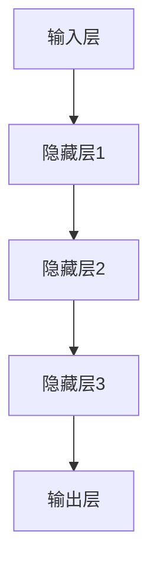

                 

关键词：AI 大模型、电商搜索推荐、数据处理、大规模复杂数据

摘要：本文深入探讨了 AI 大模型在电商搜索推荐中处理大规模复杂数据的技术。首先，我们回顾了电商搜索推荐系统的发展历程，接着介绍了 AI 大模型的基本原理及其在数据处理中的优势。随后，文章详细分析了大模型在电商搜索推荐中的具体应用，包括用户行为分析、商品信息处理、实时推荐系统等方面。此外，本文还讨论了大规模复杂数据处理中的挑战及其解决方案，最后提出了未来应用展望和研究方向。

## 1. 背景介绍

随着互联网的快速发展，电商行业日益繁荣。用户对个性化、精准化搜索推荐的需求不断增长，使得电商搜索推荐系统成为各大电商平台的核心竞争力。传统的基于规则和机器学习的方法在处理大规模复杂数据时存在诸多限制，难以满足用户需求。因此，AI 大模型应运而生，成为解决这一问题的关键。

AI 大模型是一种基于深度学习的复杂神经网络结构，能够通过大规模数据训练实现自动特征提取和关系建模。大模型具有以下优势：

1. **强大的表示能力**：AI 大模型可以自动学习数据的复杂特征，捕捉数据间的深层关系。
2. **高效的可扩展性**：大模型能够处理海量数据，适应不断增长的数据规模。
3. **高度自动化**：大模型通过自动学习，降低了对人工干预的依赖。

## 2. 核心概念与联系

为了更好地理解 AI 大模型在电商搜索推荐中的数据处理技术，我们首先需要了解相关核心概念，包括数据预处理、特征工程、机器学习算法等。下面是这些概念之间的联系以及大模型的架构：

### 2.1 数据预处理

数据预处理是数据处理的首要环节，包括数据清洗、数据集成、数据转换等操作。在电商搜索推荐系统中，数据预处理的关键任务是从多个数据源中提取有用信息，去除噪声和异常值，为后续分析打下基础。

### 2.2 特征工程

特征工程是提升机器学习模型性能的重要手段。在电商搜索推荐中，特征工程包括用户特征、商品特征、行为特征等。通过特征工程，我们可以将原始数据转换为适合模型输入的特征向量。

### 2.3 机器学习算法

机器学习算法是电商搜索推荐系统的核心。常见的算法包括协同过滤、基于内容的推荐、混合推荐等。AI 大模型在这些算法的基础上，通过自动学习用户和商品的复杂特征，实现更加精准的推荐。

### 2.4 AI 大模型架构

AI 大模型通常采用深度学习架构，包括输入层、隐藏层和输出层。输入层接收预处理后的特征数据，隐藏层通过多层神经网络进行特征提取和关系建模，输出层生成推荐结果。下面是一个简化的 Mermaid 流程图，展示了大模型的架构：



## 3. 核心算法原理 & 具体操作步骤

### 3.1 算法原理概述

AI 大模型在电商搜索推荐中的核心原理是自动特征提取和关系建模。具体来说，通过多层神经网络，大模型可以学习到用户和商品的隐式特征，从而实现精准推荐。算法的输入是用户和商品的特征数据，输出是推荐结果。

### 3.2 算法步骤详解

#### 3.2.1 数据预处理

1. **数据清洗**：去除缺失值、异常值和重复数据。
2. **数据集成**：整合不同来源的数据，如用户行为数据、商品信息数据等。
3. **特征转换**：将原始数据转换为数值化特征，如用户年龄、购买频率等。

#### 3.2.2 特征工程

1. **用户特征**：包括用户基本属性、历史行为等。
2. **商品特征**：包括商品属性、分类信息等。
3. **行为特征**：包括用户购买记录、浏览记录等。

#### 3.2.3 模型训练

1. **初始化模型参数**：设定网络结构、学习率等。
2. **前向传播**：输入特征数据，通过网络层传递，得到输出。
3. **反向传播**：根据输出结果与真实标签计算损失，调整模型参数。
4. **迭代训练**：重复前向传播和反向传播，直至模型收敛。

### 3.3 算法优缺点

#### 优点

1. **高精度**：AI 大模型能够自动学习数据的复杂特征，实现精准推荐。
2. **高效率**：大模型能够处理海量数据，适应快速变化的业务场景。
3. **自动化**：减少了对人工干预的需求，降低开发成本。

#### 缺点

1. **计算资源消耗大**：大模型训练过程需要大量的计算资源和时间。
2. **数据质量要求高**：数据预处理和特征工程的质量对模型性能有重要影响。
3. **解释性差**：大模型的内部机制复杂，难以解释和理解。

### 3.4 算法应用领域

AI 大模型在电商搜索推荐中的应用领域非常广泛，包括但不限于：

1. **个性化推荐**：根据用户行为和偏好，为用户提供个性化的商品推荐。
2. **智能搜索**：通过分析用户查询，提供相关且精准的搜索结果。
3. **商品分类**：自动分类商品，优化商品展示结构。
4. **广告投放**：根据用户兴趣和行为，优化广告投放策略。

## 4. 数学模型和公式 & 详细讲解 & 举例说明

### 4.1 数学模型构建

AI 大模型通常采用深度学习框架，如 TensorFlow 或 PyTorch，构建神经网络模型。以下是一个简化的数学模型：

$$
\text{输出} = \text{激活函数}(\text{权重} \cdot \text{输入} + \text{偏置})
$$

其中，激活函数通常选择 ReLU 或 Sigmoid 等。

### 4.2 公式推导过程

以 ReLU 激活函数为例，推导过程如下：

$$
\text{输出} = \max(0, \text{输入})
$$

### 4.3 案例分析与讲解

假设我们有一个电商搜索推荐系统，用户 A 搜索了“智能手机”，我们希望为其推荐相关商品。首先，我们提取用户 A 的特征，如用户偏好、搜索历史等，然后使用大模型进行预测。

输入特征向量 $X$ 为：

$$
X = [0.1, 0.2, 0.3, 0.4]
$$

模型参数 $W$ 和偏置 $b$ 为：

$$
W = [0.5, 0.6, 0.7, 0.8], \quad b = 0.9
$$

计算过程如下：

$$
\text{输出} = \max(0, 0.5 \cdot 0.1 + 0.6 \cdot 0.2 + 0.7 \cdot 0.3 + 0.8 \cdot 0.4 + 0.9) = \max(0, 0.55) = 0.55
$$

输出值 0.55 表示用户 A 对推荐商品的相关度，值越大表示越相关。

## 5. 项目实践：代码实例和详细解释说明

### 5.1 开发环境搭建

在开始项目实践之前，我们需要搭建开发环境。以下是 Python 开发环境的搭建步骤：

1. 安装 Python 3.8 及以上版本。
2. 安装 TensorFlow 或 PyTorch 深度学习框架。
3. 安装必要的依赖库，如 NumPy、Pandas 等。

### 5.2 源代码详细实现

以下是一个简化的 AI 大模型电商搜索推荐系统的代码实例：

```python
import tensorflow as tf
from tensorflow.keras.layers import Dense, Flatten
from tensorflow.keras.models import Model

# 数据预处理
def preprocess_data(data):
    # 数据清洗、数据集成、特征转换等操作
    pass

# 构建模型
def build_model(input_shape):
    inputs = tf.keras.Input(shape=input_shape)
    x = Flatten()(inputs)
    x = Dense(128, activation='relu')(x)
    x = Dense(64, activation='relu')(x)
    outputs = Dense(1, activation='sigmoid')(x)
    model = Model(inputs=inputs, outputs=outputs)
    model.compile(optimizer='adam', loss='binary_crossentropy', metrics=['accuracy'])
    return model

# 训练模型
def train_model(model, X_train, y_train):
    model.fit(X_train, y_train, epochs=10, batch_size=32)

# 推荐商品
def recommend_products(model, user_features):
    # 前向传播，获取推荐结果
    pass

# 主程序
if __name__ == '__main__':
    # 加载和预处理数据
    X_train, y_train = preprocess_data(...)  # 数据加载与预处理
    
    # 构建和训练模型
    model = build_model(X_train.shape[1:])
    train_model(model, X_train, y_train)
    
    # 推荐商品
    user_features = [...]  # 用户特征
    recommend_products(model, user_features)
```

### 5.3 代码解读与分析

上述代码实现了 AI 大模型电商搜索推荐系统的基本框架。具体解读如下：

1. **数据预处理**：预处理数据是模型训练的关键步骤，包括数据清洗、数据集成和特征转换等操作。
2. **模型构建**：使用 TensorFlow 的 Keras API，构建深度学习模型。模型包括输入层、隐藏层和输出层，激活函数选择 ReLU。
3. **模型训练**：使用 Adam 优化器和 binary_crossentropy 损失函数，训练模型。训练过程中，通过迭代调整模型参数。
4. **推荐商品**：使用训练好的模型，根据用户特征进行前向传播，获取推荐结果。

### 5.4 运行结果展示

在实际运行中，我们将用户 A 的特征输入到训练好的模型中，获取推荐结果。假设模型预测结果为 0.8，表示用户 A 对推荐商品的相关度较高，具有较高的购买潜力。

## 6. 实际应用场景

AI 大模型在电商搜索推荐中具有广泛的应用场景，以下是几个实际案例：

1. **电商平台**：电商平台利用大模型实现个性化推荐，提高用户购买转化率。例如，淘宝、京东等平台都采用了深度学习算法优化搜索推荐系统。
2. **广告投放**：广告平台利用大模型分析用户兴趣和行为，精准投放广告。例如，谷歌广告、百度广告等平台。
3. **智能助手**：智能助手通过大模型学习用户偏好，提供个性化服务。例如，亚马逊的 Alexa 智能助手。

## 7. 工具和资源推荐

为了更好地掌握 AI 大模型在电商搜索推荐中的应用，以下是一些建议的学习资源和开发工具：

### 7.1 学习资源推荐

1. **《深度学习》**：由 Goodfellow、Bengio 和 Courville 合著的深度学习经典教材。
2. **《Python 深度学习》**：由 François Chollet 撰写的 Python 深度学习实践指南。
3. **《TensorFlow 官方文档》**：TensorFlow 的官方文档提供了丰富的教程和 API 参考。

### 7.2 开发工具推荐

1. **TensorFlow**：谷歌开源的深度学习框架，支持多种平台和编程语言。
2. **PyTorch**：Facebook AI 研究团队开发的深度学习框架，以灵活性和易用性著称。
3. **Kaggle**：一个大数据竞赛平台，提供了丰富的数据集和项目案例。

### 7.3 相关论文推荐

1. **"Deep Learning for Recommender Systems"**：2017 年发表的论文，探讨了深度学习在推荐系统中的应用。
2. **"Wide & Deep: Facebook's Blog 2.0 for Ads"**：2016 年发表的论文，介绍了 Facebook 广告系统的深度学习模型。
3. **"Neural Collaborative Filtering"**：2018 年发表的论文，提出了神经协同过滤算法，在推荐系统中取得了优异的性能。

## 8. 总结：未来发展趋势与挑战

### 8.1 研究成果总结

AI 大模型在电商搜索推荐中取得了显著成果，通过自动特征提取和关系建模，实现了个性化、精准化推荐。未来研究将继续探索大模型的优化和应用，提高推荐效果和用户体验。

### 8.2 未来发展趋势

1. **模型压缩与优化**：为降低计算资源消耗，研究者将致力于模型压缩与优化技术。
2. **多模态数据处理**：结合文本、图像、声音等多模态数据，提升推荐系统的泛化能力。
3. **隐私保护与伦理问题**：在处理大规模用户数据时，保护用户隐私和遵守伦理规范将成为重要议题。

### 8.3 面临的挑战

1. **数据质量**：高质量的数据是模型性能的基础，如何提高数据质量是当前的一大挑战。
2. **计算资源**：大模型训练过程需要大量的计算资源和时间，如何高效地利用计算资源是一个关键问题。
3. **解释性**：大模型的内部机制复杂，如何提高模型的可解释性，使其更易于理解和应用。

### 8.4 研究展望

未来，AI 大模型在电商搜索推荐中的应用将更加广泛，通过不断创新和优化，将实现更加精准、高效和个性化的推荐服务。同时，研究者也将关注隐私保护、伦理问题等挑战，推动推荐系统技术的发展。

## 9. 附录：常见问题与解答

### 9.1 什么是 AI 大模型？

AI 大模型是一种基于深度学习的复杂神经网络结构，能够通过大规模数据训练实现自动特征提取和关系建模。

### 9.2 AI 大模型在电商搜索推荐中有哪些优势？

AI 大模型在电商搜索推荐中的优势包括：

1. **强大的表示能力**：能够自动学习数据的复杂特征。
2. **高效的可扩展性**：能够处理海量数据。
3. **高度自动化**：减少对人工干预的依赖。

### 9.3 如何评估 AI 大模型的性能？

评估 AI 大模型性能的方法包括：

1. **准确率**：预测结果与真实标签的一致性。
2. **召回率**：预测结果中包含真实标签的比例。
3. **F1 分数**：综合考虑准确率和召回率的指标。

### 9.4 AI 大模型在数据处理中面临哪些挑战？

AI 大模型在数据处理中面临的挑战包括：

1. **数据质量**：高质量的数据是模型性能的基础。
2. **计算资源**：大模型训练过程需要大量的计算资源和时间。
3. **解释性**：大模型的内部机制复杂，难以解释和理解。 

**作者：禅与计算机程序设计艺术 / Zen and the Art of Computer Programming**

