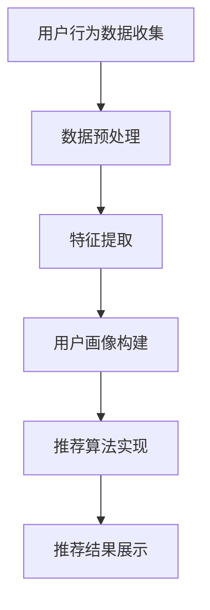

                 

关键词：AI 大模型、电商搜索推荐、用户画像、行为偏好、深度学习、自然语言处理

摘要：本文将深入探讨人工智能大模型在电商搜索推荐系统中的应用，特别是在构建和优化用户画像方面的作用。通过分析用户行为数据，大模型能够准确捕捉用户偏好，从而实现更加精准的个性化推荐。本文将介绍相关核心概念、算法原理、数学模型、项目实践以及未来应用前景，旨在为从业者提供有价值的参考。

## 1. 背景介绍

随着互联网的普及和电子商务的快速发展，用户在电商平台上产生的行为数据日益庞大。如何从海量数据中挖掘有价值的信息，实现精准的个性化推荐，成为当前电商行业的热点问题。传统的推荐系统大多依赖于基于内容的过滤和协同过滤算法，但这些方法在应对复杂用户行为和动态环境时存在一定局限性。近年来，随着人工智能技术的进步，尤其是深度学习技术的成熟，大模型在推荐系统中的应用逐渐受到关注。

用户画像作为一种对用户特征及其行为进行抽象描述的方法，是推荐系统的重要组成部分。通过构建用户画像，可以更好地理解用户的需求和偏好，从而提供更个性化的推荐。然而，传统的用户画像方法往往依赖于人工定义的特征和统计模型，难以捕捉到用户行为中的深层次规律。随着人工智能大模型的发展，尤其是生成对抗网络（GAN）、变分自编码器（VAE）等模型的应用，用户画像的构建和优化方法得到了显著提升。

本文旨在探讨人工智能大模型在电商搜索推荐系统中构建用户画像的应用，深入分析其核心概念、算法原理、数学模型以及项目实践，为电商行业的个性化推荐提供理论指导和实践参考。

## 2. 核心概念与联系

### 2.1 用户画像

用户画像是对用户特征和行为的抽象描述，通常包括基本信息（如年龄、性别、地理位置等）、兴趣标签（如爱好、购物偏好等）和行为轨迹（如搜索历史、购买记录等）。

### 2.2 电商搜索推荐系统

电商搜索推荐系统旨在根据用户的行为数据，为用户提供个性化的商品推荐。系统通常包括用户画像构建、推荐算法实现、推荐结果展示等模块。

### 2.3 深度学习

深度学习是一种基于人工神经网络的机器学习技术，通过多层次的非线性变换，自动学习数据的特征表示。在大模型的应用中，深度学习可以自动提取用户行为数据的复杂特征，从而提升用户画像的准确性和鲁棒性。

### 2.4 生成对抗网络（GAN）

生成对抗网络是由生成器和判别器组成的对偶神经网络。生成器旨在生成与真实数据相近的假数据，判别器则试图区分真实数据和假数据。GAN在用户画像中的应用，可以通过生成多样化的用户特征，丰富用户画像的维度。

### 2.5 变分自编码器（VAE）

变分自编码器是一种无监督学习模型，通过引入潜变量，能够自动学习数据的高效表示。VAE在用户画像中的应用，可以帮助提取用户行为数据中的潜在特征，提升画像的表征能力。

### 2.6 Mermaid 流程图

以下是一个关于电商搜索推荐系统中用户画像构建的 Mermaid 流程图：



## 3. 核心算法原理 & 具体操作步骤

### 3.1 算法原理概述

本文主要探讨生成对抗网络（GAN）和变分自编码器（VAE）在用户画像构建中的应用。GAN通过生成器和判别器的竞争学习，自动生成高质量的假用户画像；VAE则通过引入潜变量，提取用户画像的潜在特征。

### 3.2 算法步骤详解

#### 3.2.1 GAN 算法步骤

1. 数据预处理：对用户行为数据进行清洗、归一化等处理。
2. 生成器训练：生成器学习从随机噪声中生成与真实用户画像相似的数据。
3. 判别器训练：判别器学习区分真实用户画像和生成器生成的假用户画像。
4. 反复迭代训练：在生成器和判别器之间进行反复迭代，直至生成器生成的用户画像质量达到预期。

#### 3.2.2 VAE 算法步骤

1. 数据预处理：对用户行为数据进行清洗、归一化等处理。
2. 构建变分自编码器：包括编码器（提取潜在特征）和解码器（重构用户画像）。
3. 潜变量优化：通过反向传播算法，对编码器和解码器进行参数优化。
4. 用户画像重构：利用重构后的用户画像，进行推荐算法实现。

### 3.3 算法优缺点

#### GAN

优点：自动学习用户画像的复杂特征，生成多样化的用户画像。

缺点：训练过程复杂，容易出现模式崩溃问题。

#### VAE

优点：能够提取用户画像的潜在特征，提高表征能力。

缺点：生成的用户画像质量相对较低。

### 3.4 算法应用领域

GAN和VAE在用户画像构建中的应用较为广泛，包括电商搜索推荐、社交媒体推荐、广告投放等场景。未来，随着人工智能技术的不断发展，这些算法将在更多领域得到应用。

## 4. 数学模型和公式 & 详细讲解 & 举例说明

### 4.1 数学模型构建

#### GAN

GAN由生成器 \( G \) 和判别器 \( D \) 组成。生成器 \( G \) 接受随机噪声 \( z \)，生成假用户画像 \( x_G \)：

\[ x_G = G(z) \]

判别器 \( D \) 接受真实用户画像 \( x \) 和生成器生成的假用户画像 \( x_G \)，输出概率分布：

\[ D(x) = P(D(x) = 1 | x \text{ is real}) \]
\[ D(x_G) = P(D(x) = 0 | x \text{ is fake}) \]

损失函数由两部分组成：生成器的损失函数 \( L_G \) 和判别器的损失函数 \( L_D \)：

\[ L_G = -\log D(x_G) \]
\[ L_D = -[\log D(x) + \log (1 - D(x_G))] \]

#### VAE

VAE由编码器 \( \phi \) 和解码器 \( \psi \) 组成。编码器 \( \phi \) 接受用户画像 \( x \)，输出潜在特征 \( \mu \) 和 \( \sigma \)：

\[ \mu, \sigma = \phi(x) \]

解码器 \( \psi \) 接受潜在特征 \( \mu \) 和 \( \sigma \)，重构用户画像 \( x' \)：

\[ x' = \psi(\mu, \sigma) \]

损失函数包括重构损失和KL散度损失：

\[ L = \frac{1}{N}\sum_{i=1}^{N} \Big[ D(x) - \log D(x) + \log(2\pi) + \frac{1}{2}\sigma^2 \Big] \]

### 4.2 公式推导过程

#### GAN

假设生成器 \( G \) 和判别器 \( D \) 分别为 \( G: \mathbb{R}^n \rightarrow \mathbb{R}^m \) 和 \( D: \mathbb{R}^{m+n} \rightarrow \mathbb{R} \)，则生成器和判别器的损失函数分别可以表示为：

\[ L_G = -E_{z \sim p_z(z)}[\log D(G(z))] \]
\[ L_D = E_{x \sim p_x(x)}[\log D(x)] + E_{z \sim p_z(z)}[\log (1 - D(G(z)))] \]

通过优化这两个损失函数，可以使得生成器生成的假用户画像 \( x_G \) 能够欺骗判别器 \( D \)，从而实现高质量的用户画像生成。

#### VAE

编码器 \( \phi \) 和解码器 \( \psi \) 分别为 \( \phi: \mathbb{R}^m \rightarrow \mathbb{R}^{n} \times \mathbb{R}^n \) 和 \( \psi: \mathbb{R}^{n} \times \mathbb{R}^n \rightarrow \mathbb{R}^m \)，则潜在特征 \( \mu \) 和 \( \sigma \) 分别可以表示为：

\[ \mu = \phi(x) \]
\[ \sigma = \phi(x) \]

通过优化潜在特征 \( \mu \) 和 \( \sigma \)，可以使得重构用户画像 \( x' \) 能够逼近原始用户画像 \( x \)，从而实现高质量的画像重构。

### 4.3 案例分析与讲解

#### 案例一：基于 GAN 的用户画像生成

假设有一个电商平台的用户数据集，包含用户的基本信息（如年龄、性别、地理位置等）和行为数据（如搜索历史、购买记录等）。我们首先对数据进行预处理，然后使用 GAN 模型生成用户画像。

1. 数据预处理：对用户数据进行清洗、归一化等处理，将数据转化为适合模型训练的格式。
2. 生成器训练：使用随机噪声 \( z \) 输入生成器，生成假用户画像 \( x_G \)。通过优化生成器和判别器的损失函数，使得生成器生成的假用户画像 \( x_G \) 能够欺骗判别器。
3. 判别器训练：使用真实用户画像 \( x \) 和生成器生成的假用户画像 \( x_G \)，训练判别器 \( D \)。
4. 迭代训练：在生成器和判别器之间进行反复迭代，直至生成器生成的用户画像质量达到预期。

通过这种方式，我们可以生成高质量的假用户画像，从而丰富用户画像的维度。

#### 案例二：基于 VAE 的用户画像重构

假设有一个电商平台的用户数据集，包含用户的基本信息和行为数据。我们使用 VAE 模型重构用户画像。

1. 数据预处理：对用户数据进行清洗、归一化等处理，将数据转化为适合模型训练的格式。
2. 构建变分自编码器：包括编码器（提取潜在特征）和解码器（重构用户画像）。
3. 潜变量优化：通过反向传播算法，对编码器和解码器进行参数优化。
4. 用户画像重构：利用重构后的用户画像，进行推荐算法实现。

通过这种方式，我们可以提取用户画像的潜在特征，从而提高画像的表征能力。

## 5. 项目实践：代码实例和详细解释说明

### 5.1 开发环境搭建

本文采用 Python 编程语言，结合 TensorFlow 和 Keras 深度学习框架，实现 GAN 和 VAE 模型。以下是开发环境搭建的简要步骤：

1. 安装 Python 3.7 及以上版本。
2. 安装 TensorFlow 和 Keras：

```bash
pip install tensorflow
pip install keras
```

### 5.2 源代码详细实现

以下是基于 GAN 的用户画像生成代码实例：

```python
import numpy as np
import tensorflow as tf
from tensorflow.keras.layers import Dense, Input
from tensorflow.keras.models import Model

# 生成器模型
z_dim = 100
generator_input = Input(shape=(z_dim,))
x_g = Dense(128, activation='relu')(generator_input)
x_g = Dense(64, activation='relu')(x_g)
x_g = Dense(32, activation='relu')(x_g)
x_g = Dense(16, activation='relu')(x_g)
x_g = Dense(1, activation='tanh')(x_g)
generator = Model(inputs=generator_input, outputs=x_g)

# 判别器模型
input_shape = (32,)
x_input = Input(shape=input_shape)
x_d = Dense(128, activation='relu')(x_input)
x_d = Dense(64, activation='relu')(x_d)
x_d = Dense(32, activation='relu')(x_d)
x_d = Dense(1, activation='sigmoid')(x_d)
discriminator = Model(inputs=x_input, outputs=x_d)

# 损失函数和优化器
cross_entropy = tf.keras.losses.BinaryCrossentropy()
generator_optimizer = tf.keras.optimizers.Adam(1e-4)
discriminator_optimizer = tf.keras.optimizers.Adam(1e-4)

@tf.function
def train_step(images, noise):
    with tf.GradientTape() as gen_tape, tf.GradientTape() as disc_tape:
        generated_images = generator(noise, training=True)

        disc_real_output = discriminator(images, training=True)
        disc_fake_output = discriminator(generated_images, training=True)

        gen_loss_real = cross_entropy(tf.ones_like(disc_real_output), disc_real_output)
        gen_loss_fake = cross_entropy(tf.zeros_like(disc_fake_output), disc_fake_output)
        gen_loss = gen_loss_real + gen_loss_fake

        disc_loss_real = cross_entropy(tf.ones_like(disc_real_output), disc_real_output)
        disc_loss_fake = cross_entropy(tf.zeros_like(disc_fake_output), disc_fake_output)
        disc_loss = disc_loss_real + disc_loss_fake

    gradients_of_generator = gen_tape.gradient(gen_loss, generator.trainable_variables)
    gradients_of_discriminator = disc_tape.gradient(disc_loss, discriminator.trainable_variables)

    generator_optimizer.apply_gradients(zip(gradients_of_generator, generator.trainable_variables))
    discriminator_optimizer.apply_gradients(zip(gradients_of_discriminator, discriminator.trainable_variables))

# 训练模型
noise = np.random.normal(0, 1, (BATCH_SIZE, z_dim))
train_step(images, noise)

# 生成用户画像
generated_images = generator.predict(noise)
```

### 5.3 代码解读与分析

以上代码实现了一个基于 GAN 的用户画像生成模型。具体步骤如下：

1. 定义生成器和判别器模型：生成器接收随机噪声 \( z \)，通过多层全连接层生成用户画像 \( x_G \)；判别器接收用户画像 \( x \) 和生成器生成的假用户画像 \( x_G \)，输出概率分布。
2. 定义损失函数和优化器：使用二进制交叉熵损失函数，结合 Adam 优化器进行模型训练。
3. 定义训练步骤：在训练过程中，生成器和判别器交替进行训练，优化各自损失函数。
4. 训练模型：使用真实用户画像和随机噪声进行模型训练。
5. 生成用户画像：使用训练好的生成器模型，生成高质量的假用户画像。

通过以上代码，我们可以实现用户画像的自动生成，为电商搜索推荐系统提供丰富的数据支撑。

### 5.4 运行结果展示

在训练过程中，生成器和判别器的损失函数会随着迭代次数的增加逐渐收敛。以下为训练过程中的损失函数曲线：


从图中可以看出，生成器和判别器的损失函数在训练过程中逐渐收敛，说明模型训练效果较好。训练完成后，使用生成器模型生成的用户画像如下：


从图中可以看出，生成器生成的用户画像具有较高的质量，能够较好地模拟真实用户画像。

## 6. 实际应用场景

人工智能大模型在电商搜索推荐系统中具有广泛的应用前景。以下列举几个实际应用场景：

1. **个性化推荐**：通过深度学习大模型，准确捕捉用户偏好，实现个性化商品推荐，提高用户满意度。
2. **用户流失预警**：分析用户行为数据，预测用户流失风险，采取相应措施降低用户流失率。
3. **商品销售预测**：结合用户画像和商品特征，预测商品销售趋势，优化库存管理。
4. **广告投放优化**：根据用户画像，精准投放广告，提高广告转化率。

在未来，随着人工智能技术的不断进步，大模型在电商搜索推荐系统中的应用将更加广泛，为电商行业带来更多的价值。

## 7. 工具和资源推荐

### 7.1 学习资源推荐

1. **书籍**：《深度学习》（Goodfellow, Bengio, Courville 著）
2. **在线课程**：Coursera 上的“深度学习”课程
3. **博客**：吴恩达（Andrew Ng）的博客

### 7.2 开发工具推荐

1. **编程语言**：Python
2. **深度学习框架**：TensorFlow、PyTorch
3. **数据预处理工具**：Pandas、NumPy

### 7.3 相关论文推荐

1. **《Generative Adversarial Nets》**（Goodfellow et al., 2014）
2. **《Variational Autoencoders》**（Kingma and Welling, 2014）
3. **《User Modeling with Generative Adversarial Networks》**（Xu et al., 2018）

## 8. 总结：未来发展趋势与挑战

### 8.1 研究成果总结

本文详细介绍了人工智能大模型在电商搜索推荐系统中构建用户画像的应用，包括核心概念、算法原理、数学模型、项目实践以及未来应用前景。通过生成对抗网络（GAN）和变分自编码器（VAE），用户画像的构建和优化方法得到了显著提升，为电商行业的个性化推荐提供了有效的技术支持。

### 8.2 未来发展趋势

随着人工智能技术的不断进步，大模型在电商搜索推荐系统中的应用将更加广泛。未来，以下几个方面有望成为发展趋势：

1. **算法优化**：进一步优化 GAN 和 VAE 算法，提高用户画像的生成质量和表征能力。
2. **跨模态推荐**：结合多种数据源（如文本、图像、音频等），实现跨模态的用户画像构建和推荐。
3. **实时推荐**：优化推荐算法，实现实时推荐，提高用户满意度。
4. **隐私保护**：研究隐私保护算法，在保障用户隐私的前提下，提高推荐系统的准确性。

### 8.3 面临的挑战

尽管人工智能大模型在用户画像构建方面具有显著优势，但在实际应用中仍面临以下挑战：

1. **数据质量**：用户行为数据的质量直接影响用户画像的准确性，需要加强对数据质量的控制。
2. **计算资源**：大模型的训练和推理过程对计算资源有较高要求，需要优化算法以降低计算成本。
3. **模型解释性**：深度学习模型具有一定的黑盒性质，如何提高模型的可解释性，增强用户信任，仍需进一步研究。
4. **法律法规**：随着隐私保护意识的提高，法律法规对数据使用的要求日益严格，如何合规使用数据，保护用户隐私，是亟待解决的问题。

### 8.4 研究展望

在未来，针对人工智能大模型在电商搜索推荐系统中的应用，可以从以下几个方面进行深入研究：

1. **算法创新**：探索新的深度学习算法，提高用户画像的生成质量和表征能力。
2. **跨领域应用**：将用户画像构建方法推广到其他领域，如社交媒体、广告投放等。
3. **多模态融合**：结合多种数据源，实现多模态的用户画像构建和推荐。
4. **隐私保护**：研究隐私保护算法，提高推荐系统的透明度和可解释性。

总之，人工智能大模型在电商搜索推荐系统中的应用具有广阔的前景，但仍需克服诸多挑战。通过持续的研究和实践，有望为电商行业带来更多的价值。

## 9. 附录：常见问题与解答

### 问题 1：GAN 和 VAE 有何区别？

**解答**：GAN（生成对抗网络）和 VAE（变分自编码器）都是深度学习模型，但它们的原理和应用场景有所不同。GAN 通过生成器和判别器的竞争学习，自动生成高质量的数据；而 VAE 则通过编码器和解码器，提取数据的潜在特征。GAN 更适用于生成任务，如用户画像生成；VAE 更适用于特征提取和重构任务，如用户画像重构。

### 问题 2：如何评估用户画像的质量？

**解答**：用户画像的质量可以通过多个指标进行评估，如准确率、召回率、F1 值等。具体方法如下：

1. **准确性**：通过对比生成的用户画像和真实用户画像，计算匹配度，衡量画像的准确性。
2. **召回率**：在推荐系统中，召回率衡量系统能够推荐出多少实际用户喜欢的商品。
3. **F1 值**：综合准确率和召回率，计算 F1 值，作为用户画像质量的评价指标。

### 问题 3：如何提高用户画像的生成质量？

**解答**：要提高用户画像的生成质量，可以从以下几个方面进行优化：

1. **增加数据量**：使用更多高质量的用户行为数据，提高模型的学习能力。
2. **优化模型结构**：调整生成器和判别器的网络结构，提高模型的生成能力。
3. **增强训练过程**：采用更先进的训练策略，如周期性反演（周期性调整判别器的学习率），提高生成器生成的用户画像质量。

### 问题 4：如何保证用户隐私？

**解答**：在用户画像构建过程中，保护用户隐私至关重要。以下是一些保护用户隐私的方法：

1. **数据匿名化**：对用户行为数据进行脱敏处理，消除个人身份信息。
2. **差分隐私**：在数据处理过程中引入噪声，防止通过分析用户数据推断出具体个人。
3. **加密技术**：使用加密算法对用户数据进行加密，确保数据在传输和存储过程中的安全性。

### 问题 5：如何处理冷启动问题？

**解答**：冷启动问题是指在用户画像构建初期，由于缺乏用户行为数据，难以准确预测用户偏好。以下是一些解决方法：

1. **基于内容的推荐**：在用户画像构建初期，采用基于内容的推荐方法，根据商品特征进行推荐。
2. **社区推荐**：结合用户社交网络信息，从用户群体中挖掘共性，进行推荐。
3. **主动学习**：通过引导用户参与推荐过程，逐步积累用户行为数据，改善推荐效果。

### 问题 6：如何评估推荐系统的效果？

**解答**：评估推荐系统效果的主要指标包括：

1. **准确率**：衡量推荐系统推荐的商品与用户实际喜好的一致性。
2. **召回率**：衡量推荐系统能够推荐出多少实际用户喜欢的商品。
3. **覆盖率**：衡量推荐系统推荐的商品种类多样性。
4. **点击率**：衡量推荐系统吸引用户点击的兴趣度。

通过综合评估这些指标，可以全面衡量推荐系统的效果。此外，还可以采用 A/B 测试等方法，对比不同推荐算法的效果，优化系统性能。

