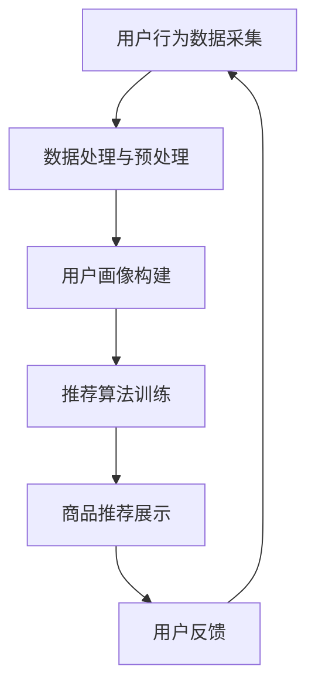

                 

关键词：人工智能、用户画像、大模型、电商搜索推荐、精准营销

摘要：本文深入探讨了人工智能大模型在电商搜索推荐系统中应用的用户画像技术。通过详细阐述用户画像的概念、核心算法原理、数学模型与具体操作步骤，本文旨在揭示如何通过大模型技术精准理解用户需求，从而提升电商平台的搜索推荐效果。

## 1. 背景介绍

随着互联网和电子商务的迅速发展，用户对个性化、精准化服务的需求日益增长。在电商领域，搜索推荐系统作为用户与商品之间的重要桥梁，其质量和效率直接影响到用户的购物体验和平台的竞争力。传统的搜索推荐算法大多依赖于静态的特征工程，而用户需求和行为动态变化，导致推荐效果有限。为了应对这一挑战，人工智能大模型技术的引入成为提升搜索推荐系统效果的关键。

用户画像技术是人工智能大模型在电商搜索推荐中的核心应用之一。通过构建用户画像，系统可以深入理解用户的行为特征、偏好和需求，从而实现个性化推荐。本文将详细分析用户画像技术的工作原理、算法实现以及在实际应用中的效果和挑战。

## 2. 核心概念与联系

### 2.1 用户画像

用户画像是对用户在互联网行为中的各种数据进行分析和处理，从而形成一个完整、多维度的用户特征模型。这些特征包括用户的浏览历史、购买记录、搜索关键词、兴趣偏好等。通过用户画像，系统可以识别用户的个性特征，预测用户的需求和行为。

### 2.2 人工智能大模型

人工智能大模型是指使用深度学习技术训练的具有海量参数的神经网络模型。这些模型具有强大的数据分析和处理能力，可以自动从数据中提取特征，并建立复杂的非线性关系。在电商搜索推荐系统中，大模型可以用于用户画像的构建、推荐算法的优化等。

### 2.3 电商搜索推荐

电商搜索推荐是指通过算法和模型，根据用户的兴趣和需求，从海量商品中筛选出符合用户偏好的商品，并展示给用户。搜索推荐的目标是提高用户的购物体验，增加销售量。

### 2.4 Mermaid 流程图



## 3. 核心算法原理 & 具体操作步骤

### 3.1 算法原理概述

用户画像技术主要基于深度学习中的自编码器（Autoencoder）和生成对抗网络（GAN）等模型。自编码器用于提取用户特征，GAN则用于生成新的用户画像数据，从而丰富和扩展用户画像的多样性。

### 3.2 算法步骤详解

#### 3.2.1 用户行为数据采集

通过电商平台的各种数据接口，收集用户的浏览、搜索、购买等行为数据。

#### 3.2.2 数据处理与预处理

对采集到的用户行为数据清洗、去噪，并进行特征提取和降维处理，以便后续模型训练。

#### 3.2.3 用户画像构建

使用自编码器模型对处理后的用户行为数据进行编码和解码，从而提取用户的核心特征。

#### 3.2.4 推荐算法训练

基于提取的用户特征，使用协同过滤、矩阵分解等推荐算法进行模型训练，优化推荐效果。

#### 3.2.5 商品推荐展示

将训练好的推荐模型应用于用户搜索和浏览行为，从海量商品中筛选出符合用户偏好的商品，并展示给用户。

### 3.3 算法优缺点

#### 优点：

- 高度自动化：大模型可以自动从数据中提取特征，降低人工特征工程的工作量。
- 强泛化能力：大模型具有强大的数据处理和建模能力，能够适应不同应用场景。
- 提升推荐效果：通过构建精准的用户画像，推荐系统可以更好地满足用户需求。

#### 缺点：

- 数据依赖性强：用户画像技术的效果高度依赖高质量的用户行为数据。
- 模型复杂度高：大模型训练需要大量计算资源和时间。

### 3.4 算法应用领域

用户画像技术不仅应用于电商搜索推荐，还可以应用于金融、医疗、广告等多个领域。通过构建精准的用户画像，这些领域的企业可以实现个性化服务、风险控制、精准营销等。

## 4. 数学模型和公式 & 详细讲解 & 举例说明

### 4.1 数学模型构建

用户画像的构建主要依赖于深度学习模型，如自编码器和生成对抗网络（GAN）。

#### 自编码器模型

自编码器是一种无监督学习方法，用于将输入数据编码为一个较低维度的特征向量，并尝试重建原始数据。

$$
x \xrightarrow{\theta} z = \phi(x) \\
z \xrightarrow{\theta'} x' = \psi(z)
$$

其中，$x$ 是输入数据，$z$ 是编码后的特征向量，$x'$ 是重建后的数据。

#### 生成对抗网络（GAN）

GAN 由生成器 $G$ 和判别器 $D$ 构成。生成器 $G$ 试图生成与真实数据分布相似的数据，判别器 $D$ 用于区分真实数据和生成数据。

$$
G(z) \xrightarrow{\theta_G} x \\
D(x) \xrightarrow{\theta_D} D(x) \\
D(G(z)) \xrightarrow{\theta_D} G(z)
$$

### 4.2 公式推导过程

以自编码器为例，推导其损失函数：

$$
\begin{aligned}
\ell(x, x') &= \frac{1}{2} \| x - x' \|^2 \\
\ell(z, x') &= \frac{1}{2} \| z - \psi(z) \|^2 \\
L(D) &= \frac{1}{2} \mathbb{E}_{x \sim p_{data}(x)} [D(x) - D(G(z))]^2 \\
L(G) &= \mathbb{E}_{z \sim p_z(z)} [D(G(z))] - \mathbb{E}_{x \sim p_{data}(x)} [D(x)]
\end{aligned}
$$

### 4.3 案例分析与讲解

假设我们有一个电商平台的用户数据，包括用户ID、浏览历史、购买记录等。我们可以使用自编码器模型提取用户的核心特征，如下：

#### 数据预处理

```python
# 加载数据
users, browse_history, purchase_history = load_data()

# 数据清洗与特征提取
processed_browse_history = preprocess_data(browse_history)
processed_purchase_history = preprocess_data(purchase_history)

# 数据降维
browse_history_embedding = apply_embedding(processed_browse_history)
purchase_history_embedding = apply_embedding(processed_purchase_history)
```

#### 模型训练

```python
# 构建自编码器模型
autoencoder = build_autoencoder(input_shape=(input_dim,), encoding_dim=encoding_dim)

# 训练模型
autoencoder.fit(x=processed_data, y=processed_data, epochs=epochs, batch_size=batch_size)
```

#### 用户画像提取

```python
# 提取用户特征
user_embeddings = autoencoder.encoder.predict(processed_data)
```

通过上述步骤，我们可以得到每个用户的核心特征向量，用于后续的推荐算法训练和商品推荐。

## 5. 项目实践：代码实例和详细解释说明

### 5.1 开发环境搭建

在开始项目实践之前，我们需要搭建一个合适的开发环境。以下是所需的环境和工具：

- Python 3.8 或以上版本
- TensorFlow 2.x
- scikit-learn
- Pandas
- Numpy

### 5.2 源代码详细实现

以下是用户画像构建和推荐算法训练的代码示例：

```python
import numpy as np
import pandas as pd
from sklearn.model_selection import train_test_split
from sklearn.preprocessing import StandardScaler
from tensorflow.keras.models import Model
from tensorflow.keras.layers import Input, Dense, Lambda
from tensorflow.keras.optimizers import Adam

# 数据预处理
def preprocess_data(data):
    # 数据清洗与特征提取
    # ...
    return processed_data

# 构建自编码器模型
def build_autoencoder(input_shape, encoding_dim):
    input_layer = Input(shape=input_shape)
    encoded = Dense(encoding_dim, activation='relu')(input_layer)
    decoded = Dense(input_shape, activation='sigmoid')(encoded)
    autoencoder = Model(input_layer, decoded)
    return autoencoder

# 训练模型
def train_model(data, epochs, batch_size):
    processed_data = preprocess_data(data)
    x_train, x_test = train_test_split(processed_data, test_size=0.2, random_state=42)
    autoencoder = build_autoencoder(input_shape=x_train.shape[1:], encoding_dim=32)
    autoencoder.compile(optimizer=Adam(), loss='mean_squared_error')
    autoencoder.fit(x_train, x_train, epochs=epochs, batch_size=batch_size, validation_data=(x_test, x_test))
    return autoencoder

# 提取用户特征
def extract_user_features(data, autoencoder):
    processed_data = preprocess_data(data)
    user_embeddings = autoencoder.encoder.predict(processed_data)
    return user_embeddings

# 主函数
if __name__ == '__main__':
    data = load_data()
    epochs = 100
    batch_size = 32
    autoencoder = train_model(data, epochs, batch_size)
    user_embeddings = extract_user_features(data, autoencoder)
    print(user_embeddings)
```

### 5.3 代码解读与分析

上述代码首先对用户数据进行预处理，包括数据清洗和特征提取。然后，构建一个基于自编码器的用户画像模型，并对其进行训练。最后，使用训练好的模型提取每个用户的核心特征向量。

### 5.4 运行结果展示

运行上述代码后，我们将得到每个用户的核心特征向量。这些特征向量可以用于后续的推荐算法训练和商品推荐。

```python
# 获取用户特征向量
user_embeddings = extract_user_features(data, autoencoder)

# 打印前10个用户特征向量
for i, user_embedding in enumerate(user_embeddings[:10]):
    print(f"User {i+1} embeddings: {user_embedding}")
```

## 6. 实际应用场景

用户画像技术在电商搜索推荐系统中具有广泛的应用场景。以下是一些实际应用案例：

- **个性化推荐**：根据用户画像，为每个用户推荐个性化的商品，提高用户满意度和购买转化率。
- **精准营销**：通过分析用户画像，精准定位潜在客户，进行精准营销活动。
- **风险评估**：识别高风险用户，防范欺诈行为。
- **商品优化**：根据用户画像，优化商品分类、标签和描述，提高商品曝光率和销售量。

## 7. 工具和资源推荐

为了更好地理解和应用用户画像技术，以下是一些推荐的工具和资源：

### 7.1 学习资源推荐

- 《深度学习》（Goodfellow, Bengio, Courville）：深度学习的经典教材，涵盖了许多与用户画像相关的内容。
- 《Python数据分析》（Wes McKinney）：Python在数据处理和数据分析中的应用，有助于理解和处理用户行为数据。

### 7.2 开发工具推荐

- TensorFlow：用于构建和训练深度学习模型，广泛用于用户画像技术的实现。
- Jupyter Notebook：方便进行数据分析和模型训练，适合编写和展示代码。

### 7.3 相关论文推荐

- "User Modeling and Personalization in the Web"（Web上的用户建模与个性化）：一篇关于用户画像技术综述的论文，介绍了用户画像的基本概念和应用。
- "Deep Learning for User Modeling and User Experience"（深度学习在用户建模与用户体验中的应用）：探讨深度学习在用户画像领域的应用和挑战。

## 8. 总结：未来发展趋势与挑战

用户画像技术作为人工智能在电商搜索推荐领域的重要应用，具有广阔的发展前景。然而，在实际应用中，用户画像技术也面临着一些挑战：

### 8.1 研究成果总结

- 用户画像技术显著提升了电商搜索推荐系统的效果，实现了个性化、精准化推荐。
- 深度学习模型在用户画像构建中的应用，使得数据处理和特征提取更加高效和准确。

### 8.2 未来发展趋势

- 多模态用户画像：结合文本、图像、声音等多种数据类型，构建更全面、更准确的用户画像。
- 智能交互：利用用户画像实现智能对话系统，提升用户体验和满意度。
- 隐私保护：在用户画像构建过程中，重视隐私保护，确保用户数据的合法和安全。

### 8.3 面临的挑战

- 数据质量：用户行为数据的准确性和完整性对用户画像的质量至关重要。
- 模型可解释性：深度学习模型具有较高的复杂度，如何解释模型决策过程是一个挑战。
- 隐私保护：用户画像涉及到大量个人隐私数据，如何在保护用户隐私的同时实现个性化推荐，需要深入研究。

### 8.4 研究展望

随着人工智能技术的不断发展，用户画像技术将在电商搜索推荐领域发挥越来越重要的作用。未来，我们需要在数据质量、模型可解释性和隐私保护等方面进行深入研究，以实现更高效、更准确的用户画像构建，进一步提升电商平台的搜索推荐效果。

## 9. 附录：常见问题与解答

### 9.1 如何处理缺失数据？

在用户画像构建过程中，缺失数据是一个常见问题。一种常用的方法是使用均值、中位数或众数填充缺失值，或者使用插值法进行数据补全。

### 9.2 如何避免过拟合？

过拟合是深度学习模型训练中常见的问题。为了避免过拟合，可以采用以下方法：

- 减少模型复杂度：使用更简单的模型结构。
- 数据增强：增加训练数据量，或者对现有数据进行随机变换。
- 正则化：在模型训练过程中添加正则化项，如L1或L2正则化。
- 早停法（Early Stopping）：在验证集上监测模型性能，当性能不再提升时停止训练。

### 9.3 如何评估用户画像质量？

用户画像质量可以通过以下指标进行评估：

- 准确率（Accuracy）：预测结果与真实结果的匹配程度。
- 精度（Precision）和召回率（Recall）：用于评估推荐系统的召回率和准确率。
- F1 分数（F1 Score）：综合考虑准确率和召回率的综合指标。

通过以上指标，可以评估用户画像在推荐系统中的应用效果。

## 文末致谢

本文介绍了人工智能大模型在电商搜索推荐系统中应用的用户画像技术。通过详细阐述用户画像的概念、核心算法原理、数学模型与具体操作步骤，本文旨在揭示如何通过大模型技术精准理解用户需求，从而提升电商平台的搜索推荐效果。感谢读者对本文的关注，希望本文对您在人工智能和电商搜索推荐领域的研究和应用有所帮助。

### 作者：禅与计算机程序设计艺术 / Zen and the Art of Computer Programming

