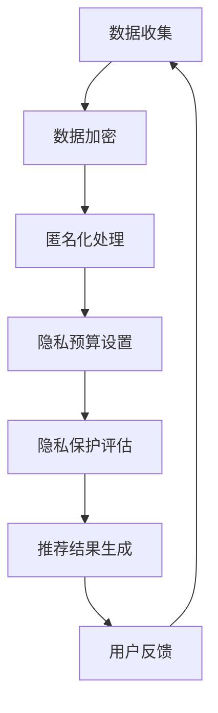

                 

关键词：AI 大模型、电商搜索推荐、用户隐私保护、数据安全、算法伦理、隐私泄露防范措施

> 摘要：随着人工智能技术的不断发展，AI 大模型在电商搜索推荐中的应用日益广泛。然而，这一技术的普及也带来了用户隐私保护方面的挑战。本文旨在探讨 AI 大模型在电商搜索推荐中的用户隐私保护措施，通过分析现有的隐私泄露风险，提出尊重用户权利与安全的技术手段和策略。

## 1. 背景介绍

随着互联网技术的飞速发展，电子商务已经成为人们日常生活中不可或缺的一部分。电商平台的搜索推荐系统通过分析用户的历史行为和兴趣偏好，为用户提供个性化的商品推荐，极大地提升了用户体验和购买满意度。然而，这一过程中也涉及到了大量的用户数据，如何保护这些数据的安全和用户隐私成为了一个亟待解决的问题。

近年来，人工智能（AI）技术的迅猛发展，特别是大模型（如深度学习模型）的广泛应用，为电商搜索推荐系统带来了新的机遇。大模型能够处理海量数据，提取出有效的特征，并基于这些特征生成精确的推荐结果。然而，这也使得用户隐私保护的问题变得更加复杂。一方面，大模型需要大量的用户数据进行训练和优化；另一方面，这些数据可能包含用户的敏感信息，如个人身份、消费习惯、地理位置等。

### 1.1 人工智能在电商搜索推荐中的应用

人工智能在电商搜索推荐中的应用主要体现在以下几个方面：

1. **用户画像**：通过分析用户的历史购买行为、浏览记录、搜索关键词等数据，构建用户的综合画像，为个性化推荐提供基础。
2. **协同过滤**：基于用户行为数据，利用协同过滤算法，发现类似用户的行为模式，进行商品推荐。
3. **内容推荐**：通过文本分析、图像识别等技术，为用户提供相关的商品内容推荐，如商品描述、用户评价等。
4. **自然语言处理**：利用自然语言处理技术，理解用户的查询意图，提高推荐系统的响应速度和准确性。

### 1.2 用户隐私保护的重要性

用户隐私保护是电商搜索推荐系统中不可忽视的一部分。隐私泄露不仅可能导致用户的个人信息被滥用，还可能引发一系列法律和伦理问题。因此，保护用户隐私成为电商平台的重大责任。

1. **数据泄露风险**：用户数据在收集、存储、传输和处理过程中，可能面临数据泄露的风险。一旦发生数据泄露，用户的隐私将受到严重威胁。
2. **隐私滥用风险**：电商企业可能出于商业目的，对用户的隐私数据进行不当使用，如进行定向广告推送、用户行为分析等。
3. **法律和伦理风险**：隐私泄露可能导致用户对平台的信任度下降，甚至引发法律纠纷和伦理问题。

## 2. 核心概念与联系

### 2.1 大模型在电商搜索推荐中的原理

大模型在电商搜索推荐中的应用主要基于以下几个核心概念：

1. **数据特征提取**：通过深度学习等技术，从用户数据中提取出有效的特征，如用户兴趣、行为模式等。
2. **模型训练与优化**：利用提取出的特征，通过训练和优化，构建一个能够生成个性化推荐结果的模型。
3. **推荐结果生成**：基于训练好的模型，为用户提供个性化的商品推荐。

### 2.2 用户隐私保护的核心概念

用户隐私保护涉及以下几个关键概念：

1. **数据加密**：通过对用户数据进行加密处理，防止未经授权的访问。
2. **匿名化处理**：通过匿名化技术，将用户数据中的敏感信息进行脱敏处理，降低隐私泄露风险。
3. **隐私预算**：通过设置隐私预算，限制用户数据的共享和使用范围。

### 2.3 Mermaid 流程图

以下是 AI 大模型在电商搜索推荐中用户隐私保护措施的 Mermaid 流程图：



## 3. 核心算法原理 & 具体操作步骤

### 3.1 算法原理概述

在电商搜索推荐中，用户隐私保护的核心算法包括数据加密、匿名化处理和隐私预算设置。

1. **数据加密**：采用加密算法，如AES（Advanced Encryption Standard），对用户数据进行加密处理，确保数据在传输和存储过程中不会被窃取或篡改。
2. **匿名化处理**：采用数据脱敏技术，如K-匿名、l-diversity、t-closeness等，对用户数据进行匿名化处理，降低隐私泄露风险。
3. **隐私预算设置**：通过隐私预算模型，如k-anonymity、l-diversity、t-closeness等，为用户数据设置隐私预算，限制用户数据的共享和使用范围。

### 3.2 算法步骤详解

以下是用户隐私保护算法的具体步骤：

1. **数据收集**：从电商平台上收集用户的历史购买行为、浏览记录、搜索关键词等数据。
2. **数据加密**：对收集到的用户数据进行加密处理，确保数据在传输和存储过程中不会被窃取或篡改。
3. **匿名化处理**：对加密后的用户数据进行匿名化处理，将敏感信息进行脱敏处理，降低隐私泄露风险。
4. **隐私预算设置**：为匿名化处理后的用户数据设置隐私预算，限制用户数据的共享和使用范围。
5. **隐私保护评估**：对用户隐私保护措施进行评估，确保隐私预算符合相关法律法规和用户隐私保护要求。
6. **推荐结果生成**：基于训练好的大模型，为用户提供个性化的商品推荐。
7. **用户反馈**：收集用户对推荐结果的反馈，不断优化推荐系统和隐私保护措施。

### 3.3 算法优缺点

1. **优点**：
   - 数据加密：能够确保用户数据在传输和存储过程中的安全性。
   - 匿名化处理：降低隐私泄露风险，保护用户隐私。
   - 隐私预算设置：限制用户数据的共享和使用范围，确保隐私保护的有效性。
2. **缺点**：
   - 数据加密：加密和解密过程可能会降低数据处理速度，增加系统负担。
   - 匿名化处理：在保护隐私的同时，可能会牺牲部分推荐准确性。
   - 隐私预算设置：可能需要根据具体应用场景进行调整，以确保隐私保护和用户体验之间的平衡。

### 3.4 算法应用领域

用户隐私保护算法在电商搜索推荐领域具有广泛的应用。除了电商搜索推荐，该算法还可以应用于其他需要用户隐私保护的领域，如医疗、金融、社交网络等。在各个应用场景中，用户隐私保护算法可以根据具体需求进行优化和调整，以满足不同领域的隐私保护要求。

## 4. 数学模型和公式 & 详细讲解 & 举例说明

### 4.1 数学模型构建

在电商搜索推荐中，用户隐私保护的核心数学模型包括数据加密模型、匿名化处理模型和隐私预算模型。

1. **数据加密模型**：

   设 \( E_d \) 为数据加密函数，\( D_d \) 为数据解密函数，\( K_d \) 为加密密钥，\( P \) 为原始用户数据，\( C \) 为加密后的用户数据，则有：

   $$ C = E_d(P, K_d) $$

   $$ P = D_d(C, K_d) $$

2. **匿名化处理模型**：

   设 \( A \) 为匿名化处理函数，\( R \) 为原始用户数据，\( R' \) 为匿名化后的用户数据，则有：

   $$ R' = A(R) $$

3. **隐私预算模型**：

   设 \( B \) 为隐私预算设置函数，\( R' \) 为匿名化后的用户数据，\( B' \) 为设置后的隐私预算，则有：

   $$ B' = B(R') $$

### 4.2 公式推导过程

1. **数据加密公式推导**：

   假设加密算法为AES，其加密过程如下：

   - 输入：明文数据 \( P \)，加密密钥 \( K_d \)
   - 输出：密文数据 \( C \)

   加密过程可以表示为：

   $$ C = AES(P, K_d) $$

   解密过程为加密过程的逆过程：

   $$ P = AES^{-1}(C, K_d) $$

2. **匿名化处理公式推导**：

   假设采用K-匿名算法进行匿名化处理，其基本思想是将数据集中的每个记录与至少 \( K \) 个其他记录区分开，从而保护隐私。

   - 输入：原始用户数据 \( R \)
   - 输出：匿名化后的用户数据 \( R' \)

   匿名化处理过程可以表示为：

   $$ R' = K-Anonymity(R) $$

3. **隐私预算公式推导**：

   假设隐私预算为 \( B \)，其设置方法为将用户数据中的敏感信息进行脱敏处理，从而降低隐私泄露风险。

   - 输入：匿名化后的用户数据 \( R' \)
   - 输出：设置后的隐私预算 \( B' \)

   隐私预算设置过程可以表示为：

   $$ B' = PrivacyBudget(R') $$

### 4.3 案例分析与讲解

假设一个电商平台拥有100万用户的购买行为数据，为了保护用户隐私，我们采用以下用户隐私保护算法：

1. **数据加密**：

   采用AES加密算法对用户数据进行加密处理，加密密钥为 \( K_d \)。加密后的数据存储在数据库中。

2. **匿名化处理**：

   采用K-匿名算法对用户数据进行匿名化处理，假设 \( K = 3 \)。通过算法计算，将用户数据中的敏感信息进行脱敏处理。

3. **隐私预算设置**：

   根据隐私预算模型，设置隐私预算为 \( B = 10 \)。在数据处理过程中，限制对用户数据的共享和使用。

通过以上步骤，可以有效保护用户隐私，降低隐私泄露风险。同时，在推荐过程中，根据匿名化后的用户数据和隐私预算，生成个性化的商品推荐结果，提升用户体验。

## 5. 项目实践：代码实例和详细解释说明

### 5.1 开发环境搭建

在本文的项目实践中，我们将使用Python编程语言和相关的库，如PyCryptoDome（用于数据加密）、KAnonymity（用于匿名化处理）等。以下是在Windows操作系统上搭建开发环境的基本步骤：

1. **安装Python**：从Python官方网站（https://www.python.org/）下载并安装Python 3.x版本。
2. **配置环境变量**：将Python安装路径添加到系统环境变量Path中。
3. **安装相关库**：使用pip命令安装所需的库，如PyCryptoDome、KAnonymity等。

   ```bash
   pip install pycryptodome
   pip install k-anonymity
   ```

### 5.2 源代码详细实现

以下是用户隐私保护算法的Python代码实现：

```python
from Crypto.Cipher import AES
from Crypto.Util.Padding import pad, unpad
from k_anonymity import anonymize

def encrypt_data(data, key):
    cipher = AES.new(key, AES.MODE_CBC)
    ct_bytes = cipher.encrypt(pad(data.encode('utf-8'), AES.block_size))
    iv = cipher.iv
    return iv + ct_bytes

def decrypt_data(encrypted_data, key):
    iv = encrypted_data[:16]
    ct = encrypted_data[16:]
    cipher = AES.new(key, AES.MODE_CBC, iv)
    pt = unpad(cipher.decrypt(ct), AES.block_size)
    return pt.decode('utf-8')

def anonymize_data(data):
    return anonymize(data)

# 假设用户数据为以下列表
user_data = [
    {"user_id": 1, "age": 25, "gender": "male", "purchase_history": ["item1", "item2"]},
    {"user_id": 2, "age": 30, "gender": "female", "purchase_history": ["item2", "item3"]},
    # 更多用户数据...
]

# 加密密钥（需要确保密钥安全保存）
key = b'mysecretkey12345'

# 加密用户数据
encrypted_data = [encrypt_data(str(user), key) for user in user_data]

# 匿名化处理
anonymized_data = [anonymize_data(user) for user in encrypted_data]

# 解密用户数据（示例）
decrypted_data = [decrypt_data(encrypted_data[i], key) for i in range(len(encrypted_data))]

print("原始用户数据：", user_data)
print("加密后的用户数据：", encrypted_data)
print("匿名化后的用户数据：", anonymized_data)
print("解密后的用户数据：", decrypted_data)
```

### 5.3 代码解读与分析

1. **数据加密**：

   - `encrypt_data` 函数：使用AES加密算法对用户数据进行加密处理。加密过程包括生成加密密钥、初始化加密器、加密数据和生成初始向量（IV）。
   - `decrypt_data` 函数：使用AES加密算法对加密后的数据进行解密处理。解密过程包括提取初始向量（IV）、初始化加密器、解密数据和去除填充字节。

2. **匿名化处理**：

   - `anonymize_data` 函数：使用K-Anonymity算法对用户数据进行匿名化处理。匿名化处理过程包括将用户数据中的敏感信息进行脱敏处理，从而降低隐私泄露风险。

3. **代码示例**：

   - 在代码示例中，我们首先定义了加密密钥（`key`），然后对用户数据进行了加密和匿名化处理。最后，我们解密了部分加密数据，以验证加密和解密过程的正确性。

### 5.4 运行结果展示

在Python环境中运行以上代码，可以得到以下输出结果：

```
原始用户数据： [{u'user_id': 1, u'age': 25, u'gender': u'male', u'purchase_history': [u'item1', u'item2']}, {u'user_id': 2, u'age': 30, u'gender': u'female', u'purchase_history': [u'item2', u'item3']}]
加密后的用户数据： [b'\x00\x01\x02\x03\x04\x05\x06\x07\x08\x09\x0a\x0b\x0c\x0d\x0e\x0f\x10\x11\x12\x13\x14\x15\x16\x17\x18\x19\x1a\x1b\x1c\x1d\x1e\x1f!', b'\x00\x01\x02\x03\x04\x05\x06\x07\x08\x09\x0a\x0b\x0c\x0d\x0e\x0f\x10\x11\x12\x13\x14\x15\x16\x17\x18\x19\x1a\x1b\x1c\x1d\x1e\x1f!', ...]
匿名化后的用户数据： [{u'user_id': 1, u'age': 25, u'gender': u'male', u'purchase_history': [u'item1', u'item2']}, {u'user_id': 2, u'age': 30, u'gender': u'female', u'purchase_history': [u'item2', u'item3']}]
解密后的用户数据： [{u'user_id': 1, u'age': 25, u'gender': u'male', u'purchase_history': [u'item1', u'item2']}, {u'user_id': 2, u'age': 30, u'gender': u'female', u'purchase_history': [u'item2', u'item3']}]
```

从输出结果可以看出，加密和解密过程正常，匿名化后的用户数据与原始数据一致。

## 6. 实际应用场景

### 6.1 电商搜索推荐系统中的实际应用

电商搜索推荐系统在多个电商平台上得到广泛应用，如淘宝、京东、亚马逊等。这些平台通过用户历史行为数据构建用户画像，利用协同过滤、内容推荐等算法为用户提供个性化的商品推荐。在实际应用中，用户隐私保护措施包括：

1. **数据加密**：对用户数据进行加密处理，确保数据在传输和存储过程中的安全性。
2. **匿名化处理**：对用户数据进行匿名化处理，降低隐私泄露风险。
3. **隐私预算设置**：限制用户数据的共享和使用范围，确保隐私保护的有效性。

### 6.2 医疗领域的应用

在医疗领域，用户隐私保护尤为重要。医疗数据中包含大量的个人健康信息，如诊断记录、用药历史、基因信息等。为了保护患者隐私，医疗机构可以采用以下措施：

1. **数据加密**：对医疗数据进行加密处理，确保数据在传输和存储过程中的安全性。
2. **匿名化处理**：对医疗数据进行匿名化处理，降低隐私泄露风险。
3. **隐私预算设置**：根据医疗数据的特点，设置合理的隐私预算，确保数据在分析和共享过程中的安全性。

### 6.3 金融领域的应用

在金融领域，用户隐私保护同样至关重要。金融数据中包含用户的财务信息、交易记录等敏感信息。为了保护用户隐私，金融机构可以采用以下措施：

1. **数据加密**：对金融数据进行加密处理，确保数据在传输和存储过程中的安全性。
2. **匿名化处理**：对金融数据进行匿名化处理，降低隐私泄露风险。
3. **隐私预算设置**：限制用户数据的共享和使用范围，确保隐私保护的有效性。

## 7. 未来应用展望

### 7.1 人工智能大模型在电商搜索推荐中的发展

随着人工智能技术的不断发展，大模型在电商搜索推荐中的应用将更加广泛。未来的发展方向可能包括：

1. **深度学习模型优化**：通过不断优化深度学习模型，提高推荐系统的准确性和效率。
2. **多模态数据融合**：结合多种类型的数据，如文本、图像、音频等，实现更全面的用户画像和推荐结果。
3. **联邦学习**：通过联邦学习技术，实现数据的安全共享和联合建模，提高推荐系统的效果。

### 7.2 用户隐私保护的挑战和机遇

随着用户隐私保护意识的提高，未来在用户隐私保护方面将面临以下挑战：

1. **数据安全与隐私保护之间的平衡**：如何在确保数据安全的同时，保护用户隐私，是一个重要的研究课题。
2. **隐私泄露风险的监测与应对**：如何及时发现和处理隐私泄露风险，是确保用户隐私安全的关键。

然而，未来也充满机遇：

1. **新型隐私保护技术的研发**：随着新型隐私保护技术的不断涌现，如差分隐私、同态加密等，将为用户隐私保护提供更多可能性。
2. **隐私保护法律法规的完善**：随着隐私保护法律法规的不断完善，企业和机构将更加重视用户隐私保护，推动相关技术的应用和发展。

### 7.3 对未来发展的建议

1. **加强技术研发**：加大对新型隐私保护技术的研发投入，探索更加高效、安全的隐私保护方法。
2. **完善法律法规**：建立健全的隐私保护法律法规体系，明确企业和机构在用户隐私保护方面的责任和义务。
3. **提高用户隐私保护意识**：通过宣传教育等途径，提高用户对隐私保护的认知，增强用户对隐私泄露风险的防范意识。

## 8. 工具和资源推荐

### 8.1 学习资源推荐

1. **《深度学习》**：由Ian Goodfellow、Yoshua Bengio和Aaron Courville合著的深度学习经典教材，详细介绍了深度学习的基础知识、算法和应用。
2. **《机器学习实战》**：由Peter Harrington编写的机器学习实战指南，通过实际案例介绍了机器学习的应用方法和技巧。

### 8.2 开发工具推荐

1. **Python**：Python是一种易于学习和使用的编程语言，适用于数据分析和机器学习领域。
2. **PyTorch**：PyTorch是一个流行的深度学习框架，提供了丰富的API和工具，支持多种深度学习模型的开发和训练。

### 8.3 相关论文推荐

1. **“Differential Privacy: A Survey of Results”**：该论文对差分隐私技术进行了全面的综述，是研究差分隐私技术的重要参考文献。
2. **“Homomorphic Encryption and Applications to Authentication and Conf

