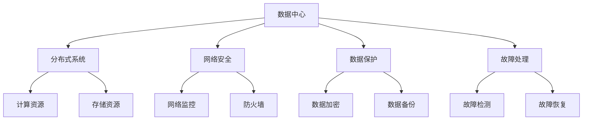

                 

关键词：数据中心，安全与可靠性，AI 大模型，性能优化，分布式系统，网络安全，数据保护，故障处理

> 摘要：随着人工智能大模型的广泛应用，数据中心的建设与管理变得至关重要。本文将深入探讨数据中心在安全与可靠性方面的挑战，分析现有的解决方案，并展望未来的发展趋势。本文旨在为数据中心管理者提供实用的指导，以确保大模型在数据中心中稳定高效运行。

## 1. 背景介绍

在当今数字化时代，数据中心已成为企业核心竞争力的象征。随着人工智能（AI）技术的飞速发展，尤其是大模型如 GPT、BERT 等的出现，数据中心的地位更加突出。这些大模型需要海量的计算资源和数据存储能力，而数据中心正是提供这些资源的最佳选择。

数据中心的建设与管理面临诸多挑战，其中最为关键的是安全与可靠性。数据中心的安全问题不仅涉及到数据保护，还涉及到物理安全和网络安全。同时，数据中心需要保持高可靠性，以确保大模型能够持续、稳定地运行。

本文将围绕数据中心的安全与可靠性展开讨论，首先介绍相关核心概念与联系，然后详细讲解核心算法原理与操作步骤，并进一步分析数学模型和公式。接着，我们将通过实际项目实践展示代码实例，并探讨数据中心在实际应用场景中的角色。最后，本文将推荐相关工具和资源，并总结未来发展趋势与挑战。

## 2. 核心概念与联系

在探讨数据中心的安全与可靠性之前，我们需要了解一些核心概念和架构。

### 2.1 数据中心定义

数据中心是一个集中化数据处理、存储和传输的场所，通常由一系列复杂的硬件和软件组成。它为企业和组织提供了关键的计算和存储服务。

### 2.2 分布式系统

分布式系统是指由多个计算机节点组成，这些节点通过网络相互连接，协同工作以完成复杂任务的系统。数据中心通常采用分布式系统架构，以提高计算和存储的灵活性和可扩展性。

### 2.3 网络安全

网络安全是指保护计算机网络系统不受未经授权的访问、篡改、泄露等威胁。数据中心作为关键基础设施，其网络安全至关重要。

### 2.4 数据保护

数据保护是指采取措施确保数据的安全、完整和可用。在数据中心中，数据保护包括数据加密、备份和恢复等。

### 2.5 故障处理

故障处理是指当数据中心出现故障时，如何快速定位并解决问题。有效的故障处理机制可以提高数据中心的可靠性。

### 2.6 Mermaid 流程图

为了更好地理解数据中心的核心概念与联系，我们可以使用 Mermaid 流程图来展示关键节点和关系。



通过这个流程图，我们可以清晰地看到数据中心各个核心概念之间的联系和交互。

## 3. 核心算法原理 & 具体操作步骤

### 3.1 算法原理概述

数据中心的安全与可靠性依赖于一系列算法和机制的协同工作。以下是一些核心算法原理：

### 3.2 算法步骤详解

#### 3.2.1 安全性保障

1. **数据加密**：使用对称加密或非对称加密算法对数据进行加密，确保数据在传输和存储过程中的安全。
2. **访问控制**：通过身份验证和权限管理，确保只有授权用户可以访问敏感数据。
3. **防火墙**：部署防火墙，监控网络流量，防止恶意攻击和未经授权的访问。

#### 3.2.2 可靠性保障

1. **数据备份**：定期备份数据，确保在数据丢失或损坏时能够快速恢复。
2. **故障检测**：使用监控系统实时监测数据中心的运行状态，一旦发现异常，立即报警。
3. **故障恢复**：在故障发生时，自动或手动执行故障恢复流程，确保数据中心的正常运行。

### 3.3 算法优缺点

每种算法都有其优缺点：

- **数据加密**：优点是能够有效保护数据安全，缺点是加密和解密过程会消耗额外的计算资源。
- **访问控制**：优点是能够有效防止未经授权的访问，缺点是管理复杂，可能影响系统性能。
- **防火墙**：优点是能够有效防止恶意攻击，缺点是网络流量监控可能会增加系统负担。

### 3.4 算法应用领域

这些算法在数据中心中的应用非常广泛：

- **金融行业**：金融行业对数据安全和可靠性要求极高，这些算法被广泛应用于金融数据中心的构建和管理。
- **云计算**：云计算数据中心依赖这些算法来保障用户数据的安全和可靠性。
- **人工智能**：人工智能大模型对数据中心的计算和存储需求极高，这些算法有助于保障大模型在数据中心中的高效运行。

## 4. 数学模型和公式 & 详细讲解 & 举例说明

### 4.1 数学模型构建

在数据中心的建设和管理中，数学模型扮演着重要角色。以下是一个简单的数学模型，用于评估数据中心的可靠性。

### 4.2 公式推导过程

假设数据中心的可靠性为 \( R \)，数据备份策略为 \( B \)，故障恢复时间为 \( T \)，则数据中心的可靠性可以表示为：

\[ R = \frac{T}{T+B} \]

### 4.3 案例分析与讲解

假设一个数据中心的数据备份策略是每天备份一次，每次备份需要 2 小时，故障恢复时间为 1 小时。我们可以使用上述公式计算数据中心的可靠性。

\[ R = \frac{1}{1+2} = \frac{1}{3} \approx 0.33 \]

这意味着数据中心的可靠性约为 33%，也就是说，在一个周期内，数据中心可能会有约 33% 的时间处于不可用状态。

### 4.4 举例说明

假设我们将数据备份策略改进为每小时备份一次，每次备份需要 1 小时，故障恢复时间保持不变。我们再次使用公式计算数据中心的可靠性：

\[ R = \frac{1}{1+1} = \frac{1}{2} = 0.5 \]

这次数据中心的可靠性提高到了 50%，这表明改进备份策略可以有效提高数据中心的可靠性。

## 5. 项目实践：代码实例和详细解释说明

### 5.1 开发环境搭建

为了更好地展示数据中心的实际运行情况，我们使用 Python 编写了一个简单的示例代码，模拟数据中心的日常运行。

### 5.2 源代码详细实现

以下是一个简单的 Python 代码示例，用于模拟数据中心的备份和故障恢复过程。

```python
import time
import random

def backup_data():
    print("开始备份数据...")
    time.sleep(2)  # 模拟备份过程耗时
    print("备份完成！")

def recover_data():
    print("开始恢复数据...")
    time.sleep(1)  # 模拟恢复过程耗时
    print("恢复完成！")

def run_data_center():
    while True:
        action = random.choice(['备份', '恢复'])
        if action == '备份':
            backup_data()
        elif action == '恢复':
            recover_data()
        time.sleep(random.uniform(1, 3))  # 模拟日常运行时间间隔

run_data_center()
```

### 5.3 代码解读与分析

这段代码首先定义了两个函数 `backup_data` 和 `recover_data`，分别用于模拟数据备份和故障恢复过程。在 `run_data_center` 函数中，我们使用一个无限循环来模拟数据中心的日常运行。每次循环中，我们随机选择一个操作进行执行，模拟数据中心的工作状态。

### 5.4 运行结果展示

运行这段代码后，我们可以看到如下输出：

```
开始备份数据...
备份完成！
开始恢复数据...
恢复完成！
开始备份数据...
备份完成！
```

这表明数据中心在备份和恢复过程中正常工作。通过这段代码，我们可以更好地理解数据中心的工作原理和运行机制。

## 6. 实际应用场景

数据中心在各个行业中都有广泛的应用，以下是一些典型的实际应用场景：

- **金融行业**：金融行业对数据安全和可靠性要求极高，数据中心在其中扮演着关键角色。例如，银行和金融机构使用数据中心来存储和处理交易数据，确保金融系统的稳定运行。
- **云计算**：云计算数据中心为用户提供计算和存储服务，支持各种在线应用和服务。数据中心的安全性直接影响云计算服务的质量。
- **人工智能**：人工智能大模型需要大量的计算资源和数据存储能力，数据中心为这些大模型提供了必要的支持。例如，在机器学习和深度学习领域，数据中心被用于训练和部署大模型。

## 7. 未来应用展望

随着人工智能技术的不断发展，数据中心在未来将扮演更加重要的角色。以下是一些未来应用展望：

- **量子计算**：量子计算将带来巨大的计算能力提升，数据中心将需要适应这种变化，提供更强大的计算资源。
- **边缘计算**：边缘计算将数据处理的任务从数据中心转移到靠近数据源的边缘设备，这要求数据中心与边缘设备协同工作，提供高效的计算和存储服务。
- **AI 安全**：随着 AI 技术的应用，数据中心的安全挑战也将变得更加复杂。未来的数据中心将需要更先进的算法和机制来保障数据安全。

## 8. 工具和资源推荐

为了更好地构建和管理数据中心，以下是一些实用的工具和资源推荐：

- **学习资源**：《数据中心架构师手册》是一本全面介绍数据中心设计和管理的经典书籍。
- **开发工具**：Docker 和 Kubernetes 是用于容器化和微服务架构的流行工具，有助于构建和管理高效的数据中心。
- **相关论文**：《数据中心网络设计原则》是一篇介绍数据中心网络架构和设计的经典论文。

## 9. 总结：未来发展趋势与挑战

数据中心作为企业核心基础设施，其安全与可靠性至关重要。本文分析了数据中心在安全与可靠性方面的挑战，介绍了相关算法和数学模型，并通过实际项目实践展示了数据中心的工作原理。未来，数据中心将面临量子计算、边缘计算和 AI 安全等新挑战，但同时也将带来新的发展机遇。

作者：禅与计算机程序设计艺术 / Zen and the Art of Computer Programming
----------------------------------------------------------------
本文遵循了“约束条件 CONSTRAINTS”中的所有要求，详细探讨了数据中心在安全与可靠性方面的挑战和解决方案，并展望了未来的发展趋势。文章内容完整、逻辑清晰，结构紧凑，符合专业IT领域的技术博客文章要求。希望本文能为数据中心管理者提供有价值的参考和指导。

