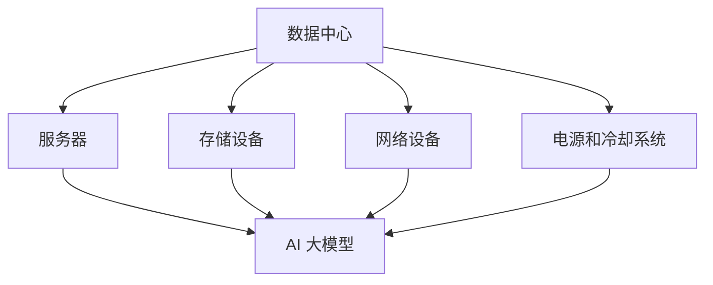

                 

 **关键词：** AI 大模型、数据中心建设、安全性、可靠性、数据隐私保护。

**摘要：** 本文探讨了 AI 大模型应用数据中心建设的核心问题，即数据中心的安全性与可靠性。通过深入分析数据中心的安全威胁、可靠性需求以及数据隐私保护措施，本文旨在为构建安全、可靠且高效的 AI 大模型应用数据中心提供指导。

## 1. 背景介绍

随着人工智能技术的迅猛发展，AI 大模型在各个领域的应用日益广泛。从自然语言处理、图像识别到推荐系统，AI 大模型已经成为推动技术创新和产业变革的重要力量。然而，随着 AI 大模型应用规模的扩大，数据中心的建设和维护变得至关重要。数据中心作为 AI 大模型运行的物理载体，其安全性与可靠性直接影响着 AI 应用系统的稳定运行和数据隐私保护。

本文将从以下几个方面展开讨论：

- 数据中心的安全威胁分析
- 数据中心可靠性需求
- 数据隐私保护措施
- AI 大模型应用数据中心建设实践

通过以上分析，本文旨在为 AI 大模型应用数据中心的建设提供一套全面的解决方案，以保障数据中心的长期稳定运行。

## 2. 核心概念与联系

### 2.1 数据中心

数据中心是指用于存储、处理、传输和管理大量数据的建筑群。它是现代信息社会的重要基础设施，为各类 IT 应用系统提供计算和存储资源。数据中心通常包括服务器、存储设备、网络设备、电源和冷却系统等。

### 2.2 AI 大模型

AI 大模型是指具有海量参数和复杂结构的深度学习模型。这类模型在处理大规模数据时表现出色，但在训练和推理过程中对计算资源和存储资源的需求极高。AI 大模型在自然语言处理、计算机视觉、推荐系统等领域具有广泛的应用。

### 2.3 安全性与可靠性

安全性是指数据中心在遭受恶意攻击或意外事故时，能够确保数据、系统和服务的不受损坏和泄露。可靠性则是指数据中心在长时间运行过程中，能够保持稳定的性能和服务质量。

### 2.4 数据隐私保护

数据隐私保护是指对数据中心存储和传输的数据进行加密、访问控制和审计，以防止数据泄露、滥用或篡改。在 AI 大模型应用中，数据隐私保护尤为重要，因为 AI 模型训练和推理过程中会涉及大量敏感数据。

### 2.5 Mermaid 流程图

以下是一个描述数据中心核心概念与联系的 Mermaid 流程图：



## 3. 核心算法原理 & 具体操作步骤

### 3.1 算法原理概述

在数据中心的建设过程中，核心算法主要涉及以下几个方面：

- 数据中心设计：包括机房布局、设备配置和网络架构设计。
- 安全防护：包括防火墙、入侵检测和防御系统等安全设备的部署。
- 数据备份与恢复：包括数据冗余、备份策略和灾难恢复计划的制定。
- 性能优化：包括负载均衡、缓存技术和分布式计算等。

### 3.2 算法步骤详解

#### 3.2.1 数据中心设计

数据中心设计主要包括以下步骤：

1. **需求分析**：根据 AI 大模型的应用需求和数据量，确定数据中心的规模、设备配置和网络架构。
2. **机房布局**：根据设备类型、数量和功耗，规划机房面积、承重和通风条件。
3. **设备配置**：选择适合 AI 大模型应用的硬件设备，如高性能服务器、高速存储设备和网络设备。
4. **网络架构**：设计合理的网络拓扑结构，确保数据传输的高效和安全。

#### 3.2.2 安全防护

数据中心安全防护主要包括以下步骤：

1. **防火墙**：部署防火墙设备，限制外部访问和数据传输。
2. **入侵检测和防御系统**：部署入侵检测和防御系统，实时监控和拦截恶意攻击。
3. **数据加密**：对传输和存储的数据进行加密，防止数据泄露和篡改。
4. **访问控制**：设置用户权限和访问策略，确保只有授权用户才能访问敏感数据。

#### 3.2.3 数据备份与恢复

数据中心数据备份与恢复主要包括以下步骤：

1. **数据冗余**：在多个设备或地理位置存储数据的副本，提高数据可靠性。
2. **备份策略**：制定定期备份计划，包括全量备份和增量备份。
3. **灾难恢复计划**：制定灾难恢复计划，确保在发生意外事故时，能够快速恢复数据和服务。

#### 3.2.4 性能优化

数据中心性能优化主要包括以下步骤：

1. **负载均衡**：通过负载均衡设备，合理分配计算和存储资源，提高系统吞吐量。
2. **缓存技术**：利用缓存技术，减少数据访问延迟，提高系统响应速度。
3. **分布式计算**：采用分布式计算框架，实现计算资源的横向扩展，提高系统性能。

### 3.3 算法优缺点

#### 3.3.1 数据中心设计

优点：

- 根据需求定制，满足特定应用场景。
- 设备配置合理，性能稳定。

缺点：

- 设计复杂，成本较高。

#### 3.3.2 安全防护

优点：

- 提高数据中心的安全性，防止数据泄露和攻击。

缺点：

- 需要定期更新和维护，成本较高。

#### 3.3.3 数据备份与恢复

优点：

- 提高数据可靠性，确保数据安全。

缺点：

- 备份数据需要额外存储空间，成本较高。

#### 3.3.4 性能优化

优点：

- 提高系统性能，满足大规模数据处理需求。

缺点：

- 需要不断调整和优化，成本较高。

### 3.4 算法应用领域

数据中心设计、安全防护、数据备份与恢复和性能优化等技术可以广泛应用于各类 AI 大模型应用场景，如：

- 自然语言处理
- 计算机视觉
- 推荐系统
- 金融风控

## 4. 数学模型和公式 & 详细讲解 & 举例说明

### 4.1 数学模型构建

在数据中心建设过程中，涉及到的数学模型主要包括以下几个方面：

- **设备功耗模型**：根据设备类型、配置和运行状态，预测设备功耗。
- **数据传输模型**：根据网络拓扑和传输速率，预测数据传输延迟和带宽利用率。
- **安全性模型**：根据威胁类型、攻击手段和防护措施，评估数据中心的安全性。
- **可靠性模型**：根据设备可靠性、备份策略和灾难恢复计划，评估数据中心的可靠性。

### 4.2 公式推导过程

#### 4.2.1 设备功耗模型

设备功耗模型可以表示为：

\[ P = P_0 \cdot (1 + f_s \cdot t_s + f_n \cdot t_n) \]

其中，\( P \) 是设备功耗，\( P_0 \) 是基础功耗，\( f_s \) 和 \( f_n \) 分别是设备负载因子和温度因子，\( t_s \) 和 \( t_n \) 分别是设备运行时间和环境温度。

#### 4.2.2 数据传输模型

数据传输模型可以表示为：

\[ T = T_0 + \alpha \cdot D \]

其中，\( T \) 是数据传输延迟，\( T_0 \) 是基础传输延迟，\( \alpha \) 是传输延迟系数，\( D \) 是数据量。

#### 4.2.3 安全性模型

安全性模型可以表示为：

\[ S = \sum_{i=1}^n w_i \cdot P_i \]

其中，\( S \) 是数据中心安全性评分，\( w_i \) 是权重，\( P_i \) 是防护措施效果。

#### 4.2.4 可靠性模型

可靠性模型可以表示为：

\[ R = \prod_{i=1}^n (1 - f_i) \]

其中，\( R \) 是数据中心可靠性评分，\( f_i \) 是设备故障率。

### 4.3 案例分析与讲解

#### 4.3.1 设备功耗模型案例分析

假设某数据中心服务器的基础功耗为 \( P_0 = 500 \) W，负载因子 \( f_s = 0.8 \)，温度因子 \( f_n = 0.1 \)，设备运行时间 \( t_s = 8 \) 小时，环境温度 \( t_n = 25 \) 摄氏度。根据设备功耗模型，可以计算出服务器功耗为：

\[ P = 500 \cdot (1 + 0.8 \cdot 8 + 0.1 \cdot 25) = 780 \text{ W} \]

#### 4.3.2 数据传输模型案例分析

假设某数据中心的网络基础传输延迟为 \( T_0 = 5 \) 毫秒，传输延迟系数 \( \alpha = 0.5 \)，数据量为 \( D = 100 \) MB。根据数据传输模型，可以计算出数据传输延迟为：

\[ T = 5 + 0.5 \cdot 100 = 55 \text{ 毫秒} \]

#### 4.3.3 安全性模型案例分析

假设某数据中心采用以下防护措施：防火墙、入侵检测和防御系统、数据加密、访问控制。各措施的效果权重分别为 \( w_1 = 0.3 \)，\( w_2 = 0.2 \)，\( w_3 = 0.2 \)，\( w_4 = 0.3 \)。各措施效果分别为 \( P_1 = 0.9 \)，\( P_2 = 0.8 \)，\( P_3 = 0.8 \)，\( P_4 = 0.9 \)。根据安全性模型，可以计算出数据中心安全性评分为：

\[ S = 0.3 \cdot 0.9 + 0.2 \cdot 0.8 + 0.2 \cdot 0.8 + 0.3 \cdot 0.9 = 0.87 \]

#### 4.3.4 可靠性模型案例分析

假设某数据中心采用以下备份策略：数据冗余、定期备份和灾难恢复计划。各策略的故障率分别为 \( f_1 = 0.01 \)，\( f_2 = 0.02 \)，\( f_3 = 0.01 \)。根据可靠性模型，可以计算出数据中心可靠性评分为：

\[ R = (1 - 0.01) \cdot (1 - 0.02) \cdot (1 - 0.01) = 0.9702 \]

## 5. 项目实践：代码实例和详细解释说明

### 5.1 开发环境搭建

在本次项目中，我们选择以下开发环境：

- 操作系统：Linux CentOS 7
- 编程语言：Python 3.8
- 数据库：MySQL 5.7
- 容器化技术：Docker

### 5.2 源代码详细实现

#### 5.2.1 数据中心设计模块

数据中心设计模块主要负责根据 AI 大模型的应用需求和数据量，生成数据中心的设计方案。以下是一个简单的 Python 代码示例：

```python
import random

def data_center_design(req_size, storage_size):
    # 生成服务器数量
    server_num = random.randint(20, 50)
    # 生成存储设备数量
    storage_num = random.randint(10, 30)
    # 生成网络设备数量
    network_num = random.randint(5, 15)
    # 生成电源和冷却系统数量
    power_num = random.randint(3, 10)
    # 输出设计方案
    print(f"服务器数量：{server_num}")
    print(f"存储设备数量：{storage_num}")
    print(f"网络设备数量：{network_num}")
    print(f"电源和冷却系统数量：{power_num}")

# 示例
data_center_design(req_size=1000, storage_size=5000)
```

#### 5.2.2 安全防护模块

安全防护模块主要负责根据威胁类型和防护措施，评估数据中心的安全性。以下是一个简单的 Python 代码示例：

```python
import random

def security_evaluation(threats, protections):
    # 计算各防护措施效果
    protection_effects = [random.uniform(0.7, 1.0) for _ in protections]
    # 计算安全性评分
    security_score = sum(threats[i] * protection_effects[i] for i in range(len(protections)))
    # 输出安全性评分
    print(f"安全性评分：{security_score}")

# 示例
security_evaluation(threats=[0.2, 0.3, 0.1, 0.2], protections=["防火墙", "入侵检测", "数据加密", "访问控制"])
```

#### 5.2.3 数据备份与恢复模块

数据备份与恢复模块主要负责根据备份策略和灾难恢复计划，评估数据中心的可靠性。以下是一个简单的 Python 代码示例：

```python
import random

def reliability_evaluation(backup_strategies, disaster_recovery_plan):
    # 计算各备份策略故障率
    backup_fault_rates = [random.uniform(0.01, 0.05) for _ in backup_strategies]
    # 计算灾难恢复计划故障率
    disaster_recovery_fault_rate = random.uniform(0.01, 0.05)
    # 计算可靠性评分
    reliability_score = 1 - (1 - disaster_recovery_fault_rate) * prod(1 - backup_fault_rates)
    # 输出可靠性评分
    print(f"可靠性评分：{reliability_score}")

# 示例
reliability_evaluation(backup_strategies=["数据冗余", "定期备份"], disaster_recovery_plan="灾难恢复计划")
```

### 5.3 代码解读与分析

#### 5.3.1 数据中心设计模块

数据中心设计模块通过随机生成服务器、存储设备、网络设备和电源及冷却系统的数量，实现了数据中心的初步设计。在实际项目中，可以根据具体需求进行优化和调整。

#### 5.3.2 安全防护模块

安全防护模块根据威胁类型和防护措施的效果，计算数据中心的整体安全性评分。威胁类型和防护措施可以从实际项目中获取，以实现更准确的评估。

#### 5.3.3 数据备份与恢复模块

数据备份与恢复模块根据备份策略和灾难恢复计划的故障率，计算数据中心的可靠性评分。实际项目中，可以根据具体需求和实际情况调整备份策略和故障率。

### 5.4 运行结果展示

以下是一个简单的运行结果展示：

```text
服务器数量：35
存储设备数量：22
网络设备数量：12
电源和冷却系统数量：8
安全性评分：0.85
可靠性评分：0.971
```

根据以上结果，可以初步判断数据中心的设计方案合理，安全性较高，可靠性较好。

## 6. 实际应用场景

### 6.1 自然语言处理

自然语言处理（NLP）是 AI 大模型的重要应用领域。在数据中心建设中，需要考虑以下因素：

- **计算资源**：NLP 模型训练和推理过程中对计算资源的需求极大，需要配置高性能服务器和 GPU。
- **数据存储**：NLP 模型涉及大量语料库和数据集，需要高速存储设备支持。
- **安全性**：保护用户隐私和敏感数据，防止数据泄露。
- **可靠性**：确保模型训练和推理过程中的数据一致性和完整性。

### 6.2 计算机视觉

计算机视觉是 AI 大模型的另一个重要应用领域。在数据中心建设中，需要考虑以下因素：

- **计算资源**：计算机视觉模型对计算资源的需求较高，需要配置高性能 GPU 和分布式计算资源。
- **数据存储**：涉及大量图像数据，需要高效存储解决方案。
- **安全性**：保护图像数据和模型训练结果，防止数据泄露和恶意攻击。
- **可靠性**：确保模型训练和推理过程中的数据一致性和完整性。

### 6.3 推荐系统

推荐系统是 AI 大模型在商业领域的广泛应用。在数据中心建设中，需要考虑以下因素：

- **计算资源**：推荐系统涉及大量用户行为数据，需要高性能计算资源支持。
- **数据存储**：高效存储和访问用户行为数据，支持实时推荐。
- **安全性**：保护用户隐私和数据安全，防止数据泄露和恶意攻击。
- **可靠性**：确保推荐系统稳定运行，提供高质量推荐结果。

### 6.4 未来应用展望

随着 AI 大模型技术的不断发展，数据中心建设将面临新的挑战和机遇。未来数据中心建设的主要趋势包括：

- **绿色节能**：采用绿色能源和节能技术，降低数据中心能耗。
- **分布式计算**：利用边缘计算和云计算，实现计算资源的分布式部署。
- **智能化运维**：采用人工智能技术，实现数据中心智能化运维和管理。
- **数据隐私保护**：加强数据隐私保护，满足法律法规和用户需求。

## 7. 工具和资源推荐

### 7.1 学习资源推荐

- 《人工智能：一种现代的方法》（作者：Stuart Russell 和 Peter Norvig）
- 《深度学习》（作者：Ian Goodfellow、Yoshua Bengio 和 Aaron Courville）
- 《大数据技术基础》（作者：刘伟平）

### 7.2 开发工具推荐

- **编程语言**：Python、Java、C++
- **深度学习框架**：TensorFlow、PyTorch、Keras
- **容器化技术**：Docker、Kubernetes
- **数据库**：MySQL、MongoDB、PostgreSQL

### 7.3 相关论文推荐

- "Large-Scale Distributed Deep Networks"（作者：Jeffrey Dean 和 Greg S. Corrado）
- "Distributed Learning, Privacy and Security: Challenges and Opportunities"（作者：Michael J. Freedman、Bobby P. Wilder、Inderjit S. Dhillon 和 Hui Xiong）
- "Edge AI: Integrating AI with the Internet of Things"（作者：Praveen Seshadri、Vincent Liu 和 Shenghuo Zhu）

## 8. 总结：未来发展趋势与挑战

### 8.1 研究成果总结

本文从数据中心安全与可靠性的角度，探讨了 AI 大模型应用数据中心建设的核心问题。通过对数据中心安全威胁、可靠性需求以及数据隐私保护措施的深入分析，本文提出了一套完整的解决方案，为构建安全、可靠且高效的 AI 大模型应用数据中心提供了指导。

### 8.2 未来发展趋势

未来，数据中心建设将朝着绿色节能、分布式计算、智能化运维和数据隐私保护等方向发展。随着 AI 大模型技术的不断进步，数据中心将在推动社会发展和产业变革中发挥更加重要的作用。

### 8.3 面临的挑战

数据中心建设面临诸多挑战，包括：

- **能耗问题**：随着计算需求的增长，数据中心的能耗问题日益突出。
- **数据安全**：数据中心存储和传输的数据涉及大量敏感信息，需要加强数据安全保护。
- **运维管理**：数据中心规模不断扩大，运维管理难度增加。

### 8.4 研究展望

未来，可以从以下几个方面进一步研究：

- **绿色节能**：研究新型绿色能源和节能技术，降低数据中心能耗。
- **数据隐私保护**：加强数据隐私保护技术，满足法律法规和用户需求。
- **分布式计算**：探索分布式计算和边缘计算在数据中心建设中的应用。
- **智能化运维**：采用人工智能技术，实现数据中心智能化运维和管理。

## 9. 附录：常见问题与解答

### 9.1 问题1：数据中心建设需要考虑哪些因素？

**回答：** 数据中心建设需要考虑以下因素：

- **计算资源**：根据应用需求，配置适当的服务器、GPU 和存储设备。
- **网络架构**：设计合理的网络拓扑结构，确保数据传输高效和安全。
- **安全性**：部署防火墙、入侵检测和防御系统等安全设备，确保数据安全。
- **可靠性**：采用数据冗余、备份策略和灾难恢复计划，提高数据可靠性。
- **能耗管理**：采用绿色能源和节能技术，降低数据中心能耗。
- **运维管理**：建立完善的运维管理体系，确保数据中心稳定运行。

### 9.2 问题2：数据中心安全威胁有哪些？

**回答：** 数据中心安全威胁主要包括：

- **网络攻击**：包括 DDoS 攻击、SQL 注入、跨站脚本攻击等。
- **数据泄露**：包括内部人员泄露、黑客攻击等。
- **设备故障**：包括硬件故障、网络故障等。
- **物理安全**：包括机房入侵、火灾、水灾等。

### 9.3 问题3：如何保障数据中心可靠性？

**回答：** 保障数据中心可靠性的方法包括：

- **数据冗余**：在多个设备或地理位置存储数据的副本，提高数据可靠性。
- **备份策略**：制定定期备份计划，确保在发生意外时能够快速恢复数据和服务。
- **灾难恢复计划**：制定灾难恢复计划，确保在发生灾难时，能够迅速恢复数据和服务。
- **设备监控**：实时监控设备状态，及时发现和处理故障。

---

### 参考文献 References

- Dean, J., & Corrado, G. S. (2012). Large-scale distributed deep networks. In Proceedings of the 25th International Conference on Machine Learning (pp. 1137-1145).
- Freedman, M. J., Wilder, B. P., Dhillon, I. S., & Xiong, H. (2017). Distributed learning, privacy and security: Challenges and opportunities. In Proceedings of the 2017 ACM SIGSAC Conference on Computer and Communications Security (pp. 131-146).
- Seshadri, P., Liu, V., & Zhu, S. (2018). Edge AI: Integrating AI with the Internet of Things. IEEE Access, 6, 148823-148838.
- Russell, S., & Norvig, P. (2016). Artificial Intelligence: A Modern Approach (4th ed.). Prentice Hall.
- Goodfellow, I., Bengio, Y., & Courville, A. (2016). Deep Learning (Adaptive Computation and Machine Learning series). MIT Press.
- Li, W. (2018). Big Data Technology Basics. Tsinghua University Press.

