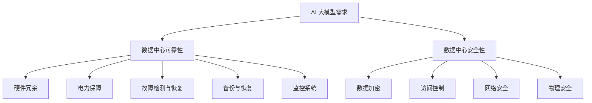

                 

关键词：AI 大模型、数据中心、安全性、可靠性、架构设计、技术方案、最佳实践

> 摘要：随着人工智能技术的快速发展，大模型在各个领域中的应用越来越广泛。本文将探讨如何建设一个安全可靠的数据中心来支撑 AI 大模型的应用，重点分析数据中心的安全性、可靠性和最佳实践。

## 1. 背景介绍

随着云计算、大数据、物联网等技术的兴起，数据中心成为了现代信息基础设施的核心。数据中心不仅是数据存储和处理的重要场所，也是企业业务运作的关键支撑。然而，随着数据中心规模的不断扩大和复杂度的增加，数据安全和可靠性成为了数据中心建设的关键挑战。

近年来，人工智能（AI）技术的快速发展，特别是大模型的应用，为各行各业带来了深远的影响。然而，AI 大模型的应用也对数据中心提出了更高的要求。大模型通常需要大量的计算资源和数据存储，同时其对数据的安全性和可靠性也提出了更高的要求。因此，如何建设一个安全可靠的数据中心来支撑 AI 大模型的应用，成为了当前数据中心建设的一个重要课题。

本文将围绕以下问题进行探讨：

- 如何评估和保障数据中心的安全性？
- 如何提升数据中心的可靠性？
- 数据中心在 AI 大模型应用中的最佳实践是什么？

## 2. 核心概念与联系

### 2.1 数据中心的基本概念

数据中心是指一种专门用于集中管理、存储、处理和分发数据的物理或虚拟设施。它通常包括服务器、存储设备、网络设备、安全设备等硬件，以及相关的软件和服务。数据中心的主要功能是提供高性能、高可靠性的计算和数据存储服务。

### 2.2 数据中心的安全性

数据中心的安全性是指保护数据中心内的数据、系统和资源不受未经授权的访问、篡改、破坏或泄露。数据安全是数据中心的核心需求，涉及数据加密、访问控制、网络安全、物理安全等多个方面。

### 2.3 数据中心的可靠性

数据中心的可靠性是指数据中心在长时间运行过程中，能够保持稳定、可靠的服务能力。可靠性涉及硬件故障、网络故障、电力故障、安全攻击等多种故障类型的应对能力。

### 2.4 AI 大模型与数据中心的关系

AI 大模型通常需要大量的计算资源和数据存储，因此其对数据中心的依赖性很强。数据中心的性能、安全性和可靠性直接影响 AI 大模型的应用效果。同时，AI 大模型的应用也对数据中心提出了更高的要求，如更高的计算性能、更严格的安全控制、更可靠的运行环境等。

### 2.5 数据中心安全与可靠性的 Mermaid 流程图

## 3. 核心算法原理 & 具体操作步骤

### 3.1 算法原理概述

数据中心的建

