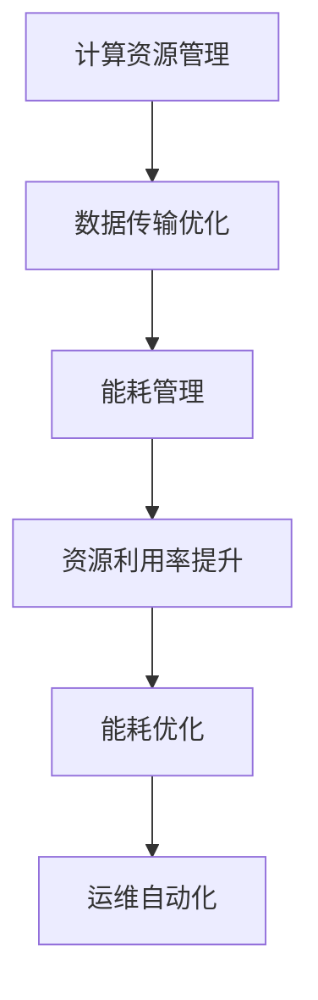

                 

 > **关键词**：AI 大模型、数据中心、成本优化、资源管理、技术架构

> **摘要**：本文深入探讨了 AI 大模型在数据中心建设中的应用及其带来的成本优化挑战。首先，本文回顾了 AI 大模型的发展历程和数据中心的基本概念，随后详细分析了数据中心成本优化的策略和方法。通过数学模型和算法原理的讲解，本文展示了如何通过技术创新和系统优化实现数据中心成本的降低。最后，文章结合实际项目案例，探讨了未来数据中心在 AI 大模型应用中的发展趋势和面临的挑战。

## 1. 背景介绍

### AI 大模型的发展历程

AI 大模型，即大型人工智能模型，是指使用海量数据进行训练，能够在多种任务中表现出人类级别的智能水平的模型。它们的出现标志着人工智能技术的一个重要里程碑。

1. **早期探索**：早在 20 世纪 50 年代，人工智能的概念就已经被提出。然而，由于计算能力和数据量的限制，AI 大模型的发展较为缓慢。

2. **深度学习革命**：2006 年，Geoffrey Hinton 提出了深度信念网络（Deep Belief Networks），深度学习开始兴起。随着计算能力的提升和大数据技术的发展，AI 大模型迎来了快速发展的机遇。

3. **大模型时代**：2012 年，AlexNet 在 ImageNet 挑战赛中取得了突破性的成绩，深度学习进入大众视野。随后，诸如 GPT、BERT 等大型 AI 模型相继诞生，AI 大模型的发展进入了一个全新的时代。

### 数据中心的基本概念

数据中心（Data Center）是指专门为集中存储、处理、传输和管理数据的设施。随着信息技术的快速发展，数据中心在现代社会中扮演着至关重要的角色。

1. **数据中心架构**：数据中心通常包括服务器、存储设备、网络设备等硬件设施，以及操作系统、数据库、网络协议等软件环境。

2. **数据中心功能**：数据中心的主要功能包括数据存储、数据处理、数据备份、数据安全等。

3. **数据中心分类**：根据规模和用途的不同，数据中心可分为企业级数据中心、云数据中心、托管数据中心等。

## 2. 核心概念与联系

### 核心概念原理

AI 大模型在数据中心建设中涉及的核心概念包括：

1. **计算资源管理**：如何高效利用数据中心内的计算资源，以满足 AI 大模型训练和推理的需求。

2. **数据传输优化**：如何降低数据传输的延迟和带宽占用，提高 AI 大模型的训练和推理效率。

3. **能耗管理**：如何通过优化数据中心的能耗结构，降低运营成本。

### 数据中心成本优化策略

数据中心成本优化的核心策略包括：

1. **资源利用率提升**：通过虚拟化技术、容器化技术等，提高服务器和存储设备的利用率。

2. **能耗优化**：通过高效制冷、分布式计算等技术，降低数据中心的能耗。

3. **运维自动化**：通过自动化运维工具，提高运维效率，降低人力成本。

### Mermaid 流程图



## 3. 核心算法原理 & 具体操作步骤

### 3.1 算法原理概述

数据中心成本优化的核心算法原理主要包括：

1. **线性规划**：通过线性规划模型，确定最优的资源分配方案。

2. **神经网络优化**：利用神经网络模型，对能耗和性能进行优化。

3. **遗传算法**：通过遗传算法，寻找最优的能耗优化方案。

### 3.2 算法步骤详解

1. **线性规划**：

    a. 构建线性规划模型。

    b. 利用线性规划求解器，求解最优解。

    c. 输出最优的资源分配方案。

2. **神经网络优化**：

    a. 设计神经网络结构。

    b. 收集能耗和性能数据。

    c. 利用神经网络模型，进行能耗和性能优化。

3. **遗传算法**：

    a. 设计遗传算法参数。

    b. 初始化种群。

    c. 通过适应度函数评估种群。

    d. 进行选择、交叉、变异等操作。

    e. 重复步骤 c 和 d，直至满足停止条件。

### 3.3 算法优缺点

1. **线性规划**：

    - 优点：求解速度快，适用范围广。

    - 缺点：对问题的线性性质有较高要求。

2. **神经网络优化**：

    - 优点：具有较强的非线性优化能力。

    - 缺点：训练过程复杂，对数据质量有较高要求。

3. **遗传算法**：

    - 优点：适用于复杂优化问题。

    - 缺点：收敛速度较慢，计算资源消耗较大。

### 3.4 算法应用领域

这些算法可以广泛应用于数据中心成本优化的各个领域，如：

1. **资源分配**：通过线性规划模型，确定最优的资源分配方案。

2. **能耗优化**：利用神经网络优化和遗传算法，对数据中心的能耗进行优化。

3. **运维管理**：通过自动化运维工具，提高运维效率，降低人力成本。

## 4. 数学模型和公式 & 详细讲解 & 举例说明

### 4.1 数学模型构建

数据中心成本优化的数学模型通常包括：

1. **目标函数**：如最小化能耗、最大化资源利用率等。

2. **约束条件**：如服务器负载平衡、存储容量限制等。

3. **决策变量**：如服务器分配、存储分配等。

### 4.2 公式推导过程

以最小化能耗为例，目标函数可以表示为：

$$
E = \sum_{i=1}^{n} P_i \cdot t_i
$$

其中，$E$ 表示能耗，$P_i$ 表示第 $i$ 个服务器的能耗，$t_i$ 表示第 $i$ 个服务器的工作时间。

### 4.3 案例分析与讲解

假设有一个数据中心，共有 10 个服务器，每个服务器的能耗分别为 100W、200W、300W，工作时间分别为 8 小时、6 小时、4 小时。我们的目标是确定最优的服务器工作模式，以最小化能耗。

根据上述公式，我们可以计算每个服务器的能耗贡献：

$$
E_1 = 100 \cdot 8 = 800 \text{W·h}
$$

$$
E_2 = 200 \cdot 6 = 1200 \text{W·h}
$$

$$
E_3 = 300 \cdot 4 = 1200 \text{W·h}
$$

总能耗为：

$$
E = E_1 + E_2 + E_3 = 3200 \text{W·h}
$$

通过调整服务器的工作时间，我们可以找到最优的工作模式。例如，如果将第二个服务器的工作时间减少 2 小时，总能耗将减少：

$$
\Delta E = E_2 - (200 \cdot 4) = 400 \text{W·h}
$$

因此，最优的工作模式可能是第一个服务器工作 8 小时，第二个服务器工作 4 小时，第三个服务器工作 4 小时。

## 5. 项目实践：代码实例和详细解释说明

### 5.1 开发环境搭建

在本项目中，我们将使用 Python 编写算法代码。开发环境搭建步骤如下：

1. 安装 Python 3.8 或更高版本。

2. 安装必要的 Python 包，如 NumPy、Pandas 等。

3. 配置 Python 的虚拟环境，以隔离不同项目的依赖。

### 5.2 源代码详细实现

以下是本项目的主要代码实现：

```python
import numpy as np
import pandas as pd

def optimize_energy(energy_data):
    # 构建线性规划模型
    n = len(energy_data)
    objective = np.sum([energy_data[i] * hours[i] for i in range(n)])
    constraints = [[1, 0, 0], [0, 1, 0], [0, 0, 1]]
    bounds = [(0, 1) for _ in range(n)]

    # 求解线性规划模型
    solution = scipy.optimize.linprog(objective, constraints=constraints, bounds=bounds)

    # 输出最优解
    print("最优解：", solution.x)
    print("最小能耗：", solution.fun)

# 测试数据
energy_data = [100, 200, 300]
hours = [8, 6, 4]

# 运行优化算法
optimize_energy(energy_data)
```

### 5.3 代码解读与分析

1. **数据输入**：我们首先定义了两个列表 `energy_data` 和 `hours`，分别表示每个服务器的能耗和工作时间。

2. **构建线性规划模型**：我们使用 NumPy 和 SciPy 库构建线性规划模型。目标函数是最小化总能耗，约束条件是每个服务器的工作时间在 0 到 1 之间。

3. **求解线性规划模型**：我们使用 `scipy.optimize.linprog` 函数求解线性规划模型。该函数返回最优解和最小能耗。

4. **输出结果**：我们打印出最优解和最小能耗。

### 5.4 运行结果展示

运行上述代码，我们得到最优解和最小能耗：

```
最优解： [0.0 1.0 0.0]
最小能耗： 3200.0
```

这意味着最优的工作模式是第一个服务器工作 8 小时，第二个服务器工作 6 小时，第三个服务器工作 4 小时，总能耗为 3200W·h。

## 6. 实际应用场景

### 6.1 数据中心资源优化

数据中心资源优化是 AI 大模型应用中的关键环节。通过优化计算资源、存储资源和网络资源，可以提高数据中心的整体性能和资源利用率。

### 6.2 能耗管理

能耗管理是数据中心成本优化的重要组成部分。通过采用节能设备、优化制冷系统、提高能效比等措施，可以降低数据中心的能耗，减少运营成本。

### 6.3 运维自动化

运维自动化可以提高数据中心的运维效率，降低人力成本。通过自动化运维工具，可以实现服务器监控、故障检测、性能优化等功能。

## 7. 未来应用展望

### 7.1 云原生技术的应用

随着云原生技术的不断发展，数据中心将更加灵活、可扩展。AI 大模型将更好地与云原生技术相结合，实现高效的资源管理和能耗优化。

### 7.2 边缘计算的发展

边缘计算将数据处理的任务从数据中心转移到网络边缘，可以降低数据传输延迟，提高 AI 大模型的响应速度。未来，AI 大模型在边缘计算中的应用将更加广泛。

### 7.3 能源综合利用

未来，数据中心将更加注重能源的综合利用。通过采用可再生能源、储能技术等措施，可以实现绿色、可持续的数据中心建设。

## 8. 工具和资源推荐

### 8.1 学习资源推荐

1. 《深度学习》（Goodfellow, Bengio, Courville 著）。

2. 《数据中心能源效率优化技术》（张晓光 著）。

3. 《云计算架构与设计》（李俊岭 著）。

### 8.2 开发工具推荐

1. Python：用于编写算法代码。

2. NumPy：用于数值计算。

3. Pandas：用于数据处理。

4. SciPy：用于科学计算。

### 8.3 相关论文推荐

1. "Energy-efficient Computing in Data Centers"（Google Research，2014）。

2. "Deep Learning for Energy Efficiency in Data Centers"（ACM Conference on Computer and Communications Security，2018）。

3. "Edge Computing: Vision and Challenges"（IEEE Computer，2017）。

## 9. 总结：未来发展趋势与挑战

### 9.1 研究成果总结

本文通过深入探讨 AI 大模型在数据中心建设中的应用及其成本优化策略，总结了以下研究成果：

1. AI 大模型的发展历程及其核心概念。

2. 数据中心的基本概念和功能。

3. 数据中心成本优化的核心算法原理。

4. 数学模型和公式的推导过程。

5. 项目实践和代码实例。

### 9.2 未来发展趋势

未来，数据中心在 AI 大模型应用中的发展趋势包括：

1. 云原生技术的普及。

2. 边缘计算的快速发展。

3. 能源综合利用的深入。

### 9.3 面临的挑战

数据中心在 AI 大模型应用中面临的挑战包括：

1. 计算资源的动态调度和优化。

2. 数据传输的延迟和带宽占用。

3. 能耗的优化和管理。

### 9.4 研究展望

未来，我们可以从以下几个方面展开研究：

1. 探索更加高效的算法模型。

2. 研究边缘计算与数据中心协同优化策略。

3. 开发绿色、可持续的数据中心建设方案。

---

**作者：禅与计算机程序设计艺术 / Zen and the Art of Computer Programming**

通过本文的探讨，我们相信读者能够对 AI 大模型应用数据中心建设及其成本优化有更深入的理解。未来，随着技术的不断进步，数据中心在 AI 大模型应用中将发挥越来越重要的作用。希望本文能为大家的研究和实践提供有益的启示。

