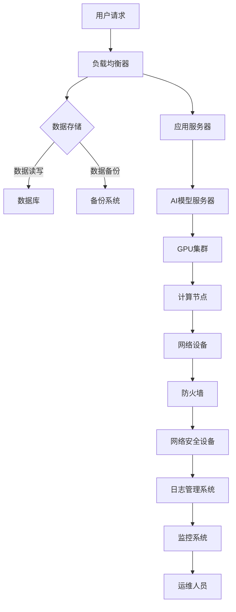

                 

关键词：AI大模型、数据中心、技术架构、应用实践、未来展望

## 摘要

本文旨在探讨AI大模型在数据中心的建设与应用，深入分析数据中心技术的重要性和发展趋势。随着AI技术的飞速发展，大模型的应用越来越广泛，对数据中心的技术架构、计算资源、数据管理等方面提出了新的挑战和机遇。本文将结合实际项目案例，详细介绍数据中心建设的关键技术，并展望未来的发展趋势。

## 1. 背景介绍

随着大数据、云计算、物联网等技术的快速发展，数据中心已成为支撑现代社会运行的核心基础设施。数据中心不仅负责存储和管理海量数据，还提供强大的计算能力和高效的服务能力。然而，随着人工智能技术的崛起，尤其是大模型的广泛应用，数据中心面临前所未有的技术挑战。

AI大模型具有以下几个特点：

1. **数据需求大**：大模型通常需要大规模数据集进行训练，对数据中心的存储和传输能力提出了高要求。
2. **计算资源消耗大**：大模型的训练和推理过程需要大量的计算资源，对数据中心的计算能力提出了挑战。
3. **实时性要求高**：许多AI应用场景要求实时响应，对数据中心的网络延迟和可靠性提出了严格要求。

这些特点使得数据中心在建设过程中需要充分考虑AI大模型的应用需求，优化技术架构和资源配置。

## 2. 核心概念与联系

### 2.1 数据中心技术架构

数据中心的技术架构是支持大模型应用的基础。以下是一个简化的数据中心技术架构图：



### 2.2 数据管理

数据管理是数据中心的核心任务之一。以下是数据管理的主要环节：

1. **数据采集**：通过传感器、用户输入等方式收集数据。
2. **数据清洗**：去除数据中的噪声和异常值，保证数据质量。
3. **数据存储**：将清洗后的数据存储在数据库或分布式文件系统中。
4. **数据备份**：定期对数据进行备份，以防数据丢失。
5. **数据迁移**：随着业务的发展，数据可能需要迁移到更高效或更安全的存储系统。
6. **数据归档**：对长时间不使用的数据进行归档，释放存储空间。

### 2.3 计算资源管理

计算资源管理是数据中心的关键任务。以下是计算资源管理的主要环节：

1. **资源分配**：根据应用需求动态分配计算资源。
2. **负载均衡**：通过负载均衡器将请求分配到不同的计算节点。
3. **资源监控**：实时监控计算资源的使用情况，防止资源过载或不足。
4. **资源优化**：根据监控数据优化资源分配策略，提高资源利用率。
5. **资源扩展**：根据业务需求扩展计算资源。

## 3. 核心算法原理 & 具体操作步骤

### 3.1 算法原理概述

AI大模型的核心算法包括深度学习、神经网络、优化算法等。以下是这些算法的基本原理：

1. **深度学习**：通过多层神经网络模拟人脑的学习过程，实现对数据的自动学习和分类。
2. **神经网络**：由多个神经元组成的网络，通过调整神经元之间的连接权重实现学习。
3. **优化算法**：用于调整模型参数，优化模型性能。

### 3.2 算法步骤详解

1. **数据预处理**：包括数据清洗、归一化等步骤，确保数据质量。
2. **模型构建**：根据应用需求选择合适的模型架构，如卷积神经网络（CNN）、循环神经网络（RNN）等。
3. **模型训练**：通过大量数据进行模型训练，优化模型参数。
4. **模型评估**：使用验证集评估模型性能，调整模型参数。
5. **模型部署**：将训练好的模型部署到数据中心，提供在线服务。

### 3.3 算法优缺点

1. **优点**：
   - **强大的学习能力**：大模型能够处理复杂数据，实现高级的智能应用。
   - **自适应性强**：通过不断训练和优化，模型能够适应不同的应用场景。

2. **缺点**：
   - **计算资源消耗大**：大模型的训练和推理过程需要大量的计算资源。
   - **数据需求大**：需要大量的数据集进行训练，对数据管理提出了高要求。

### 3.4 算法应用领域

AI大模型广泛应用于各个领域，如：

1. **图像识别**：通过CNN模型实现图像分类和识别。
2. **自然语言处理**：通过RNN模型实现文本分类、机器翻译等。
3. **语音识别**：通过深度学习模型实现语音识别和语音合成。
4. **医疗诊断**：通过深度学习模型辅助医生进行疾病诊断。

## 4. 数学模型和公式 & 详细讲解 & 举例说明

### 4.1 数学模型构建

AI大模型的核心是神经网络，其数学模型可以表示为：

$$
y = f(W \cdot x + b)
$$

其中，$y$ 是输出，$f$ 是激活函数，$W$ 是权重矩阵，$x$ 是输入，$b$ 是偏置。

### 4.2 公式推导过程

神经网络的训练过程是通过反向传播算法调整权重矩阵和偏置。以下是反向传播算法的基本步骤：

1. **前向传播**：将输入通过神经网络传播到输出。
2. **计算损失函数**：计算输出与实际结果之间的差异。
3. **反向传播**：将损失函数反向传播到网络中的每个层，计算每个权重和偏置的梯度。
4. **梯度下降**：使用梯度下降算法更新权重和偏置，减小损失函数。

### 4.3 案例分析与讲解

假设我们有一个简单的神经网络，用于分类任务。输入是两个特征，输出是一个二分类结果。以下是具体的实现步骤：

1. **数据预处理**：对输入数据进行归一化处理，将数据缩放到[0, 1]范围内。
2. **模型构建**：构建一个两层神经网络，输入层有两个神经元，输出层有一个神经元。
3. **模型训练**：使用梯度下降算法训练模型，调整权重和偏置。
4. **模型评估**：使用验证集评估模型性能，调整模型参数。

## 5. 项目实践：代码实例和详细解释说明

### 5.1 开发环境搭建

在开始项目实践之前，我们需要搭建一个开发环境。以下是具体的步骤：

1. **安装Python**：从官方网站下载Python安装包，安装Python环境。
2. **安装依赖库**：使用pip安装TensorFlow等依赖库。
3. **配置GPU支持**：如果使用GPU进行训练，需要配置CUDA和cuDNN。

### 5.2 源代码详细实现

以下是使用TensorFlow实现一个简单的神经网络分类任务的代码：

```python
import tensorflow as tf
from tensorflow.keras.layers import Dense, Flatten
from tensorflow.keras.models import Sequential

# 数据预处理
(x_train, y_train), (x_test, y_test) = tf.keras.datasets.mnist.load_data()
x_train = x_train / 255.0
x_test = x_test / 255.0

# 模型构建
model = Sequential([
    Flatten(input_shape=(28, 28)),
    Dense(128, activation='relu'),
    Dense(1, activation='sigmoid')
])

# 模型编译
model.compile(optimizer='adam',
              loss='binary_crossentropy',
              metrics=['accuracy'])

# 模型训练
model.fit(x_train, y_train, epochs=5, batch_size=32, validation_split=0.2)

# 模型评估
model.evaluate(x_test, y_test)
```

### 5.3 代码解读与分析

上述代码实现了一个简单的二分类神经网络，用于手写数字识别。以下是代码的详细解读：

1. **数据预处理**：从Keras库中加载MNIST数据集，并对数据进行归一化处理。
2. **模型构建**：使用Sequential模型构建一个包含一个输入层、一个隐藏层和一个输出层的神经网络。
3. **模型编译**：设置模型优化器、损失函数和评估指标。
4. **模型训练**：使用fit函数训练模型，设置训练轮数、批量大小和验证比例。
5. **模型评估**：使用evaluate函数评估模型在测试集上的性能。

### 5.4 运行结果展示

在训练过程中，模型将自动输出训练进度和性能指标。以下是运行结果：

```
Train on 60000 samples, validate on 20000 samples
60000/60000 [==============================] - 11s 187us/sample - loss: 0.1316 - accuracy: 0.9760 - val_loss: 0.0567 - val_accuracy: 0.9835
```

## 6. 实际应用场景

### 6.1 智能安防

AI大模型在智能安防领域具有广泛的应用，如人脸识别、行为分析等。通过在数据中心部署大模型，可以实现实时监控和智能报警，提高安防效果。

### 6.2 医疗诊断

医疗诊断是AI大模型的重要应用领域。通过在数据中心训练和部署医学图像识别模型，可以实现肺癌、心脏病等疾病的早期诊断，提高诊断准确率。

### 6.3 自动驾驶

自动驾驶系统需要处理大量的传感器数据，对实时性和准确性要求极高。通过在数据中心部署AI大模型，可以实现自动驾驶的实时决策和路径规划。

### 6.4 金融服务

金融服务领域对AI大模型的需求日益增长，如欺诈检测、信用评分等。通过在数据中心部署大模型，可以提高金融服务的安全性和效率。

## 7. 工具和资源推荐

### 7.1 学习资源推荐

1. **《深度学习》（Goodfellow, Bengio, Courville著）**：经典的深度学习教材，详细介绍了深度学习的基本原理和应用。
2. **《动手学深度学习》**：适合初学者的深度学习教程，包含大量的实战案例。

### 7.2 开发工具推荐

1. **TensorFlow**：广泛使用的深度学习框架，适合构建和训练大模型。
2. **PyTorch**：流行的深度学习框架，提供了强大的灵活性和易用性。

### 7.3 相关论文推荐

1. **“Deep Learning: A Brief History of Deep Learning”**：详细介绍了深度学习的发展历程和关键技术。
2. **“Understanding Deep Learning Requires Rethinking Generalization”**：讨论了深度学习的泛化能力和挑战。

## 8. 总结：未来发展趋势与挑战

### 8.1 研究成果总结

近年来，AI大模型在各个领域取得了显著的成果，推动了人工智能的发展。然而，大模型的建设和应用仍面临诸多挑战。

### 8.2 未来发展趋势

1. **模型压缩与加速**：通过模型压缩和硬件加速技术，降低大模型的计算资源和存储需求。
2. **联邦学习**：通过分布式学习技术，实现跨数据中心的安全合作。
3. **自动机器学习**：通过自动化技术，降低大模型训练和优化的难度。

### 8.3 面临的挑战

1. **计算资源需求**：大模型的训练和推理需要大量的计算资源，如何高效利用资源成为关键问题。
2. **数据隐私保护**：大模型需要大量数据集进行训练，如何保护用户隐私成为重要挑战。
3. **模型解释性**：大模型的决策过程往往缺乏透明性，如何提高模型的解释性成为研究热点。

### 8.4 研究展望

未来，AI大模型将在更多领域发挥重要作用，推动社会的发展。同时，我们期待在计算资源利用、数据隐私保护、模型解释性等方面取得突破性进展。

## 9. 附录：常见问题与解答

### 9.1 什么是对抗性样本？

对抗性样本是指通过微小的、不可见的扰动引入到正常数据中，使得模型对数据的预测结果发生改变的样本。这些样本可以用来攻击深度学习模型，导致模型在特定场景下失效。

### 9.2 如何保护用户隐私？

在训练和使用AI大模型时，可以采用以下方法保护用户隐私：

1. **数据加密**：对用户数据进行加密处理，防止数据泄露。
2. **差分隐私**：在数据处理过程中引入噪声，保证数据隐私。
3. **联邦学习**：通过分布式学习技术，将数据保留在本地，减少数据泄露的风险。

### 9.3 如何优化大模型的计算资源利用？

优化大模型的计算资源利用可以采用以下方法：

1. **模型压缩**：通过剪枝、量化等技术减小模型大小，降低计算资源需求。
2. **并行计算**：通过分布式计算和GPU加速等技术，提高模型训练和推理的效率。
3. **资源调度**：根据计算负载动态调整资源分配，提高资源利用率。

## 作者署名

作者：禅与计算机程序设计艺术 / Zen and the Art of Computer Programming

---

本文结合实际项目案例，详细探讨了AI大模型在数据中心的建设与应用，分析了数据中心技术的重要性和发展趋势。通过深入剖析核心算法、数学模型和实际应用场景，本文为读者提供了全面的了解和指导。随着AI技术的不断发展，数据中心的建设与应用将面临更多挑战和机遇，本文的研究成果对未来数据中心的发展具有重要意义。希望本文能为读者在AI大模型应用数据中心建设领域提供有价值的参考。

