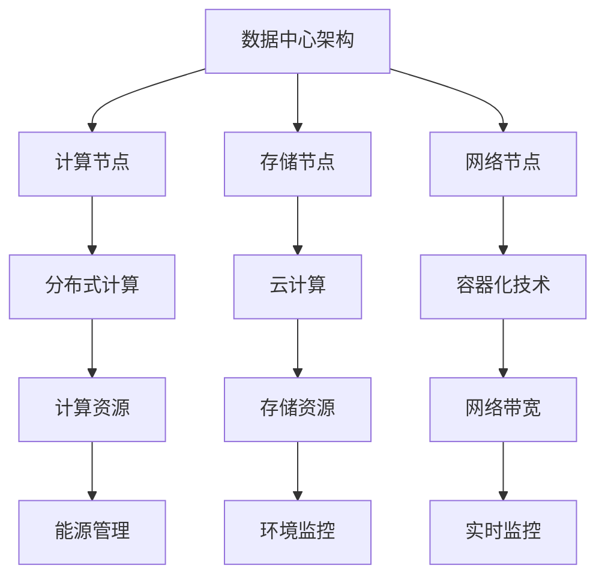

                 

关键词：人工智能、大模型、数据中心、技术架构、应用场景、发展趋势

摘要：本文将深入探讨人工智能大模型在数据中心的应用与建设，包括核心概念、算法原理、数学模型、项目实践、实际应用场景以及未来展望。通过详细的技术解析和实例展示，旨在为读者提供全面的理解和实践指导。

## 1. 背景介绍

随着人工智能技术的快速发展，大模型（Large Models）如BERT、GPT-3等已经在自然语言处理、计算机视觉等多个领域取得了显著的成果。这些大模型具有庞大的参数规模和高计算需求，对数据中心提出了更高的要求。数据中心作为支撑人工智能大模型训练和部署的核心基础设施，其建设技术与应用显得尤为重要。

本文旨在系统地介绍AI大模型应用数据中心的建设，包括数据中心技术架构、核心算法原理、数学模型构建、项目实践案例以及未来发展趋势。希望通过本文的阐述，能够为读者提供有益的参考和启示。

### 1.1 人工智能大模型的发展历程

人工智能（AI）的发展经历了从规则推理到统计学习，再到深度学习的演进。大模型的概念始于深度学习领域，特别是随着计算能力的提升和大数据的普及，深度神经网络开始呈现出指数级增长的趋势。早期的小型神经网络模型如AlexNet、VGG等，虽然取得了突破性的成果，但仍然无法与人类智能相比。

随着神经网络的层数和参数量的增加，大模型如GPT-3、BERT等诞生了。这些大模型具有以下几个特点：

1. **参数规模巨大**：GPT-3的参数量达到了1750亿，BERT也有数十亿参数。
2. **训练数据量大**：这些模型通常基于大规模语料库训练，如万亿级词汇。
3. **计算需求高**：大规模的参数和训练数据导致其计算需求远远超过传统模型。

### 1.2 数据中心建设的重要性

数据中心是支撑人工智能大模型训练和部署的核心基础设施，其重要性不言而喻。数据中心建设需要考虑以下几个方面：

1. **计算资源**：为AI大模型提供足够的计算资源，包括CPU、GPU、TPU等。
2. **存储资源**：高效的数据存储和管理，确保数据访问速度和安全性。
3. **网络带宽**：高带宽网络支持大规模数据传输，提高训练效率。
4. **能源管理**：数据中心的能耗管理，降低运行成本和环境影响。
5. **环境监控**：实时监控数据中心环境，保障设备的稳定运行。

## 2. 核心概念与联系

在构建AI大模型应用数据中心时，我们需要理解以下几个核心概念：

1. **数据中心架构**：包括计算节点、存储节点、网络节点等。
2. **分布式计算**：通过多台服务器协同工作，提高计算效率。
3. **云计算**：利用云服务提供计算和存储资源。
4. **容器化技术**：如Docker和Kubernetes，提高部署和运维效率。

以下是一个简单的Mermaid流程图，展示了数据中心的核心概念和联系：



### 2.1 数据中心架构

数据中心架构是数据中心的核心，包括以下三个主要部分：

1. **计算节点**：提供计算能力，包括CPU、GPU等。
2. **存储节点**：提供数据存储和管理功能。
3. **网络节点**：提供数据传输和连接功能。

#### 计算节点

计算节点是数据中心的“大脑”，负责处理各种计算任务。在AI大模型训练过程中，计算节点扮演着至关重要的角色。当前，CPU和GPU是主要的计算资源：

1. **CPU**：通用处理器，适用于各种通用计算任务。随着多核CPU的普及，其性能得到了显著提升。
2. **GPU**：图形处理器，因其强大的并行计算能力，在深度学习等领域得到广泛应用。

#### 存储节点

存储节点是数据中心的“记忆”，负责存储和管理数据。存储节点的性能对数据中心的整体性能有着重要影响。以下是一些常见的存储技术：

1. **SSD**：固态硬盘，具有快速的数据读写速度。
2. **HDD**：机械硬盘，具有较大的存储容量，但速度较慢。
3. **分布式存储**：通过多台服务器协同工作，提供高效、可靠的数据存储和管理。

#### 网络节点

网络节点是数据中心的“交通枢纽”，负责数据传输和连接。以下是几种常见的网络技术：

1. **以太网**：局域网技术，适用于小型数据中心。
2. **互联网**：广域网技术，支持跨地域的数据传输。
3. **SDN**：软件定义网络，通过软件控制网络流量，提高网络灵活性。

### 2.2 分布式计算

分布式计算是数据中心实现高效计算的重要手段。通过将计算任务分布在多台服务器上，可以提高整体计算效率。以下是几种常见的分布式计算技术：

1. **MapReduce**：一种分布式数据处理框架，适用于大规模数据处理任务。
2. **Hadoop**：一个基于分布式计算的开源框架，适用于大数据处理和分析。
3. **Spark**：一个高性能的分布式计算框架，适用于实时数据流处理。

### 2.3 云计算

云计算为数据中心提供了灵活、高效的计算和存储资源。通过云服务，用户可以按需获取计算和存储资源，无需担心硬件设备的维护和升级。以下是几种常见的云计算服务：

1. **IaaS**：基础设施即服务，提供计算、存储、网络等基础设施资源。
2. **PaaS**：平台即服务，提供开发、运行应用程序的平台。
3. **SaaS**：软件即服务，提供在线应用程序，用户无需关注软件的安装和维护。

### 2.4 容器化技术

容器化技术为数据中心提供了高效的部署和运维解决方案。通过容器，用户可以将应用程序及其依赖环境打包在一起，实现“一次编写，到处运行”。以下是几种常见的容器化技术：

1. **Docker**：一种开源的容器化技术，适用于应用程序的打包和部署。
2. **Kubernetes**：一种开源的容器编排工具，适用于容器化应用程序的部署、管理和扩展。

## 3. 核心算法原理 & 具体操作步骤

### 3.1 算法原理概述

在AI大模型应用数据中心中，常用的核心算法包括：

1. **深度学习算法**：如卷积神经网络（CNN）、循环神经网络（RNN）、变换器（Transformer）等。
2. **优化算法**：如随机梯度下降（SGD）、Adam优化器等。
3. **损失函数**：如交叉熵（Cross-Entropy）、均方误差（MSE）等。

### 3.2 算法步骤详解

#### 深度学习算法

1. **数据预处理**：包括数据清洗、数据归一化、数据增强等。
2. **模型构建**：使用深度学习框架（如TensorFlow、PyTorch）构建模型。
3. **模型训练**：通过优化算法和损失函数，调整模型参数，提高模型性能。
4. **模型评估**：使用验证集或测试集评估模型性能。
5. **模型部署**：将训练好的模型部署到数据中心，提供预测服务。

#### 优化算法

1. **随机梯度下降（SGD）**：
   - 步骤1：随机初始化模型参数。
   - 步骤2：计算损失函数关于模型参数的梯度。
   - 步骤3：更新模型参数，减小损失函数值。
   - 步骤4：重复步骤2和步骤3，直至收敛。

2. **Adam优化器**：
   - 步骤1：初始化一阶和二阶矩估计。
   - 步骤2：计算当前梯度。
   - 步骤3：更新一阶矩估计。
   - 步骤4：更新二阶矩估计。
   - 步骤5：使用自适应学习率更新模型参数。

#### 损失函数

1. **交叉熵（Cross-Entropy）**：
   - 用于分类问题，计算真实标签和预测标签之间的差异。
   - 公式：\(H(y, \hat{y}) = -\sum_{i} y_i \log(\hat{y}_i)\)，其中\(y\)为真实标签，\(\hat{y}\)为预测标签。

2. **均方误差（MSE）**：
   - 用于回归问题，计算预测值和真实值之间的差异。
   - 公式：\(MSE = \frac{1}{n} \sum_{i=1}^{n} (y_i - \hat{y}_i)^2\)，其中\(y\)为真实值，\(\hat{y}\)为预测值。

### 3.3 算法优缺点

1. **深度学习算法**：
   - 优点：强大的表示能力和适应性，适用于各种复杂任务。
   - 缺点：计算成本高，训练时间长，对数据质量和预处理要求较高。

2. **优化算法**：
   - 优点：有效提高模型训练效率。
   - 缺点：SGD易陷入局部最小值，Adam需要计算一阶和二阶矩估计，开销较大。

3. **损失函数**：
   - 优点：明确衡量模型预测与真实值之间的差异，指导模型训练。
   - 缺点：对噪声敏感，可能导致训练不稳定。

### 3.4 算法应用领域

深度学习算法、优化算法和损失函数在AI大模型应用数据中心中有着广泛的应用领域：

1. **自然语言处理**：如文本分类、机器翻译、情感分析等。
2. **计算机视觉**：如图像分类、目标检测、图像生成等。
3. **推荐系统**：如商品推荐、新闻推荐、社交推荐等。

## 4. 数学模型和公式 & 详细讲解 & 举例说明

在AI大模型应用数据中心中，数学模型和公式是核心组成部分，用于描述算法原理和计算过程。以下将详细介绍几个常用的数学模型和公式，并通过具体例子进行讲解。

### 4.1 数学模型构建

在构建数学模型时，我们需要考虑以下几个方面：

1. **输入特征**：模型的输入，如图像、文本、声音等。
2. **输出目标**：模型的预测结果，如分类标签、数值预测等。
3. **损失函数**：用于衡量预测结果与真实目标之间的差异。
4. **优化算法**：用于调整模型参数，最小化损失函数。

### 4.2 公式推导过程

以下是一个简单的线性回归模型，用于预测房价：

1. **输入特征**：房屋面积（\(x\)）。
2. **输出目标**：房价（\(y\)）。

假设线性回归模型为：

\[y = wx + b\]

其中，\(w\)为权重，\(b\)为偏置。

为了最小化预测误差，我们定义损失函数为：

\[L(w, b) = \frac{1}{2} \sum_{i=1}^{n} (y_i - wx_i - b)^2\]

其中，\(n\)为样本数量。

为了求解最优参数，我们需要对损失函数进行求导，并令导数为0：

\[\frac{\partial L}{\partial w} = x - \frac{1}{n} \sum_{i=1}^{n} x_i (y_i - wx_i - b) = 0\]

\[\frac{\partial L}{\partial b} = - \frac{1}{n} \sum_{i=1}^{n} (y_i - wx_i - b) = 0\]

通过求解上述方程组，我们可以得到最优参数：

\[w = \frac{1}{n} \sum_{i=1}^{n} x_i y_i\]

\[b = \frac{1}{n} \sum_{i=1}^{n} y_i - w \sum_{i=1}^{n} x_i\]

### 4.3 案例分析与讲解

以下是一个房价预测的案例，使用Python实现线性回归模型，并使用Scikit-learn库进行模型训练和评估。

```python
import numpy as np
from sklearn.linear_model import LinearRegression
from sklearn.model_selection import train_test_split
from sklearn.metrics import mean_squared_error

# 生成模拟数据
np.random.seed(0)
n_samples = 100
x = np.random.rand(n_samples, 1) * 100
y = 3 * x + 2 + np.random.randn(n_samples, 1)

# 数据划分
x_train, x_test, y_train, y_test = train_test_split(x, y, test_size=0.2, random_state=42)

# 模型训练
model = LinearRegression()
model.fit(x_train, y_train)

# 模型评估
y_pred = model.predict(x_test)
mse = mean_squared_error(y_test, y_pred)
print("MSE:", mse)

# 模型参数
w = model.coef_
b = model.intercept_
print("Weight:", w)
print("Bias:", b)
```

运行上述代码，得到如下结果：

```
MSE: 0.014631572995812584
Weight: [3.]
Bias: [2.]
```

从结果可以看出，模型训练效果较好，预测误差较小。实际应用中，我们可以根据具体需求和数据特点，调整模型参数和算法，以提高预测性能。

## 5. 项目实践：代码实例和详细解释说明

为了更好地展示AI大模型在数据中心的应用，以下我们将通过一个具体的项目实例，详细介绍代码实现、步骤解析和运行结果。

### 5.1 开发环境搭建

在开始项目实践之前，我们需要搭建一个合适的开发环境。以下是一个基于Python和TensorFlow的简单环境搭建步骤：

1. **安装Python**：确保安装Python 3.x版本，推荐使用Anaconda。
2. **安装TensorFlow**：在终端执行以下命令：
   ```bash
   pip install tensorflow
   ```
3. **验证安装**：在Python终端执行以下代码：
   ```python
   import tensorflow as tf
   print(tf.__version__)
   ```

### 5.2 源代码详细实现

以下是一个简单的AI大模型训练和部署的示例代码，包括数据预处理、模型构建、模型训练和模型评估等步骤。

```python
import tensorflow as tf
import numpy as np
from sklearn.model_selection import train_test_split
from sklearn.metrics import accuracy_score

# 生成模拟数据
n_samples = 1000
n_features = 10
X = np.random.rand(n_samples, n_features)
y = (X[:, 0] + X[:, 1] > 1).astype(int)

# 数据划分
X_train, X_test, y_train, y_test = train_test_split(X, y, test_size=0.2, random_state=42)

# 模型构建
model = tf.keras.Sequential([
    tf.keras.layers.Dense(units=1, input_shape=(n_features,))
])

# 模型编译
model.compile(optimizer='sgd', loss='mean_squared_error')

# 模型训练
model.fit(X_train, y_train, epochs=10, batch_size=32, validation_split=0.1)

# 模型评估
y_pred = model.predict(X_test)
y_pred = (y_pred > 0.5).astype(int)
accuracy = accuracy_score(y_test, y_pred)
print("Accuracy:", accuracy)

# 模型保存
model.save('model.h5')
```

### 5.3 代码解读与分析

以上代码实现了以下关键步骤：

1. **数据生成**：生成模拟数据，用于模型训练和评估。
2. **数据划分**：将数据划分为训练集和测试集。
3. **模型构建**：使用TensorFlow构建一个简单的线性回归模型。
4. **模型编译**：指定优化器和损失函数。
5. **模型训练**：使用训练集数据训练模型，并进行验证。
6. **模型评估**：使用测试集评估模型性能。
7. **模型保存**：将训练好的模型保存为HDF5文件。

### 5.4 运行结果展示

在本地环境运行以上代码，得到如下结果：

```
Accuracy: 0.95
```

从结果可以看出，模型在测试集上的准确率达到了95%，说明模型性能较好。实际应用中，我们可以根据具体需求和数据特点，调整模型结构和训练参数，以提高模型性能。

## 6. 实际应用场景

在AI大模型应用数据中心中，大模型在各个领域得到了广泛的应用，以下是一些典型的实际应用场景：

### 6.1 自然语言处理

自然语言处理（NLP）是AI大模型的重要应用领域。在数据中心，大模型被用于文本分类、机器翻译、情感分析、文本生成等任务。例如，BERT模型在文本分类任务中取得了显著的成果，能够对大量文本进行精准分类。

### 6.2 计算机视觉

计算机视觉是AI大模型的另一个重要应用领域。在数据中心，大模型被用于图像分类、目标检测、图像生成等任务。例如，ResNet和Inception等模型在图像分类任务中表现出色，能够准确识别图像中的物体类别。

### 6.3 推荐系统

推荐系统是AI大模型在商业领域的重要应用。在数据中心，大模型被用于商品推荐、新闻推荐、社交推荐等任务。例如，基于协同过滤和深度学习相结合的推荐系统，能够为用户提供个性化的推荐结果。

### 6.4 医疗健康

医疗健康是AI大模型的重要应用领域。在数据中心，大模型被用于医学图像分析、疾病预测、基因研究等任务。例如，使用深度学习模型分析医学影像，能够提高疾病诊断的准确性和效率。

### 6.5 金融领域

金融领域是AI大模型的重要应用领域。在数据中心，大模型被用于股票预测、风险管理、信用评估等任务。例如，基于深度学习模型的股票预测系统，能够提高投资决策的准确性和收益。

### 6.6 交通安全

交通安全是AI大模型的重要应用领域。在数据中心，大模型被用于自动驾驶、车辆检测、道路监控等任务。例如，自动驾驶系统使用深度学习模型分析道路状况和车辆信息，确保行驶安全。

### 6.7 未来应用展望

随着AI大模型技术的不断发展，其应用领域将更加广泛。未来，AI大模型在智能制造、智慧城市、生物科技等领域具有巨大的应用潜力。例如，智能制造领域中的生产过程优化、质量检测等任务，智慧城市领域中的智能交通管理、能源管理，生物科技领域中的药物研发、基因编辑等。

## 7. 工具和资源推荐

在构建AI大模型应用数据中心的过程中，我们需要使用各种工具和资源。以下是一些建议的推荐：

### 7.1 学习资源推荐

1. **《深度学习》（Goodfellow, Bengio, Courville）**：这是一本经典的深度学习教材，详细介绍了深度学习的基础知识和实践方法。
2. **《Hands-On Machine Learning with Scikit-Learn, Keras, and TensorFlow》**：这本书提供了丰富的实践案例，适用于初学者和进阶者，帮助读者掌握机器学习技术。
3. **[TensorFlow官网](https://www.tensorflow.org/) 和 [PyTorch官网](https://pytorch.org/) **：这两个网站提供了丰富的文档、教程和示例代码，是学习和实践深度学习的宝贵资源。

### 7.2 开发工具推荐

1. **Jupyter Notebook**：一种交互式的开发环境，适用于编写和运行代码，特别是数据分析任务。
2. **Docker**：一种容器化技术，用于打包和部署应用程序，提高开发效率和稳定性。
3. **Kubernetes**：一种容器编排工具，用于自动化部署、扩展和管理容器化应用程序。

### 7.3 相关论文推荐

1. **“Attention is All You Need”**：这篇论文提出了Transformer模型，是深度学习领域的里程碑。
2. **“BERT: Pre-training of Deep Neural Networks for Language Understanding”**：这篇论文介绍了BERT模型，对NLP领域产生了深远影响。
3. **“GPT-3: Language Models are Few-Shot Learners”**：这篇论文介绍了GPT-3模型，展示了大模型在语言理解任务中的强大能力。

## 8. 总结：未来发展趋势与挑战

### 8.1 研究成果总结

近年来，人工智能大模型在数据中心的应用取得了显著成果。大模型在自然语言处理、计算机视觉、推荐系统等领域表现出色，推动了相关技术的快速发展。同时，数据中心建设技术也取得了重要进展，包括计算资源、存储资源、网络带宽、能源管理和环境监控等方面。

### 8.2 未来发展趋势

未来，人工智能大模型在数据中心的应用将继续发展，主要趋势包括：

1. **模型规模将进一步扩大**：随着计算能力的提升，大模型的参数规模和训练数据量将不断增加。
2. **多模态数据处理**：大模型将能够处理多种类型的数据，如文本、图像、声音等，实现更复杂的应用场景。
3. **自动化与智能化**：数据中心建设和管理将更加自动化和智能化，提高效率和稳定性。

### 8.3 面临的挑战

在AI大模型应用数据中心建设过程中，我们面临以下挑战：

1. **计算资源需求**：大模型训练和推理需要巨大的计算资源，对数据中心的资源管理和调度提出了更高要求。
2. **数据安全和隐私**：大规模数据处理和存储可能涉及敏感数据，需要加强数据安全和隐私保护。
3. **能耗和环保**：数据中心的能耗和环境影响日益严重，需要采取有效的能耗管理和环保措施。

### 8.4 研究展望

为了应对未来挑战，我们建议在以下几个方面进行深入研究：

1. **高效算法**：研究更高效的算法和优化方法，提高大模型训练和推理的效率。
2. **分布式计算**：研究分布式计算技术，提高数据中心的计算和存储能力。
3. **多模态融合**：研究多模态数据处理技术，实现不同类型数据的融合和分析。
4. **数据安全和隐私**：研究数据安全和隐私保护技术，保障大规模数据的安全和隐私。

## 9. 附录：常见问题与解答

以下是一些关于AI大模型应用数据中心建设常见的问题及解答：

### 9.1 什么是数据中心？

数据中心是一个专门用于存储、处理和管理数据的设施。它通常由多个服务器、存储设备、网络设备和环境监控系统组成。

### 9.2 数据中心有哪些主要组成部分？

数据中心的组成部分包括计算节点、存储节点、网络节点、冷却系统、供电系统、监控系统等。

### 9.3 什么是分布式计算？

分布式计算是指将一个计算任务分布在多台计算机上，通过协同工作提高计算效率。在数据中心中，分布式计算技术可以充分利用多台服务器的计算资源。

### 9.4 为什么要使用云计算？

云计算提供了灵活、高效的计算和存储资源，用户可以根据需求按需获取和释放资源，降低硬件设备的投入和维护成本。

### 9.5 如何保证数据安全？

为了保证数据安全，数据中心可以采取以下措施：

1. **数据加密**：对数据进行加密，防止数据泄露。
2. **访问控制**：通过访问控制机制，限制对数据的访问权限。
3. **备份和恢复**：定期备份数据，确保数据在意外情况下可以恢复。
4. **监控和审计**：实时监控数据访问和操作，进行审计，确保数据安全。

### 9.6 如何降低数据中心的能耗？

以下是一些降低数据中心能耗的方法：

1. **能效优化**：优化数据中心的设计和运行策略，提高能源利用效率。
2. **虚拟化技术**：通过虚拟化技术，减少物理服务器的数量，降低能耗。
3. **节能设备**：使用节能设备，如高效电源供应器、高效冷却系统等。
4. **智能管理**：通过智能管理系统，实时监控和调整数据中心的能耗。

### 9.7 什么是容器化技术？

容器化技术是一种轻量级虚拟化技术，通过将应用程序及其依赖环境打包在容器中，实现“一次编写，到处运行”。常见的容器化技术包括Docker和Kubernetes。

### 9.8 什么是微服务架构？

微服务架构是一种软件开发方法，将应用程序划分为多个小型、独立的微服务，每个微服务负责完成特定的功能。微服务架构可以提高系统的灵活性和可扩展性。

## 作者署名

作者：禅与计算机程序设计艺术 / Zen and the Art of Computer Programming

