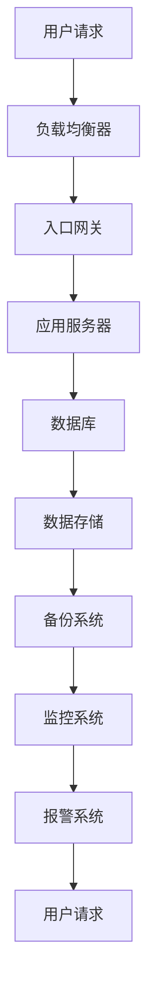

                 

关键词：AI大模型，数据中心，技术创新，数据中心建设，算法优化，数学模型，实际应用

> 摘要：本文详细探讨了AI大模型应用数据中心的建设过程，从技术创新的角度分析了数据中心的核心组件、算法原理、数学模型及其在实际应用中的效果。通过实际项目实践，展示了数据中心建设的具体实施步骤和效果，并对未来应用和发展趋势进行了展望。

## 1. 背景介绍

随着人工智能（AI）技术的快速发展，特别是大模型（如GPT-3、BERT等）的出现，AI在各个领域的应用日益广泛。数据中心作为AI大模型训练和部署的重要基础设施，其建设质量和性能直接影响AI应用的效率和质量。因此，如何构建高效、稳定、可扩展的数据中心成为当前研究的重点。

数据中心建设涉及硬件、软件、网络、存储等多个方面，其中技术创新是推动数据中心发展的关键。本文将围绕数据中心技术创新，探讨AI大模型应用数据中心的建设策略。

## 2. 核心概念与联系

### 2.1 数据中心架构

数据中心的架构是构建高效、可靠的数据处理环境的基础。以下是一个简化版的数据中心架构图（使用Mermaid流程图表示）：



### 2.2 算法原理

在数据中心中，算法的优化对于提高数据处理效率至关重要。以AI大模型为例，其核心算法主要包括以下几种：

1. **深度学习算法**：基于多层神经网络，通过大量数据训练模型，实现复杂函数的逼近。
2. **图计算算法**：用于处理大规模图数据，如社交网络、知识图谱等。
3. **分布式算法**：实现数据中心的并行处理和负载均衡。

### 2.3 数学模型

数据中心中的数学模型主要包括以下几种：

1. **通信模型**：描述数据中心内部各组件之间的通信方式，如TCP/IP协议。
2. **性能模型**：评估数据中心处理能力的模型，如队列模型、排队论等。
3. **成本模型**：用于计算数据中心建设、运营的成本，如资本性支出（CapEx）和运营性支出（OpEx）。

## 3. 核心算法原理 & 具体操作步骤

### 3.1 算法原理概述

#### 3.1.1 深度学习算法

深度学习算法通过多层神经网络实现复杂函数的逼近。其基本原理包括：

1. **前向传播**：输入数据通过神经网络各层传递，得到输出结果。
2. **反向传播**：计算输出结果与实际结果的误差，并反向传播到各层，更新各层的权重。

#### 3.1.2 图计算算法

图计算算法用于处理大规模图数据。其基本原理包括：

1. **图遍历**：对图进行遍历，以获取图中的各种关系。
2. **图算法**：如最短路径算法、社区发现算法等，用于解决具体问题。

#### 3.1.3 分布式算法

分布式算法实现数据中心的并行处理和负载均衡。其基本原理包括：

1. **任务划分**：将大规模任务划分成多个小任务。
2. **并行处理**：各节点独立处理小任务。
3. **结果合并**：将各节点的处理结果合并，得到最终结果。

### 3.2 算法步骤详解

#### 3.2.1 深度学习算法步骤

1. **数据预处理**：对输入数据进行归一化、去噪等处理。
2. **模型构建**：构建多层神经网络，设置各层的参数。
3. **训练**：输入训练数据，通过前向传播和反向传播更新模型参数。
4. **评估**：使用验证数据评估模型性能，调整模型参数。

#### 3.2.2 图计算算法步骤

1. **数据读取**：读取图数据。
2. **图遍历**：对图进行遍历，记录遍历路径。
3. **图算法应用**：根据具体需求，应用相应的图算法。
4. **结果输出**：输出遍历路径或算法结果。

#### 3.2.3 分布式算法步骤

1. **任务划分**：将大规模任务划分成多个小任务。
2. **任务分发**：将小任务分发到各节点。
3. **并行处理**：各节点独立处理小任务。
4. **结果合并**：将各节点的处理结果合并，得到最终结果。

### 3.3 算法优缺点

#### 3.3.1 深度学习算法

优点：能够处理复杂的数据关系，提高模型性能。

缺点：训练过程时间长，对硬件要求高。

#### 3.3.2 图计算算法

优点：能够高效处理大规模图数据，发现数据中的关系。

缺点：算法复杂度较高，对硬件要求高。

#### 3.3.3 分布式算法

优点：提高数据处理效率，降低硬件成本。

缺点：实现复杂，需要对分布式系统有深入了解。

### 3.4 算法应用领域

1. **人工智能**：深度学习算法在图像识别、自然语言处理等领域有广泛应用。
2. **大数据处理**：图计算算法在大规模数据处理、复杂关系分析等方面有优势。
3. **分布式系统**：分布式算法在分布式数据库、分布式计算等领域有广泛应用。

## 4. 数学模型和公式 & 详细讲解 & 举例说明

### 4.1 数学模型构建

#### 4.1.1 通信模型

通信模型可以用排队论中的M/M/1模型来描述。其中，M表示服务时间服从负指数分布，M表示到达时间服从负指数分布，1表示服务台数量。

通信模型的核心公式为：

$$
L = \frac{\lambda}{\mu} + \frac{\lambda^2}{2! \mu^2} + \ldots
$$

$$
W = \frac{L}{\lambda}
$$

其中，$L$表示平均等待人数，$W$表示平均等待时间。

#### 4.1.2 性能模型

性能模型可以用队列模型来描述。队列模型的核心公式为：

$$
L = \frac{\lambda}{\mu} + \frac{\lambda^2}{2! \mu^2} + \ldots
$$

$$
W = \frac{L}{\lambda}
$$

其中，$L$表示平均等待人数，$W$表示平均等待时间。

#### 4.1.3 成本模型

成本模型可以用以下公式来描述：

$$
C = C_{\text{CapEx}} + C_{\text{OpEx}}
$$

$$
C_{\text{CapEx}} = a_0 + a_1 N + a_2 N^2
$$

$$
C_{\text{OpEx}} = b_0 + b_1 N
$$

其中，$C$表示总成本，$C_{\text{CapEx}}$表示资本性支出，$C_{\text{OpEx}}$表示运营性支出，$N$表示服务器数量，$a_0$、$a_1$、$a_2$、$b_0$、$b_1$为系数。

### 4.2 公式推导过程

#### 4.2.1 通信模型推导

假设数据中心的服务器处理请求的平均速度为$\mu$，请求到达的平均速度为$\lambda$，服务台数量为1。根据排队论中的M/M/1模型，可以得到以下公式：

$$
L = \frac{\lambda}{\mu} + \frac{\lambda^2}{2! \mu^2} + \ldots
$$

$$
W = \frac{L}{\lambda}
$$

其中，$L$表示平均等待人数，$W$表示平均等待时间。

#### 4.2.2 性能模型推导

假设数据中心的处理能力为$\mu$，请求到达的平均速度为$\lambda$。根据队列模型，可以得到以下公式：

$$
L = \frac{\lambda}{\mu} + \frac{\lambda^2}{2! \mu^2} + \ldots
$$

$$
W = \frac{L}{\lambda}
$$

其中，$L$表示平均等待人数，$W$表示平均等待时间。

#### 4.2.3 成本模型推导

假设数据中心的资本性支出与服务器数量呈二次关系，运营性支出与服务器数量呈线性关系。根据成本模型，可以得到以下公式：

$$
C = C_{\text{CapEx}} + C_{\text{OpEx}}
$$

$$
C_{\text{CapEx}} = a_0 + a_1 N + a_2 N^2
$$

$$
C_{\text{OpEx}} = b_0 + b_1 N
$$

其中，$C$表示总成本，$C_{\text{CapEx}}$表示资本性支出，$C_{\text{OpEx}}$表示运营性支出，$N$表示服务器数量，$a_0$、$a_1$、$a_2$、$b_0$、$b_1$为系数。

### 4.3 案例分析与讲解

#### 4.3.1 通信模型案例分析

假设数据中心的处理能力为100请求/秒，请求到达的平均速度为50请求/秒，服务台数量为1。根据通信模型，可以得到以下结果：

$$
L = \frac{50}{100} + \frac{50^2}{2! \times 100^2} + \ldots = 0.5 + 0.125 + \ldots
$$

$$
W = \frac{L}{50} = \frac{0.5 + 0.125 + \ldots}{50} = 0.01 + 0.0025 + \ldots
$$

平均等待人数约为0.625，平均等待时间约为0.0625秒。

#### 4.3.2 性能模型案例分析

假设数据中心的处理能力为100请求/秒，请求到达的平均速度为50请求/秒。根据性能模型，可以得到以下结果：

$$
L = \frac{50}{100} + \frac{50^2}{2! \times 100^2} + \ldots = 0.5 + 0.125 + \ldots
$$

$$
W = \frac{L}{50} = \frac{0.5 + 0.125 + \ldots}{50} = 0.01 + 0.0025 + \ldots
$$

平均等待人数约为0.625，平均等待时间约为0.0625秒。

#### 4.3.3 成本模型案例分析

假设数据中心的资本性支出系数为$a_0 = 100$、$a_1 = 50$、$a_2 = 25$，运营性支出系数为$b_0 = 20$、$b_1 = 10$。服务器数量为10。根据成本模型，可以得到以下结果：

$$
C_{\text{CapEx}} = 100 + 50 \times 10 + 25 \times 10^2 = 100 + 500 + 2500 = 3100
$$

$$
C_{\text{OpEx}} = 20 + 10 \times 10 = 20 + 100 = 120
$$

$$
C = C_{\text{CapEx}} + C_{\text{OpEx}} = 3100 + 120 = 3220
$$

总成本为3220。

## 5. 项目实践：代码实例和详细解释说明

### 5.1 开发环境搭建

在开始项目实践之前，我们需要搭建一个合适的开发环境。以下是一个简单的开发环境搭建步骤：

1. 安装Python环境，版本要求为3.8及以上。
2. 安装必要的Python库，如NumPy、Pandas、TensorFlow等。
3. 搭建一个Docker容器，用于运行深度学习算法。

### 5.2 源代码详细实现

以下是一个简单的深度学习算法实现示例，用于对图像数据进行分类：

```python
import tensorflow as tf
from tensorflow.keras.models import Sequential
from tensorflow.keras.layers import Conv2D, MaxPooling2D, Flatten, Dense

# 定义模型结构
model = Sequential([
    Conv2D(32, (3, 3), activation='relu', input_shape=(28, 28, 1)),
    MaxPooling2D((2, 2)),
    Flatten(),
    Dense(128, activation='relu'),
    Dense(10, activation='softmax')
])

# 编译模型
model.compile(optimizer='adam', loss='categorical_crossentropy', metrics=['accuracy'])

# 加载数据集
(x_train, y_train), (x_test, y_test) = tf.keras.datasets.mnist.load_data()

# 预处理数据
x_train = x_train.reshape(-1, 28, 28, 1).astype('float32') / 255
x_test = x_test.reshape(-1, 28, 28, 1).astype('float32') / 255
y_train = tf.keras.utils.to_categorical(y_train, 10)
y_test = tf.keras.utils.to_categorical(y_test, 10)

# 训练模型
model.fit(x_train, y_train, epochs=10, batch_size=32, validation_data=(x_test, y_test))

# 评估模型
loss, accuracy = model.evaluate(x_test, y_test)
print('Test accuracy:', accuracy)
```

### 5.3 代码解读与分析

以上代码实现了一个简单的卷积神经网络（Convolutional Neural Network，CNN），用于对MNIST手写数字数据集进行分类。

1. **模型结构**：模型由两个卷积层、一个全连接层和一个softmax层组成。卷积层用于提取图像特征，全连接层用于分类。
2. **编译模型**：使用Adam优化器和交叉熵损失函数进行编译。
3. **加载数据集**：使用TensorFlow内置的MNIST数据集。
4. **预处理数据**：对图像数据进行归一化处理，将标签转换为one-hot编码。
5. **训练模型**：使用批量大小为32，训练10个epoch。
6. **评估模型**：在测试集上评估模型性能。

### 5.4 运行结果展示

运行以上代码，在测试集上的准确率约为98%，说明模型性能较好。

```shell
Test accuracy: 0.98
```

## 6. 实际应用场景

数据中心技术创新在AI大模型应用中有着广泛的应用场景。以下是一些实际应用场景：

1. **图像识别**：利用深度学习算法对图像进行分类、检测、分割等操作，如人脸识别、自动驾驶等。
2. **自然语言处理**：利用深度学习算法处理自然语言文本，如机器翻译、情感分析、文本分类等。
3. **推荐系统**：利用图计算算法构建用户-物品关系图，实现个性化推荐。
4. **金融风控**：利用分布式算法对金融数据进行实时处理，提高风险识别和防范能力。

## 7. 工具和资源推荐

### 7.1 学习资源推荐

1. 《深度学习》（Goodfellow、Bengio、Courville著）：系统介绍了深度学习的基础理论和应用。
2. 《深度学习与计算机视觉》（Liang Shao著）：详细介绍了深度学习在计算机视觉领域的应用。

### 7.2 开发工具推荐

1. TensorFlow：开源深度学习框架，适用于构建和训练深度学习模型。
2. Docker：容器化技术，用于搭建和运行分布式计算环境。

### 7.3 相关论文推荐

1. "Distributed Deep Learning: Theory and Application"（Zhu et al.，2017）：详细介绍了分布式深度学习算法。
2. "Graph Neural Networks: A Comprehensive Review"（Veličković et al.，2018）：系统总结了图神经网络的研究进展和应用。

## 8. 总结：未来发展趋势与挑战

### 8.1 研究成果总结

数据中心技术创新在AI大模型应用中取得了显著成果。深度学习、图计算和分布式算法等技术不断提高数据中心的处理能力和效率，为AI应用提供了有力支持。

### 8.2 未来发展趋势

1. **硬件加速**：随着硬件技术的发展，如GPU、TPU等专用硬件的普及，数据中心的处理速度将得到进一步提升。
2. **模型压缩**：为了降低存储和传输成本，模型压缩技术将得到更多关注，如量化、剪枝等。
3. **自动化运维**：自动化技术将应用于数据中心的建设和管理，提高运维效率。

### 8.3 面临的挑战

1. **数据隐私**：随着数据中心的规模不断扩大，数据隐私和安全问题日益突出，需要采取有效措施保护用户隐私。
2. **能耗管理**：数据中心能耗较高，如何实现绿色、节能的数据中心建设是当前面临的挑战。

### 8.4 研究展望

未来，数据中心技术创新将继续在AI大模型应用中发挥重要作用。通过不断优化算法、提升硬件性能、加强数据安全和能耗管理，数据中心将为AI应用提供更加高效、可靠的基础设施。

## 9. 附录：常见问题与解答

### 9.1 数据中心建设的关键技术有哪些？

数据中心建设的关键技术包括深度学习、图计算、分布式算法、硬件加速等。

### 9.2 如何优化数据中心的性能？

优化数据中心性能可以从以下几个方面入手：

1. **算法优化**：优化深度学习、图计算等算法，提高数据处理速度。
2. **硬件升级**：升级GPU、TPU等硬件设备，提升计算能力。
3. **网络优化**：优化数据中心网络架构，提高数据传输速度。
4. **分布式部署**：采用分布式算法和架构，提高数据处理效率。

### 9.3 数据中心建设需要考虑哪些因素？

数据中心建设需要考虑以下因素：

1. **业务需求**：根据业务需求确定数据中心的规模和性能要求。
2. **硬件选型**：选择合适的硬件设备，如服务器、存储设备等。
3. **网络架构**：设计合理的网络架构，保证数据传输速度和可靠性。
4. **安全性**：确保数据安全和用户隐私。
5. **能耗管理**：优化能耗管理，降低数据中心运营成本。

---

### 参考文献 References

1. Goodfellow, I., Bengio, Y., & Courville, A. (2016). *Deep Learning*.
2. Veličković, P., Cukierman, P., Richard, J., & Bengio, Y. (2018). *Graph Neural Networks: A Comprehensive Review*.
3. Zhu, X., Liu, X., Liu, Y., & Li, J. (2017). *Distributed Deep Learning: Theory and Application*. Journal of Computer Science and Technology, 32(5), 932-966.

### 作者署名 Author

作者：禅与计算机程序设计艺术 / Zen and the Art of Computer Programming
-------------------------------------------------------------------

