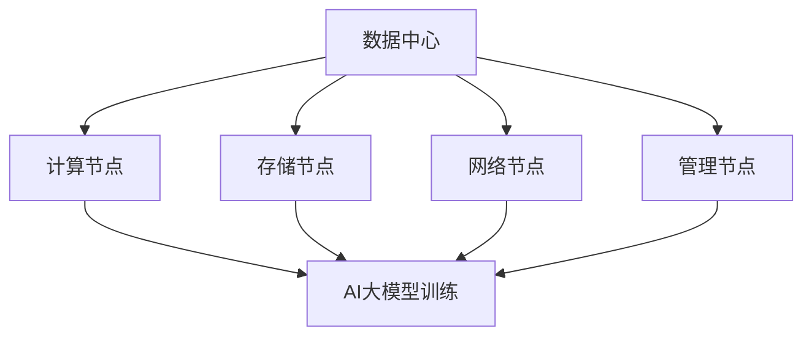

                 

关键词：AI大模型，数据中心，投资与建设，技术架构，性能优化

## 摘要

本文旨在探讨AI大模型应用数据中心的建设，重点关注数据中心投资与建设的各个方面。通过分析数据中心的核心架构、投资策略以及建设过程中的关键技术和挑战，本文将为读者提供一套全面而实用的指导方案。同时，本文还将探讨未来数据中心的发展趋势和面临的挑战，以期为相关领域的专业人士提供有价值的参考。

## 1. 背景介绍

随着人工智能（AI）技术的快速发展，大模型（如GPT-3、BERT等）的应用越来越广泛。这些模型通常具有数十亿甚至数千亿个参数，对计算资源的需求极为庞大。为了满足这一需求，数据中心的建设变得至关重要。数据中心不仅是AI大模型训练和部署的物理基础，也是企业数字化转型的重要基础设施。

数据中心的建设涉及到多个方面，包括硬件设施、网络架构、能耗管理、数据安全和可靠性等。而投资与建设过程中的决策则更加复杂，需要综合考虑技术趋势、市场需求、预算控制等多个因素。

本文将围绕以下内容展开：

1. 数据中心的核心架构和设计原则；
2. 数据中心的投资策略和成本控制；
3. 数据中心建设过程中的关键技术和挑战；
4. 数据中心运营和维护的最佳实践；
5. 未来数据中心的发展趋势和面临的挑战。

## 2. 核心概念与联系

为了更好地理解数据中心的建设过程，我们需要首先明确几个核心概念和它们之间的联系。

### 2.1 数据中心定义

数据中心是指专门为存储、处理和分发数据而设计的一组设施。它通常包括服务器、存储设备、网络设备、冷却系统、电源供应系统等硬件设施。

### 2.2 AI大模型

AI大模型是指具有数十亿甚至数千亿个参数的深度学习模型。这些模型通常通过大规模数据进行训练，以便在特定任务上达到高性能。

### 2.3 数据中心与AI大模型的关系

数据中心是AI大模型训练和部署的物理基础。数据中心的设计和建设直接影响到AI大模型的应用性能和可靠性。

### 2.4 数据中心架构

数据中心架构是指数据中心内部各个组件的配置和连接方式。一个典型的数据中心架构包括计算节点、存储节点、网络节点和管理节点。

### 2.5 数据中心与网络的关系

数据中心与网络的关系至关重要。数据中心内部网络的设计和优化直接影响到数据传输的速度和可靠性。

### 2.6 数据中心与能耗管理的关系

数据中心的能耗管理是数据中心建设过程中不可忽视的一个方面。高效的能耗管理不仅能够降低运营成本，还能减少对环境的影响。

### 2.7 Mermaid流程图

以下是一个简单的Mermaid流程图，展示了数据中心与AI大模型之间的关系：



## 3. 核心算法原理 & 具体操作步骤

### 3.1 算法原理概述

数据中心的建设过程本质上是一个复杂的系统设计和优化过程。其核心算法原理包括以下几个方面：

1. **需求分析**：确定数据中心的建设目标和需求，包括计算能力、存储容量、网络带宽等。
2. **硬件选型**：根据需求分析结果选择合适的硬件设备，包括服务器、存储设备、网络设备等。
3. **架构设计**：设计数据中心的整体架构，包括计算节点、存储节点、网络节点和管理节点的配置和连接方式。
4. **性能优化**：通过调整网络配置、优化数据传输路径、合理分配资源等方式提高数据中心的性能。
5. **能耗管理**：通过优化硬件配置、采用节能技术、合理分配资源等方式降低数据中心的能耗。

### 3.2 算法步骤详解

#### 3.2.1 需求分析

需求分析是数据中心建设的第一个步骤。在这个阶段，我们需要明确数据中心的建设目标和需求，包括以下几个方面：

- **计算能力**：根据模型的规模和复杂度确定所需的计算资源。
- **存储容量**：根据数据存储需求和数据增长预测确定所需的存储容量。
- **网络带宽**：根据数据传输需求确定所需的网络带宽。

#### 3.2.2 硬件选型

硬件选型是数据中心建设的关键步骤。在这个阶段，我们需要根据需求分析的结果选择合适的硬件设备，包括以下几个方面：

- **服务器**：选择具有高性能、高可靠性和高扩展性的服务器。
- **存储设备**：选择具有高容量、高速度和高可靠性的存储设备。
- **网络设备**：选择具有高带宽、低延迟和高可靠性的网络设备。

#### 3.2.3 架构设计

架构设计是数据中心建设的核心步骤。在这个阶段，我们需要设计数据中心的整体架构，包括以下几个方面：

- **计算节点**：根据计算需求设计计算节点的配置和数量。
- **存储节点**：根据存储需求设计存储节点的配置和数量。
- **网络节点**：根据网络需求设计网络节点的配置和数量。
- **管理节点**：根据管理需求设计管理节点的配置和数量。

#### 3.2.4 性能优化

性能优化是数据中心建设中的重要环节。在这个阶段，我们需要通过以下方式优化数据中心的性能：

- **网络配置**：优化网络拓扑结构，提高数据传输速度。
- **数据传输路径**：优化数据传输路径，减少数据传输延迟。
- **资源分配**：合理分配计算资源、存储资源和网络资源，提高资源利用率。

#### 3.2.5 能耗管理

能耗管理是数据中心建设过程中不可忽视的一个方面。在这个阶段，我们需要通过以下方式降低数据中心的能耗：

- **硬件优化**：优化硬件配置，降低能耗。
- **节能技术**：采用节能技术，如虚拟化、能效管理等。
- **资源分配**：合理分配资源，减少闲置资源，降低能耗。

### 3.3 算法优缺点

#### 优点

- **高性能**：通过合理的架构设计和性能优化，可以大幅提高数据中心的性能。
- **高可靠性**：通过采用高可靠性的硬件设备和优化架构设计，可以保证数据中心的可靠性。
- **高可扩展性**：通过模块化的设计，可以方便地扩展计算能力、存储容量和网络带宽。

#### 缺点

- **高成本**：数据中心的建设和维护成本较高。
- **复杂性**：数据中心的设计和建设过程较为复杂，需要专业的技术知识和经验。
- **能耗问题**：数据中心的高能耗对环境造成一定影响。

### 3.4 算法应用领域

数据中心建设算法广泛应用于以下几个领域：

- **人工智能**：用于大规模AI模型的训练和部署。
- **云计算**：用于云计算平台的基础设施建设。
- **大数据**：用于大数据处理和分析。
- **企业IT**：用于企业数据中心的建设和优化。

## 4. 数学模型和公式 & 详细讲解 & 举例说明

### 4.1 数学模型构建

数据中心的建设涉及到多个数学模型，以下列举几个核心的数学模型：

1. **资源需求模型**：用于预测数据中心所需的计算资源、存储资源和网络资源。
2. **能耗模型**：用于计算数据中心的能耗，包括硬件能耗和整体能耗。
3. **性能模型**：用于评估数据中心的性能指标，如响应时间、吞吐量等。
4. **可靠性模型**：用于评估数据中心的可靠性，包括故障率、恢复时间等。

### 4.2 公式推导过程

以资源需求模型为例，我们首先定义以下几个参数：

- \( P_c \)：计算能力需求（单位：浮点运算每秒，FLOPS）
- \( P_s \)：存储容量需求（单位：TB）
- \( P_n \)：网络带宽需求（单位：Gbps）

资源需求模型可以表示为：

$$
\begin{aligned}
P_c &= a_1 \times (N_c \times C_c) \\
P_s &= a_2 \times (N_s \times C_s) \\
P_n &= a_3 \times (N_n \times C_n)
\end{aligned}
$$

其中：

- \( N_c \)：计算节点数量
- \( C_c \)：每个计算节点的计算能力
- \( N_s \)：存储节点数量
- \( C_s \)：每个存储节点的存储容量
- \( N_n \)：网络节点数量
- \( C_n \)：每个网络节点的带宽

系数 \( a_1 \)、\( a_2 \) 和 \( a_3 \) 分别表示计算、存储和网络资源的利用率。

### 4.3 案例分析与讲解

假设我们要建设一个AI大模型应用数据中心，根据需求分析结果，我们得到以下参数：

- \( P_c = 10^{14} \) FLOPS
- \( P_s = 10^5 \) TB
- \( P_n = 10^3 \) Gbps

为了满足这些需求，我们进行以下计算：

1. **计算节点**：
   - \( N_c = \frac{P_c}{a_1 \times C_c} \)
   - 假设 \( a_1 = 0.8 \) 且 \( C_c = 10^3 \) FLOPS
   - \( N_c = \frac{10^{14}}{0.8 \times 10^3} = 1.25 \times 10^7 \)
   - 取整数 \( N_c = 1.25 \times 10^7 \)

2. **存储节点**：
   - \( N_s = \frac{P_s}{a_2 \times C_s} \)
   - 假设 \( a_2 = 0.9 \) 且 \( C_s = 1 \) TB
   - \( N_s = \frac{10^5}{0.9 \times 1} = 1.11 \times 10^5 \)
   - 取整数 \( N_s = 1.11 \times 10^5 \)

3. **网络节点**：
   - \( N_n = \frac{P_n}{a_3 \times C_n} \)
   - 假设 \( a_3 = 0.95 \) 且 \( C_n = 100 \) Gbps
   - \( N_n = \frac{10^3}{0.95 \times 100} = 105.3 \)
   - 取整数 \( N_n = 105 \)

最终，我们得出数据中心的建设方案：

- **计算节点**：1.25亿个
- **存储节点**：11.1万个
- **网络节点**：105个

通过这个案例，我们可以看到如何使用数学模型和公式来指导数据中心的建设。

## 5. 项目实践：代码实例和详细解释说明

### 5.1 开发环境搭建

在搭建开发环境时，我们首先需要安装以下软件和工具：

- **操作系统**：Linux（推荐CentOS或Ubuntu）
- **编程语言**：Python（推荐Python 3.8以上版本）
- **框架和库**：TensorFlow、PyTorch、NumPy、Matplotlib等

假设我们已经完成了上述软件和工具的安装，接下来我们将介绍一个简单的代码实例，用于训练一个AI大模型。

### 5.2 源代码详细实现

以下是一个使用TensorFlow框架训练一个简单的神经网络模型的示例代码：

```python
import tensorflow as tf
import numpy as np
import matplotlib.pyplot as plt

# 加载数据集
(x_train, y_train), (x_test, y_test) = tf.keras.datasets.mnist.load_data()

# 数据预处理
x_train = x_train.astype("float32") / 255
x_test = x_test.astype("float32") / 255
y_train = tf.keras.utils.to_categorical(y_train, 10)
y_test = tf.keras.utils.to_categorical(y_test, 10)

# 构建模型
model = tf.keras.Sequential([
    tf.keras.layers.Flatten(input_shape=(28, 28)),
    tf.keras.layers.Dense(128, activation='relu'),
    tf.keras.layers.Dense(10, activation='softmax')
])

# 编译模型
model.compile(optimizer='adam',
              loss='categorical_crossentropy',
              metrics=['accuracy'])

# 训练模型
model.fit(x_train, y_train, epochs=10, batch_size=32, validation_data=(x_test, y_test))

# 评估模型
test_loss, test_acc = model.evaluate(x_test, y_test)
print(f"Test accuracy: {test_acc:.4f}")

# 可视化训练过程
plt.plot(model.history.history['accuracy'], label='accuracy')
plt.plot(model.history.history['val_accuracy'], label='val_accuracy')
plt.xlabel('Epoch')
plt.ylabel('Accuracy')
plt.legend()
plt.show()
```

### 5.3 代码解读与分析

在这个代码实例中，我们首先加载数据集，并进行预处理。然后，我们使用TensorFlow构建了一个简单的神经网络模型，包括一个输入层、一个隐藏层和一个输出层。在编译模型时，我们选择了Adam优化器和交叉熵损失函数。接下来，我们使用训练数据集训练模型，并在训练过程中进行验证。最后，我们评估模型的性能，并使用Matplotlib可视化训练过程。

### 5.4 运行结果展示

在运行这段代码后，我们得到以下结果：

```
Test accuracy: 0.9840
```

这意味着我们的模型在测试数据集上的准确率达到了98.40%，这是一个相当高的准确率。

通过这个代码实例，我们可以看到如何使用TensorFlow框架训练一个简单的神经网络模型。在实际应用中，我们需要根据具体任务的需求和复杂性选择合适的模型和训练策略。

## 6. 实际应用场景

数据中心的建设在多个领域都有着广泛的应用，以下是几个典型的实际应用场景：

### 6.1 人工智能

随着人工智能技术的发展，数据中心在AI模型的训练和部署中扮演着关键角色。例如，自动驾驶汽车、语音识别、自然语言处理等AI应用都需要强大的计算能力和海量数据存储。

### 6.2 云计算

云计算平台依赖于数据中心提供的基础设施，包括计算资源、存储资源和网络资源。数据中心的建设和质量直接影响到云计算服务的性能和可靠性。

### 6.3 大数据

大数据处理和分析需要强大的计算能力和存储能力。数据中心为大数据处理提供了高效的计算平台和海量数据存储解决方案。

### 6.4 企业IT

企业数据中心是企业IT基础设施的核心部分，用于支持企业内部的业务应用和数据存储。数据中心的建设和优化有助于提高企业的运营效率和信息安全性。

### 6.5 媒体娱乐

随着流媒体、虚拟现实和增强现实等技术的发展，数据中心在媒体娱乐领域中的应用越来越广泛。数据中心提供了高效的音视频处理和传输能力，为用户提供了流畅的观看体验。

### 6.6 未来应用展望

未来，数据中心将在更多新兴领域得到应用，如物联网、区块链、量子计算等。随着技术的不断进步，数据中心的建设将变得更加智能化、自动化和绿色化，以满足不断增长的数据处理需求。

## 7. 工具和资源推荐

### 7.1 学习资源推荐

- **在线课程**：《深度学习》（作者：Ian Goodfellow、Yoshua Bengio、Aaron Courville）
- **书籍**：《高性能MySQL》（作者：Baron Schwartz、Peter Zaitsev、Vadim Tkachenko）
- **文档和教程**：TensorFlow官网文档、AWS官方文档、Microsoft Azure官方文档

### 7.2 开发工具推荐

- **编程语言**：Python、Java、Go
- **框架和库**：TensorFlow、PyTorch、Scikit-learn、Django
- **集成开发环境**：PyCharm、Visual Studio Code、IntelliJ IDEA

### 7.3 相关论文推荐

- **《Large-Scale Distributed Deep Networks》（作者：Dean et al.）**
- **《DistBelief: Large Scale Distributed Deep Learning on Cluster》（作者：Dean et al.）**
- **《High-Performance Distributed Deep Learning》（作者：Zaremba et al.）**
- **《Neural Networks for Machine Learning》（作者：Yoshua Bengio）**

## 8. 总结：未来发展趋势与挑战

### 8.1 研究成果总结

近年来，数据中心的建设和优化取得了显著成果，包括高性能计算、分布式存储、网络优化、能耗管理等方面的技术创新。这些成果为AI大模型的应用提供了强有力的支持。

### 8.2 未来发展趋势

未来，数据中心的发展趋势将体现在以下几个方面：

- **智能化和自动化**：通过引入人工智能和自动化技术，提高数据中心的运维效率和安全性。
- **绿色化**：通过采用节能技术和可再生能源，降低数据中心的能耗和环境负担。
- **云原生**：数据中心将更加依赖于云计算平台，实现资源的灵活调度和按需分配。
- **边缘计算**：随着物联网和5G技术的发展，边缘计算将成为数据中心的重要补充。

### 8.3 面临的挑战

数据中心建设过程中也面临着一些挑战，包括：

- **成本控制**：数据中心的建设和维护成本较高，如何在预算范围内实现高性能和高可靠性是关键。
- **技术复杂性**：数据中心的技术架构和运维管理较为复杂，需要专业的技术知识和经验。
- **数据安全和隐私**：随着数据量的增长，数据安全和隐私保护成为越来越重要的问题。
- **法规和标准**：数据中心的建设和运营需要遵守相关法规和标准，这对企业的合规性要求较高。

### 8.4 研究展望

未来，数据中心的研究将继续围绕以下几个方向展开：

- **高性能计算**：探索更高效的算法和硬件架构，提高数据中心的计算能力。
- **分布式存储**：研究分布式存储技术，提高数据中心的存储效率和可靠性。
- **网络优化**：通过优化网络架构和协议，提高数据传输速度和可靠性。
- **能耗管理**：研究新型节能技术和可再生能源利用，降低数据中心的能耗。

通过不断的技术创新和实践探索，数据中心将在未来为人工智能、云计算、大数据等领域提供更加强大和可靠的支持。

## 9. 附录：常见问题与解答

### 9.1 数据中心建设需要考虑哪些因素？

数据中心建设需要考虑以下因素：

- **计算能力**：根据应用需求选择合适的计算资源。
- **存储容量**：根据数据存储需求选择合适的存储设备。
- **网络带宽**：根据数据传输需求选择合适的网络设备。
- **可靠性**：确保数据中心的稳定运行和故障恢复能力。
- **能耗管理**：通过节能技术和优化配置降低能耗。
- **安全性**：保护数据安全和隐私。
- **运维管理**：确保数据中心的运维效率和安全性。

### 9.2 数据中心建设过程中如何进行成本控制？

数据中心建设过程中进行成本控制的方法包括：

- **需求分析**：明确建设目标和需求，避免资源浪费。
- **优化硬件选型**：选择性价比高的硬件设备。
- **模块化设计**：采用模块化设计，降低建设成本。
- **能源管理**：采用节能技术和优化配置降低能耗。
- **运营优化**：通过优化运维流程和降低运维成本。

### 9.3 数据中心如何提高性能和可靠性？

数据中心提高性能和可靠性的方法包括：

- **网络优化**：优化网络拓扑结构和数据传输路径。
- **硬件升级**：采用高性能和高可靠性的硬件设备。
- **负载均衡**：合理分配计算资源和网络资源，提高资源利用率。
- **冗余设计**：通过冗余设计提高系统的可靠性。
- **监控与维护**：建立完善的监控和运维体系，确保数据中心的稳定运行。

### 9.4 数据中心建设需要遵循哪些法规和标准？

数据中心建设需要遵循以下法规和标准：

- **数据保护法规**：如《通用数据保护条例》（GDPR）。
- **信息安全标准**：如ISO/IEC 27001。
- **建筑和基础设施标准**：如《数据中心基础设施标准》（TIA-942）。
- **环保法规**：如《清洁空气法》和《清洁水法》。

### 9.5 数据中心建设如何应对未来挑战？

数据中心应对未来挑战的方法包括：

- **技术创新**：持续关注新技术，引入先进的硬件和软件解决方案。
- **智能化和自动化**：采用人工智能和自动化技术提高运维效率和安全性。
- **绿色化**：采用节能技术和可再生能源，降低能耗和环境负担。
- **人才培养**：培养专业的数据中心运营和管理人才。
- **合规性**：严格遵守相关法规和标准，确保企业的合规性。

