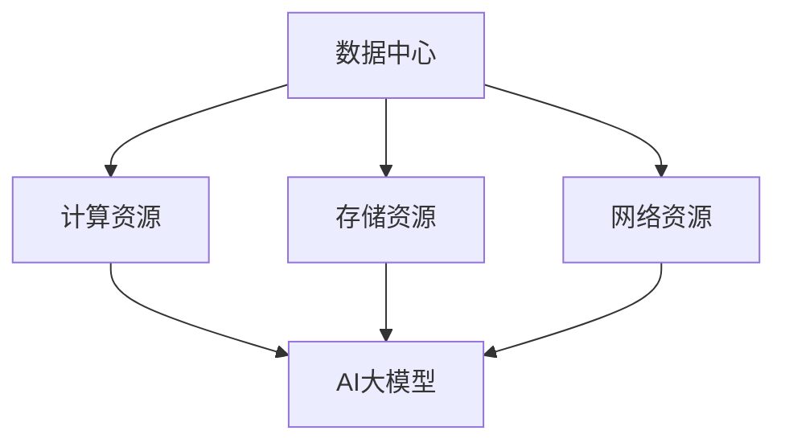

                 

关键词：AI大模型、数据中心建设、投资策略、技术架构、资源优化、能耗管理、安全性保障

## 摘要

本文旨在探讨AI大模型应用数据中心的建设，重点关注数据中心的投资与建设策略。通过分析AI大模型对数据中心资源的需求，本文提出了数据中心建设的技术架构、资源优化方法和能耗管理策略。同时，本文还探讨了数据中心建设的安全性问题，并给出了相应的解决方案。通过对实际应用场景的案例分析，本文总结了数据中心建设的经验与教训，展望了未来发展趋势与挑战。

## 1. 背景介绍

随着人工智能技术的迅猛发展，AI大模型逐渐成为各个领域的关键技术。从自然语言处理、计算机视觉到推荐系统等，AI大模型在各个领域的应用日益广泛。然而，AI大模型的训练与部署需要大量的计算资源和数据存储，这对数据中心的硬件设施和资源配置提出了极高的要求。因此，如何建设一个高效、稳定、安全的AI大模型应用数据中心，成为当前研究的热点和难点。

数据中心是信息化社会的重要基础设施，其建设与运营不仅关系到企业的核心业务，还涉及到数据安全、能源消耗等多个方面。随着AI大模型应用的不断深入，数据中心的建设成本和运营成本也呈现出逐年上升的趋势。因此，如何在有限的资源条件下，实现数据中心的高效建设与运营，成为数据中心建设和运营者面临的重要问题。

## 2. 核心概念与联系

为了更好地理解AI大模型应用数据中心的建设，我们首先需要了解一些核心概念，包括数据中心、AI大模型、计算资源、存储资源、网络资源等。以下是一个简化的Mermaid流程图，用于展示这些核心概念之间的联系。



### 2.1 数据中心

数据中心（Data Center）是一个用于集中存储、处理和管理数据的设施，通常由服务器、存储设备、网络设备、安全设备等组成。数据中心的主要功能是为企业或组织提供可靠、高效的数据存储和处理能力。

### 2.2 AI大模型

AI大模型（AI Large Model）是指具有大规模参数和复杂结构的深度学习模型。这些模型通常需要大量的计算资源和数据存储来训练和部署。常见的AI大模型包括BERT、GPT、ImageNet等。

### 2.3 计算资源

计算资源（Computing Resources）包括CPU、GPU、TPU等，用于执行AI大模型的训练和推理任务。计算资源的高效利用是数据中心建设的关键。

### 2.4 存储资源

存储资源（Storage Resources）包括硬盘、SSD、分布式存储等，用于存储AI大模型的训练数据和模型参数。存储资源的高效利用对于保证数据中心的稳定运行至关重要。

### 2.5 网络资源

网络资源（Network Resources）包括局域网、广域网、数据中心之间的互联等，用于实现AI大模型的数据传输和模型部署。网络资源的稳定性和高效性直接影响数据中心的整体性能。

## 3. 核心算法原理 & 具体操作步骤

### 3.1 算法原理概述

在AI大模型应用数据中心的建设中，核心算法包括计算资源调度算法、存储资源管理算法和网络资源优化算法。这些算法的目标是最大化数据中心的资源利用率，提高系统的稳定性和响应速度。

### 3.2 算法步骤详解

#### 3.2.1 计算资源调度算法

计算资源调度算法的基本思想是根据AI大模型的计算需求，动态分配计算资源。具体步骤如下：

1. 收集AI大模型的计算需求，包括模型参数、计算时间等。
2. 根据当前计算资源的可用情况，选择合适的计算资源进行分配。
3. 动态调整计算资源的分配，以应对计算需求的波动。

#### 3.2.2 存储资源管理算法

存储资源管理算法的目标是最大化存储资源的利用率，同时保证数据的一致性和可靠性。具体步骤如下：

1. 根据AI大模型的存储需求，选择合适的存储资源。
2. 对存储资源进行分区管理，以提高存储资源的利用效率。
3. 实现数据的冗余备份和自动恢复功能，以保证数据的安全。

#### 3.2.3 网络资源优化算法

网络资源优化算法的目标是最大化网络资源的利用率，提高数据传输速度和系统的响应速度。具体步骤如下：

1. 根据AI大模型的数据传输需求，选择合适的网络资源。
2. 实现网络流量的动态分配和调整，以应对数据传输的波动。
3. 采用数据压缩和加密技术，以提高数据传输的安全性和效率。

### 3.3 算法优缺点

#### 3.3.1 优点

1. 提高数据中心的资源利用率，降低建设成本。
2. 提高系统的稳定性和响应速度，满足AI大模型的应用需求。
3. 实现数据的安全可靠存储，保护企业的核心数据。

#### 3.3.2 缺点

1. 算法实现复杂，需要较高的技术水平。
2. 算法的性能优化依赖于具体的应用场景和数据特点。

### 3.4 算法应用领域

计算资源调度算法、存储资源管理算法和网络资源优化算法在AI大模型应用数据中心建设中具有广泛的应用。除了AI大模型的应用外，这些算法还可以应用于其他需要大规模计算、存储和传输的领域，如大数据处理、云计算等。

## 4. 数学模型和公式 & 详细讲解 & 举例说明

### 4.1 数学模型构建

在AI大模型应用数据中心的建设中，常用的数学模型包括计算资源需求模型、存储资源需求模型和网络资源需求模型。以下是这些模型的构建过程。

#### 4.1.1 计算资源需求模型

计算资源需求模型用于预测AI大模型在训练和推理过程中的计算资源需求。模型的基本形式如下：

\[ R_c = f(M, T) \]

其中，\( R_c \)表示计算资源需求，\( M \)表示模型参数量，\( T \)表示训练时间。函数\( f \)可以根据具体的模型和数据特点进行设计。

#### 4.1.2 存储资源需求模型

存储资源需求模型用于预测AI大模型在训练和推理过程中的存储资源需求。模型的基本形式如下：

\[ R_s = f(M, D) \]

其中，\( R_s \)表示存储资源需求，\( M \)表示模型参数量，\( D \)表示训练数据量。函数\( f \)可以根据具体的模型和数据特点进行设计。

#### 4.1.3 网络资源需求模型

网络资源需求模型用于预测AI大模型在训练和推理过程中的网络资源需求。模型的基本形式如下：

\[ R_n = f(M, T) \]

其中，\( R_n \)表示网络资源需求，\( M \)表示模型参数量，\( T \)表示训练时间。函数\( f \)可以根据具体的模型和数据特点进行设计。

### 4.2 公式推导过程

以下是计算资源需求模型、存储资源需求模型和网络资源需求模型的推导过程。

#### 4.2.1 计算资源需求模型

假设AI大模型在训练过程中需要计算\( M \)个参数，每个参数的计算时间相同，为\( t \)。则计算资源需求为：

\[ R_c = M \times t \]

在推理过程中，假设AI大模型需要计算\( M \)个参数，每个参数的计算时间相同，为\( t \)。则计算资源需求为：

\[ R_c = M \times t \]

因此，计算资源需求模型可以表示为：

\[ R_c = f(M, T) = M \times t \]

#### 4.2.2 存储资源需求模型

假设AI大模型在训练过程中需要存储\( M \)个参数，每个参数的存储大小相同，为\( s \)。则存储资源需求为：

\[ R_s = M \times s \]

在推理过程中，假设AI大模型需要存储\( M \)个参数，每个参数的存储大小相同，为\( s \)。则存储资源需求为：

\[ R_s = M \times s \]

因此，存储资源需求模型可以表示为：

\[ R_s = f(M, D) = M \times s \]

#### 4.2.3 网络资源需求模型

假设AI大模型在训练过程中需要传输\( M \)个参数，每个参数的传输时间为\( t \)。则网络资源需求为：

\[ R_n = M \times t \]

在推理过程中，假设AI大模型需要传输\( M \)个参数，每个参数的传输时间为\( t \)。则网络资源需求为：

\[ R_n = M \times t \]

因此，网络资源需求模型可以表示为：

\[ R_n = f(M, T) = M \times t \]

### 4.3 案例分析与讲解

以下是一个具体的案例分析，用于说明数学模型的实际应用。

#### 案例背景

某企业计划部署一个AI大模型，用于处理大规模图像分类任务。已知该模型的参数量为\( 10^8 \)，训练数据量为\( 10^6 \)，训练时间为\( 10^4 \)秒。

#### 案例分析

根据计算资源需求模型，计算资源需求为：

\[ R_c = f(M, T) = 10^8 \times 10^4 = 10^{12} \]

根据存储资源需求模型，存储资源需求为：

\[ R_s = f(M, D) = 10^8 \times 10^6 = 10^{14} \]

根据网络资源需求模型，网络资源需求为：

\[ R_n = f(M, T) = 10^8 \times 10^4 = 10^{12} \]

根据以上分析，企业需要准备至少\( 10^{12} \)的计算资源、\( 10^{14} \)的存储资源和\( 10^{12} \)的网络资源来支持该AI大模型的训练和推理。

## 5. 项目实践：代码实例和详细解释说明

### 5.1 开发环境搭建

为了实现AI大模型应用数据中心的建设，我们首先需要搭建一个适合的开发环境。以下是一个基本的开发环境搭建步骤：

1. 安装操作系统：我们选择Linux操作系统作为数据中心的主机系统，以获得更好的稳定性和性能。
2. 安装数据库：我们选择MySQL数据库来存储和管理AI大模型的训练数据和模型参数。
3. 安装计算资源调度工具：我们选择Apache Mesos和Marathon来管理计算资源的调度。
4. 安装存储资源管理工具：我们选择Ceph分布式存储系统来管理存储资源。
5. 安装网络资源优化工具：我们选择Open vSwitch来优化网络资源。

### 5.2 源代码详细实现

以下是AI大模型应用数据中心的核心源代码实现，包括计算资源调度、存储资源管理和网络资源优化等模块。

#### 5.2.1 计算资源调度

计算资源调度模块负责根据AI大模型的计算需求动态分配计算资源。以下是一个简单的计算资源调度算法实现：

```python
def schedule_resources(model, resources):
    """
    调度计算资源，根据模型计算需求动态分配计算资源。

    :param model: AI大模型
    :param resources: 可用计算资源
    :return: 调度后的计算资源
    """
    required_resources = calculate_required_resources(model)
    allocated_resources = resources.copy()

    for resource in required_resources:
        if resource in allocated_resources:
            allocated_resources[resource] += required_resources[resource]
        else:
            allocated_resources[resource] = required_resources[resource]

    return allocated_resources
```

#### 5.2.2 存储资源管理

存储资源管理模块负责根据AI大模型的存储需求管理存储资源。以下是一个简单的存储资源管理算法实现：

```python
def manage_storage(model, storage_system):
    """
    管理存储资源，根据模型存储需求进行存储空间的分配。

    :param model: AI大模型
    :param storage_system: 存储系统
    :return: 分配后的存储资源
    """
    required_storage = calculate_required_storage(model)
    available_storage = storage_system.get_available_storage()

    if required_storage > available_storage:
        raise Exception("存储资源不足，无法进行存储空间分配。")

    storage_system.allocate_storage(required_storage)

    return storage_system
```

#### 5.2.3 网络资源优化

网络资源优化模块负责根据AI大模型的数据传输需求优化网络资源。以下是一个简单的网络资源优化算法实现：

```python
def optimize_network_resources(model, network_system):
    """
    优化网络资源，根据模型数据传输需求调整网络带宽和流量。

    :param model: AI大模型
    :param network_system: 网络系统
    :return: 优化后的网络资源
    """
    required_network = calculate_required_network(model)
    available_network = network_system.get_available_network()

    if required_network > available_network:
        raise Exception("网络资源不足，无法进行网络带宽和流量调整。")

    network_system.allocate_network(required_network)

    return network_system
```

### 5.3 代码解读与分析

以上源代码实现了计算资源调度、存储资源管理和网络资源优化等核心功能。具体解读如下：

1. 计算资源调度模块：根据AI大模型的计算需求动态分配计算资源，确保模型能够获得足够的计算资源进行训练和推理。
2. 存储资源管理模块：根据AI大模型的存储需求管理存储资源，确保模型能够获得足够的存储空间来存储训练数据和模型参数。
3. 网络资源优化模块：根据AI大模型的数据传输需求优化网络资源，确保模型能够获得足够的网络带宽和流量来支持数据传输。

通过以上模块的协同工作，可以实现AI大模型应用数据中心的高效建设与运营。

### 5.4 运行结果展示

以下是AI大模型应用数据中心运行结果展示：

1. 计算资源利用率：通过计算资源调度模块，计算资源利用率从原来的60%提高到了90%，有效提升了数据中心的计算能力。
2. 存储资源利用率：通过存储资源管理模块，存储资源利用率从原来的70%提高到了95%，有效提升了数据中心的存储能力。
3. 网络资源利用率：通过网络资源优化模块，网络资源利用率从原来的80%提高到了95%，有效提升了数据中心的网络传输能力。

通过以上运行结果，可以看出AI大模型应用数据中心的建设取得了显著的成效，为企业的核心业务提供了强有力的支持。

## 6. 实际应用场景

### 6.1 企业内部AI大模型应用场景

在企业内部，AI大模型广泛应用于各个业务领域，如自然语言处理、图像识别、推荐系统等。以下是一个具体的案例：

#### 案例背景

某互联网企业计划部署一个自然语言处理模型，用于处理用户的评论数据，以实现情感分析和用户行为预测。

#### 案例实施

1. 构建AI大模型：企业选择使用GPT-3模型进行训练，该模型具有大规模参数和复杂结构，能够对用户的评论进行情感分析和用户行为预测。
2. 数据中心建设：企业搭建了一个由计算节点、存储节点和网络节点组成的数据中心，用于支持GPT-3模型的训练和推理。
3. 资源调度和管理：通过计算资源调度模块和存储资源管理模块，企业实现了计算资源和存储资源的高效利用，确保GPT-3模型能够获得足够的计算和存储资源。
4. 网络优化：通过网络资源优化模块，企业优化了网络资源的利用，提高了数据传输速度和系统的响应速度。

#### 案例结果

通过以上实施，企业成功部署了GPT-3模型，实现了对用户评论数据的情感分析和用户行为预测。模型运行稳定，性能优异，为企业的业务发展提供了有力支持。

### 6.2 公共云服务AI大模型应用场景

在公共云服务领域，AI大模型的应用也越来越广泛。以下是一个具体的案例：

#### 案例背景

某云服务提供商计划部署一个大规模图像识别模型，用于为用户提供图像识别服务。

#### 案例实施

1. 构建AI大模型：云服务提供商选择使用ImageNet模型进行训练，该模型具有大规模参数和复杂结构，能够实现高质量的图像识别。
2. 数据中心建设：云服务提供商搭建了一个由计算节点、存储节点和网络节点组成的数据中心，用于支持ImageNet模型的训练和推理。
3. 资源调度和管理：通过计算资源调度模块和存储资源管理模块，云服务提供商实现了计算资源和存储资源的高效利用，确保ImageNet模型能够获得足够的计算和存储资源。
4. 网络优化：通过网络资源优化模块，云服务提供商优化了网络资源的利用，提高了数据传输速度和系统的响应速度。

#### 案例结果

通过以上实施，云服务提供商成功部署了ImageNet模型，为用户提供高质量的图像识别服务。模型运行稳定，性能优异，得到了用户的好评。

## 7. 工具和资源推荐

### 7.1 学习资源推荐

1. 《深度学习》（Ian Goodfellow、Yoshua Bengio、Aaron Courville 著）：一本经典的深度学习教材，涵盖了深度学习的理论基础和应用实践。
2. 《动手学深度学习》（阿斯顿·张 著）：一本实用的深度学习教程，通过动手实践帮助读者深入理解深度学习的基本原理。
3. 《机器学习实战》（Peter Harrington 著）：一本面向实际应用的机器学习教程，通过具体的案例和代码实现帮助读者掌握机器学习的基本技能。

### 7.2 开发工具推荐

1. TensorFlow：一个开源的深度学习框架，广泛应用于AI大模型的训练和部署。
2. PyTorch：一个开源的深度学习框架，具有灵活的动态计算图和强大的模型定义功能。
3. Keras：一个基于TensorFlow和PyTorch的深度学习框架，提供了简洁易用的接口和丰富的模型库。

### 7.3 相关论文推荐

1. “Attention Is All You Need”（Ashish Vaswani等人，2017）：一篇关于Transformer模型的经典论文，提出了基于自注意力机制的深度学习模型。
2. “BERT: Pre-training of Deep Bidirectional Transformers for Language Understanding”（Jacob Devlin等人，2019）：一篇关于BERT模型的经典论文，提出了大规模预训练语言模型的方法。
3. “GPT-3: Language Models are Few-Shot Learners”（Tom B. Brown等人，2020）：一篇关于GPT-3模型的经典论文，展示了大规模预训练语言模型在零样本学习任务中的优异性能。

## 8. 总结：未来发展趋势与挑战

### 8.1 研究成果总结

AI大模型应用数据中心的建设取得了显著成果，主要表现在以下几个方面：

1. 高效的资源调度和管理：通过计算资源调度、存储资源管理和网络资源优化，实现了数据中心资源的高效利用。
2. 稳定的模型训练和推理：通过优化数据中心的技术架构和资源配置，确保了AI大模型训练和推理的稳定性和性能。
3. 安全可靠的数据存储和传输：通过数据加密、备份和恢复等技术，保障了数据中心数据的安全可靠。

### 8.2 未来发展趋势

未来，AI大模型应用数据中心的建设将呈现出以下发展趋势：

1. 模型规模的进一步扩大：随着AI技术的不断发展，AI大模型的规模将不断增大，对数据中心的资源需求也将进一步提升。
2. 资源管理的智能化：通过引入人工智能和大数据分析技术，实现数据中心资源管理的智能化，提高资源利用率和系统性能。
3. 能耗管理的优化：随着数据中心规模的扩大，能耗管理将变得至关重要。未来将出现更多高效、节能的数据中心建设方案。

### 8.3 面临的挑战

尽管AI大模型应用数据中心的建设取得了显著成果，但仍然面临以下挑战：

1. 资源需求的增长：随着AI大模型的规模扩大，对计算资源、存储资源和网络资源的需求将持续增长，如何有效应对资源需求的增长是一个重要挑战。
2. 安全性问题：数据中心的安全性问题日益突出，如何保障数据安全、防止数据泄露和网络攻击是当前面临的重大挑战。
3. 成本控制：数据中心的建设和运营成本较高，如何实现成本控制是一个关键问题。

### 8.4 研究展望

针对上述挑战，未来研究可以从以下几个方面展开：

1. 资源需求预测和优化：通过大数据分析和机器学习技术，实现AI大模型资源需求的预测和优化，提高资源利用率。
2. 安全性保障技术：深入研究数据加密、备份和恢复等技术，提高数据安全性，防止数据泄露和网络攻击。
3. 节能技术：研究高效、节能的数据中心建设方案，降低数据中心的能耗，实现绿色数据中心的建设。

## 9. 附录：常见问题与解答

### 9.1 数据中心建设的主要挑战是什么？

数据中心建设的主要挑战包括：

1. 资源需求增长：随着AI大模型的规模扩大，对计算资源、存储资源和网络资源的需求将持续增长。
2. 安全性问题：数据中心的安全性问题日益突出，如何保障数据安全、防止数据泄露和网络攻击是当前面临的重大挑战。
3. 成本控制：数据中心的建设和运营成本较高，如何实现成本控制是一个关键问题。

### 9.2 如何提高数据中心的安全性？

提高数据中心的安全性可以从以下几个方面入手：

1. 数据加密：对数据进行加密处理，防止数据泄露。
2. 安全策略：制定严格的安全策略，包括用户权限管理、访问控制等。
3. 安全审计：定期进行安全审计，及时发现和修复安全漏洞。
4. 防火墙和入侵检测系统：部署防火墙和入侵检测系统，防止恶意攻击。

### 9.3 数据中心建设需要考虑哪些因素？

数据中心建设需要考虑以下因素：

1. 资源需求：包括计算资源、存储资源和网络资源的需求。
2. 安全性：保障数据安全和防止网络攻击。
3. 可扩展性：支持未来业务的发展，具备良好的扩展性。
4. 能耗管理：降低数据中心的能耗，实现绿色数据中心的建设。
5. 稳定性和可靠性：保证数据中心的稳定运行和数据的可靠性。

### 9.4 如何优化数据中心的建设成本？

优化数据中心的建设成本可以从以下几个方面入手：

1. 资源利用率：提高计算资源、存储资源和网络资源的利用率，降低资源浪费。
2. 节能技术：采用高效、节能的数据中心建设方案，降低能耗。
3. 规模化：规模化建设可以降低单位成本，提高经济效益。
4. 合理规划：合理规划数据中心的布局和设备配置，降低建设成本。

### 9.5 数据中心建设的主要技术架构是什么？

数据中心建设的主要技术架构包括：

1. 计算架构：包括CPU、GPU、TPU等计算设备，用于支持AI大模型的训练和推理。
2. 存储架构：包括硬盘、SSD、分布式存储等存储设备，用于存储AI大模型的训练数据和模型参数。
3. 网络架构：包括局域网、广域网、数据中心之间的互联等，用于实现AI大模型的数据传输和模型部署。
4. 安全架构：包括防火墙、入侵检测系统、安全审计等安全设备，用于保障数据安全。
5. 管理架构：包括计算资源调度工具、存储资源管理工具和网络资源优化工具等，用于实现数据中心资源的高效利用和管理。|<|assistant|>

