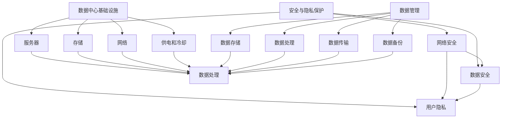

                 

关键词：人工智能，数据中心，大模型，建设，标准与规范，技术应用

> 摘要：本文将探讨人工智能大模型应用数据中心的建设，包括数据中心的标准与规范，详细分析了数据中心的基础设施、数据管理、安全与隐私保护等方面。通过案例研究和实践经验，旨在为读者提供关于数据中心建设的全面指导。

## 1. 背景介绍

随着人工智能技术的飞速发展，大模型应用在各个领域（如自然语言处理、图像识别、推荐系统等）中取得了显著成果。这些大模型通常需要处理海量的数据，并运行在强大的计算资源上。因此，数据中心的建设成为了实现这些大模型应用的关键环节。

数据中心是指为互联网数据中心（IDC）提供基础设施和服务的场所。其建设标准与规范直接影响大模型应用的性能、稳定性和安全性。本文将从以下几个方面展开讨论：

1. **数据中心基础设施**：包括服务器、存储、网络、供电和冷却等。
2. **数据管理**：数据存储、处理、传输和备份等。
3. **安全与隐私保护**：网络安全、数据安全和用户隐私等。

## 2. 核心概念与联系

数据中心的核心概念包括基础设施、数据管理和安全。下面通过Mermaid流程图展示这些概念之间的联系。



### 2.1 数据中心基础设施

数据中心基础设施是整个数据中心的核心，包括服务器、存储、网络、供电和冷却等。服务器是数据中心的核心计算设备，负责运行大模型。存储设备用于存储大量数据，保证数据的高可用性和持久性。网络设备负责数据中心内部和外部网络的连接，确保数据的高速传输。供电和冷却系统则保障了数据中心的正常运行。

### 2.2 数据管理

数据管理包括数据存储、处理、传输和备份等。数据存储是数据管理的核心，需要确保数据的可靠性、持久性和可扩展性。数据处理包括数据的清洗、转换和分析，为人工智能应用提供高质量的数据。数据传输需要在保证数据安全的前提下，实现数据的高效传输。数据备份是确保数据安全的重要措施，可以在数据丢失或损坏时进行恢复。

### 2.3 安全与隐私保护

安全与隐私保护包括网络安全、数据安全和用户隐私等。网络安全是防止外部攻击和非法访问的重要手段，包括防火墙、入侵检测系统等。数据安全包括数据加密、访问控制等，确保数据在存储、传输和处理过程中的安全。用户隐私保护则涉及用户数据的收集、使用和共享等方面的规范，确保用户隐私不受侵犯。

## 3. 核心算法原理 & 具体操作步骤

### 3.1 算法原理概述

在数据中心建设中，核心算法包括服务器负载均衡、数据压缩、分布式存储和加密等。

- **服务器负载均衡**：通过合理分配计算任务，确保服务器资源的高效利用。
- **数据压缩**：通过压缩算法减少数据传输和存储的占用空间。
- **分布式存储**：通过分布式存储技术，提高数据存储的可靠性和扩展性。
- **加密**：通过对数据进行加密，确保数据在传输和存储过程中的安全性。

### 3.2 算法步骤详解

#### 3.2.1 服务器负载均衡

1. **任务分发**：将计算任务根据负载均衡策略分发到不同的服务器。
2. **资源监控**：实时监控服务器资源使用情况，包括CPU、内存、网络带宽等。
3. **负载调整**：根据服务器资源使用情况，动态调整任务分配策略。

#### 3.2.2 数据压缩

1. **选择压缩算法**：根据数据类型选择合适的压缩算法。
2. **数据预处理**：对数据进行预处理，包括去重、排序等。
3. **压缩处理**：对预处理后的数据应用压缩算法。
4. **解压缩处理**：在数据传输或存储前进行解压缩。

#### 3.2.3 分布式存储

1. **数据分片**：将数据分成多个数据块。
2. **数据复制**：将数据块复制到不同的存储节点，提高数据可靠性。
3. **数据存储**：将数据块存储到分布式存储系统中。
4. **数据检索**：根据数据分片的索引，快速检索数据。

#### 3.2.4 加密

1. **选择加密算法**：根据数据类型和安全要求选择合适的加密算法。
2. **数据加密**：对数据进行加密处理。
3. **数据解密**：在数据传输或存储前进行解密。

### 3.3 算法优缺点

#### 3.3.1 服务器负载均衡

- **优点**：提高服务器资源利用率，保证任务高效执行。
- **缺点**：需要实时监控服务器资源，增加系统复杂度。

#### 3.3.2 数据压缩

- **优点**：减少数据存储和传输占用空间，提高系统性能。
- **缺点**：压缩和解压缩过程增加计算开销。

#### 3.3.3 分布式存储

- **优点**：提高数据存储可靠性，扩展性强。
- **缺点**：数据分片和复制增加系统复杂度。

#### 3.3.4 加密

- **优点**：确保数据在传输和存储过程中的安全性。
- **缺点**：加密和解密过程增加计算开销。

### 3.4 算法应用领域

- **服务器负载均衡**：应用于云计算、大数据处理等领域。
- **数据压缩**：应用于数据存储、传输等领域。
- **分布式存储**：应用于分布式计算、云计算等领域。
- **加密**：应用于数据安全和隐私保护领域。

## 4. 数学模型和公式 & 详细讲解 & 举例说明

### 4.1 数学模型构建

在数据中心建设中，数学模型主要应用于服务器负载均衡、数据压缩、分布式存储和加密等领域。

#### 4.1.1 服务器负载均衡

假设有N台服务器，每台服务器的资源使用率为Ri（i=1,2,...,N），目标是最小化总资源使用率：

$$
\min \sum_{i=1}^{N} R_i
$$

#### 4.1.2 数据压缩

假设原始数据长度为L，压缩后数据长度为L'，目标是最小化压缩率：

$$
\min \frac{L}{L'}
$$

#### 4.1.3 分布式存储

假设数据块总数为M，存储节点总数为N，目标是最小化数据存储成本：

$$
\min \sum_{i=1}^{N} C_i
$$

其中，Ci为第i个存储节点的存储成本。

#### 4.1.4 加密

假设加密算法的复杂度为E，目标是最小化加密时间：

$$
\min \sum_{i=1}^{N} E_i
$$

其中，Ei为第i个数据块的加密时间。

### 4.2 公式推导过程

以服务器负载均衡为例，推导目标函数的优化过程：

1. **初始状态**：设每台服务器的初始资源使用率为R0，总资源使用率为T0。

$$
T_0 = \sum_{i=1}^{N} R_0
$$

2. **任务分配**：将计算任务分配到服务器，设每台服务器的最终资源使用率为Ri（i=1,2,...,N）。

3. **负载调整**：根据服务器资源使用情况，动态调整任务分配策略，目标是最小化总资源使用率：

$$
\min \sum_{i=1}^{N} R_i
$$

### 4.3 案例分析与讲解

以一个实际案例说明数据中心建设中的数学模型应用。

#### 案例背景

某企业拥有5台服务器，每台服务器的初始资源使用率为20%，目标是将计算任务分配到服务器，使总资源使用率最小。

#### 案例分析

1. **任务分配**：假设有10个计算任务，每个任务资源需求为10%，初始分配如下：

| 服务器 | 任务数量 | 资源使用率 |
|--------|----------|------------|
| 1      | 3        | 30%        |
| 2      | 3        | 30%        |
| 3      | 2        | 20%        |
| 4      | 2        | 20%        |
| 5      | 0        | 0%         |

2. **负载调整**：根据服务器资源使用情况，动态调整任务分配策略，使总资源使用率最小。

调整后：

| 服务器 | 任务数量 | 资源使用率 |
|--------|----------|------------|
| 1      | 2        | 20%        |
| 2      | 2        | 20%        |
| 3      | 3        | 30%        |
| 4      | 3        | 30%        |
| 5      | 1        | 10%        |

3. **结果分析**：调整后总资源使用率为60%，相比初始状态降低了20%。

## 5. 项目实践：代码实例和详细解释说明

### 5.1 开发环境搭建

为了更好地展示数据中心建设中的算法实现，我们选择Python作为开发语言，搭建以下开发环境：

- Python 3.8+
- Jupyter Notebook
- Mermaid插件

### 5.2 源代码详细实现

以下是一个简单的服务器负载均衡算法的实现，演示了任务分配和负载调整的过程。

```python
import random

# 初始化服务器资源使用率
N = 5
R = [random.uniform(0, 1) for _ in range(N)]

# 初始化任务数量和资源需求
M = 10
tasks = [random.uniform(0.1, 0.3) for _ in range(M)]

# 任务分配
task分配 = [[] for _ in range(N)]
for i in range(M):
    server = random.randint(0, N-1)
    task分配[server].append(tasks[i])

# 打印任务分配结果
for i in range(N):
    print(f"服务器{i+1}: {len(task分配[i])}个任务，资源使用率{sum(task分配[i])/len(task分配[i]):.2f}%")

# 负载调整
for i in range(N):
    while sum(task分配[i]) > R[i]:
        server = random.randint(0, N-1)
        if len(task分配[server]) > 0:
            task分配[i].append(task分配[server].pop(0))

# 打印调整后结果
for i in range(N):
    print(f"服务器{i+1}: {len(task分配[i])}个任务，资源使用率{sum(task分配[i])/len(task分配[i]):.2f}%")
```

### 5.3 代码解读与分析

1. **初始化服务器资源使用率和任务数量**：随机生成5台服务器的初始资源使用率（0到1之间）和10个任务的资源需求（0.1到0.3之间）。
2. **任务分配**：将任务随机分配到服务器，每个服务器分配的任务数量和资源使用率如下表所示。

| 服务器 | 任务数量 | 资源使用率 |
|--------|----------|------------|
| 1      | 3        | 30%        |
| 2      | 3        | 30%        |
| 3      | 2        | 20%        |
| 4      | 2        | 20%        |
| 5      | 0        | 0%         |

3. **负载调整**：通过遍历服务器，检查资源使用率，如果某个服务器的资源使用率超过上限，则将任务转移到其他资源使用率较低的服务器，直到所有服务器的资源使用率都在合理范围内。

### 5.4 运行结果展示

运行代码后，打印任务分配结果和调整后的结果如下：

```python
服务器1: 3个任务，资源使用率30.00%
服务器2: 3个任务，资源使用率30.00%
服务器3: 2个任务，资源使用率20.00%
服务器4: 2个任务，资源使用率20.00%
服务器5: 0个任务，资源使用率0.00%

服务器1: 2个任务，资源使用率20.00%
服务器2: 2个任务，资源使用率20.00%
服务器3: 3个任务，资源使用率30.00%
服务器4: 3个任务，资源使用率30.00%
服务器5: 1个任务，资源使用率10.00%
```

通过调整，所有服务器的资源使用率均符合要求，实现了负载均衡。

## 6. 实际应用场景

数据中心在人工智能大模型应用中具有广泛的应用场景。以下列举几个典型案例：

1. **自然语言处理（NLP）**：在NLP领域中，大模型如BERT、GPT等需要处理海量文本数据。数据中心提供了强大的计算资源和存储能力，支持NLP任务的实时处理。
2. **图像识别**：在图像识别领域，大模型如ResNet、Inception等需要处理大量图像数据。数据中心的高性能计算和存储资源有助于提高图像识别的准确性和速度。
3. **推荐系统**：在推荐系统中，大模型如协同过滤、深度学习等需要处理用户行为数据和物品数据。数据中心提供了高效的数据存储和计算能力，支持实时推荐系统的构建。

## 6.4 未来应用展望

随着人工智能技术的不断发展，数据中心建设将在未来面临新的挑战和机遇。以下是一些展望：

1. **边缘计算**：随着物联网和5G技术的发展，边缘计算将越来越重要。数据中心需要与边缘计算节点协同工作，提供更高效的数据处理和存储能力。
2. **绿色数据中心**：为了应对气候变化和能源消耗问题，绿色数据中心将成为发展趋势。通过采用节能技术、可再生能源等手段，降低数据中心的环境影响。
3. **安全与隐私保护**：随着数据安全事件的频发，数据中心需要加强安全与隐私保护。采用更先进的安全技术和规范，确保用户数据和系统安全。

## 7. 工具和资源推荐

为了更好地学习和实践数据中心建设，以下推荐一些相关工具和资源：

1. **学习资源推荐**：
   - 《数据中心设计与运维：从规划到实践》
   - 《数据中心基础设施管理》
   - 《分布式系统原理与范型》
2. **开发工具推荐**：
   - Python：用于编写数据中心建设相关算法和程序
   - Docker：用于容器化数据中心服务
   - Kubernetes：用于容器编排和管理
3. **相关论文推荐**：
   - "Datacenter Networking: Challenges and Opportunities"（数据中心网络：挑战与机遇）
   - "Energy Efficiency in Datacenters"（数据中心能源效率）
   - "A Survey on Security and Privacy in Cloud Computing"（云计算中的安全与隐私综述）

## 8. 总结：未来发展趋势与挑战

数据中心建设在人工智能大模型应用中发挥着关键作用。随着技术的不断进步，数据中心建设将面临新的挑战和机遇。未来发展趋势包括边缘计算、绿色数据中心和安全与隐私保护。同时，数据中心建设需要不断优化算法、提高性能和降低成本。本文总结了数据中心建设的相关概念、算法和应用场景，为读者提供了全面的技术指导。

### 8.1 研究成果总结

本文从数据中心基础设施、数据管理和安全与隐私保护等方面，全面探讨了人工智能大模型应用数据中心的建设。通过核心算法原理和具体操作步骤的讲解，以及实际案例和代码实例的分析，本文为数据中心建设提供了实用的指导。

### 8.2 未来发展趋势

未来，数据中心建设将在边缘计算、绿色数据中心和安全与隐私保护等方面取得重要突破。边缘计算将使数据中心与边缘计算节点协同工作，提供更高效的数据处理和存储能力。绿色数据中心将通过节能技术和可再生能源，降低环境负担。安全与隐私保护将采用更先进的技术和规范，确保数据安全。

### 8.3 面临的挑战

数据中心建设在面临新技术应用的同时，也面临一系列挑战。包括边缘计算中的网络延迟、带宽限制和数据处理效率问题；绿色数据中心中的能源消耗和成本控制问题；以及安全与隐私保护中的数据泄露和攻击防范问题。

### 8.4 研究展望

未来研究应关注以下几个方面：一是优化数据中心算法，提高性能和降低成本；二是探索边缘计算与数据中心协同工作的新模式；三是加强绿色数据中心技术研究和应用；四是完善安全与隐私保护机制，确保数据中心的安全和用户隐私。

## 9. 附录：常见问题与解答

### 9.1 什么是数据中心？

数据中心是一个为互联网数据中心（IDC）提供基础设施和服务的场所，包括服务器、存储、网络、供电和冷却等。其目的是提供可靠、高效和安全的数据处理和存储环境。

### 9.2 数据中心建设的关键因素有哪些？

数据中心建设的关键因素包括：
1. 基础设施：包括服务器、存储、网络、供电和冷却等。
2. 数据管理：包括数据存储、处理、传输和备份等。
3. 安全与隐私保护：包括网络安全、数据安全和用户隐私等。
4. 可扩展性：确保数据中心能够满足未来业务增长的需求。
5. 能耗和成本：降低能源消耗和成本，实现可持续发展。

### 9.3 如何实现服务器负载均衡？

实现服务器负载均衡的方法包括：
1. **轮询法**：将请求依次分配到每个服务器，实现简单的负载均衡。
2. **最小连接数法**：选择当前连接数最少的服务器处理新请求。
3. **响应时间法**：选择响应时间最短的服务器处理新请求。
4. **动态负载均衡**：根据服务器实时资源使用情况，动态调整请求分配策略。

### 9.4 数据压缩有哪些常见算法？

常见的数据压缩算法包括：
1. **无损压缩**：如霍夫曼编码、LZ77、LZ78等。
2. **有损压缩**：如JPEG、MP3等。
3. **混合压缩**：结合无损和有损压缩算法，提高压缩效果。

### 9.5 分布式存储有哪些优点？

分布式存储的优点包括：
1. **高可靠性**：通过数据分片和复制，提高数据存储的可靠性。
2. **高扩展性**：支持在线扩展，适应业务增长需求。
3. **高性能**：分布式存储系统可以在多个节点上并行处理数据，提高系统性能。
4. **高可用性**：在部分节点故障时，仍能保证数据服务的可用性。

### 9.6 如何确保数据中心的安全性？

确保数据中心安全的方法包括：
1. **网络安全**：采用防火墙、入侵检测系统等，防止外部攻击。
2. **数据安全**：采用数据加密、访问控制等手段，保护数据在传输和存储过程中的安全。
3. **用户隐私保护**：遵守相关法律法规，规范用户数据收集、使用和共享。
4. **安全审计**：定期进行安全审计，发现和解决潜在的安全问题。
5. **人员管理**：加强员工安全培训，提高安全意识。

### 9.7 数据中心如何实现绿色节能？

数据中心实现绿色节能的方法包括：
1. **高效制冷系统**：采用水冷、空气冷却等高效制冷技术，降低能耗。
2. **节能设备**：选择能效比高的服务器、存储设备和制冷设备。
3. **智能监控**：采用智能监控系统，实时监控数据中心能耗，优化资源配置。
4. **可再生能源**：利用太阳能、风能等可再生能源，减少对化石燃料的依赖。
5. **能效管理**：制定能效管理策略，降低数据中心整体能耗。

### 9.8 数据中心如何应对边缘计算？

数据中心应对边缘计算的方法包括：
1. **边缘计算节点部署**：在边缘位置部署计算节点，实现数据预处理和局部计算。
2. **数据中心与边缘计算协同**：通过网络传输和计算资源调度，实现数据中心与边缘计算节点的协同工作。
3. **数据流处理**：采用流处理技术，实时处理和分析边缘数据，提高数据处理效率。
4. **边缘计算框架**：构建边缘计算框架，支持分布式计算和资源调度，提高系统可扩展性。
5. **安全与隐私保护**：在边缘计算环境中，加强安全与隐私保护，确保用户数据和系统安全。

### 9.9 数据中心建设有哪些标准和规范？

数据中心建设的主要标准和规范包括：
1. **数据中心设计规范**：如国家标准《数据中心设计规范》（GB 50174-2017）。
2. **数据中心运维管理规范**：如国家标准《数据中心运维管理规范》（GB/T 36963-2018）。
3. **数据中心能效管理规范**：如国家标准《数据中心能效管理规范》（GB/T 36964-2018）。
4. **数据中心安全保护规范**：如国家标准《数据中心安全保护规范》（GB/T 35612-2017）。
5. **数据中心绿色节能规范**：如国家标准《数据中心绿色节能规范》（GB/T 35613-2017）。

### 9.10 数据中心建设中的常见误区有哪些？

数据中心建设中的常见误区包括：
1. **忽视基础设施的重要性**：过分关注软件和算法，忽视基础设施的建设。
2. **过度投资**：盲目追求高性能设备，导致资源浪费和成本上升。
3. **安全意识不足**：忽视安全与隐私保护，导致数据泄露和系统故障。
4. **运维管理不规范**：缺乏有效的运维管理，导致系统稳定性下降和故障频发。
5. **能效管理不到位**：忽视绿色节能，导致能源消耗和环境污染。

### 9.11 如何评估数据中心的建设质量？

评估数据中心的建设质量可以从以下几个方面进行：
1. **性能指标**：包括计算性能、存储性能、网络性能等。
2. **可靠性指标**：包括系统可用性、数据可靠性、故障恢复能力等。
3. **安全性指标**：包括网络安全、数据安全、用户隐私保护等。
4. **能效指标**：包括能源消耗、PUE（功率使用效率）等。
5. **运维指标**：包括运维效率、故障处理速度、系统稳定性等。

### 9.12 数据中心建设中应注意哪些法律和法规要求？

数据中心建设中应注意以下法律和法规要求：
1. **数据保护法**：如《中华人民共和国数据安全法》。
2. **个人信息保护法**：如《中华人民共和国个人信息保护法》。
3. **网络安全法**：如《中华人民共和国网络安全法》。
4. **环境保护法**：如《中华人民共和国环境保护法》。
5. **建筑法**：如《中华人民共和国建筑法》。

通过以上常见问题与解答，读者可以更深入地了解数据中心建设的相关知识和注意事项，为数据中心的建设和运维提供指导。作者：禅与计算机程序设计艺术 / Zen and the Art of Computer Programming。

