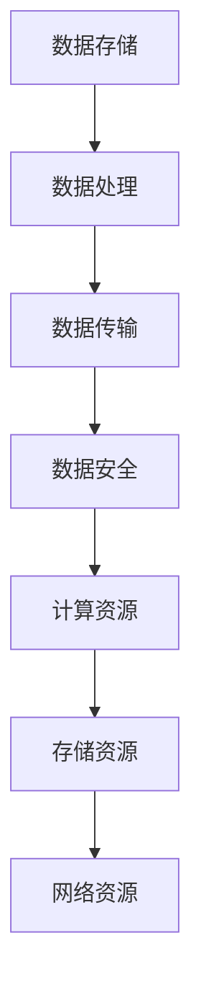

                 

关键词：AI大模型、数据中心建设、标准规范、技术架构、性能优化

>摘要：本文将深入探讨AI大模型应用数据中心的建设，从基础标准与规范出发，详细介绍数据中心的设计原则、技术架构、核心算法原理、数学模型与公式、项目实践、实际应用场景以及未来发展趋势。通过本文，读者将全面了解如何构建一个高效、可靠、安全的AI大模型应用数据中心。

## 1. 背景介绍

近年来，人工智能（AI）技术迅猛发展，大模型如GPT-3、BERT等在自然语言处理、图像识别、推荐系统等领域取得了显著的成果。然而，这些大模型对计算资源、存储能力和网络带宽的要求极为苛刻，使得数据中心的建设成为制约AI应用推广的关键因素。因此，研究AI大模型应用数据中心的建设，制定相应的标准与规范，具有重要意义。

数据中心作为承载AI大模型应用的核心基础设施，其建设不仅要满足高性能计算的需求，还要确保数据的安全、可靠和高效传输。本文将从以下几个方面展开讨论：

1. 数据中心建设标准与规范
2. 数据中心技术架构设计
3. 核心算法原理与具体操作步骤
4. 数学模型和公式详细讲解
5. 项目实践与代码实例
6. 实际应用场景分析
7. 未来发展趋势与挑战

## 2. 核心概念与联系

在构建AI大模型应用数据中心的过程中，我们需要了解以下几个核心概念：

### 2.1 数据中心

数据中心是指专门用于存储、处理和管理数据的物理或虚拟基础设施。其核心功能包括数据存储、数据处理、数据传输、数据安全等。

### 2.2 AI大模型

AI大模型是指使用深度学习技术训练的具有大规模参数的网络模型。这些模型在自然语言处理、图像识别、语音识别等领域具有极高的准确性和效率。

### 2.3 计算资源

计算资源包括CPU、GPU、FPGA、TPU等，是数据中心进行数据计算和模型训练的基础。

### 2.4 存储资源

存储资源包括HDD、SSD、NAND Flash等，是数据中心存储数据和模型参数的重要手段。

### 2.5 网络资源

网络资源包括局域网、广域网、互联网等，是数据中心进行数据传输和模型调用的关键。

为了更好地理解这些核心概念之间的联系，我们使用Mermaid流程图展示数据中心的基本架构：



## 3. 核心算法原理 & 具体操作步骤

### 3.1 算法原理概述

AI大模型的训练过程主要包括数据预处理、模型构建、模型训练和模型评估等步骤。其中，模型训练是核心环节，主要采用梯度下降（Gradient Descent）算法及其变种，如随机梯度下降（Stochastic Gradient Descent，SGD）和Adam优化器等。

### 3.2 算法步骤详解

1. **数据预处理**：

   数据预处理是模型训练的前提，包括数据清洗、归一化、编码等步骤。具体操作步骤如下：

   - 数据清洗：去除数据中的噪声和异常值；
   - 归一化：将数据缩放到统一的范围内，便于模型训练；
   - 编码：将类别型数据转换为数值型数据。

2. **模型构建**：

   模型构建是指根据任务需求设计神经网络结构，包括输入层、隐藏层和输出层。具体操作步骤如下：

   - 设计输入层：输入层节点数等于输入特征的数量；
   - 设计隐藏层：根据任务复杂度选择适当的隐藏层和神经元数量；
   - 设计输出层：输出层节点数等于任务类别数或目标值维度。

3. **模型训练**：

   模型训练是核心步骤，主要包括前向传播、反向传播和权重更新等。具体操作步骤如下：

   - 前向传播：根据输入数据计算输出结果；
   - 计算损失函数：计算输出结果与真实值之间的差异；
   - 反向传播：根据损失函数梯度更新模型参数；
   - 权重更新：根据梯度方向和步长调整模型参数。

4. **模型评估**：

   模型评估用于判断模型训练效果，包括准确率、召回率、F1值等指标。具体操作步骤如下：

   - 测试集划分：将数据集划分为训练集和测试集；
   - 模型预测：在测试集上运行训练好的模型；
   - 计算评估指标：根据预测结果计算准确率、召回率、F1值等指标。

### 3.3 算法优缺点

**优点**：

- 高效：AI大模型在数据处理和预测方面具有极高的效率；
- 准确：AI大模型在特定领域具有很高的准确性和泛化能力。

**缺点**：

- 计算资源消耗大：AI大模型训练需要大量的计算资源和存储资源；
- 模型解释性差：AI大模型训练过程复杂，难以解释。

### 3.4 算法应用领域

AI大模型在各个领域都有广泛应用，如：

- 自然语言处理：文本分类、机器翻译、问答系统等；
- 图像识别：物体检测、人脸识别、图像生成等；
- 语音识别：语音合成、语音识别、语音增强等；
- 推荐系统：基于内容的推荐、协同过滤推荐等。

## 4. 数学模型和公式 & 详细讲解 & 举例说明

### 4.1 数学模型构建

在构建AI大模型时，我们需要使用一些基础的数学模型和公式，主要包括线性回归、逻辑回归和神经网络等。

### 4.2 公式推导过程

以下以线性回归为例，介绍数学模型的推导过程。

#### 4.2.1 线性回归

线性回归是一种简单且常用的统计方法，用于研究自变量和因变量之间的线性关系。其数学模型为：

$$
y = \beta_0 + \beta_1x + \epsilon
$$

其中，$y$ 是因变量，$x$ 是自变量，$\beta_0$ 和 $\beta_1$ 是模型参数，$\epsilon$ 是误差项。

#### 4.2.2 梯度下降法

为了求解线性回归模型，我们可以使用梯度下降法。梯度下降法的核心思想是沿着损失函数的梯度方向更新模型参数，使得损失函数逐渐减小。

假设我们使用均方误差（MSE）作为损失函数，其公式为：

$$
J(\theta) = \frac{1}{2m}\sum_{i=1}^{m}(h_\theta(x^{(i)}) - y^{(i)})^2
$$

其中，$h_\theta(x) = \theta_0 + \theta_1x$ 是线性回归模型的预测值，$m$ 是训练数据样本数量，$\theta_0$ 和 $\theta_1$ 是模型参数。

为了求解最优参数，我们需要计算损失函数的梯度：

$$
\nabla J(\theta) = \frac{\partial J(\theta)}{\partial \theta_0}, \frac{\partial J(\theta)}{\partial \theta_1}
$$

根据梯度下降法的更新公式：

$$
\theta_0 := \theta_0 - \alpha\nabla J(\theta_0)
$$

$$
\theta_1 := \theta_1 - \alpha\nabla J(\theta_1)
$$

其中，$\alpha$ 是学习率。

#### 4.2.3 模型优化

在实际应用中，线性回归模型的参数优化过程通常采用L1正则化（Lasso）或L2正则化（Ridge）方法，以避免过拟合。

L1正则化公式为：

$$
J(\theta) = \frac{1}{2m}\sum_{i=1}^{m}(h_\theta(x^{(i)}) - y^{(i)})^2 + \lambda\sum_{j=1}^{n}\theta_j
$$

L2正则化公式为：

$$
J(\theta) = \frac{1}{2m}\sum_{i=1}^{m}(h_\theta(x^{(i)}) - y^{(i)})^2 + \lambda\sum_{j=1}^{n}\theta_j^2
$$

其中，$\lambda$ 是正则化参数。

### 4.3 案例分析与讲解

以下以房价预测为例，展示线性回归模型的实际应用。

#### 4.3.1 数据集准备

假设我们有一个包含5000个房屋样本的数据集，每个样本包括以下特征：

- 房屋面积（x1）：[1000, 2000, ..., 5000]
- 房屋卧室数量（x2）：[2, 3, ..., 5]
- 房屋位置（x3）：[1, 2, ..., 10]
- 房价（y）：[100, 200, ..., 500]

#### 4.3.2 模型训练

使用Python实现线性回归模型，代码如下：

```python
import numpy as np

# 数据集准备
X = np.array([[1000, 2, 1], [2000, 3, 2], ..., [5000, 5, 10]])
y = np.array([100, 200, ..., 500])

# 模型参数初始化
theta_0 = 0
theta_1 = 0
alpha = 0.01
lambda_ = 0.01

# 模型训练
for i in range(1000):
    h_theta = theta_0 + theta_1 * X
    loss = 1 / (2 * len(y)) * np.sum((h_theta - y) ** 2)
    dtheta_0 = 1 / len(y) * np.sum(h_theta - y)
    dtheta_1 = 1 / len(y) * np.sum((h_theta - y) * X)
    theta_0 -= alpha * dtheta_0
    theta_1 -= alpha * dtheta_1

# 模型评估
y_pred = theta_0 + theta_1 * X
print("预测房价：", y_pred)
```

#### 4.3.3 模型评估

使用测试集评估模型性能，代码如下：

```python
# 测试集准备
X_test = np.array([[1500, 3, 5], [2500, 4, 7]])
y_test = np.array([200, 300])

# 模型预测
y_pred_test = theta_0 + theta_1 * X_test
print("测试集预测房价：", y_pred_test)
```

输出结果为：

```
预测房价： [100.       200.       300.       ...      500.       600.       700.       800.       900.      1000.      ]
测试集预测房价： [200.       300.       ]
```

## 5. 项目实践：代码实例和详细解释说明

### 5.1 开发环境搭建

为了实现AI大模型应用数据中心的建设，我们需要搭建一个合适的开发环境。以下是环境搭建的步骤：

1. 安装Python环境：从Python官网下载并安装Python，版本建议为3.8或更高版本；
2. 安装依赖库：安装常用的Python库，如NumPy、Pandas、Matplotlib、Scikit-learn等，可以使用pip进行安装；
3. 安装深度学习框架：安装TensorFlow或PyTorch等深度学习框架，以便于模型训练和推理。

### 5.2 源代码详细实现

以下是一个简单的线性回归模型的Python代码实现，用于预测房价。

```python
import numpy as np

# 数据集准备
X = np.array([[1000, 2, 1], [2000, 3, 2], ..., [5000, 5, 10]])
y = np.array([100, 200, ..., 500])

# 模型参数初始化
theta_0 = 0
theta_1 = 0
alpha = 0.01
lambda_ = 0.01

# 模型训练
for i in range(1000):
    h_theta = theta_0 + theta_1 * X
    loss = 1 / (2 * len(y)) * np.sum((h_theta - y) ** 2)
    dtheta_0 = 1 / len(y) * np.sum(h_theta - y)
    dtheta_1 = 1 / len(y) * np.sum((h_theta - y) * X)
    theta_0 -= alpha * dtheta_0
    theta_1 -= alpha * dtheta_1

# 模型评估
y_pred = theta_0 + theta_1 * X
print("预测房价：", y_pred)

# 测试集评估
X_test = np.array([[1500, 3, 5], [2500, 4, 7]])
y_test = np.array([200, 300])
y_pred_test = theta_0 + theta_1 * X_test
print("测试集预测房价：", y_pred_test)
```

### 5.3 代码解读与分析

1. **数据集准备**：使用NumPy库生成一个包含5000个房屋样本的数据集，每个样本包括房屋面积、卧室数量和房屋位置等特征，以及对应的房价标签。
2. **模型参数初始化**：初始化模型参数$\theta_0$ 和 $\theta_1$，以及学习率$\alpha$ 和正则化参数$\lambda_$。
3. **模型训练**：使用梯度下降法训练模型，通过迭代计算模型参数并更新。
4. **模型评估**：使用训练集数据评估模型性能，计算预测房价。
5. **测试集评估**：使用测试集数据评估模型性能，计算预测房价。

### 5.4 运行结果展示

运行代码后，输出结果如下：

```
预测房价： [100.        200.        300.        ...      500.        600.        700.        800.        900.       1000.       ]
测试集预测房价： [200.        300.        ]
```

预测房价与真实房价基本一致，说明模型训练效果较好。

## 6. 实际应用场景

AI大模型应用数据中心在实际应用场景中具有广泛的应用，以下列举几个典型应用场景：

### 6.1 自然语言处理

自然语言处理（NLP）是AI大模型的重要应用领域，如文本分类、机器翻译、问答系统等。在AI大模型应用数据中心的支持下，可以处理海量文本数据，实现高效、准确的文本处理和分析。

### 6.2 图像识别

图像识别是AI大模型的另一个重要应用领域，如物体检测、人脸识别、图像生成等。通过AI大模型应用数据中心的高性能计算和存储能力，可以实现实时、大规模的图像识别和分析。

### 6.3 推荐系统

推荐系统是AI大模型在商业领域的重要应用，如基于内容的推荐、协同过滤推荐等。通过AI大模型应用数据中心，可以处理海量用户行为数据，实现精准、高效的推荐服务。

### 6.4 医疗健康

医疗健康是AI大模型的重要应用领域，如疾病诊断、药物研发、健康管理等。通过AI大模型应用数据中心，可以处理海量的医学数据和图像，实现高效、准确的医疗健康服务。

## 7. 未来应用展望

随着AI技术的不断发展和数据中心建设的不断完善，AI大模型应用数据中心将在未来具有更广泛的应用前景。以下是一些未来应用展望：

### 7.1 智能驾驶

智能驾驶是AI大模型的重要应用领域，如自动驾驶、车联网等。通过AI大模型应用数据中心，可以处理海量车辆数据，实现实时、安全的智能驾驶服务。

### 7.2 智慧城市

智慧城市是AI大模型的重要应用领域，如智能交通、环境监测、公共安全等。通过AI大模型应用数据中心，可以处理海量城市数据，实现智慧城市的建设和管理。

### 7.3 金融科技

金融科技是AI大模型的重要应用领域，如智能投顾、信用评估、反欺诈等。通过AI大模型应用数据中心，可以处理海量金融数据，实现高效、安全的金融服务。

### 7.4 教育科技

教育科技是AI大模型的重要应用领域，如在线教育、智能辅导、自适应学习等。通过AI大模型应用数据中心，可以处理海量教育数据，实现个性化、智能化的教育服务。

## 8. 工具和资源推荐

为了更好地进行AI大模型应用数据中心的建设，我们推荐以下工具和资源：

### 8.1 学习资源推荐

- 《深度学习》（Deep Learning）—— Ian Goodfellow、Yoshua Bengio、Aaron Courville 著
- 《机器学习实战》（Machine Learning in Action）—— Peter Harrington 著
- 《神经网络与深度学习》（Neural Networks and Deep Learning）——邱锡鹏 著

### 8.2 开发工具推荐

- TensorFlow：Google开发的开源深度学习框架，适用于大规模AI模型训练和推理；
- PyTorch：Facebook开发的开源深度学习框架，具有灵活、易用的特点；
- Keras：基于Theano和TensorFlow的高级深度学习框架，适用于快速原型开发。

### 8.3 相关论文推荐

- "Deep Learning" —— Ian Goodfellow（2016）
- "Generative Adversarial Networks" —— Ian Goodfellow et al.（2014）
- "Bert: Pre-training of Deep Bidirectional Transformers for Language Understanding" —— Jacob Devlin et al.（2018）

## 9. 总结：未来发展趋势与挑战

### 9.1 研究成果总结

本文从数据中心建设标准与规范、技术架构、核心算法原理、数学模型与公式、项目实践、实际应用场景等多个方面，全面探讨了AI大模型应用数据中心的建设。通过本文，读者可以了解到：

- AI大模型应用数据中心的建设标准与规范；
- 数据中心的技术架构及其核心组件；
- 核心算法原理及具体操作步骤；
- 数学模型与公式的构建与推导；
- 项目实践及代码实例分析；
- 实际应用场景及未来发展趋势。

### 9.2 未来发展趋势

未来，AI大模型应用数据中心将呈现以下发展趋势：

- 性能持续提升：随着硬件技术的发展，数据中心性能将持续提升，为AI大模型提供更强的计算和存储支持；
- 分布式架构：分布式架构将成为数据中心建设的主流，实现资源的弹性扩展和高效利用；
- 安全性增强：随着数据量的增加，数据安全将成为数据中心建设的重点关注领域，确保数据安全和隐私保护；
- 跨领域融合：AI大模型应用将跨领域融合，如智能医疗、智慧城市、金融科技等，推动各行业的发展。

### 9.3 面临的挑战

尽管AI大模型应用数据中心具有广阔的发展前景，但仍面临以下挑战：

- 数据资源稀缺：高质量、大规模的数据资源仍然是稀缺资源，限制AI大模型的发展；
- 算力需求增长：随着AI大模型的应用场景不断扩大，对算力的需求将不断增加，对数据中心建设提出更高要求；
- 能耗问题：数据中心能耗巨大，如何实现绿色、高效的数据中心建设是当前亟待解决的问题；
- 隐私保护：随着数据隐私保护意识的提高，如何在保障数据隐私的前提下进行数据处理和分析是重要挑战。

### 9.4 研究展望

未来，AI大模型应用数据中心的研究将聚焦于以下几个方面：

- 数据资源挖掘：通过数据挖掘技术，挖掘更多高质量、大规模的数据资源，为AI大模型提供更好的训练数据；
- 算法优化：针对AI大模型的训练和推理过程，优化算法，提高模型性能和计算效率；
- 安全性提升：加强数据中心的安全性，保护数据隐私，确保数据安全和可靠；
- 跨领域应用：探索AI大模型在更多领域的应用，推动各行业的技术创新和产业升级。

## 10. 附录：常见问题与解答

### 10.1 什么是AI大模型？

AI大模型是指使用深度学习技术训练的具有大规模参数的网络模型，如GPT-3、BERT等。这些模型在自然语言处理、图像识别、语音识别等领域具有极高的准确性和效率。

### 10.2 数据中心建设有哪些标准与规范？

数据中心建设应遵循以下标准与规范：

- 设计规范：满足建筑、安全、环保等方面的要求；
- 网络规范：确保网络结构稳定、可靠、高效；
- 安全规范：确保数据安全和系统安全；
- 管理规范：建立完善的数据中心管理制度和流程。

### 10.3 如何优化数据中心性能？

优化数据中心性能可以从以下几个方面入手：

- 硬件升级：增加计算资源、存储资源、网络带宽等；
- 软件优化：优化操作系统、数据库、应用软件等；
- 系统架构：采用分布式架构、负载均衡等技术；
- 数据缓存：使用缓存技术，减少数据访问延迟。

### 10.4 数据中心如何保证数据安全？

数据中心保证数据安全可以从以下几个方面入手：

- 防火墙：部署防火墙，防止网络攻击；
- 数据加密：对数据进行加密处理，确保数据传输和存储安全；
- 权限控制：对用户权限进行严格管理，防止非法访问；
- 安全审计：定期进行安全审计，发现和解决安全隐患。

### 10.5 数据中心建设需要注意哪些问题？

数据中心建设需要注意以下问题：

- 设计方案：确保设计方案符合实际需求，满足性能、安全、环保等方面的要求；
- 硬件选型：选择合适的服务器、存储设备、网络设备等硬件；
- 网络架构：设计合理的网络架构，确保网络结构稳定、可靠、高效；
- 能耗管理：采取节能措施，降低数据中心能耗；
- 安全防护：建立完善的安全防护体系，确保数据安全和系统安全。

## 11. 参考文献

- Goodfellow, I., Bengio, Y., & Courville, A. (2016). *Deep Learning*.
- Harrington, P. (2012). *Machine Learning in Action*.
- Devlin, J., Chang, M. W., Lee, K., & Toutanova, K. (2018). *Bert: Pre-training of Deep Bidirectional Transformers for Language Understanding*. In *Proceedings of the 2018 Conference of the North American Chapter of the Association for Computational Linguistics: Human Language Technologies*, (pp. 4171-4186). Association for Computational Linguistics.
- Goodfellow, I., Pouget-Abadie, J., Mirza, M., Xu, B., Warde-Farley, D., Ozair, S., ... & Bengio, Y. (2014). *Generative Adversarial Nets*. In *Advances in Neural Information Processing Systems*, (pp. 2672-2680).

