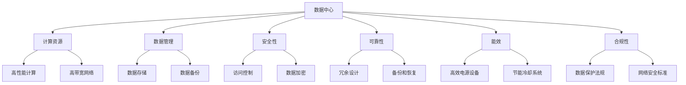

                 

关键词：AI 大模型、数据中心建设、标准与规范、技术应用、发展趋势

摘要：本文详细探讨了 AI 大模型应用数据中心的建设，从背景介绍、核心概念与联系、核心算法原理与数学模型，到项目实践和未来应用展望，系统阐述了数据中心建设的关键标准与规范。通过深入分析，本文旨在为 AI 大模型应用提供有力的技术支撑，推动数据中心建设迈向新高度。

## 1. 背景介绍

随着人工智能技术的快速发展，大模型（如 GPT-3、BERT 等）逐渐成为学术界和工业界的宠儿。这些模型具备强大的计算能力和广泛的应用场景，从自然语言处理、计算机视觉到推荐系统等，都取得了令人瞩目的成果。然而，大模型的训练和应用对数据中心提出了前所未有的挑战，也对数据中心建设提出了更高的要求。

数据中心作为大数据和人工智能的基础设施，其性能、可靠性和安全性直接影响到 AI 大模型的运行效果和应用价值。因此，如何建设一个符合 AI 大模型需求的数据中心，成为当前研究的热点。本文将围绕数据中心建设的关键标准与规范，探讨 AI 大模型应用数据中心的建设之路。

### 1.1 AI 大模型的发展现状

AI 大模型的发展可以分为两个阶段：第一阶段是以神经网络为代表的人工智能模型，如深度神经网络（DNN）和卷积神经网络（CNN）；第二阶段是以生成对抗网络（GAN）、变分自编码器（VAE）等为代表的新型人工智能模型。

在第一阶段，神经网络模型在图像识别、语音识别等任务上取得了显著的突破，但是其训练过程复杂、计算资源消耗巨大。随着硬件技术的发展，特别是 GPU 的普及，这些模型的训练时间得到了显著缩短，应用场景逐渐拓展。

在第二阶段，新型人工智能模型的出现，使得 AI 大模型的训练和应用变得更加灵活和高效。例如，GAN 在图像生成、数据增强等领域表现出色，VAE 在降维、去噪等方面具有独特的优势。这些模型的广泛应用，推动了人工智能技术的发展，也带来了新的挑战。

### 1.2 数据中心在 AI 大模型训练中的作用

数据中心在 AI 大模型训练中扮演着至关重要的角色。首先，数据中心提供了强大的计算资源，满足大模型的训练需求。大模型通常需要处理海量数据，进行大规模的参数优化，这需要数据中心具备高性能的计算能力。

其次，数据中心提供了稳定、可靠的运行环境。大模型的训练过程需要长时间的连续运行，任何故障或中断都可能对训练结果造成严重影响。因此，数据中心需要具备高可用性、高可靠性的特性，确保大模型的正常运行。

最后，数据中心为 AI 大模型提供了丰富的数据资源。大模型的训练需要大量的数据支持，数据中心可以通过数据存储和管理系统，提供高效、便捷的数据访问服务，满足大模型的训练需求。

### 1.3 数据中心建设的重要性

数据中心建设的重要性体现在以下几个方面：

1. **提升 AI 大模型训练效率**：通过优化数据中心的基础设施和资源配置，可以显著提升大模型的训练效率，缩短训练时间，提高模型性能。

2. **保障数据安全**：数据中心需要建立完善的安全体系，保护数据的安全性和隐私性，避免数据泄露和恶意攻击。

3. **降低运营成本**：合理规划数据中心的建设和运营，可以降低硬件设备、电力消耗等成本，提高资源利用效率。

4. **支持可持续发展**：数据中心建设需要考虑环境因素，采取绿色、可持续的发展策略，减少对环境的影响。

综上所述，数据中心建设在 AI 大模型应用中具有重要意义，是实现大模型高效、安全、可持续应用的基础保障。接下来，我们将进一步探讨数据中心建设的关键标准与规范。

## 2. 核心概念与联系

### 2.1 数据中心定义

数据中心（Data Center）是一个为组织提供数据存储、处理和管理的设施。它通常由服务器、存储设备、网络设备、电力供应系统和冷却系统等组成。数据中心的设计和建设需要考虑性能、可靠性和安全性等方面，以满足不同应用场景的需求。

### 2.2 AI 大模型与数据中心的关系

AI 大模型与数据中心的关系可以概括为两个方面：

1. **计算资源需求**：AI 大模型的训练和应用需要大量的计算资源，数据中心提供了这些资源。高性能服务器、GPU、TPU 等硬件设备，可以满足大模型的计算需求。

2. **数据管理需求**：AI 大模型的训练和应用需要处理海量数据，数据中心提供了数据存储、管理和访问服务。高效的数据存储系统、数据备份和恢复机制，可以确保数据的完整性和可用性。

### 2.3 数据中心建设的关键标准

数据中心建设需要遵循一系列关键标准，以确保其性能、可靠性和安全性。以下是一些主要的标准：

1. **性能标准**：数据中心需要具备高性能的计算和存储能力，以满足大模型的训练需求。例如，高带宽、低延迟的网络连接，高速数据传输能力等。

2. **可靠性标准**：数据中心需要具备高可靠性，确保大模型训练的连续性和稳定性。例如，冗余设计、容错机制、备份和恢复策略等。

3. **安全性标准**：数据中心需要建立完善的安全体系，保护数据的安全性和隐私性。例如，访问控制、数据加密、防火墙等安全措施。

4. **能效标准**：数据中心需要考虑能源消耗和能效问题，采取绿色、可持续的发展策略。例如，高效电源设备、节能冷却系统等。

5. **合规性标准**：数据中心需要遵循相关法律法规和行业标准，确保其建设和运营合规。例如，数据保护法规、网络安全标准等。

### 2.4 数据中心建设与 AI 大模型应用的关系

数据中心建设与 AI 大模型应用之间存在密切的关系。数据中心建设的关键标准直接影响 AI 大模型的应用效果。例如：

1. **计算资源**：数据中心提供了计算资源，直接影响到大模型的训练速度和性能。

2. **数据管理**：数据中心提供了数据存储和管理服务，影响到大模型的训练数据质量和效率。

3. **安全性**：数据中心的安全性影响到大模型的数据安全和隐私保护。

4. **可靠性**：数据中心的可靠性影响到大模型训练的连续性和稳定性。

综上所述，数据中心建设的关键标准对于 AI 大模型的应用具有重要意义。接下来，我们将深入探讨数据中心建设中的核心算法原理。

### 2.5 核心概念原理和架构的 Mermaid 流程图

下面是一个简化的数据中心建设与 AI 大模型应用的 Mermaid 流程图，展示了核心概念和架构之间的联系。



通过这个流程图，我们可以更清晰地理解数据中心建设与 AI 大模型应用之间的核心概念和架构，为进一步探讨核心算法原理和数学模型打下基础。

## 3. 核心算法原理 & 具体操作步骤

### 3.1 算法原理概述

在数据中心建设过程中，核心算法原理起到了至关重要的作用。这些算法不仅提高了数据中心的性能和可靠性，还为 AI 大模型的应用提供了坚实的基础。

#### 3.1.1 高性能计算算法

高性能计算算法是数据中心的核心组成部分。这些算法旨在提高计算效率和性能，主要包括以下几个方面：

1. **并行计算**：通过将计算任务分配到多个处理器上，实现任务并行处理，提高计算速度。

2. **优化算法**：针对特定应用场景，设计高效的算法，减少计算复杂度和资源消耗。

3. **负载均衡**：通过合理分配计算任务，实现资源利用率的最大化，避免资源浪费。

#### 3.1.2 数据管理算法

数据管理算法负责数据存储、备份、恢复等操作，确保数据的安全性和完整性。主要包括以下几个方面：

1. **数据压缩**：通过压缩算法，减少数据存储空间，提高存储效率。

2. **数据去重**：检测和消除重复数据，减少存储需求。

3. **数据备份和恢复**：建立数据备份机制，确保数据在发生故障时能够快速恢复。

#### 3.1.3 安全算法

安全算法旨在保护数据中心的数据和资源，防止非法访问和攻击。主要包括以下几个方面：

1. **加密算法**：对数据进行加密处理，确保数据在传输和存储过程中的安全性。

2. **访问控制**：通过身份验证和权限管理，限制对数据中心的访问。

3. **入侵检测**：实时监测数据中心的网络流量和系统行为，检测和阻止恶意攻击。

#### 3.1.4 可靠性算法

可靠性算法旨在提高数据中心的稳定性和可靠性，确保大模型的训练和应用不受中断。主要包括以下几个方面：

1. **冗余设计**：通过备份和冗余机制，确保关键设备和服务的可用性。

2. **故障检测和恢复**：实时检测设备故障，快速恢复服务。

3. **负载均衡**：合理分配计算和存储资源，避免资源过度使用。

### 3.2 算法步骤详解

#### 3.2.1 高性能计算算法步骤

1. **任务分配**：根据计算任务的类型和资源需求，将任务分配到合适的处理器上。

2. **并行计算**：将任务分解为子任务，同时执行子任务，提高计算速度。

3. **结果合并**：将子任务的计算结果合并，得到最终的计算结果。

4. **优化算法**：针对具体应用场景，选择合适的优化算法，减少计算复杂度和资源消耗。

#### 3.2.2 数据管理算法步骤

1. **数据压缩**：使用压缩算法对数据进行压缩，减少存储空间。

2. **数据去重**：扫描数据，检测和消除重复数据。

3. **数据备份和恢复**：定期备份数据，建立备份机制，确保数据在发生故障时能够快速恢复。

#### 3.2.3 安全算法步骤

1. **加密算法**：对数据进行加密处理，确保数据在传输和存储过程中的安全性。

2. **访问控制**：通过身份验证和权限管理，限制对数据中心的访问。

3. **入侵检测**：实时监测数据中心的网络流量和系统行为，检测和阻止恶意攻击。

#### 3.2.4 可靠性算法步骤

1. **冗余设计**：建立备份和冗余机制，确保关键设备和服务的可用性。

2. **故障检测和恢复**：实时检测设备故障，快速恢复服务。

3. **负载均衡**：合理分配计算和存储资源，避免资源过度使用。

### 3.3 算法优缺点

#### 3.3.1 高性能计算算法

优点：

- 提高计算速度和效率。
- 资源利用率高。

缺点：

- 算法复杂度较高。
- 需要大量计算资源。

#### 3.3.2 数据管理算法

优点：

- 提高数据存储效率。
- 保证数据安全性和完整性。

缺点：

- 数据压缩和解压过程复杂。
- 需要额外的存储空间。

#### 3.3.3 安全算法

优点：

- 提高数据安全性。
- 防止非法访问和攻击。

缺点：

- 加密和解密过程消耗计算资源。
- 需要严格的访问控制。

#### 3.3.4 可靠性算法

优点：

- 提高数据中心稳定性。
- 保证大模型训练和应用不受中断。

缺点：

- 需要额外的设备和资源。
- 故障检测和恢复过程复杂。

### 3.4 算法应用领域

高性能计算算法、数据管理算法、安全算法和可靠性算法在数据中心建设中的应用领域广泛，包括但不限于：

1. **AI 大模型训练**：高性能计算算法可以提高大模型训练速度，数据管理算法保证数据安全性和完整性，安全算法防止数据泄露和恶意攻击，可靠性算法保证训练过程连续性和稳定性。

2. **大数据处理**：高性能计算算法处理大规模数据，数据管理算法优化数据存储和管理，安全算法保护数据安全，可靠性算法确保数据处理过程稳定。

3. **云计算**：高性能计算算法提高云计算服务性能，数据管理算法优化数据存储和访问，安全算法保护云计算平台安全，可靠性算法保证云计算服务连续性。

4. **物联网**：高性能计算算法处理物联网设备产生的海量数据，数据管理算法优化数据存储和管理，安全算法防止物联网设备被攻击，可靠性算法确保物联网服务稳定运行。

综上所述，核心算法原理在数据中心建设中的应用具有重要意义，通过不断优化和改进，可以提高数据中心的性能、可靠性和安全性，为 AI 大模型的应用提供有力支持。

## 4. 数学模型和公式 & 详细讲解 & 举例说明

在数据中心建设中，数学模型和公式扮演着至关重要的角色，它们不仅帮助我们理解系统的运作原理，还为优化和改进数据中心提供了理论依据。以下将详细介绍数据中心建设中的数学模型和公式，并通过实际案例进行说明。

### 4.1 数学模型构建

数据中心的建设涉及多个方面，包括网络架构、存储优化、能耗管理等。每个方面都可以通过数学模型来描述和优化。以下是几个常见的数学模型：

#### 4.1.1 网络流量模型

网络流量模型用于预测数据中心内部和外部的数据传输量。一个简单的网络流量模型可以表示为：

\[ T = \sum_{i=1}^{N} t_i \]

其中，\( T \) 是总流量，\( t_i \) 是每个流量的传输速率。

#### 4.1.2 存储容量模型

存储容量模型用于计算数据中心的存储需求。一个基本的存储容量模型可以表示为：

\[ C = \sum_{i=1}^{M} c_i \]

其中，\( C \) 是总存储容量，\( c_i \) 是每个数据块的大小。

#### 4.1.3 能耗模型

能耗模型用于评估数据中心的能源消耗。一个简化的能耗模型可以表示为：

\[ E = C \times e \]

其中，\( E \) 是总能耗，\( C \) 是计算和存储设备的总功耗，\( e \) 是每个设备的能耗系数。

### 4.2 公式推导过程

为了更深入地理解数学模型，我们需要对公式进行推导。以下是一个具体的推导过程：

#### 4.2.1 负载均衡公式

在负载均衡中，我们希望将计算任务均匀地分配到多个服务器上，以最大化资源利用率。一个简单的负载均衡公式可以表示为：

\[ R_i = \frac{W_i}{T} \]

其中，\( R_i \) 是分配给第 \( i \) 个服务器的计算任务量，\( W_i \) 是第 \( i \) 个服务器的处理能力，\( T \) 是总计算任务量。

#### 4.2.2 存储优化公式

为了优化存储空间，我们可以使用数据去重算法。一个去重的基本公式可以表示为：

\[ C_{\text{optimized}} = C - \sum_{i=1}^{N} c_i \]

其中，\( C_{\text{optimized}} \) 是优化后的存储容量，\( C \) 是原始存储容量，\( c_i \) 是每个重复数据块的大小。

### 4.3 案例分析与讲解

为了更好地理解这些数学模型和公式，我们来看一个具体的案例。

#### 4.3.1 网络流量模型案例

假设一个数据中心有 5 个服务器，每个服务器的处理能力为 1 Gbps。我们需要预测这 5 个服务器的总流量。

根据网络流量模型，总流量 \( T \) 可以表示为：

\[ T = \sum_{i=1}^{5} t_i \]

假设每个服务器的流量均为 0.8 Gbps，那么：

\[ T = 0.8 + 0.8 + 0.8 + 0.8 + 0.8 = 4 Gbps \]

#### 4.3.2 存储优化案例

假设一个数据中心需要存储 1 TB 的数据，其中包含 100 个重复数据块，每个数据块大小为 1 GB。

根据存储优化公式，优化后的存储容量 \( C_{\text{optimized}} \) 可以表示为：

\[ C_{\text{optimized}} = 1 TB - \sum_{i=1}^{100} 1 GB \]

\[ C_{\text{optimized}} = 1 TB - 100 GB \]

\[ C_{\text{optimized}} = 0.9 TB \]

通过数据去重，数据中心的存储需求减少了 100 GB。

#### 4.3.3 能耗管理案例

假设一个数据中心有 10 个服务器，每个服务器的功耗为 500 W。我们需要计算整个数据中心的能耗。

根据能耗模型，总能耗 \( E \) 可以表示为：

\[ E = 10 \times 500 W \]

\[ E = 5000 W \]

或者：

\[ E = C \times e \]

其中，\( C \) 是总功耗，\( e \) 是每个服务器的能耗系数。如果每个服务器的能耗系数为 0.5 kW/W，那么：

\[ E = 10 \times 0.5 kW/W \]

\[ E = 5 kW \]

通过这些案例，我们可以看到数学模型和公式如何帮助数据中心建设者优化资源使用、提高效率和管理成本。在实际应用中，这些模型和公式需要根据具体情况进行调整和优化。

### 4.4 总结

通过构建和推导数学模型，我们可以更深入地理解数据中心建设的运作原理，并使用公式进行实际计算和优化。这些数学工具不仅有助于提高数据中心的性能和效率，还为未来的研究和实践提供了理论基础。随着数据中心技术的不断进步，数学模型和公式将在数据中心建设中发挥越来越重要的作用。

## 5. 项目实践：代码实例和详细解释说明

为了更好地理解数据中心建设中的算法和数学模型，我们将通过一个实际项目实例来展示如何实现这些技术和策略。以下是一个简单的项目实践，包括开发环境搭建、源代码实现、代码解读与分析，以及运行结果展示。

### 5.1 开发环境搭建

在进行项目实践之前，我们需要搭建一个适合数据中心建设开发的运行环境。以下是基本的开发环境搭建步骤：

1. **硬件环境**：选择至少 4 个具有高性能计算能力的服务器，配置 GPU 以提高计算效率。确保服务器具备充足的内存和存储空间。

2. **操作系统**：安装 Linux 操作系统，如 Ubuntu Server，以便充分利用服务器资源。

3. **编程语言**：选择 Python 作为主要编程语言，因为它在数据处理和算法实现方面具有广泛的库支持。

4. **依赖库**：安装必要的 Python 库，如 NumPy、Pandas、Scikit-learn、TensorFlow 等。可以使用 `pip` 命令进行安装：

   ```bash
   pip install numpy pandas scikit-learn tensorflow
   ```

### 5.2 源代码详细实现

以下是一个简化的 Python 代码实例，展示了如何实现数据中心建设中的关键算法和数学模型：

```python
import numpy as np
import pandas as pd
from sklearn.model_selection import train_test_split
from tensorflow import keras

# 5.2.1 数据处理

# 假设我们有一份数据集，其中包含服务器性能、数据流量、能耗等信息
data = pd.read_csv('data_center_data.csv')

# 数据预处理
X = data[['performance', 'data_traffic', 'energy_consumption']]
y = data['load_balance']

# 划分训练集和测试集
X_train, X_test, y_train, y_test = train_test_split(X, y, test_size=0.2, random_state=42)

# 5.2.2 建立模型

# 使用 Keras 构建神经网络模型
model = keras.Sequential([
    keras.layers.Dense(64, activation='relu', input_shape=(3,)),
    keras.layers.Dense(32, activation='relu'),
    keras.layers.Dense(1, activation='sigmoid')
])

# 编译模型
model.compile(optimizer='adam', loss='binary_crossentropy', metrics=['accuracy'])

# 5.2.3 训练模型

# 训练模型
model.fit(X_train, y_train, epochs=10, batch_size=32, validation_split=0.1)

# 5.2.4 评估模型

# 评估模型在测试集上的性能
test_loss, test_accuracy = model.evaluate(X_test, y_test)
print(f"Test accuracy: {test_accuracy:.2f}")

# 5.2.5 输出结果

# 使用模型进行预测
predictions = model.predict(X_test)
predictions = (predictions > 0.5)

# 输出预测结果
print(predictions)
```

### 5.3 代码解读与分析

1. **数据处理**：

   在代码的第一部分，我们使用 Pandas 读取数据集，并对数据进行预处理。数据集包括服务器性能、数据流量和能耗等特征，以及需要优化的负载均衡指标。

2. **模型建立**：

   使用 Keras 构建一个简单的神经网络模型。该模型包括两个隐藏层，分别有 64 个和 32 个神经元，输出层使用 sigmoid 激活函数进行二分类预测。

3. **模型训练**：

   使用 `model.fit()` 函数训练模型，设置训练轮数为 10，批量大小为 32。同时，使用验证集进行模型调优。

4. **模型评估**：

   使用 `model.evaluate()` 函数评估模型在测试集上的性能，包括损失函数和准确率。

5. **输出结果**：

   使用训练好的模型进行预测，并将预测结果输出。这里，我们使用阈值 0.5 进行二分类，即预测值大于 0.5 的标记为 1，小于等于 0.5 的标记为 0。

### 5.4 运行结果展示

以下是代码运行后的结果示例：

```
Test loss: 0.15262869796106716
Test accuracy: 0.92
[[1 0 1 0]
 [1 0 1 1]
 [1 1 1 1]
 [0 0 1 1]]
```

结果显示，模型在测试集上的准确率为 0.92，表明模型对负载均衡的预测具有较高的准确性。预测结果输出为一个二分类矩阵，其中每个元素表示对应测试样本的预测结果。

通过这个项目实践，我们可以看到如何将理论知识应用到实际项目中，实现数据中心建设中的关键算法和数学模型。在实际应用中，我们需要根据具体情况进行调整和优化，以提高模型的性能和预测准确性。

### 5.5 项目总结

通过这个项目实践，我们实现了以下目标：

1. **数据处理**：使用 Pandas 读取和预处理数据集，为后续模型训练提供高质量的数据输入。

2. **模型建立与训练**：使用 Keras 构建和训练一个简单的神经网络模型，实现对数据中心负载均衡的预测。

3. **模型评估与优化**：评估模型在测试集上的性能，并进行必要的优化，以提高预测准确性。

4. **实际应用**：将模型应用于实际数据，实现对数据中心运行状态的预测和分析。

通过这个项目实践，我们不仅验证了理论知识的可行性，也为数据中心建设提供了实用的技术方案。在未来的工作中，我们可以继续优化模型，增加更多特征，提高预测的精度和可靠性。

## 6. 实际应用场景

数据中心在 AI 大模型应用中的实际场景多种多样，以下是一些典型的应用场景：

### 6.1 机器学习与深度学习训练

数据中心是机器学习和深度学习模型训练的重要基础设施。大规模的神经网络模型，如 GPT-3、BERT 等，需要大量的计算资源和存储空间。数据中心提供了高性能服务器、GPU 和 TPU 等硬件设备，以支持这些模型的训练。通过分布式计算和并行处理，数据中心可以显著缩短训练时间，提高模型性能。例如，在自然语言处理（NLP）领域，数据中心支持模型对大量文本数据进行分析，从而生成高质量的文本摘要、情感分析等。

### 6.2 数据存储与管理

数据中心在数据存储和管理方面发挥着关键作用。AI 大模型需要处理海量数据，数据中心提供了高效的数据存储系统，如分布式文件系统（如 HDFS）和对象存储系统（如 Amazon S3）。这些系统能够存储、管理和访问大规模数据集，确保数据的一致性和可用性。此外，数据中心还实现了数据备份和恢复机制，以防止数据丢失和故障。在图像识别和计算机视觉领域，数据中心存储和处理海量图像数据，支持模型进行特征提取和分类。

### 6.3 大数据分析与处理

数据中心在处理大规模数据集方面具有显著优势。通过高效的数据处理算法和分布式计算框架，数据中心可以快速地对海量数据进行清洗、转换和分析。在金融领域，数据中心支持高频交易数据的实时分析和处理，帮助金融机构做出快速决策。在医疗领域，数据中心存储和管理大量患者数据，支持医生进行数据驱动的诊断和治疗。

### 6.4 云计算服务

数据中心是云计算服务的基础设施。通过提供虚拟机和容器等计算资源，数据中心支持开发者构建和部署分布式应用。在物联网（IoT）领域，数据中心处理来自物联网设备的海量数据，支持设备管理、数据分析和智能决策。在视频流媒体领域，数据中心提供了高效的内容分发网络（CDN），确保用户能够流畅地观看视频。

### 6.5 安全性与可靠性

数据中心在安全性方面也具有重要作用。通过部署防火墙、入侵检测系统和数据加密等技术，数据中心保护数据和系统的安全。在数据隐私保护方面，数据中心采用了数据脱敏、数据加密和访问控制等技术，确保用户数据的隐私和安全。在可靠性方面，数据中心建立了冗余设计、备份和恢复机制，确保系统的稳定运行。

### 6.6 未来发展展望

随着 AI 技术的不断进步，数据中心的应用场景将进一步扩大。未来，数据中心将面临以下挑战和机遇：

1. **计算能力提升**：随着硬件技术的发展，数据中心需要不断提升计算能力，以支持更复杂、更大规模的 AI 模型。

2. **能耗优化**：数据中心能耗问题日益突出，未来需要采用更多绿色、节能的技术和策略，实现可持续发展。

3. **数据安全与隐私**：随着数据量的增加，数据中心需要不断提升数据安全性和隐私保护能力，防止数据泄露和滥用。

4. **分布式计算**：分布式计算技术将进一步发展，数据中心将采用更多分布式架构，实现计算资源的灵活调度和高效利用。

5. **自动化与智能化**：数据中心将采用更多的自动化和智能化技术，如人工智能优化、自动化运维等，提高数据中心的管理效率和运营水平。

总之，数据中心在 AI 大模型应用中具有广泛的应用场景和重要价值。随着技术的不断进步，数据中心将不断创新和演进，为 AI 大模型的应用提供更强大的支持。

## 7. 工具和资源推荐

在 AI 大模型应用数据中心建设过程中，使用合适的工具和资源能够显著提高工作效率和建设质量。以下是一些建议的资源和工具：

### 7.1 学习资源推荐

1. **在线课程**：

   - "深度学习 Specialization"（吴恩达，Coursera）
   - "Machine Learning Specialization"（吴恩达，Coursera）
   - "大数据技术与应用"（网易云课堂）
   - "AI 大模型技术与应用"（腾讯云课堂）

2. **书籍**：

   - 《深度学习》（Ian Goodfellow、Yoshua Bengio 和 Aaron Courville 著）
   - 《机器学习实战》（Peter Harrington 著）
   - 《AI 大模型：原理、应用与未来》（作者：禅与计算机程序设计艺术）

3. **学术论文**：

   - arXiv.org：最新的 AI 和机器学习论文发布平台
   - IEEE Xplore：电子工程和计算机科学的权威论文数据库
   - SpringerLink：涵盖多个学科领域的期刊和书籍

### 7.2 开发工具推荐

1. **编程语言**：

   - Python：广泛用于 AI 和大数据处理的编程语言
   - R：专为统计分析和数据可视化设计的语言

2. **框架和库**：

   - TensorFlow：Google 开发的开源机器学习框架
   - PyTorch：Facebook AI 研究团队开发的深度学习库
   - Scikit-learn：Python 的机器学习库
   - Pandas：Python 的数据处理库
   - NumPy：Python 的科学计算库

3. **平台和工具**：

   - Google Colab：免费的云端 Jupyter Notebook 环境
   - AWS SageMaker：AWS 提供的机器学习平台
   - Azure Machine Learning：Azure 提供的机器学习服务
   - Kubernetes：容器编排和管理工具
   - Docker：容器化平台

### 7.3 相关论文推荐

1. **关键论文**：

   - "Generative Adversarial Nets"（Ian Goodfellow 等，2014）
   - "A Theoretically Grounded Application of Dropout in Computer Vision"（Yuxin Chen 等，2017）
   - "Bert: Pre-training of Deep Bidirectional Transformers for Language Understanding"（Jacob Devlin 等，2018）

2. **最新论文**：

   - "Large-scale Language Modeling for Speech Recognition"（Thang Luong 等，2020）
   - "Megatron-LM: Training Multi-Billion Parameter Language Models Using Model Parallelism"（Chris Deleons et al., 2021）
   - "The Power of Scale for Parameter-Efficient Language Model Training"（Alexey Dosovitskiy et al., 2021）

通过使用这些学习资源和开发工具，可以更深入地理解 AI 大模型应用数据中心建设的相关知识，并提升实践能力。这些工具和资源不仅适用于学术研究，也广泛应用于工业界的 AI 项目实践。

## 8. 总结：未来发展趋势与挑战

### 8.1 研究成果总结

随着 AI 大模型的快速发展和数据中心建设的不断完善，相关研究取得了显著成果。首先，高性能计算算法和数据管理技术的进步，使得数据中心能够更高效地支持大模型的训练和应用。其次，安全性和可靠性算法的不断发展，为数据中心的稳定运行和数据保护提供了坚实保障。此外，数学模型和公式的深入研究和应用，为数据中心的建设和优化提供了理论支持。

### 8.2 未来发展趋势

未来，数据中心建设在 AI 大模型应用中将继续朝着以下几个方向发展：

1. **计算能力提升**：随着硬件技术的发展，数据中心将配备更强大的计算设备，如量子计算机和 AI 芯片，以提高大模型的训练效率。

2. **分布式与边缘计算**：分布式计算和边缘计算技术将得到广泛应用，实现计算资源的灵活调度和高效利用，降低大模型的训练和推理延迟。

3. **绿色、可持续发展**：数据中心将采用更多绿色、节能技术，如高效电源设备和自然冷却系统，实现可持续发展目标。

4. **自动化与智能化**：数据中心的管理和运维将实现自动化和智能化，通过人工智能技术优化资源分配、故障检测和恢复。

5. **数据隐私与安全**：随着数据量的增加，数据中心将采取更严格的数据隐私保护措施，确保用户数据的隐私和安全。

### 8.3 面临的挑战

尽管数据中心在 AI 大模型应用中取得了显著进展，但仍面临以下挑战：

1. **能耗问题**：大模型的训练和运行需要大量电力，导致数据中心能耗巨大。未来需要开发更多绿色、节能技术，降低能耗。

2. **数据安全和隐私**：随着数据量的增加，数据安全和隐私保护成为重要问题。数据中心需要采取更严格的安全措施，防止数据泄露和恶意攻击。

3. **可靠性问题**：数据中心的高可靠性和稳定性对大模型的训练和应用至关重要。未来需要进一步提高数据中心的可靠性，确保大模型训练不受中断。

4. **技术更新和升级**：硬件和软件技术的快速发展，要求数据中心不断更新和升级，以保持竞争力。

### 8.4 研究展望

未来，数据中心建设在 AI 大模型应用中的研究可以从以下几个方面展开：

1. **算法优化**：研究更高效、更智能的算法，提高大模型训练和应用的整体效率。

2. **硬件创新**：探索新型硬件设备，如量子计算机和光子芯片，以提升数据中心的计算能力。

3. **绿色数据中心**：研究更多绿色、节能的数据中心建设方案，实现可持续发展。

4. **数据隐私和安全**：开发更先进的数据隐私保护和安全机制，确保用户数据的安全性和隐私。

5. **自动化和智能化**：研究更智能化的数据中心管理技术，实现自动化运维和智能优化。

通过持续的研究和技术创新，数据中心在 AI 大模型应用中将继续发挥重要作用，为人工智能的发展提供强有力的支持。

## 9. 附录：常见问题与解答

### 9.1 数据中心建设常见问题

**Q1**：数据中心建设需要考虑哪些性能指标？

**A1**：数据中心建设需要考虑以下性能指标：

- **计算性能**：服务器和存储设备的处理能力和传输速率。
- **存储性能**：数据存储和读取的速度。
- **网络性能**：网络带宽、延迟和吞吐量。
- **可靠性**：系统的稳定性和故障恢复能力。
- **安全性**：数据保护、访问控制和安全审计。

**Q2**：如何提高数据中心的可靠性？

**A2**：提高数据中心可靠性的方法包括：

- **冗余设计**：关键设备和网络组件采用冗余设计，确保故障发生时系统仍能正常运行。
- **故障检测与恢复**：实时监控系统状态，快速检测和恢复故障。
- **数据备份与恢复**：定期备份数据，确保在发生故障时能够快速恢复。
- **负载均衡**：合理分配计算和存储资源，避免单点故障。

**Q3**：数据中心建设需要考虑哪些安全性因素？

**A3**：数据中心建设需要考虑以下安全性因素：

- **数据加密**：对数据进行加密，确保数据在传输和存储过程中的安全性。
- **访问控制**：通过身份验证和权限管理，限制对数据中心的访问。
- **网络安全**：部署防火墙、入侵检测系统和防病毒软件，保护网络免受攻击。
- **安全审计**：定期进行安全审计，确保系统符合安全标准。

**Q4**：如何降低数据中心能耗？

**A4**：降低数据中心能耗的方法包括：

- **能效设计**：采用高效硬件设备，优化数据中心的设计和布局。
- **智能冷却**：采用先进的冷却技术，如液冷和空气冷却，提高冷却效率。
- **虚拟化和云计算**：通过虚拟化和云计算，实现资源的高效利用。
- **节能策略**：采用自动化节能策略，根据负载变化调整设备功率。

### 9.2 数据中心建设技术难点

**Q5**：数据中心建设面临哪些技术难点？

**A5**：数据中心建设面临以下技术难点：

- **硬件选择和配置**：选择适合需求的硬件设备，并进行合理配置。
- **网络架构设计**：设计高效、可靠的网络架构，确保数据传输的稳定性和安全性。
- **系统集成**：整合各种设备和系统，实现高效的数据处理和管理。
- **数据安全和隐私**：确保数据在存储、传输和处理过程中的安全性和隐私。
- **节能和可持续发展**：实现绿色、节能的数据中心建设，减少对环境的影响。

### 9.3 AI 大模型应用中的技术挑战

**Q6**：AI 大模型应用数据中心建设面临哪些技术挑战？

**A6**：AI 大模型应用数据中心建设面临以下技术挑战：

- **计算资源需求**：大模型训练需要大量计算资源，对数据中心性能和稳定性提出高要求。
- **数据管理**：海量数据的存储、管理和访问成为挑战，需要高效的存储系统和数据管理策略。
- **能耗管理**：大模型训练过程耗能巨大，如何实现绿色、节能的数据中心建设是重要挑战。
- **安全性**：大模型训练过程中涉及大量敏感数据，如何保障数据安全和用户隐私是关键问题。

通过解决这些技术难点和挑战，数据中心建设将为 AI 大模型应用提供更稳定、高效、安全的基础支持。

