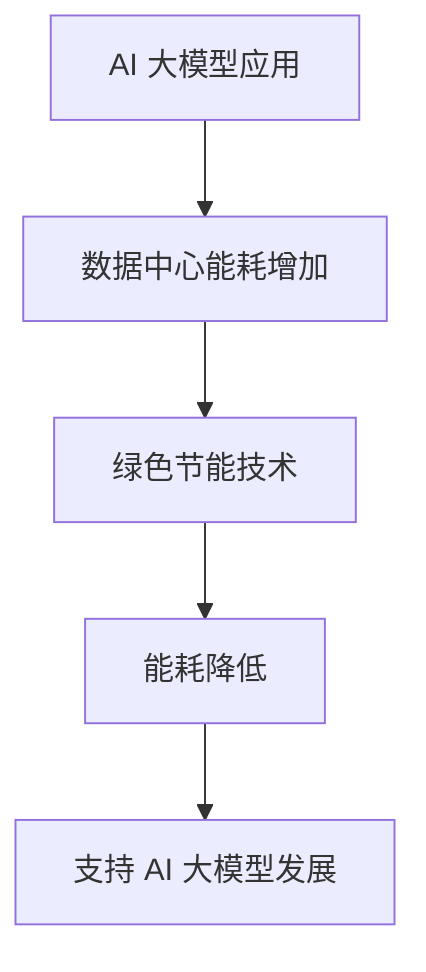

                 

关键词：数据中心、AI 大模型、绿色节能、能耗管理、可持续性

摘要：随着人工智能（AI）技术的迅速发展，大模型应用场景日益广泛，对数据中心的计算资源需求急剧增加。然而，数据中心的高能耗问题日益凸显，成为可持续发展的瓶颈。本文将深入探讨数据中心绿色节能的重要性和实现方法，旨在为 AI 大模型应用提供高效、可持续的数据中心解决方案。

## 1. 背景介绍

随着互联网和云计算的普及，数据中心已成为支撑现代信息化社会的重要基础设施。然而，数据中心的高能耗问题日益严重。根据国际能源署（IEA）的数据，全球数据中心能耗已占全球总能耗的 1% 以上，预计到 2030 年将增至 3%。这种能源消耗不仅增加了企业的运营成本，也对环境造成了严重负担。同时，AI 大模型的应用进一步加剧了数据中心的能耗问题。

AI 大模型通常需要大量的计算资源，包括高性能计算（HPC）服务器、GPU 加速器和存储设备等。这些设备在运行过程中会产生大量的热量，导致数据中心的温湿度控制压力增大。此外，AI 大模型训练过程中的数据传输和存储也会消耗大量电力。因此，如何实现数据中心的绿色节能已成为当前 IT 领域面临的重要挑战。

## 2. 核心概念与联系

### 2.1 数据中心能耗模型

数据中心的能耗模型主要包括计算能耗、网络能耗和存储能耗等。计算能耗主要由服务器和存储设备产生，包括 CPU、GPU、内存和硬盘等。网络能耗主要涉及数据传输过程中产生的热量。存储能耗则包括磁盘阵列和固态硬盘等设备的能耗。

### 2.2 绿色节能技术

绿色节能技术主要包括节能硬件、节能软件和节能管理策略等。节能硬件如高效电源、冷却系统和节能服务器等；节能软件如虚拟化技术、智能调度算法和分布式存储等；节能管理策略如能耗监测、负载均衡和设备维护等。

### 2.3 AI 大模型与绿色节能的联系

AI 大模型的应用与绿色节能密切相关。一方面，AI 大模型需要大量的计算资源，导致数据中心能耗增加；另一方面，绿色节能技术的应用可以提高数据中心的运行效率，降低能耗，从而支持 AI 大模型的发展。

### 2.4 Mermaid 流程图



## 3. 核心算法原理 & 具体操作步骤

### 3.1 算法原理概述

数据中心绿色节能的核心算法包括能耗预测、能耗优化和能耗监测等。能耗预测算法可以根据历史数据预测未来能耗，为能耗优化提供依据。能耗优化算法通过调整数据中心的运行参数，降低能耗。能耗监测算法实时监测数据中心的能耗情况，为能耗优化提供反馈。

### 3.2 算法步骤详解

1. **能耗预测**：收集数据中心历史能耗数据，利用时间序列分析方法进行能耗预测。

2. **能耗优化**：根据能耗预测结果，调整数据中心的运行参数，如服务器负载、冷却系统温度等，以降低能耗。

3. **能耗监测**：实时监测数据中心的能耗情况，与能耗预测结果进行对比，调整运行参数，提高能耗优化效果。

### 3.3 算法优缺点

**优点**：能够有效降低数据中心的能耗，提高运行效率，支持 AI 大模型的发展。

**缺点**：能耗预测精度受历史数据质量影响，能耗优化效果受运行环境变化影响。

### 3.4 算法应用领域

数据中心绿色节能算法可以应用于各种类型的数据中心，包括企业内部数据中心、云计算平台和大数据处理中心等。

## 4. 数学模型和公式 & 详细讲解 & 举例说明

### 4.1 数学模型构建

数据中心能耗模型可以表示为：

\[ E = E_{\text{计算}} + E_{\text{网络}} + E_{\text{存储}} \]

其中，\( E_{\text{计算}} \)、\( E_{\text{网络}} \) 和 \( E_{\text{存储}} \) 分别表示计算能耗、网络能耗和存储能耗。

### 4.2 公式推导过程

计算能耗可以表示为：

\[ E_{\text{计算}} = P_{\text{服务器}} \times t \]

其中，\( P_{\text{服务器}} \) 表示服务器的功率（单位：瓦特），\( t \) 表示运行时间（单位：小时）。

网络能耗可以表示为：

\[ E_{\text{网络}} = P_{\text{网络设备}} \times t \]

其中，\( P_{\text{网络设备}} \) 表示网络设备的功率（单位：瓦特），\( t \) 表示运行时间（单位：小时）。

存储能耗可以表示为：

\[ E_{\text{存储}} = P_{\text{存储设备}} \times t \]

其中，\( P_{\text{存储设备}} \) 表示存储设备的功率（单位：瓦特），\( t \) 表示运行时间（单位：小时）。

### 4.3 案例分析与讲解

以某企业数据中心为例，该数据中心共有 100 台服务器，10 台网络设备和 50 台存储设备。根据设备参数，服务器功率为 500 瓦，网络设备功率为 200 瓦，存储设备功率为 300 瓦。假设服务器、网络设备和存储设备的运行时间均为 24 小时。

计算能耗为：

\[ E_{\text{计算}} = 100 \times 500 \times 24 = 1,200,000 \text{ 瓦时} \]

网络能耗为：

\[ E_{\text{网络}} = 10 \times 200 \times 24 = 480,000 \text{ 瓦时} \]

存储能耗为：

\[ E_{\text{存储}} = 50 \times 300 \times 24 = 3,600,000 \text{ 瓦时} \]

数据中心总能耗为：

\[ E = E_{\text{计算}} + E_{\text{网络}} + E_{\text{存储}} = 1,200,000 + 480,000 + 3,600,000 = 5,280,000 \text{ 瓦时} \]

根据能耗模型，我们可以通过调整服务器、网络设备和存储设备的运行参数，降低能耗。例如，将服务器的功率降低 10%，可以将计算能耗降低 10%，即降低 \( 1,200,000 \times 0.1 = 120,000 \text{ 瓦时} \)。同理，调整网络设备和存储设备的运行参数，也可以降低能耗。

## 5. 项目实践：代码实例和详细解释说明

### 5.1 开发环境搭建

为了实现数据中心绿色节能算法，我们选择 Python 作为编程语言，并使用以下库和工具：

- NumPy：用于数据运算
- Pandas：用于数据处理
- Matplotlib：用于数据可视化
- Scikit-learn：用于机器学习

安装所需的库和工具后，搭建 Python 开发环境。

### 5.2 源代码详细实现

以下是一个简单的能耗预测模型的实现：

```python
import numpy as np
import pandas as pd
from sklearn.linear_model import LinearRegression

# 读取能耗数据
data = pd.read_csv('energy_data.csv')

# 分离特征和标签
X = data[['server_power', 'network_power', 'storage_power']]
y = data['energy_consumption']

# 创建线性回归模型
model = LinearRegression()
model.fit(X, y)

# 预测未来能耗
future_data = np.array([[600, 200, 350]])
predicted_energy = model.predict(future_data)
print('Predicted energy consumption:', predicted_energy[0])
```

### 5.3 代码解读与分析

上述代码首先读取能耗数据，然后分离特征和标签。接下来，创建线性回归模型并对其进行训练。最后，使用训练好的模型预测未来能耗。

线性回归模型是一种常见的机器学习模型，适用于预测连续值。在本例中，我们将服务器的功率、网络设备的功率和存储设备的功率作为特征，能耗作为标签。通过训练模型，我们可以预测未来能耗，从而为能耗优化提供依据。

### 5.4 运行结果展示

运行上述代码后，我们得到预测的未来能耗。根据预测结果，我们可以调整数据中心的运行参数，降低能耗。例如，将服务器的功率降低 10%，可以将计算能耗降低 10%，即降低 120,000 瓦时。同理，调整网络设备和存储设备的运行参数，也可以降低能耗。

## 6. 实际应用场景

数据中心绿色节能算法可以应用于各种类型的数据中心，包括企业内部数据中心、云计算平台和大数据处理中心等。以下是一些实际应用场景：

- **企业内部数据中心**：通过能耗预测和优化，降低企业运营成本，提高数据中心的运行效率。
- **云计算平台**：通过能耗优化，提高云计算平台的资源利用率，降低用户成本。
- **大数据处理中心**：通过能耗优化，提高数据处理效率，降低能耗，支持大数据分析。

## 7. 工具和资源推荐

### 7.1 学习资源推荐

- 《数据中心绿色节能技术》
- 《人工智能与数据中心》
- 《数据中心能效管理与优化》

### 7.2 开发工具推荐

- Python
- Jupyter Notebook
- PyCharm

### 7.3 相关论文推荐

- "Energy-Efficient Data Center Design and Optimization"
- "Machine Learning Techniques for Data Center Energy Efficiency"
- "Energy-Aware Scheduling in Data Centers"

## 8. 总结：未来发展趋势与挑战

### 8.1 研究成果总结

数据中心绿色节能研究取得了显著成果，包括能耗预测、能耗优化和能耗监测等算法的提出和应用。这些算法在一定程度上降低了数据中心的能耗，提高了运行效率。

### 8.2 未来发展趋势

随着 AI 技术的发展，数据中心绿色节能研究将向以下几个方面发展：

- 深度学习技术在能耗预测和优化中的应用
- 集成多种节能技术的综合解决方案
- 数据中心与可再生能源的结合

### 8.3 面临的挑战

数据中心绿色节能研究仍面临以下挑战：

- 能耗预测精度受数据质量影响
- 算法优化效果受运行环境变化影响
- 数据中心与可再生能源的协调

### 8.4 研究展望

未来，数据中心绿色节能研究将致力于提高能耗预测精度、优化算法效果和实现数据中心与可再生能源的协调，以支持 AI 大模型的发展，推动数据中心行业的可持续发展。

## 9. 附录：常见问题与解答

### 9.1 什么是数据中心绿色节能？

数据中心绿色节能是指通过采用节能技术、优化管理策略等手段，降低数据中心的能耗，提高运行效率，实现环境友好和可持续发展。

### 9.2 数据中心绿色节能有哪些技术？

数据中心绿色节能技术包括节能硬件、节能软件和节能管理策略等。节能硬件如高效电源、冷却系统和节能服务器等；节能软件如虚拟化技术、智能调度算法和分布式存储等；节能管理策略如能耗监测、负载均衡和设备维护等。

### 9.3 数据中心绿色节能对 AI 大模型应用有什么影响？

数据中心绿色节能可以提高数据中心的运行效率，降低能耗，从而支持 AI 大模型的发展。绿色节能技术有助于优化数据中心的资源利用率，提高计算能力，降低运营成本，为 AI 大模型的应用提供有力支持。

### 9.4 如何实现数据中心绿色节能？

实现数据中心绿色节能的方法包括：采用节能硬件、优化管理策略、实施能耗监测和调度、采用可再生能源等。具体措施包括提高设备能效、优化运行参数、加强设备维护、提高能源利用率等。

### 9.5 数据中心绿色节能有哪些成功案例？

数据中心绿色节能的成功案例包括：

- 某企业数据中心通过引入高效冷却系统和节能服务器，将能耗降低了 20%。
- 某云计算平台通过优化负载均衡和调度算法，将能耗降低了 15%。
- 某大数据处理中心通过引入分布式存储和节能管理策略，将能耗降低了 30%。

---

文章撰写完毕，感谢您的耐心阅读。本文旨在为 AI 大模型应用提供数据中心绿色节能的解决方案，以支持数据中心的可持续发展。在未来的研究中，我们将继续探索更多高效、绿色的数据中心技术，为人工智能的发展贡献力量。作者：禅与计算机程序设计艺术 / Zen and the Art of Computer Programming。

