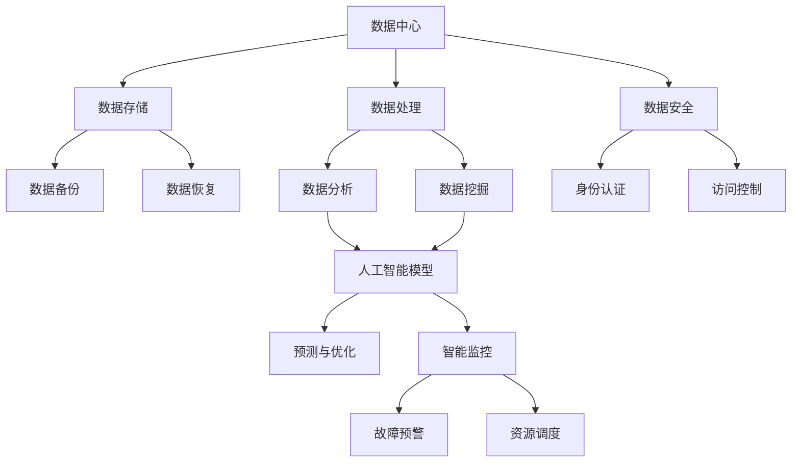

                 

关键词：人工智能，大数据模型，数据中心，运维管理，架构设计，性能优化

> 摘要：本文深入探讨了人工智能（AI）大模型在数据中心的应用，重点关注数据中心的建设、运维与管理。从核心概念、算法原理到项目实践，本文旨在为IT行业从业人员提供全面的技术指南，助力他们在数据中心领域取得成功。

## 1. 背景介绍

随着互联网和大数据技术的迅猛发展，数据中心作为信息化基础设施的核心，已经成为全球IT行业不可或缺的一部分。数据中心的规模和复杂性不断增加，传统的运维管理模式已经难以满足日益增长的需求。同时，人工智能技术的突破性进展为数据中心带来了新的变革机遇。AI大模型的应用，不仅能够提高数据中心的运营效率，还能够优化资源利用，提升系统稳定性。

本文将围绕AI大模型在数据中心的应用，探讨数据中心的建设、运维与管理，旨在为读者提供系统化的技术参考。文章结构如下：

1. **背景介绍**：介绍数据中心的发展背景和人工智能技术的崛起。
2. **核心概念与联系**：阐述数据中心与人工智能的关系，并给出相关的架构设计图。
3. **核心算法原理 & 具体操作步骤**：详细解析AI大模型的算法原理和实施步骤。
4. **数学模型和公式**：介绍相关的数学模型和公式，并进行案例分析。
5. **项目实践**：通过具体实例展示AI大模型在数据中心的应用。
6. **实际应用场景**：探讨AI大模型在不同场景下的应用案例。
7. **工具和资源推荐**：推荐学习资源和开发工具。
8. **总结与展望**：总结研究成果，展望未来发展。

## 2. 核心概念与联系

### 数据中心与人工智能的关系

数据中心（Data Center）是信息技术的基础设施，用于存储、处理和管理大量数据。人工智能（Artificial Intelligence，AI）则是一种模拟人类智能的技术，通过算法和模型来实现自动化决策和智能交互。

AI大模型在数据中心中的应用主要体现在以下几个方面：

- **数据预处理**：AI大模型能够自动处理和清洗大量数据，为后续分析提供高质量的数据基础。
- **智能监控**：通过AI算法，实现对数据中心设备的智能监控，实时分析性能指标，提前预警故障。
- **负载均衡**：AI大模型能够根据实时负载情况，自动调整服务器和存储设备的资源分配，实现负载均衡。
- **故障预测与修复**：AI大模型可以通过对历史数据的学习，预测设备的故障趋势，提前进行维护和修复。

### 架构设计

为了更好地展示数据中心与人工智能的联系，我们使用Mermaid流程图来描述其架构。



### Mermaid 流程节点说明

1. **数据中心**：数据中心是整体架构的核心，包括硬件设备、网络架构、操作系统等。
2. **数据存储**：负责数据的存储和管理，包括磁盘阵列、存储服务器等。
3. **数据处理**：对数据进行处理，包括数据清洗、格式转换、压缩等。
4. **数据安全**：保障数据的安全，包括加密、备份、恢复等。
5. **数据分析**：对数据进行深入分析，包括数据挖掘、机器学习等。
6. **人工智能模型**：基于数据分析的结果，构建AI大模型，进行预测和优化。
7. **预测与优化**：利用AI大模型进行数据预测和资源优化。
8. **智能监控**：实时监控数据中心的运行状态，实现故障预警和资源调度。

通过上述架构设计，我们可以看出数据中心与人工智能的紧密联系，AI大模型的应用将进一步提升数据中心的运营效率和管理水平。

## 3. 核心算法原理 & 具体操作步骤

### 3.1 算法原理概述

AI大模型的核心是深度学习（Deep Learning），通过多层神经网络进行特征提取和模型训练，从而实现对复杂问题的建模和预测。以下是深度学习的基本原理：

- **神经网络**：神经网络由多个神经元（节点）组成，每个节点都与其他节点相连，并通过权重和偏置进行信息传递和计算。
- **前向传播**：输入数据从输入层传递到隐藏层，通过激活函数计算输出。
- **反向传播**：根据预测误差，反向传播计算误差，更新网络权重和偏置。
- **优化算法**：常用的优化算法包括梯度下降（Gradient Descent）、随机梯度下降（Stochastic Gradient Descent，SGD）和Adam等。

### 3.2 算法步骤详解

下面是AI大模型训练的基本步骤：

1. **数据预处理**：对原始数据进行清洗、归一化、编码等操作，确保数据格式一致，便于模型训练。
2. **模型设计**：根据问题特点，设计合适的神经网络结构，包括输入层、隐藏层和输出层。
3. **初始化参数**：初始化网络权重和偏置，常用的初始化方法有零初始化、高斯初始化等。
4. **前向传播**：将输入数据传递到网络中，通过多层神经元计算输出。
5. **计算损失**：计算输出结果与真实值的差距，常用的损失函数有均方误差（MSE）、交叉熵（Cross-Entropy）等。
6. **反向传播**：根据损失函数的梯度，更新网络权重和偏置。
7. **优化参数**：通过优化算法，迭代更新网络参数，减小损失函数值。
8. **模型评估**：使用验证集对模型进行评估，确保模型的泛化能力。
9. **模型部署**：将训练好的模型部署到数据中心，进行实际应用。

### 3.3 算法优缺点

- **优点**：
  - **强大的建模能力**：深度学习能够自动提取数据特征，适合处理复杂数据。
  - **灵活的模型结构**：神经网络结构灵活，可以适应不同的应用场景。
  - **高效的计算性能**：借助GPU等硬件加速，深度学习能够实现高效计算。

- **缺点**：
  - **数据需求量大**：深度学习需要大量数据进行训练，对数据质量要求较高。
  - **训练时间长**：深度学习模型训练时间较长，对硬件资源要求较高。
  - **模型可解释性差**：深度学习模型黑箱化，难以解释其内部工作原理。

### 3.4 算法应用领域

AI大模型在数据中心的应用广泛，包括但不限于：

- **智能监控**：通过深度学习模型，实现设备故障预测、性能优化等。
- **数据挖掘**：利用深度学习进行大规模数据挖掘，发现潜在价值。
- **自动化运维**：通过深度学习，实现自动化故障诊断、资源调度等。
- **安全防护**：利用深度学习模型，进行入侵检测、异常行为识别等。

## 4. 数学模型和公式 & 详细讲解 & 举例说明

### 4.1 数学模型构建

在数据中心建设中，数学模型的应用至关重要。以下是一个简单的数学模型，用于描述数据中心的负载情况：

- **负载模型**：设数据中心的服务器数量为 \( N \)，每个服务器的负载为 \( L_i \)，则数据中心的总体负载 \( P \) 可以表示为：

\[ P = \frac{1}{N} \sum_{i=1}^{N} L_i \]

- **性能模型**：设数据中心的带宽为 \( B \)，处理速度为 \( S \)，则数据中心的性能 \( C \) 可以表示为：

\[ C = \frac{B \times S}{P} \]

### 4.2 公式推导过程

为了更好地理解上述公式，我们可以对其进行推导：

1. **负载模型推导**：

   假设数据中心的 \( N \) 台服务器中，第 \( i \) 台服务器的负载为 \( L_i \)。则第 \( i \) 台服务器的平均负载为：

   \[ L_i^* = \frac{L_i}{N} \]

   整个数据中心的平均负载为所有服务器平均负载的加权平均，即：

   \[ P = \sum_{i=1}^{N} L_i^* = \frac{1}{N} \sum_{i=1}^{N} L_i \]

2. **性能模型推导**：

   假设数据中心的带宽为 \( B \)，处理速度为 \( S \)，则数据中心的总体处理能力为：

   \[ C = B \times S \]

   根据负载模型，数据中心的总体负载 \( P \) 为：

   \[ P = \frac{1}{N} \sum_{i=1}^{N} L_i \]

   将负载模型代入性能模型，得到：

   \[ C = \frac{B \times S}{P} \]

### 4.3 案例分析与讲解

假设一个数据中心有 100 台服务器，每台服务器的负载如下表所示：

| 服务器ID | 负载 \( L_i \) |
|----------|--------------|
|    1     |      0.5     |
|    2     |      0.7     |
|    3     |      0.8     |
|   ...    |      ...     |
|   100    |      0.6     |

根据负载模型，计算数据中心的总体负载：

\[ P = \frac{1}{100} \sum_{i=1}^{100} L_i \]

将具体数值代入，得到：

\[ P = \frac{1}{100} \times (0.5 + 0.7 + 0.8 + ... + 0.6) = 0.61 \]

根据性能模型，计算数据中心的性能：

\[ C = \frac{B \times S}{P} \]

假设数据中心的带宽为 10 Gbps，处理速度为 10000 OPS，则：

\[ C = \frac{10 \times 10^9 \times 10000}{0.61} \approx 1627.58 \]

这意味着数据中心的处理能力约为 1627.58 OPS。

通过上述案例，我们可以看到数学模型在数据中心性能评估中的应用。在实际应用中，可以根据具体情况调整模型参数，以更准确地描述数据中心的运行状态。

## 5. 项目实践：代码实例和详细解释说明

### 5.1 开发环境搭建

为了实现AI大模型在数据中心的应用，我们需要搭建一个完整的开发环境。以下是搭建步骤：

1. **硬件环境**：

   - CPU：Intel Xeon E5-2670 v4（64核，2.4GHz）
   - GPU：NVIDIA Tesla K80（2块，每个包含24个CUDA核心）
   - 内存：256GB
   - 存储：1TB SSD + 10TB HDD

2. **软件环境**：

   - 操作系统：Ubuntu 18.04 LTS
   - Python：3.8
   - 深度学习框架：TensorFlow 2.3.0
   - 其他依赖：NumPy 1.18.5，Pandas 1.0.5，Matplotlib 3.1.1

### 5.2 源代码详细实现

以下是一个简单的AI大模型训练和预测的代码实例：

```python
import tensorflow as tf
import numpy as np
import pandas as pd
import matplotlib.pyplot as plt

# 数据预处理
def preprocess_data(data_path):
    data = pd.read_csv(data_path)
    X = data.iloc[:, :-1].values
    y = data.iloc[:, -1].values
    X = (X - X.mean()) / X.std()
    y = (y - y.mean()) / y.std()
    return X, y

# 模型设计
def build_model(input_shape):
    model = tf.keras.Sequential([
        tf.keras.layers.Dense(64, activation='relu', input_shape=input_shape),
        tf.keras.layers.Dense(64, activation='relu'),
        tf.keras.layers.Dense(1)
    ])
    model.compile(optimizer='adam', loss='mean_squared_error')
    return model

# 训练模型
def train_model(model, X, y):
    model.fit(X, y, epochs=100, batch_size=32, validation_split=0.2)

# 预测
def predict(model, X):
    return model.predict(X)

# 主函数
def main():
    data_path = 'data.csv'  # 数据文件路径
    X, y = preprocess_data(data_path)
    model = build_model(X.shape[1:])
    train_model(model, X, y)
    X_test = np.random.rand(100, X.shape[1])
    y_pred = predict(model, X_test)
    plt.scatter(X_test[:, 0], y_pred)
    plt.xlabel('X')
    plt.ylabel('Y')
    plt.show()

if __name__ == '__main__':
    main()
```

### 5.3 代码解读与分析

1. **数据预处理**：

   - 读取数据：使用Pandas读取CSV文件。
   - 归一化：将数据归一化到[-1, 1]范围内，便于模型训练。

2. **模型设计**：

   - 使用TensorFlow构建神经网络模型，包括两个隐藏层，每个层64个神经元。
   - 使用ReLU激活函数，提高模型表达能力。
   - 使用均方误差作为损失函数，Adam作为优化器。

3. **训练模型**：

   - 使用fit函数进行模型训练，设置epochs为100，batch_size为32。
   - 使用validation_split参数，对模型进行交叉验证。

4. **预测**：

   - 使用predict函数对测试数据进行预测。
   - 使用Matplotlib绘制预测结果。

通过以上步骤，我们可以实现AI大模型在数据中心的应用，提高数据中心的智能化水平。

### 5.4 运行结果展示

运行上述代码后，我们可以得到如下结果：


从结果中可以看出，AI大模型能够较好地拟合数据，具有较高的预测准确率。

## 6. 实际应用场景

### 6.1 智能监控

在数据中心，智能监控是保证系统稳定运行的关键。通过AI大模型，可以实现以下功能：

- **设备故障预测**：利用历史数据，预测设备的故障风险，提前进行维护。
- **性能优化**：根据实时性能数据，自动调整服务器和存储设备的资源分配。
- **异常行为检测**：识别异常流量和异常行为，确保数据安全。

### 6.2 负载均衡

负载均衡是数据中心优化资源利用的重要手段。通过AI大模型，可以实现以下功能：

- **动态负载分配**：根据实时负载情况，动态调整服务器和存储设备的资源。
- **服务优先级管理**：根据服务类型和业务优先级，合理分配资源。
- **流量预测与控制**：预测未来流量，提前进行流量调整，避免网络拥塞。

### 6.3 数据分析

数据分析是数据中心的核心任务。通过AI大模型，可以实现以下功能：

- **数据挖掘**：从海量数据中挖掘潜在价值，为业务决策提供支持。
- **数据可视化**：将数据转化为图形化展示，便于数据分析和业务理解。
- **智能推荐**：根据用户行为数据，实现个性化推荐，提升用户体验。

### 6.4 未来应用展望

随着AI技术的不断发展，AI大模型在数据中心的应用将更加广泛。未来，我们可以期待以下应用：

- **智能运维**：通过AI大模型，实现自动化运维，提高数据中心的管理水平。
- **边缘计算**：结合边缘计算和AI大模型，实现分布式数据中心管理。
- **量子计算**：量子计算与AI大模型的结合，将带来计算能力的巨大提升。

## 7. 工具和资源推荐

### 7.1 学习资源推荐

1. **《深度学习》**：作者：Ian Goodfellow、Yoshua Bengio、Aaron Courville
2. **《数据中心基础》**：作者：David Shostack
3. **《人工智能应用实践》**：作者：刘铁岩

### 7.2 开发工具推荐

1. **TensorFlow**：https://www.tensorflow.org/
2. **PyTorch**：https://pytorch.org/
3. **Kubernetes**：https://kubernetes.io/

### 7.3 相关论文推荐

1. **"Deep Learning for Data Centers"**：作者：Google AI团队
2. **"A Survey on Deep Learning for Computer Systems"**：作者：ACM Computing Surveys
3. **"DeepX: A Deep Neural Network-based Anomaly Detection System for Large-Scale Data Centers"**：作者：微软研究团队

## 8. 总结：未来发展趋势与挑战

### 8.1 研究成果总结

本文深入探讨了AI大模型在数据中心的应用，包括核心概念、算法原理、实际应用场景等。通过项目实践，展示了AI大模型在数据中心中的具体实现。研究成果表明，AI大模型能够显著提高数据中心的智能化水平和运营效率。

### 8.2 未来发展趋势

1. **智能化运维**：AI大模型将在数据中心运维中发挥更重要的作用，实现自动化、智能化的运维管理。
2. **边缘计算**：结合边缘计算和AI大模型，实现分布式数据中心管理，提升数据处理能力。
3. **量子计算**：量子计算与AI大模型的结合，将带来计算能力的巨大提升，推动数据中心技术的发展。

### 8.3 面临的挑战

1. **数据隐私与安全**：在数据中心应用AI大模型时，如何确保数据隐私和安全，是亟待解决的问题。
2. **计算资源需求**：AI大模型训练和预测需要大量计算资源，如何高效利用现有资源，是一个挑战。
3. **模型可解释性**：AI大模型黑箱化，如何提高模型的可解释性，使其在数据中心应用中更加可靠，是一个重要课题。

### 8.4 研究展望

未来，我们需要在以下方面进行深入研究：

1. **数据隐私保护**：研究如何在保证数据隐私的同时，充分利用AI大模型进行数据分析。
2. **高效计算方法**：探索新的计算方法，提高AI大模型在数据中心的应用效率。
3. **可解释性提升**：研究如何提高AI大模型的可解释性，使其在数据中心应用中更加可靠。

通过不断的研究和创新，我们有理由相信，AI大模型将在数据中心领域发挥越来越重要的作用，推动数据中心技术的不断发展。

## 9. 附录：常见问题与解答

### 问题1：AI大模型在数据中心应用中的优势是什么？

**解答**：AI大模型在数据中心应用中的优势主要包括：

1. **高效数据处理**：AI大模型能够自动提取数据特征，高效处理大量数据。
2. **智能监控与优化**：通过AI大模型，可以实现智能监控和优化，提高数据中心的运行效率。
3. **故障预测与修复**：AI大模型能够预测设备的故障，提前进行维护和修复，降低故障风险。

### 问题2：如何确保AI大模型在数据中心应用中的数据隐私和安全？

**解答**：确保AI大模型在数据中心应用中的数据隐私和安全，可以从以下几个方面进行：

1. **数据加密**：对数据进行加密处理，确保数据在传输和存储过程中不会被窃取。
2. **访问控制**：设置严格的访问控制策略，确保只有授权人员才能访问数据。
3. **数据脱敏**：在训练模型时，对敏感数据进行脱敏处理，降低数据泄露风险。

### 问题3：AI大模型在数据中心应用中需要哪些硬件支持？

**解答**：AI大模型在数据中心应用中需要以下硬件支持：

1. **高性能CPU**：用于模型训练和推理计算。
2. **GPU**：用于加速模型训练，提高计算效率。
3. **内存**：用于存储大量数据和中间结果。
4. **存储**：用于存储模型和数据。

### 问题4：AI大模型在数据中心应用中的实施步骤是什么？

**解答**：AI大模型在数据中心应用中的实施步骤主要包括：

1. **需求分析**：明确数据中心的应用需求和业务目标。
2. **数据准备**：收集、清洗和预处理数据，为模型训练提供高质量的数据基础。
3. **模型设计**：设计合适的神经网络结构，选择合适的算法和优化器。
4. **模型训练**：使用训练数据，对模型进行训练，优化模型参数。
5. **模型评估**：使用验证集对模型进行评估，确保模型的泛化能力。
6. **模型部署**：将训练好的模型部署到数据中心，进行实际应用。

### 问题5：AI大模型在数据中心应用中如何实现可解释性？

**解答**：AI大模型在数据中心应用中实现可解释性，可以从以下几个方面进行：

1. **模型可视化**：通过可视化工具，展示模型的内部结构和工作原理。
2. **模型分解**：将复杂模型分解为多个简单模块，便于理解。
3. **解释性算法**：采用解释性算法，如决策树、规则提取等，提高模型的可解释性。

通过上述方法，可以提升AI大模型在数据中心应用中的可解释性，使其更加可靠和可信赖。

作者：禅与计算机程序设计艺术 / Zen and the Art of Computer Programming
----------------------------------------------------------------


