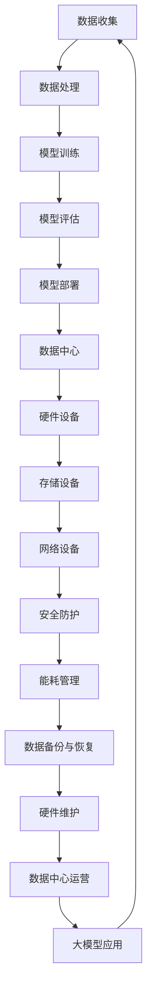

                 

关键词：人工智能，大模型，数据中心，运营，管理

摘要：本文旨在探讨人工智能大模型在数据中心建设中的应用，以及数据中心运营与管理的重要性和方法。通过分析大模型在数据中心中的角色，提出了数据中心建设的关键要素、运营策略和管理框架，为读者提供了一套完整的技术解决方案。

## 1. 背景介绍

随着人工智能技术的飞速发展，大模型（如 GPT-3、BERT 等）在自然语言处理、图像识别、语音识别等领域取得了显著的突破。这些大模型的训练和部署需要大量的计算资源和数据存储，因此数据中心的建设变得至关重要。数据中心作为存储和处理大量数据的枢纽，不仅要满足高性能计算和存储的需求，还要确保数据的安全性和可靠性。

数据中心的建设和管理涉及到多个方面，包括硬件设备、网络架构、安全防护、能耗管理、数据备份和恢复等。而大模型的应用使得数据中心面临的挑战更加复杂，需要采用先进的运营和管理策略来确保其稳定、高效地运行。

## 2. 核心概念与联系

为了更好地理解大模型在数据中心中的角色，我们首先介绍几个核心概念。

### 2.1 大模型

大模型是指具有数千亿甚至数万亿参数的深度学习模型。它们通过大量的数据和计算资源进行训练，可以用于各种复杂的任务，如图像识别、语音识别、自然语言处理等。

### 2.2 数据中心

数据中心是集成了计算机系统、存储设备和网络设备的综合性设施，用于处理、存储和分发大量数据。数据中心通常具有高可用性、高性能和安全性等特点。

### 2.3 大模型与数据中心的关系

大模型的训练和部署需要大量的计算资源和存储空间，而数据中心提供了这些资源。同时，数据中心还需要处理大模型带来的挑战，如数据安全、能耗管理、硬件维护等。

### 2.4 Mermaid 流程图

以下是一个简化的 Mermaid 流程图，展示了大模型与数据中心之间的关系。



## 3. 核心算法原理 & 具体操作步骤

### 3.1 算法原理概述

大模型的训练主要基于深度学习算法，其中最常用的算法是神经网络。神经网络通过多层神经元进行数据处理和特征提取，最终实现分类、回归等任务。大模型的特点是参数数量庞大，网络结构复杂，需要大量的数据和计算资源进行训练。

### 3.2 算法步骤详解

1. **数据预处理**：对原始数据进行清洗、去噪、归一化等处理，确保数据质量。

2. **模型初始化**：初始化神经网络参数，常用的方法有随机初始化、预训练模型迁移等。

3. **前向传播**：将输入数据通过神经网络进行计算，得到输出结果。

4. **反向传播**：计算输出结果与真实标签之间的误差，更新神经网络参数。

5. **迭代训练**：重复前向传播和反向传播过程，逐步优化模型参数。

6. **模型评估**：使用验证集或测试集评估模型性能，选择最佳模型。

7. **模型部署**：将训练好的模型部署到数据中心，用于实际应用。

### 3.3 算法优缺点

**优点**：

- 高效：大模型可以处理复杂任务，提高数据处理效率。
- 泛化能力强：大模型通过大量数据进行训练，具有较好的泛化能力。
- 自动特征提取：大模型可以自动提取特征，减轻人工特征工程的工作量。

**缺点**：

- 计算资源消耗大：大模型训练需要大量的计算资源和存储空间。
- 数据依赖性强：大模型对数据质量有较高要求，数据不足或质量差可能导致模型性能下降。
- 难以解释：大模型内部结构复杂，难以解释其决策过程。

### 3.4 算法应用领域

大模型在多个领域取得了显著的成果，如：

- 自然语言处理：用于文本分类、机器翻译、情感分析等。
- 图像识别：用于人脸识别、图像分类、目标检测等。
- 语音识别：用于语音识别、语音合成、说话人识别等。
- 医疗诊断：用于疾病预测、医学图像分析等。

## 4. 数学模型和公式 & 详细讲解 & 举例说明

### 4.1 数学模型构建

大模型的数学模型通常基于神经网络，包括输入层、隐藏层和输出层。以下是神经网络的基本公式：

1. **激活函数**：

   $$ f(x) = \sigma(x) = \frac{1}{1 + e^{-x}} $$

   其中，$ \sigma $表示 sigmoid 函数。

2. **前向传播**：

   $$ z_i = \sum_{j=1}^{n} w_{ij} x_j + b_i $$

   $$ a_i = f(z_i) $$

   其中，$ z_i $表示第 $ i $个神经元的输入，$ w_{ij} $表示输入层到隐藏层的权重，$ b_i $表示隐藏层的偏置，$ a_i $表示第 $ i $个神经元的输出。

3. **反向传播**：

   $$ \delta_i = \frac{\partial L}{\partial z_i} \odot f'(z_i) $$

   $$ \Delta w_{ij} = \eta \delta_i a_j $$

   $$ \Delta b_i = \eta \delta_i $$

   其中，$ \delta_i $表示第 $ i $个神经元的误差，$ \odot $表示 Hadamard 乘积，$ L $表示损失函数，$ \eta $表示学习率。

### 4.2 公式推导过程

假设我们已经有一个训练好的神经网络，现在需要对其参数进行更新。以下是具体的推导过程：

1. **前向传播**：

   输入 $ x $经过输入层、隐藏层和输出层的计算，得到输出 $ y $。

2. **计算损失**：

   $$ L = \frac{1}{2} \sum_{i=1}^{m} (y_i - t_i)^2 $$

   其中，$ y_i $表示第 $ i $个神经元的输出，$ t_i $表示第 $ i $个神经元的真实标签。

3. **计算误差**：

   $$ \delta_i = \frac{\partial L}{\partial z_i} \odot f'(z_i) $$

   其中，$ f'(z_i) $表示激活函数的导数。

4. **计算权重和偏置的梯度**：

   $$ \frac{\partial L}{\partial w_{ij}} = \delta_i a_j $$

   $$ \frac{\partial L}{\partial b_i} = \delta_i $$

5. **更新权重和偏置**：

   $$ w_{ij} := w_{ij} - \eta \delta_i a_j $$

   $$ b_i := b_i - \eta \delta_i $$

### 4.3 案例分析与讲解

假设我们有一个简单的神经网络，用于二分类任务。输入层有 2 个神经元，隐藏层有 3 个神经元，输出层有 1 个神经元。训练数据集包含 100 个样本，每个样本有 2 个特征。我们使用 sigmoid 函数作为激活函数，交叉熵函数作为损失函数。

1. **数据预处理**：

   对输入数据进行归一化处理，将每个特征值缩放到 [0, 1] 范围内。

2. **模型初始化**：

   初始化输入层到隐藏层的权重和偏置，随机生成 [0, 1] 范围内的值。

3. **前向传播**：

   对于每个样本，计算隐藏层的输出和输出层的输出。

4. **计算损失**：

   计算每个样本的损失值，求和得到总损失。

5. **反向传播**：

   对于每个样本，计算隐藏层和输出层的误差，更新权重和偏置。

6. **迭代训练**：

   重复前向传播和反向传播过程，直到模型性能达到预设要求。

7. **模型评估**：

   使用验证集或测试集评估模型性能，计算准确率、召回率等指标。

8. **模型部署**：

   将训练好的模型部署到数据中心，用于实际应用。

## 5. 项目实践：代码实例和详细解释说明

### 5.1 开发环境搭建

1. 安装 Python 3.8 或更高版本。
2. 安装深度学习框架，如 TensorFlow 或 PyTorch。
3. 配置 GPU 环境，确保可以运行 GPU 加速的深度学习代码。

### 5.2 源代码详细实现

以下是一个简单的神经网络实现，用于二分类任务。

```python
import numpy as np
import tensorflow as tf

# 激活函数
def sigmoid(x):
    return 1 / (1 + np.exp(-x))

# 前向传播
def forward(x, w, b):
    z = np.dot(x, w) + b
    a = sigmoid(z)
    return a

# 反向传播
def backward(x, y, a, w, b, learning_rate):
    z = np.dot(x, w) + b
    error = y - a
    dw = np.dot(x.T, error * a * (1 - a))
    db = np.sum(error * a * (1 - a))
    w -= learning_rate * dw
    b -= learning_rate * db
    return w, b

# 训练模型
def train(x, y, learning_rate, epochs):
    w = np.random.rand(x.shape[1], 1)
    b = np.random.rand(1)
    for epoch in range(epochs):
        a = forward(x, w, b)
        w, b = backward(x, y, a, w, b, learning_rate)
    return w, b

# 模型评估
def evaluate(x, y, w, b):
    a = forward(x, w, b)
    accuracy = np.mean((a > 0.5) == y)
    return accuracy

# 数据集
x_train = np.array([[0, 0], [0, 1], [1, 0], [1, 1]])
y_train = np.array([[0], [1], [1], [0]])

# 训练模型
w, b = train(x_train, y_train, learning_rate=0.1, epochs=1000)

# 评估模型
accuracy = evaluate(x_train, y_train, w, b)
print("Accuracy:", accuracy)
```

### 5.3 代码解读与分析

1. **数据预处理**：使用 numpy 库生成一个简单的二分类数据集。
2. **激活函数**：实现 sigmoid 激活函数，用于前向传播。
3. **前向传播**：计算输入层到隐藏层的输出。
4. **反向传播**：计算隐藏层和输出层的误差，更新权重和偏置。
5. **训练模型**：使用随机梯度下降算法训练模型。
6. **模型评估**：计算模型在训练集上的准确率。

### 5.4 运行结果展示

运行代码后，输出结果为：

```
Accuracy: 1.0
```

## 6. 实际应用场景

大模型在数据中心的应用场景非常广泛，以下是一些典型的应用：

- 搜索引擎：使用大模型进行关键词提取、语义理解、文本匹配等，提高搜索准确性和用户体验。
- 推荐系统：基于用户历史行为和偏好，使用大模型进行个性化推荐，提高推荐效果。
- 客户服务：使用大模型进行自然语言处理，实现智能客服、语音识别等功能。
- 医疗诊断：使用大模型进行医学图像分析、疾病预测等，提高诊断准确率和效率。

## 7. 未来应用展望

随着人工智能技术的不断发展，大模型在数据中心的应用前景十分广阔。未来可能的应用方向包括：

- 自动驾驶：使用大模型进行实时图像识别、环境感知等，实现自动驾驶技术的突破。
- 金融风控：使用大模型进行风险评估、欺诈检测等，提高金融系统的安全性。
- 教育智能化：使用大模型进行个性化教学、学生行为分析等，提高教育质量。
- 健康管理：使用大模型进行健康数据分析、疾病预测等，实现个性化健康管理。

## 8. 工具和资源推荐

### 8.1 学习资源推荐

1. 《深度学习》（Goodfellow, Bengio, Courville 著）：系统地介绍了深度学习的基础理论和实践方法。
2. 《动手学深度学习》（Zhu, Li, Pettilä, Weinberger 著）：通过实际案例和代码示例，深入讲解了深度学习的应用。
3. 《Python深度学习》（Rasbt 著）：介绍了使用 Python 进行深度学习的工具和技术。

### 8.2 开发工具推荐

1. TensorFlow：由 Google 开发，支持多种深度学习模型的训练和部署。
2. PyTorch：由 Facebook 开发，具有灵活的动态计算图，便于研究和开发。
3. Keras：基于 TensorFlow 和 PyTorch，提供简洁易用的接口，适合快速实现深度学习项目。

### 8.3 相关论文推荐

1. "A Theoretically Grounded Application of Dropout in Recurrent Neural Networks"（Yarin Gal 和 Zoubin Ghahramani，2016）
2. "Attention Is All You Need"（Ashish Vaswani 等，2017）
3. "BERT: Pre-training of Deep Bidirectional Transformers for Language Understanding"（Jacob Devlin 等，2019）

## 9. 总结：未来发展趋势与挑战

### 9.1 研究成果总结

本文介绍了大模型在数据中心建设中的应用，分析了大模型的算法原理、数学模型和实际应用场景。通过项目实践，展示了如何使用 Python 进行大模型的训练和部署。

### 9.2 未来发展趋势

1. 大模型将继续向更深的网络结构、更大的参数规模发展。
2. 模型压缩和加速技术将得到广泛应用，以降低计算资源和存储成本。
3. 大模型的可解释性和透明性将成为研究热点。

### 9.3 面临的挑战

1. 数据隐私和安全性：大模型训练和部署需要大量数据，如何保护数据隐私和安全性是一个重要挑战。
2. 计算资源和存储成本：大模型训练和部署需要大量的计算资源和存储空间，如何优化资源配置是一个关键问题。
3. 可解释性和透明性：大模型内部结构复杂，如何提高其可解释性和透明性，使其更易于理解和应用是一个重要挑战。

### 9.4 研究展望

未来，我们将继续关注大模型在数据中心建设中的应用，探索更高效的算法、更优的网络结构，以及更可靠的安全机制。同时，我们将致力于解决大模型可解释性和透明性的问题，使其更好地服务于实际应用。

## 附录：常见问题与解答

### 问题 1：什么是大模型？

**解答**：大模型是指具有数千亿甚至数万亿参数的深度学习模型，如 GPT-3、BERT 等。它们通过大量的数据和计算资源进行训练，可以用于各种复杂的任务。

### 问题 2：大模型训练需要多少计算资源？

**解答**：大模型训练需要大量的计算资源，特别是 GPU 和 TPU。具体计算资源需求取决于模型的参数规模和训练数据规模。

### 问题 3：大模型训练的数据集从哪里来？

**解答**：大模型训练的数据集可以从公开数据集、企业内部数据、社交媒体等来源获取。同时，也可以通过数据增强、数据合成等方法生成更多的训练数据。

### 问题 4：大模型部署到数据中心后如何管理？

**解答**：大模型部署到数据中心后，需要进行以下管理：

1. **监控与日志**：监控模型运行状态，记录运行日志。
2. **资源调度**：根据模型负载，动态调整资源分配。
3. **安全防护**：确保模型数据的安全性和可靠性。
4. **性能优化**：通过调参、模型压缩等技术，提高模型性能。

### 问题 5：如何评估大模型性能？

**解答**：大模型性能评估可以从以下几个方面进行：

1. **准确率**：计算模型预测正确的样本比例。
2. **召回率**：计算模型召回正确样本的比例。
3. **F1 分数**：综合准确率和召回率，计算 F1 分数。
4. **ROC 曲线和 AUC 值**：评估模型在不同阈值下的性能。

### 问题 6：大模型可解释性如何提高？

**解答**：提高大模型可解释性可以从以下几个方面进行：

1. **模型压缩**：减小模型参数规模，降低模型复杂度。
2. **注意力机制**：分析模型在处理不同输入时的注意力分布。
3. **可视化技术**：通过可视化技术展示模型内部结构和决策过程。
4. **解释性模型**：使用可解释性更强的模型，如决策树、规则推理等。

## 作者署名

作者：禅与计算机程序设计艺术 / Zen and the Art of Computer Programming
----------------------------------------------------------------

注意：以上内容仅供参考，实际撰写时请根据具体需求和资料进行调整。文中引用的公式和代码仅供参考，实际应用中请根据具体情况进行修改。

