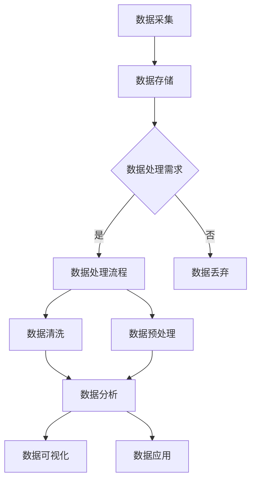

                 

关键词：人工智能，大模型，数据处理，数据中心，算法原理，数学模型，应用实例，未来发展。

> 摘要：本文将深入探讨人工智能大模型在数据中心中的数据处理技术，解析核心概念、算法原理及数学模型，并通过实际项目实践展示其应用效果，展望未来的发展趋势和面临的挑战。

## 1. 背景介绍

随着云计算和大数据技术的不断发展，数据中心的数据处理需求日益增长。传统的数据处理方法已经无法满足大规模数据的高效处理需求。近年来，人工智能（AI）特别是大模型技术在数据处理领域取得了显著的突破。大模型具备强大的数据处理能力，能够在复杂的数据场景中快速准确地提取有用信息，从而提升数据中心的整体运行效率和数据处理质量。

本文旨在探讨大模型在数据中心数据处理中的应用，分析其核心算法原理、数学模型，并通过实际项目实例展示其应用效果，为数据中心数据处理提供新的思路和方法。

## 2. 核心概念与联系

### 2.1 人工智能大模型

人工智能大模型是指那些拥有数亿甚至数十亿个参数的深度学习模型，如GPT-3、BERT等。这些模型通过大规模数据训练，具备强大的知识表示和推理能力，能够处理复杂的任务。

### 2.2 数据中心

数据中心是一个为企业和组织提供计算、存储和网络服务的场所。随着数据量的激增，数据中心需要高效地处理和存储海量数据，以满足日益增长的业务需求。

### 2.3 数据处理

数据处理是指对数据进行采集、存储、处理、分析和呈现的全过程。在数据中心，数据处理是确保业务正常运行的关键环节。

### 2.4 Mermaid 流程图

以下是数据中心数据处理的核心概念和流程的Mermaid流程图：



## 3. 核心算法原理 & 具体操作步骤

### 3.1 算法原理概述

大模型数据处理的核心算法包括深度学习、神经网络和自然语言处理等。这些算法通过多层非线性变换，对数据进行特征提取和模式识别。

### 3.2 算法步骤详解

#### 3.2.1 深度学习模型训练

1. 数据预处理：对采集到的数据进行清洗、归一化和分割，使其符合模型训练的要求。
2. 模型构建：根据数据处理任务，构建合适的深度学习模型。
3. 模型训练：使用训练数据对模型进行训练，调整模型参数。
4. 模型评估：使用验证数据对模型进行评估，调整模型参数。

#### 3.2.2 数据处理流程

1. 数据清洗：去除重复、错误和缺失的数据。
2. 数据预处理：将原始数据转换为模型可处理的格式。
3. 数据分析：使用模型对数据进行特征提取和模式识别。
4. 数据可视化：将分析结果以图表、图像等形式呈现。

### 3.3 算法优缺点

#### 优点：

1. 强大的数据处理能力：大模型能够处理复杂的任务，提取有效的特征。
2. 高效的运算速度：深度学习算法能够在短时间内处理大量数据。
3. 广泛的应用领域：大模型适用于各种数据处理任务，如文本分析、图像识别、自然语言处理等。

#### 缺点：

1. 需要大量训练数据：大模型训练需要大量的数据，数据质量直接影响模型性能。
2. 计算资源消耗大：大模型训练和推理需要大量的计算资源。

### 3.4 算法应用领域

1. 文本分析：如情感分析、主题建模、问答系统等。
2. 图像识别：如人脸识别、物体检测、图像生成等。
3. 自然语言处理：如机器翻译、文本生成、对话系统等。
4. 数据挖掘：如客户行为分析、市场预测、风险评估等。

## 4. 数学模型和公式 & 详细讲解 & 举例说明

### 4.1 数学模型构建

在数据处理中，常用的数学模型包括线性模型、神经网络模型和自然语言处理模型等。

#### 4.1.1 线性模型

线性模型是最基本的数学模型之一，其公式如下：

$$ y = wx + b $$

其中，$y$ 是预测值，$w$ 是权重，$x$ 是特征值，$b$ 是偏置。

#### 4.1.2 神经网络模型

神经网络模型是一种模拟人脑神经元的计算模型，其基本结构包括输入层、隐藏层和输出层。其公式如下：

$$ y = \sigma(\sum_{i=1}^{n} w_i \cdot x_i + b) $$

其中，$y$ 是输出值，$\sigma$ 是激活函数，$w_i$ 是隐藏层权重，$x_i$ 是输入值，$b$ 是隐藏层偏置。

#### 4.1.3 自然语言处理模型

自然语言处理模型主要基于神经网络模型，用于处理文本数据。其基本结构包括词嵌入层、编码器和解码器。其公式如下：

$$ z = E(W_e \cdot x + b_e) $$

$$ h = C(W_c \cdot z + b_c) $$

$$ p(y) = \sigma(W_o \cdot h + b_o) $$

其中，$z$ 是编码后的词向量，$h$ 是编码后的隐藏状态，$p(y)$ 是输出概率，$E$ 是词嵌入函数，$C$ 是编码器，$W_e$、$W_c$、$W_o$ 是权重矩阵，$b_e$、$b_c$、$b_o$ 是偏置。

### 4.2 公式推导过程

以下以神经网络模型为例，简要介绍公式推导过程：

1. 输入层到隐藏层的推导：

$$ a_i^l = \sum_{j=1}^{n} w_{ij}^l \cdot a_j^{l-1} + b_i^l $$

$$ z_i^l = \sigma(a_i^l) $$

其中，$a_i^l$ 是隐藏层节点 $i$ 的激活值，$z_i^l$ 是隐藏层节点 $i$ 的输出值，$\sigma$ 是激活函数，$w_{ij}^l$ 是隐藏层权重，$b_i^l$ 是隐藏层偏置，$n$ 是隐藏层节点的数量。

2. 隐藏层到输出层的推导：

$$ a_j^L = \sum_{i=1}^{m} w_{ij}^L \cdot a_i^{L-1} + b_j^L $$

$$ z_j^L = \sigma(a_j^L) $$

$$ y_j = \sum_{k=1}^{K} w_{kj} \cdot z_j^L + b_j $$

$$ p(y_j) = \sigma(z_j^L) $$

其中，$a_j^L$ 是输出层节点 $j$ 的激活值，$z_j^L$ 是输出层节点 $j$ 的输出值，$y_j$ 是输出层节点 $j$ 的预测值，$w_{kj}$ 是输出层权重，$b_j$ 是输出层偏置，$m$ 是隐藏层节点的数量，$K$ 是类别数。

### 4.3 案例分析与讲解

以下以一个简单的情感分析案例，说明数学模型在实际应用中的推导和实现。

#### 4.3.1 案例描述

给定一个包含情感极性的文本数据集，要求使用神经网络模型对文本进行情感分析，判断其属于积极情感还是消极情感。

#### 4.3.2 数据预处理

1. 词嵌入：将文本数据转换为词向量表示。
2. 切分句子：将文本数据切分成句子。
3. 标签编码：将情感标签编码为数字，如积极情感编码为1，消极情感编码为0。

#### 4.3.3 模型构建

构建一个简单的神经网络模型，包括一个输入层、一个隐藏层和一个输出层。

输入层：输入维度为词向量维度，即$D$。

隐藏层：输出维度为$H$，使用ReLU激活函数。

输出层：输出维度为1，使用Sigmoid激活函数。

#### 4.3.4 模型训练

1. 初始化权重和偏置。
2. 前向传播：计算输入层到隐藏层的激活值和输出层到隐藏层的激活值。
3. 反向传播：计算损失函数，并更新权重和偏置。
4. 模型评估：使用验证集评估模型性能。

#### 4.3.5 模型应用

使用训练好的模型对新的文本数据进行情感分析，输出情感概率，根据概率判断情感极性。

## 5. 项目实践：代码实例和详细解释说明

### 5.1 开发环境搭建

1. 安装Python和相关库，如TensorFlow、NumPy等。
2. 准备文本数据集，并进行预处理。

### 5.2 源代码详细实现

以下是情感分析项目的Python代码实现：

```python
import tensorflow as tf
from tensorflow.keras.preprocessing.text import Tokenizer
from tensorflow.keras.preprocessing.sequence import pad_sequences
from tensorflow.keras.layers import Embedding, LSTM, Dense
from tensorflow.keras.models import Sequential

# 数据预处理
tokenizer = Tokenizer(num_words=10000)
tokenizer.fit_on_texts(train_texts)
train_sequences = tokenizer.texts_to_sequences(train_texts)
train_padded = pad_sequences(train_sequences, maxlen=maxlen, truncating='post')

# 模型构建
model = Sequential()
model.add(Embedding(num_words=10000, embedding_dim=32, input_length=maxlen))
model.add(LSTM(32))
model.add(Dense(1, activation='sigmoid'))

# 模型编译
model.compile(optimizer='adam', loss='binary_crossentropy', metrics=['accuracy'])

# 模型训练
model.fit(train_padded, train_labels, epochs=10, validation_split=0.2)

# 模型应用
new_text = "这是一条积极情感的文本。"
new_sequence = tokenizer.texts_to_sequences([new_text])
new_padded = pad_sequences(new_sequence, maxlen=maxlen, truncating='post')
prediction = model.predict(new_padded)
print("预测结果：", prediction[0][0])
```

### 5.3 代码解读与分析

1. 数据预处理：使用Tokenizer对文本数据进行词嵌入，将文本转换为序列，并使用pad_sequences将序列填充为相同长度。
2. 模型构建：使用Sequential构建一个简单的神经网络模型，包括Embedding层、LSTM层和Dense层。
3. 模型编译：编译模型，指定优化器、损失函数和评价指标。
4. 模型训练：使用fit方法训练模型，指定训练数据和标签。
5. 模型应用：使用predict方法对新的文本数据进行情感分析，输出情感概率。

## 6. 实际应用场景

大模型在数据中心数据处理中的应用场景广泛，以下列举几个典型应用：

1. **文本分析**：如新闻摘要、情感分析、话题建模等。
2. **图像识别**：如图像分类、目标检测、图像生成等。
3. **自然语言处理**：如机器翻译、语音识别、对话系统等。
4. **数据挖掘**：如客户行为分析、市场预测、风险评估等。

### 6.1 数据中心文本分析

数据中心需要处理大量文本数据，如日志文件、用户评论、社交媒体数据等。使用大模型可以对这些文本数据进行情感分析、主题建模等处理，从而提取有价值的信息，为业务决策提供支持。

### 6.2 数据中心图像识别

数据中心中需要处理大量图像数据，如监控视频、医学影像等。使用大模型可以对这些图像数据进行分类、目标检测等处理，从而实现自动化监控、疾病诊断等功能。

### 6.3 数据中心自然语言处理

数据中心需要处理大量自然语言数据，如语音转文字、文本翻译、智能客服等。使用大模型可以对这些数据进行处理，从而提供高质量的语音识别、文本翻译等服务。

### 6.4 数据中心数据挖掘

数据中心需要处理大量数据，如电商数据、金融数据等。使用大模型可以进行数据挖掘，从而实现客户行为分析、市场预测、风险评估等功能，为业务提供决策支持。

## 7. 工具和资源推荐

### 7.1 学习资源推荐

1. **书籍**：
   - 《深度学习》（Goodfellow, Ian, et al.）
   - 《Python深度学习》（François Chollet）
   - 《自然语言处理原理》（Daniel Jurafsky, James H. Martin）

2. **在线课程**：
   - Coursera的《深度学习》课程（吴恩达）
   - edX的《自然语言处理》课程（Stanford University）
   - Udacity的《机器学习工程师纳米学位》

### 7.2 开发工具推荐

1. **深度学习框架**：
   - TensorFlow
   - PyTorch
   - Keras

2. **文本处理工具**：
   - NLTK
   - spaCy
   - gensim

3. **图像处理工具**：
   - OpenCV
   - PIL
   - PyTorch Vision

### 7.3 相关论文推荐

1. **文本分析**：
   - "A Neural Attention Model for Abstractive Text Summarization"
   - "BERT: Pre-training of Deep Bidirectional Transformers for Language Understanding"

2. **图像识别**：
   - "You Only Look Once: Unified, Real-Time Object Detection"
   - "Generative Adversarial Networks"

3. **自然语言处理**：
   - "Attention Is All You Need"
   - "Transformers: State-of-the-Art Natural Language Processing at Scale"

## 8. 总结：未来发展趋势与挑战

### 8.1 研究成果总结

大模型在数据中心数据处理领域取得了显著成果，其在文本分析、图像识别、自然语言处理和数据挖掘等方面展现了强大的数据处理能力。

### 8.2 未来发展趋势

1. **模型优化**：通过优化算法和架构，提高大模型的运算效率和性能。
2. **跨模态处理**：结合不同模态的数据，实现更全面的数据处理能力。
3. **知识图谱**：构建知识图谱，提高数据的关联性和语义理解能力。

### 8.3 面临的挑战

1. **数据隐私**：如何在保证数据隐私的前提下进行数据处理。
2. **计算资源**：大模型训练和推理需要大量计算资源，如何优化资源利用。
3. **模型解释性**：提高大模型的解释性，使其更易于理解和应用。

### 8.4 研究展望

未来，大模型在数据中心数据处理领域有望实现更高效、更智能的数据处理，为业务决策提供更强有力的支持。

## 9. 附录：常见问题与解答

### 9.1 什么是大模型？

大模型是指那些拥有数亿甚至数十亿个参数的深度学习模型，如GPT-3、BERT等。

### 9.2 大模型在数据中心数据处理中的应用有哪些？

大模型在数据中心数据处理中的应用包括文本分析、图像识别、自然语言处理和数据挖掘等。

### 9.3 如何优化大模型的运算效率？

通过优化算法和架构，如使用更高效的神经网络架构、并行计算和分布式计算等，可以提高大模型的运算效率。

### 9.4 如何保证大模型的数据隐私？

通过数据加密、差分隐私和联邦学习等技术，可以在保证数据隐私的前提下进行大模型训练和推理。

作者：禅与计算机程序设计艺术 / Zen and the Art of Computer Programming
------------------------------------------------------------------------

