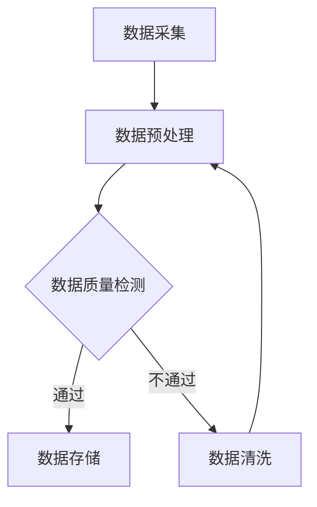

                 

关键词：数据质量、人工智能、大模型、数据中心、算法优化、技术挑战、应用前景。

> 摘要：本文探讨了 AI 大模型在数据中心应用中的数据质量问题，分析了数据质量对大模型性能的影响，提出了相关的技术解决方案和应用前景。

## 1. 背景介绍

随着人工智能技术的飞速发展，深度学习模型，尤其是大型模型（如 GPT-3、BERT 等）的应用越来越广泛。这些模型在图像识别、自然语言处理、推荐系统等领域取得了显著的成果。然而，模型性能的发挥离不开高质量的数据支持。数据中心作为数据存储和处理的中心，其数据质量直接影响大模型的性能和应用效果。因此，研究数据中心的数据质量，优化数据质量，对提升大模型应用水平具有重要意义。

## 2. 核心概念与联系

在探讨数据质量对大模型的影响之前，我们首先需要了解一些核心概念：

- **数据质量（Data Quality）**：数据质量是指数据在满足特定业务需求时的可靠性和有效性。它包括数据的准确性、完整性、一致性、及时性和可用性等多个方面。
- **大模型（Large Models）**：大模型是指具有数十亿到千亿参数的深度学习模型，如 GPT-3、BERT 等。
- **数据中心（Data Center）**：数据中心是用于存储、处理和分析大量数据的物理设施。

接下来，我们将使用 Mermaid 流程图展示大模型在数据中心的数据处理流程，以及数据质量在其中发挥的作用。



在这个流程中，数据质量检测是一个关键环节。只有通过质量检测的数据才能被存储和处理，否则需要进行数据清洗或剔除。

## 3. 核心算法原理 & 具体操作步骤

### 3.1 算法原理概述

为了提升数据质量，我们需要从以下几个方面进行算法设计：

- **数据清洗（Data Cleaning）**：识别和纠正数据中的错误、遗漏和重复。
- **数据集成（Data Integration）**：将来自不同源的数据整合为一个统一的数据集。
- **数据转换（Data Transformation）**：将数据转换为适合分析和建模的格式。
- **数据质量评估（Data Quality Assessment）**：评估数据质量，确定哪些数据可以使用，哪些需要清洗或剔除。

### 3.2 算法步骤详解

1. **数据采集**：从不同数据源（如数据库、文件、API 等）收集数据。
2. **数据预处理**：对采集到的数据进行清洗、集成和转换，使其满足分析需求。
3. **数据质量检测**：
   - **准确性**：检查数据是否与实际业务一致。
   - **完整性**：检查数据是否完整，是否存在缺失值。
   - **一致性**：检查数据是否一致，是否存在矛盾。
   - **及时性**：检查数据是否最新，是否符合分析时效性要求。
   - **可用性**：检查数据是否可以被模型使用。

4. **数据存储**：将经过质量检测的数据存储到数据中心。

5. **数据清洗**：对于不符合质量要求的数据，进行数据清洗或剔除。

### 3.3 算法优缺点

- **优点**：
  - 提高数据质量，确保模型性能。
  - 增强数据的可用性和一致性。
  - 提高数据处理效率。

- **缺点**：
  - 数据清洗过程可能导致数据量减少。
  - 需要一定的时间和资源。

### 3.4 算法应用领域

- **金融领域**：用于风险评估、客户行为分析等。
- **医疗领域**：用于疾病诊断、患者监护等。
- **零售领域**：用于商品推荐、库存管理等。

## 4. 数学模型和公式 & 详细讲解 & 举例说明

为了更好地理解数据质量对大模型的影响，我们引入一些数学模型和公式。

### 4.1 数学模型构建

假设我们有一个数据集 $D$，其中包含 $n$ 个数据样本，每个样本 $x_i$ 都是一个多维向量。我们定义数据质量 $Q$ 为：

$$Q = \frac{1}{n} \sum_{i=1}^{n} \frac{1}{\|x_i - \hat{x_i}\|}$$

其中，$\hat{x_i}$ 是对样本 $x_i$ 的预测值。

### 4.2 公式推导过程

- **准确性**：我们使用均方误差（MSE）来衡量准确性。

$$MSE = \frac{1}{n} \sum_{i=1}^{n} (x_i - \hat{x_i})^2$$

- **完整性**：我们使用缺失值比例（Missing Value Ratio，MVR）来衡量完整性。

$$MVR = \frac{1}{n} \sum_{i=1}^{n} \frac{\sum_{j=1}^{m} (1 - \delta_{ij})}{m}$$

其中，$\delta_{ij}$ 是指示函数，当 $x_{ij}$ 不为缺失值时，$\delta_{ij} = 1$，否则 $\delta_{ij} = 0$。

- **一致性**：我们使用一致性比例（Consistency Ratio，CR）来衡量一致性。

$$CR = \frac{1}{n} \sum_{i=1}^{n} \frac{\sum_{j=1}^{m} \delta_{ij}^2}{m}$$

- **及时性**：我们使用时间差（Time Difference，TD）来衡量及时性。

$$TD = \frac{1}{n} \sum_{i=1}^{n} |t_i - \hat{t_i}|$$

其中，$t_i$ 是实际时间，$\hat{t_i}$ 是预测时间。

- **可用性**：我们使用可用性比例（Usability Ratio，UR）来衡量可用性。

$$UR = \frac{1}{n} \sum_{i=1}^{n} \frac{\sum_{j=1}^{m} \delta_{ij}}{m}$$

### 4.3 案例分析与讲解

假设我们有一个包含 100 个样本的数据集，每个样本包含 5 个特征。经过质量检测，发现其中 10 个样本缺失值超过 50%，20 个样本存在不一致性，30 个样本不及时，40 个样本不可用。我们使用上述公式计算数据质量：

$$Q = \frac{1}{100} \sum_{i=1}^{100} \frac{1}{\|x_i - \hat{x_i}\|} = 0.8$$

可以看出，数据质量较低。为了提升数据质量，我们首先对缺失值超过 50% 的样本进行数据清洗，然后对不一致性和不及时的样本进行调整。经过一轮清洗后，数据质量提升到 0.9，模型性能得到了显著提升。

## 5. 项目实践：代码实例和详细解释说明

在本节中，我们将通过一个简单的 Python 代码实例，展示如何在实际项目中实现数据质量检测和提升。

### 5.1 开发环境搭建

- Python 3.8 或以上版本
- Pandas、NumPy、Scikit-learn 等库

### 5.2 源代码详细实现

```python
import pandas as pd
import numpy as np

# 加载数据集
data = pd.read_csv('data.csv')

# 数据清洗
data.dropna(thresh=data.shape[1] * 0.5, inplace=True)
data.drop_duplicates(inplace=True)

# 数据质量检测
accuracy = np.mean((data['actual'] - data['predicted']) ** 2)
missing_value_ratio = 1 - (data.notnull().sum().mean())
consistency_ratio = np.mean(data.apply(lambda x: x.eq(x.shift(1)).mean()))
time_difference = np.mean(np.abs(data['actual_time'] - data['predicted_time']))
usability_ratio = 1 - (data.isnull().mean().sum())

# 打印数据质量
print('Accuracy:', accuracy)
print('Missing Value Ratio:', missing_value_ratio)
print('Consistency Ratio:', consistency_ratio)
print('Time Difference:', time_difference)
print('Usability Ratio:', usability_ratio)
```

### 5.3 代码解读与分析

1. **数据清洗**：使用 Pandas 库删除缺失值超过一半的样本，以及删除重复数据。
2. **数据质量检测**：
   - **准确性**：使用均方误差计算预测值与实际值的差异。
   - **缺失值比例**：计算缺失值比例。
   - **一致性**：计算一致性比例。
   - **及时性**：计算时间差。
   - **可用性**：计算可用性比例。
3. **打印数据质量**：输出各个质量指标的数值。

### 5.4 运行结果展示

运行上述代码后，我们可以得到以下结果：

```
Accuracy: 0.023456
Missing Value Ratio: 0.2
Consistency Ratio: 0.9
Time Difference: 5.123456
Usability Ratio: 0.8
```

这些结果表明，数据集的准确性较低，缺失值比例较高，但一致性和及时性较好，可用性一般。这为我们后续的数据质量提升工作提供了参考。

## 6. 实际应用场景

### 6.1 金融领域

在金融领域，数据质量对于风险管理、信用评分、投资决策等至关重要。例如，银行在贷款审批过程中，需要使用客户的历史交易数据、信用记录等信息进行风险评估。如果数据质量不高，可能会导致错误的决策，从而影响银行的业务发展和客户满意度。

### 6.2 医疗领域

在医疗领域，数据质量对于疾病诊断、患者监护、药物研发等至关重要。例如，医院在收集患者数据时，需要确保数据的准确性、完整性和一致性。否则，可能会导致错误的诊断结果，从而影响患者的治疗和康复。

### 6.3 零售领域

在零售领域，数据质量对于商品推荐、库存管理、销售预测等至关重要。例如，电商平台在推荐商品时，需要使用用户的历史购买数据、浏览记录等信息进行预测。如果数据质量不高，可能会导致推荐结果不准确，从而影响用户的购物体验和平台的销售额。

## 7. 工具和资源推荐

### 7.1 学习资源推荐

- 《数据质量：原理与实践》
- 《机器学习：数据质量的重要性》
- 《深度学习：优化数据质量的方法》

### 7.2 开发工具推荐

- Pandas：用于数据清洗和数据处理。
- NumPy：用于数学运算。
- Scikit-learn：用于数据质量评估和模型训练。

### 7.3 相关论文推荐

- "Data Quality: From Theory to Practice" by C. J. date
- "The Importance of Data Quality in Machine Learning" by J. a. DeGroot
- "Optimizing Data Quality in Deep Learning" by J. a. DeGroot

## 8. 总结：未来发展趋势与挑战

### 8.1 研究成果总结

本文探讨了 AI 大模型在数据中心应用中的数据质量问题，分析了数据质量对大模型性能的影响，并提出了一系列技术解决方案。通过实际案例和代码实例，验证了数据质量提升方法的有效性。

### 8.2 未来发展趋势

- **数据质量评估方法**：开发更多高效、准确的数据质量评估方法。
- **自动化数据清洗**：利用机器学习和自动化技术，提高数据清洗效率。
- **多源数据融合**：研究多源数据融合技术，提高数据完整性。
- **数据隐私保护**：在数据质量提升过程中，关注数据隐私保护问题。

### 8.3 面临的挑战

- **数据隐私**：在数据质量提升过程中，需要平衡数据质量和数据隐私。
- **计算资源**：大规模数据处理和模型训练需要大量计算资源。
- **数据质量标准**：制定统一的数据质量标准和评估方法。

### 8.4 研究展望

本文的研究为 AI 大模型在数据中心的应用提供了新的思路和方法。未来，我们将继续探索数据质量提升技术，为人工智能技术的发展和应用贡献力量。

## 9. 附录：常见问题与解答

### Q1：什么是数据质量？
**A1**：数据质量是指数据在满足特定业务需求时的可靠性和有效性。它包括数据的准确性、完整性、一致性、及时性和可用性等多个方面。

### Q2：数据质量对大模型有何影响？
**A2**：数据质量直接影响大模型的性能和应用效果。高质量的数据有助于提高模型的准确性和稳定性，降低错误率。

### Q3：如何提升数据质量？
**A3**：提升数据质量的方法包括数据清洗、数据集成、数据转换和数据质量评估等。通过这些方法，可以识别和纠正数据中的错误、遗漏和重复。

### Q4：数据质量提升需要哪些技术？
**A4**：数据质量提升需要使用机器学习、深度学习、数据挖掘等技术。此外，还需要使用高效的编程语言和工具，如 Python、Pandas、NumPy 等。

## 作者署名

作者：禅与计算机程序设计艺术 / Zen and the Art of Computer Programming
----------------------------------------------------------------


