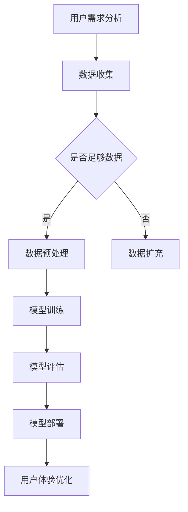

                 

关键词：AI 大模型、创业产品设计、趋势分析、技术语言、市场需求

摘要：随着人工智能技术的不断进步，大模型在创业产品设计中的应用越来越广泛。本文旨在探讨AI大模型在创业产品设计中的趋势，分析其核心概念、算法原理、数学模型以及实际应用案例，并对未来发展趋势与挑战进行展望。

## 1. 背景介绍

近年来，人工智能技术取得了显著的进展，尤其是深度学习领域的突破，使得大模型（Large Models）成为了人工智能研究的重要方向。大模型具有参数多、计算量大、表示能力强等特点，能够处理复杂任务，并从海量数据中提取有价值的信息。在创业产品设计中，大模型的应用极大地提升了产品的用户体验和市场竞争力。

创业产品设计过程中，常常需要解决用户需求预测、个性化推荐、图像处理、自然语言处理等问题。大模型在这些领域的应用，不仅提高了数据处理和分析的效率，还实现了更精确、更智能的决策支持。因此，本文将围绕AI大模型在创业产品设计中的趋势进行分析，为创业者提供有价值的参考。

## 2. 核心概念与联系

### 2.1 大模型概念

大模型是指具有大量参数和计算能力的神经网络模型。根据模型规模和计算资源的不同，大模型可以分为以下几种类型：

1. **参数规模**：数十亿至数万亿个参数。
2. **计算资源**：需要高性能计算集群和GPU等硬件支持。

### 2.2 关联技术

大模型的应用离不开相关技术的支持，主要包括：

1. **深度学习**：深度学习是一种多层神经网络模型，能够自动从数据中学习特征表示。
2. **自然语言处理（NLP）**：NLP是研究如何让计算机理解和生成自然语言的技术。
3. **计算机视觉**：计算机视觉是研究如何让计算机从图像或视频中获取信息的学科。
4. **推荐系统**：推荐系统是一种基于用户行为和偏好，为用户提供个性化推荐的技术。

### 2.3 Mermaid 流程图

下面是大模型在创业产品设计中的流程图：



## 3. 核心算法原理 & 具体操作步骤

### 3.1 算法原理概述

大模型的核心算法是深度学习，其基本原理是通过多层神经网络对输入数据进行特征提取和表示。大模型通常包含以下步骤：

1. **数据输入**：将原始数据输入到神经网络中。
2. **前向传播**：通过多层神经网络对输入数据进行特征提取和转换。
3. **激活函数**：对神经网络输出进行非线性变换。
4. **反向传播**：利用损失函数对网络权重进行调整。
5. **模型评估**：使用验证集对模型性能进行评估。
6. **模型优化**：根据评估结果调整模型参数。

### 3.2 算法步骤详解

1. **数据收集**：收集用户行为数据、用户反馈、市场趋势等。
2. **数据预处理**：清洗、归一化、编码等操作，确保数据质量。
3. **模型训练**：选择合适的神经网络结构，使用训练数据对模型进行训练。
4. **模型评估**：使用验证集评估模型性能，调整模型参数。
5. **模型部署**：将训练好的模型部署到生产环境中，为用户提供服务。
6. **用户体验优化**：根据用户反馈和实际应用效果，对模型进行优化。

### 3.3 算法优缺点

**优点**：

1. **强大的表示能力**：能够自动提取和表示复杂的数据特征。
2. **自适应性强**：能够根据数据变化进行调整。
3. **处理大量数据**：能够高效地处理海量数据。

**缺点**：

1. **计算资源需求大**：需要高性能计算硬件支持。
2. **训练时间长**：训练过程需要大量时间和计算资源。
3. **数据依赖性强**：模型的性能依赖于数据质量和数量。

### 3.4 算法应用领域

大模型在创业产品设计中的应用非常广泛，主要包括以下几个方面：

1. **用户需求预测**：通过分析用户行为数据，预测用户需求，为产品优化提供依据。
2. **个性化推荐**：根据用户兴趣和偏好，为用户提供个性化的内容推荐。
3. **图像处理**：实现图像识别、目标检测、图像生成等功能。
4. **自然语言处理**：实现文本分类、情感分析、机器翻译等功能。

## 4. 数学模型和公式 & 详细讲解 & 举例说明

### 4.1 数学模型构建

大模型的数学模型主要包括以下几个方面：

1. **损失函数**：用于评估模型预测结果与真实值之间的差距，常用的损失函数有均方误差（MSE）和交叉熵（CE）。
2. **反向传播算法**：用于更新神经网络权重，使得模型预测结果更接近真实值。
3. **优化算法**：用于调整模型参数，常用的优化算法有梯度下降（GD）和Adam。

### 4.2 公式推导过程

以均方误差（MSE）为例，其公式推导过程如下：

$$
MSE = \frac{1}{n}\sum_{i=1}^{n}(y_i - \hat{y}_i)^2
$$

其中，$y_i$表示真实值，$\hat{y}_i$表示预测值，$n$表示样本数量。

### 4.3 案例分析与讲解

以下是一个简单的线性回归模型的例子，用于预测房价：

```python
import numpy as np
import matplotlib.pyplot as plt

# 生成训练数据
X = np.random.rand(100, 1) * 10
y = 2 * X + np.random.randn(100, 1) * 0.1 + 10

# 定义损失函数
def mse(y_pred, y_true):
    return np.mean((y_pred - y_true) ** 2)

# 定义反向传播算法
def backwardpropagation(w, X, y, y_pred):
    dL_dw = 2 * (y_pred - y) * X
    return dL_dw

# 定义优化算法
def gradientdescent(w, X, y, learning_rate, epochs):
    for epoch in range(epochs):
        y_pred = X.dot(w)
        dL_dw = backwardpropagation(w, X, y, y_pred)
        w -= learning_rate * dL_dw
    return w

# 模型训练
w = np.random.rand(1)
learning_rate = 0.01
epochs = 100
w_optimized = gradientdescent(w, X, y, learning_rate, epochs)

# 模型评估
y_pred = X.dot(w_optimized)
mse_value = mse(y_pred, y)
print("MSE:", mse_value)

# 结果可视化
plt.scatter(X, y)
plt.plot(X, y_pred, color='red')
plt.show()
```

## 5. 项目实践：代码实例和详细解释说明

### 5.1 开发环境搭建

在开始项目实践之前，需要搭建一个适合深度学习开发的Python环境。具体步骤如下：

1. 安装Python（推荐使用Python 3.7及以上版本）。
2. 安装深度学习框架（如TensorFlow或PyTorch）。
3. 安装其他必要库（如NumPy、Matplotlib等）。

### 5.2 源代码详细实现

以下是一个简单的使用TensorFlow实现线性回归的例子：

```python
import tensorflow as tf
import numpy as np
import matplotlib.pyplot as plt

# 生成训练数据
X = np.random.rand(100, 1) * 10
y = 2 * X + np.random.randn(100, 1) * 0.1 + 10

# 定义模型
model = tf.keras.Sequential([
    tf.keras.layers.Dense(units=1, input_shape=(1,))
])

# 编译模型
model.compile(optimizer='sgd', loss='mean_squared_error')

# 训练模型
model.fit(X, y, epochs=100)

# 模型评估
y_pred = model.predict(X)
mse_value = tf.reduce_mean(tf.square(y_pred - y)).numpy()
print("MSE:", mse_value)

# 结果可视化
plt.scatter(X, y)
plt.plot(X, y_pred, color='red')
plt.show()
```

### 5.3 代码解读与分析

1. **数据生成**：使用numpy库生成100个随机数据点，作为训练数据。
2. **模型定义**：使用TensorFlow的Sequential模型，定义一个全连接层，输出层只有一个神经元。
3. **模型编译**：指定优化器和损失函数，准备训练。
4. **模型训练**：使用fit函数训练模型，指定训练轮数。
5. **模型评估**：使用predict函数预测数据，计算MSE。
6. **结果可视化**：使用matplotlib库绘制散点图和拟合线。

## 6. 实际应用场景

### 6.1 用户需求预测

在电商领域，通过分析用户浏览、购买等行为数据，可以预测用户的需求，为产品推荐提供依据。

### 6.2 个性化推荐

在社交媒体领域，通过分析用户兴趣和行为，为用户推荐感兴趣的内容，提高用户活跃度和满意度。

### 6.3 图像处理

在安防领域，通过图像识别和目标检测技术，实现实时监控和报警功能。

### 6.4 自然语言处理

在金融领域，通过自然语言处理技术，实现自动化文本分类、情感分析和文本生成等功能。

## 7. 工具和资源推荐

### 7.1 学习资源推荐

1. **《深度学习》（Goodfellow et al.）**：深度学习领域的经典教材，适合初学者。
2. **《TensorFlow 实战》（王东成）**：详细介绍TensorFlow框架的实战书籍。

### 7.2 开发工具推荐

1. **Google Colab**：免费的云端Python编程环境，适合深度学习开发。
2. **Jupyter Notebook**：强大的交互式Python开发环境，支持多种编程语言。

### 7.3 相关论文推荐

1. **“Deep Learning for NLP”**：介绍深度学习在自然语言处理中的应用。
2. **“Convolutional Neural Networks for Visual Recognition”**：介绍卷积神经网络在图像处理中的应用。

## 8. 总结：未来发展趋势与挑战

### 8.1 研究成果总结

1. **大模型性能提升**：随着计算资源和算法的优化，大模型在多个领域的性能不断提升。
2. **多模态数据处理**：结合文本、图像、声音等多模态数据，实现更智能的应用。
3. **迁移学习和零样本学习**：研究如何在大模型中实现有效的迁移学习和零样本学习。

### 8.2 未来发展趋势

1. **大模型商业化**：大模型在创业产品设计中的应用将越来越广泛，推动相关产业的发展。
2. **个性化与智能化**：大模型将实现更精准的个性化推荐和智能化决策支持。

### 8.3 面临的挑战

1. **计算资源需求**：大模型对计算资源的需求越来越大，如何高效利用计算资源成为关键问题。
2. **数据隐私与安全**：在大模型训练和部署过程中，如何保护用户数据隐私和安全成为重要挑战。

### 8.4 研究展望

1. **自适应大模型**：研究如何在大模型中实现自适应性和动态调整能力。
2. **可解释性**：提高大模型的可解释性，使其在创业产品设计中更具可信赖性。

## 9. 附录：常见问题与解答

### 9.1 什么是大模型？

大模型是指具有大量参数和计算能力的神经网络模型，能够自动从数据中学习特征表示。

### 9.2 大模型的优势是什么？

大模型具有强大的表示能力、自适应性强和能够处理大量数据等优势。

### 9.3 大模型在创业产品设计中有哪些应用？

大模型在创业产品设计中的应用包括用户需求预测、个性化推荐、图像处理和自然语言处理等。

### 9.4 如何搭建深度学习开发环境？

搭建深度学习开发环境需要安装Python、深度学习框架（如TensorFlow或PyTorch）以及其他必要库。

### 9.5 如何优化大模型的性能？

优化大模型的性能可以从算法优化、数据预处理和模型压缩等方面进行。

### 9.6 大模型在创业产品设计中面临哪些挑战？

大模型在创业产品设计中面临计算资源需求大、训练时间长和数据依赖性强等挑战。

### 9.7 未来大模型的发展方向是什么？

未来大模型的发展方向包括自适应大模型、迁移学习和零样本学习等。

### 9.8 如何保护用户数据隐私和安全？

保护用户数据隐私和安全可以从数据加密、数据去标识化和隐私保护算法等方面进行。作者：禅与计算机程序设计艺术 / Zen and the Art of Computer Programming。

