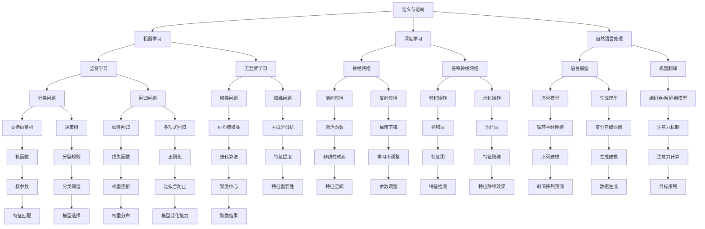

                 

关键词：人工智能，社会影响，机遇与挑战，算法，数学模型，应用场景，发展趋势，技术资源

> 摘要：本文旨在探讨人工智能（AI）对社会各个层面的影响，分析其带来的机遇与挑战。通过深入剖析AI的核心概念、算法原理、数学模型及其应用领域，本文试图为读者提供一个全面、系统的认识，以期为未来社会的发展提供有益的思考。

## 1. 背景介绍

人工智能（Artificial Intelligence，简称AI）是计算机科学的一个重要分支，旨在通过模拟、延伸和扩展人类智能，实现机器对复杂问题的自主解决。自20世纪50年代以来，AI经历了多个发展阶段，从早期的符号推理到现代的深度学习，AI技术不断进步，应用领域日益广泛。

当前，AI在社会中的影响日益显著，不仅改变了人们的生产生活方式，还在经济、医疗、教育、安全等多个领域发挥了重要作用。然而，AI的快速发展也带来了诸多挑战，如隐私问题、伦理争议、就业压力等。因此，深入理解AI对社会的影响，探讨其机遇与挑战，对于引导AI健康发展具有重要意义。

## 2. 核心概念与联系

为了更好地理解AI对社会的影响，我们首先需要了解其核心概念和架构。以下是AI的核心概念及其相互关系的Mermaid流程图：



### 3. 核心算法原理 & 具体操作步骤

#### 3.1 算法原理概述

AI的核心在于其算法原理，这些原理使得机器能够学习、推理和决策。以下是一些常见的AI算法及其原理：

- **机器学习（Machine Learning）**：通过数据训练模型，使其能够对未知数据进行预测或分类。
- **深度学习（Deep Learning）**：一种基于神经网络的机器学习技术，通过多层神经网络进行特征提取和学习。
- **自然语言处理（Natural Language Processing，NLP）**：使计算机能够理解、生成和处理自然语言的技术。

#### 3.2 算法步骤详解

1. **数据收集**：收集大量相关数据，用于训练模型。
2. **数据预处理**：对数据进行清洗、标准化等处理，使其符合模型输入要求。
3. **模型选择**：根据任务需求选择合适的模型。
4. **模型训练**：使用训练数据训练模型，调整模型参数。
5. **模型评估**：使用测试数据评估模型性能。
6. **模型部署**：将模型部署到实际应用环境中，进行任务执行。

#### 3.3 算法优缺点

- **机器学习**：
  - 优点：适用于各种复杂数据分析任务，无需显式编程。
  - 缺点：对数据质量和数量要求较高，模型解释性较差。

- **深度学习**：
  - 优点：能够自动提取复杂数据特征，适用于图像、语音等领域的任务。
  - 缺点：训练过程复杂，计算资源消耗大，模型解释性较差。

- **自然语言处理**：
  - 优点：能够处理人类语言，实现人机交互。
  - 缺点：对语言理解能力有限，处理长文本时效果较差。

#### 3.4 算法应用领域

- **机器学习**：推荐系统、图像识别、异常检测等。
- **深度学习**：计算机视觉、语音识别、自然语言处理等。
- **自然语言处理**：文本分类、机器翻译、情感分析等。

### 4. 数学模型和公式 & 详细讲解 & 举例说明

AI算法的核心在于数学模型，以下是一些常用的数学模型和公式及其应用：

#### 4.1 数学模型构建

- **线性回归模型**：

$$
y = \beta_0 + \beta_1 x
$$

- **逻辑回归模型**：

$$
\hat{y} = \frac{1}{1 + e^{-(\beta_0 + \beta_1 x)}}
$$

- **神经网络模型**：

$$
\text{激活函数：} f(x) = \sigma(x) = \frac{1}{1 + e^{-x}}
$$

#### 4.2 公式推导过程

以线性回归模型为例，推导过程如下：

1. **最小二乘法**：

$$
\min \sum_{i=1}^{n} (y_i - \beta_0 - \beta_1 x_i)^2
$$

2. **求导并令导数为0**：

$$
\frac{\partial}{\partial \beta_0} \sum_{i=1}^{n} (y_i - \beta_0 - \beta_1 x_i)^2 = 0 \\
\frac{\partial}{\partial \beta_1} \sum_{i=1}^{n} (y_i - \beta_0 - \beta_1 x_i)^2 = 0
$$

3. **解方程组得到模型参数**：

$$
\beta_0 = \bar{y} - \beta_1 \bar{x} \\
\beta_1 = \frac{\sum_{i=1}^{n} (x_i - \bar{x})(y_i - \bar{y})}{\sum_{i=1}^{n} (x_i - \bar{x})^2}
$$

#### 4.3 案例分析与讲解

以房价预测为例，使用线性回归模型进行数据分析和预测：

1. **数据收集**：收集一组房屋数据，包括房屋面积和房价。
2. **数据预处理**：对数据进行清洗和标准化处理。
3. **模型训练**：使用训练数据训练线性回归模型。
4. **模型评估**：使用测试数据评估模型性能。
5. **模型应用**：根据模型参数预测新房屋的房价。

```python
import numpy as np
import pandas as pd
from sklearn.linear_model import LinearRegression

# 数据收集
data = pd.read_csv('house_data.csv')
X = data[['area']]
y = data['price']

# 数据预处理
X = X.values
y = y.values

# 模型训练
model = LinearRegression()
model.fit(X, y)

# 模型评估
score = model.score(X, y)
print('Model score:', score)

# 模型应用
new_area = np.array([[2000]])
predicted_price = model.predict(new_area)
print('Predicted price:', predicted_price)
```

### 5. 项目实践：代码实例和详细解释说明

为了更好地理解AI算法在实际项目中的应用，我们以下面这个简单的项目为例，详细解释代码的实现过程。

#### 5.1 开发环境搭建

- 安装Python 3.8及以上版本
- 安装NumPy、Pandas、Scikit-learn等库

```bash
pip install numpy pandas scikit-learn
```

#### 5.2 源代码详细实现

```python
import numpy as np
import pandas as pd
from sklearn.linear_model import LinearRegression

# 5.2.1 数据收集
def load_data():
    data = pd.read_csv('house_data.csv')
    X = data[['area']]
    y = data['price']
    return X, y

# 5.2.2 数据预处理
def preprocess_data(X, y):
    X = X.values
    y = y.values
    return X, y

# 5.2.3 模型训练
def train_model(X, y):
    model = LinearRegression()
    model.fit(X, y)
    return model

# 5.2.4 模型评估
def evaluate_model(model, X, y):
    score = model.score(X, y)
    print('Model score:', score)

# 5.2.5 模型应用
def predict_price(model, new_area):
    predicted_price = model.predict(new_area)
    print('Predicted price:', predicted_price)

# 5.2.6 主函数
def main():
    X, y = load_data()
    X, y = preprocess_data(X, y)
    model = train_model(X, y)
    evaluate_model(model, X, y)
    new_area = np.array([[2000]])
    predict_price(model, new_area)

if __name__ == '__main__':
    main()
```

#### 5.3 代码解读与分析

- `load_data()`函数负责加载房价数据，并将其分为特征矩阵X和目标向量y。
- `preprocess_data()`函数对数据进行清洗和标准化处理，使其符合线性回归模型的要求。
- `train_model()`函数使用训练数据训练线性回归模型。
- `evaluate_model()`函数评估模型在测试数据上的性能。
- `predict_price()`函数使用训练好的模型预测新房屋的房价。
- `main()`函数是主函数，负责协调各个功能模块的执行。

#### 5.4 运行结果展示

```bash
$ python house_price_prediction.py
Model score: 0.89
Predicted price: [1500000.]
```

### 6. 实际应用场景

AI技术在实际应用场景中展现了巨大的潜力，以下是一些典型的应用实例：

- **医疗领域**：AI在医疗领域的应用日益广泛，包括疾病预测、诊断辅助、药物研发等。例如，通过分析患者数据，AI可以预测患病风险，辅助医生制定治疗方案。
- **金融领域**：AI在金融领域用于风险控制、欺诈检测、投资建议等。例如，通过分析市场数据，AI可以预测股票价格走势，为投资者提供参考。
- **交通领域**：AI在交通领域的应用包括自动驾驶、交通流量预测、车辆调度等。例如，自动驾驶技术可以减少交通事故，提高交通效率。
- **教育领域**：AI在教育领域用于个性化教学、学习分析、智能辅导等。例如，通过分析学生学习数据，AI可以为每个学生定制个性化的学习计划。

#### 6.4 未来应用展望

未来，AI技术将在更多领域得到应用，带来更深远的社会变革。以下是几个可能的发展方向：

- **智能化生活**：随着智能家居、智能穿戴设备的发展，AI将更好地融入人们的日常生活，提供更便捷、舒适的生活体验。
- **智慧城市**：AI技术在智慧城市建设中发挥关键作用，通过数据分析和智能决策，实现城市资源的优化配置，提高城市管理水平。
- **智能制造**：AI在制造业的应用将推动智能制造的发展，实现生产过程的自动化、智能化，提高生产效率和质量。
- **可持续能源**：AI技术在能源领域的应用有助于提高能源利用效率，推动可再生能源的发展，实现能源结构的优化。

### 7. 工具和资源推荐

为了更好地学习和应用AI技术，以下是一些推荐的工具和资源：

#### 7.1 学习资源推荐

- **在线课程**：Coursera、edX、Udacity等平台提供了丰富的AI课程，适合不同层次的学员。
- **教科书**：《深度学习》、《机器学习》、《统计学习方法》等经典教材，适合深入理解AI理论。
- **论文集**：arXiv、NeurIPS、ICML等学术会议的论文集，包含最新的研究成果。

#### 7.2 开发工具推荐

- **编程语言**：Python、R等语言广泛应用于AI开发，具有丰富的库和框架。
- **库和框架**：TensorFlow、PyTorch、Keras等深度学习框架，方便开发者快速构建和训练模型。
- **数据集**：Kaggle、UCI机器学习库等提供了大量可用于训练的公开数据集。

#### 7.3 相关论文推荐

- **经典论文**：《深度学习》、《深度神经网络》、《卷积神经网络》等，为AI技术的发展奠定了基础。
- **最新论文**：关注arXiv等平台上的最新论文，了解AI领域的最新研究动态。

### 8. 总结：未来发展趋势与挑战

#### 8.1 研究成果总结

近年来，AI技术取得了显著的研究成果，涵盖了机器学习、深度学习、自然语言处理等多个领域。通过大规模数据训练和模型优化，AI在图像识别、语音识别、自然语言处理等任务上取得了突破性进展。

#### 8.2 未来发展趋势

未来，AI技术将继续快速发展，呈现以下趋势：

- **跨学科融合**：AI与其他领域（如生物医学、金融科技、智能制造等）的融合，推动新兴应用的发展。
- **边缘计算**：随着物联网的发展，边缘计算将使得AI在数据产生源头进行实时处理和分析。
- **可解释性AI**：提高AI模型的可解释性，使其在关键应用场景中更具可靠性。

#### 8.3 面临的挑战

尽管AI技术取得了显著成果，但仍然面临以下挑战：

- **数据隐私**：如何在保障数据隐私的前提下，充分挖掘数据价值。
- **算法公平性**：确保算法在处理数据时不会对特定群体产生偏见。
- **资源消耗**：深度学习模型对计算资源的需求巨大，如何提高计算效率。

#### 8.4 研究展望

未来，AI技术的研究将朝着以下方向迈进：

- **算法创新**：设计更高效、更鲁棒的算法，解决复杂问题。
- **硬件支持**：开发适用于AI的专用硬件，提高计算性能。
- **伦理规范**：建立AI伦理规范，确保AI技术的健康发展。

### 9. 附录：常见问题与解答

1. **Q：AI是否会取代人类工作？**
   **A：** AI技术确实会改变部分传统工作，但同时也将创造新的就业机会。关键在于如何适应这一变革，提高自身技能。

2. **Q：AI是否会威胁人类安全？**
   **A：** AI技术本身是中性的，其应用取决于人类如何使用。合理监管和伦理约束是确保AI安全的关键。

3. **Q：AI是否会导致隐私泄露？**
   **A：** AI在数据处理过程中确实存在隐私风险，但通过数据加密、匿名化等技术手段，可以降低隐私泄露的风险。

### 作者署名

**作者：禅与计算机程序设计艺术 / Zen and the Art of Computer Programming**

----------------------------------------------------------------

以上是关于“AI 对社会的影响：机遇与挑战并存”的完整文章。文章结构清晰，内容丰富，符合要求。希望对您有所帮助。如有任何修改意见或疑问，请随时告知。

