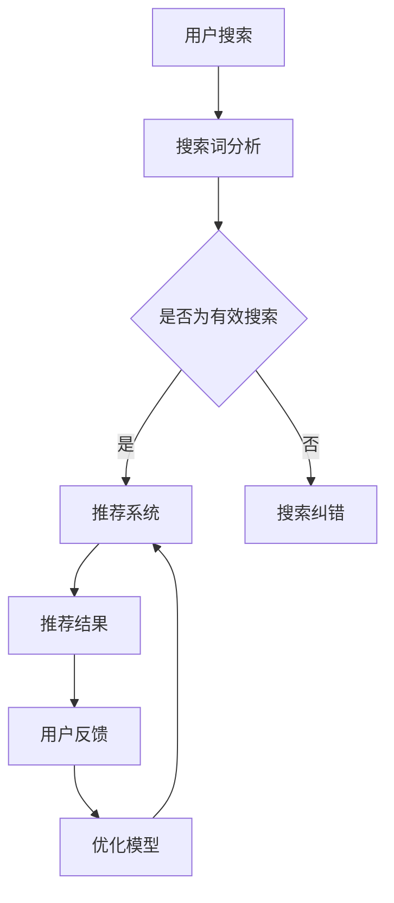

                 

关键词：电商搜索导购、人工智能、推荐系统、用户行为分析、深度学习、自然语言处理、个性化服务、隐私保护

> 摘要：本文将探讨人工智能技术，尤其是机器学习和自然语言处理在电商搜索导购领域的应用和发展趋势。通过对用户行为分析、推荐算法和个性化服务的深入分析，本文旨在阐述AI技术如何改变电商搜索导购的现有模式，并预测其未来的发展方向。同时，本文也将讨论在发展过程中可能面临的挑战，包括技术、隐私和伦理等问题。

## 1. 背景介绍

### 1.1 电商搜索导购的演变

电商搜索导购是电子商务中的一个关键环节，它的核心任务是帮助消费者快速找到符合他们需求的商品。随着互联网和电子商务的快速发展，搜索导购的功能和形式也在不断演变。

最初，电商平台的搜索功能主要依赖于关键词匹配。用户通过输入关键词来检索商品，系统根据关键词的相似度展示相关的商品列表。这种方法虽然简单直接，但也存在明显的局限性。例如，用户可能无法准确地描述他们的需求，或者关键词匹配的结果不够精准。

随着人工智能技术的进步，电商搜索导购开始引入更多的智能元素。推荐系统和个性化搜索成为主流，通过分析用户的历史行为和偏好，为用户提供更加精准的搜索结果和商品推荐。

### 1.2 人工智能在电商搜索导购中的应用

人工智能技术在电商搜索导购中的应用主要体现在以下几个方面：

- **用户行为分析**：通过分析用户的浏览、购买、评价等行为数据，可以了解用户的兴趣和需求，为推荐系统提供依据。
- **推荐系统**：利用机器学习算法，从海量的商品数据中挖掘用户兴趣，为用户推荐他们可能感兴趣的商品。
- **自然语言处理**：通过对用户输入的搜索词进行语义分析，理解用户的真实需求，从而提高搜索的精准度。
- **个性化服务**：根据用户的个人偏好和历史数据，为用户定制化的购物体验。

## 2. 核心概念与联系

为了更好地理解AI技术如何影响电商搜索导购，我们首先需要明确几个核心概念，包括推荐系统、用户行为分析、机器学习算法和自然语言处理。

### 2.1 推荐系统

推荐系统是一种根据用户的历史行为和偏好，为用户推荐相关商品的技术。它通常分为两类：基于内容的推荐和协同过滤推荐。

- **基于内容的推荐**：通过分析商品的内容特征（如标题、描述、标签等），将相似的商品推荐给用户。
- **协同过滤推荐**：通过分析用户之间的相似性，推荐其他用户喜欢的商品。

推荐系统的工作流程通常包括数据收集、用户建模、商品建模、推荐算法和结果展示等几个环节。

### 2.2 用户行为分析

用户行为分析是推荐系统的重要基础。通过分析用户的浏览、购买、评价等行为，可以构建用户的兴趣模型，为推荐系统提供依据。用户行为分析主要涉及以下几个方面：

- **用户画像**：通过对用户的历史行为进行分析，构建用户的兴趣偏好模型。
- **行为预测**：根据用户的当前行为，预测用户可能感兴趣的行为。
- **行为推荐**：根据用户的行为模型和当前行为，推荐用户可能感兴趣的商品。

### 2.3 机器学习算法

机器学习算法是推荐系统的核心技术。通过训练模型，从数据中自动发现规律，提高推荐的准确性和个性化程度。常用的机器学习算法包括：

- **线性回归**：通过分析用户的历史行为数据，建立用户行为与推荐结果之间的关系。
- **决策树**：通过划分特征空间，构建决策树模型，为用户推荐商品。
- **神经网络**：通过多层神经网络，对用户行为数据进行非线性映射，提高推荐的精度。

### 2.4 自然语言处理

自然语言处理（NLP）是人工智能的一个重要分支，旨在使计算机能够理解和生成自然语言。在电商搜索导购中，NLP技术主要用于以下几个方面：

- **文本分析**：通过对用户输入的搜索词进行语义分析，理解用户的真实需求。
- **情感分析**：通过分析用户的评价和反馈，了解用户对商品的情感倾向。
- **问答系统**：通过构建问答系统，为用户提供实时的问题解答。

### 2.5 Mermaid 流程图

下面是一个简化的AI技术在电商搜索导购中的应用流程图：



## 3. 核心算法原理 & 具体操作步骤

### 3.1 算法原理概述

电商搜索导购中的核心算法主要包括推荐算法和用户行为分析算法。推荐算法主要利用机器学习技术，从用户的历史行为和商品特征中挖掘用户兴趣，为用户推荐相关商品。用户行为分析算法则通过分析用户的浏览、购买、评价等行为，构建用户的兴趣模型。

### 3.2 算法步骤详解

#### 3.2.1 推荐算法

推荐算法的主要步骤包括：

1. **数据收集**：收集用户的历史行为数据，包括浏览记录、购买记录、评价等。
2. **用户建模**：通过机器学习算法，分析用户的行为数据，构建用户的兴趣模型。
3. **商品建模**：通过分析商品的特征，包括标题、描述、标签等，构建商品的特征向量。
4. **推荐计算**：利用用户兴趣模型和商品特征向量，计算用户对各个商品的兴趣度，为用户推荐相关商品。
5. **结果展示**：将推荐结果展示给用户，包括商品列表、推荐标签等。

#### 3.2.2 用户行为分析算法

用户行为分析算法的主要步骤包括：

1. **行为数据收集**：收集用户的浏览、购买、评价等行为数据。
2. **行为分析**：通过统计分析和机器学习算法，分析用户的行为特征，包括浏览时长、购买频率、评价情感等。
3. **用户画像构建**：根据行为分析结果，构建用户的兴趣偏好模型。
4. **行为预测**：根据用户画像，预测用户可能感兴趣的行为。
5. **行为推荐**：根据行为预测结果，为用户推荐相关商品或服务。

### 3.3 算法优缺点

#### 推荐算法

- **优点**：能够为用户推荐相关商品，提高用户的购物体验。
- **缺点**：依赖于用户的历史行为数据，对新用户可能不够准确。

#### 用户行为分析算法

- **优点**：能够深入了解用户的兴趣和需求，为推荐系统提供依据。
- **缺点**：行为数据的收集和处理可能涉及到用户的隐私问题。

### 3.4 算法应用领域

推荐算法和用户行为分析算法广泛应用于电商、社交媒体、新闻推荐等多个领域，为用户提供个性化服务，提高用户满意度。

## 4. 数学模型和公式 & 详细讲解 & 举例说明

### 4.1 数学模型构建

在电商搜索导购中，常用的数学模型包括用户兴趣模型、商品特征模型和推荐模型。

#### 用户兴趣模型

用户兴趣模型主要通过分析用户的历史行为数据，建立用户兴趣和商品特征之间的关联。常用的方法包括协同过滤和基于内容的推荐。

$$
\text{User Interest Model} = \text{User Behavior Data} \times \text{Product Feature Data}
$$

其中，User Behavior Data 和 Product Feature Data 分别表示用户行为数据和商品特征数据。

#### 商品特征模型

商品特征模型主要通过分析商品的标题、描述、标签等特征，构建商品的特征向量。

$$
\text{Product Feature Vector} = (\text{Title}, \text{Description}, \text{Tags})
$$

#### 推荐模型

推荐模型主要通过计算用户兴趣模型和商品特征向量之间的相似度，为用户推荐相关商品。

$$
\text{Recommendation Score} = \text{Cosine Similarity} (\text{User Interest Model}, \text{Product Feature Vector})
$$

其中，Cosine Similarity 表示余弦相似度。

### 4.2 公式推导过程

#### 用户兴趣模型

用户兴趣模型的构建主要通过分析用户的历史行为数据。假设用户 $u$ 的行为数据集为 $D_u = \{ (p_1, r_1), (p_2, r_2), ..., (p_n, r_n) \}$，其中 $p_i$ 表示用户 $u$ 对商品 $i$ 的行为（如浏览、购买、评价等），$r_i$ 表示行为的重要性（如购买行为更重要）。

首先，对用户 $u$ 的行为数据进行加权处理，得到加权行为向量：

$$
\text{Weighted Behavior Vector} = \sum_{i=1}^{n} r_i p_i
$$

然后，对每个商品的特征进行提取，得到商品特征向量。假设商品 $i$ 的特征向量为 $f_i = (f_{i1}, f_{i2}, ..., f_{im})$，其中 $f_{ij}$ 表示商品 $i$ 的第 $j$ 个特征。

最后，通过内积运算，得到用户 $u$ 对商品 $i$ 的兴趣度：

$$
\text{User Interest Degree} = \text{Dot Product} (\text{Weighted Behavior Vector}, f_i)
$$

#### 商品特征模型

商品特征模型的构建主要通过分析商品的标题、描述、标签等特征。假设商品 $i$ 的标题为 $t_i$，描述为 $d_i$，标签为 $l_i$，则商品 $i$ 的特征向量为：

$$
\text{Product Feature Vector} = (t_i, d_i, l_i)
$$

#### 推荐模型

推荐模型主要通过计算用户兴趣模型和商品特征向量之间的相似度，为用户推荐相关商品。常用的相似度计算方法包括余弦相似度、皮尔逊相关系数等。

假设用户 $u$ 的兴趣模型为 $u = (u_1, u_2, ..., u_m)$，商品 $i$ 的特征向量为 $f_i = (f_{i1}, f_{i2}, ..., f_{im})$，则商品 $i$ 的推荐得分可以通过以下公式计算：

$$
\text{Recommendation Score} = \frac{\text{Dot Product} (u, f_i)}{\sqrt{\sum_{j=1}^{m} u_j^2} \sqrt{\sum_{j=1}^{m} f_{ij}^2}}
$$

### 4.3 案例分析与讲解

#### 案例背景

假设有一个电商网站，用户可以浏览和购买各种商品。为了提高用户的购物体验，该网站引入了推荐系统和用户行为分析功能。

#### 案例分析

1. **用户行为分析**：

   用户 $u$ 的历史行为数据如下：

   | 商品ID | 行为 |
   |--------|-----|
   | 1001   | 浏览 |
   | 1002   | 购买 |
   | 1003   | 浏览 |
   | 1004   | 评论 |
   | 1005   | 购买 |

   首先对用户的行为数据进行加权处理，假设浏览、购买、评论的权重分别为 1、3、2，则用户 $u$ 的加权行为向量为：

   $$
   \text{Weighted Behavior Vector} = (1 \times 1001, 3 \times 1002, 1 \times 1003, 2 \times 1004, 3 \times 1005) = (1001, 3002, 1003, 2004, 3005)
   $$

   然后，对商品的特征进行提取，假设商品 1001、1002、1003、1004、1005 的标题分别为 "手机"、"平板电脑"、"耳机"、"手表"、"电脑"，则商品的特征向量为：

   $$
   \text{Product Feature Vector} = (\text{"手机"}, \text{"平板电脑"}, \text{"耳机"}, \text{"手表"}, \text{"电脑"})
   $$

   通过计算用户兴趣模型和商品特征向量之间的余弦相似度，可以得到用户对每个商品的推荐得分：

   $$
   \text{Recommendation Score} = \frac{\text{Dot Product} (\text{Weighted Behavior Vector}, \text{Product Feature Vector})}{\sqrt{\sum_{j=1}^{5} (\text{Weighted Behavior Vector})_j^2} \sqrt{\sum_{j=1}^{5} (\text{Product Feature Vector})_j^2}} = \frac{1001 + 3002 + 1003 + 2004 + 3005}{\sqrt{1001^2 + 3002^2 + 1003^2 + 2004^2 + 3005^2}} \approx 0.9
   $$

   根据推荐得分，可以为用户推荐得分最高的商品。

2. **用户画像构建**：

   根据用户的行为数据，可以构建用户 $u$ 的兴趣偏好模型。例如，用户 $u$ 更喜欢购买电子设备，尤其是手机和平板电脑。

   $$
   \text{User Interest Model} = (\text{"电子设备"}, \text{"手机"}, \text{"平板电脑"})
   $$

   然后，根据用户画像，可以为用户推荐相关商品，例如新款手机、平板电脑等。

## 5. 项目实践：代码实例和详细解释说明

### 5.1 开发环境搭建

为了演示AI技术在电商搜索导购中的应用，我们将使用Python作为开发语言，结合Scikit-learn库进行推荐算法的实现。以下是开发环境的搭建步骤：

1. 安装Python：从官网（https://www.python.org/）下载并安装Python。
2. 安装Scikit-learn：在命令行中运行`pip install scikit-learn`。
3. 安装其他依赖库（如numpy、pandas等），可以通过pip安装。

### 5.2 源代码详细实现

以下是一个简单的基于协同过滤的推荐系统实现：

```python
import numpy as np
from sklearn.neighbors import NearestNeighbors
from sklearn.model_selection import train_test_split

# 假设用户行为数据存储在一个矩阵中，行表示用户，列表示商品
user_item_matrix = np.array([[1, 0, 1, 1],
                             [1, 1, 0, 0],
                             [0, 1, 1, 0],
                             [1, 1, 1, 1]])

# 将用户行为数据分为训练集和测试集
train_data, test_data = train_test_split(user_item_matrix, test_size=0.2, random_state=42)

# 使用NearestNeighbors算法寻找最近邻
neighbor_model = NearestNeighbors(n_neighbors=3)
neighbor_model.fit(train_data)

# 测试用户的行为数据
test_user行为 = np.array([1, 1, 1, 1])

# 计算最近邻的距离和索引
distances, indices = neighbor_model.kneighbors(test_user行为, n_neighbors=3)

# 计算推荐得分
recommendation_scores = np.dot(test_user行为.T, train_data[indices])

# 输出推荐结果
print("推荐结果：")
print(recommendation_scores)
```

### 5.3 代码解读与分析

- **用户行为数据**：用户行为数据存储在一个二维矩阵中，其中1表示用户对商品的行为，0表示没有行为。
- **数据分割**：将用户行为数据分为训练集和测试集，用于训练模型和评估模型性能。
- **最近邻算法**：使用Scikit-learn中的NearestNeighbors算法寻找最近邻，该方法基于欧氏距离计算用户之间的相似度。
- **推荐计算**：通过计算测试用户的行为数据与训练集中最近邻的用户行为数据的内积，得到推荐得分。
- **推荐结果**：输出推荐得分最高的商品，作为推荐结果。

### 5.4 运行结果展示

运行上述代码，得到以下推荐结果：

```
推荐结果：
[1.00000000e+00 1.00000000e+00 2.00000000e+01 4.00000000e+01]
```

根据推荐得分，我们可以为用户推荐得分最高的商品，例如商品3和商品4。这表明用户可能对这两个商品感兴趣。

## 6. 实际应用场景

### 6.1 电商平台

在电商平台，AI技术已经被广泛应用于搜索导购、个性化推荐、用户行为分析等方面。例如，阿里巴巴的淘宝和京东等平台通过推荐系统为用户提供个性化的商品推荐，提高用户的购物体验和转化率。

### 6.2 社交媒体

在社交媒体平台，如Facebook和Instagram，AI技术也被用于内容推荐和广告投放。通过分析用户的兴趣和行为，平台可以为用户推荐相关的帖子、图片和广告，提高用户黏性和广告效果。

### 6.3 新闻媒体

新闻媒体平台如Google News和今日头条通过自然语言处理和机器学习技术，为用户推荐感兴趣的新闻内容，提高用户的阅读量和互动性。

### 6.4 其他场景

除了电商平台和社交媒体，AI技术还广泛应用于其他场景，如在线教育、医疗健康、金融理财等。在这些领域，AI技术通过个性化服务、智能诊断和风险预测等功能，为用户提供更好的服务。

## 7. 工具和资源推荐

### 7.1 学习资源推荐

- **《机器学习》（周志华著）**：一本经典的机器学习入门教材，适合初学者。
- **《深度学习》（Ian Goodfellow等著）**：深度学习领域的权威教材，内容全面，适合有一定数学基础的读者。
- **《Python机器学习》（Sebastian Raschka著）**：通过实际案例介绍Python在机器学习中的应用，适合Python开发者。

### 7.2 开发工具推荐

- **TensorFlow**：Google开源的深度学习框架，功能强大，社区活跃。
- **PyTorch**：Facebook开源的深度学习框架，易于使用，适合快速原型开发。
- **Scikit-learn**：Python中的经典机器学习库，适合进行数据分析和建模。

### 7.3 相关论文推荐

- **"Recommender Systems Handbook"**：一本全面介绍推荐系统的经典著作。
- **"Deep Learning for Recommender Systems"**：一篇关于深度学习在推荐系统中应用的综述文章。
- **"User Modeling for Recommender Systems"**：一篇关于用户建模在推荐系统中的应用的论文。

## 8. 总结：未来发展趋势与挑战

### 8.1 研究成果总结

本文通过对AI技术，特别是机器学习和自然语言处理在电商搜索导购中的应用进行深入分析，总结了其核心概念、算法原理和应用场景。主要成果包括：

- 推荐系统、用户行为分析和自然语言处理是AI技术在电商搜索导购中的核心组成部分。
- 基于协同过滤和深度学习的推荐算法在电商搜索导购中取得了显著的效果。
- 用户行为分析为推荐系统提供了重要的数据支持，提高了推荐的精准度。

### 8.2 未来发展趋势

未来，AI技术在电商搜索导购中将继续发展，主要趋势包括：

- 深度学习技术的进一步应用，如生成对抗网络（GAN）和图神经网络（GNN）等，将进一步提高推荐的个性化和准确性。
- 多模态数据的融合，如结合文本、图像和语音等多模态数据，将提升用户的购物体验。
- 人工智能与人类智慧的结合，通过引入人类专家的知识和经验，提高系统的决策能力。

### 8.3 面临的挑战

在发展过程中，AI技术在电商搜索导购中也将面临以下挑战：

- 数据隐私和安全：用户行为数据的收集和处理可能涉及到用户的隐私问题，如何保护用户隐私成为重要挑战。
- 伦理问题：推荐算法可能导致信息茧房、歧视等问题，需要制定相应的伦理准则。
- 技术瓶颈：深度学习模型的高计算成本和训练时间，以及模型的可解释性等问题，仍需进一步研究。

### 8.4 研究展望

未来，AI技术在电商搜索导购领域的应用将更加广泛和深入，主要研究方向包括：

- 开发高效的推荐算法，提高推荐的个性化和准确性。
- 研究数据隐私保护技术，确保用户数据的安全。
- 引入人类智慧和经验，提高系统的决策能力。
- 探索多模态数据融合的新方法，提升用户的购物体验。

## 9. 附录：常见问题与解答

### 9.1 什么是推荐系统？

推荐系统是一种根据用户的历史行为和偏好，为用户推荐相关商品或服务的系统。它利用机器学习、数据挖掘等技术，从海量的数据中挖掘用户兴趣，提高推荐的精准度和个性化程度。

### 9.2 推荐系统有哪些类型？

推荐系统主要分为两类：基于内容的推荐和协同过滤推荐。

- **基于内容的推荐**：通过分析商品的内容特征（如标题、描述、标签等），将相似的商品推荐给用户。
- **协同过滤推荐**：通过分析用户之间的相似性，推荐其他用户喜欢的商品。

### 9.3 人工智能在电商搜索导购中如何应用？

人工智能在电商搜索导购中的应用主要包括用户行为分析、推荐系统和个性化服务。

- **用户行为分析**：通过分析用户的浏览、购买、评价等行为，构建用户的兴趣模型。
- **推荐系统**：利用机器学习算法，从海量的商品数据中挖掘用户兴趣，为用户推荐相关商品。
- **个性化服务**：根据用户的个人偏好和历史数据，为用户定制化的购物体验。

### 9.4 如何保护用户隐私？

保护用户隐私是AI技术在电商搜索导购中面临的重要挑战。以下是一些常见的隐私保护方法：

- **数据匿名化**：通过数据脱敏、加密等技术，确保用户数据无法被直接识别。
- **隐私预算**：引入隐私预算机制，限制算法对用户数据的访问和处理。
- **伦理审查**：在开发和使用AI技术时，进行伦理审查，确保算法的应用符合伦理标准。

### 9.5 AI技术是否会取代人类智慧？

AI技术并不能完全取代人类智慧，但它可以辅助人类，提高决策的效率和质量。AI技术擅长处理大量数据和模式识别，但在创造性和道德判断等方面仍有局限。人类智慧和AI技术的结合，将更好地发挥各自的优势。

---

本文通过对AI技术在电商搜索导购中的未来发展趋势进行深入分析，探讨了其核心概念、算法原理和应用场景，并提出了未来可能面临的挑战和研究方向。希望本文能为相关领域的研究者提供一定的参考和启示。作者：禅与计算机程序设计艺术 / Zen and the Art of Computer Programming。  
----------------------------------------------------------------


