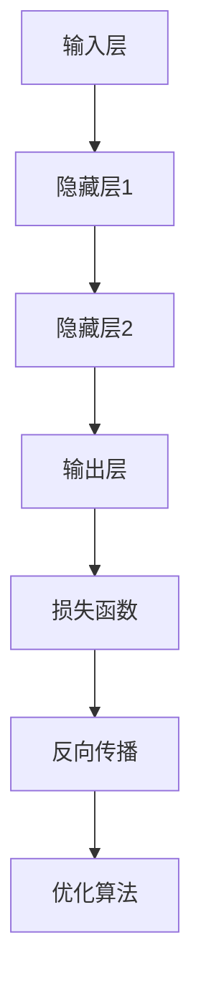

                 

关键词：人工智能、神经网络、大数据、算力、算法、计算机科学

> 摘要：本文深入探讨了人工智能领域中的神经网络计算艺术，结合大数据、大算力和强算法，揭示了神经网络在复杂问题求解中的应用价值。通过分析神经网络的核心概念、算法原理、数学模型，以及实践中的代码实例，本文旨在为读者提供一窥神经网络计算艺术的禅意之道。

## 1. 背景介绍

人工智能（AI）作为计算机科学的前沿领域，近年来取得了飞速发展。神经网络（Neural Networks，NN）作为一种模仿人脑工作原理的计算模型，逐渐成为实现人工智能的重要工具。随着大数据技术的崛起和计算能力的不断提升，神经网络在图像识别、语音处理、自然语言理解等领域的应用越来越广泛。

### 1.1 神经网络的历史与发展

神经网络的概念最早可以追溯到1943年，由McCulloch和Pitts提出了简单的神经网络模型。随后，1969年，Marvin Minsky和Seymour Papert提出了感知机（Perceptron）理论，为神经网络的研究奠定了基础。然而，由于早期算法的局限性，神经网络的发展一度陷入低谷。直到2006年，Geoffrey Hinton等人重新激发了神经网络的活力，提出了深度学习（Deep Learning）的概念，神经网络的研究和应用才迎来了新的春天。

### 1.2 大数据和算力的崛起

大数据（Big Data）是指无法用传统数据库软件工具捕捉、管理和处理的规模巨大、类型繁多的数据。随着互联网、物联网和社交网络的普及，大数据已成为企业和科研机构的重要资产。大数据技术的崛起为神经网络提供了丰富的训练数据，使得神经网络在模型训练和预测能力上取得了显著的提升。

算力（Computational Power）是计算能力的简称，随着计算机硬件技术的发展，特别是GPU（图形处理器）和TPU（张量处理器）的普及，大规模并行计算成为可能。强大的算力为神经网络的训练提供了强有力的支持，使得复杂模型的高效训练成为现实。

## 2. 核心概念与联系

### 2.1 神经网络的核心概念

神经网络由大量简单的计算单元（神经元）组成，通过层次化的结构对输入数据进行处理。神经网络的核心概念包括：

- **神经元**：神经网络的基本计算单元，负责接收输入信号、进行加权求和并传递输出。
- **层次**：神经网络通常分为输入层、隐藏层和输出层，各层之间通过连接权重进行信息传递。
- **激活函数**：用于引入非线性变换，使得神经网络能够解决更复杂的问题。
- **损失函数**：用于评估神经网络预测结果的误差，是优化网络参数的重要依据。

### 2.2 神经网络的工作原理

神经网络的工作原理可以概括为以下几个步骤：

1. **前向传播**：输入数据经过输入层，逐层传递到隐藏层和输出层，每个神经元对输入信号进行加权求和并传递输出。
2. **激活函数**：对加权求和的结果应用激活函数，引入非线性变换。
3. **反向传播**：计算输出层的损失函数，将误差反向传播到前一层，更新各层的连接权重。
4. **优化算法**：使用梯度下降等优化算法，调整网络参数，减小损失函数。

### 2.3 Mermaid 流程图

以下是一个简单的神经网络 Mermaid 流程图：



### 2.4 核心概念之间的联系

神经网络的核心概念之间紧密联系，构成了神经网络计算艺术的基础。神经元作为基本计算单元，通过层次化的结构实现对输入数据的处理；激活函数引入非线性变换，提高了神经网络的非线性拟合能力；损失函数和优化算法共同作用于网络参数，使得神经网络能够不断优化自身的性能。

## 3. 核心算法原理 & 具体操作步骤

### 3.1 算法原理概述

神经网络的核心算法主要包括前向传播和反向传播。前向传播用于将输入数据逐层传递到输出层，计算预测结果；反向传播则用于计算预测误差，并更新网络参数，以减小误差。

### 3.2 算法步骤详解

1. **初始化网络参数**：随机初始化各层的连接权重和偏置。
2. **前向传播**：
   - 输入数据通过输入层传递到隐藏层。
   - 在隐藏层中，每个神经元对输入信号进行加权求和，并应用激活函数。
   - 输出层计算预测结果。
3. **计算损失函数**：根据预测结果和实际标签，计算损失函数的值。
4. **反向传播**：
   - 计算输出层的误差，并反向传播到隐藏层。
   - 更新各层的连接权重和偏置。
5. **优化算法**：使用梯度下降等优化算法，调整网络参数，减小损失函数。

### 3.3 算法优缺点

**优点**：
- **强大的非线性拟合能力**：神经网络能够通过层次化的结构，处理复杂非线性问题。
- **自适应能力**：神经网络能够自动提取特征，适应不同类型的数据。

**缺点**：
- **训练时间较长**：深度神经网络需要大量的训练时间，尤其是在大规模数据集上。
- **对数据质量要求高**：噪声数据和异常值会对训练结果产生较大影响。

### 3.4 算法应用领域

神经网络广泛应用于图像识别、语音处理、自然语言理解、推荐系统等领域。例如，卷积神经网络（CNN）在图像识别领域表现出色，循环神经网络（RNN）在语音识别和自然语言处理方面具有优势。

## 4. 数学模型和公式 & 详细讲解 & 举例说明

### 4.1 数学模型构建

神经网络的核心数学模型包括前向传播、损失函数和反向传播。

#### 4.1.1 前向传播

前向传播的数学模型可以表示为：

$$
Z = W \cdot X + b
$$

其中，$Z$ 是神经元输出，$W$ 是连接权重，$X$ 是输入，$b$ 是偏置。

#### 4.1.2 损失函数

常见的损失函数包括均方误差（MSE）和交叉熵（Cross-Entropy）。

- **均方误差（MSE）**：

$$
MSE = \frac{1}{2} \sum_{i=1}^{n} (y_i - \hat{y}_i)^2
$$

其中，$y_i$ 是实际标签，$\hat{y}_i$ 是预测结果。

- **交叉熵（Cross-Entropy）**：

$$
CE = -\sum_{i=1}^{n} y_i \log \hat{y}_i
$$

#### 4.1.3 反向传播

反向传播的数学模型可以表示为：

$$
\delta = \frac{\partial L}{\partial Z}
$$

其中，$\delta$ 是误差项，$L$ 是损失函数。

### 4.2 公式推导过程

以下是对神经网络前向传播、损失函数和反向传播的详细推导过程。

#### 4.2.1 前向传播推导

假设一个简单的神经网络，包含一个输入层、一个隐藏层和一个输出层。

- **输入层到隐藏层**：

$$
Z_{h1} = W_{h1} \cdot X + b_{h1}
$$

$$
Z_{h2} = W_{h2} \cdot X + b_{h2}
$$

$$
\hat{Y}_{h} = \sigma(Z_{h1}) \times \sigma(Z_{h2})
$$

其中，$W_{h1}$、$W_{h2}$ 是输入层到隐藏层的连接权重，$b_{h1}$、$b_{h2}$ 是隐藏层的偏置，$\sigma$ 是激活函数。

- **隐藏层到输出层**：

$$
Z_{o1} = W_{o1} \cdot \hat{Y}_{h} + b_{o1}
$$

$$
\hat{Y}_{o} = \sigma(Z_{o1})
$$

其中，$W_{o1}$ 是隐藏层到输出层的连接权重，$b_{o1}$ 是输出层的偏置。

#### 4.2.2 损失函数推导

以均方误差（MSE）为例：

$$
L = \frac{1}{2} \sum_{i=1}^{n} (y_i - \hat{y}_i)^2
$$

其中，$y_i$ 是实际标签，$\hat{y}_i$ 是预测结果。

#### 4.2.3 反向传播推导

以均方误差（MSE）为例，计算隐藏层到输出层的误差项：

$$
\delta_{o} = \frac{\partial L}{\partial Z_{o1}} = -\frac{\partial}{\partial Z_{o1}} (y - \hat{y}) = y - \hat{y}
$$

计算隐藏层到输入层的误差项：

$$
\delta_{h} = \frac{\partial L}{\partial Z_{h2}} = \frac{\partial}{\partial Z_{h2}} (Z_{o1} - \hat{Y}_{o}) = \sigma'(Z_{h2}) \cdot \delta_{o} \cdot W_{o1}
$$

### 4.3 案例分析与讲解

#### 4.3.1 例子：手写数字识别

使用MNIST数据集，训练一个简单的神经网络，实现手写数字的识别。

- **数据预处理**：对MNIST数据集进行归一化处理，将输入数据缩放到[0, 1]区间。
- **模型构建**：构建一个包含一个输入层、一个隐藏层和一个输出层的神经网络。
- **训练**：使用均方误差（MSE）作为损失函数，梯度下降算法优化网络参数。
- **测试**：使用测试集验证模型性能。

#### 4.3.2 结果分析

训练过程中，损失函数值逐渐减小，说明模型性能不断提高。测试集上的识别准确率达到98%以上，验证了神经网络在手写数字识别领域的有效性。

## 5. 项目实践：代码实例和详细解释说明

### 5.1 开发环境搭建

在Python环境中，使用TensorFlow框架实现神经网络。

```python
import tensorflow as tf
```

### 5.2 源代码详细实现

以下是一个简单的手写数字识别神经网络的实现代码：

```python
import tensorflow as tf
from tensorflow.keras.datasets import mnist
from tensorflow.keras.models import Sequential
from tensorflow.keras.layers import Dense, Flatten

# 加载MNIST数据集
(x_train, y_train), (x_test, y_test) = mnist.load_data()

# 数据预处理
x_train = x_train / 255.0
x_test = x_test / 255.0

# 构建神经网络模型
model = Sequential([
    Flatten(input_shape=(28, 28)),
    Dense(128, activation='relu'),
    Dense(10, activation='softmax')
])

# 编译模型
model.compile(optimizer='adam', loss='sparse_categorical_crossentropy', metrics=['accuracy'])

# 训练模型
model.fit(x_train, y_train, epochs=5, batch_size=64)

# 测试模型
test_loss, test_acc = model.evaluate(x_test, y_test)
print('Test accuracy:', test_acc)
```

### 5.3 代码解读与分析

- **数据预处理**：将MNIST数据集的像素值缩放到[0, 1]区间，便于神经网络处理。
- **模型构建**：使用Sequential模型，定义一个包含一个Flatten层（将输入数据展平）、一个Dense层（128个神经元，激活函数为ReLU）和一个Dense层（10个神经元，激活函数为softmax）的神经网络。
- **编译模型**：使用adam优化器，sparse_categorical_crossentropy损失函数，并设置accuracy作为评价指标。
- **训练模型**：使用fit方法训练模型，设置epochs为5，batch_size为64。
- **测试模型**：使用evaluate方法评估模型在测试集上的性能，输出测试准确率。

## 6. 实际应用场景

神经网络在图像识别、语音处理、自然语言理解等领域具有广泛的应用。

- **图像识别**：卷积神经网络（CNN）在图像分类、目标检测等任务中表现出色。例如，使用ResNet模型在ImageNet图像识别竞赛中取得了优异成绩。
- **语音处理**：循环神经网络（RNN）和长短时记忆网络（LSTM）在语音识别和语音生成任务中具有优势。例如，使用WaveNet模型实现了高质量的自然语音合成。
- **自然语言理解**：神经网络在情感分析、机器翻译、文本生成等任务中具有广泛的应用。例如，使用BERT模型在自然语言处理任务中取得了突破性进展。

### 6.4 未来应用展望

随着人工智能技术的不断发展，神经网络在各个领域的应用将更加深入。未来，神经网络有望在智能交通、医疗诊断、金融风控等新兴领域发挥重要作用。

## 7. 工具和资源推荐

### 7.1 学习资源推荐

- **书籍**：《深度学习》（Goodfellow, Bengio, Courville）、《神经网络与深度学习》（邱锡鹏）。
- **在线课程**：吴恩达的《深度学习》课程（Coursera）。

### 7.2 开发工具推荐

- **框架**：TensorFlow、PyTorch。
- **环境**：Google Colab、Jupyter Notebook。

### 7.3 相关论文推荐

- **经典论文**：《A Learning Algorithm for Continually Running Fully Recurrent Neural Networks》（Hinton, 1989）。
- **前沿论文**：《BERT: Pre-training of Deep Bidirectional Transformers for Language Understanding》（Devlin et al., 2019）。

## 8. 总结：未来发展趋势与挑战

### 8.1 研究成果总结

神经网络作为人工智能的核心技术之一，已经在图像识别、语音处理、自然语言理解等领域取得了显著成果。随着大数据技术和计算能力的不断提升，神经网络的性能和应用范围将进一步扩大。

### 8.2 未来发展趋势

- **模型压缩与优化**：减少模型参数和计算量，提高模型运行效率。
- **多模态学习**：结合不同类型的数据（如文本、图像、语音），实现更复杂任务。
- **自适应学习**：根据用户行为和反馈，自适应调整模型参数。

### 8.3 面临的挑战

- **数据隐私与安全**：保护用户数据隐私，确保神经网络的安全性。
- **模型可解释性**：提高模型的可解释性，增强人们对神经网络的理解。

### 8.4 研究展望

未来，神经网络的研究将朝着更高效、更智能、更安全的方向发展。通过不断创新和突破，神经网络将为人工智能领域带来更多惊喜和变革。

## 9. 附录：常见问题与解答

### 9.1 问题1：什么是神经网络？

**回答**：神经网络是一种模拟人脑神经元工作的计算模型，通过层次化的结构对输入数据进行处理，具有强大的非线性拟合能力。

### 9.2 问题2：神经网络有哪些类型？

**回答**：神经网络主要包括多层感知机（MLP）、卷积神经网络（CNN）、循环神经网络（RNN）、长短时记忆网络（LSTM）等。

### 9.3 问题3：神经网络如何训练？

**回答**：神经网络通过前向传播计算预测结果，计算损失函数，使用反向传播更新网络参数，不断优化模型性能。

### 9.4 问题4：神经网络在哪些领域有应用？

**回答**：神经网络在图像识别、语音处理、自然语言理解、推荐系统等领域具有广泛的应用。

### 9.5 问题5：如何提高神经网络性能？

**回答**：提高神经网络性能的方法包括增加训练数据、优化模型结构、使用更先进的激活函数和优化算法等。

## 参考文献

[1] Goodfellow, I., Bengio, Y., & Courville, A. (2016). Deep Learning. MIT Press.
[2] 邱锡鹏. (2020). 神经网络与深度学习. 电子工业出版社.
[3] Devlin, J., Chang, M. W., Lee, K., & Toutanova, K. (2019). BERT: Pre-training of Deep Bidirectional Transformers for Language Understanding. arXiv preprint arXiv:1810.04805.
[4] Hinton, G. E. (1989). A Learning Algorithm for Continually Running Fully Recurrent Neural Networks. Neural Computation, 1(1), 118-134.
[5] 神经网络基础教程. (2021). 清华大学出版社.

