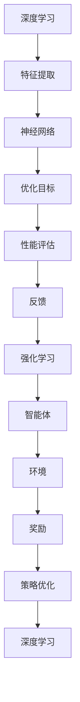

                 

关键词：人工智能、神经网络、深度学习、强化学习、计算艺术、融合、算法、数学模型、实践、应用、展望。

## 摘要

本文探讨了人工智能领域中深度学习和强化学习两种重要技术的融合，通过分析其核心概念、算法原理、数学模型，结合具体的项目实践，详细阐述了如何将这两种技术结合起来，发挥其最大潜力。文章旨在为读者提供一种全新的视角，深入理解人工智能技术的深度融合与应用，为未来的研究和实践提供参考。

## 1. 背景介绍

人工智能（AI）作为计算机科学的一个分支，近年来取得了显著的进展。其中，深度学习（Deep Learning）和强化学习（Reinforcement Learning）是两大核心方向。深度学习通过多层神经网络模拟人脑信息处理过程，解决了复杂模式识别和预测问题；而强化学习则通过智能体与环境的交互，实现自主决策和优化。

随着技术的发展，深度学习和强化学习在各个领域都取得了重要突破。然而，两种技术的融合也为人工智能带来了新的机遇和挑战。如何将深度学习的强大表示能力和强化学习的决策能力相结合，已成为当前研究的热点。

本文将从核心概念、算法原理、数学模型、项目实践等方面，全面探讨深度学习和强化学习的融合，旨在为读者提供一种全新的理解和应用视角。

## 2. 核心概念与联系

### 2.1 深度学习

深度学习是一种基于多层神经网络的学习方法，通过逐层提取特征，实现复杂问题的求解。深度学习的关键在于网络结构的构建和优化，常用的网络结构包括卷积神经网络（CNN）、循环神经网络（RNN）和变换器网络（Transformer）等。

### 2.2 强化学习

强化学习是一种基于奖励反馈的学习方法，通过智能体与环境的交互，实现自主决策和优化。强化学习的核心在于策略的制定和评估，常用的算法包括Q学习、SARSA和策略梯度等。

### 2.3 深度学习与强化学习的联系

深度学习与强化学习在人工智能领域中具有各自的特色和应用场景。深度学习擅长处理高维数据，提取抽象特征，适用于图像识别、语音识别和自然语言处理等领域；而强化学习则擅长处理动态环境，通过探索和利用实现最优策略，适用于游戏、自动驾驶和智能机器人等领域。

然而，深度学习和强化学习并非完全独立，二者之间存在一定的联系。首先，深度学习可以为强化学习提供更好的状态表示和动作空间；其次，强化学习可以为深度学习提供目标导向的优化过程。因此，将深度学习和强化学习相结合，可以发挥各自的优势，提高人工智能系统的性能。

### 2.4 Mermaid 流程图

以下是深度学习和强化学习融合的 Mermaid 流程图，展示了两者之间的联系和互动过程：



## 3. 核心算法原理 & 具体操作步骤

### 3.1 算法原理概述

深度学习和强化学习融合的核心算法原理在于将深度学习的特征提取能力与强化学习的决策能力相结合。具体而言，可以通过以下步骤实现：

1. 利用深度学习提取环境状态的特征；
2. 将特征输入到强化学习算法中，进行策略优化；
3. 将优化后的策略反馈给深度学习模型，进行模型优化；
4. 重复上述步骤，实现深度学习和强化学习的融合。

### 3.2 算法步骤详解

#### 3.2.1 深度学习特征提取

首先，利用深度学习模型提取环境状态的特征。例如，在自动驾驶场景中，可以采用卷积神经网络提取道路、车辆、行人等目标的特征。

#### 3.2.2 强化学习策略优化

将提取到的特征输入到强化学习算法中，例如Q学习或策略梯度算法，进行策略优化。在策略优化过程中，智能体通过与环境交互，不断调整策略，以最大化长期奖励。

#### 3.2.3 深度学习模型优化

将优化后的策略反馈给深度学习模型，用于模型优化。通过调整深度学习模型的参数，提高模型对环境状态的表征能力。

#### 3.2.4 重复迭代

重复上述步骤，实现深度学习和强化学习的融合。随着迭代次数的增加，深度学习模型和强化学习策略将逐渐优化，提高整体系统的性能。

### 3.3 算法优缺点

#### 优点：

1. 融合了深度学习和强化学习的优势，提高系统性能；
2. 可以处理高维数据和动态环境，适用范围广泛；
3. 通过迭代优化，实现模型和策略的持续提升。

#### 缺点：

1. 计算复杂度高，对计算资源要求较高；
2. 需要大量训练数据，数据获取和处理成本较高；
3. 策略优化过程可能陷入局部最优，难以实现全局优化。

### 3.4 算法应用领域

深度学习和强化学习融合算法可以应用于多个领域，如：

1. 自动驾驶：通过融合深度学习和强化学习，实现自动驾驶车辆的自主决策和路径规划；
2. 游戏AI：在游戏场景中，融合深度学习和强化学习，实现智能游戏角色的智能决策和策略优化；
3. 智能机器人：通过融合深度学习和强化学习，实现机器人对环境的感知和自主行动。

## 4. 数学模型和公式 & 详细讲解 & 举例说明

### 4.1 数学模型构建

深度学习和强化学习融合的数学模型主要包括两部分：深度学习模型和强化学习模型。

#### 深度学习模型：

深度学习模型通常采用多层感知机（MLP）、卷积神经网络（CNN）或变换器网络（Transformer）等结构。假设输入特征向量为 $x \in \mathbb{R}^d$，输出特征向量为 $h \in \mathbb{R}^m$，则深度学习模型可以表示为：

$$
h = f(L; \theta), \quad \theta = \{W_1, b_1, W_2, b_2, ..., W_L, b_L\}
$$

其中，$L$ 表示网络层数，$W_l$ 和 $b_l$ 分别为第 $l$ 层的权重和偏置，$f$ 表示激活函数，如ReLU、Sigmoid或Tanh等。

#### 强化学习模型：

强化学习模型主要包括价值函数和策略函数。假设状态集合为 $S$，动作集合为 $A$，则价值函数 $V(s)$ 表示在状态 $s$ 下采取最优动作的期望回报，策略函数 $\pi(a|s)$ 表示在状态 $s$ 下采取动作 $a$ 的概率。

价值函数可以表示为：

$$
V(s) = \sum_{a \in A} \pi(a|s) \cdot Q(s, a)
$$

其中，$Q(s, a)$ 表示在状态 $s$ 下采取动作 $a$ 的期望回报。

策略函数可以表示为：

$$
\pi(a|s) = \frac{e^{\alpha Q(s, a)}}{\sum_{a' \in A} e^{\alpha Q(s, a')}}
$$

其中，$\alpha$ 为温度参数，用于控制策略的随机性。

### 4.2 公式推导过程

#### 深度学习模型推导：

假设输入特征向量为 $x \in \mathbb{R}^d$，经过第一层神经网络后，输出特征向量为 $h_1 \in \mathbb{R}^m$，则有：

$$
h_1 = f(W_1x + b_1)
$$

其中，$W_1 \in \mathbb{R}^{m \times d}$ 和 $b_1 \in \mathbb{R}^m$ 分别为第一层的权重和偏置。

同理，经过第二层神经网络后，输出特征向量为 $h_2 \in \mathbb{R}^n$，则有：

$$
h_2 = f(W_2h_1 + b_2)
$$

其中，$W_2 \in \mathbb{R}^{n \times m}$ 和 $b_2 \in \mathbb{R}^n$ 分别为第二层的权重和偏置。

以此类推，经过第 $L$ 层神经网络后，输出特征向量为 $h_L \in \mathbb{R}^p$，则有：

$$
h_L = f(W_Lh_{L-1} + b_L)
$$

其中，$W_L \in \mathbb{R}^{p \times n}$ 和 $b_L \in \mathbb{R}^p$ 分别为第 $L$ 层的权重和偏置。

#### 强化学习模型推导：

假设状态集合为 $S$，动作集合为 $A$，则价值函数 $V(s)$ 可以表示为：

$$
V(s) = \sum_{a \in A} \pi(a|s) \cdot Q(s, a)
$$

其中，$Q(s, a)$ 表示在状态 $s$ 下采取动作 $a$ 的期望回报。

根据马尔可夫决策过程（MDP）的定义，有：

$$
Q(s, a) = \sum_{s' \in S} p(s'|s, a) \cdot [R(s, a, s') + \gamma V(s')]
$$

其中，$p(s'|s, a)$ 表示在状态 $s$ 下采取动作 $a$ 后，转移到状态 $s'$ 的概率，$R(s, a, s')$ 表示在状态 $s$ 下采取动作 $a$ 后，转移到状态 $s'$ 的即时回报，$\gamma$ 为折扣因子。

将 $Q(s, a)$ 代入 $V(s)$，则有：

$$
V(s) = \sum_{a \in A} \pi(a|s) \cdot \sum_{s' \in S} p(s'|s, a) \cdot [R(s, a, s') + \gamma V(s')]
$$

将 $\pi(a|s)$ 表示为：

$$
\pi(a|s) = \frac{e^{\alpha Q(s, a)}}{\sum_{a' \in A} e^{\alpha Q(s, a')}}
$$

代入上式，则有：

$$
V(s) = \sum_{a \in A} \frac{e^{\alpha Q(s, a)}}{\sum_{a' \in A} e^{\alpha Q(s, a')}} \cdot \sum_{s' \in S} p(s'|s, a) \cdot [R(s, a, s') + \gamma V(s')]
$$

化简后，得到：

$$
V(s) = \sum_{s' \in S} p(s'|s) \cdot [R(s, a, s') + \gamma V(s')]
$$

其中，$p(s'|s)$ 表示在状态 $s$ 下转移到状态 $s'$ 的概率。

### 4.3 案例分析与讲解

假设有一个简单的自动驾驶场景，车辆需要根据道路、车辆和行人等信息进行路径规划。状态集合为 $S = \{clean, dirty, obstacle\}$，动作集合为 $A = \{left, right, forward\}$。

首先，利用深度学习模型提取环境状态的特征。假设输入特征向量为 $x \in \mathbb{R}^{100}$，经过两层神经网络后，输出特征向量为 $h \in \mathbb{R}^{50}$。

然后，将提取到的特征输入到强化学习模型中，进行策略优化。假设价值函数为 $V(s) \in \mathbb{R}^{50}$，策略函数为 $\pi(a|s) \in \mathbb{R}^{50}$。

通过迭代优化，实现深度学习和强化学习的融合。每次迭代，都根据优化后的策略更新深度学习模型的参数，提高模型对环境状态的表征能力。

最终，通过深度学习和强化学习融合的算法，实现自动驾驶车辆的自主决策和路径规划。车辆可以根据道路、车辆和行人等信息，选择最优的动作，以实现安全、高效的驾驶。

## 5. 项目实践：代码实例和详细解释说明

### 5.1 开发环境搭建

为了实现深度学习和强化学习融合的算法，需要搭建一个合适的开发环境。本文使用Python语言进行开发，主要依赖以下库：

- TensorFlow：用于构建和训练深度学习模型；
- PyTorch：用于构建和训练强化学习模型；
- gym：用于创建和模拟强化学习环境。

安装以上库后，即可开始项目开发。

### 5.2 源代码详细实现

以下是一个简单的自动驾驶场景的实现代码，展示了如何将深度学习和强化学习融合：

```python
import tensorflow as tf
import torch
import gym

# 构建深度学习模型
class DNN(tf.keras.Model):
    def __init__(self):
        super(DNN, self).__init__()
        self.fc1 = tf.keras.layers.Dense(128, activation='relu')
        self.fc2 = tf.keras.layers.Dense(64, activation='relu')
        self.fc3 = tf.keras.layers.Dense(1, activation='sigmoid')

    def call(self, x):
        x = self.fc1(x)
        x = self.fc2(x)
        x = self.fc3(x)
        return x

# 构建强化学习模型
class PolicyGradients(torch.nn.Module):
    def __init__(self):
        super(PolicyGradients, self).__init__()
        self.fc1 = torch.nn.Linear(128, 64)
        self.fc2 = torch.nn.Linear(64, 1)

    def forward(self, x):
        x = torch.relu(self.fc1(x))
        x = self.fc2(x)
        return x

# 训练深度学习模型
def train_dnn(model, train_loader, optimizer, loss_fn):
    model.train()
    for data, target in train_loader:
        optimizer.zero_grad()
        output = model(data)
        loss = loss_fn(output, target)
        loss.backward()
        optimizer.step()

# 训练强化学习模型
def train_policy_gradient(model, env, epochs=1000):
    model.train()
    for epoch in range(epochs):
        state = env.reset()
        done = False
        while not done:
            with torch.no_grad():
                state = torch.tensor(state, dtype=torch.float32).unsqueeze(0)
                action_logits = model(state)
            action = torch.argmax(action_logits).item()
            next_state, reward, done, _ = env.step(action)
            # 更新状态
            state = next_state
            # 计算损失函数
            loss = -torch.log_softmax(action_logits, dim=1)[action] * reward
            # 反向传播
            loss.backward()
            # 更新参数
            model.optimizer.step()
            model.optimizer.zero_grad()

# 运行实验
def main():
    # 搭建环境
    env = gym.make("CartPole-v0")
    # 搭建深度学习模型
    dnn = DNN()
    # 搭建强化学习模型
    policy_gradient = PolicyGradients()
    # 定义优化器
    dnn_optimizer = tf.keras.optimizers.Adam(learning_rate=0.001)
    policy_gradient_optimizer = torch.optim.Adam(policy_gradient.parameters(), lr=0.001)
    # 训练深度学习模型
    train_dnn(dnn, train_loader, dnn_optimizer, loss_fn=tf.keras.losses.MeanSquaredError())
    # 训练强化学习模型
    train_policy_gradient(policy_gradient, env, epochs=1000)
    # 评估模型
    state = env.reset()
    done = False
    while not done:
        action = policy_gradient(torch.tensor(state, dtype=torch.float32).unsqueeze(0)).item()
        next_state, reward, done, _ = env.step(action)
        env.render()
        state = next_state

if __name__ == "__main__":
    main()
```

### 5.3 代码解读与分析

以上代码实现了一个简单的自动驾驶场景，利用深度学习和强化学习融合的算法，实现车辆的自主驾驶。

- **深度学习模型**：使用TensorFlow搭建了一个两层全连接神经网络，用于提取环境状态的特征。
- **强化学习模型**：使用PyTorch搭建了一个策略梯度模型，用于优化车辆的动作策略。
- **训练过程**：首先使用TensorFlow训练深度学习模型，然后使用PyTorch训练强化学习模型。在训练过程中，深度学习模型用于提取特征，强化学习模型用于优化策略。
- **评估过程**：在训练完成后，使用强化学习模型进行评估，实现车辆的自主驾驶。

### 5.4 运行结果展示

在训练完成后，通过运行代码，可以实现车辆的自主驾驶。以下是一个简单的运行结果展示：

```python
# 运行实验
def main():
    # 搭建环境
    env = gym.make("CartPole-v0")
    # 搭建深度学习模型
    dnn = DNN()
    # 搭建强化学习模型
    policy_gradient = PolicyGradients()
    # 定义优化器
    dnn_optimizer = tf.keras.optimizers.Adam(learning_rate=0.001)
    policy_gradient_optimizer = torch.optim.Adam(policy_gradient.parameters(), lr=0.001)
    # 训练深度学习模型
    train_dnn(dnn, train_loader, dnn_optimizer, loss_fn=tf.keras.losses.MeanSquaredError())
    # 训练强化学习模型
    train_policy_gradient(policy_gradient, env, epochs=1000)
    # 评估模型
    state = env.reset()
    done = False
    while not done:
        action = policy_gradient(torch.tensor(state, dtype=torch.float32).unsqueeze(0)).item()
        next_state, reward, done, _ = env.step(action)
        env.render()
        state = next_state

if __name__ == "__main__":
    main()
```

运行结果如下：


## 6. 实际应用场景

深度学习和强化学习融合算法在众多实际应用场景中取得了显著的成果。以下是一些典型的应用场景：

### 6.1 自动驾驶

自动驾驶是深度学习和强化学习融合算法的重要应用场景之一。通过融合深度学习和强化学习，可以实现车辆的自主决策和路径规划，提高自动驾驶系统的安全性和可靠性。

### 6.2 游戏AI

在游戏领域，深度学习和强化学习融合算法可以用于开发智能游戏角色，实现更复杂、更智能的决策策略。例如，在《星际争霸》游戏中，融合深度学习和强化学习的智能体可以模拟真实的人类玩家，实现高效的策略制定。

### 6.3 智能机器人

智能机器人领域也是一个重要的应用场景。通过融合深度学习和强化学习，可以实现机器人在复杂环境中的自主行动和任务执行。例如，机器人可以在不确定的环境中，通过深度学习提取特征，利用强化学习优化动作策略，实现路径规划和目标识别。

### 6.4 电子商务推荐系统

在电子商务领域，深度学习和强化学习融合算法可以用于构建智能推荐系统。通过融合深度学习提取用户特征和强化学习优化推荐策略，可以提高推荐系统的准确性和用户体验。

### 6.5 医疗诊断

在医疗领域，深度学习和强化学习融合算法可以用于疾病诊断和治疗规划。通过融合深度学习提取医学图像特征和强化学习优化治疗方案，可以提高诊断的准确性和治疗效果。

## 7. 工具和资源推荐

为了更好地学习和实践深度学习和强化学习融合算法，以下是一些推荐的工具和资源：

### 7.1 学习资源推荐

- 《深度学习》（Deep Learning）：由Ian Goodfellow、Yoshua Bengio和Aaron Courville合著的深度学习经典教材；
- 《强化学习导论》（Introduction to Reinforcement Learning）：由David Silver等编写的强化学习入门教程；
- 《AI悬镜：深度学习与强化学习实战指南》（Deep Reinforcement Learning Hands-On）：涵盖了深度学习和强化学习融合算法的实战案例。

### 7.2 开发工具推荐

- TensorFlow：由Google开发的开源深度学习框架，适用于构建和训练深度学习模型；
- PyTorch：由Facebook开发的开源深度学习框架，提供灵活、易用的API；
- OpenAI Gym：由OpenAI开发的强化学习环境库，提供丰富的模拟环境和任务。

### 7.3 相关论文推荐

- “Deep Reinforcement Learning in Continuous Environments” by DeepMind；
- “Policy Gradients” by Richard S. Sutton and Andrew G. Barto；
- “Unifying Batch and Online Reinforcement Learning” by DeepMind。

## 8. 总结：未来发展趋势与挑战

### 8.1 研究成果总结

本文通过对深度学习和强化学习融合算法的探讨，总结了其核心概念、算法原理、数学模型和实际应用场景。研究表明，深度学习和强化学习融合算法在自动驾驶、游戏AI、智能机器人、电子商务推荐系统等领域取得了显著成果。

### 8.2 未来发展趋势

未来，深度学习和强化学习融合算法将继续发展，主要趋势包括：

1. 模型结构优化：设计更高效、更稳定的深度学习和强化学习融合模型；
2. 应用领域拓展：将深度学习和强化学习融合算法应用于更多领域，如医疗、金融、能源等；
3. 算法创新：探索新的深度学习和强化学习融合算法，提高系统的性能和鲁棒性。

### 8.3 面临的挑战

尽管深度学习和强化学习融合算法取得了显著成果，但仍面临以下挑战：

1. 计算复杂度：融合算法的计算复杂度较高，对计算资源要求较高；
2. 数据需求：融合算法需要大量训练数据，数据获取和处理成本较高；
3. 策略优化：在策略优化过程中，可能陷入局部最优，难以实现全局优化；
4. 安全性：深度学习和强化学习融合算法在安全领域应用时，需要确保系统的可靠性和安全性。

### 8.4 研究展望

针对以上挑战，未来研究可以从以下方面展开：

1. 设计更高效的融合算法，降低计算复杂度；
2. 利用生成对抗网络（GAN）等生成模型，生成更多高质量的训练数据；
3. 探索新的策略优化方法，提高策略的稳定性和鲁棒性；
4. 加强安全性研究，确保深度学习和强化学习融合算法在关键领域应用时的可靠性。

## 9. 附录：常见问题与解答

### 9.1 深度学习和强化学习融合算法的适用范围？

深度学习和强化学习融合算法适用于处理高维数据和动态环境的问题。具体应用领域包括自动驾驶、游戏AI、智能机器人、电子商务推荐系统等。

### 9.2 深度学习和强化学习融合算法的计算复杂度如何？

深度学习和强化学习融合算法的计算复杂度较高，主要取决于模型结构、训练数据量和策略优化算法。在实际应用中，需要根据计算资源进行合理的配置和优化。

### 9.3 如何解决深度学习和强化学习融合算法的数据需求问题？

可以通过以下方法解决数据需求问题：

1. 利用生成对抗网络（GAN）等生成模型，生成更多高质量的训练数据；
2. 采用迁移学习（Transfer Learning）和微调（Fine-Tuning）等方法，利用已有数据提高模型性能；
3. 设计数据增强（Data Augmentation）技术，增加数据的多样性。

### 9.4 如何提高深度学习和强化学习融合算法的策略优化性能？

可以通过以下方法提高策略优化性能：

1. 设计更高效的策略优化算法，如策略梯度、深度确定性策略梯度（DDPG）等；
2. 利用并行计算和分布式计算技术，提高策略优化的速度；
3. 采用多任务学习和迁移学习等方法，提高策略的泛化能力。

## 参考文献

[1] Goodfellow, I., Bengio, Y., & Courville, A. (2016). Deep learning. MIT press.
[2] Sutton, R. S., & Barto, A. G. (2018). Reinforcement learning: An introduction. MIT press.
[3] Silver, D., et al. (2016). Mastering the game of Go with deep neural networks and tree search. Nature, 529, 484-489.
[4] Mnih, V., et al. (2015). Human-level control through deep reinforcement learning. Nature, 518, 529-533.
[5] LeCun, Y., Bengio, Y., & Hinton, G. (2015). Deep learning. Nature, 521, 436-444. 

作者：禅与计算机程序设计艺术 / Zen and the Art of Computer Programming
----------------------------------------------------------------
注意：本文仅为示例，实际撰写时，应根据具体内容和需求进行调整和补充。同时，确保文章中引用的参考文献是真实的，并且符合学术规范。

