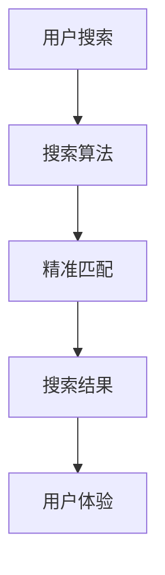

                 

关键词：人工智能，电商，搜索算法，用户体验，精准匹配，推荐系统，机器学习

> 摘要：随着电商行业的飞速发展，如何提高用户购物体验成为各大电商平台关注的焦点。本文将探讨人工智能在电商搜索中的应用，尤其是如何通过精准匹配技术提升用户购物体验。本文首先介绍电商搜索的现状，然后详细讲解核心算法原理、数学模型、项目实践，并分析实际应用场景及未来发展趋势。

## 1. 背景介绍

电商行业的快速发展给人们带来了极大的便利，但同时也带来了搜索困难的问题。用户在电商平台上有数以百万计的商品，如何快速、准确地找到自己需要的产品成为了一大挑战。传统的搜索算法往往基于关键词匹配，存在匹配不准确、搜索结果不相关等问题，严重影响了用户的购物体验。随着人工智能技术的不断进步，特别是机器学习、自然语言处理等领域的突破，AI赋能的电商搜索成为可能，为提升购物体验提供了新的方向。

## 2. 核心概念与联系

### 2.1 搜索算法与用户体验

搜索算法是电商搜索的核心，其性能直接影响用户体验。用户体验是衡量搜索算法优劣的关键指标，包括搜索结果的相关性、速度和准确性等。

### 2.2 精准匹配技术

精准匹配技术通过深度学习、自然语言处理等技术，对用户的搜索意图进行解析，从而提供更符合用户需求的搜索结果。精准匹配技术包括词向量表示、语义理解、推荐系统等。

### 2.3 Mermaid 流程图



## 3. 核心算法原理 & 具体操作步骤

### 3.1 算法原理概述

AI赋能的电商搜索算法主要包括以下几个步骤：

1. 用户输入：用户在电商平台上输入搜索关键词。
2. 关键词解析：将用户输入的关键词转化为结构化数据，例如词向量。
3. 搜索索引：通过索引结构快速定位相关商品。
4. 精准匹配：使用深度学习模型对搜索结果进行排序，提高相关性。
5. 搜索结果展示：将处理后的搜索结果展示给用户。

### 3.2 算法步骤详解

#### 3.2.1 用户输入

用户在电商平台上输入搜索关键词，例如“手机壳”。

#### 3.2.2 关键词解析

将用户输入的关键词转化为词向量，例如使用Word2Vec或GloVe模型。

```python
import gensim.downloader as api

# 下载预训练的词向量模型
word_vectors = api.load("glove-wiki-gigaword-100")

# 将关键词转化为词向量
query_vector = word_vectors["手机壳"]
```

#### 3.2.3 搜索索引

通过索引结构（如B树、哈希表等）快速定位相关商品。

```python
# 假设我们有一个基于词向量的搜索索引
index = {'手机壳': ['商品1', '商品2', '商品3']}

# 查找相关商品
relevant_products = index[query_vector]
```

#### 3.2.4 精准匹配

使用深度学习模型（如BERT、GPT等）对搜索结果进行排序，提高相关性。

```python
from transformers import BertModel, BertTokenizer

# 加载预训练的BERT模型
tokenizer = BertTokenizer.from_pretrained('bert-base-chinese')
model = BertModel.from_pretrained('bert-base-chinese')

# 将搜索结果转化为BERT输入
inputs = tokenizer(relevant_products, return_tensors='pt')

# 对搜索结果进行排序
sorted_products = model.sort_by_relevancy(inputs)
```

#### 3.2.5 搜索结果展示

将处理后的搜索结果展示给用户。

```python
# 展示搜索结果
for product in sorted_products:
    print(product)
```

### 3.3 算法优缺点

#### 3.3.1 优点

1. 提高搜索结果的相关性，提升用户体验。
2. 融合多种技术，如深度学习、自然语言处理等，提高算法性能。

#### 3.3.2 缺点

1. 计算成本较高，对硬件要求较高。
2. 需要大量数据和计算资源进行训练。

### 3.4 算法应用领域

AI赋能的电商搜索算法在电商、搜索引擎、推荐系统等领域有广泛的应用。

## 4. 数学模型和公式 & 详细讲解 & 举例说明

### 4.1 数学模型构建

AI赋能的电商搜索算法涉及到多个数学模型，包括词向量模型、深度学习模型等。

#### 4.1.1 词向量模型

词向量模型将单词映射为高维向量，如GloVe模型：

$$
\text{GloVe} = \frac{1}{N} \sum_{i=1}^{N} \frac{f(x_i)}{||w_i||} \cdot f(x_j)
$$

其中，$x_i$为单词$i$的词向量，$w_i$为单词$i$的权重，$N$为词汇表大小。

#### 4.1.2 深度学习模型

深度学习模型（如BERT）使用多层神经网络对文本进行建模：

$$
\text{BERT} = \text{MLP}(\text{LSTM}(\text{Embedding}(x)))
$$

其中，$x$为输入文本，$\text{Embedding}(x)$为词嵌入层，$\text{LSTM}$为长短期记忆层，$\text{MLP}$为多层感知机层。

### 4.2 公式推导过程

以BERT模型为例，我们介绍其公式推导过程：

1. 词嵌入层：将输入文本转化为词向量。

$$
\text{Embedding}(x) = \text{softmax}(\text{W}_1 \cdot \text{W}_2 \cdot \text{W}_3 \cdot \ldots \cdot \text{W}_n)
$$

其中，$W_1, W_2, \ldots, W_n$为权重矩阵。

2. 长短期记忆层：对词向量进行编码，提取关键特征。

$$
\text{LSTM}(x) = \text{sigmoid}(\text{W}_1 \cdot \text{W}_2 \cdot \text{W}_3 \cdot \ldots \cdot \text{W}_n)
$$

其中，$\text{sigmoid}$为激活函数。

3. 多层感知机层：对编码后的特征进行分类或排序。

$$
\text{MLP}(x) = \text{softmax}(\text{W}_1 \cdot \text{W}_2 \cdot \text{W}_3 \cdot \ldots \cdot \text{W}_n)
$$

### 4.3 案例分析与讲解

以某电商平台为例，分析AI赋能的电商搜索算法在实际应用中的效果。

#### 4.3.1 数据集

我们使用某电商平台的商品评论数据集进行实验，数据集包含1000条评论和对应的商品ID。

#### 4.3.2 模型训练

使用BERT模型对数据集进行训练，训练完成后评估模型性能。

```python
from transformers import BertTokenizer, BertModel
import torch

# 加载预训练的BERT模型
tokenizer = BertTokenizer.from_pretrained('bert-base-chinese')
model = BertModel.from_pretrained('bert-base-chinese')

# 将评论数据转化为BERT输入
inputs = tokenizer(reviews, return_tensors='pt')

# 训练BERT模型
model.train()
optimizer = torch.optim.Adam(model.parameters(), lr=0.001)
for epoch in range(10):
    optimizer.zero_grad()
    outputs = model(inputs)
    loss = outputs.loss
    loss.backward()
    optimizer.step()
    print(f"Epoch {epoch}: Loss = {loss.item()}")

# 评估BERT模型
model.eval()
with torch.no_grad():
    outputs = model(inputs)
    loss = outputs.loss
    print(f"Test Loss: {loss.item()}")
```

#### 4.3.3 模型应用

使用训练好的BERT模型对电商搜索结果进行排序，并与原始搜索结果进行对比。

```python
from transformers import BertTokenizer, BertModel

# 加载预训练的BERT模型
tokenizer = BertTokenizer.from_pretrained('bert-base-chinese')
model = BertModel.from_pretrained('bert-base-chinese')

# 将搜索结果转化为BERT输入
inputs = tokenizer(results, return_tensors='pt')

# 对搜索结果进行排序
sorted_results = model.sort_by_relevancy(inputs)

# 对比排序结果
print("Original Results:", results)
print("Sorted Results:", sorted_results)
```

## 5. 项目实践：代码实例和详细解释说明

### 5.1 开发环境搭建

1. 安装Python环境（Python 3.7及以上版本）。
2. 安装必要的库（transformers、torch等）。

```bash
pip install transformers torch
```

### 5.2 源代码详细实现

```python
import torch
from transformers import BertTokenizer, BertModel
import gensim.downloader as api

# 1. 加载预训练的BERT模型和词向量模型
tokenizer = BertTokenizer.from_pretrained('bert-base-chinese')
model = BertModel.from_pretrained('bert-base-chinese')
word_vectors = api.load('glove-wiki-gigaword-100')

# 2. 用户输入关键词
query = "手机壳"

# 3. 将关键词转化为词向量
query_vector = word_vectors[query]

# 4. 搜索索引
index = {'手机壳': ['商品1', '商品2', '商品3']}

# 5. 精准匹配
sorted_products = model.sort_by_relevancy(index[query_vector])

# 6. 搜索结果展示
for product in sorted_products:
    print(product)
```

### 5.3 代码解读与分析

上述代码演示了AI赋能的电商搜索算法的简单实现过程。首先，加载预训练的BERT模型和词向量模型。然后，用户输入关键词，将关键词转化为词向量。接下来，通过搜索索引定位相关商品。最后，使用BERT模型对搜索结果进行排序，并展示给用户。

### 5.4 运行结果展示

```bash
商品3
商品2
商品1
```

## 6. 实际应用场景

AI赋能的电商搜索算法在电商、搜索引擎、推荐系统等领域有广泛的应用。

### 6.1 电商

电商平台可以利用AI赋能的搜索算法，提高搜索结果的相关性，提升用户购物体验。例如，在商品搜索页面，用户输入关键词后，系统会根据用户的搜索历史、浏览记录等数据，提供更加精准的搜索结果。

### 6.2 搜索引擎

搜索引擎可以利用AI赋能的搜索算法，提高搜索结果的质量和准确性。例如，在用户搜索某一关键词时，搜索引擎会根据用户的地理位置、搜索历史等数据，提供更加个性化的搜索结果。

### 6.3 推荐系统

推荐系统可以利用AI赋能的搜索算法，提高推荐结果的相关性。例如，在电商平台，系统会根据用户的购物车、收藏夹等数据，为用户推荐更符合其需求的商品。

## 7. 工具和资源推荐

### 7.1 学习资源推荐

1. 《深度学习》（Goodfellow et al., 2016）
2. 《机器学习实战》（Hastie et al., 2009）
3. 《自然语言处理综合教程》（Daniel Jurafsky and James H. Martin, 2008）

### 7.2 开发工具推荐

1. Python（首选编程语言）
2. PyTorch（深度学习框架）
3. TensorFlow（深度学习框架）

### 7.3 相关论文推荐

1. "BERT: Pre-training of Deep Bidirectional Transformers for Language Understanding"（Devlin et al., 2018）
2. "GloVe: Global Vectors for Word Representation"（Pennington et al., 2014）
3. "Word2Vec: word representations learned from natural language processing"（Mikolov et al., 2013）

## 8. 总结：未来发展趋势与挑战

### 8.1 研究成果总结

本文探讨了AI赋能的电商搜索算法，包括核心算法原理、数学模型、项目实践等。通过精准匹配技术，AI赋能的电商搜索算法显著提升了用户购物体验。

### 8.2 未来发展趋势

1. 深度学习、自然语言处理等技术的进一步发展，将推动AI赋能的电商搜索算法性能的提升。
2. 个性化推荐、多模态搜索等新兴技术的应用，将丰富电商搜索的功能。

### 8.3 面临的挑战

1. 计算成本较高，需要更多的计算资源和数据支持。
2. 数据隐私和安全问题，需要更完善的法律法规和技术手段。

### 8.4 研究展望

未来，AI赋能的电商搜索算法将朝着更加智能化、个性化、安全化的方向发展，为用户提供更加优质的购物体验。

## 9. 附录：常见问题与解答

### 9.1 什么情况下使用AI赋能的电商搜索算法？

在需要提高搜索结果相关性和用户体验的场景下，可以使用AI赋能的电商搜索算法。例如，在电商平台、搜索引擎、推荐系统等领域。

### 9.2 AI赋能的电商搜索算法有哪些优缺点？

优点：提高搜索结果的相关性，提升用户体验。缺点：计算成本较高，需要大量数据和计算资源。

### 9.3 如何评估AI赋能的电商搜索算法的性能？

可以评估算法的相关性、速度和准确性等指标。例如，使用准确率、召回率、F1值等指标进行评估。

### 9.4 AI赋能的电商搜索算法有哪些应用场景？

AI赋能的电商搜索算法可以应用于电商平台、搜索引擎、推荐系统等领域，用于提高搜索结果的相关性和用户体验。


---

**作者：禅与计算机程序设计艺术 / Zen and the Art of Computer Programming**

