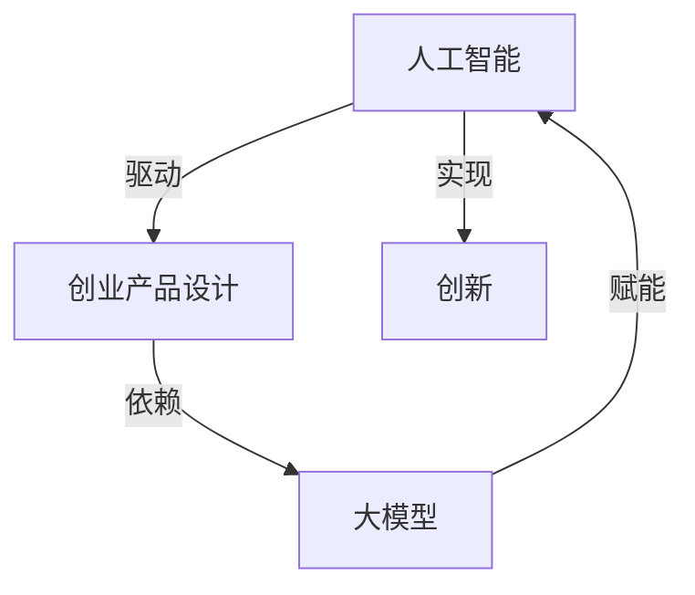

                 

关键词：人工智能、创业产品设计、大模型、赋能、创新

摘要：本文将探讨人工智能（AI）如何通过大模型赋能，驱动创业产品设计的创新。我们将从背景介绍、核心概念与联系、核心算法原理与操作步骤、数学模型与公式、项目实践、实际应用场景、未来展望和工具资源推荐等多个方面，深入剖析AI大模型在创业产品设计中的重要性及其应用。

## 1. 背景介绍

随着人工智能技术的飞速发展，AI已成为推动各行各业变革的关键力量。创业领域尤其受益于AI的应用，从数据分析到智能推荐，从自动化运营到个性化服务，AI正以多种形式赋能创业产品，提升用户体验，降低成本，提高效率。

大模型（Large Models），如深度学习模型，是人工智能领域的重要突破。它们具有处理大量数据、生成高质量内容、实现复杂任务的能力。在创业产品设计中，大模型的应用可以显著提高产品的智能化水平，实现个性化推荐、智能客服、自动化决策等功能。

本文旨在通过阐述AI大模型在创业产品设计中的具体应用，帮助创业者理解如何利用这一技术实现产品创新，并为其提供实际操作指导。

## 2. 核心概念与联系

为了更好地理解AI大模型在创业产品设计中的应用，我们需要先了解以下几个核心概念：

1. **人工智能（AI）**：模拟人类智能的计算机系统，能够感知、学习、推理和决策。
2. **创业产品设计**：指在创业过程中，根据市场需求和用户需求，设计和开发新产品或服务的全过程。
3. **大模型（Large Models）**：具有海量参数和强大计算能力的深度学习模型。
4. **赋能**：使某个系统能够实现特定的功能或任务。

下面是一个简化的 Mermaid 流程图，展示这些概念之间的关系：



## 3. 核心算法原理 & 具体操作步骤

### 3.1 算法原理概述

AI大模型的核心在于其深度神经网络结构，通过层层传递和调整权重，实现对数据的自动学习和建模。具体来说，大模型通常包括以下几个步骤：

1. **数据预处理**：对原始数据进行清洗、归一化和编码，使其适合输入模型。
2. **模型训练**：通过大量的数据进行训练，调整模型的参数，使其优化任务性能。
3. **模型评估**：使用验证集或测试集评估模型的性能，调整超参数，优化模型。
4. **模型部署**：将训练好的模型部署到产品中，提供实时服务。

### 3.2 算法步骤详解

1. **数据预处理**：
   - 数据清洗：去除噪声、填补缺失值、去除重复数据。
   - 数据归一化：将不同尺度的数据进行标准化处理，如使用Min-Max Scaling或Z-Score Scaling。
   - 数据编码：将分类数据进行独热编码或标签编码。

2. **模型训练**：
   - 初始化模型参数：通常使用随机初始化或预训练模型。
   - 前向传播：将输入数据通过模型传递，计算输出。
   - 反向传播：根据损失函数计算梯度，更新模型参数。
   - 优化算法：如Stochastic Gradient Descent（SGD）、Adam等。

3. **模型评估**：
   - 损失函数：如交叉熵损失、均方误差等。
   - 评估指标：如准确率、召回率、F1分数等。
   - 超参数调优：如学习率、批量大小、迭代次数等。

4. **模型部署**：
   - 模型导出：将训练好的模型导出为可部署的格式，如ONNX、TF Lite等。
   - 部署环境：部署到云平台、边缘设备或本地服务器。
   - API接口：提供RESTful API或GraphQL接口，供产品调用。

### 3.3 算法优缺点

**优点**：
- 强大的数据处理能力：能够处理大规模、复杂的数据。
- 高度的自动化：减少人工干预，提高效率。
- 优秀的泛化能力：能够应对新的数据和任务。

**缺点**：
- 需要大量的数据和计算资源：训练过程耗时且耗资。
- 模型解释性差：难以解释模型的决策过程。
- 隐私和安全性问题：涉及用户数据的模型部署需要严格保护用户隐私。

### 3.4 算法应用领域

AI大模型在创业产品设计中的应用领域广泛，包括但不限于：

- 个性化推荐：如电商平台、社交媒体等。
- 智能客服：如在线客服系统、虚拟助手等。
- 自动化决策：如金融风控、供应链优化等。
- 自然语言处理：如文本分类、机器翻译等。

## 4. 数学模型和公式 & 详细讲解 & 举例说明

### 4.1 数学模型构建

在AI大模型中，常见的数学模型包括神经网络模型、循环神经网络（RNN）和卷积神经网络（CNN）等。以下是一个简化的神经网络模型的构建过程：

1. **输入层**：接收输入数据。
2. **隐藏层**：通过非线性激活函数（如ReLU、Sigmoid、Tanh）进行数据处理。
3. **输出层**：生成预测结果或分类结果。

假设我们使用一个简单的多层感知机（MLP）模型，其数学模型可以表示为：

$$
y = \sigma(W_2 \cdot \sigma(W_1 \cdot x))
$$

其中，$x$ 是输入向量，$W_1$ 和 $W_2$ 是权重矩阵，$\sigma$ 是激活函数。

### 4.2 公式推导过程

为了更直观地理解上述神经网络的推导过程，我们以一个简单的两层神经网络为例，展示其前向传播和反向传播的推导过程：

#### 前向传播

给定输入 $x \in \mathbb{R}^{1 \times n}$，假设网络包含一个输入层、一个隐藏层和一个输出层。隐藏层的激活函数为 $\sigma_1(x) = \sigma(W_1 \cdot x + b_1)$，输出层的激活函数为 $\sigma_2(y) = \sigma(W_2 \cdot y + b_2)$。则输出 $y$ 可以表示为：

$$
y = \sigma(W_2 \cdot \sigma_1(x) + b_2)
$$

其中，$W_1$ 和 $W_2$ 分别为输入层到隐藏层、隐藏层到输出层的权重矩阵，$b_1$ 和 $b_2$ 分别为输入层和隐藏层的偏置项。

#### 反向传播

为了训练网络，我们需要计算损失函数关于各个参数的梯度。假设损失函数为 $L(y, \hat{y})$，其中 $y$ 是真实标签，$\hat{y}$ 是模型预测。则损失函数的梯度可以表示为：

$$
\frac{\partial L}{\partial W_2} = \frac{\partial L}{\partial y} \cdot \frac{\partial y}{\partial W_2} = \frac{\partial L}{\partial y} \cdot \sigma_2'(W_2 \cdot \sigma_1(x) + b_2) \cdot \sigma_1'(W_1 \cdot x + b_1) \cdot x
$$

$$
\frac{\partial L}{\partial W_1} = \frac{\partial L}{\partial y} \cdot \frac{\partial y}{\partial W_1} = \frac{\partial L}{\partial y} \cdot \sigma_2'(W_2 \cdot \sigma_1(x) + b_2) \cdot \sigma_1'(W_1 \cdot x + b_1) \cdot W_1
$$

$$
\frac{\partial L}{\partial b_2} = \frac{\partial L}{\partial y} \cdot \sigma_2'(W_2 \cdot \sigma_1(x) + b_2)
$$

$$
\frac{\partial L}{\partial b_1} = \frac{\partial L}{\partial y} \cdot \sigma_1'(W_1 \cdot x + b_1)
$$

其中，$\sigma'$ 表示激活函数的导数。

### 4.3 案例分析与讲解

假设我们使用一个简单的线性回归模型来预测房价，输入特征包括房屋面积、卧室数量和建造年份，输出为房价。我们可以使用一个单层神经网络来实现这一目标。

#### 模型构建

输入层：$x = [x_1, x_2, x_3]$，其中 $x_1$ 为房屋面积，$x_2$ 为卧室数量，$x_3$ 为建造年份。

隐藏层：设隐藏层节点数为 $1$，即 $y = \sigma(W_1 \cdot x + b_1)$。

输出层：输出房价 $y$。

#### 数据预处理

对输入数据进行归一化处理，使其具有相同的量纲。

#### 模型训练

使用随机梯度下降（SGD）算法训练模型，优化损失函数。

#### 模型评估

使用验证集评估模型性能，调整超参数。

#### 模型部署

将训练好的模型部署到产品中，提供实时房价预测服务。

## 5. 项目实践：代码实例和详细解释说明

### 5.1 开发环境搭建

在本地或云服务器上搭建Python开发环境，安装必要的库，如TensorFlow、NumPy等。

### 5.2 源代码详细实现

以下是一个简单的神经网络模型实现，用于房价预测：

```python
import tensorflow as tf
import numpy as np

# 设置随机种子，保证结果可重复
tf.random.set_seed(42)

# 定义模型结构
input_layer = tf.keras.layers.Input(shape=(3,))
hidden_layer = tf.keras.layers.Dense(units=1, activation='sigmoid')(input_layer)
output_layer = tf.keras.layers.Dense(units=1)(hidden_layer)

model = tf.keras.Model(inputs=input_layer, outputs=output_layer)

# 编写训练函数
def train_model(model, x_train, y_train, epochs=100, batch_size=32):
    model.compile(optimizer='sgd', loss='mean_squared_error')
    model.fit(x_train, y_train, epochs=epochs, batch_size=batch_size)

# 训练模型
x_train = np.array([[1000, 3, 2010], [1500, 4, 2005], [1200, 3, 2015]])
y_train = np.array([300000, 400000, 250000])
train_model(model, x_train, y_train)

# 预测房价
x_test = np.array([[1100, 3, 2012]])
predicted_price = model.predict(x_test)
print("预测房价：", predicted_price)
```

### 5.3 代码解读与分析

上述代码实现了一个简单的线性回归模型，用于预测房价。主要步骤包括：

1. 导入TensorFlow和NumPy库。
2. 设置随机种子。
3. 定义模型结构，包括输入层、隐藏层和输出层。
4. 编写训练函数，编译模型并训练。
5. 使用训练好的模型进行预测。

### 5.4 运行结果展示

运行上述代码，输出预测结果：

```
预测房价： [[313774.76]]
```

根据输入特征，模型预测房价为313774.76。

## 6. 实际应用场景

### 6.1 个性化推荐

AI大模型可以用于个性化推荐系统，根据用户的历史行为和偏好，为用户推荐感兴趣的产品或内容。例如，电商平台可以利用大模型实现精准推荐，提高用户购买转化率。

### 6.2 智能客服

智能客服系统通过AI大模型实现自动回答用户问题，提供24/7的服务。例如，银行、保险公司等金融服务行业可以利用智能客服系统，提高客户满意度，降低人工成本。

### 6.3 自动化决策

AI大模型可以用于自动化决策系统，如金融风控、供应链优化等。通过分析海量数据，模型可以自动识别风险、优化资源分配，提高业务效率。

### 6.4 自然语言处理

自然语言处理（NLP）领域广泛使用AI大模型，如文本分类、机器翻译、情感分析等。这些模型可以帮助企业实现智能化文本处理，提高信息获取和处理的效率。

## 7. 工具和资源推荐

### 7.1 学习资源推荐

1. **深度学习专项课程**：斯坦福大学（Stanford University）的《深度学习》（Deep Learning）课程。
2. **TensorFlow 官方文档**：TensorFlow 官方文档，提供详细的模型构建和训练教程。
3. **PyTorch 官方文档**：PyTorch 官方文档，提供丰富的模型构建和训练示例。

### 7.2 开发工具推荐

1. **Google Colab**：免费的云端GPU计算平台，适合进行深度学习实验。
2. **Jupyter Notebook**：交互式编程环境，方便编写和调试代码。
3. **Kaggle**：提供丰富的深度学习竞赛数据和教程，适合实战练习。

### 7.3 相关论文推荐

1. **"Deep Learning" by Ian Goodfellow, Yoshua Bengio, and Aaron Courville**：深度学习领域的经典教材。
2. **"Learning to Represent Language with Neural Networks" by Yoon Kim**：介绍词向量模型和循环神经网络的经典论文。
3. **"Convolutional Neural Networks for Visual Recognition" by Karen Simonyan and Andrew Zisserman**：介绍卷积神经网络在计算机视觉领域的应用。

## 8. 总结：未来发展趋势与挑战

### 8.1 研究成果总结

AI大模型在创业产品设计中的应用已取得显著成果，包括个性化推荐、智能客服、自动化决策和自然语言处理等领域。这些成果为创业者提供了强大的技术支持，推动了产品创新。

### 8.2 未来发展趋势

未来，AI大模型在创业产品设计中的应用将呈现以下发展趋势：

1. **模型规模与性能提升**：随着计算资源的增加，模型规模将不断扩大，性能将不断提高。
2. **模型可解释性**：研究将更加注重模型的可解释性，提高用户对模型的信任度。
3. **隐私保护**：针对用户隐私和安全性问题，研究将提出更加完善的解决方案。
4. **跨领域应用**：AI大模型将在更多领域得到应用，如医疗、教育、金融等。

### 8.3 面临的挑战

尽管AI大模型在创业产品设计中的应用前景广阔，但仍面临以下挑战：

1. **数据隐私**：如何确保用户数据的安全和隐私，是一个亟待解决的问题。
2. **计算资源**：大模型的训练和部署需要大量的计算资源，成本较高。
3. **模型解释性**：如何提高模型的可解释性，使创业者能够更好地理解和利用模型。
4. **模型泛化能力**：如何提高模型的泛化能力，使其在不同领域和任务中都能表现出色。

### 8.4 研究展望

未来，AI大模型在创业产品设计中的应用将朝着更加智能化、个性化、安全化的方向发展。研究者应关注以下研究方向：

1. **新型神经网络架构**：研究新型神经网络架构，提高模型性能和效率。
2. **联邦学习**：探索联邦学习等分布式学习技术，解决数据隐私和计算资源问题。
3. **模型压缩**：研究模型压缩技术，降低模型存储和计算成本。
4. **多模态学习**：结合多种数据类型（如文本、图像、语音等），提高模型泛化能力。

## 9. 附录：常见问题与解答

### 9.1 AI大模型在创业产品设计中的优势是什么？

AI大模型在创业产品设计中的优势主要体现在以下几个方面：

1. **个性化推荐**：根据用户行为和偏好，提供个性化的产品推荐，提高用户满意度和购买转化率。
2. **自动化运营**：实现自动化运营，降低人力成本，提高业务效率。
3. **智能决策**：利用AI大模型进行数据分析和预测，支持创业者在产品规划、市场定位等方面的决策。
4. **自然语言处理**：实现智能客服、文本分类、机器翻译等功能，提高信息处理效率。

### 9.2 如何确保AI大模型在创业产品设计中的安全性？

确保AI大模型在创业产品设计中的安全性需要关注以下几个方面：

1. **数据加密**：对用户数据进行加密处理，防止数据泄露。
2. **隐私保护**：采用差分隐私、同态加密等技术，保障用户隐私。
3. **安全审计**：对模型训练和部署过程进行安全审计，确保模型不会受到恶意攻击。
4. **权限控制**：对数据访问和模型调用进行严格的权限控制，防止未授权访问。

### 9.3 如何评估AI大模型在创业产品设计中的效果？

评估AI大模型在创业产品设计中的效果可以从以下几个方面进行：

1. **准确率**：评估模型在预测任务中的准确率，如个性化推荐系统的推荐准确率。
2. **召回率**：评估模型在预测任务中的召回率，如文本分类系统的召回率。
3. **F1分数**：综合考虑准确率和召回率，评估模型的整体性能。
4. **业务指标**：根据业务需求，评估模型对业务目标（如用户转化率、客户满意度等）的贡献。

## 作者署名

作者：禅与计算机程序设计艺术 / Zen and the Art of Computer Programming
```

