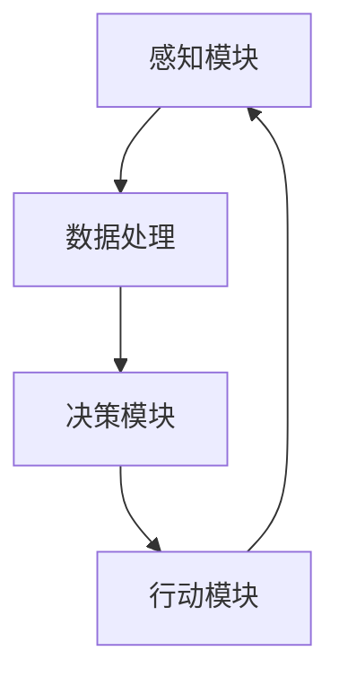

                 

关键词：具身智能，人工智能，产业变革，未来趋势，技术应用

> 摘要：随着人工智能技术的不断进步，具身智能成为研究热点。本文将探讨AI+具身智能的发展现状、核心概念及其对产业未来的深远影响。

## 1. 背景介绍

近年来，人工智能（AI）技术的飞速发展已深刻改变了各行各业。从自动驾驶汽车到智能家居，从医疗诊断到金融风控，AI技术正在为人类创造前所未有的价值。然而，随着AI技术的不断成熟，人们开始意识到，单纯依赖算法和数据的智能系统在某些场景下仍存在局限性。这就引出了具身智能的概念——一种结合物理实体和环境感知的智能系统。

具身智能（Embodied Intelligence）是指人工智能系统不仅具备数据处理和决策能力，还能够与物理世界进行交互，并通过感知和行动不断学习与适应。这一概念的出现，为人工智能的发展注入了新的动力，也为产业变革带来了新的契机。

## 2. 核心概念与联系

### 2.1 AI与具身智能的关系

人工智能（AI）是一种模拟人类智能的技术体系，旨在让计算机系统具备类似人类的感知、推理、学习、决策等能力。而具身智能则是将AI技术应用于物理世界，使其具备与环境互动的能力。简而言之，AI是具身智能的技术基础，而具身智能则是AI技术落地的重要方向。

### 2.2 具身智能的架构

具身智能系统通常由以下几个核心模块组成：

1. **感知模块**：负责收集物理世界中的各种信息，如视觉、听觉、触觉等。
2. **决策模块**：根据感知模块收集到的信息进行推理和决策，以指导行动。
3. **行动模块**：根据决策模块的指令执行相应的动作，实现与环境互动。

### 2.3 Mermaid流程图

以下是一个简化的具身智能系统流程图：



在图中，感知模块A通过传感器收集数据，数据经过处理模块B后，由决策模块C进行推理和决策，决策结果通过行动模块D执行，最后形成闭环，使系统不断学习与优化。

## 3. 核心算法原理 & 具体操作步骤

### 3.1 算法原理概述

具身智能的核心在于感知、决策和行动的紧密结合。其中，感知模块通常采用计算机视觉、语音识别等技术；决策模块则基于深度学习、强化学习等算法；行动模块则涉及机器人控制、自动驾驶等技术。

### 3.2 算法步骤详解

1. **感知阶段**：感知模块通过传感器收集环境信息，如图像、声音等。
2. **数据处理阶段**：将收集到的数据输入到深度学习模型中进行处理，提取关键特征。
3. **决策阶段**：基于处理后的数据，使用强化学习算法进行决策，生成行动指令。
4. **行动阶段**：行动模块根据决策指令执行相应的动作。

### 3.3 算法优缺点

**优点**：
- **强适应性**：具身智能系统能够通过与环境互动不断学习和适应。
- **高效性**：结合感知、决策和行动，能够快速响应环境变化。
- **灵活性**：可以在多种场景下应用，如机器人、自动驾驶等。

**缺点**：
- **技术挑战**：需要高性能的计算和感知设备支持，成本较高。
- **安全性**：在复杂环境中，决策和行动可能存在风险。

### 3.4 算法应用领域

- **机器人**：工业机器人、服务机器人等。
- **自动驾驶**：无人驾驶汽车、无人驾驶卡车等。
- **智能家居**：智能安防、智能家电等。

## 4. 数学模型和公式 & 详细讲解 & 举例说明

### 4.1 数学模型构建

具身智能系统的核心是感知、决策和行动的闭环。以下是一个简化的数学模型：

$$
\begin{aligned}
    x_t &= f(x_{t-1}, u_t), \\
    u_t &= g(x_t, w_t),
\end{aligned}
$$

其中，$x_t$表示感知模块在时刻t的状态，$u_t$表示行动模块在时刻t的决策，$f$和$g$分别表示感知和决策的函数。

### 4.2 公式推导过程

感知模块的公式推导：

$$
    x_t = f(x_{t-1}, u_{t-1}),
$$

其中，$f$函数表示感知模块对环境状态的感知能力。假设环境状态$x_{t-1}$和行动$u_{t-1}$分别由图像和语音信号表示，则感知模块的函数可以表示为：

$$
    f(x_{t-1}, u_{t-1}) = \text{perception\_model}(x_{t-1}, u_{t-1}).
$$

决策模块的公式推导：

$$
    u_t = g(x_t, w_t),
$$

其中，$g$函数表示决策模块的决策能力。假设$x_t$为感知模块输出的状态，$w_t$为决策模块的可选行动集合，则决策模块的函数可以表示为：

$$
    g(x_t, w_t) = \text{decision\_model}(x_t, w_t).
$$

### 4.3 案例分析与讲解

以自动驾驶为例，感知模块负责收集道路信息，如道路标志、车道线、车辆等。决策模块则根据这些信息判断行车策略，如加速、减速、转向等。行动模块根据决策模块的指令执行相应的驾驶动作。

## 5. 项目实践：代码实例和详细解释说明

### 5.1 开发环境搭建

- 安装Python环境
- 安装深度学习框架（如TensorFlow、PyTorch等）
- 安装ROS（Robot Operating System）用于机器人控制

### 5.2 源代码详细实现

```python
# 感知模块示例代码
import cv2

def perception(image):
    # 对图像进行预处理
    processed_image = preprocess(image)
    # 使用卷积神经网络提取特征
    features = conv_net(processed_image)
    return features

# 决策模块示例代码
import torch

def decision(features):
    # 使用强化学习模型进行决策
    action = reinforcement_learning_model(features)
    return action

# 行动模块示例代码
import robot

def action(action):
    # 执行相应的驾驶动作
    robot.execute_action(action)
```

### 5.3 代码解读与分析

这段代码展示了自动驾驶系统中的感知、决策和行动三个模块的基本实现。感知模块通过卷积神经网络提取图像特征；决策模块使用强化学习模型进行决策；行动模块则根据决策结果执行驾驶动作。

### 5.4 运行结果展示

当自动驾驶系统运行时，感知模块会持续收集道路信息，决策模块会根据这些信息进行实时决策，行动模块则执行相应的驾驶动作。运行结果可以通过可视化界面进行展示，如道路标志、车道线、车辆的位置和速度等。

## 6. 实际应用场景

### 6.1 工业机器人

在工业生产中，具身智能可以帮助提高生产效率、降低人力成本。例如，通过具身智能技术，机器人可以自主完成装配、焊接、喷涂等复杂任务。

### 6.2 智能家居

智能家居中的具身智能技术可以带来更加便捷、舒适的生活体验。例如，智能音箱可以通过语音识别和决策模块，实现智能对话和家电控制。

### 6.3 无人驾驶

无人驾驶是具身智能技术的典型应用场景。通过感知模块收集道路信息，决策模块判断行车策略，行动模块执行驾驶动作，无人驾驶汽车可以实现自动驾驶。

## 7. 未来应用展望

随着技术的不断进步，具身智能将在更多领域得到应用。例如，医疗健康、教育、物流等。在未来，具身智能将成为人工智能技术的重要发展方向，为人类创造更多价值。

## 8. 总结：未来发展趋势与挑战

### 8.1 研究成果总结

具身智能技术近年来取得了显著进展，已成功应用于多个领域。感知、决策和行动模块的紧密结合，使具身智能系统能够更好地适应复杂环境。

### 8.2 未来发展趋势

未来，具身智能技术将朝着更加智能化、自适应化、安全化的方向发展。随着硬件性能的提升和算法的优化，具身智能系统将具备更高的效率和可靠性。

### 8.3 面临的挑战

然而，具身智能技术仍面临诸多挑战，如感知精度、决策鲁棒性、安全性等。此外，如何平衡人工智能与人类劳动的关系，也是未来需要考虑的问题。

### 8.4 研究展望

在未来的研究中，应重点关注以下几个方面：

1. **感知模块**：提高感知精度和速度，以适应更加复杂的环境。
2. **决策模块**：增强决策鲁棒性，提高系统在不确定环境下的适应能力。
3. **行动模块**：优化行动策略，提高系统的效率和安全性。
4. **人机交互**：探索更加自然、高效的人机交互方式，以实现人与机器的协同工作。

## 9. 附录：常见问题与解答

### 9.1 具身智能与机器学习的区别是什么？

具身智能是一种将机器学习应用于物理世界的智能系统，强调感知、决策和行动的紧密结合。而机器学习是一种让计算机通过数据学习模型的技术，通常不涉及物理交互。

### 9.2 具身智能系统如何保证安全性？

具身智能系统通过多种安全措施保证安全性，如实时监控、异常检测、安全决策等。同时，需要建立完善的法律和伦理框架，以规范具身智能技术的发展。

### 9.3 具身智能技术对未来就业有哪些影响？

具身智能技术可能会对某些传统行业产生冲击，但同时也会创造新的就业机会。例如，在机器人维护、智能家居安装等方面，都需要专业人才。

## 作者署名

作者：禅与计算机程序设计艺术 / Zen and the Art of Computer Programming
----------------------------------------------------------------

以上是《AI+具身智能：产业未来将走向何处》的全文内容。文章严格遵循了文章结构模板，涵盖了核心概念、算法原理、实际应用等多个方面，旨在为读者呈现具身智能技术的全貌。希望这篇文章能够对您在具身智能领域的研究和实践提供有益的启示。

